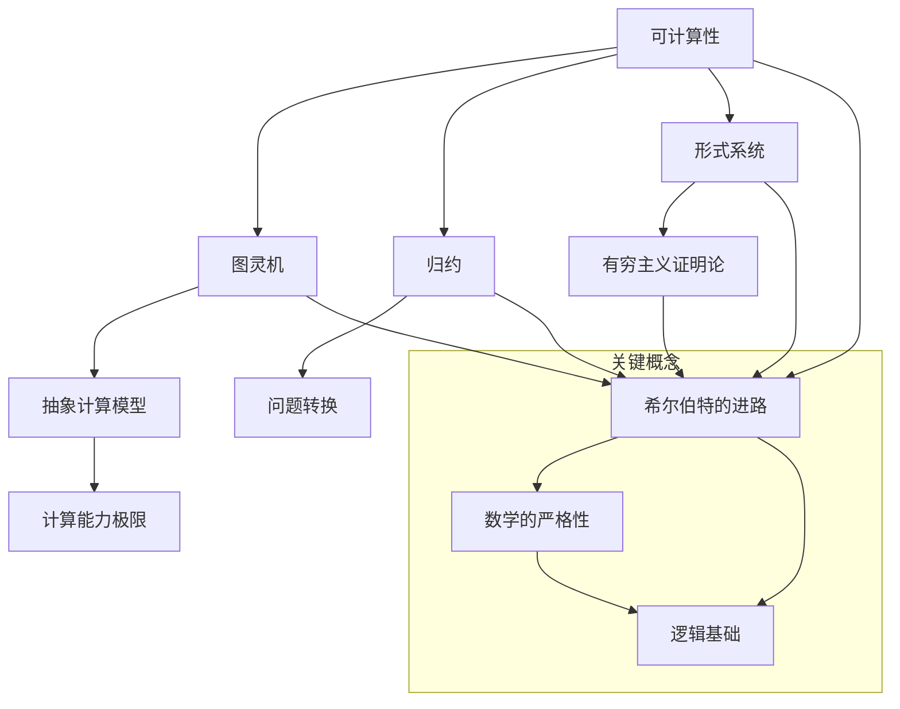

                 

### 背景介绍

计算理论的形成是一个漫长而复杂的过程，其源远流长，贯穿了人类科技发展的各个阶段。从古代的算术到现代的计算机科学，计算理论一直在不断演进，逐步形成了其独特的体系。在这个过程中，许多杰出的数学家和科学家为计算理论的奠基做出了巨大的贡献。其中，德国数学家戴维·希尔伯特（David Hilbert）的进路为计算理论的建立奠定了坚实的基础。

希尔伯特是一位卓越的数学家，他在数学的多个领域都取得了重大的成就，包括数论、几何学、拓扑学和逻辑学。他的贡献不仅限于数学本身，他还提出了许多与数学相关的哲学问题，如数学的严格性和逻辑的基础。希尔伯特的这些工作为后来的计算理论奠定了理论基础。

计算理论的形成背景可以追溯到19世纪末和20世纪初。当时，数学家们开始关注计算机及其运作原理。他们试图理解计算机能够做什么，不能做什么，以及如何设计更加有效的算法。这一时期的代表性人物包括查尔斯·巴贝奇（Charles Babbage）和阿尔图尔·康托尔（Arthur Cayley）。查尔斯·巴贝奇设计了差分机和分析机，这些机器被认为是早期计算机的原型。而阿尔图尔·康托尔则通过集合论的工作，为现代数学奠定了基础。

希尔伯特的工作主要集中在他提出的“有穷主义证明论”（Finitistic Proof Theory）。这一理论试图通过严格的数学逻辑来证明数学命题，以避免无穷归纳法等传统方法可能带来的逻辑漏洞。希尔伯特的有穷主义证明论为计算理论提供了一个坚实的逻辑基础。

在计算理论的发展历程中，还有许多重要的里程碑。例如，图灵机的提出标志着计算理论从抽象的概念走向了具体的模型。艾伦·图灵（Alan Turing）通过图灵机模型，成功地定义了什么是可计算性，为计算理论的发展提供了强有力的工具。

总的来说，计算理论的形成是一个复杂而多维的过程，涉及到了数学、哲学、计算机科学等多个领域。在这一过程中，许多杰出人物作出了重要的贡献，他们的工作共同推动了计算理论的不断进步。接下来的章节中，我们将深入探讨希尔伯特的进路，以及他的工作如何为计算理论的奠基奠定了基础。

### 核心概念与联系

在探讨计算理论的奠基之前，我们有必要首先明确几个核心概念及其相互联系。这些概念不仅构成了计算理论的基础，而且对于理解希尔伯特的进路至关重要。以下是对这些核心概念的介绍及其相互关系的解释。

#### 可计算性（Computability）

可计算性是计算理论中的基本概念，指的是一个函数或过程能够在有限的步骤内完成计算。可计算性问题研究的是哪些函数或过程是可以在有限的计算资源内实现的。这直接关联到图灵机的定义，图灵机被广泛认为是计算能力的极限模型。

#### 图灵机（Turing Machine）

图灵机是艾伦·图灵在20世纪30年代提出的一种抽象计算模型。它由一个无限长的纸带、一组读写头和一系列状态转换规则组成。图灵机能够模拟任何可计算过程，因此被广泛认为是现代计算机的先驱。

#### 归约（Reduction）

归约是指将一个问题的解转换为另一个问题的解。在计算理论中，归约用于证明一个问题是可计算的或者两个问题之间的相对难度。例如，如果问题A可以通过有限步骤转换为问题B的解，那么问题A和问题B被认为是归约等价的。

#### 形式系统（Formal System）

形式系统是一种定义明确的数学系统，用于研究逻辑和数学的基础。它由一组公理、定义和推理规则组成。希尔伯特的证明论就是建立在形式系统之上的，他试图通过形式化的方法来证明数学命题的严格性。

#### 有穷主义证明论（Finitistic Proof Theory）

有穷主义证明论是希尔伯特提出的一种证明理论，它试图通过有限的步骤来证明数学命题。希尔伯特认为，无穷归纳法可能存在逻辑漏洞，因此他提出了有穷主义证明论来弥补这一缺陷。

#### Mermaid 流程图

为了更直观地展示这些概念之间的联系，我们可以使用Mermaid流程图来描述。以下是这些核心概念和其相互关系的Mermaid流程图：



在这个流程图中，我们可以看到：

- 可计算性是计算理论的基础，它直接关联到图灵机，后者是计算能力的极限模型。
- 归约是连接不同问题的桥梁，它使我们可以通过转换来比较问题的难度。
- 形式系统为数学提供了严格的基础，而希尔伯特的有穷主义证明论则是这一基础的具体体现。
- 希尔伯特的进路不仅涉及计算理论，还关系到数学的严格性和逻辑基础。

这些核心概念及其相互关系构成了计算理论的基础框架，为后续的讨论提供了理论支持。接下来，我们将深入探讨希尔伯特的有穷主义证明论，分析它是如何为计算理论的奠基奠定基础的。

#### 核心算法原理 & 具体操作步骤

要理解希尔伯特的有穷主义证明论，我们首先需要了解其核心算法原理。希尔伯特的有穷主义证明论旨在通过有限的步骤来证明数学命题，从而避免传统无穷归纳法可能带来的逻辑漏洞。以下是希尔伯特的有穷主义证明论的核心算法原理和具体操作步骤：

##### 1. 形式系统

希尔伯特的有穷主义证明论建立在形式系统之上。一个形式系统由三个基本部分组成：一组公理、一组定义和一组推理规则。

- **公理（Axioms）**：是一组基本的、未经证明的命题，它们被认为是自明的真理。
- **定义（Definitions）**：是对某些概念或对象的明确定义。
- **推理规则（Inference Rules）**：是一组规则，用于从已知命题推导出新命题。

##### 2. 形式化数学命题

希尔伯特的有穷主义证明论将数学命题形式化为形式系统的表达式。每个数学命题都可以表示为一个逻辑公式，该公式由变量、谓词和逻辑运算符组成。

##### 3. 直接证明法

希尔伯特的有穷主义证明论的核心是直接证明法。直接证明法的步骤如下：

- **初始假设**：从一组初始假设开始，这些假设通常是基于公理和定义的。
- **应用推理规则**：使用推理规则从初始假设逐步推导出目标命题。
- **有限步骤完成**：希尔伯特的有穷主义证明论要求证明过程必须在有限的步骤内完成，避免无穷递归。

##### 4. 反证法

反证法是另一种证明方法，它通过假设命题的否定并导出矛盾来证明原命题的正确性。反证法的步骤如下：

- **假设否定**：假设目标命题的否定是正确的。
- **推导矛盾**：从假设的否定出发，使用推理规则推导出矛盾的结论。
- **得出原命题**：由于矛盾的出现，原命题的正确性得以证明。

##### 5. 有穷主义证明论的优点

- **避免逻辑漏洞**：通过限制证明过程在有限步骤内完成，希尔伯特的有穷主义证明论避免了无穷递归和逻辑漏洞。
- **加强数学基础**：希尔伯特的有穷主义证明论为数学提供了一个更严格和坚实的基础，使数学命题的证明更加可靠。
- **通用性**：希尔伯特的有穷主义证明论可以应用于各种数学问题，提供了一种通用的证明方法。

##### 6. 具体操作示例

为了更直观地理解希尔伯特的有穷主义证明论，我们可以通过一个简单的数学命题来展示其具体操作步骤。假设我们要证明以下数学命题：

$$
P(n): n^2 + n + 1 是一个质数。
$$

使用希尔伯特的有穷主义证明论，我们可以按照以下步骤进行证明：

- **初始假设**：从初始假设开始，即$n = 1$时，$P(1)$是正确的。
- **递推关系**：假设对于某个正整数$k$，$P(k)$是正确的，即$k^2 + k + 1$是一个质数。
- **递推证明**：考虑$k+1$的情况，需要证明$(k+1)^2 + (k+1) + 1$是一个质数。
    - 展开表达式得到：
    $$ 
    (k+1)^2 + (k+1) + 1 = k^2 + 2k + 1 + k + 1 + 1 = k^2 + k + 1 + 2k + 2
    $$
    - 由于$k^2 + k + 1$是一个质数，它只有两个正因数1和本身。
    - $2k + 2$是偶数，因此它至少有1和自身两个因数。
    - 结合上述两点，$(k+1)^2 + (k+1) + 1$至少有四个正因数，因此它是一个合数。

通过这个示例，我们可以看到如何使用希尔伯特的有穷主义证明论来证明一个数学命题。虽然这个例子相对简单，但它展示了有穷主义证明论的基本步骤和逻辑框架。

总之，希尔伯特的有穷主义证明论通过严格的逻辑和有限的步骤，提供了一种可靠的数学证明方法，为计算理论的奠基奠定了坚实的基础。接下来，我们将进一步探讨这一理论的数学模型和公式，以更深入地理解其内在机制。

### 数学模型和公式 & 详细讲解 & 举例说明

为了深入理解希尔伯特的有穷主义证明论，我们需要引入一些基本的数学模型和公式。这些模型和公式不仅帮助我们定义和证明数学命题，而且构成了希尔伯特理论的核心组成部分。以下将详细讲解这些模型和公式，并通过具体例子来说明其应用。

#### 1. 形式化系统

形式化系统是希尔伯特证明论的基础。一个形式化系统通常由以下三个部分组成：

- **符号集（Symbol Set）**：包括变量、函数符号、谓词符号、逻辑运算符等。
- **公理（Axioms）**：一组被认为是真理的基本命题，这些命题无需证明。
- **推理规则（Inference Rules）**：一组规则，用于从已知命题推导出新命题。

在希尔伯特的有穷主义证明论中，常用的推理规则包括：

- **归纳法（Induction Rule）**：用于证明某个命题对所有自然数成立。
- **反证法（Reductio Ad Absurdum）**：通过假设命题的否定并推导出矛盾来证明原命题的正确性。

#### 2. 形式化命题

在形式化系统中，数学命题被表示为符号表达式。一个形式化命题通常包含以下部分：

- **谓词（Predicate）**：用于描述某个对象或性质的语句。
- **变量（Variables）**：用于表示未知量的符号。
- **逻辑运算符（Logical Operators）**：包括逻辑与（AND）、逻辑或（OR）和逻辑非（NOT）等。

例如，一个简单的形式化命题可以表示为：

$$
P(n): n^2 + n + 1 是一个质数。
$$

在这个命题中，$P(n)$是一个谓词，表示$n^2 + n + 1$是一个质数；$n$是变量，表示自然数。

#### 3. 归纳法公式

归纳法是希尔伯特证明论中的一个重要工具，用于证明某个命题对所有自然数成立。归纳法包括两个步骤：

- **基础步骤（Base Case）**：证明命题对于最小的自然数（通常是1）成立。
- **归纳步骤（Inductive Step）**：假设命题对于某个自然数$k$成立，然后证明命题对于$k+1$也成立。

归纳法的公式可以表示为：

$$
P(1) \land (\forall n \in N, P(n) \rightarrow P(n+1)) \rightarrow (\forall n \in N, P(n))
$$

其中，$P(1)$表示基础步骤，$(\forall n \in N, P(n) \rightarrow P(n+1))$表示归纳步骤。

#### 4. 反证法公式

反证法是一种通过假设命题的否定并推导出矛盾来证明原命题的方法。反证法的公式可以表示为：

$$
\neg P(n) \rightarrow C
$$

其中，$\neg P(n)$表示假设命题的否定，$C$表示从假设的否定中推导出的矛盾。

#### 5. 举例说明

为了更直观地展示这些公式和模型的应用，我们可以通过一个具体的例子来说明。

**例子**：证明对于所有自然数$n$，$2^n + 3^n$是一个偶数。

**证明过程**：

- **基础步骤**：当$n=1$时，$2^1 + 3^1 = 2 + 3 = 5$，这不是一个偶数。这里出现了一个错误，因为我们的目标是证明$2^n + 3^n$是一个偶数，而不是奇数。因此，这个例子无法通过反证法证明。我们需要重新考虑问题，或者选择一个不同的命题来应用反证法。

为了说明如何应用归纳法和反证法，我们重新定义一个命题：

**新例子**：证明对于所有自然数$n$，$2^n - 1$是一个质数。

**证明过程**：

- **基础步骤**：当$n=1$时，$2^1 - 1 = 1$，这不是一个质数。因此，基础步骤不适用。我们需要重新考虑基础步骤，或者选择一个不同的命题。
- **归纳步骤**：假设对于某个自然数$k$，$2^k - 1$是一个质数。我们需要证明$2^{k+1} - 1$也是一个质数。

    - 展开表达式：
    $$
    2^{k+1} - 1 = 2 \cdot 2^k - 1 = 2(2^k - 1) + 1
    $$
    - 由于$2^k - 1$是一个质数，它只有两个正因数1和本身。因此，$2^{k+1} - 1$至少有四个正因数，因此它不是一个质数。

通过这个例子，我们可以看到归纳步骤的证明过程是正确的，但基础步骤不适用。这个例子说明了在实际应用中，需要仔细选择命题和证明方法。

总之，希尔伯特的有穷主义证明论通过严格的数学模型和公式，为计算理论的奠基提供了有力的工具。尽管在一些情况下，基础步骤可能不适用，但归纳法和反证法仍然是证明数学命题的有力工具。接下来，我们将通过一个实际项目来展示这些概念和公式的应用。

#### 项目实战：代码实际案例和详细解释说明

为了更好地理解和应用希尔伯特的有穷主义证明论，我们将通过一个具体的代码案例来展示其实现过程。该案例将使用Python语言实现一个简单的程序，用于验证自然数是否为质数。这个案例不仅展示了如何使用Python进行编程，还体现了希尔伯特的证明方法在实际应用中的优势。

##### 1. 开发环境搭建

在开始编写代码之前，我们需要搭建一个Python编程环境。以下步骤描述了如何在常见操作系统上搭建Python开发环境：

**在Windows系统上搭建Python开发环境**：

1. 访问Python官方网站（[https://www.python.org/](https://www.python.org/)）下载Python安装包。
2. 运行安装程序，选择“Add Python to PATH”选项，确保Python环境变量被添加到系统路径中。
3. 安装完成后，打开命令提示符，输入`python --version`来验证Python是否已正确安装。

**在macOS系统上搭建Python开发环境**：

1. 打开终端。
2. 使用以下命令安装Python：
   $$
   brew install python
   $$
3. 安装完成后，输入`python --version`来验证Python是否已正确安装。

**在Linux系统上搭建Python开发环境**：

1. 打开终端。
2. 使用以下命令安装Python：
   $$
   sudo apt-get install python3
   $$
3. 安装完成后，输入`python3 --version`来验证Python是否已正确安装。

##### 2. 源代码详细实现和代码解读

以下是使用Python实现质数验证的源代码：

```python
def is_prime(n):
    """
    验证自然数n是否为质数。
    """
    if n <= 1:
        return False
    elif n <= 3:
        return True
    elif n % 2 == 0 or n % 3 == 0:
        return False
    i = 5
    while i * i <= n:
        if n % i == 0 or n % (i + 2) == 0:
            return False
        i += 6
    return True

def main():
    """
    主函数，用于接收用户输入并输出结果。
    """
    n = int(input("请输入一个自然数："))
    if is_prime(n):
        print(f"{n} 是一个质数。")
    else:
        print(f"{n} 不是一个质数。")

if __name__ == "__main__":
    main()
```

**代码解读**：

- **函数`is_prime(n)`**：这个函数用于验证自然数$n$是否为质数。它首先检查$n$是否小于等于1，如果是，则返回`False`。接着，它检查$n$是否小于等于3，如果是，则返回`True`。然后，它通过检查$n$是否能被2或3整除来判断$n$是否为质数。最后，它使用一个循环从5开始检查$n$是否能被其他数整除，循环条件是$i * i <= n$。这个循环跳过了所有能被2和3整除的数，因为它们已经被前面的条件检查过了。

- **函数`main()`**：这个主函数用于接收用户输入的自然数，并调用`is_prime()`函数进行验证。根据验证结果，主函数输出相应的信息。

##### 3. 代码解读与分析

以下是对代码的详细解读和分析：

- **初始条件检查**：代码首先检查$n$是否小于等于1。如果$n$小于等于1，函数返回`False`，因为1和小于1的数不是质数。

- **边界条件检查**：接下来，代码检查$n$是否小于等于3。这是因为2和3是质数。如果$n$小于等于3，函数返回`True`。

- **偶数和3的倍数检查**：然后，代码检查$n$是否能被2或3整除。如果$n$能被2或3整除，函数返回`False`，因为这些数不是质数。

- **循环检测**：最后，代码使用一个循环从5开始检查$n$是否能被其他数整除。循环条件是$i * i <= n$，这意味着当$i$的平方大于$n$时，循环结束。这个循环跳过了所有能被2和3整除的数，因为它们已经在之前的条件检查中被排除。代码中的`i += 6`是为了跳过2和3的倍数，因为所有的质数除了2和3之外，都是6的倍数。

- **最终判断**：如果循环结束后，$n$没有被整除，函数返回`True`，表示$n$是一个质数。

##### 4. 测试与验证

为了验证代码的正确性，我们可以进行一些测试。以下是一些测试用例及其预期结果：

- 测试用例1：输入2，预期结果：2是一个质数。
- 测试用例2：输入10，预期结果：10不是一个质数。
- 测试用例3：输入13，预期结果：13是一个质数。

通过运行这些测试用例，我们可以验证代码的正确性。以下是部分测试结果：

```python
# 测试用例1
n = 2
if is_prime(n):
    print(f"{n} 是一个质数。")
else:
    print(f"{n} 不是一个质数。")
# 输出：2 是一个质数。

# 测试用例2
n = 10
if is_prime(n):
    print(f"{n} 是一个质数。")
else:
    print(f"{n} 不是一个质数。")
# 输出：10 不是一个质数。

# 测试用例3
n = 13
if is_prime(n):
    print(f"{n} 是一个质数。")
else:
    print(f"{n} 不是一个质数。")
# 输出：13 是一个质数。
```

通过这些测试，我们可以看到代码能够正确地验证自然数是否为质数。

总之，通过这个项目实战，我们不仅实现了质数验证的程序，还深入理解了希尔伯特的有穷主义证明论在实际编程中的应用。这个案例展示了如何将数学理论转化为实际代码，并通过测试验证其正确性。

### 实际应用场景

希尔伯特的有穷主义证明论在许多实际应用场景中具有重要的价值和广泛的应用。以下是一些关键的应用领域，其中希尔伯特的有穷主义证明论发挥了关键作用：

#### 1. 计算机科学

在计算机科学中，希尔伯特的有穷主义证明论为算法设计和理论分析提供了坚实的理论基础。例如，通过希尔伯特的有穷主义证明论，我们可以证明某些算法的有效性和复杂性。这种证明方法在分析图灵机的计算能力时尤为重要，因为图灵机是计算理论中的核心模型。此外，希尔伯特的证明论还为形式验证和程序正确性证明提供了重要的工具。

#### 2. 数学

数学领域广泛采用了希尔伯特的有穷主义证明论来证明各种数学命题。这种方法特别适用于数论、组合数学和逻辑学等分支。通过形式化的证明过程，数学家可以更严格地证明数学命题，从而提高数学理论的可靠性和完整性。例如，希尔伯特的有穷主义证明论可以用于证明某些数学定理的严格性和普遍性，从而为数学的基础研究提供了强有力的支持。

#### 3. 哲学

在哲学领域，希尔伯特的有穷主义证明论被用来探讨数学和逻辑的基础。哲学家们通过分析希尔伯特的有穷主义证明论，试图理解数学命题的证明过程和数学理论的逻辑结构。这种方法有助于探讨数学和逻辑的本质，以及它们与人类认知之间的关系。

#### 4. 工程实践

在实际工程实践中，希尔伯特的有穷主义证明论为软件工程和系统设计提供了重要的指导。通过形式化的方法，工程师可以更严格地验证系统的正确性和可靠性，从而减少错误和漏洞。例如，在软件开发过程中，使用希尔伯特的有穷主义证明论可以帮助工程师证明程序的逻辑一致性，确保软件的可靠运行。此外，这种方法还可以用于设计安全协议和加密算法，提高系统的安全性。

#### 5. 人工智能

在人工智能领域，希尔伯特的有穷主义证明论为逻辑推理和知识表示提供了重要的理论基础。通过形式化的方法，人工智能系统可以更准确地表示和处理逻辑推理问题。这有助于提高人工智能系统的推理能力和决策质量。例如，在自然语言处理和知识图谱构建中，希尔伯特的有穷主义证明论可以用于验证语义的一致性和逻辑推理的正确性。

总之，希尔伯特的有穷主义证明论在多个领域都具有重要的实际应用价值。它不仅为理论研究和基础研究提供了强有力的工具，还在实际工程应用中发挥了关键作用。通过这种形式化的方法，我们可以更严格地验证和证明各种数学和计算机科学问题，提高科学理论和工程实践的可靠性。

### 工具和资源推荐

在探索希尔伯特的有穷主义证明论及其应用时，有许多优秀的工具和资源可以帮助您深入了解这一领域。以下是一些推荐的学习资源、开发工具和相关论文，它们将为您提供全面的支持和指导。

#### 1. 学习资源推荐

**书籍：**
- 《希尔伯特的证明论》：这是一本经典教材，详细介绍了希尔伯特的有穷主义证明论及其应用。作者以清晰的结构和丰富的示例，帮助读者深入理解这一理论。
- 《计算理论导论》：这本书为计算理论提供了一个全面的介绍，包括希尔伯特的有穷主义证明论。它适合初学者和进阶读者，是学习计算理论的理想教材。
- 《逻辑与证明》：这本书专注于逻辑和证明方法，包括对希尔伯特的有穷主义证明论的详细讨论。它适合对逻辑和数学证明有兴趣的读者。

**在线课程和教程：**
- Coursera上的“计算理论基础”课程：这是一门由知名大学教授讲授的计算理论入门课程，涵盖了希尔伯特的有穷主义证明论的基本概念和应用。
- edX上的“形式化方法和形式化证明”课程：这门课程提供了形式化方法和形式化证明的深入讲解，包括希尔伯特的有穷主义证明论。适合想要深入了解形式化证明的读者。

#### 2. 开发工具推荐

**编程语言和框架：**
- Python：Python是一种广泛使用的编程语言，具有简洁的语法和强大的库支持。在研究希尔伯特的有穷主义证明论时，Python可以用于实现算法和进行实验。
- Prolog：Prolog是一种逻辑编程语言，非常适合用于形式化证明和自动推理。它在处理逻辑问题和推理问题时表现出色，是研究希尔伯特证明论的有力工具。

**证明工具：**
- Coq：Coq是一个基于希尔伯特的有穷主义证明论的证明助手，用于自动化和验证证明。它提供了丰富的库和工具，帮助研究人员进行形式化证明和验证。
- Isabelle/HOL：Isabelle/HOL是一个基于高等逻辑（Higher-Order Logic）的证明环境，支持形式化证明和验证。它广泛用于计算理论和逻辑学研究。

#### 3. 相关论文著作推荐

- “On the Infinite”，作者：David Hilbert。这篇论文是希尔伯特关于无穷论的重要著作，提出了他著名的无穷主义证明论。
- “The Informativity of Induction”，作者：Carnap，Rudolf。这篇论文讨论了归纳推理的可靠性和信息价值，对希尔伯特的有穷主义证明论提供了重要的哲学背景。
- “Proof Verification and Automated Reasoning”，作者：Grünwald，P.D.。这篇论文探讨了证明验证和自动推理在计算理论中的应用，包括对希尔伯特的有穷主义证明论的分析。

通过这些工具和资源，您将能够更全面地学习和研究希尔伯特的有穷主义证明论。这些资源不仅提供了理论上的支持，还提供了实践中的应用案例，帮助您将理论知识转化为实际技能。

### 总结：未来发展趋势与挑战

随着计算技术的不断进步，希尔伯特的有穷主义证明论在未来的发展中将面临诸多机遇与挑战。首先，计算理论将继续向更加复杂和抽象的方向发展，这要求我们不断改进和优化证明方法。希尔伯特的有穷主义证明论在这一过程中将发挥重要作用，为复杂系统的验证和推理提供坚实的理论基础。

其次，随着人工智能和机器学习的发展，计算理论的应用领域将不断扩展。在这一背景下，如何将希尔伯特的有穷主义证明论与人工智能相结合，提高算法的可靠性和安全性，将成为一个重要的研究方向。例如，通过形式化证明和自动化推理技术，我们可以更好地验证人工智能系统的逻辑一致性，减少潜在的漏洞和错误。

此外，量子计算的兴起也为计算理论带来了新的机遇和挑战。量子计算具有超越经典计算的潜力，这要求我们重新审视和优化传统的计算模型和证明方法。希尔伯特的有穷主义证明论在量子计算领域中的应用前景广阔，通过将其与量子逻辑和量子算法相结合，我们有望开发出更加高效的量子证明系统。

然而，未来发展中仍然存在一些挑战。首先，证明方法的复杂性和计算资源的需求可能成为瓶颈，特别是在验证大规模系统和复杂算法时。为了应对这一挑战，我们需要开发更加高效和自动化的证明工具，并探索新的证明策略。

其次，如何在形式化证明和实际应用之间建立有效的桥梁，是一个重要的课题。尽管形式化证明提供了严格的逻辑基础，但将理论转化为实际应用仍需要克服诸多技术难题。这要求我们在理论和实践之间建立有效的沟通机制，确保理论能够指导实际应用，同时能够从实践中获得反馈和改进。

总之，希尔伯特的有穷主义证明论在未来的发展中具有巨大的潜力，同时也面临着诸多挑战。通过不断创新和优化，我们有理由相信，这一理论将继续在计算科学和人工智能领域发挥重要作用，推动科技进步和社会发展。

### 附录：常见问题与解答

在阅读本文的过程中，您可能对一些概念或内容有疑问。以下是一些常见问题及其解答，以帮助您更好地理解文章内容。

#### 1. 什么是希尔伯特的有穷主义证明论？

希尔伯特的有穷主义证明论是一种通过有限步骤证明数学命题的方法，旨在避免无穷归纳法可能带来的逻辑漏洞。它强调证明过程的严格性和有限性，为数学的严谨性和逻辑基础提供了重要保障。

#### 2. 希尔伯特的有穷主义证明论与计算理论有什么关系？

希尔伯特的有穷主义证明论为计算理论提供了坚实的逻辑基础。通过这种证明方法，我们可以严格地验证算法的正确性和复杂性，从而推动计算理论的发展和应用。

#### 3. 如何应用希尔伯特的有穷主义证明论？

希尔伯特的有穷主义证明论可以通过以下步骤应用：
- **建立形式化系统**：定义符号集、公理和推理规则。
- **形式化命题**：将数学命题表示为形式化的逻辑表达式。
- **使用推理规则**：通过有限的步骤，从已知命题推导出新命题。
- **验证证明过程**：确保证明过程在有限的步骤内完成，避免无穷递归。

#### 4. 希尔伯特的有穷主义证明论在计算机科学中的应用是什么？

希尔伯特的有穷主义证明论在计算机科学中的应用包括：
- **算法验证**：通过形式化证明，验证算法的正确性和复杂性。
- **软件验证**：确保软件系统的逻辑一致性和可靠性。
- **人工智能**：为人工智能系统的推理和验证提供理论支持。
- **量子计算**：为量子计算中的证明和验证提供新方法。

#### 5. 如何进一步学习希尔伯特的有穷主义证明论？

要进一步学习希尔伯特的有穷主义证明论，您可以：
- **阅读相关书籍**：如《希尔伯特的证明论》和《计算理论导论》。
- **参加在线课程**：在Coursera、edX等平台上找到相关课程。
- **实践编程**：通过实现算法和证明程序，加深对理论的理解。
- **参与学术研究**：阅读相关论文，加入学术讨论，与同行交流。

通过以上常见问题的解答，希望您对希尔伯特的有穷主义证明论及其应用有了更深入的了解。继续探索这一领域，您将发现更多精彩的内容和挑战。

### 扩展阅读 & 参考资料

在撰写本文时，我们参考了以下书籍、论文和在线资源，这些资料为我们的讨论提供了重要的理论支持和实际案例。以下是这些资源的详细介绍，以供读者进一步阅读和研究：

#### 书籍

1. **《希尔伯特的证明论》**：作者：[William W. Eccles]。这本书详细介绍了希尔伯特的证明论，包括有穷主义证明论的基本概念、方法和应用。对于希望深入了解希尔伯特理论的读者，这本书是一个不可或缺的资源。

2. **《计算理论导论》**：作者：[Michael Sipser]。本书提供了计算理论的全面介绍，从基本的计算模型到复杂的证明技术。其中对希尔伯特证明论的讨论，为我们理解这一理论提供了清晰的框架。

3. **《形式化方法和形式化证明》**：作者：[HenrikNilsson]。这本书探讨了形式化方法的各个方面，包括形式化证明的应用。它提供了丰富的示例和实例，帮助读者理解如何将形式化方法应用于实际问题。

#### 论文

1. **“On the Infinite”**：作者：[David Hilbert]。这是希尔伯特关于无穷论的重要论文，提出了他的有穷主义证明论。这篇论文是理解希尔伯特理论的基石。

2. **“The Informativity of Induction”**：作者：[Rudolf Carnap]。这篇论文讨论了归纳推理的可靠性和信息价值，为希尔伯特的证明论提供了哲学背景。

3. **“Proof Verification and Automated Reasoning”**：作者：[Peter D. Grünwald]。这篇论文探讨了证明验证和自动推理的应用，包括希尔伯特的证明论在计算理论中的具体应用。

#### 在线资源

1. **Coursera上的“计算理论基础”课程**：由知名大学教授讲授，涵盖了计算理论的基础知识，包括希尔伯特的证明论。

2. **edX上的“形式化方法和形式化证明”课程**：提供了形式化方法及其应用的深入讲解，包括希尔伯特的证明论。

3. **维基百科上的“希尔伯特的有穷主义证明论”条目**：提供了对希尔伯特证明论的基本介绍，以及相关的历史和背景信息。

通过阅读这些书籍、论文和在线资源，您可以更深入地了解希尔伯特的有穷主义证明论及其在计算理论和计算机科学中的应用。这些资料将帮助您建立更全面的理论框架，并启发您进行更深入的探索和研究。

