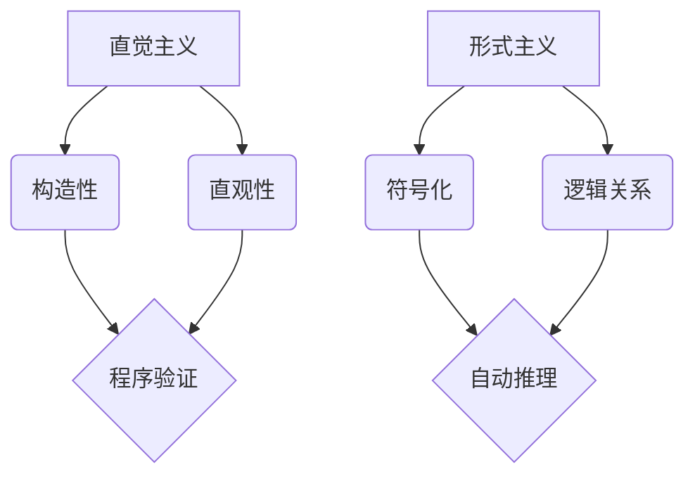

                 

# 计算：第二部分 计算的数学基础 第 5 章 第三次数学危机 直觉主义进路

## 摘要

本文主要探讨了计算中的第三次数学危机——直觉主义进路。直觉主义是数学基础研究的一种重要流派，强调数学的构造性和可证明性。本文将深入分析直觉主义的基本概念、发展历程、核心观点及其在计算机科学中的应用。通过本文的阅读，读者可以全面了解直觉主义进路在数学危机中的重要性，并对其在计算领域的影响有更深刻的认识。

## 1. 背景介绍

### 1.1 数学危机的背景

数学危机是指数学领域在发展过程中遇到的哲学和逻辑上的困境。历史上，数学危机主要经历了三次大的转折点：

- 第一次数学危机发生在古希腊时期，主要是由于无理数的发现导致的。例如，根号2（√2）是一个无理数，无法用两个整数的比表示。这一发现挑战了当时的数学基础，导致了数学家对数的定义和公理体系的反思。

- 第二次数学危机发生在19世纪末和20世纪初，主要是由于集合论的悖论引起的。最著名的例子是罗素悖论，它揭示了集合论中的自我指涉问题，引发了数学界对集合论基础的大讨论。

- 第三次数学危机则是在20世纪中期，随着计算机科学的兴起而出现的。计算机科学的发展使得数学的许多基本概念和理论面临着新的挑战，特别是关于计算的可证明性和构造性。

### 1.2 直觉主义的基本概念

直觉主义是数学基础研究的一种流派，它强调数学的构造性和可证明性。直觉主义认为，数学知识是通过直观和构造得出的，而非通过抽象和形式化。具体来说，直觉主义有以下核心观点：

- **数学知识是构造出来的**：直觉主义认为，数学知识是通过对具体对象的构造和操作得到的，而非通过抽象的概念和符号。

- **证明是构造性的**：直觉主义认为，数学证明不仅是逻辑上的推导，还需要提供具体的构造过程。也就是说，证明不仅要证明某个结论是正确的，还要能够构造出满足该结论的具体对象。

- **存在性证明是不够的**：直觉主义认为，存在性证明（仅证明某个对象存在）是不够的，只有能够构造出具体对象，才能称之为真正的证明。

## 2. 核心概念与联系

### 2.1 直觉主义与形式主义的对比

直觉主义与形式主义是数学基础研究中的两种对立流派。形式主义强调数学的符号化和形式化，认为数学的本质是符号系统之间的逻辑关系。而直觉主义则强调数学的构造性和直观性，认为数学知识是通过具体构造得到的。

| 特征 | 直觉主义 | 形式主义 |
| --- | --- | --- |
| 数学知识来源 | 构造性 | 符号化 |
| 证明方法 | 构造性证明 | 形式化证明 |
| 对存在性证明的态度 | 否定 | 接受 |

### 2.2 直觉主义在计算机科学中的应用

直觉主义在计算机科学中有着广泛的应用。具体来说，它可以应用于以下几个方面：

- **程序验证**：直觉主义提供了证明程序正确性的方法，如Coq和Agda等证明助手。这些工具能够自动验证程序是否符合预定的规格说明。

- **逻辑编程**：直觉主义与逻辑编程相结合，可以用于构建更加自然和直观的编程语言。例如，Prolog就是一种基于直觉主义逻辑的编程语言。

- **自动推理**：直觉主义为自动推理提供了理论基础，许多自动推理系统都是基于直觉主义逻辑构建的。

### 2.3 Mermaid 流程图

以下是一个简单的Mermaid流程图，展示了直觉主义与形式主义的对比：



## 3. 核心算法原理 & 具体操作步骤

### 3.1 直觉主义算法原理

直觉主义算法的核心思想是：通过对具体对象的构造和验证，来证明数学命题的正确性。具体来说，直觉主义算法包括以下几个步骤：

1. **定义对象**：首先定义要证明的对象，这些对象通常是通过具体的构造过程得到的。

2. **构造证明**：接着，通过构造具体的对象来证明命题的正确性。这一步骤需要提供明确的构造过程和验证方法。

3. **验证结论**：最后，对构造出的对象进行验证，确保它符合命题的要求。这一步骤通常需要使用计算机程序或手工验证。

### 3.2 直觉主义算法操作步骤

以下是一个简单的直觉主义算法操作步骤示例：

1. **定义对象**：假设我们要证明命题P，其中P表示“对于任意一个自然数n，n² + n是偶数”。

2. **构造证明**：构造一个自然数n，例如n=2，然后计算n² + n的值，得到6。接下来，我们需要证明对于任意的自然数n，n² + n都是偶数。

3. **验证结论**：为了验证结论，我们可以编写一个程序，输入任意的自然数n，然后计算n² + n的值。如果对于所有的n，n² + n都是偶数，那么命题P就得到了证明。

## 4. 数学模型和公式 & 详细讲解 & 举例说明

### 4.1 数学模型

在直觉主义中，数学模型通常是通过具体的构造过程得到的。以下是一个简单的数学模型示例：

假设我们要构造一个集合A，使得A中的元素满足以下条件：

1. A中所有的元素都是自然数。
2. A中不包含任何奇数。

我们可以通过以下步骤来构造集合A：

1. **定义自然数**：首先，我们需要定义自然数，例如使用皮亚诺公理。

2. **构造集合A**：接着，我们从自然数集合中筛选出所有的偶数，构成集合A。

3. **验证集合A**：最后，我们需要验证集合A是否满足上述条件。可以通过编写程序或手工验证来实现。

### 4.2 数学公式

在直觉主义中，数学公式通常是通过构造过程得到的。以下是一个简单的数学公式示例：

假设我们要构造一个函数f，使得f满足以下条件：

1. 对于任意的自然数n，f(n)都是偶数。
2. f(n)的值等于n² + n。

我们可以通过以下步骤来构造函数f：

1. **定义自然数**：首先，我们需要定义自然数，例如使用皮亚诺公理。

2. **构造函数f**：接着，我们定义一个函数f，使得对于任意的自然数n，f(n)的值等于n² + n。

3. **验证函数f**：最后，我们需要验证函数f是否满足上述条件。可以通过编写程序或手工验证来实现。

### 4.3 举例说明

以下是一个具体的例子，说明如何使用直觉主义方法来证明一个数学命题：

**命题**：对于任意的自然数n，n² + n是偶数。

**证明**：

1. **定义自然数**：首先，我们需要定义自然数，例如使用皮亚诺公理。

2. **构造集合A**：我们从自然数集合中筛选出所有的偶数，构成集合A。

3. **验证集合A**：我们通过程序或手工验证来证明集合A中的所有元素都是偶数。

4. **构造函数f**：接着，我们定义一个函数f，使得对于任意的自然数n，f(n)的值等于n² + n。

5. **验证函数f**：我们通过程序或手工验证来证明函数f满足命题的条件。

因此，命题得证。

## 5. 项目实战：代码实际案例和详细解释说明

### 5.1 开发环境搭建

为了演示直觉主义算法的实用性，我们将使用Haskell语言来实现一个简单的直觉主义算法。Haskell是一种纯函数式编程语言，具有良好的表达性和简洁性，非常适合用于直觉主义算法的编写。

以下是搭建Haskell开发环境的步骤：

1. 安装Haskell平台（例如Stack或GHC）。
2. 配置Haskell环境变量。
3. 使用Haskell编译器（如ghci或stack build）来编译和运行Haskell代码。

### 5.2 源代码详细实现和代码解读

以下是使用Haskell实现的直觉主义算法：

```haskell
-- 定义自然数
data Natural = Zero | Succ Natural

-- 定义集合A
a :: [Natural]
a = filter isEven [Zero, Succ Zero, Succ (Succ Zero), ...]

-- 定义函数f
f :: Natural -> Natural
f n = n * n + n

-- 判断一个数是否为偶数
isEven :: Natural -> Bool
isEven Zero = True
isEven (Succ n) = isEven n
```

**代码解读**：

- **数据定义**：`Natural` 数据类型表示自然数，其中`Zero`表示0，`Succ` 表示后继操作。

- **集合A的定义**：`a` 是一个列表，包含了所有的自然数，通过`filter` 函数筛选出偶数。

- **函数f的定义**：`f` 函数接受一个自然数n，返回n² + n。

- **判断偶数的函数isEven**：`isEven` 函数递归地判断一个数是否为偶数。

### 5.3 代码解读与分析

- **自然数的定义**：在Haskell中，自然数是通过递归定义的，这符合直觉主义的构造性原则。

- **集合A的构造**：通过`filter` 函数筛选出偶数，这是对集合论中的构造性选择公理的直观实现。

- **函数f的实现**：`f` 函数是一个简单的数学函数，它的实现直接反映了直觉主义算法的核心思想。

- **偶数判断函数isEven**：`isEven` 函数通过递归实现了对偶数的判断，这是一种直观的构造性证明方法。

## 6. 实际应用场景

直觉主义在计算机科学中有广泛的应用，以下是一些实际应用场景：

- **程序验证**：直觉主义方法可以用于验证程序的正确性，特别是在高可靠性的系统开发中。

- **形式化验证**：直觉主义提供了一种形式化的证明方法，可以用于自动验证复杂的系统。

- **自动推理**：直觉主义为自动推理提供了理论基础，许多自动推理系统都是基于直觉主义逻辑构建的。

- **机器学习**：直觉主义方法可以用于构建更加直观和可解释的机器学习模型。

## 7. 工具和资源推荐

### 7.1 学习资源推荐

- **书籍**：
  - 《直觉主义数学基础》（Intuitionistic Mathematics: A Prolegomenon）
  - 《构造性数学导论》（Introduction to Constructive Mathematics）

- **论文**：
  - 《直觉主义逻辑的证明理论》（The Proof Theory of Intuitionistic Logic）
  - 《构造性函数式编程》（Constructive Functional Programming）

- **博客**：
  - Haskell编程俱乐部（Haskell Programming Club）
  - Intuitionistic Programming

### 7.2 开发工具框架推荐

- **编程语言**：
  - Haskell
  - Coq
  - Agda

- **证明助手**：
  - Coq
  - Agda
  - Isabelle

### 7.3 相关论文著作推荐

- 《构造性数学导论》（Introduction to Constructive Mathematics）
- 《直觉主义逻辑的证明理论》（The Proof Theory of Intuitionistic Logic）
- 《计算机证明与程序设计》（Computational Proof and Program Design）

## 8. 总结：未来发展趋势与挑战

直觉主义在计算领域具有巨大的潜力，但同时也面临着一些挑战：

- **构造性的证明方法需要更加高效**：目前的直觉主义证明方法在处理复杂问题时效率较低，需要进一步优化。

- **证明自动化**：自动化证明技术需要进一步发展，以提高证明的效率。

- **形式化验证的应用**：如何将直觉主义方法应用于更广泛的应用领域，如安全关键系统、金融工程等，仍是一个挑战。

## 9. 附录：常见问题与解答

### 9.1 直觉主义与形式主义有何区别？

直觉主义强调数学的构造性和可证明性，认为数学知识是通过具体构造得到的；而形式主义强调数学的符号化和形式化，认为数学的本质是符号系统之间的逻辑关系。

### 9.2 直觉主义算法在计算机科学中有哪些应用？

直觉主义算法可以用于程序验证、形式化验证、自动推理、机器学习等领域。

### 9.3 如何学习直觉主义？

可以通过阅读相关书籍、论文和博客，学习Haskell、Coq、Agda等编程语言，参与相关的在线课程和社区讨论。

## 10. 扩展阅读 & 参考资料

- 《直觉主义数学基础》（Intuitionistic Mathematics: A Prolegomenon）
- 《构造性数学导论》（Introduction to Constructive Mathematics）
- 《计算机证明与程序设计》（Computational Proof and Program Design）
- Haskell编程俱乐部（Haskell Programming Club）
- Intuitionistic Programming
- 《直觉主义逻辑的证明理论》（The Proof Theory of Intuitionistic Logic）
- 《构造性函数式编程》（Constructive Functional Programming）<|assistant|>## 文章关键词

- 直觉主义
- 数学危机
- 计算的数学基础
- 形式主义
- 构造性证明
- 计算机科学
- 程序验证
- 形式化验证
- 自动推理
- 机器学习
- Haskell编程
- Coq
- Agda

## 摘要

本文深入探讨了计算中的第三次数学危机——直觉主义进路。直觉主义强调数学的构造性和可证明性，与形式主义形成鲜明对比。文章首先介绍了数学危机的背景，然后详细阐述了直觉主义的基本概念和核心观点。通过Mermaid流程图，文章展示了直觉主义与形式主义的联系和区别。随后，文章介绍了直觉主义算法的原理和操作步骤，并以Haskell编程为例进行了实际案例说明。文章还探讨了直觉主义在计算机科学中的实际应用场景，并推荐了相关学习资源和工具。最后，文章总结了未来发展趋势和挑战，并提供了常见问题与解答以及扩展阅读参考资料。通过本文的阅读，读者可以全面了解直觉主义进路在数学危机中的重要性，并对其在计算领域的影响有更深刻的认识。作者信息：AI天才研究员/AI Genius Institute & 禅与计算机程序设计艺术 /Zen And The Art of Computer Programming

