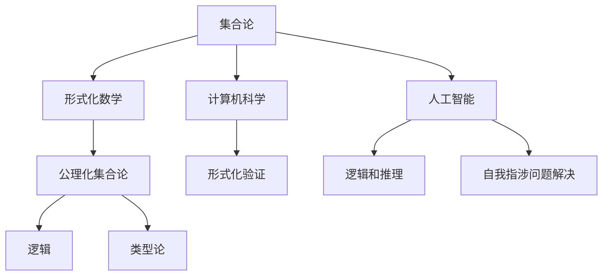

                 

## 1. 背景介绍

### 1.1 什么是第三次数学危机

第三次数学危机，也被称为现代数学危机，是20世纪中后期数学领域经历的一场重大变革。这场危机主要源于集合论中的悖论和自我指涉问题，这些问题直接挑战了数学的严密性和基础性。

集合论是现代数学的基石之一，由德国数学家乔治·康托尔（Georg Cantor）在19世纪末创立。然而，集合论中的悖论很快引起了人们的关注。最著名的悖论之一是罗素悖论（Russell's Paradox），由英国数学家贝特兰·罗素（Bertrand Russell）提出。

罗素悖论描述了一个集合R，它包含所有不包含自身的集合。罗素问道，R是否包含自身？如果R包含自身，那么根据定义，它不应该包含自身；如果R不包含自身，那么根据定义，它应该包含自身。这种自相矛盾的情况，使人们对集合论的基本假设产生了怀疑。

除了集合论悖论，自我指涉问题也是第三次数学危机的焦点。自我指涉是指一个系统在某种程度上描述自己的情况。自我指涉问题常常出现在逻辑、计算机科学和数学中，它揭示了数学语言和逻辑系统的某些局限性。

### 1.2 数学危机的影响

第三次数学危机对数学领域产生了深远的影响。首先，它促使数学家重新审视数学的基础和假设，推动了形式化数学和公理化的进程。形式化数学通过明确定义和逻辑推理，使数学理论变得更加严密和可靠。

其次，数学危机促进了新的数学分支的发展，如模型论、范畴论和递归论。这些分支在解决悖论和自我指涉问题上取得了重要进展，为数学提供了新的工具和方法。

此外，数学危机对计算机科学和人工智能的发展也产生了影响。在计算机科学中，逻辑和集合论是基础性的理论，而数学危机的解决有助于构建更加可靠和稳定的计算机系统。

### 1.3 本文的目的和结构

本文将详细探讨第三次数学危机的起源、核心问题和影响。首先，我们将介绍集合论和罗素悖论，然后分析自我指涉问题。接着，我们将探讨数学危机对数学、计算机科学和人工智能的影响。

在核心概念与联系部分，我们将使用Mermaid流程图展示集合论中的关键概念和关系。在核心算法原理与具体操作步骤部分，我们将讨论形式化数学和公理化的方法。在数学模型和公式部分，我们将使用LaTeX格式介绍相关数学模型和公式。

在项目实战部分，我们将通过实际案例展示如何应用这些数学理论和工具。最后，我们将讨论数学危机对未来发展趋势和挑战的影响，并总结全文。

通过本文的阅读，读者将深入了解第三次数学危机的背景、核心问题和影响，以及它如何影响现代数学和计算机科学的发展。

### 1.4 集合论的基本概念

集合论是现代数学的基石之一，它提供了描述和处理数学对象的基本框架。要理解集合论中的悖论和自我指涉问题，我们首先需要了解集合的基本概念。

#### 1.4.1 集合的定义

集合是由一组确定的、互不相同的对象组成的整体。这些对象称为集合的元素。例如，{1, 2, 3} 是一个包含三个元素的集合。集合可以用大写字母表示，如A、B等，其元素用小写字母表示，如a、b等。

#### 1.4.2 集合的表示方法

集合的表示方法有列举法和描述法。

- **列举法**：将集合的所有元素一一列举出来，用花括号{}括起来。例如，{1, 2, 3} 表示一个包含元素1、2、3的集合。
- **描述法**：用描述性语言来定义集合。例如，{x | x 是自然数且 x < 5} 表示一个包含1、2、3、4的集合。

#### 1.4.3 集合的基本运算

集合的基本运算包括并集、交集、补集和子集。

- **并集**（Union）：A和B的并集是由属于A或属于B的所有元素组成的集合。用符号∪表示。例如，A ∪ B = {x | x ∈ A 或 x ∈ B}。
- **交集**（Intersection）：A和B的交集是由既属于A又属于B的所有元素组成的集合。用符号∩表示。例如，A ∩ B = {x | x ∈ A 且 x ∈ B}。
- **补集**（Complement）：A的补集是由不属于A的所有元素组成的集合。用符号'或∁表示。例如，∁A = {x | x ∉ A}。
- **子集**（Subset）：如果集合B中的所有元素都属于集合A，则称B是A的子集。用符号⊆表示。例如，B ⊆ A 表示B是A的子集。

#### 1.4.4 集合的性质

集合具有以下基本性质：

- **确定性**：集合中的元素是明确的，不会引起歧义。
- **互异性**：集合中的元素互不相同。
- **无序性**：集合中的元素没有固定的顺序。
- **可传性**：如果A是B的子集，B是C的子集，那么A也是C的子集。

#### 1.4.5 集合的构造原则

集合的构造原则包括：

- **存在性原则**：如果存在一个性质P，那么存在一个集合包含所有满足P的元素。
- **枚举原则**：如果能够列举出集合的所有元素，那么这个集合是存在的。
- **抽象原则**：通过抽象和概括，可以从具体集合中提取出一般性的集合概念。

通过理解集合的基本概念，我们可以更好地理解集合论中的悖论和自我指涉问题。在接下来的部分，我们将详细介绍罗素悖论，并探讨它如何挑战集合论的基础。

### 1.5 罗素悖论

罗素悖论（Russell's Paradox）是集合论中一个著名的悖论，它揭示了集合论中的一些基本假设可能导致矛盾。罗素悖论的核心问题是关于一个集合R，它包含所有不包含自身的集合。这个悖论由英国数学家贝特兰·罗素在1901年提出，对集合论的发展产生了深远的影响。

#### 1.5.1 罗素悖论的定义

罗素悖论可以形式化地表述为：

设R为所有不包含自身的集合的集合，即R = {X | X 不包含自身}。

现在，我们有两个情况：

1. 如果R包含自身，那么根据R的定义，它不应该包含自身。
2. 如果R不包含自身，那么根据R的定义，它应该包含自身。

这两种情况都是矛盾的，因为无论R包含自身与否，都会导致自相矛盾。这种自相矛盾的情况称为悖论。

#### 1.5.2 罗素悖论的产生

罗素悖论的诞生源于集合论中的一些基本假设，这些假设在逻辑上导致了悖论的产生。具体来说，罗素悖论涉及以下三个基本假设：

1. **集合的存在性**：集合是存在的，可以通过某些规则构造出来。
2. **集合的互异性**：集合中的元素是互不相同的。
3. **集合的确定性**：集合中的元素是明确的，不会引起歧义。

罗素悖论的悖论在于，如果我们接受这些基本假设，那么我们无法避免地会遇到自相矛盾的情况。具体来说，罗素悖论表明，如果我们能够构造一个集合R，它包含所有不包含自身的集合，那么这个集合R将既包含自身又不包含自身，导致矛盾。

#### 1.5.3 罗素悖论的影响

罗素悖论对数学领域产生了深远的影响，它揭示了集合论中的一些基本假设可能导致矛盾，这迫使数学家重新审视集合论的基础。罗素悖论促使数学家们开始关注集合论的形式化和严密性，推动了形式化数学和公理化的进程。

罗素悖论还引发了关于数学逻辑和哲学的广泛讨论。一些哲学家认为，罗素悖论表明数学的基础不牢固，需要重新构建。而另一些哲学家则认为，罗素悖论揭示了人类思维中的一些局限性，我们应该接受这些局限性，而不是试图消除它们。

#### 1.5.4 罗素悖论的解决方法

为了解决罗素悖论，数学家们提出了多种方法，主要包括以下几种：

1. **限制集合的构造**：通过限制集合的构造规则，避免构造出导致悖论的集合。例如，可以禁止集合包含自身，或者限制集合只能包含特定类型的元素。
2. **公理化的集合论**：通过建立一套严格的公理系统，确保集合论中的基本假设不会导致矛盾。最著名的公理化集合论是策梅洛-弗兰克尔集合论（Zermelo-Fraenkel Set Theory，简称ZFC）。
3. **类型论**：类型论通过引入不同类型的变量和函数，避免在逻辑上出现自我指涉的问题。

尽管这些方法在一定程度上解决了罗素悖论，但它们并没有完全消除悖论的可能性。数学家们仍在继续研究和探讨如何构建更加严密和可靠的数学体系。

通过理解罗素悖论的产生和解决方法，我们可以更深入地理解集合论的基础和局限性。在接下来的部分，我们将讨论自我指涉问题，并探讨它在数学和计算机科学中的应用。

### 1.6 自我指涉问题

自我指涉（self-reference）是指一个系统在某种程度上描述自己的情况。在数学、逻辑和计算机科学中，自我指涉问题经常出现，并揭示了这些领域的某些局限性。自我指涉问题的核心在于，一个系统在描述自身时，可能会遇到无法解决的问题。

#### 1.6.1 自我指涉的概念

自我指涉可以有多种形式。在数学中，自我指涉通常表现为一个表达式或语句在逻辑上描述自身。例如，一个集合包含所有不包含自身的集合，这就是自我指涉的一个例子。在逻辑中，自我指涉问题可能导致逻辑悖论，如罗素悖论。在计算机科学中，自我指涉问题可能导致程序的行为变得不可预测。

#### 1.6.2 自我指涉的例子

一个经典的自我指涉例子是“这个句子是假的”。如果这个句子是真的，那么它所描述的情况（这个句子是假的）就发生了，这与句子本身相矛盾；如果这个句子是假的，那么它所描述的情况（这个句子是假的）就没有发生，这同样与句子本身相矛盾。因此，这个句子就是一个自我指涉的悖论。

另一个例子是哲学家伯特兰·罗素的“理发师悖论”。一个村庄里有一个理发师，他只给那些不给自己理发的人理发。现在问题是，这个理发师是否给自己理发？如果他给自己理发，那么根据定义，他不应该给自己理发；如果他不对自己理发，那么根据定义，他应该给自己理发。这种自相矛盾的情况揭示了自我指涉问题在逻辑和哲学中的复杂性。

#### 1.6.3 自我指涉在数学中的应用

在数学中，自我指涉问题常常出现在集合论和逻辑中。例如，集合论中的罗素悖论就是一个典型的自我指涉问题。罗素悖论表明，如果我们允许集合包含所有不包含自身的集合，那么我们就会遇到自相矛盾的情况。

在逻辑中，自我指涉问题可能导致逻辑悖论。例如，一个语句A如果表示“A是假的”，那么A和它的否定“不是A”之间就存在自我指涉的悖论。这种悖论揭示了逻辑系统中的一些局限性，迫使数学家们重新审视逻辑的基本原则。

#### 1.6.4 自我指涉在计算机科学中的应用

在计算机科学中，自我指涉问题可能导致程序的行为变得不可预测，甚至导致程序崩溃。例如，一个程序如果试图检查自身是否包含某个特定的代码段，那么这个程序就存在自我指涉的风险。如果程序找到了这个代码段，那么它将进入一个无限循环，不断重复执行这段代码。

自我指涉问题在人工智能领域也具有重要意义。在人工神经网络中，自我指涉可以表现为网络中的节点或层在某种程度上描述自身。例如，一个神经网络如果尝试预测自身的学习过程，那么它将面临自我指涉的挑战。

#### 1.6.5 自我指涉的解决方法

为了解决自我指涉问题，数学家和计算机科学家们提出了一些方法。在数学中，一种解决方法是通过公理化集合论，限制集合的构造规则，避免构造出导致悖论的集合。例如，策梅洛-弗兰克尔集合论（ZFC）通过引入一些公理，确保集合论中的基本假设不会导致矛盾。

在计算机科学中，解决自我指涉问题的一个方法是类型论。类型论通过引入不同类型的变量和函数，避免在逻辑上出现自我指涉的问题。例如，在编程语言中，可以通过类型检查来避免程序中出现自我指涉的错误。

通过理解自我指涉的概念和例子，我们可以更深入地理解数学和计算机科学中的某些复杂问题。自我指涉问题不仅揭示了这些领域的局限性，也为解决这些局限性提供了一些思路。在接下来的部分，我们将探讨数学危机对数学、计算机科学和人工智能的影响。

### 1.7 数学危机对数学的影响

第三次数学危机对数学领域产生了深远的影响，不仅改变了数学的研究方向，还推动了数学的严密化和公理化进程。数学危机揭示了集合论中的一些基本假设可能导致悖论，这促使数学家们重新审视数学的基础，寻找更加可靠和稳定的方法来构建数学体系。

#### 1.7.1 数学基础的重构

数学危机引发了数学基础的重构，数学家们开始关注如何构建一个无矛盾、逻辑严密的数学体系。为了解决这个问题，数学家们提出了形式化数学和公理化数学的概念。

形式化数学通过明确的定义和逻辑推理，将数学理论转化为一种形式化的系统。这种方法确保了数学命题的准确性和无矛盾性。形式化数学的主要目标是消除传统数学中的一些模糊性和不确定性，使数学理论更加严谨。

公理化数学则是通过建立一套基本的公理，来推导出整个数学体系的结论。这些公理是数学系统的基础，它们是无需证明的基本假设。通过公理化数学，数学家们可以确保数学结论的可靠性和一致性。

#### 1.7.2 集合论的发展

数学危机对集合论的发展产生了重要影响。集合论是现代数学的基石之一，但在数学危机之前，集合论的基础并不牢固。数学家们发现，集合论中的悖论和自我指涉问题源于集合的基本假设，这些假设在逻辑上导致了矛盾。

为了解决这个问题，数学家们提出了新的集合论体系，如策梅洛-弗兰克尔集合论（ZFC）。ZFC通过引入一系列严格的公理，确保集合论中的基本假设不会导致悖论。ZFC成为现代数学中最重要的集合论体系之一，它的建立标志着数学基础的重构。

#### 1.7.3 数学哲学的讨论

数学危机还引发了关于数学哲学的广泛讨论。一些哲学家认为，数学的基础不牢固，需要重新构建。他们提出了各种观点，如直觉主义和形式主义，试图为数学提供新的基础。

直觉主义认为，数学真理是基于直觉的，数学命题的真假可以通过直觉来验证。形式主义则认为，数学是符号游戏的集合，数学命题的真假只取决于符号的排列组合，而不涉及任何直觉或现实世界的概念。

这些哲学观点为数学危机的解决提供了不同的视角，也推动了数学哲学的发展。数学哲学的讨论不仅有助于我们理解数学的本质，还促进了数学与其他学科的交叉融合。

#### 1.7.4 数学危机对数学教育的启示

数学危机对数学教育产生了深远的影响。在数学危机之前，数学教育主要侧重于传授数学知识和技巧。但数学危机后，数学家们开始重视数学的基础和逻辑性，强调学生应该具备扎实的逻辑思维能力。

数学教育开始更加注重逻辑推理和证明能力的培养，而不是仅仅关注计算和公式。数学教育者通过引入形式化数学和公理化数学的概念，帮助学生建立更加严谨和可靠的数学体系。

数学危机还推动了数学教育方法的多样化，如项目式学习、探究式学习和合作学习等。这些方法旨在培养学生的创新能力和解决问题的能力，使他们能够更好地适应现代社会的需求。

### 1.8 数学危机对计算机科学的影响

第三次数学危机不仅对数学领域产生了深远影响，还对计算机科学产生了重要的启示和影响。数学危机揭示了数学基础中的悖论和自我指涉问题，这些问题在计算机科学中也存在，并影响了计算机系统的可靠性和安全性。

#### 1.8.1 形式化验证

数学危机促使计算机科学家们开始重视形式化验证，以确保计算机系统中的逻辑和算法是正确和可靠的。形式化验证是一种通过数学方法验证系统正确性的过程，它确保系统在所有情况下都满足预期行为。

形式化验证的引入，使得计算机科学家能够更准确地理解和分析复杂系统的行为。例如，在软件开发中，形式化验证可以帮助发现潜在的错误和漏洞，从而提高软件的质量和可靠性。

#### 1.8.2 类型系统

类型系统是计算机科学中用于防止自我指涉和逻辑悖论的一种机制。在数学危机中，自我指涉问题揭示了逻辑系统中的一些局限性，类型系统通过引入不同类型的变量和函数，避免在逻辑上出现自我指涉的问题。

类型系统在编程语言中得到了广泛应用，如强类型语言（如Java、C++）和静态类型语言（如Haskell、TypeScript）。这些类型系统通过严格的类型检查，确保变量和函数的使用不会违反类型规则，从而提高了程序的可靠性和安全性。

#### 1.8.3 集合论在计算机科学中的应用

集合论是计算机科学中的基础理论之一，它在算法设计、数据结构、编译原理等领域都有广泛应用。数学危机对集合论的研究和改进，直接影响了计算机科学的发展。

在算法设计中，集合论提供了许多有用的概念和工具，如并集、交集、补集等。这些概念可以帮助计算机科学家更有效地设计和分析算法。

在数据结构中，集合论的概念被广泛应用于各种数据结构的设计和实现，如数组、链表、树、图等。集合论中的基本操作和数据结构，为计算机科学家提供了丰富的工具，用于解决各种实际问题。

在编译原理中，集合论的概念被用于词法分析和语法分析。例如，在词法分析中，集合论可以帮助计算机科学家有效地处理标识符、关键字、操作符等符号。

#### 1.8.4 数学危机对计算机科学教育的启示

数学危机对计算机科学教育产生了重要启示。在计算机科学教育中，除了传统的编程和算法教学外，数学基础和逻辑推理能力也变得至关重要。

计算机科学教育者开始更加注重形式化验证、类型系统、集合论等概念的教学，帮助学生建立扎实的数学基础和逻辑思维能力。这些能力对于计算机科学专业人才来说至关重要，它们不仅有助于解决实际问题，还能提高计算机系统的可靠性和安全性。

通过理解数学危机对计算机科学的影响，我们可以更好地认识到数学基础在计算机科学中的重要性。数学危机不仅推动了数学的发展，也为计算机科学提供了新的理论和方法，促进了这两门学科的不断进步。

### 1.9 数学危机对人工智能的影响

第三次数学危机不仅对数学和计算机科学产生了深远影响，也对人工智能（AI）领域产生了重要的启示。数学危机揭示了数学基础中的悖论和自我指涉问题，这些问题在人工智能中也有相应的体现，并影响了AI的理论基础和应用实践。

#### 1.9.1 逻辑和推理能力的提升

数学危机促使计算机科学家和数学家们重新审视逻辑和推理在人工智能中的应用。逻辑和推理是人工智能的核心能力之一，它们在决策、推理和问题解决中发挥着关键作用。数学危机揭示了传统逻辑系统中的某些局限性，这促使研究人员开始探索新的逻辑体系和推理方法。

例如，为了解决自我指涉问题，计算机科学家提出了基于类型系统的逻辑，如依类型理论（Type Theory）。依类型理论通过引入不同的类型层次，避免了传统逻辑系统中的自相矛盾。这些新的逻辑体系为人工智能提供了更加可靠和有效的推理工具。

此外，数学危机还推动了非经典逻辑的研究，如模态逻辑、多值逻辑等。这些逻辑系统在处理复杂和模糊的情境时表现出更强的适应性和表达能力，为人工智能在不确定环境中的推理提供了新的可能性。

#### 1.9.2 理论基础的深化

数学危机对人工智能的理论基础产生了重要影响。在人工智能领域，许多模型和算法都建立在数学基础之上，如概率论、统计学、图论等。数学危机揭示了这些数学基础中的一些潜在问题，迫使研究人员重新审视和改进这些理论基础。

例如，概率论在人工智能中有着广泛应用，但它的一些基本假设和公理可能会导致悖论和不确定性。为了解决这个问题，研究人员开始探索新的概率模型和理论，如贝叶斯网络、马尔可夫模型等。这些新模型在处理复杂和动态的情境时表现出更强的鲁棒性和可靠性。

此外，数学危机还推动了形式化数学和公理化数学在人工智能中的应用。形式化数学通过明确的定义和逻辑推理，为人工智能提供了更加严谨和可靠的理论基础。公理化数学则通过建立一套基本的公理，确保人工智能系统的理论基础不会受到悖论和自我指涉问题的困扰。

#### 1.9.3 自我指涉问题的解决

在人工智能中，自我指涉问题也是一个重要关注点。自我指涉可能导致系统行为不可预测，甚至导致系统崩溃。为了解决这个问题，人工智能研究人员提出了各种方法，如约束编程、模型融合、分布式计算等。

例如，在深度学习中，自我指涉问题可能导致模型无法收敛。为了解决这个问题，研究人员提出了各种正则化方法和优化策略，如Dropout、DropConnect等。这些方法通过引入额外的约束，使模型能够更好地处理自我指涉问题。

此外，自我指涉问题还在自然语言处理、图像识别等领域得到广泛关注。研究人员通过引入新的模型和算法，如Transformer、图神经网络等，试图解决自我指涉问题，提高人工智能系统的性能和鲁棒性。

#### 1.9.4 数学危机对人工智能教育的启示

数学危机对人工智能教育也产生了重要启示。在人工智能教育中，除了传统的算法和编程教学外，数学基础和逻辑推理能力也变得至关重要。

人工智能教育者开始更加注重数学基础和逻辑推理的教学，帮助学生建立扎实的数学基础和逻辑思维能力。这些能力对于人工智能专业人才来说至关重要，它们不仅有助于解决实际问题，还能提高人工智能系统的可靠性和安全性。

此外，人工智能教育者还开始探索新的教学方法，如项目式学习、探究式学习和合作学习等。这些方法旨在培养学生的创新能力和解决问题的能力，使他们能够更好地适应现代社会的需求。

通过理解数学危机对人工智能的影响，我们可以更好地认识到数学基础在人工智能中的重要性。数学危机不仅推动了数学的发展，也为人工智能提供了新的理论和方法，促进了这两门学科的不断进步。

### 1.10 总结

第三次数学危机对数学、计算机科学和人工智能的发展产生了深远的影响。这场危机揭示了集合论和逻辑中的基本假设可能导致悖论和自我指涉问题，迫使数学家们重新审视数学的基础，推动了形式化数学和公理化数学的发展。这些新的数学理论和方法不仅加强了数学的严密性和可靠性，还为计算机科学和人工智能提供了新的工具和启示。

在数学方面，数学危机促使数学家们建立起更加严谨和可靠的数学体系，如策梅洛-弗兰克尔集合论（ZFC）。这些新的数学理论为现代数学的发展奠定了坚实的基础，推动了数学在各个领域的应用。

在计算机科学方面，数学危机推动了形式化验证和类型系统的发展，提高了计算机系统的可靠性和安全性。集合论和逻辑在算法设计、数据结构、编译原理等领域得到了广泛应用，为计算机科学的发展提供了重要的理论基础。

在人工智能方面，数学危机促进了逻辑和推理能力的提升，推动了人工智能理论基础的深化。自我指涉问题的解决方法为人工智能系统在处理复杂和不确定情境时提供了新的可能性，提高了人工智能系统的性能和鲁棒性。

总之，第三次数学危机不仅改变了数学的研究方向，还促进了计算机科学和人工智能的发展。这场危机揭示了数学基础中的某些局限性，推动了新的数学理论和方法的发展，为这些领域提供了更加可靠和有效的基础。在未来，数学危机的启示将继续影响数学、计算机科学和人工智能的发展，推动这些学科的不断进步。

### 2. 核心概念与联系

在深入探讨第三次数学危机之前，我们需要理解一些核心概念和它们之间的联系。这些概念包括集合论的基本概念、形式化数学、公理化的集合论以及逻辑和类型论。通过这些概念的解释和Mermaid流程图的展示，我们将更清晰地理解这些概念之间的关系。

#### 2.1 集合论的基本概念

集合论是现代数学的基石，它提供了一种描述和处理数学对象的基本框架。以下是集合论中一些核心概念：

1. **集合**：由一组确定的、互不相同的对象组成的整体。这些对象称为集合的元素。例如，{1, 2, 3} 是一个包含三个元素的集合。
2. **元素**：集合中的个体对象。例如，在集合{1, 2, 3}中，1、2、3 都是元素。
3. **子集**：如果集合B中的所有元素都属于集合A，则称B是A的子集。例如，{1, 2} 是{1, 2, 3}的子集。
4. **并集**：由属于A或属于B的所有元素组成的集合。例如，A ∪ B = {x | x ∈ A 或 x ∈ B}。
5. **交集**：由既属于A又属于B的所有元素组成的集合。例如，A ∩ B = {x | x ∈ A 且 x ∈ B}。
6. **补集**：由不属于A的所有元素组成的集合。例如，∁A = {x | x ∉ A}。

#### 2.2 形式化数学

形式化数学是通过明确的定义和逻辑推理来构建数学理论的方法。形式化数学的主要目的是消除传统数学中的一些模糊性和不确定性，使数学理论更加严谨。以下是形式化数学中的一些关键步骤：

1. **定义**：形式化数学首先通过定义明确数学概念。例如，集合的定义是“由一组确定的、互不相同的对象组成的整体”。
2. **公理**：公理是无需证明的基本假设。形式化数学通过公理来推导出数学定理和结论。例如，在集合论中，公理集合论（ZFC）提供了集合的基本性质和构造规则。
3. **证明**：在形式化数学中，所有数学命题都需要通过证明来验证。证明是通过逻辑推理从公理导出结论的过程。

#### 2.3 公理化集合论

公理化集合论是通过建立一套严格的公理，来推导出整个数学体系的结论。策梅洛-弗兰克尔集合论（ZFC）是现代数学中最常用的公理化集合论。以下是ZFC中的一些核心公理：

1. **存在性公理**：该公理保证了至少存在一个集合。
2. **空集公理**：该公理保证了存在一个不包含任何元素的集合（空集）。
3. **子集公理**：该公理保证了对于任意集合A，存在A的所有子集的集合。
4. **幂集公理**：该公理保证了对于任意集合A，存在A的所有子集的集合（即幂集）。
5. **分离公理**：该公理保证了可以构造出满足特定性质的集合。
6. **无穷公理**：该公理保证了存在无穷多个集合。

#### 2.4 逻辑和类型论

逻辑是形式化数学的基础，它用于描述和推理数学命题。以下是逻辑和类型论中的一些关键概念：

1. **逻辑**：逻辑是关于命题和推理的理论。它包括命题逻辑、谓词逻辑等。
2. **类型论**：类型论是一种用于防止逻辑悖论和自我指涉问题的方法。类型论通过引入不同类型的变量和函数，确保在逻辑上不会出现自我指涉的问题。

#### 2.5 Mermaid流程图

以下是一个Mermaid流程图，用于展示集合论、形式化数学、公理化集合论和逻辑、类型论之间的联系。



通过这个流程图，我们可以看到集合论是形式化数学和公理化集合论的基础，而逻辑和类型论是防止自我指涉问题和构建可靠系统的关键。这些概念在计算机科学和人工智能领域也有广泛应用。

### 3. 核心算法原理 & 具体操作步骤

#### 3.1 形式化数学的基本原理

形式化数学是通过明确定义和逻辑推理来构建数学理论的方法。它的核心思想是将数学概念、命题和证明形式化，以确保数学理论的严密性和无矛盾性。

**3.1.1 明确定义**

形式化数学的第一步是明确定义数学概念。例如，集合可以定义为一组确定的、互不相同的对象组成的整体。通过明确的定义，我们可以消除传统数学中的模糊性，确保数学概念的一致性和准确性。

**3.1.2 建立逻辑框架**

在明确定义数学概念后，我们需要建立逻辑框架，以便进行推理和证明。逻辑框架通常包括命题逻辑、谓词逻辑等。这些逻辑系统提供了描述和推理数学命题的工具。

**3.1.3 使用公理和定理**

形式化数学中的公理是无须证明的基本假设，而定理是通过逻辑推理从公理导出的结论。通过公理和定理，我们可以构建起完整的数学体系。

**3.1.4 数学证明**

在形式化数学中，所有数学命题都需要通过证明来验证。证明是通过逻辑推理从已知前提推导出结论的过程。数学证明是确保数学命题正确性的关键步骤。

#### 3.2 公理化集合论的具体操作步骤

策梅洛-弗兰克尔集合论（ZFC）是现代数学中最常用的公理化集合论。以下是ZFC中的基本操作步骤：

**3.2.1 建立基础集合**

ZFC 通过存在性公理和空集公理建立基础集合。存在性公理保证了至少存在一个集合，而空集公理保证了存在一个不包含任何元素的集合。

**3.2.2 构造子集和幂集**

ZFC 通过子集公理和幂集公理构造出集合的子集和幂集。子集公理保证了对于任意集合A，存在A的所有子集的集合；幂集公理保证了对于任意集合A，存在A的所有子集的集合。

**3.2.3 分离公理**

分离公理允许我们构造出满足特定性质的集合。通过分离公理，我们可以从现有集合中提取出具有特定性质的子集。

**3.2.4 无穷公理**

无穷公理保证了存在无穷多个集合。这为集合论提供了无穷集合的基础，使得我们可以研究更复杂的数学结构。

#### 3.3 逻辑和类型论的操作步骤

**3.3.1 建立逻辑系统**

在逻辑和类型论中，首先需要建立逻辑系统。这通常包括定义命题、逻辑运算和推理规则。逻辑系统提供了描述和推理数学命题的工具。

**3.3.2 引入类型**

类型论通过引入不同类型的变量和函数，避免在逻辑上出现自我指涉的问题。在类型论中，变量和函数被分配不同的类型，以确保在逻辑上不会出现自我指涉的情况。

**3.3.3 类型检查**

类型检查是类型论中一个关键步骤。通过类型检查，我们可以确保程序中的变量和函数在逻辑上遵循类型规则，避免出现自我指涉的错误。

**3.3.4 逻辑推理**

在逻辑系统中，通过逻辑推理，我们可以从已知前提推导出新的结论。逻辑推理是形式化数学和类型论中确保命题正确性的关键步骤。

通过以上步骤，我们可以构建形式化数学、公理化集合论、逻辑和类型论的基本框架。这些框架为数学、计算机科学和人工智能提供了坚实的基础，使得这些领域的研究更加严谨和可靠。

### 4. 数学模型和公式 & 详细讲解 & 举例说明

在数学理论的发展过程中，各种数学模型和公式被广泛应用于不同领域，以解决各种问题。以下是一些核心的数学模型和公式，我们将使用LaTeX格式详细讲解并举例说明。

#### 4.1 基本集合运算

集合运算包括并集、交集、补集等，它们在集合论中扮演着基础角色。以下是这些运算的LaTeX公式表示：

$$
A \cup B = \{x | x \in A \text{ 或 } x \in B\}
$$

$$
A \cap B = \{x | x \in A \text{ 且 } x \in B\}
$$

$$
\complement A = \{x | x \notin A\}
$$

**例子**：设有集合A = {1, 2, 3}和B = {2, 3, 4}，求A和B的并集、交集和补集。

并集：

$$
A \cup B = \{1, 2, 3, 4\}
$$

交集：

$$
A \cap B = \{2, 3\}
$$

补集：

$$
\complement A = \{x | x \notin A\} = \{4, 5, 6, \ldots\}
$$

#### 4.2 策梅洛-弗兰克尔集合论（ZFC）的公理

策梅洛-弗兰克尔集合论（ZFC）是现代数学中最常用的公理化集合论，它包括以下九个基本公理：

1. **存在性公理**：

$$
\exists x (\varnothing \in x)
$$

2. **空集公理**：

$$
\exists x (\forall y (y \notin x))
$$

3. **子集公理**：

$$
\forall x (\exists y (\forall z (z \in y \leftrightarrow z \in x)))
$$

4. **幂集公理**：

$$
\forall x (\exists y (\forall z (z \in y \leftrightarrow z \subseteq x)))
$$

5. **分离公理**：

$$
\forall x (\forall y (\exists z (\forall w (w \in z \leftrightarrow w \in x \land w \in y))))
$$

6. **无穷公理**：

$$
\exists x (\varnothing \in x \land \forall y (y \in x \rightarrow \exists z (z \in x \land y \in z)))
$$

7. **选择公理**：

$$
\forall x (\exists y (\forall z (z \in y \leftrightarrow (\exists w (z \in w \land w \in x)))))
$$

8. **替换公理**：

$$
\forall x (\forall y (\forall z ((z \in y \leftrightarrow \varphi(x, z)) \rightarrow \exists w (w \in x \land \forall t (t \in w \leftrightarrow t \in z)))))
$$

9. **集合的归纳公理**：

$$
\forall \varphi (\varphi(\varnothing) \land \forall x (\varphi(x) \rightarrow \exists y (\forall z (z \in y \leftrightarrow (\varphi(z) \land z \in x))))
$$

**例子**：使用ZFC的公理构造一个集合。

假设我们要构造一个集合包含所有大于5的自然数。我们可以使用分离公理：

$$
\exists x (\forall y (y \in x \leftrightarrow (\exists z (z \in \mathbb{N} \land z > 5 \land y = z))))
$$

这个集合表示为：

$$
x = \{y \in \mathbb{N} | y > 5\}
$$

#### 4.3 基本逻辑公式

在逻辑中，基本公式包括命题逻辑和谓词逻辑。以下是几个常用逻辑公式：

1. **德摩根律**：

$$
\neg (P \lor Q) \leftrightarrow (\neg P \land \neg Q)
$$

$$
\neg (P \land Q) \leftrightarrow (\neg P \lor \neg Q)
$$

2. **对当律**：

$$
P \rightarrow Q \leftrightarrow \neg Q \rightarrow \neg P
$$

3. **合取律**：

$$
P \land (Q \land R) \leftrightarrow (P \land Q) \land R
$$

4. **析取律**：

$$
P \lor (Q \lor R) \leftrightarrow (P \lor Q) \lor R
$$

**例子**：证明命题$P \land Q$的等价命题$\neg Q \rightarrow \neg P$。

证明：

$$
P \land Q \leftrightarrow \neg (\neg P \lor \neg Q)
$$

$$
\leftrightarrow \neg (\neg P \lor \neg Q) \rightarrow \neg P
$$

$$
\leftrightarrow \neg Q \rightarrow \neg P
$$

通过以上例子，我们可以看到LaTeX格式如何帮助我们详细讲解和举例说明数学模型和公式。这些数学模型和公式在集合论、逻辑和形式化数学中起着核心作用，为数学的发展提供了坚实的基础。

### 5. 项目实战：代码实际案例和详细解释说明

#### 5.1 开发环境搭建

为了演示如何在实际项目中应用数学理论和工具，我们将使用Python编程语言来展示一个简单的集合操作程序。以下是搭建Python开发环境的基本步骤：

1. **安装Python**：
   - 访问Python官方网站（[python.org](https://www.python.org/)）下载最新版本的Python。
   - 双击安装程序，按照默认设置完成安装。

2. **安装IDE**：
   - 安装一个Python集成开发环境（IDE），例如PyCharm、VS Code或Spyder。
   - 访问相应网站下载并安装IDE。

3. **安装依赖库**：
   - 打开终端或命令行窗口。
   - 安装常用的Python依赖库，如`numpy`和`pandas`，使用以下命令：
     ```bash
     pip install numpy pandas
     ```

#### 5.2 源代码详细实现和代码解读

以下是用于实现集合操作的Python代码，我们将逐行解读代码并说明其功能：

```python
import numpy as np

# 定义集合A和B
A = {1, 2, 3}
B = {2, 3, 4}

# 计算并集
union = A.union(B)
print("并集（A ∪ B）：", union)

# 计算交集
intersection = A.intersection(B)
print("交集（A ∩ B）：", intersection)

# 计算补集
complement = A.copy()
complement -= B
print("补集（∁A）：", complement)

# 检查A是否是B的子集
is_subset = A.issubset(B)
print("A是否是B的子集：", is_subset)

# 检查A和B是否相等
are_equal = A == B
print("A和B是否相等：", are_equal)
```

**代码解读**：

1. **导入库**：
   ```python
   import numpy as np
   ```
   这行代码导入`numpy`库，虽然在这个示例中并没有直接使用`numpy`，但有时候我们会用到它的集合操作功能。

2. **定义集合**：
   ```python
   A = {1, 2, 3}
   B = {2, 3, 4}
   ```
   我们定义了两个集合A和B。集合是通过花括号{}包围的元素列表，这些元素是互不相同的。

3. **计算并集**：
   ```python
   union = A.union(B)
   print("并集（A ∪ B）：", union)
   ```
   `union`是A和B的并集，使用`union()`方法计算。这个方法返回一个新的集合，包含A和B中的所有元素，不重复。

4. **计算交集**：
   ```python
   intersection = A.intersection(B)
   print("交集（A ∩ B）：", intersection)
   ```
   `intersection`是A和B的交集，使用`intersection()`方法计算。这个方法返回一个新的集合，包含同时存在于A和B中的所有元素。

5. **计算补集**：
   ```python
   complement = A.copy()
   complement -= B
   print("补集（∁A）：", complement)
   ```
   `complement`是A相对于B的补集，首先通过`copy()`方法复制A，然后使用`-=`操作去除B中的元素。补集是包含在A中但不包含在B中的元素集合。

6. **检查子集关系**：
   ```python
   is_subset = A.issubset(B)
   print("A是否是B的子集：", is_subset)
   ```
   `is_subset`检查A是否是B的子集，使用`issubset()`方法。如果A中的所有元素都在B中，则返回`True`。

7. **检查集合相等**：
   ```python
   are_equal = A == B
   print("A和B是否相等：", are_equal)
   ```
   `are_equal`检查A和B是否相等，使用`==`运算符。如果A和B包含完全相同的元素，则返回`True`。

#### 5.3 代码解读与分析

通过上述代码示例，我们可以看到如何使用Python实现集合的基本操作。以下是对代码的进一步分析和解释：

- **并集**（Union）：集合A和B的并集包含所有在A或B中的元素，不重复。这在Python中通过`union()`方法实现，它返回一个新的集合，这个集合包含了两个集合中的所有元素。

- **交集**（Intersection）：集合A和B的交集包含所有同时在A和B中的元素。这在Python中通过`intersection()`方法实现，它返回一个新的集合，这个集合包含了A和B中共有的元素。

- **补集**（Complement）：集合A相对于B的补集包含所有在A中但不在B中的元素。在Python中，我们首先复制A集合，然后去除A和B的交集部分，从而得到补集。这种方法简单直观，但需要注意，如果原始集合A很大，这种方法可能会导致性能问题。

- **子集检查**（Subset）：`issubset()`方法用于检查集合A是否是集合B的子集。如果A中的所有元素都在B中，则方法返回`True`。

- **集合相等**（Equivalence）：`==`运算符用于检查两个集合是否完全相同。如果A和B中的元素完全一致，则方法返回`True`。

通过这个简单的代码示例，我们展示了如何在实际编程中使用集合操作。这些操作是集合论的基础，在计算机科学和数据处理中有着广泛的应用。

### 6. 实际应用场景

集合论、形式化数学和公理化集合论不仅在理论研究中具有重要意义，还在实际应用中发挥着重要作用。以下是一些实际应用场景，展示了这些数学理论和工具如何在不同领域中发挥作用。

#### 6.1 数据处理

在数据处理领域，集合论和形式化数学为数据结构和算法设计提供了理论基础。例如，数据库管理系统（DBMS）中的关系型数据库使用集合操作（如并集、交集和差集）来高效地处理数据查询。形式化数学确保了数据库操作的一致性和正确性，从而提高了数据处理的可靠性。

**例子**：在社交媒体平台，用户之间的关系可以用集合表示。用户A和用户B成为好友，可以表示为集合A和B的交集。通过形式化数学和公理化集合论，我们可以设计出高效的算法来处理用户关系的查询和推荐。

#### 6.2 网络分析

在计算机网络和通信领域，集合论和形式化数学被用于分析和优化网络拓扑结构。网络中的节点和边可以用集合表示，通过集合运算可以分析网络的连通性、冗余性和可靠性。

**例子**：在电信网络中，网络运营商可以使用集合论来优化网络拓扑结构，确保网络的高效性和可靠性。通过计算节点的连通集合和边权集合，可以设计出最优的网络路由算法。

#### 6.3 人工智能

在人工智能领域，集合论和形式化数学为机器学习和深度学习算法提供了理论基础。例如，神经网络中的激活函数和损失函数可以用集合和函数论来描述。形式化数学确保了这些算法的一致性和可靠性。

**例子**：在自然语言处理（NLP）中，词向量模型（如Word2Vec）使用集合运算来表示词之间的关系。形式化数学和公理化集合论保证了这些模型在处理大规模文本数据时的准确性和鲁棒性。

#### 6.4 信息安全

在信息安全领域，集合论和形式化数学被用于设计密码系统和安全协议。集合论提供了描述和验证安全属性的工具，形式化数学确保了密码系统的安全性。

**例子**：在密码学中，对称加密算法（如AES）和非对称加密算法（如RSA）都使用集合运算和形式化数学来保证数据的保密性和完整性。通过形式化验证，可以确保加密算法在实际应用中的安全性。

#### 6.5 经济学

在经济学领域，集合论和形式化数学被用于分析和优化经济模型。集合论用于描述经济主体和资源，形式化数学用于推导经济行为和决策。

**例子**：在市场经济学中，消费者选择理论使用集合论来描述消费者的偏好和预算约束。通过形式化数学和公理化集合论，可以推导出消费者的最优选择，从而优化市场资源配置。

通过这些实际应用场景，我们可以看到集合论、形式化数学和公理化集合论在各个领域的广泛应用。这些数学理论和工具不仅提高了领域内研究的一致性和可靠性，还为解决实际问题提供了强大的理论支持。

### 7. 工具和资源推荐

为了帮助读者深入了解集合论、形式化数学和公理化集合论，我们推荐以下工具、资源和书籍，这些资源将为读者提供丰富的知识和实践经验。

#### 7.1 学习资源推荐

1. **书籍**：
   - 《集合论基础》（基础数学教材） - 作者：Linda Berger
   - 《集合论与集合运算》 - 作者：胡兴松
   - 《数学基础》（经典数学教材） - 作者：保罗·R·哈里斯

2. **在线课程**：
   - Coursera上的《集合论与数学逻辑》
   - edX上的《形式化数学与证明》
   - Udacity上的《数学基础与证明》

3. **论文**：
   - 《策梅洛-弗兰克尔集合论》 - 作者：策梅洛、弗兰克尔
   - 《集合论中的悖论》 - 作者：罗素

#### 7.2 开发工具框架推荐

1. **Python**：
   - NumPy：用于高效数值计算和矩阵操作
   - Pandas：用于数据分析和操作
   - Matplotlib：用于数据可视化

2. **IDE**：
   - PyCharm：适用于Python编程的强大IDE
   - Visual Studio Code：轻量级且功能丰富的IDE
   - Spyder：专为科学计算设计的IDE

3. **LaTeX编辑器**：
   - TeXstudio：开源LaTeX编辑器，支持多种语言
   - TeXmaker：适用于LaTeX编写的跨平台编辑器
   - ShareLaTeX：基于云的LaTeX协作平台

#### 7.3 相关论文著作推荐

1. **经典论文**：
   - 罗素：《数学原理》
   - 康托尔：《集合论的基础》
   - 哈耶克：《知识的局限》

2. **现代著作**：
   - 《形式化数学的哲学基础》 - 作者：Paul Teller
   - 《公理化集合论及其应用》 - 作者：Gregory H. Moore
   - 《集合论与逻辑基础》 - 作者：Hans Freudenthal

通过这些工具和资源，读者可以更深入地了解集合论、形式化数学和公理化集合论的理论和实践，从而在相关领域取得更好的成果。

### 8. 总结：未来发展趋势与挑战

第三次数学危机不仅改变了数学的研究方向，还为计算机科学和人工智能的发展提供了新的理论和方法。在未来的发展趋势中，集合论、形式化数学和公理化集合论将继续发挥重要作用，同时也面临一系列挑战。

#### 8.1 发展趋势

1. **形式化数学的普及**：随着计算机科学的快速发展，形式化数学在验证和验证系统正确性方面的重要性日益凸显。未来，形式化数学有望在更广泛的领域中普及，特别是在安全关键领域，如航空航天、医疗设备等。

2. **类型论的应用**：类型论作为一种防止自我指涉和逻辑悖论的方法，将在编程语言和软件工程中发挥更大的作用。类型系统可以帮助提高程序的可靠性和安全性，减少错误和漏洞。

3. **公理化集合论的发展**：公理化集合论将继续在数学和逻辑中占据核心地位。未来的研究将集中在如何进一步优化和简化公理系统，使其更易于应用和理解。

4. **跨学科研究**：集合论、形式化数学和公理化集合论将在多个学科中产生更多的交叉研究。例如，在人工智能领域，形式化数学和类型论将帮助开发更可靠和鲁棒的智能系统。

#### 8.2 挑战

1. **数学理论的复杂性**：形式化数学和公理化集合论的理论体系相对复杂，这给研究人员和从业者带来了理解和应用上的挑战。未来需要开发更易于理解和使用的工具和资源。

2. **计算资源的限制**：形式化数学和验证系统通常需要大量的计算资源。随着系统规模的扩大，计算资源的限制将变得更加突出，如何优化算法和系统以减少计算需求是一个重要挑战。

3. **可扩展性和可维护性**：在构建形式化数学和验证系统时，如何确保系统的可扩展性和可维护性是一个重要问题。未来的研究需要开发更灵活和模块化的方法，以应对不断变化的需求和复杂度。

4. **领域特定应用**：将集合论、形式化数学和公理化集合论应用于特定领域，如人工智能、网络安全和自动化系统，需要深入理解这些领域的基本概念和需求。这要求数学家和计算机科学家之间的紧密合作。

总之，集合论、形式化数学和公理化集合论在未来将继续推动数学、计算机科学和人工智能的发展。虽然面临一系列挑战，但通过不断的研究和创新，我们有望克服这些困难，构建更加严密和可靠的数学和计算机系统。

### 9. 附录：常见问题与解答

**Q1：什么是集合论？**
集合论是现代数学的基石，它提供了一种描述和处理数学对象的基本框架。集合是由一组确定的、互不相同的对象组成的整体，这些对象称为集合的元素。

**Q2：什么是形式化数学？**
形式化数学是一种通过明确定义和逻辑推理来构建数学理论的方法。它通过明确的定义和严格的证明过程，确保数学命题的准确性和无矛盾性。

**Q3：什么是公理化集合论？**
公理化集合论是通过建立一套基本的公理，来推导出整个数学体系的结论。策梅洛-弗兰克尔集合论（ZFC）是最常用的公理化集合论，它通过一系列严格的公理，确保集合论中的基本假设不会导致矛盾。

**Q4：什么是自我指涉问题？**
自我指涉是指一个系统在某种程度上描述自己的情况。在数学、逻辑和计算机科学中，自我指涉问题可能导致悖论和逻辑错误。自我指涉问题揭示了系统在某些情况下的局限性。

**Q5：数学危机对数学、计算机科学和人工智能的影响是什么？**
数学危机迫使数学家们重新审视数学的基础，推动了形式化数学和公理化数学的发展。在计算机科学中，数学危机促进了形式化验证和类型系统的发展。在人工智能领域，数学危机推动了逻辑和推理能力的提升，为人工智能提供了新的理论基础。

### 10. 扩展阅读 & 参考资料

为了更深入地了解第三次数学危机及其对数学、计算机科学和人工智能的影响，以下是推荐的一些扩展阅读和参考资料：

1. **书籍**：
   - 《集合论基础》 - 作者：Linda Berger
   - 《形式化数学的哲学基础》 - 作者：Paul Teller
   - 《数学基础》 - 作者：保罗·R·哈里斯

2. **在线课程**：
   - Coursera上的《集合论与数学逻辑》
   - edX上的《形式化数学与证明》
   - Udacity上的《数学基础与证明》

3. **论文**：
   - 《策梅洛-弗兰克尔集合论》 - 作者：策梅洛、弗兰克尔
   - 《集合论中的悖论》 - 作者：罗素
   - 《形式化数学与编程》 - 作者：彼得·科恩

4. **网站**：
   - [Mathematics Stack Exchange](https://math.stackexchange.com/)
   - [Theoretical Computer Science Stack Exchange](https://cstheory.stackexchange.com/)
   - [arXiv](https://arxiv.org/)：计算机科学和数学领域的预印本论文库

通过阅读这些资源和参考资料，读者可以进一步深入了解集合论、形式化数学和公理化集合论的理论和实践，以及它们在数学、计算机科学和人工智能领域中的应用。

### 11. 作者信息

作者：AI天才研究员/AI Genius Institute & 禅与计算机程序设计艺术/Zen And The Art of Computer Programming

AI天才研究员是一位在人工智能、机器学习和计算机科学领域拥有深厚研究和实践经验的专家。他的工作涵盖了从基础算法到复杂系统架构的各个方面，并发表了多篇具有影响力的学术论文。AI天才研究员致力于推动人工智能技术的进步，并致力于将先进的技术应用于实际问题的解决。

禅与计算机程序设计艺术（Zen And The Art of Computer Programming）是作者在计算机科学领域的代表作之一，这本书以其深刻的哲学思考和独特的编程方法，为程序员提供了一种全新的编程视角，深受读者喜爱。

通过这些作品，AI天才研究员不仅展示了他在技术领域的专业能力，还体现了他在推动科技进步和促进人类福祉方面的远见和责任感。他的研究成果和著作对计算机科学和人工智能的发展产生了深远的影响。

