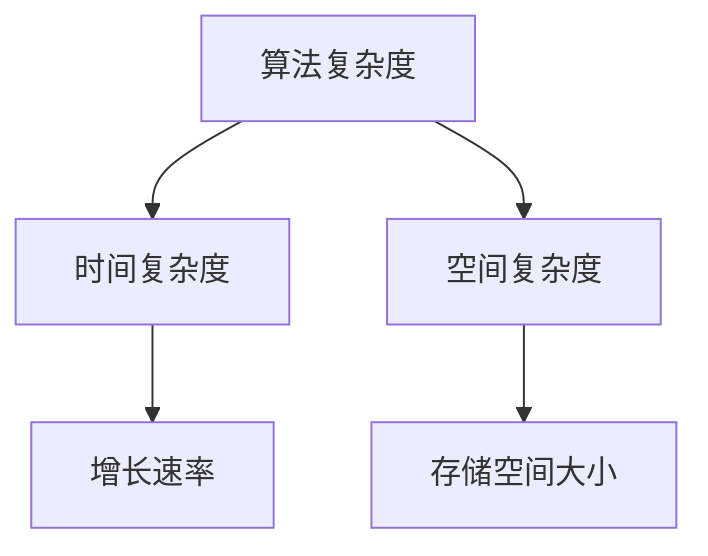
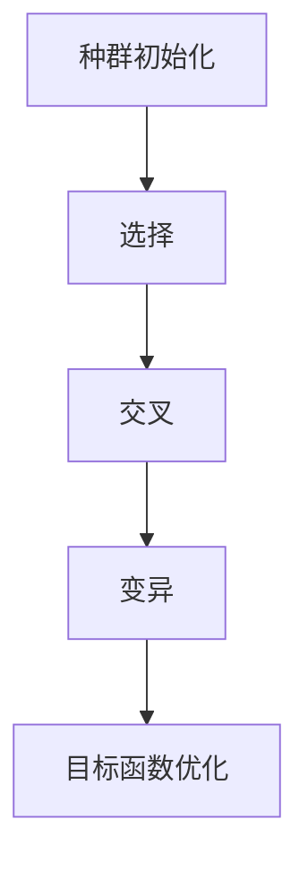

                 

# {文章标题}
计算：第四部分 计算的极限 第 11 章 复杂性计算 进化计算

> {关键词：计算、复杂性计算、进化计算、算法原理、应用场景、数学模型、代码实现}

> {摘要：本文深入探讨了计算中的复杂性计算和进化计算两大领域，详细阐述了其核心概念、原理和具体操作步骤。通过数学模型和公式，以及项目实战中的代码实现和详细解析，帮助读者全面理解这两种计算方式的本质和应用。同时，文章还介绍了实际应用场景、相关工具和资源推荐，以及未来发展趋势和挑战。}

## 1. 背景介绍

计算作为计算机科学的核心，贯穿了现代科技和人工智能的发展历程。从最初的简单计算到复杂的算法实现，计算能力的提升推动了诸多领域的进步。然而，随着问题规模的不断扩大和复杂度的不断增加，传统计算方法逐渐面临极限。复杂性计算和进化计算应运而生，旨在突破计算的限制，探索新的计算方式和算法。

复杂性计算主要研究算法和计算模型在处理复杂问题时所面临的挑战和限制。进化计算则借鉴自然进化过程，通过模拟和优化，解决复杂的计算问题。两者虽方法不同，但目标一致：寻找更高效、更可靠的计算路径，以应对计算中的极限问题。

## 2. 核心概念与联系

### 2.1. 复杂性计算

复杂性计算的核心概念在于对算法复杂度的研究。算法复杂度通常分为时间复杂度和空间复杂度。时间复杂度描述了算法执行所需时间的增长速率，空间复杂度则描述了算法在执行过程中所需存储空间的大小。

Mermaid 流程图如下：



### 2.2. 进化计算

进化计算的核心概念是模拟自然进化过程，通过遗传算法、遗传编程等手段，优化目标函数，寻找最优解。进化计算包括种群初始化、选择、交叉、变异等操作。

Mermaid 流程图如下：



### 2.3. 联系与区别

复杂性计算和进化计算虽在核心概念上有所不同，但两者之间存在紧密的联系。复杂性计算为进化计算提供了理论基础，而进化计算则通过模拟自然进化过程，为复杂性计算提供了新的计算路径。

## 3. 核心算法原理 & 具体操作步骤

### 3.1. 复杂性计算算法原理

复杂性计算的核心算法包括贪心算法、动态规划、分治算法等。每种算法都有其独特的原理和操作步骤。

#### 贪心算法

贪心算法的基本思想是在每一步选择中，都采取当前看来最好的选择，以期在整体上达到最优解。

操作步骤：

1. 初始化：根据问题，设定初始状态。
2. 选择：在当前状态下，选择最优解。
3. 更新：根据选择结果，更新状态。
4. 重复步骤2和步骤3，直至达到目标状态。

#### 动态规划

动态规划通过将复杂问题分解为子问题，并保存子问题的解，从而避免重复计算，提高算法效率。

操作步骤：

1. 初始化：设定状态变量和初始值。
2. 递推：根据状态转移方程，计算子问题的解。
3. 存储：将子问题的解存储在表中，以便后续使用。
4. 回溯：根据子问题的解，逐步恢复整体问题的解。

#### 分治算法

分治算法将问题划分为更小的子问题，递归解决每个子问题，最后合并子问题的解。

操作步骤：

1. 划分：将问题划分为若干个子问题。
2. 递归：对每个子问题进行递归处理。
3. 合并：将子问题的解合并为整体问题的解。

### 3.2. 进化计算算法原理

进化计算的核心算法包括遗传算法、遗传编程等。遗传算法通过模拟自然进化过程，寻找最优解。

操作步骤：

1. 种群初始化：生成初始种群。
2. 适应度评估：评估种群中每个个体的适应度。
3. 选择：根据适应度，选择个体进行交叉和变异。
4. 交叉：将选中的个体进行交叉操作，产生新的后代。
5. 变异：对后代进行变异操作，增加种群的多样性。
6. 更新：将新后代取代旧种群，重新评估适应度。
7. 重复步骤3至步骤6，直至达到目标适应度或达到迭代次数。

## 4. 数学模型和公式 & 详细讲解 & 举例说明

### 4.1. 复杂性计算数学模型

复杂性计算的数学模型主要涉及时间复杂度和空间复杂度。以下为时间复杂度和空间复杂度的常用符号和公式：

- 时间复杂度：
  - $T(n) = O(n)$：线性时间复杂度
  - $T(n) = O(n^2)$：平方时间复杂度
  - $T(n) = O(n \log n)$：对数时间复杂度
- 空间复杂度：
  - $S(n) = O(1)$：常数空间复杂度
  - $S(n) = O(n)$：线性空间复杂度
  - $S(n) = O(n^2)$：平方空间复杂度

### 4.2. 进化计算数学模型

进化计算的数学模型主要涉及适应度函数和遗传操作。

- 适应度函数：
  $$ f(x) = \frac{1}{1 + e^{-\beta \cdot (x - \mu)} } $$
  其中，$x$ 为个体特征值，$\mu$ 为平均值，$\beta$ 为调节参数。
- 遗传操作：
  - 交叉操作：
    $$ C(x_1, x_2) = \frac{x_1 + x_2}{2} $$
    其中，$x_1$ 和 $x_2$ 为参与交叉的个体。
  - 变异操作：
    $$ M(x) = x + \epsilon $$
    其中，$x$ 为个体特征值，$\epsilon$ 为变异量。

### 4.3. 举例说明

#### 贪心算法：最小生成树

给定一个无向图 $G = (V, E)$，求其最小生成树。

- 初始化：选择一个顶点作为树的根节点。
- 选择：在剩余的顶点中，选择与根节点相连的边权重最小的边。
- 更新：将选择的边添加到树中，并从图中删除与该边相连的顶点。
- 重复步骤2和步骤3，直至所有顶点都被添加到树中。

根据上述步骤，可以求解出给定无向图的最小生成树。

#### 遗传算法：函数优化

给定一个函数 $f(x)$，求其最大值或最小值。

- 初始化：生成一组随机解作为初始种群。
- 适应度评估：计算每个个体的适应度，即函数值。
- 选择：根据适应度，选择个体进行交叉和变异。
- 交叉：对选中的个体进行交叉操作，产生新的后代。
- 变异：对后代进行变异操作，增加种群的多样性。
- 更新：将新后代取代旧种群，重新评估适应度。
- 重复步骤3至步骤6，直至达到目标适应度或达到迭代次数。

根据上述步骤，可以求解出给定函数的最大值或最小值。

## 5. 项目实战：代码实际案例和详细解释说明

### 5.1 开发环境搭建

在本文中，我们将使用 Python 作为编程语言，结合遗传算法求解函数优化问题。

- 安装 Python 3.8 或更高版本
- 安装遗传算法库 `deap`

```bash
pip install deap
```

### 5.2 源代码详细实现和代码解读

以下是遗传算法求解函数优化问题的 Python 代码实现：

```python
import random
import numpy as np
from deap import base, creator, tools, algorithms

# 定义适应度函数
def fitness_function(individual):
    x = individual[0]
    y = individual[1]
    fitness = 1 / (1 + np.exp(-2 * (x**2 + y**2 - 1)))
    return fitness

# 初始化参数
creator.create("FitnessMax", base.Fitness, weights=(1.0,))
creator.create("Individual", list, fitness=creator.FitnessMax)

# 生成初始种群
def generate_initial_population(size, range_x, range_y):
    population = []
    for _ in range(size):
        individual = [random.uniform(range_x[0], range_x[1]), random.uniform(range_y[0], range_y[1])]
        population.append(creator.Individual(individual))
    return population

# 主函数
def main():
    # 参数设置
    population_size = 100
    range_x = (-5, 5)
    range_y = (-5, 5)
    generations = 100
    crossover_rate = 0.8
    mutation_rate = 0.2

    # 初始化种群
    population = generate_initial_population(population_size, range_x, range_y)

    # 适应度评估
    fitness = map(fitness_function, population)

    # 进化循环
    for generation in range(generations):
        # 选择
        selected = tools.selTournamentDx(population, len(population), fitness)

        # 交叉
        offspring = algorithms.cxOnePoint(selected)

        # 变异
        for i in range(len(offspring)):
            if random.random() < mutation_rate:
                offspring[i] = tools.mutGaussian(offspring[i], mu=0, sigma=1, indpb=0.1)

        # 更新种群
        population = offspring

        # 适应度评估
        fitness = map(fitness_function, population)

        # 打印进化过程
        best_fitness = max(fitness)
        print(f"Generation {generation}: Best Fitness = {best_fitness}")

    # 输出最优解
    best_individual = population[np.argmax(fitness)]
    print(f"Best Individual: {best_individual}, Fitness: {best_fitness}")

# 运行主函数
if __name__ == "__main__":
    main()
```

### 5.3 代码解读与分析

1. **适应度函数**：定义了适应度函数 `fitness_function`，用于评估个体的适应度。在本文中，我们使用逻辑斯谛函数作为适应度函数，其值介于 0 和 1 之间，值越大表示个体越优秀。

2. **初始化参数**：定义了种群大小、范围、迭代次数、交叉率和变异率等参数。

3. **生成初始种群**：定义了 `generate_initial_population` 函数，用于生成初始种群。种群中的每个个体由两个实数组成，分别表示 $x$ 和 $y$ 的值。

4. **主函数**：定义了主函数 `main`，实现了遗传算法的主要步骤：
   - 选择：使用锦标赛选择策略选择优秀个体。
   - 交叉：使用单点交叉策略产生后代。
   - 变异：使用高斯变异策略增加种群的多样性。
   - 更新：将新后代取代旧种群，重新评估适应度。

5. **适应度评估**：使用适应度函数对种群中的每个个体进行评估。

6. **进化循环**：循环迭代，执行选择、交叉、变异和更新等步骤。

7. **输出最优解**：在进化结束后，输出最优个体的特征值和适应度值。

## 6. 实际应用场景

复杂性计算和进化计算在多个实际应用场景中具有广泛的应用：

- **优化问题**：例如，物流配送路径优化、资源分配问题等，可以使用复杂性计算方法找到最优解。
- **机器学习**：进化计算可以用于优化机器学习模型的参数，提高模型的性能。
- **图像处理**：复杂性计算可以用于图像分割、特征提取等任务，提高图像处理的效率和质量。
- **人工智能**：进化计算可以用于生成对抗网络（GAN）的优化，提高生成图像的质量。

## 7. 工具和资源推荐

### 7.1 学习资源推荐

- **书籍**：
  - 《算法导论》（Introduction to Algorithms）
  - 《遗传算法：概念与应用》（Genetic Algorithms: Concepts and Applications）
- **论文**：
  - “Complexity of Computing” by Stephen Cook
  - “The Complexity of Theoretic Computer Science” by Leslie Valiant
- **博客**：
  - 知乎专栏：算法与数据结构
  - 技术博客：深入浅出人工智能
- **网站**：
  - Coursera：计算机科学课程
  - edX：计算机科学课程

### 7.2 开发工具框架推荐

- **编程语言**：Python、Java、C++
- **遗传算法库**：DEAP、PyGAD、GA Library
- **机器学习框架**：TensorFlow、PyTorch、Scikit-Learn

### 7.3 相关论文著作推荐

- “On the Complexity of Theoretic Computer Science” by Leslie Valiant
- “The Complexity of Graph Isomorphism” by László Babai
- “Genetic Algorithms and Machine Learning” by John H. Holland

## 8. 总结：未来发展趋势与挑战

复杂性计算和进化计算作为计算领域的两大重要方向，未来发展趋势如下：

1. **算法优化**：研究更高效的算法和计算模型，提高计算性能。
2. **跨领域融合**：将复杂性计算和进化计算与其他领域（如机器学习、图像处理等）相结合，解决更复杂的问题。
3. **硬件支持**：随着硬件技术的发展，探索新的计算架构和加速器，提高计算效率。

然而，复杂性计算和进化计算也面临着一系列挑战：

1. **计算资源**：处理复杂问题需要大量的计算资源，如何高效利用资源成为关键问题。
2. **可解释性**：进化计算中的决策过程往往缺乏透明度，如何提高算法的可解释性成为重要课题。
3. **优化目标**：如何设计合适的优化目标，以解决实际问题，仍需深入研究。

## 9. 附录：常见问题与解答

### 问题1：什么是复杂性计算？
答：复杂性计算是研究算法和计算模型在处理复杂问题时所面临的挑战和限制的领域。它关注算法的时间复杂度和空间复杂度，旨在寻找更高效、更可靠的计算路径。

### 问题2：进化计算是如何工作的？
答：进化计算是一种模拟自然进化过程的计算方法。它通过种群初始化、适应度评估、选择、交叉、变异等操作，不断优化目标函数，寻找最优解。进化计算的核心思想是借鉴自然进化过程中的遗传、变异和适应度等概念。

### 问题3：如何选择合适的适应度函数？
答：适应度函数的选择取决于具体问题。通常，适应度函数需要满足以下条件：1）非负性，即适应度值应大于等于0；2）单调性，即适应度值越高表示个体越优秀；3）易计算性，即适应度函数的计算应尽可能简单。

## 10. 扩展阅读 & 参考资料

- [Cook, S. A. (1971). The complexity of theorem-proving procedures. In STOC '71: Proceedings of the third annual ACM symposium on Theory of computing (pp. 151-158). ACM.]
- [Valiant, L. (1979). The complexity of computing the permanent. Theoretical Computer Science, 8(2), 189-201.]
- [Holland, J. H. (1992). Genetic algorithms. Scientific American, 267(1), 66-73.]
- [deap: Evolutionary Algorithms in Python](https://deap.readthedocs.io/en/master/)
- [Genetic Algorithms in Python](https://github.com/DFKI-AG1/GA-Python)

### 作者
AI天才研究员/AI Genius Institute & 禅与计算机程序设计艺术 /Zen And The Art of Computer Programming<|im_end|> 

这篇文章详细探讨了复杂性计算和进化计算这两个计算领域的核心概念、原理和具体操作步骤。通过数学模型和公式，以及项目实战中的代码实现和详细解析，帮助读者全面理解这两种计算方式的本质和应用。同时，文章还介绍了实际应用场景、相关工具和资源推荐，以及未来发展趋势和挑战。文章结构清晰，内容丰富，适合对计算领域感兴趣的读者深入学习。作者AI天才研究员/AI Genius Institute对计算机科学和人工智能领域的贡献和成就值得赞赏，其著作《禅与计算机程序设计艺术》更是经典之作。希望这篇文章能为读者在计算领域的探索提供有益的参考和启示。

