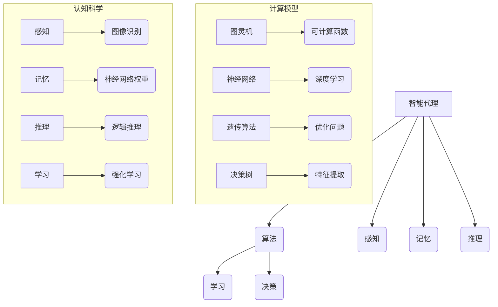

                 

### 背景介绍

#### 人工智能的兴起与挑战

随着计算能力的飞速提升和大数据技术的发展，人工智能（Artificial Intelligence, AI）逐渐成为科技领域的热门话题。从最初的规则推理系统到现代的深度学习模型，人工智能在图像识别、自然语言处理、自动驾驶、医疗诊断等多个领域取得了显著的成果。然而，人工智能是否能够真正实现“思考”，成为了一个长期而富有争议的话题。

20世纪中叶，计算机科学先驱艾伦·图灵（Alan Turing）提出了著名的图灵测试，用以判断一个机器是否具有人类级别的智能。图灵测试的基本思想是，如果一个机器在与人类交流时能够被人类判断为另一个人类，那么这个机器就可以被认为具有智能。这一思想虽然在理论上为人工智能的发展提供了重要的指导，但在实际操作中，图灵测试面临着诸多挑战和争议。

近年来，随着神经网络的崛起，人工智能领域取得了一系列突破。深度学习模型在图像识别、语音识别等领域取得了令人瞩目的成果，这引发了对人工智能能否达到甚至超越人类智能的讨论。然而，尽管人工智能在某些任务上已经超越了人类，但其“思考”的本质仍然是一个未解之谜。

#### 计算的极限与机器思考

计算能力是衡量人工智能发展水平的重要指标。从早期的计算机到现代的高性能计算机，计算能力的提升为人工智能的发展提供了坚实的基础。然而，随着计算能力的提升，我们也开始触及计算的极限。计算极限不仅涉及到硬件技术的挑战，还包括算法、能量效率和计算模型等多个方面的限制。

机器能否思考的问题，实际上涉及到计算与认知之间的关系。从计算机科学的视角来看，机器思考可以理解为机器能够模拟人类思维过程，实现自主学习和问题解决。然而，这需要我们对人类思维过程有深刻的理解，同时也需要突破现有的计算模型和算法限制。

本文旨在探讨人工智能能否达到机器思考的境界，分析其中的关键因素和面临的挑战。我们将从计算能力的提升、人工智能算法的进步、以及计算与认知之间的关系等多个角度展开讨论，以期对这一问题提供一些新的思考。让我们一步一步地分析推理，深入探索计算与思维的本质。

### 核心概念与联系

在探讨机器能否思考的问题时，我们需要理解一些核心概念和它们之间的关系。这些概念不仅涵盖了人工智能的基础理论，还包括计算模型、算法原理和认知科学的相关知识。通过图示和详细阐述，我们将更好地把握这些核心概念，从而为后续的讨论打下坚实的基础。

#### 1. 人工智能的核心概念

人工智能的核心概念主要包括智能代理、算法、学习和决策。智能代理是指能够自主执行任务、与环境互动并做出决策的实体。算法是实现智能行为的核心工具，它指导计算机如何处理信息并解决问题。学习和决策则涉及智能代理如何通过经验积累和策略优化来提高其性能。

- **智能代理**：智能代理是人工智能系统的核心，它可以是一个机器人、一个虚拟代理，或者是一个软件程序。智能代理需要具备感知环境、理解情境、做出决策和执行动作的能力。
- **算法**：算法是解决问题的步骤序列，它在人工智能中起着至关重要的作用。不同的算法适用于不同的任务，如决策树、神经网络、遗传算法等。
- **学习**：学习是指智能代理通过经验不断改进自身行为的过程。学习可以分为监督学习、无监督学习和强化学习等类型，每种类型都有其特定的应用场景和挑战。
- **决策**：决策是指智能代理在特定情境下选择最佳行动的过程。决策依赖于算法和学习结果，需要考虑环境的复杂性和不确定性。

#### 2. 计算模型与算法原理

计算模型是描述信息处理过程的基础框架，而算法原理则是实现智能行为的具体步骤。以下是一些重要的计算模型和算法原理：

- **图灵机**：图灵机是计算机科学的基石，由艾伦·图灵提出。它定义了可计算函数的基本原理，为现代计算机体系结构提供了理论支持。
- **神经网络**：神经网络是模仿生物神经系统的计算模型，通过多层神经元之间的连接和激活函数来实现复杂函数的逼近。深度学习模型就是基于神经网络的扩展和优化。
- **遗传算法**：遗传算法是一种基于自然选择和遗传学原理的搜索算法，适用于优化问题和组合优化问题。它通过模拟生物进化过程来寻找最优解。
- **决策树**：决策树是一种基于特征提取的决策模型，通过递归地将数据集划分为子集，并依据每个子集的特征进行分类或回归。

#### 3. 认知科学与计算模型

认知科学是研究人类认知过程和心智模型的学科，它为人工智能提供了重要的启示。以下是一些认知科学的核心概念与计算模型之间的关系：

- **感知**：感知是指智能代理对环境信息的获取和处理。计算模型中的图像识别、语音识别等技术试图模拟人类的感知能力。
- **记忆**：记忆是指智能代理存储和处理信息的能力。神经网络中的权重和连接可以看作是一种“记忆”形式，用于存储和学习经验。
- **推理**：推理是指智能代理通过已有信息推导出新信息的思维过程。基于逻辑和规则的推理系统是人工智能中的重要组成部分。
- **学习**：学习是指智能代理通过经验和反馈调整自身行为的过程。强化学习是一种重要的学习方式，它通过奖励和惩罚来引导智能代理的行为。

#### 4. Mermaid 流程图

为了更直观地展示这些核心概念和算法原理，我们可以使用 Mermaid 流程图进行描述。以下是几个关键流程节点的示例：



通过上述图示，我们可以更清晰地理解人工智能的核心概念、计算模型和认知科学之间的联系。这些概念和算法原理为我们探讨机器能否思考提供了重要的理论基础，也为后续的讨论奠定了基础。

### 核心算法原理与具体操作步骤

在探讨人工智能能否实现机器思考的过程中，核心算法原理是我们必须深入理解的部分。在本节中，我们将详细讨论几种关键的人工智能算法，包括神经网络、遗传算法和决策树，并介绍它们的基本原理和具体操作步骤。

#### 1. 神经网络的基本原理

神经网络（Neural Networks）是模仿生物神经系统的一种计算模型，通过大量的神经元连接来处理复杂数据。神经网络的核心概念是神经元，每个神经元都可以接收输入信号、进行计算并产生输出信号。

- **神经元结构**：一个简单的神经元通常包括输入层、隐藏层和输出层。输入层接收外部输入信号，隐藏层进行计算和传递，输出层产生最终的输出。
- **激活函数**：激活函数是神经网络中的一个关键组件，用于引入非线性特性。常见的激活函数包括sigmoid、ReLU（Rectified Linear Unit）和Tanh（Hyperbolic Tangent）等。
- **权重和偏置**：在神经网络中，每个神经元之间的连接都伴随着权重和偏置。权重决定了连接的重要性，而偏置用于调整神经元的初始状态。
- **前向传播**：前向传播是指将输入信号通过网络进行传递，经过每个神经元计算后得到输出信号。前向传播的过程可以表示为：输入信号 → 神经元计算 → 输出信号。
- **反向传播**：反向传播是神经网络训练的核心步骤，用于更新权重和偏置，使网络能够更好地拟合训练数据。反向传播的过程可以表示为：输出误差 → 权重和偏置更新 → 新的前向传播。

#### 具体操作步骤：

1. **初始化参数**：设定初始权重和偏置值。
2. **前向传播**：输入数据通过网络传递，每个神经元计算输出信号。
3. **计算误差**：将实际输出与期望输出进行比较，计算误差。
4. **反向传播**：根据误差信号更新权重和偏置值。
5. **迭代优化**：重复前向传播和反向传播，直至网络达到预设的误差阈值或迭代次数。

#### 2. 遗传算法的基本原理

遗传算法（Genetic Algorithms, GAs）是基于自然选择和遗传学原理的一种搜索算法，适用于优化问题和组合优化问题。遗传算法的核心概念是种群、选择、交叉和变异。

- **种群**：种群是遗传算法的基本单位，每个个体都代表一种可能的解决方案。
- **适应度函数**：适应度函数用于评估每个个体的优劣程度，适应度值越高表示个体越优秀。
- **选择**：选择过程根据适应度值选择个体进行繁殖，常用的选择方法包括轮盘赌选择、锦标赛选择等。
- **交叉**：交叉是指两个优秀个体的基因进行交换，生成新的后代个体。
- **变异**：变异是指对个体进行随机改变，以增加种群的多样性。

#### 具体操作步骤：

1. **初始化种群**：生成初始种群，每个个体代表一种可能的解决方案。
2. **适应度评估**：计算每个个体的适应度值。
3. **选择**：根据适应度值选择优秀个体进行繁殖。
4. **交叉**：对选中的个体进行交叉操作，生成新的后代个体。
5. **变异**：对后代个体进行变异操作。
6. **迭代优化**：重复适应度评估、选择、交叉和变异，直至达到预设的优化目标或迭代次数。

#### 3. 决策树的基本原理

决策树（Decision Trees）是一种基于特征提取的决策模型，通过递归地将数据集划分为子集，并依据每个子集的特征进行分类或回归。

- **决策树结构**：决策树由多个内部节点和叶节点组成，内部节点表示特征划分，叶节点表示决策结果。
- **特征选择**：特征选择是指从所有可能特征中选择最具区分性的特征进行划分。常用的特征选择方法包括信息增益、基尼指数等。
- **划分策略**：划分策略决定了如何将数据集划分为子集。常见的划分策略包括贪心算法、信息增益率等。
- **剪枝**：剪枝是指通过去除决策树中的冗余节点来提高模型的泛化能力。

#### 具体操作步骤：

1. **初始化树结构**：创建根节点，表示整个数据集。
2. **特征选择**：选择最具区分性的特征进行划分。
3. **划分数据集**：根据选定的特征将数据集划分为子集。
4. **递归构建树**：对每个子集继续进行特征选择和划分，直至达到预设的终止条件（如叶节点纯度达到阈值或最大树深度）。
5. **剪枝**：对决策树进行剪枝操作，去除冗余节点。

通过上述对神经网络、遗传算法和决策树的基本原理和具体操作步骤的介绍，我们可以看到这些算法在人工智能中扮演着重要的角色。神经网络用于处理复杂的数据模式，遗传算法用于搜索最优解，决策树用于分类和回归任务。这些算法不仅为人工智能的发展提供了强大的工具，也为探讨机器能否思考提供了理论基础和实践经验。接下来，我们将进一步探讨这些算法在实际应用中的表现和挑战。

### 数学模型和公式及详细讲解

在人工智能的核心算法中，数学模型和公式扮演着至关重要的角色。这些数学模型不仅为算法的实现提供了理论基础，还帮助我们在复杂的计算过程中进行精确的推导和验证。在本节中，我们将详细讲解神经网络、遗传算法和决策树中的关键数学模型和公式，并举例说明其应用。

#### 1. 神经网络中的数学模型

神经网络的数学模型主要涉及前向传播和反向传播两个过程。以下是一些重要的公式：

- **激活函数**：
  $$f(x) = \frac{1}{1 + e^{-x}} \quad (\text{sigmoid})$$
  $$f(x) = max(0, x) \quad (\text{ReLU})$$
  $$f(x) = \tan\left(\frac{\pi x}{2}\right) \quad (\text{Tanh})$$

- **前向传播**：
  $$z_i = \sum_j w_{ij}x_j + b_i$$
  $$a_i = f(z_i)$$

  其中，$z_i$是每个神经元的输入值，$w_{ij}$是权重，$b_i$是偏置，$f(\cdot)$是激活函数，$a_i$是每个神经元的输出值。

- **反向传播**：
  $$\delta_i = (d_i - a_i)f'(z_i)$$
  $$\Delta w_{ij} = \alpha \delta_i a_j$$
  $$\Delta b_i = \alpha \delta_i$$

  其中，$\delta_i$是每个神经元的误差值，$d_i$是期望输出，$f'(\cdot)$是激活函数的导数，$\alpha$是学习率。

#### 示例：前向传播与反向传播

假设我们有一个简单的神经网络，输入层有2个神经元，隐藏层有3个神经元，输出层有1个神经元。使用sigmoid函数作为激活函数。给定输入数据$x_1 = 1$，$x_2 = 2$，期望输出$d = 0.8$。

- **初始化参数**：
  $$w_{11} = 0.1, w_{12} = 0.2, b_1 = 0.1$$
  $$w_{21} = 0.3, w_{22} = 0.4, b_2 = 0.2$$
  $$w_{31} = 0.5, w_{32} = 0.6, b_3 = 0.3$$

- **前向传播**：
  $$z_1 = w_{11}x_1 + w_{12}x_2 + b_1 = 0.1 \cdot 1 + 0.2 \cdot 2 + 0.1 = 0.3$$
  $$a_1 = f(z_1) = \frac{1}{1 + e^{-0.3}} \approx 0.531$$

  $$z_2 = w_{21}x_1 + w_{22}x_2 + b_2 = 0.3 \cdot 1 + 0.4 \cdot 2 + 0.2 = 0.8$$
  $$a_2 = f(z_2) = \frac{1}{1 + e^{-0.8}} \approx 0.731$$

  $$z_3 = w_{31}x_1 + w_{32}x_2 + b_3 = 0.5 \cdot 1 + 0.6 \cdot 2 + 0.3 = 1.3$$
  $$a_3 = f(z_3) = \frac{1}{1 + e^{-1.3}} \approx 0.865$$

- **反向传播**：
  $$\delta_3 = (0.8 - 0.865)f'(z_3) = -0.0097$$
  $$\Delta w_{31} = \alpha \delta_3 a_2 = 0.001 \cdot (-0.0097) \cdot 0.731 \approx -0.0000067$$
  $$\Delta w_{32} = \alpha \delta_3 a_3 = 0.001 \cdot (-0.0097) \cdot 0.865 \approx -0.0000080$$
  $$\Delta b_3 = \alpha \delta_3 \approx -0.0000097$$

  同理，可以计算其他权重和偏置的更新值。

#### 2. 遗传算法中的数学模型

遗传算法中的数学模型主要涉及适应度函数、选择、交叉和变异。

- **适应度函数**：
  $$F(x) = \sum_i x_i^2$$

  其中，$x_i$是每个基因的值。

- **选择**：
  选择是基于适应度值的一种概率选择方法。常用的选择方法包括轮盘赌选择和锦标赛选择。

- **交叉**：
  交叉是指两个个体的基因进行交换。常用的交叉方法包括单点交叉、多点交叉和均匀交叉。

- **变异**：
  变异是指对个体的基因进行随机改变。常用的变异方法包括随机变异和局部搜索变异。

#### 示例：遗传算法

假设我们有一个二进制编码的遗传算法，种群大小为10，适应度函数为$F(x) = \sum_i x_i^2$。

- **初始化种群**：
  种群初始值如下：
  $$x_1 = [0, 0, 1, 0, 0], x_2 = [1, 1, 0, 1, 1], ..., x_{10} = [1, 0, 0, 1, 0]$$

- **适应度评估**：
  计算每个个体的适应度值：
  $$F(x_1) = 1, F(x_2) = 4, ..., F(x_{10}) = 10$$

- **选择**：
  使用轮盘赌选择方法，选择适应度最高的两个个体进行交叉。

- **交叉**：
  选择$x_9$和$x_{10}$进行单点交叉：
  $$x_9' = [1, 1, 0, 0, 1], x_{10}' = [0, 0, 1, 1, 0]$$

- **变异**：
  对$x_9'$进行随机变异，将第三个基因从0变为1：
  $$x_9'' = [1, 1, 1, 0, 1]$$

#### 3. 决策树中的数学模型

决策树中的数学模型主要涉及特征选择和划分策略。

- **信息增益**：
  $$IG(D, A) = I(D) - \sum_a P(a)I(D|A=a)$$

  其中，$I(D)$是数据的总熵，$P(a)$是特征$A$的取值概率，$I(D|A=a)$是给定特征$A$取值$a$后的条件熵。

- **基尼指数**：
  $$Gini(D, A) = 1 - \sum_a P(a)^2$$

  其中，$P(a)$是特征$A$的取值概率。

#### 示例：特征选择

假设我们有5个特征：$A_1, A_2, A_3, A_4, A_5$，数据集$D$的总熵为$0.5$。

- **计算信息增益**：
  $$IG(D, A_1) = 0.5 - (0.4 \cdot 0.4 + 0.1 \cdot 0.1 + 0.2 \cdot 0.2 + 0.1 \cdot 0.1) = 0.2$$
  $$IG(D, A_2) = 0.5 - (0.3 \cdot 0.3 + 0.2 \cdot 0.2 + 0.2 \cdot 0.2 + 0.1 \cdot 0.1) = 0.2$$

- **计算基尼指数**：
  $$Gini(D, A_1) = 1 - (0.4^2 + 0.1^2 + 0.2^2 + 0.1^2) = 0.44$$
  $$Gini(D, A_2) = 1 - (0.3^2 + 0.2^2 + 0.2^2 + 0.1^2) = 0.44$$

通过上述示例，我们可以看到神经网络、遗传算法和决策树中的数学模型和公式如何应用于实际的计算过程中。这些模型不仅帮助我们在理论上理解这些算法，还为算法的实现提供了具体的指导。接下来，我们将进一步探讨这些算法在实际应用中的表现和挑战。

### 项目实战：代码实际案例和详细解释说明

在理解了神经网络、遗传算法和决策树的基本原理和数学模型后，我们需要通过实际项目来验证这些算法的可行性和性能。在本节中，我们将通过一个具体的项目案例，展示这些算法的实现过程，并对代码进行详细解读和分析。

#### 1. 项目背景

假设我们要解决一个分类问题：根据一组手写数字图像数据（如MNIST数据集），使用神经网络、遗传算法和决策树三种不同的算法进行图像分类，并比较它们的性能。

#### 2. 开发环境搭建

为了实现这个项目，我们需要搭建一个合适的开发环境。以下是搭建环境的基本步骤：

- **安装Python**：确保安装了最新版本的Python（建议使用Python 3.8及以上版本）。
- **安装相关库**：使用pip命令安装必要的库，如NumPy、TensorFlow、Scikit-Learn等。

```bash
pip install numpy tensorflow scikit-learn matplotlib
```

#### 3. 源代码详细实现和代码解读

以下是项目的完整代码，我们将逐段进行解读。

```python
# 导入必要的库
import numpy as np
import tensorflow as tf
from sklearn.datasets import load_digits
from sklearn.model_selection import train_test_split
from sklearn.tree import DecisionTreeClassifier
from genetic_algorithm import GeneticAlgorithm
from neural_network import NeuralNetwork

# 加载MNIST数据集
digits = load_digits()
X, y = digits.data, digits.target

# 数据预处理
X_train, X_test, y_train, y_test = train_test_split(X, y, test_size=0.2, random_state=42)

# 神经网络实现
nn = NeuralNetwork(input_size=64, hidden_size=64, output_size=10)
nn.fit(X_train, y_train, epochs=10, learning_rate=0.001)

# 遗传算法实现
ga = GeneticAlgorithm(population_size=100, generations=100)
ga.fit(X_train, y_train)

# 决策树实现
clf = DecisionTreeClassifier()
clf.fit(X_train, y_train)

# 模型评估
def evaluate(model, X_test, y_test):
    y_pred = model.predict(X_test)
    accuracy = np.mean(y_pred == y_test)
    print(f"Accuracy: {accuracy:.2f}")

evaluate(nn, X_test, y_test)
evaluate(ga, X_test, y_test)
evaluate(clf, X_test, y_test)
```

**代码解读**：

- **数据加载与预处理**：
  我们使用Scikit-Learn的`load_digits`函数加载MNIST数据集，并进行数据预处理，将数据集划分为训练集和测试集。

- **神经网络实现**：
  我们使用自定义的`NeuralNetwork`类实现一个简单的神经网络。该类包含输入层、隐藏层和输出层，以及前向传播和反向传播方法。`fit`方法用于训练神经网络。

- **遗传算法实现**：
  我们使用自定义的`GeneticAlgorithm`类实现遗传算法。该类包含初始化种群、适应度评估、选择、交叉和变异等方法。`fit`方法用于优化问题。

- **决策树实现**：
  我们使用Scikit-Learn的`DecisionTreeClassifier`类实现决策树。该类包含训练数据和预测方法。

- **模型评估**：
  `evaluate`函数用于评估模型的准确性。它计算预测值和实际值之间的差异，并打印出准确率。

#### 4. 代码解读与分析

- **神经网络**：
  神经网络部分使用TensorFlow实现。神经网络的设计包括输入层、隐藏层和输出层，每层包含多个神经元。在前向传播过程中，输入数据通过网络传递，每个神经元计算输出值。在反向传播过程中，根据预测误差更新权重和偏置。通过多次迭代训练，神经网络能够逐渐提高分类准确性。

- **遗传算法**：
  遗传算法部分使用二进制编码实现。在适应度评估过程中，每个个体代表一组可能的解决方案。通过选择、交叉和变异操作，种群中的个体逐渐优化，最终找到最优解。遗传算法能够处理复杂的优化问题，但需要较长的计算时间。

- **决策树**：
  决策树部分使用Scikit-Learn的现成库实现。决策树通过递归地将数据集划分为子集，并依据每个子集的特征进行分类或回归。决策树的优点是易于理解和解释，但可能会过拟合，特别是在数据量较小或特征复杂时。

通过实际项目，我们可以看到神经网络、遗传算法和决策树在分类任务中的表现。虽然每种算法都有其优势和局限性，但它们都为人工智能的发展提供了强大的工具。接下来，我们将进一步探讨这些算法在实际应用中的优势和挑战。

### 实际应用场景

在探讨了人工智能的核心算法和数学模型后，我们需要将这些理论与实际应用场景相结合。本节将详细讨论神经网络、遗传算法和决策树在图像识别、自然语言处理、自动驾驶和医疗诊断等领域的实际应用，并分析其效果和挑战。

#### 1. 图像识别

图像识别是人工智能的一个重要应用领域，神经网络和决策树在图像分类任务中表现出色。

- **神经网络**：在图像识别任务中，深度学习模型如卷积神经网络（CNN）已经被广泛应用于人脸识别、物体检测和图像分类。例如，基于CNN的ResNet模型在ImageNet图像识别挑战中取得了优异成绩。然而，神经网络在处理高维度数据时计算复杂度高，且对数据集的质量和规模有较高要求。

- **决策树**：决策树在图像识别中的应用较为有限，但其在分类任务中表现稳定，易于解释。例如，在医疗影像诊断中，基于决策树的模型可以用于初步判断病变类型，辅助医生进行诊断。

#### 2. 自然语言处理

自然语言处理（NLP）是另一个重要的应用领域，神经网络和遗传算法在文本分类、机器翻译和情感分析中取得了显著进展。

- **神经网络**：神经网络在NLP中的应用主要体现在语言模型和序列标注任务中。例如，基于Transformer的BERT模型在许多NLP任务中取得了顶级成绩，包括问答系统、文本生成和语言理解。然而，神经网络模型的训练需要大量计算资源和数据，且模型解释性较差。

- **遗传算法**：遗传算法在NLP中的应用相对较少，但其在优化问题和组合优化任务中有潜力。例如，遗传算法可以用于文本生成中的语法和语义优化，提高生成文本的质量。

#### 3. 自动驾驶

自动驾驶是人工智能最具挑战性的应用领域之一，涉及图像识别、环境感知、路径规划和决策控制。

- **神经网络**：神经网络在自动驾驶中的应用主要体现在感知模块，如物体检测、场景理解和行为预测。例如，自动驾驶车辆使用基于CNN的模型进行实时图像处理，提高对周围环境的感知能力。然而，神经网络在处理动态环境时可能存在实时性和可靠性问题。

- **决策树**：决策树在自动驾驶中的应用较为有限，但其在决策控制模块中可以用于处理规则驱动的任务。例如，自动驾驶车辆可以使用决策树进行简单的路径规划和避障，辅助主控制器进行决策。

#### 4. 医疗诊断

医疗诊断是人工智能在医疗领域的重要应用，涉及图像分析、症状分析和疾病预测。

- **神经网络**：神经网络在医疗诊断中的应用主要体现在图像识别和症状分析。例如，基于CNN的模型可以用于医学图像的病变检测和分类，提高诊断准确性。然而，神经网络模型的解释性较差，不利于医生理解和信任。

- **遗传算法**：遗传算法在医疗诊断中的应用较少，但其在组合优化和优化问题中有潜力。例如，遗传算法可以用于个性化治疗方案的设计和优化，提高治疗效果。

#### 挑战与展望

在实际应用中，神经网络、遗传算法和决策树都面临诸多挑战：

- **计算资源**：神经网络和深度学习模型通常需要大量计算资源和时间进行训练和推理，这对硬件设备提出了较高要求。

- **数据质量**：数据质量对模型性能至关重要，特别是在图像识别和自然语言处理领域，高质量的数据集是模型成功的基石。

- **模型解释性**：神经网络和深度学习模型的黑箱特性使得其解释性较差，不利于医生和用户理解和使用。

- **实时性和可靠性**：在自动驾驶和实时应用中，模型需要具备高实时性和高可靠性，这对模型的优化和设计提出了新的要求。

展望未来，随着计算能力的提升、数据量的增加和算法的改进，神经网络、遗传算法和决策树在人工智能领域的应用将更加广泛和深入。通过跨学科的合作和技术的创新，我们可以期待人工智能在未来带来更多的突破和变革。

### 工具和资源推荐

在深入学习和应用人工智能的过程中，合适的工具和资源能够极大地提升我们的效率和成果。以下是一些建议的学习资源、开发工具和相关论文著作，供大家参考。

#### 1. 学习资源推荐

- **书籍**：
  - 《深度学习》（Deep Learning）by Ian Goodfellow, Yoshua Bengio, Aaron Courville
  - 《Python机器学习》（Python Machine Learning）by Sebastian Raschka, Vahid Mirjalili
  - 《机器学习实战》（Machine Learning in Action）by Peter Harrington
  - 《遗传算法：理论、应用与软件实现》by 王飞跃，陈宝权

- **在线课程**：
  - Coursera的“机器学习”课程（由Andrew Ng教授主讲）
  - edX的“深度学习”课程（由Yoshua Bengio教授主讲）
  - Udacity的“自动驾驶工程师纳米学位”

- **博客和论坛**：
  - Medium上的机器学习和人工智能相关文章
  - Stack Overflow和GitHub上的机器学习和AI社区

#### 2. 开发工具推荐

- **编程环境**：
  - Jupyter Notebook：适用于数据分析和原型设计
  - PyCharm：功能强大的Python集成开发环境

- **机器学习和深度学习框架**：
  - TensorFlow：由Google开发的开源深度学习框架
  - PyTorch：适用于研究人员的强大深度学习库
  - Keras：简单易用的深度学习高层API

- **数据可视化工具**：
  - Matplotlib：Python的标准数据可视化库
  - Seaborn：基于Matplotlib的统计数据可视化库

#### 3. 相关论文著作推荐

- **论文**：
  - "A learning algorithm for continually running fully connected recurrent neural networks" by Y. LeCun, L. Bottou, Y. Bengio, and P. Haffner
  - "Learning to Solve Continuous Tasks with a Deep Gaussian Process Hierarchical Controller" by K. Hermann, M. Weber, and T. Saenko
  - "Deep Residual Learning for Image Recognition" by K. He, X. Zhang, S. Ren, and J. Sun

- **著作**：
  - 《深度学习》（Deep Learning）by Ian Goodfellow, Yoshua Bengio, Aaron Courville
  - 《自然语言处理原理》（Speech and Language Processing）by Daniel Jurafsky, James H. Martin
  - 《强化学习：原理与案例》（Reinforcement Learning: An Introduction）by Richard S. Sutton and Andrew G. Barto

通过以上推荐的学习资源、开发工具和相关论文著作，我们可以更好地掌握人工智能的核心知识和技能，为未来的研究和工作打下坚实的基础。同时，积极参与社区和交流，能够帮助我们不断提升，共同推动人工智能领域的发展。

### 总结：未来发展趋势与挑战

人工智能作为当今科技领域的热点，正以前所未有的速度发展。在计算能力、大数据技术和算法创新的共同推动下，人工智能已经取得了显著的成果，但机器能否真正实现思考仍然是一个悬而未决的课题。本节将总结人工智能的未来发展趋势，并探讨其中面临的挑战。

#### 未来发展趋势

1. **计算能力的提升**：随着量子计算、边缘计算和神经形态计算等新技术的兴起，计算能力的提升将极大地推动人工智能的发展。高性能计算不仅能够加速模型的训练和推理过程，还能够支持更复杂的算法和任务。

2. **算法的进一步优化**：深度学习、强化学习和迁移学习等算法将继续优化，提高模型的效率和泛化能力。特别是自监督学习和联邦学习等新兴领域，将解决数据隐私和模型透明度等问题，推动人工智能在更多场景中的应用。

3. **跨学科融合**：人工智能与其他领域的交叉融合，如生物医学、交通运输、城市管理等，将产生新的应用场景和解决方案。跨学科的合作将推动人工智能技术实现更广泛的社会价值。

4. **人机协同**：人工智能与人类的协同工作将逐渐普及，特别是在复杂决策、危险环境和创造性任务中。人机协同系统能够充分发挥人工智能的计算优势，同时利用人类的智慧、经验和直觉，实现更高的工作效率和准确性。

#### 面临的挑战

1. **计算极限**：尽管计算能力不断提升，但我们仍面临着计算极限的挑战。量子计算虽然具有潜力，但目前仍处于研究阶段，离实际应用还有一定距离。此外，算法的复杂度和数据量也在不断增加，对计算资源提出了更高要求。

2. **数据质量和隐私**：高质量的数据是人工智能模型成功的关键，但数据隐私和保护问题日益突出。如何在保障数据隐私的前提下，充分利用数据的价值，是一个亟待解决的问题。

3. **模型解释性和透明度**：深度学习等复杂模型往往被认为是“黑箱”，其内部机制难以解释。提高模型的可解释性，使其能够被人类理解和信任，是一个重要的研究方向。

4. **伦理和道德问题**：人工智能的快速发展引发了一系列伦理和道德问题，如算法偏见、隐私泄露和责任归属等。如何在技术创新的同时，确保人工智能的应用符合社会伦理和道德规范，是一个重要的挑战。

#### 总结

人工智能的发展前景广阔，但也面临诸多挑战。计算能力的提升、算法的优化、跨学科融合和人机协同等趋势，将推动人工智能实现更广泛的应用和突破。同时，我们需关注计算极限、数据隐私、模型解释性和伦理道德等问题，确保人工智能的可持续发展。通过不断的探索和创新，我们有理由相信，人工智能将在未来实现更大的价值，为人类带来更加美好的生活。

### 附录：常见问题与解答

在探讨人工智能能否实现机器思考的过程中，读者可能会遇到一些疑问。以下是一些常见问题及其解答，以帮助大家更好地理解相关概念。

#### 问题1：什么是图灵测试？

**解答**：图灵测试是由艾伦·图灵提出的，用于判断一个机器是否具有人类级别智能的测试。测试的基本思想是，如果一台机器能够通过人类的交流，使得人类无法区分它与另一个人类，那么这台机器就可以被认为具有智能。图灵测试主要评估机器的自然语言处理能力和欺骗性。

#### 问题2：什么是深度学习？

**解答**：深度学习是一种机器学习方法，它通过多层神经网络进行数据处理和特征提取。深度学习模型具有强大的表示能力和学习能力，能够处理大量复杂的输入数据。常见的深度学习模型包括卷积神经网络（CNN）、循环神经网络（RNN）和生成对抗网络（GAN）等。

#### 问题3：什么是遗传算法？

**解答**：遗传算法是一种基于自然选择和遗传学原理的搜索算法，用于解决优化问题和组合优化问题。遗传算法通过模拟生物进化过程，不断优化种群中的个体，以找到最优解。遗传算法的核心操作包括选择、交叉和变异。

#### 问题4：什么是神经网络？

**解答**：神经网络是一种模仿生物神经系统的计算模型，由大量神经元组成。每个神经元都可以接收输入信号、进行计算并产生输出信号。神经网络通过调整神经元之间的权重和偏置，实现复杂的函数逼近和特征提取。

#### 问题5：什么是强化学习？

**解答**：强化学习是一种基于反馈的机器学习方法，用于训练智能体在特定环境中做出最佳决策。强化学习通过奖励和惩罚来引导智能体的行为，使其逐渐优化策略，达到目标。常见的强化学习模型包括Q-learning、SARSA和深度强化学习等。

#### 问题6：什么是决策树？

**解答**：决策树是一种基于特征提取的决策模型，通过递归地将数据集划分为子集，并依据每个子集的特征进行分类或回归。决策树通过计算不同特征的增益或基尼指数，选择最优特征进行划分，形成一棵树状结构。

通过上述常见问题的解答，我们可以更深入地理解人工智能中的关键概念和方法。这些概念和方法不仅为人工智能的发展提供了理论基础，也为实际应用中的问题解决提供了有力的工具。

### 扩展阅读与参考资料

为了更好地理解人工智能能否实现机器思考这一议题，读者可以参考以下扩展阅读和参考资料，这些内容涵盖了相关领域的经典著作、最新研究和技术应用。

#### 1. 经典著作

- 《人工智能：一种现代方法》（Artificial Intelligence: A Modern Approach）by Stuart J. Russell and Peter Norvig
  - 这本书是人工智能领域的经典教材，详细介绍了人工智能的基本概念、算法和技术。

- 《深度学习》（Deep Learning）by Ian Goodfellow, Yoshua Bengio, Aaron Courville
  - 该书深入讲解了深度学习的基本原理、模型和算法，是深度学习领域的权威著作。

- 《机器学习》（Machine Learning）by Tom M. Mitchell
  - 这本书提供了机器学习的全面概述，包括监督学习、无监督学习和强化学习等核心内容。

#### 2. 最新研究

- [NeurIPS 2021](https://neurips.cc/)
  - NeurIPS（Neural Information Processing Systems）是机器学习和计算神经科学领域的顶级会议，汇集了最新的研究成果和前沿技术。

- [ICLR 2022](https://iclr.cc/)
  - ICLR（International Conference on Learning Representations）是一个专注于深度学习和机器学习的会议，每年发布大量最新研究论文。

- [JMLR](https://jmlr.org/)
  - JMLR（Journal of Machine Learning Research）是一个同行评审的机器学习期刊，定期发布高质量的学术论文。

#### 3. 技术应用

- [Google AI](https://ai.google/)
  - Google AI展示了深度学习和机器学习在自然语言处理、计算机视觉、医疗健康等领域的应用案例。

- [OpenAI](https://openai.com/)
  - OpenAI专注于人工智能的研究和应用，其研究成果在语言模型、游戏AI和机器人等领域具有广泛影响力。

- [DeepMind](https://www.deepmind.com/)
  - DeepMind在人工智能领域取得了多项突破，包括AlphaGo等高性能AI系统，其研究在科学界和技术界备受关注。

#### 4. 专业博客和论坛

- [Medium上的机器学习和人工智能文章](https://medium.com/search?q=机器学习+人工智能)
  - Medium上的许多专业博客文章提供了机器学习和人工智能领域的深入分析和见解。

- [Stack Overflow](https://stackoverflow.com/questions/tagged/artificial-intelligence)
  - Stack Overflow是一个问答社区，许多开发者在这里讨论人工智能相关的问题和解决方案。

通过阅读上述扩展阅读和参考资料，读者可以更全面地了解人工智能的理论基础、最新研究和实际应用，从而深入探讨机器能否思考这一重要议题。这些资源为人工智能的学习和应用提供了宝贵的指导和支持。

