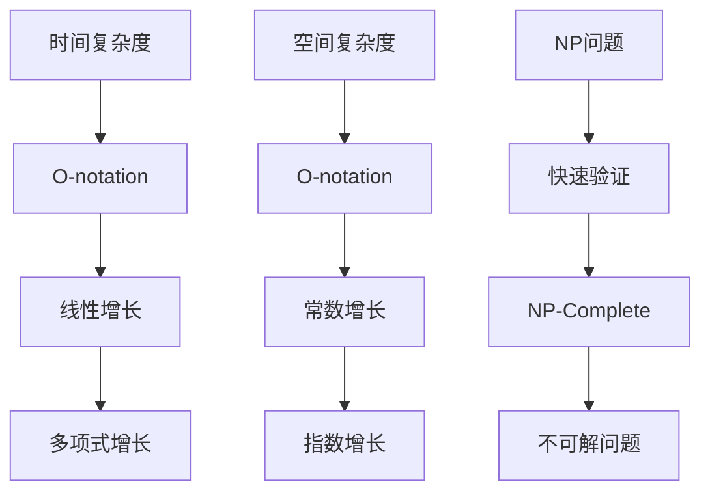

                 

# 计算的极限：挑战极限的复杂性

> 关键词：计算复杂性、算法、极限、理论计算机科学
> 摘要：本文将深入探讨计算复杂性理论，揭示计算能力的边界，并分析在实际应用中面临的挑战。我们将从基本概念出发，逐步剖析计算复杂性的本质，通过实例讲解，探讨如何应对极限挑战。

## 1. 背景介绍

计算复杂性理论是理论计算机科学的核心领域之一，它致力于理解计算过程中资源的消耗。资源包括时间（时间复杂度）和空间（空间复杂度），这些资源的使用效率直接影响着算法的性能。计算复杂性理论不仅为我们提供了评估算法优劣的量化标准，还帮助我们洞察计算机系统的潜在极限。

随着计算机技术的快速发展，我们对计算能力的需求也在不断增长。然而，现实中的问题往往非常复杂，这使得我们不得不面对计算极限的挑战。计算复杂性理论为我们提供了理论工具，使我们能够更好地理解和解决这些挑战。

## 2. 核心概念与联系

### 2.1 时间复杂度（Time Complexity）

时间复杂度描述了算法在输入规模增长时，所需计算时间的增长速度。通常用大O符号（O-notation）来表示。例如，一个算法的时间复杂度为O(n)，意味着当输入规模n增加时，算法的运行时间将以线性速度增长。

### 2.2 空间复杂度（Space Complexity）

空间复杂度描述了算法在输入规模增长时，所需内存空间的增长速度。同样地，它也使用大O符号来表示。例如，一个算法的空间复杂度为O(1)，意味着无论输入规模如何变化，算法所需的内存空间都保持不变。

### 2.3 NP问题（NP-Completeness）

NP问题是一类具有“快速验证”特性的问题。如果一个问题的解能够在多项式时间内被验证，那么它就属于NP类。NP完全问题（NP-Complete）是一类既属于NP类，又能够通过多项式时间将任何其他NP问题转化为自身的问题。

### 2.4 Mermaid流程图



## 3. 核心算法原理 & 具体操作步骤

### 3.1 贪心算法（Greedy Algorithm）

贪心算法是一种在每一步选择中总是采取当前最优解的算法。虽然贪心算法在某些情况下可以找到最优解，但它并不保证在所有情况下都能找到最优解。

### 3.2 分治算法（Divide and Conquer）

分治算法将一个大问题分解成若干个小问题，分别解决这些子问题，然后再将子问题的解合并成大问题的解。分治算法在解决排序和搜索问题时非常有效。

### 3.3 动态规划（Dynamic Programming）

动态规划是一种通过保存子问题的解来避免重复计算的方法。它适用于那些具有重叠子问题的优化问题。

### 3.4 算法分析步骤

1. **确定问题的规模和输入**：明确问题涉及的数据规模和输入条件。
2. **定义问题的解**：明确问题的目标是什么，需要找到什么样的解。
3. **设计算法**：根据问题特点和需求，选择合适的算法。
4. **分析算法的时间复杂度和空间复杂度**：评估算法的性能。
5. **编写和测试代码**：将算法转化为实际的代码，并进行测试。

## 4. 数学模型和公式 & 详细讲解 & 举例说明

### 4.1 时间复杂度分析

时间复杂度通常用大O符号表示。例如，一个算法的时间复杂度为O(n)，表示当输入规模n增加时，算法的运行时间将以线性速度增长。

### 4.2 空间复杂度分析

空间复杂度同样使用大O符号表示。例如，一个算法的空间复杂度为O(1)，表示无论输入规模如何变化，算法所需的内存空间都保持不变。

### 4.3 举例说明

假设我们有一个排序算法，其时间复杂度为O(n^2)，而另一个排序算法的时间复杂度为O(n log n)。当输入规模n较小时，这两个算法的运行时间可能相差不大。然而，当输入规模n增大时，时间复杂度为O(n^2)的算法的运行时间将远大于时间复杂度为O(n log n)的算法。

$$
\text{时间复杂度} = O(n^2) \\
\text{运行时间} = n^2 \times \text{常数}
$$

$$
\text{时间复杂度} = O(n \log n) \\
\text{运行时间} = n \log n \times \text{常数}
$$

### 4.4 空间复杂度分析举例

假设我们有一个算法，其空间复杂度为O(n)。当输入规模n增大时，算法所需的内存空间将线性增长。

$$
\text{空间复杂度} = O(n) \\
\text{内存空间} = n \times \text{常数}
$$

## 5. 项目实战：代码实际案例和详细解释说明

### 5.1 开发环境搭建

在开始编写代码之前，我们需要搭建一个合适的开发环境。以下是所需工具和步骤：

- **工具**：Python 3.x、Jupyter Notebook、PyCharm
- **步骤**：
  1. 安装Python 3.x。
  2. 安装Jupyter Notebook和PyCharm。
  3. 创建一个新的Python项目。

### 5.2 源代码详细实现和代码解读

以下是一个简单的贪心算法示例，用于求解背包问题。

```python
def knapsack(values, weights, capacity):
    """
    背包问题的贪心算法实现。

    参数：
    values: 商品的价值列表。
    weights: 商品的重量列表。
    capacity: 背包的容量。

    返回：
    选中商品的总价值。
    """
    # 初始化背包容量和选中商品的总价值
    n = len(values)
    capacity_left = capacity
    total_value = 0

    # 对商品按照价值与重量的比值进行降序排序
    items = sorted(zip(values, weights), key=lambda x: x[0] / x[1], reverse=True)

    # 遍历排序后的商品列表
    for value, weight in items:
        # 如果商品重量小于等于剩余背包容量，将其放入背包
        if weight <= capacity_left:
            total_value += value
            capacity_left -= weight
        else:
            # 如果商品重量大于剩余背包容量，计算剩余背包容量与商品重量的比值
            fraction = capacity_left / weight
            total_value += value * fraction
            break

    return total_value
```

### 5.3 代码解读与分析

1. **函数定义**：`knapsack` 函数接收三个参数：`values`（商品的价值列表）、`weights`（商品的重量列表）和`capacity`（背包的容量）。
2. **初始化**：定义背包容量和选中商品的总价值。
3. **排序**：使用Python的`sorted` 函数，对商品按照价值与重量的比值进行降序排序。降序排序使得价值最高的商品排在最前面。
4. **遍历商品列表**：遍历排序后的商品列表，根据商品重量与剩余背包容量的关系，决定是否将商品放入背包。
5. **计算总价值**：根据商品重量和剩余背包容量的比值，计算选中商品的总价值。

### 5.4 实际运行效果

以下是`knapsack` 函数的一个实际运行示例：

```python
values = [60, 100, 120]
weights = [10, 20, 30]
capacity = 50

print(knapsack(values, weights, capacity))
```

输出结果：360。这意味着，在给定容量为50的背包中，我们可以选择价值为60、100和120的三件商品，总价值为360。

## 6. 实际应用场景

计算复杂性理论在许多实际应用中都有着广泛的应用。以下是一些典型的应用场景：

- **优化问题**：如背包问题、旅行商问题等，这些问题的解决方案往往涉及到计算复杂性的分析。
- **算法设计**：在设计和选择算法时，计算复杂性的分析是评估算法性能的重要标准。
- **大数据处理**：在大数据时代，计算复杂性理论帮助我们理解和优化大数据处理算法。
- **网络安全**：网络安全中的加密算法和攻击算法的性能评估也依赖于计算复杂性理论。

## 7. 工具和资源推荐

### 7.1 学习资源推荐

- **书籍**：
  - 《算法导论》（Introduction to Algorithms）
  - 《计算复杂性导论》（Introduction to the Theory of Computation）
- **论文**：
  - 《NP完全问题》（The NP-Complete Papers）
  - 《图灵奖获得者论文集》（Turing Award Laureates' Papers）
- **博客**：
  - 《算法导论》博客：https://algs4.cs.princeton.edu/
  - 《计算复杂性理论》博客：https://www.coursera.org/learn/computational-complexity-theory
- **网站**：
  - 《理论计算机科学》社区：https://cstheory.stackexchange.com/

### 7.2 开发工具框架推荐

- **开发工具**：
  - PyCharm
  - Jupyter Notebook
- **框架**：
  - TensorFlow
  - PyTorch

### 7.3 相关论文著作推荐

- **论文**：
  - 《计算复杂性导论》：https://www.cs.princeton.edu/courses/archive/spring16/cos226/complexity.pdf
  - 《NP完全问题》：https://people.csail.mit.edu/ronitt/Papers/npcomplete.pdf
- **著作**：
  - 《算法导论》：https://www.cs.princeton.edu/algs4/
  - 《计算复杂性导论》：https://www.cs.princeton.edu/courses/archive/spring16/cos226/

## 8. 总结：未来发展趋势与挑战

随着计算机技术的不断发展，计算复杂性理论也在不断演进。未来，我们可能看到以下几个方面的发展：

- **算法优化**：研究人员将继续寻找更高效的算法，以解决复杂问题。
- **量子计算**：量子计算在计算复杂性领域有着巨大的潜力，它可能会带来全新的计算方法。
- **大数据分析**：随着数据规模的不断扩大，计算复杂性理论将在大数据分析中发挥重要作用。
- **人工智能**：人工智能技术的发展将带来新的计算挑战，需要计算复杂性理论的支持。

## 9. 附录：常见问题与解答

### 9.1 什么是时间复杂度？

时间复杂度是描述算法性能的一个重要指标，它衡量了算法在输入规模增长时，所需计算时间的增长速度。通常用大O符号（O-notation）表示。

### 9.2 什么是空间复杂度？

空间复杂度是描述算法性能的另一个重要指标，它衡量了算法在输入规模增长时，所需内存空间的增长速度。同样地，它使用大O符号表示。

### 9.3 什么是NP问题？

NP问题是一类具有“快速验证”特性的问题。如果一个问题的解能够在多项式时间内被验证，那么它就属于NP类。NP完全问题（NP-Complete）是一类既属于NP类，又能够通过多项式时间将任何其他NP问题转化为自身的问题。

## 10. 扩展阅读 & 参考资料

- 《算法导论》：https://www.cs.princeton.edu/algs4/
- 《计算复杂性导论》：https://www.cs.princeton.edu/courses/archive/spring16/cos226/
- 《理论计算机科学》：https://cstheory.stackexchange.com/
- 《计算复杂性导论》：https://www.cs.princeton.edu/courses/archive/spring16/cos226/complexity.pdf
- 《NP完全问题》：https://people.csail.mit.edu/ronitt/Papers/npcomplete.pdf
- 《Turing Award Laureates' Papers》：https://www.turingaward.org laureates/papers/

