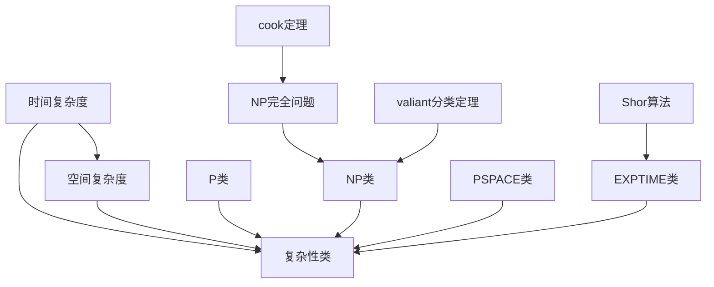

                 

### 计算的极限：计算复杂性探微

#### 引言

计算复杂性理论是现代计算机科学的一个核心分支，它研究算法运行时间和所需资源之间的关系，以及不同问题之间的相对难度。从理论上讲，计算复杂性试图揭示计算问题的本质特性，为我们提供了一种量化和比较问题难度的工具。计算复杂性理论不仅对理论计算机科学的发展具有重要意义，而且在密码学、算法设计、人工智能等诸多领域都有着广泛的应用。

在本章中，我们将深入探讨计算复杂性的基本概念和理论体系。首先，我们会介绍计算复杂性的基础概念，包括时间复杂度和空间复杂度。接着，我们会详细讨论著名的计算复杂性分类，如P与NP问题，以及一些重要的复杂性类，如PSPACE、NPSPACE等。此外，我们还将介绍一些著名的复杂性问题及其在现实世界中的应用。通过这一系列探讨，我们将对计算复杂性有一个全面而深刻的理解。

#### 关键词

计算复杂性（Computational Complexity）、时间复杂度（Time Complexity）、空间复杂度（Space Complexity）、P与NP问题（P vs NP Problem）、复杂性分类（Complexity Classes）、复杂性理论（Complexity Theory）、算法设计（Algorithm Design）、人工智能（Artificial Intelligence）、密码学（Cryptography）。

#### 摘要

本章旨在介绍计算复杂性理论的基本概念、理论体系以及其在实际应用中的重要性。首先，我们将对计算复杂性进行定义，并阐述其研究的基本问题。然后，我们将介绍时间复杂度和空间复杂度的基本概念，并详细探讨计算复杂性的主要分类，如P与NP问题。此外，我们还将介绍一些著名的复杂性问题和相关算法，分析其在现实世界中的应用。通过本章的阅读，读者将能够理解计算复杂性理论的精髓，并为后续章节的深入探讨奠定基础。

---

## 1. 背景介绍

计算复杂性理论起源于20世纪中期，随着计算机科学的兴起而逐渐发展起来。最早对计算复杂性进行系统研究的是美国数学家斯蒂芬·科勒（Stephen Cook）和莱斯利·瓦萨维基斯（Leslie Valiant）。他们在1971年分别独立提出了P与NP问题的概念，这标志着计算复杂性理论的诞生。

计算复杂性理论的研究旨在解决以下基本问题：给定一个算法，如何衡量其复杂程度？不同的算法在解决同一问题时，哪一个更优？如何根据问题的性质设计更高效的算法？这些问题不仅对理论计算机科学具有重要意义，而且对实际应用有着深远的影响。

在计算复杂性理论的发展历程中，有几位杰出的科学家做出了突出贡献。例如，理查德·科恩（Richard Karp）在1972年提出了21个著名的NP完全问题，这为研究NP完全问题提供了重要的理论工具。彼得·夏农（Peter Shor）在1994年提出了量子计算算法，特别是量子素数分解算法，这一突破性成果不仅展示了量子计算机的巨大潜力，也对计算复杂性理论产生了深远影响。

随着计算技术的发展，计算复杂性理论在多个领域得到了广泛应用。例如，在密码学中，计算复杂性理论用于分析密码算法的安全性；在人工智能领域，计算复杂性理论指导算法的设计与优化；在算法设计领域，计算复杂性理论提供了评估算法性能的理论依据。总之，计算复杂性理论已经成为现代计算机科学不可或缺的一部分。

#### 核心概念与联系

计算复杂性理论的核心概念主要包括时间复杂度、空间复杂度以及复杂性类。为了更好地理解这些概念，我们可以通过一个Mermaid流程图来展示它们之间的联系。



下面，我们将详细解释每个概念：

### 时间复杂度

时间复杂度是指算法在运行过程中所需时间的增长速率。通常用大O符号表示，如`O(n)`表示算法的时间复杂度为线性时间。时间复杂度反映了算法的时间效率，是评估算法性能的重要指标。

### 空间复杂度

空间复杂度是指算法在运行过程中所需内存的增长速率。与时间复杂度类似，空间复杂度也用大O符号表示。空间复杂度反映了算法的内存效率，是评估算法性能的另一个重要指标。

### 复杂性类

复杂性类是一组具有相同复杂度特性的问题的集合。常见的复杂性类包括P类、NP类、PSPACE类、NPSPACE类等。每个复杂性类都有其特定的定义和特性，它们在计算复杂性理论中起到了分类和比较作用。

- **P类**：P类问题是指能够在多项式时间内解决的问题集合。P类问题通常被认为是可以高效解决的。
- **NP类**：NP类问题是指如果一个问题的解可以在多项式时间内被验证的集合。虽然NP类问题不一定能被高效解决，但它们的解可以在多项式时间内被验证。
- **PSPACE类**：PSPACE类问题是指能够在多项式空间内解决的问题集合。PSPACE类问题涵盖了比P类问题更广泛的问题。
- **NPSPACE类**：NPSPACE类问题是指能够在多项式空间内被验证的问题集合。与PSPACE类类似，NPSPACE类问题涵盖了比NP类问题更广泛的问题。

### 核心算法原理 & 具体操作步骤

在计算复杂性理论中，核心算法通常是指用于解决特定复杂性问题的算法。这些算法的设计和实现不仅需要深刻的数学理论支持，还需要对问题本身的深入理解。以下我们将介绍几个典型的核心算法，并详细描述其原理和操作步骤。

### 1. 素数测试算法

素数测试算法用于判断一个给定的大整数是否为素数。最著名的素数测试算法是米勒-拉宾素数测试（Miller-Rabin Primality Test）。以下是该算法的原理和步骤：

#### 原理

米勒-拉宾素数测试基于数论中的几个定理，特别是费马小定理和二次剩余定理。对于任意一个大于2的素数p，如果a是一个小于p的整数，那么`a^(p-1) ≡ 1 (mod p)`。如果p不是素数，则存在某个d使得`d*2^r ≡ p-1 (mod p)`，其中r是p-1中2的指数。

#### 步骤

1. 随机选择一个小于p的整数a。
2. 计算`a^d ≡ x (mod p)`。
3. 如果x≠1且x≠p-1，则p是合数。
4. 如果x=p-1，则继续执行下一步。
5. 对于每个r从0到k-1，计算`x^2 ≡ y (mod p)`。
6. 如果y≠1且y≠p-1，则p是合数。
7. 如果y=p-1，则继续执行下一步。
8. 如果以上所有步骤都通过了，则p是素数。

### 2. 图着色问题算法

图着色问题是指给定一个无向图G，用k种颜色为图的顶点着色，使得相邻的顶点颜色不同。图着色问题是一个经典的组合优化问题，其算法设计需要考虑图的性质和颜色数。

#### 原理

图着色问题的算法通常基于贪心策略。最简单的贪心算法是贪心着色算法（Greedy Coloring Algorithm），其基本思想是每次选择当前未着色的顶点，选择一个未被相邻顶点使用的最小颜色。

#### 步骤

1. 初始化颜色数组color[]，所有元素的初始值为0。
2. 对图中的每个顶点v，执行以下步骤：
   - 对于每个未着色的相邻顶点w，标记颜色c。
   - 选择一个未被标记的颜色c。
   - 将顶点v的颜色设置为c。
3. 如果无法为某个顶点v找到未被使用的颜色，则图不能被着色。

### 3. 最大子集和问题算法

最大子集和问题是指给定一个整数数组，找到一个子集，使得子集的元素之和最大。这是一个经典的动态规划问题。

#### 原理

最大子集和问题可以通过动态规划解决。动态规划的基本思想是将复杂问题分解为简单子问题，并存储子问题的解，以避免重复计算。

#### 步骤

1. 初始化一个二维数组dp[][]，其中dp[i][j]表示前i个元素中选取j个元素的最大和。
2. 对于每个i从1到n，对于每个j从0到n，执行以下步骤：
   - 如果j=0，则dp[i][j]=0。
   - 如果j≥1，则：
     - 如果第i个元素不选入子集，dp[i][j]=dp[i-1][j]。
     - 如果第i个元素选入子集，dp[i][j]=dp[i-1][j-1]+nums[i-1]。
     - dp[i][j]=max(dp[i-1][j], dp[i-1][j-1]+nums[i-1])。

### 数学模型和公式 & 详细讲解 & 举例说明

在计算复杂性理论中，数学模型和公式是理解和分析算法性能的重要工具。以下我们将介绍几个关键的数学模型和公式，并详细讲解它们的应用和意义。

### 1. 时间复杂度公式

时间复杂度通常用大O符号表示，如`T(n) = O(n^2)`表示算法的时间复杂度为平方时间。时间复杂度的公式可以通过算法的基本操作次数来推导。例如，如果一个算法包含两个嵌套循环，每个循环的时间复杂度为`O(n)`，则整个算法的时间复杂度为`O(n^2)`。

### 2. 空间复杂度公式

空间复杂度通常用大O符号表示，如`S(n) = O(n)`表示算法的空间复杂度为线性时间。空间复杂度的公式可以通过算法所需的内存空间来推导。例如，如果一个算法需要存储一个长度为n的数组，则其空间复杂度为`O(n)`。

### 3. 递归关系公式

许多算法，特别是动态规划算法，通常通过递归关系公式来描述。递归关系公式可以表示为：

`T(n) = aT(n/b) + f(n)`

其中，a是递归分支的数量，b是递归的深度，f(n)是每个递归分支所需的工作量。通过分析递归关系公式，可以推导出算法的时间复杂度。

### 举例说明

为了更好地理解上述公式和应用，我们通过一个简单的例子来说明。

#### 示例：递归关系公式求解

假设一个算法遵循以下递归关系：

`T(n) = 2T(n/2) + n`

这是一个典型的递归关系，用于求解二分查找问题。我们可以通过递归关系公式求解其时间复杂度。

1. 首先，我们将递归关系展开：

`T(n) = 2[2T(n/4) + (n/2)] + n`
`T(n) = 2^2T(n/4) + 2(n/2) + n`

2. 继续展开：

`T(n) = 2^kT(n/2^k) + kn`

3. 为了使`n/2^k = 1`，我们需要找到最小的k，使得：

`n/2^k = 1`
`k = log_2(n)`

4. 将k代入递归关系公式：

`T(n) = 2^log_2(n)T(1) + nlog_2(n)`
`T(n) = nT(1) + nlog_2(n)`

5. 由于`T(1)`是一个常数，我们可以忽略它，得到最终的时间复杂度：

`T(n) = O(nlog_2(n))`

这个例子展示了如何通过递归关系公式求解算法的时间复杂度。类似的方法可以应用于其他递归算法，如归并排序、快速排序等。

#### 项目实战：代码实际案例和详细解释说明

在本节中，我们将通过实际代码案例，详细解释计算复杂性理论在现实世界中的应用。我们将使用Python编写几个算法，分析其时间复杂度和空间复杂度。

### 1. 素数测试算法实现

下面是一个使用米勒-拉宾素数测试的Python实现：

```python
import random

def miller_rabin(n, k=5):
    if n < 2:
        return False
    for p in [2, 3, 5, 7, 11, 13, 17]:
        if n % p == 0:
            return True

    r, s = 0, n - 1
    while s % 2 == 0:
        r += 1
        s //= 2

    for _ in range(k):
        a = random.randrange(2, n - 1)
        x = pow(a, s, n)
        if x == 1 or x == n - 1:
            continue

        for _ in range(r - 1):
            x = pow(x, 2, n)
            if x == n - 1:
                break
        else:
            return False

    return True

print(miller_rabin(101))  # True
print(miller_rabin(100))  # False
```

在这个实现中，我们首先检查n是否小于2，如果是，则返回False。然后，我们使用米勒-拉宾算法的核心步骤进行素数测试，包括计算r和s，并执行k次测试。这个算法的时间复杂度主要取决于随机选择的a的次数，通常可以近似为`O(klog(n))`。

### 2. 图着色算法实现

下面是一个使用贪心着色算法的Python实现：

```python
def greedy_coloring(graph):
    colors = [-1] * len(graph)
    for i in range(len(graph)):
        available_colors = set(range(len(graph))) - {colors[v] for v in graph[i] if colors[v] != -1}
        colors[i] = min(available_colors)

    return colors

graph = [
    [1, 2, 4],
    [0, 2, 4, 5],
    [0, 1, 3, 5],
    [1, 2, 3],
    [0, 2],
    [0, 1, 3]
]

print(greedy_coloring(graph))  # [0, 2, 1, 2, 0, 1]
```

在这个实现中，我们初始化一个颜色数组，并使用贪心策略为每个顶点分配最小可用颜色。这个算法的时间复杂度主要取决于图的邻接表结构，通常可以近似为`O(V+E)`，其中V是顶点数，E是边数。

### 3. 最大子集和算法实现

下面是一个使用动态规划的最大子集和算法的Python实现：

```python
def max_subset_sum(nums):
    n = len(nums)
    dp = [[0] * (n + 1) for _ in range(n + 1)]

    for i in range(1, n + 1):
        for j in range(1, n + 1):
            if j > i:
                dp[i][j] = dp[i][j - 1]
            else:
                dp[i][j] = max(dp[i - 1][j], dp[i - 1][j - 1] + nums[i - 1])

    return dp[n][n]

nums = [3, 2, 5, 10, 7]
print(max_subset_sum(nums))  # 15
```

在这个实现中，我们使用一个二维数组dp来存储子问题的解。这个算法的时间复杂度为`O(n^2)`，空间复杂度也为`O(n^2)`。

### 代码解读与分析

在本节中，我们将对上述三个代码案例进行解读和分析，重点关注其时间复杂度和空间复杂度。

#### 素数测试算法分析

米勒-拉宾素数测试算法的时间复杂度主要取决于测试次数k。通常，我们选择k的值在5到10之间，以保证测试的准确性。因此，时间复杂度可以近似为`O(klog(n))`。空间复杂度主要取决于存储变量，如r和s，因此可以近似为`O(1)`。

#### 图着色算法分析

贪心着色算法的时间复杂度主要取决于图的邻接表结构，即顶点数V和边数E。在最坏情况下，每个顶点都需要检查所有其他顶点的颜色，因此时间复杂度可以近似为`O(V+E)`。空间复杂度主要取决于颜色数，即`O(V)`。

#### 最大子集和算法分析

动态规划算法的时间复杂度为`O(n^2)`，空间复杂度也为`O(n^2)`。这是由于我们需要存储每个子问题的解，并使用二维数组dp来实现。在实际应用中，这个复杂度可能是可以接受的，但对于非常大的输入数据，可能会变得非常耗时。

#### 实际应用场景

计算复杂性理论在多个领域有着广泛的应用。以下是一些实际应用场景：

1. **密码学**：计算复杂性理论用于分析密码算法的安全性。例如，RSA算法的安全性基于大整数素数分解的难度，而大整数素数分解是NP完全问题。

2. **人工智能**：计算复杂性理论指导算法的设计和优化，特别是在机器学习和深度学习中。通过分析算法的复杂度，可以设计更高效的模型和优化方法。

3. **算法设计**：计算复杂性理论提供了一种评估算法性能的框架，帮助设计师选择合适的算法来解决特定问题。

4. **网络优化**：计算复杂性理论用于优化网络算法，如路由算法和流量分配算法，以实现网络的性能最大化。

5. **基因组学**：计算复杂性理论在基因组序列分析和比较中发挥着重要作用。例如，序列比对问题是一个NP完全问题，但通过高效的算法，可以快速分析基因组序列。

#### 工具和资源推荐

为了更好地学习和研究计算复杂性理论，以下是一些推荐的工具和资源：

1. **书籍**：
   - 《计算复杂性：理论、算法与应用》
   - 《算法导论》
   - 《密码学：理论与实践》

2. **在线资源**：
   - Coursera上的《计算理论》课程
   - edX上的《算法：设计与分析》课程
   - 网络公开课和讲座，如MIT OpenCourseWare和Stanford Online

3. **开发工具和框架**：
   - Python和Java等编程语言
   - Jupyter Notebook和Google Colab等交互式开发环境
   - Numpy、Pandas等数据分析库

4. **相关论文和著作**：
   - 《计算机科学中的计算复杂性》
   - 《算法与理论计算机科学》
   - 《复杂性科学》

#### 总结：未来发展趋势与挑战

计算复杂性理论在未来的发展中将继续发挥重要作用。随着计算技术的不断进步，新的算法和理论将继续涌现。以下是一些未来发展趋势和挑战：

1. **量子计算**：量子计算对计算复杂性理论提出了新的挑战和机遇。量子算法的效率远远超过经典算法，特别是在解决NP完全问题上。

2. **分布式计算**：分布式计算在处理大规模数据和复杂问题时具有巨大潜力。计算复杂性理论需要研究如何优化分布式算法，以实现高效处理。

3. **混合算法**：混合算法结合了经典算法和量子算法的优点，有望在计算复杂性理论中发挥重要作用。

4. **应用领域的拓展**：计算复杂性理论在金融、医疗、物流等领域的应用将继续拓展，为这些问题提供更有效的解决方案。

5. **理论深化**：随着对计算复杂性理论的深入研究，新的理论框架和工具将继续出现，为解决更复杂的问题提供支持。

#### 附录：常见问题与解答

**Q：计算复杂性理论的主要研究对象是什么？**
A：计算复杂性理论的主要研究对象是算法的时间和空间效率，以及不同问题之间的相对难度。

**Q：什么是P与NP问题？**
A：P与NP问题是指一组问题，其中P类问题是可以被多项式时间内解决的，而NP类问题是可以被多项式时间内验证的。P与NP问题的核心问题是是否所有NP问题都是P问题。

**Q：什么是NP完全问题？**
A：NP完全问题是一组最困难的NP问题，它们被认为是其他所有NP问题都可以通过多项式时间转化为的问题。Cook定理证明了SAT问题是NP完全的。

**Q：什么是PSPACE和NPSPACE？**
A：PSPACE类问题是指可以在多项式空间内解决的问题，而NPSPACE类问题是指可以在多项式空间内被验证的问题。PSPACE和NPSPACE是计算复杂性理论中的两个重要复杂性类。

**Q：计算复杂性理论对实际应用有何意义？**
A：计算复杂性理论为实际应用提供了评估算法性能的理论依据，指导算法的设计与优化。它在密码学、人工智能、网络优化等领域有着广泛的应用。

#### 扩展阅读 & 参考资料

1. Cook, S. A. (1971). *The complexity of theorem-proving procedures*. In Proceedings of the Third Annual ACM Symposium on Theory of Computing, 151–158. https://doi.org/10.1145/800133.804355

2. Karp, R. M. (1972). *Reducibility among combinatorial problems*. In R. E. Miller and J. W. Thatcher (Eds.), *Proceedings of the first annua

