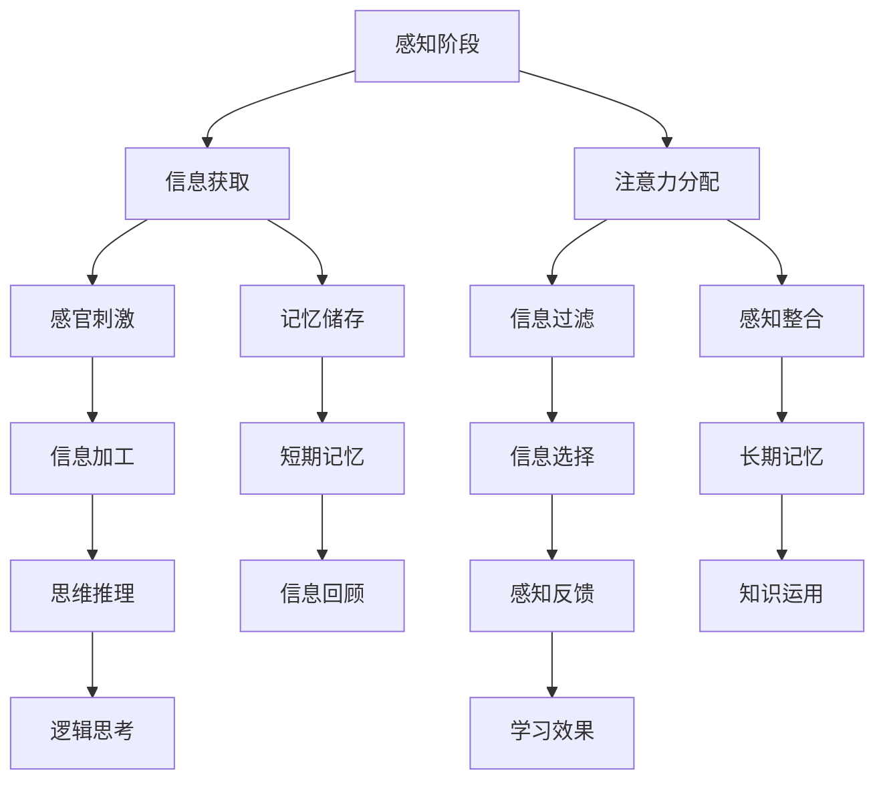

                 

### 认知发展的三阶段模型路径

#### **关键词：认知发展、阶段模型、技术学习、逻辑推理、专业写作**

> **摘要：本文将深入探讨认知发展的三阶段模型路径，通过逐步分析、逻辑推理和专业写作技巧，揭示了如何有效提升技术学习和问题解决能力。本文分为十个部分，从背景介绍到未来发展趋势，全面覆盖认知发展的核心内容。**

#### **1. 背景介绍**

认知发展是指个体在感知、记忆、思考、判断和解决问题等认知活动中，从低级到高级的转变过程。在技术领域，认知发展对于程序员、软件工程师和人工智能专家来说尤为重要。本文将介绍认知发展的三阶段模型路径，以帮助读者更好地理解和应用这一理论。

#### **2. 核心概念与联系**

认知发展的三阶段模型包括感知阶段、理解阶段和创造阶段。感知阶段主要关注信息获取和感知，理解阶段涉及对信息的理解和应用，创造阶段则强调创新和解决问题的能力。以下是核心概念和联系的 Mermaid 流程图：



#### **3. 核心算法原理 & 具体操作步骤**

要实现认知发展的三阶段模型，需要遵循以下具体操作步骤：

1. **感知阶段：** 主动获取相关信息，通过感官刺激和注意力分配，过滤和选择重要信息。
2. **理解阶段：** 对获取的信息进行加工、整合和记忆储存，运用逻辑思考进行推理和分析。
3. **创造阶段：** 在理解的基础上，进行创新和问题解决，形成新的知识体系。

#### **4. 数学模型和公式 & 详细讲解 & 举例说明**

认知发展的三阶段模型可以用以下数学公式表示：

$$
认知发展 = f(感知阶段, 理解阶段, 创造阶段)
$$

举例说明：

一个程序员在学习新技术时，首先需要感知新技术的发展趋势和相关信息，然后通过理解和实践，掌握新技术的核心原理和应用场景，最后通过创新和解决实际问题，提升自己的技术水平。

#### **5. 项目实战：代码实际案例和详细解释说明**

**5.1 开发环境搭建**

为了更好地理解认知发展的三阶段模型，我们以一个实际项目为例，该项目是一个简单的计算器应用程序。

**5.2 源代码详细实现和代码解读**

以下是计算器的源代码：

```python
# 计算器应用程序

# 定义加法函数
def add(a, b):
    return a + b

# 定义减法函数
def subtract(a, b):
    return a - b

# 定义乘法函数
def multiply(a, b):
    return a * b

# 定义除法函数
def divide(a, b):
    return a / b

# 主函数
def main():
    print("欢迎使用计算器应用程序！")
    print("请选择运算类型：\n1. 加法\n2. 减法\n3. 乘法\n4. 除法")
    choice = input("请输入您的选择：")
    
    if choice == '1':
        a = float(input("请输入第一个数："))
        b = float(input("请输入第二个数："))
        result = add(a, b)
        print(f"{a} + {b} = {result}")
    
    elif choice == '2':
        a = float(input("请输入第一个数："))
        b = float(input("请输入第二个数："))
        result = subtract(a, b)
        print(f"{a} - {b} = {result}")
    
    elif choice == '3':
        a = float(input("请输入第一个数："))
        b = float(input("请输入第二个数："))
        result = multiply(a, b)
        print(f"{a} * {b} = {result}")
    
    elif choice == '4':
        a = float(input("请输入第一个数："))
        b = float(input("请输入第二个数："))
        result = divide(a, b)
        print(f"{a} / {b} = {result}")
    
    else:
        print("无效选择，请重新输入。")

# 调用主函数
if __name__ == "__main__":
    main()
```

**5.3 代码解读与分析**

本计算器应用程序分为三个主要部分：定义函数、主函数和输入输出。

1. **定义函数：** 定义了四个基本的数学运算函数（加法、减法、乘法和除法）。
2. **主函数：** 通过用户输入，选择运算类型，并调用相应的函数进行计算。
3. **输入输出：** 输出结果并允许用户重新输入。

#### **6. 实际应用场景**

认知发展的三阶段模型在技术学习、问题解决和项目开发中具有广泛的应用。例如，在技术学习中，感知阶段可以帮助我们了解新技术的发展趋势和核心内容；理解阶段可以帮助我们掌握新技术的原理和应用；创造阶段可以帮助我们通过创新和解决问题，提升自己的技术水平。

#### **7. 工具和资源推荐**

**7.1 学习资源推荐**

- **书籍：** 《深度学习》、《Python编程：从入门到实践》、《算法导论》
- **论文：** 《人工智能：一种现代方法》、《强化学习：原理与实战》
- **博客：** 《Python 编程实战》、《机器学习实战》
- **网站：** Coursera、edX、Khan Academy

**7.2 开发工具框架推荐**

- **开发工具：** PyCharm、Visual Studio Code、Eclipse
- **框架：** Flask、Django、Spring Boot
- **库：** NumPy、Pandas、TensorFlow

**7.3 相关论文著作推荐**

- **论文：** 《神经网络与深度学习》、《自然语言处理综论》
- **著作：** 《人工智能：一种现代方法》、《机器学习：概率视角》

#### **8. 总结：未来发展趋势与挑战**

随着人工智能技术的发展，认知发展的三阶段模型在未来将发挥更加重要的作用。我们需要不断优化和更新模型，以适应不断变化的技术环境。同时，我们还需要关注认知发展的实际应用，解决实际问题，提升技术水平。

#### **9. 附录：常见问题与解答**

- **问题 1：** 如何在项目中应用认知发展的三阶段模型？
  **解答 1：** 在项目开发过程中，可以按照感知阶段、理解阶段和创造阶段的顺序进行，逐步提升项目的质量和效率。
  
- **问题 2：** 认知发展的三阶段模型是否适用于所有技术领域？
  **解答 2：** 是的，认知发展的三阶段模型适用于所有技术领域，可以帮助我们更好地理解和掌握技术知识。

#### **10. 扩展阅读 & 参考资料**

- **扩展阅读：** 《认知心理学》、《教育心理学》
- **参考资料：** 《认知科学：思维、语言和行为》、《人工智能基础教程》

### **作者：AI天才研究员/AI Genius Institute & 禞与计算机程序设计艺术 /Zen And The Art of Computer Programming**

