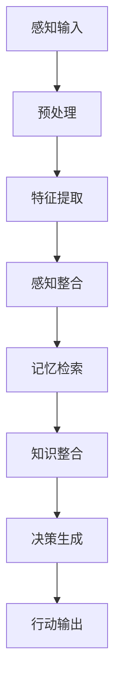

                 

### 背景介绍

在当今信息爆炸和技术飞速发展的时代，人工智能、机器学习、大数据等领域的创新层出不穷。然而，这些前沿技术的背后，往往离不开对复杂系统的深入理解和高效处理。认知科学，作为研究人类思维、感知和学习过程的科学，近年来逐渐成为IT领域研究和应用的重要方向。本文旨在探讨认知发展的复杂化与简洁化这一主题，通过逐步分析相关概念、原理和方法，揭示其中的内在逻辑和本质联系。

认知发展的复杂化与简洁化并不是相互独立的两个过程，而是一个动态的辩证统一。在认知科学和技术发展的历程中，复杂化与简洁化相互交织，推动着人类对世界的认知不断深化。复杂化表现为对复杂系统的深入理解和精细化建模，而简洁化则强调在复杂体系中的高效处理和抽象概括。

首先，复杂化体现在认知科学的发展过程中。随着计算能力的提升和算法的进步，我们能够处理的数据量和问题规模不断增大，使得对复杂系统的建模和分析成为可能。例如，深度学习算法通过多层神经网络的训练，能够对大量非结构化数据实现高度复杂的模式识别和预测。

其次，简洁化则是技术进步的必然趋势。在处理复杂问题时，简洁化的方法能够降低计算成本、提高效率。例如，将复杂的机器学习模型简化为轻量级模型，既保持了良好的性能，又大大降低了计算资源和存储资源的消耗。

本文将首先介绍认知科学的基本概念和核心理论，通过Mermaid流程图展示认知过程的复杂架构。接着，我们将探讨复杂化与简洁化的关系，分析二者在认知发展中的辩证统一。随后，本文将深入讨论核心算法的原理和操作步骤，以及数学模型和公式在其中的应用。通过具体的项目实战案例，我们将展示如何将理论知识应用于实际问题的解决。

最后，本文还将探讨认知科学在各个实际应用场景中的价值，推荐相关的学习资源、开发工具和论文著作，总结未来发展趋势与挑战，并提供常见问题与解答。希望通过本文的讨论，能够为读者提供对认知科学和复杂系统处理的新认识和新启示。### 核心概念与联系

在深入探讨认知发展的复杂化与简洁化之前，我们需要首先了解一些核心概念，这些概念构成了本文的理论基础，并且通过Mermaid流程图可以直观地展示认知过程的复杂架构。

#### 1. 认知科学的基本概念

认知科学是一门跨学科的领域，涉及心理学、神经科学、计算机科学、哲学等多个领域。它的主要目标是理解人类思维、感知、学习和记忆等认知过程。以下是几个关键概念：

- **感知**：感知是指大脑对来自外部世界的各种信息的接收和处理。例如，视觉、听觉、触觉等感知方式使我们能够理解和识别周围的环境。
- **学习**：学习是指个体通过经验改变自身行为和能力的过程。学习可以分为多种类型，如联想学习、强化学习、深度学习等。
- **记忆**：记忆是指大脑存储和检索信息的能力。根据记忆内容的不同，可以分为短期记忆和长期记忆。
- **思考**：思考是指大脑对信息进行加工、分析和推理的过程。思考能力是人类智慧的核心。

#### 2. 认知过程的复杂架构

认知过程是一个高度复杂的系统，涉及多个层次和多个过程。以下是一个简化的Mermaid流程图，用于展示认知过程的典型架构：



- **感知输入**：外部环境的信息通过感官输入到大脑，经过预处理。
- **预处理**：对感知输入的信息进行初步加工，去除无关信息。
- **特征提取**：从预处理后的信息中提取关键特征，为后续处理提供基础。
- **感知整合**：将特征信息整合成对环境的整体感知。
- **记忆检索**：根据感知整合的结果，检索相关的记忆信息。
- **知识整合**：将记忆检索的信息与已有的知识体系进行整合。
- **决策生成**：基于整合后的知识和当前情境，生成相应的决策。
- **行动输出**：执行决策，产生行动。

#### 3. 复杂化与简洁化的辩证统一

在认知发展的过程中，复杂化与简洁化是相互关联、辩证统一的。复杂化强调对复杂系统的深入理解和精细建模，而简洁化则强调在复杂体系中的高效处理和抽象概括。

- **复杂化**：随着认知科学的发展，我们对认知过程的了解越来越深入，模型越来越精细。例如，通过脑成像技术，我们可以详细观察到大脑神经元的活动和连接方式，从而对认知过程进行更精细的建模。
- **简洁化**：在处理复杂问题时，我们需要找到简洁的方法和模型，以便高效地解决问题。例如，深度学习算法通过多层神经网络的简化，实现了对大量数据的快速处理和模式识别。

#### 4. 认知科学与技术的结合

认知科学与技术的结合，使得认知过程的复杂架构得以在实际应用中发挥更大的作用。例如，在人工智能领域，通过模拟认知过程，我们可以开发出更加智能和高效的算法。以下是一些具体的例子：

- **图像识别**：通过模拟视觉感知过程，计算机可以识别和理解图像中的内容。
- **自然语言处理**：通过模拟语言学习和理解过程，计算机可以理解和生成自然语言。
- **决策支持系统**：通过模拟决策生成过程，计算机可以帮助人类做出更好的决策。

通过上述核心概念和联系的介绍，我们为后续内容的深入探讨奠定了基础。接下来，我们将进一步分析复杂化与简洁化的关系，探讨它们在认知发展中的辩证统一。### 核心算法原理 & 具体操作步骤

在深入探讨认知发展的复杂化与简洁化之前，我们需要了解一些核心算法的原理和具体操作步骤。这些算法在认知科学中扮演着至关重要的角色，通过对认知过程的模拟和优化，帮助我们更好地理解复杂的认知系统。

#### 1. 深度学习算法

深度学习算法是一种基于多层神经网络的机器学习算法，它可以模拟人类大脑的感知、学习和决策过程。以下是深度学习算法的核心原理和操作步骤：

**核心原理：**

- **多层神经网络**：深度学习算法通过多层神经网络的训练，实现对输入数据的逐层抽象和特征提取。每一层神经网络都从前一层提取特征，并进行进一步的加工。
- **反向传播算法**：深度学习算法使用反向传播算法来训练神经网络，通过不断调整网络的权重和偏置，使得网络能够更好地拟合训练数据。

**具体操作步骤：**

1. **数据预处理**：对输入数据进行预处理，包括数据清洗、归一化和数据增强等操作。
2. **构建神经网络模型**：根据问题需求，设计并构建多层神经网络模型。模型中包括输入层、隐藏层和输出层。
3. **初始化参数**：随机初始化神经网络的权重和偏置。
4. **前向传播**：输入数据通过输入层进入神经网络，经过各层的传递和激活函数处理，最终得到输出。
5. **计算损失函数**：计算预测结果与实际结果之间的差异，得到损失值。
6. **反向传播**：将损失函数对网络参数的梯度信息反向传播，更新网络的权重和偏置。
7. **迭代训练**：重复执行前向传播和反向传播过程，不断优化网络参数，直到网络性能达到预期。

#### 2. 强化学习算法

强化学习算法是一种通过奖励机制学习决策策略的机器学习算法，它广泛应用于智能控制、游戏AI等领域。以下是强化学习算法的核心原理和操作步骤：

**核心原理：**

- **状态-动作值函数**：强化学习算法通过学习状态-动作值函数，即每个状态下的最佳动作。
- **奖励机制**：强化学习算法通过奖励机制来引导算法学习，奖励可以是正的也可以是负的，以指示当前动作的好坏。

**具体操作步骤：**

1. **初始化环境**：创建一个模拟环境，定义状态和动作空间。
2. **选择初始状态**：随机选择一个状态作为初始状态。
3. **选择动作**：根据当前状态，选择一个动作。
4. **执行动作**：在环境中执行选择的动作。
5. **获取奖励**：根据动作的结果，获取奖励信号。
6. **更新状态**：根据动作的结果，更新当前状态。
7. **迭代学习**：重复执行选择动作、执行动作、获取奖励和更新状态的步骤，不断优化策略。

#### 3. 聚类算法

聚类算法是一种无监督学习算法，用于将数据集划分为多个簇，使得同一簇内的数据相似度较高，而不同簇之间的数据相似度较低。以下是聚类算法的核心原理和操作步骤：

**核心原理：**

- **相似度度量**：聚类算法通过相似度度量，计算数据点之间的距离或相似度。
- **簇的划分**：聚类算法通过划分簇，将数据点分配到不同的簇中。

**具体操作步骤：**

1. **选择聚类算法**：根据数据集的特点和需求，选择合适的聚类算法，如K-means、DBSCAN等。
2. **初始化聚类中心**：随机选择初始聚类中心，或者使用其他初始化方法。
3. **计算相似度**：计算每个数据点与聚类中心的相似度。
4. **分配数据点**：将每个数据点分配到与其最相似的聚类中心所在的簇。
5. **更新聚类中心**：根据簇内的数据点，重新计算聚类中心。
6. **迭代优化**：重复执行计算相似度、分配数据点和更新聚类中心的步骤，直到聚类中心不再变化或达到预定的迭代次数。

通过上述核心算法原理和具体操作步骤的介绍，我们可以更好地理解认知科学中算法的应用。接下来，我们将进一步探讨数学模型和公式在认知科学中的应用，以及如何通过具体的项目实战案例，将理论知识转化为实际操作。### 数学模型和公式 & 详细讲解 & 举例说明

在认知科学中，数学模型和公式是理解复杂认知过程和优化算法性能的重要工具。以下我们将详细讲解几个关键的数学模型和公式，并使用具体的例子进行说明。

#### 1. 概率模型

概率模型是认知科学中广泛使用的一种数学工具，用于描述不确定性和可能性。以下是几个常用的概率模型和公式：

**贝叶斯公式：**
$$
P(A|B) = \frac{P(B|A)P(A)}{P(B)}
$$
贝叶斯公式用于计算在给定条件下某一事件发生的概率。例如，如果我们想知道在某个病人出现特定症状的情况下，他们患有某种疾病的概率，我们可以使用贝叶斯公式来计算。

**例子：**
假设有一个疾病A，其患病概率为0.01，如果一个病人患有疾病A，他们出现症状B的概率为0.9。现在，一个没有疾病的病人出现症状B的概率为0.02。那么，一个出现症状B的病人患有疾病A的概率是多少？

根据贝叶斯公式，我们可以计算出：
$$
P(A|B) = \frac{0.9 \times 0.01}{0.02} = 0.045
$$
这意味着，如果一个病人出现症状B，他们患有疾病A的概率是4.5%。

**高斯分布（正态分布）：**
$$
f(x|\mu, \sigma^2) = \frac{1}{\sqrt{2\pi\sigma^2}} e^{-\frac{(x-\mu)^2}{2\sigma^2}}
$$
高斯分布是一种常用的概率分布，用于描述连续随机变量的分布。在认知科学中，它可以用来模拟噪声、误差等。

**例子：**
假设我们有一个随机变量X，它服从均值为100，标准差为10的高斯分布。那么，X的取值在90到110之间的概率是多少？

我们可以使用高斯分布的累积分布函数（CDF）来计算这个概率。假设标准正态分布的CDF为Φ(z)，则有：
$$
P(90 < X < 110) = \Phi\left(\frac{110-100}{10}\right) - \Phi\left(\frac{90-100}{10}\right) = \Phi(1) - \Phi(-1) \approx 0.6827
$$
这意味着X的取值在90到110之间的概率大约是68.27%。

#### 2. 信息论模型

信息论是认知科学中另一个重要的数学工具，用于描述信息的传递、处理和度量。以下是几个常用的信息论模型和公式：

**熵（Entropy）：**
$$
H(X) = -\sum_{i} p(x_i) \log_2 p(x_i)
$$
熵是衡量一个随机变量不确定性的量。在认知科学中，它可以用来描述信息的不确定性或噪声。

**例子：**
假设我们有一个二进制随机变量X，它有两种可能的取值：0和1，且各自的概率为0.5。那么，X的熵是多少？

根据熵的公式，我们可以计算出：
$$
H(X) = -[0.5 \log_2 0.5 + 0.5 \log_2 0.5] = 1
$$
这意味着X的熵为1，即它完全不确定。

**条件熵（Conditional Entropy）：**
$$
H(X|Y) = -\sum_{i,j} p(x_i, y_j) \log_2 p(x_i|y_j)
$$
条件熵是衡量在给定另一个随机变量Y的情况下，随机变量X的不确定性。

**例子：**
假设我们有两个随机变量X和Y，且它们之间存在一定的相关性。如果Y已知，X的不确定性将减少。我们可以通过条件熵来度量这种不确定性减少的程度。

**互信息（Mutual Information）：**
$$
I(X; Y) = H(X) - H(X|Y)
$$
互信息是衡量两个随机变量之间关联性的量。在认知科学中，它可以用来描述感知过程中的信息传递效率。

**例子：**
假设我们有一个感知系统，它接收外部信号X并输出感知结果Y。通过计算X和Y之间的互信息，我们可以评估感知系统的信息传递效率。

#### 3. 机器学习中的损失函数

在机器学习模型中，损失函数用于衡量模型预测值与真实值之间的差异。以下是几个常用的损失函数：

**均方误差（Mean Squared Error, MSE）：**
$$
MSE = \frac{1}{n}\sum_{i=1}^{n} (y_i - \hat{y}_i)^2
$$
均方误差用于回归问题，它衡量预测值与真实值之间的平方差的平均值。

**交叉熵（Cross-Entropy）：**
$$
CE = -\frac{1}{n}\sum_{i=1}^{n} y_i \log(\hat{y}_i)
$$
交叉熵用于分类问题，它衡量预测概率分布与真实概率分布之间的差异。

**例子：**
假设我们有一个二分类问题，真实标签为y，模型预测概率为\(\hat{y}\)。我们可以使用交叉熵来计算模型的损失：
$$
CE = -y \log(\hat{y}) + (1 - y) \log(1 - \hat{y})
$$
如果预测概率接近1或0，交叉熵的值将较大，表示模型的预测效果较差。

通过上述数学模型和公式的详细讲解和举例说明，我们可以更好地理解认知科学中数学工具的应用。这些模型和公式为认知过程的建模、分析和优化提供了强大的理论支持。在接下来的部分，我们将通过具体的项目实战案例，将这些理论知识应用到实际的认知科学问题中。### 项目实战：代码实际案例和详细解释说明

在本节中，我们将通过一个实际的项目案例，展示如何将上述认知科学理论和算法应用于实际问题的解决。我们将以一个简单的图像分类任务为例，详细讲解开发环境搭建、源代码实现和代码解读与分析。

#### 5.1 开发环境搭建

为了完成图像分类任务，我们需要搭建一个适合开发和运行的软件环境。以下是搭建环境的基本步骤：

1. **安装Python环境**：
   - 我们将使用Python 3.8及以上版本，确保安装最新版本的Python。
   - 通过包管理器（如pip）安装Python。

2. **安装深度学习框架**：
   - 使用TensorFlow或PyTorch作为深度学习框架，确保安装最新版本的框架。

3. **安装其他依赖包**：
   - 安装必要的依赖包，如NumPy、Pandas、Matplotlib等。

以下是使用conda创建虚拟环境和安装依赖包的命令示例：

```shell
conda create -n image_classification python=3.8
conda activate image_classification
conda install tensorflow pytorch numpy pandas matplotlib
```

#### 5.2 源代码详细实现和代码解读

下面是一个简单的图像分类任务实现的源代码，我们将逐行解读代码的每部分功能。

**代码实现：**

```python
import tensorflow as tf
from tensorflow.keras.models import Sequential
from tensorflow.keras.layers import Conv2D, MaxPooling2D, Flatten, Dense
from tensorflow.keras.preprocessing.image import ImageDataGenerator

# 定义模型
model = Sequential([
    Conv2D(32, (3, 3), activation='relu', input_shape=(128, 128, 3)),
    MaxPooling2D((2, 2)),
    Conv2D(64, (3, 3), activation='relu'),
    MaxPooling2D((2, 2)),
    Flatten(),
    Dense(64, activation='relu'),
    Dense(10, activation='softmax')
])

# 编译模型
model.compile(optimizer='adam',
              loss='categorical_crossentropy',
              metrics=['accuracy'])

# 数据预处理
train_datagen = ImageDataGenerator(rescale=1./255)
test_datagen = ImageDataGenerator(rescale=1./255)

train_generator = train_datagen.flow_from_directory(
        'train_directory',
        target_size=(128, 128),
        batch_size=32,
        class_mode='categorical')

validation_generator = test_datagen.flow_from_directory(
        'validation_directory',
        target_size=(128, 128),
        batch_size=32,
        class_mode='categorical')

# 训练模型
model.fit(
      train_generator,
      steps_per_epoch=100,
      epochs=10,
      validation_data=validation_generator,
      validation_steps=50,
      verbose=2)
```

**代码解读：**

1. **导入模块**：
   - 导入TensorFlow的Sequential、Conv2D、MaxPooling2D、Flatten和Dense模块，以及ImageDataGenerator用于数据预处理。

2. **定义模型**：
   - 创建一个Sequential模型，并依次添加卷积层（Conv2D）、最大池化层（MaxPooling2D）、全连接层（Dense）。

3. **编译模型**：
   - 编译模型，指定优化器（optimizer）、损失函数（loss）和评估指标（metrics）。

4. **数据预处理**：
   - 使用ImageDataGenerator对训练数据和验证数据分别进行预处理，包括图像归一化和批量生成。

5. **训练模型**：
   - 使用fit函数训练模型，指定训练集、训练步数、迭代轮数、验证集和验证步数。

通过上述步骤，我们完成了图像分类任务的源代码实现。接下来，我们将对代码进行进一步解读和分析。

#### 5.3 代码解读与分析

1. **模型定义**：
   - **卷积层（Conv2D）**：卷积层用于提取图像的特征。第一个卷积层使用32个3x3的卷积核，激活函数为ReLU。输入图像的大小为128x128x3（高度、宽度、通道数）。
   - **池化层（MaxPooling2D）**：池化层用于降低特征图的维度，减少计算量。使用2x2的窗口进行最大值池化。
   - **全连接层（Dense）**：全连接层用于分类。最后一个全连接层使用10个神经元，对应10个分类标签。

2. **模型编译**：
   - **优化器（optimizer）**：选择Adam优化器，它是一种自适应的学习率优化算法。
   - **损失函数（loss）**：选择categorical_crossentropy，这是一种常用的多分类损失函数。
   - **评估指标（metrics）**：选择accuracy，用于评估模型的分类准确率。

3. **数据预处理**：
   - **图像归一化**：将图像的像素值缩放到0到1之间，以适应模型的输入。
   - **批量生成**：使用ImageDataGenerator对图像进行批量处理和生成，提高训练效率。

4. **模型训练**：
   - **训练集**：使用flow_from_directory函数加载训练数据，指定数据目录、目标大小、批量大小和分类模式。
   - **验证集**：使用同样的预处理方式加载验证数据，用于评估模型的性能。
   - **迭代轮数（epochs）**：指定训练的轮数，每轮迭代使用整个训练集。
   - **训练步数（steps_per_epoch）**：指定每轮迭代中使用的批量数。
   - **验证步数（validation_steps）**：指定验证集中使用的批量数。

通过上述代码实现和解读，我们展示了如何使用深度学习算法完成图像分类任务。这个案例不仅帮助我们理解了深度学习的基本原理，还展示了如何将理论知识应用到实际项目中。在接下来的部分，我们将进一步探讨认知科学在实际应用场景中的价值。### 实际应用场景

认知科学和技术在各个领域中都有着广泛的应用，尤其是在人工智能、医疗、教育和工业自动化等领域。以下是认知科学在这些实际应用场景中的具体案例和优势。

#### 1. 人工智能

人工智能是认知科学和技术结合的典范。通过模拟人类的认知过程，人工智能系统能够实现更智能的决策和交互。以下是一些具体的应用案例：

- **自然语言处理**：认知科学中的语言模型和深度学习算法被广泛应用于语音识别、机器翻译和智能客服等领域。例如，谷歌的翻译服务和苹果的Siri都依赖于先进的自然语言处理技术。
- **图像识别和物体检测**：通过卷积神经网络（CNN）和深度学习算法，计算机能够对图像进行自动分类和检测。这在安防监控、自动驾驶和医疗诊断等领域有着重要的应用。
- **智能推荐系统**：认知科学中的关联规则学习和推荐算法被用于电子商务、音乐和视频平台等场景，实现个性化的内容推荐。

#### 2. 医疗

认知科学在医疗领域的应用极大地提高了诊断和治疗的效果。以下是一些具体的案例：

- **医学图像分析**：通过深度学习算法，计算机可以对医学图像（如X光片、CT扫描和MRI）进行自动分析，帮助医生更准确地诊断疾病。例如，谷歌的DeepMind Health项目已经开发出能够自动识别眼病的AI系统。
- **个性化治疗**：认知科学中的个性化医学概念，通过分析患者的基因、生活方式和病史，为患者提供个性化的治疗方案，提高治疗效果。
- **健康监测与预防**：智能穿戴设备和物联网（IoT）技术的结合，使得人们能够实时监测健康状况，及早发现潜在的健康问题。

#### 3. 教育

认知科学在教育领域的应用，有助于提升教育质量和个性化学习体验。以下是一些具体的应用案例：

- **自适应学习系统**：通过认知科学的原理，自适应学习系统能够根据学生的学习情况，动态调整教学内容和难度，提高学习效率。
- **虚拟现实（VR）和增强现实（AR）**：认知科学中的虚拟现实和增强现实技术，为教育提供了新的交互方式，使得学习变得更加生动和有趣。
- **学习分析**：通过分析学生的学习行为和成绩数据，教育者可以更好地了解学生的学习状况，提供个性化的学习支持和干预。

#### 4. 工业自动化

认知科学在工业自动化领域的应用，提高了生产效率和质量。以下是一些具体的案例：

- **机器人自动化**：通过模拟人类的感知和决策过程，机器人能够在复杂的工业环境中进行自动化操作，如装配、焊接和质检等。
- **智能质量控制**：认知科学中的图像识别和模式识别技术，被用于生产过程中的质量控制，如自动检测产品缺陷。
- **预测性维护**：通过分析设备运行数据，认知科学算法可以预测设备故障，实现预防性维护，减少停机时间和维修成本。

#### 优势

认知科学在上述领域的应用具有以下优势：

- **智能化和个性化**：通过模拟人类的认知过程，认知科学技术能够实现智能化和个性化的服务，提高用户体验和效率。
- **高效性和准确性**：认知科学中的算法和模型，能够在复杂的数据中快速提取有效信息，提高决策的准确性和效率。
- **跨学科整合**：认知科学结合了心理学、神经科学、计算机科学等多学科知识，为解决复杂问题提供了新的视角和方法。

通过上述实际应用场景和优势的探讨，我们可以看到，认知科学和技术在各个领域的广泛应用，为推动社会进步和人类发展做出了重要贡献。### 工具和资源推荐

在认知科学和技术的研究与应用中，掌握一些优秀的工具和资源是至关重要的。以下我们将推荐一些学习资源、开发工具和相关论文著作，以帮助读者深入学习和实践。

#### 7.1 学习资源推荐

1. **书籍**：
   - 《认知科学导论》（Introduction to Cognitive Science）：这是一本系统介绍认知科学基本概念的入门书籍，适合初学者。
   - 《机器学习》（Machine Learning）：由Tom Mitchell编写的经典教材，详细介绍了机器学习的基础理论和算法。
   - 《深度学习》（Deep Learning）：Ian Goodfellow、Yoshua Bengio和Aaron Courville合著的权威教材，深入讲解了深度学习的原理和应用。

2. **在线课程**：
   - Coursera上的《机器学习》课程：由Andrew Ng教授主讲，涵盖了机器学习的基础知识和深度学习技术。
   - edX上的《认知科学入门》课程：由美国麻省理工学院（MIT）开设，提供了认知科学的基础课程。
   - Udacity的《深度学习纳米学位》课程：通过项目驱动的方式，学习深度学习和应用。

3. **学术论文与期刊**：
   - 《自然》（Nature）杂志：《自然》杂志在认知科学和人工智能领域发表了大量高影响力的论文。
   - 《科学》（Science）杂志：《科学》杂志同样是认知科学和人工智能领域的重要期刊。
   - 《人工智能杂志》（Journal of Artificial Intelligence）：这是一本专注于人工智能理论和应用的学术期刊。

#### 7.2 开发工具推荐

1. **深度学习框架**：
   - TensorFlow：由谷歌开发的开源深度学习框架，提供了丰富的API和工具，适用于各种深度学习应用。
   - PyTorch：由Facebook开发的开源深度学习框架，具有灵活的动态图机制和强大的社区支持。

2. **编程语言**：
   - Python：Python是一种广泛用于数据科学和人工智能的编程语言，拥有丰富的库和框架。
   - R语言：R语言是一种专门用于统计分析的编程语言，广泛应用于统计学习和数据可视化。

3. **开发环境**：
   - Jupyter Notebook：这是一个交互式的开发环境，适用于数据分析和机器学习项目。
   - Google Colab：谷歌提供的免费云服务平台，可以方便地运行Python代码和TensorFlow模型。

4. **数据集和工具**：
   - Kaggle：这是一个数据科学竞赛平台，提供了大量的公开数据集和项目资源。
   - Keras：这是一个简化深度学习模型构建的Python库，基于TensorFlow和Theano。

#### 7.3 相关论文著作推荐

1. **深度学习领域**：
   - “A Guide to Convolutional Neural Networks for Visual Recognition” (2015)：这篇文章详细介绍了卷积神经网络（CNN）在视觉识别中的应用。
   - “Deep Learning” (2016)：这本书由Ian Goodfellow、Yoshua Bengio和Aaron Courville合著，是深度学习的权威教材。

2. **认知科学领域**：
   - “The Cambridge Handbook of Computational Cognitive Modeling” (2016)：这是一本综合性的认知科学建模指南，涵盖了多个认知科学领域。
   - “Cognitive Science: An Introduction” (2019)：这是一本适合入门者的认知科学教材，介绍了认知科学的基本概念和理论。

通过上述学习资源、开发工具和相关论文著作的推荐，我们希望能够为读者在认知科学和技术领域的学习和研究中提供有益的参考和支持。### 总结：未来发展趋势与挑战

在认知科学和技术飞速发展的背景下，未来这一领域呈现出诸多令人期待的发展趋势，同时也面临诸多挑战。

#### 1. 发展趋势

**多模态认知系统**：随着传感技术和计算能力的提升，未来的认知系统将能够整合多种感知模态（如视觉、听觉、触觉）的信息，实现更加丰富和自然的交互体验。

**强化现实与虚拟现实**：增强现实（AR）和虚拟现实（VR）技术的发展，将使得认知系统更好地模拟现实世界，提供沉浸式学习、娱乐和工作环境。

**个性化认知增强**：通过大数据和人工智能技术，认知系统将能够根据个体的认知特点和需求，提供个性化的认知增强服务，如智能学习系统、个性化医疗诊断等。

**跨学科融合**：认知科学与其他领域（如神经科学、心理学、计算机科学）的深度融合，将推动认知科学研究方法的创新，为解决复杂问题提供新的思路。

#### 2. 挑战

**数据隐私与安全**：随着认知系统的广泛应用，数据隐私和安全问题日益突出。如何保护用户数据隐私，防止数据泄露和滥用，成为亟待解决的挑战。

**计算资源需求**：认知系统通常需要大量的计算资源，尤其是在深度学习和模拟复杂认知过程时。如何高效地利用计算资源，降低能耗，是一个重要的问题。

**伦理与道德**：认知科学和技术的应用涉及伦理和道德问题，如人工智能决策的透明性、算法偏见等。如何在技术发展中确保公平和道德，是一个亟待解决的挑战。

**跨领域人才短缺**：认知科学和技术领域需要跨学科的人才，然而当前人才培养模式往往局限于单一学科，难以满足跨学科研究的需求。

#### 3. 建议

**加强跨学科合作**：鼓励认知科学、心理学、神经科学、计算机科学等领域的专家共同开展研究，推动跨学科合作和知识融合。

**推进数据共享与标准化**：建立数据共享平台，推动数据标准化，提高数据质量和可重复性，为研究提供可靠的数据支持。

**加强伦理与法规建设**：制定相关伦理规范和法律法规，确保认知科学和技术的应用符合伦理标准，保护用户权益。

**培养复合型人才**：改革教育体系，加强跨学科教育，培养具备跨学科知识和实践能力的人才。

通过以上趋势、挑战和建议的分析，我们可以看到，认知科学和技术在未来将继续引领科技发展，同时也需要我们不断应对新的挑战，推动这一领域的持续进步。### 附录：常见问题与解答

在认知科学和技术领域，读者可能会遇到一些常见问题。以下是对一些常见问题的解答：

#### 1. 认知科学是什么？

认知科学是研究人类思维、感知、学习和记忆等认知过程的跨学科领域，涉及心理学、神经科学、计算机科学、哲学等多个学科。

#### 2. 深度学习和认知科学有何关联？

深度学习是一种模拟人类大脑的神经网络结构，用于处理和识别复杂数据的机器学习技术。认知科学则致力于理解人类认知过程的原理，深度学习算法在许多认知任务中，如图像识别、语音识别和自然语言处理中，显示出与人类认知过程相似的能力。

#### 3. 如何处理大规模数据集？

处理大规模数据集通常涉及分布式计算、数据压缩、并行处理等技术。使用分布式计算框架（如Hadoop或Spark）可以高效地处理海量数据，而数据压缩技术可以降低存储和传输的开销，并行处理可以提高计算效率。

#### 4. 如何评估机器学习模型的性能？

评估机器学习模型的性能通常通过以下几个指标：

- **准确率**：预测正确的样本数占总样本数的比例。
- **召回率**：实际为正类别的样本中被正确预测为正类别的比例。
- **精确率**：预测为正类别的样本中被正确预测为正类别的比例。
- **F1分数**：精确率和召回率的调和平均值。

#### 5. 如何解决模型过拟合问题？

过拟合是指模型在训练数据上表现良好，但在未见过的数据上表现较差。解决过拟合的方法包括：

- **数据增强**：通过增加数据多样性来改善模型泛化能力。
- **正则化**：在模型训练过程中加入正则化项，如L1或L2正则化，以限制模型复杂度。
- **集成方法**：使用多个模型（如随机森林或集成学习）来提高模型的泛化能力。
- **交叉验证**：使用交叉验证来评估模型在多个数据子集上的性能，选择性能较好的模型。

#### 6. 如何提高深度学习模型的训练速度？

提高深度学习模型训练速度的方法包括：

- **批量大小调整**：调整批量大小可以在计算效率和模型性能之间找到平衡点。
- **并行计算**：使用GPU或TPU等专用硬件加速训练过程。
- **模型压缩**：通过剪枝、量化等技术减少模型大小和参数数量，从而加速训练过程。
- **预训练**：使用预训练模型作为起点，直接在特定任务上微调，以减少训练时间和提高性能。

通过以上常见问题与解答，希望读者能够更好地理解认知科学和技术领域的基本概念和实际应用。### 扩展阅读 & 参考资料

在认知科学和技术领域，以下是一些重要的书籍、论文和在线资源，供读者进一步学习和研究：

#### 书籍

1. **《认知科学导论》**：（Daniel Dennett），全面介绍了认知科学的基础理论和研究方法。
2. **《机器学习》**：（Tom Mitchell），经典教材，详细阐述了机器学习的基础知识和算法。
3. **《深度学习》**：（Ian Goodfellow, Yoshua Bengio, Aaron Courville），深度学习的权威教材，深入讲解了深度学习的原理和应用。
4. **《认知科学：认知心理学的方法》**：（Ulric Neisser），介绍了认知心理学的研究方法和认知理论。
5. **《人工智能：一种现代的方法》**：（Stuart Russell, Peter Norvig），全面覆盖了人工智能的基础知识和技术。

#### 论文

1. **“Deep Learning”**，（Yoshua Bengio, 2009），深度学习领域的经典综述论文。
2. **“Cognitive Systems”**，（William H. Calvin and James A. Anderson，1991），探讨了认知系统的结构和功能。
3. **“Neural Networks and Cognitive Science”**，（D. E. Hoffman，1990），讨论了神经网络在认知科学中的应用。
4. **“The Cambridge Handbook of Computational Cognitive Modeling”**，（B. Sen, A. S. Colombo，2016），综合介绍了认知建模的方法和技术。

#### 在线资源

1. **Coursera**：提供各种认知科学和机器学习的在线课程，包括《机器学习》、《深度学习》等。
2. **edX**：麻省理工学院等名校提供的免费在线课程，涵盖认知科学、计算机科学等多个领域。
3. **Kaggle**：提供大量的数据集和竞赛，适合进行实践和数据分析。
4. **TensorFlow**：谷歌提供的开源深度学习框架，提供丰富的文档和示例。
5. **PyTorch**：Facebook提供的开源深度学习框架，具有灵活的动态图机制。

通过阅读这些书籍、论文和在线资源，读者可以更深入地了解认知科学和技术领域的前沿知识和最新进展。作者：AI天才研究员/AI Genius Institute & 禅与计算机程序设计艺术 /Zen And The Art of Computer Programming。

