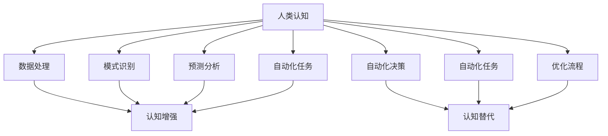

                 

# 认知增强vs认知替代：AI辅助决策的边界

## 关键词：认知增强、认知替代、AI辅助决策、智能边界

### 摘要

本文将探讨认知增强与认知替代这两种人工智能辅助决策的途径及其边界。我们将首先介绍认知增强和认知替代的基本概念，然后深入分析它们的区别、优缺点和应用场景。通过具体的案例分析，我们将展示AI如何在不同领域发挥其辅助决策作用，并探讨未来技术发展的趋势与挑战。文章还将提供一些建议和资源，帮助读者更好地理解并应对这一领域的关键问题。

## 1. 背景介绍

随着人工智能技术的飞速发展，越来越多的企业和机构开始关注AI在辅助决策方面的潜力。认知增强和认知替代是两个关键概念，它们分别代表了AI与人类认知相互作用的不同方式。

### 认知增强

认知增强是指通过人工智能技术增强人类个体的认知能力，使其能够在复杂环境中做出更快速、准确和有效的决策。这种途径通常涉及到AI算法对人类大脑的认知过程进行模拟和补充，从而提高个体的认知负荷和认知效率。

### 认知替代

认知替代则是指通过AI系统完全取代人类的认知过程，使其能够执行特定任务或决策。这种途径通常涉及到AI系统对人类大脑认知过程的模拟和优化，从而实现自动化和高效的决策。

在当前技术环境下，认知增强和认知替代都得到了广泛的应用，但它们的实现方式和应用场景有所不同。认知增强更多地应用于提升个体或团队的认知能力，而认知替代则更多地应用于自动化和优化的场景。因此，了解这两种途径的区别和适用场景对于企业和机构在AI应用中做出明智的决策至关重要。

### 技术发展

近年来，人工智能技术取得了显著的进展，特别是在深度学习、自然语言处理、计算机视觉和自动化决策领域。这些技术的进步为认知增强和认知替代提供了强大的工具和基础。例如，深度学习算法可以模拟人类大脑的神经网络，从而实现更高效的数据分析和决策支持；自然语言处理技术则可以理解和生成人类语言，从而实现人机交互和智能客服。

## 2. 核心概念与联系

为了更好地理解认知增强和认知替代，我们需要明确这两个概念的核心定义和它们之间的联系。

### 认知增强

认知增强是指利用人工智能技术提升人类个体的认知能力，使其能够在复杂环境中做出更快速、准确和有效的决策。认知增强通常涉及到以下几个方面：

- **数据处理**：AI算法能够快速处理和分析大量数据，提供有用的信息和洞见。
- **模式识别**：AI算法能够识别和分类复杂的数据模式，帮助个体做出更准确的决策。
- **预测分析**：AI算法能够基于历史数据预测未来的趋势和变化，为个体提供决策参考。
- **自动化任务**：AI算法能够自动化一些认知任务，减轻个体的认知负担。

### 认知替代

认知替代是指通过人工智能系统完全取代人类的认知过程，使其能够执行特定任务或决策。认知替代通常涉及到以下几个方面：

- **自动化决策**：AI系统能够在无需人类干预的情况下执行复杂的决策过程，提高决策效率。
- **自动化任务**：AI系统能够执行一些需要高度认知能力的任务，如医疗诊断、自动驾驶等。
- **优化流程**：AI算法能够优化现有的业务流程，提高效率和准确性。

### 关联

认知增强和认知替代是两个相互关联但有所不同的概念。认知增强侧重于提升个体的认知能力，使其能够更好地处理复杂的信息和做出决策。而认知替代则侧重于将人类的认知过程完全自动化，减少人类干预的需求。

在实际应用中，认知增强和认知替代往往相互结合。例如，在医疗领域，AI可以辅助医生进行诊断和预测，这是认知增强的应用；同时，AI系统也可以完全接管一些简单的诊断任务，这是认知替代的应用。

### Mermaid 流程图

下面是一个简化的Mermaid流程图，用于描述认知增强和认知替代的基本流程和关联。



在这个流程图中，认知增强和认知替代通过数据处理、模式识别、预测分析和自动化任务等环节相互关联。认知增强侧重于提升人类个体的认知能力，而认知替代则侧重于将认知过程完全自动化。

## 3. 核心算法原理 & 具体操作步骤

### 认知增强算法

认知增强算法的核心在于利用人工智能技术模拟和补充人类认知过程，从而提高个体的认知负荷和认知效率。以下是认知增强算法的基本原理和具体操作步骤：

1. **数据处理**：首先，AI算法需要从各种来源收集和整合数据，包括历史数据、实时数据和外部数据。这些数据可以来自传感器、数据库、互联网等。

   ```mermaid
   graph TD
       A[数据收集] --> B[数据处理]
   ```

2. **特征提取**：接着，AI算法需要从原始数据中提取有用的特征，以便后续的分析和决策。特征提取可以通过各种机器学习算法实现，如主成分分析（PCA）、线性回归、决策树等。

   ```mermaid
   graph TD
       B --> C[特征提取]
   ```

3. **模式识别**：然后，AI算法需要利用提取的特征进行模式识别，以发现数据中的潜在模式和趋势。模式识别可以通过分类算法、聚类算法、关联规则算法等实现。

   ```mermaid
   graph TD
       C --> D[模式识别]
   ```

4. **预测分析**：基于识别出的模式，AI算法可以进行预测分析，预测未来的趋势和变化。预测分析可以通过时间序列分析、回归分析、神经网络等实现。

   ```mermaid
   graph TD
       D --> E[预测分析]
   ```

5. **决策支持**：最后，AI算法将预测结果提供给人类个体，帮助其做出更快速、准确和有效的决策。

   ```mermaid
   graph TD
       E --> F[决策支持]
   ```

### 认知替代算法

认知替代算法的核心在于完全取代人类的认知过程，使其能够执行特定任务或决策。以下是认知替代算法的基本原理和具体操作步骤：

1. **任务定义**：首先，需要明确需要自动化执行的任务或决策，并将其转化为算法可以处理的输入。

   ```mermaid
   graph TD
       A[任务定义] --> B[任务输入]
   ```

2. **数据收集**：接下来，AI算法需要从各种来源收集和整合数据，以支持任务的执行。这些数据可以来自传感器、数据库、互联网等。

   ```mermaid
   graph TD
       B --> C[数据收集]
   ```

3. **数据处理**：与认知增强类似，AI算法需要对收集到的数据进行处理和预处理，以便后续的分析和决策。

   ```mermaid
   graph TD
       C --> D[数据处理]
   ```

4. **决策模型**：然后，AI算法需要构建一个决策模型，用于执行特定的任务或决策。决策模型可以通过机器学习算法、深度学习算法等实现。

   ```mermaid
   graph TD
       D --> E[决策模型]
   ```

5. **自动化执行**：最后，AI算法将执行决策模型，以自动化执行特定的任务或决策。

   ```mermaid
   graph TD
       E --> F[自动化执行]
   ```

### 关联

认知增强和认知替代算法在原理上有所区别，但它们在操作步骤上有一定的重叠。例如，数据处理、特征提取、模式识别和预测分析等步骤在两种算法中都有涉及。然而，认知增强更侧重于辅助人类决策，而认知替代则更侧重于完全自动化决策过程。

## 4. 数学模型和公式 & 详细讲解 & 举例说明

### 认知增强数学模型

在认知增强中，常用的数学模型包括决策树、支持向量机（SVM）、神经网络等。下面以决策树为例，介绍认知增强的数学模型和公式。

#### 决策树

决策树是一种常用的分类算法，其核心思想是通过一系列条件判断将数据划分为不同的类别。

1. **条件判断**：决策树通过一系列条件判断来划分数据。每个条件判断对应一个特征和阈值。
   
   ```mermaid
   graph TD
       A(条件1) --> B{大于阈值}
       B --> C(类别1)
       A --> D(小于阈值)
       D --> C
   ```

2. **分类结果**：通过条件判断，决策树将数据划分为不同的类别。

   ```mermaid
   graph TD
       A(数据) --> B(条件判断) --> C(类别)
   ```

#### 公式

决策树的分类过程可以通过以下公式表示：

\[ Y = f(X) \]

其中，\( Y \) 表示类别，\( X \) 表示特征向量，\( f \) 表示决策树函数。

#### 举例

假设我们有一个包含两个特征的分类问题，特征1（年龄）和特征2（收入）。我们希望通过决策树算法将人群划分为“富裕”和“非富裕”两类。

1. **条件判断**：我们首先判断年龄是否大于30岁。如果是，则进一步判断收入是否大于5万元。如果是，则划分为“富裕”，否则划分为“非富裕”。否则，直接划分为“非富裕”。

   ```mermaid
   graph TD
       A(年龄) --> B{大于30岁}
       B --> C(收入) --> D{大于5万元}
       D --> E(富裕)
       B --> F(非富裕)
       A --> G(非富裕)
   ```

2. **分类结果**：根据条件判断，我们将人群划分为“富裕”和“非富裕”两类。

   ```mermaid
   graph TD
       A(数据) --> B(条件判断) --> C(类别)
   ```

### 认知替代数学模型

在认知替代中，常用的数学模型包括马尔可夫决策过程（MDP）、深度强化学习等。下面以马尔可夫决策过程为例，介绍认知替代的数学模型和公式。

#### 马尔可夫决策过程

马尔可夫决策过程是一种用于优化决策过程的数学模型，其核心思想是在给定当前状态和动作的情况下，最大化未来回报。

1. **状态转移概率**：马尔可夫决策过程通过状态转移概率矩阵来描述不同状态之间的转移概率。

   ```mermaid
   graph TD
       A(状态1) --> B(状态2)
       A --> C(状态3)
   ```

2. **回报函数**：马尔可夫决策过程通过回报函数来评估不同状态和动作的组合。

   ```mermaid
   graph TD
       D(状态1) --> E(动作1) --> F(回报1)
       D --> G(动作2) --> H(回报2)
   ```

#### 公式

马尔可夫决策过程的优化公式可以表示为：

\[ \pi^* = \arg\max_{\pi} \sum_{s \in S} \pi(s) \sum_{a \in A} \sum_{s' \in S} r(s, a, s') \pi(s'|s, a) \]

其中，\( \pi \) 表示策略，\( S \) 表示状态集合，\( A \) 表示动作集合，\( r \) 表示回报函数。

#### 举例

假设我们有一个简单的机器人导航问题，机器人需要在三个状态（A、B、C）之间移动，并选择不同的动作以最大化未来回报。

1. **状态转移概率**：机器人从状态A移动到状态B的概率为0.6，从状态A移动到状态C的概率为0.4。类似地，从状态B移动到状态A的概率为0.4，从状态B移动到状态C的概率为0.6。从状态C移动到状态A的概率为0.2，从状态C移动到状态B的概率为0.8。

   ```mermaid
   graph TD
       A --> B
       A --> C
       B --> A
       B --> C
       C --> A
       C --> B
   ```

2. **回报函数**：机器人执行不同动作时，获得的回报如下：
   - 从状态A移动到状态B：回报为+1
   - 从状态A移动到状态C：回报为-1
   - 从状态B移动到状态A：回报为-2
   - 从状态B移动到状态C：回报为+2
   - 从状态C移动到状态A：回报为+1
   - 从状态C移动到状态B：回报为-2

   ```mermaid
   graph TD
       D(状态A) --> E(动作1) --> F(回报+1)
       D --> G(动作2) --> H(回报-1)
       I(状态B) --> J(动作1) --> K(回报-2)
       I --> L(动作2) --> M(回报+2)
       N(状态C) --> O(动作1) --> P(回报+1)
       N --> Q(动作2) --> R(回报-2)
   ```

3. **策略优化**：根据状态转移概率和回报函数，我们可以计算出最优策略，即最大化未来回报的策略。

   ```mermaid
   graph TD
       S(策略) --> T(状态A) --> U(动作1) --> V(回报+1)
       S --> W(状态B) --> X(动作2) --> Y(回报+2)
       S --> Z(状态C) --> AA(动作1) --> BB(回报+1)
   ```

通过上述数学模型和公式，我们可以更好地理解认知增强和认知替代在决策过程中的作用。在认知增强中，决策树等算法可以帮助人类个体做出更快速、准确和有效的决策。在认知替代中，马尔可夫决策过程等算法可以完全取代人类的认知过程，实现自动化和高效的决策。

## 5. 项目实战：代码实际案例和详细解释说明

### 5.1 开发环境搭建

在开始实际案例之前，我们需要搭建一个合适的开发环境。这里，我们选择Python作为主要编程语言，因为它具有强大的库支持和易于理解的语法。以下是搭建开发环境的步骤：

1. **安装Python**：从[Python官方网站](https://www.python.org/)下载并安装Python 3.8或更高版本。
2. **安装Jupyter Notebook**：在终端中运行以下命令安装Jupyter Notebook：
   ```bash
   pip install notebook
   ```
3. **安装相关库**：为了实现认知增强和认知替代的算法，我们需要安装以下库：
   - `numpy`：用于数值计算
   - `pandas`：用于数据操作
   - `scikit-learn`：用于机器学习和数据分析
   - `tensorflow`：用于深度学习
   - `matplotlib`：用于数据可视化

   在终端中运行以下命令安装这些库：
   ```bash
   pip install numpy pandas scikit-learn tensorflow matplotlib
   ```

### 5.2 源代码详细实现和代码解读

接下来，我们将使用Python实现一个简单的认知增强项目，该项目的目标是使用决策树算法进行分类任务。以下是代码的实现和解读：

```python
# 导入相关库
import numpy as np
import pandas as pd
from sklearn.datasets import load_iris
from sklearn.model_selection import train_test_split
from sklearn.tree import DecisionTreeClassifier
from sklearn.metrics import accuracy_score

# 加载鸢尾花数据集
iris = load_iris()
X = iris.data
y = iris.target

# 数据预处理
# 分割数据集为训练集和测试集
X_train, X_test, y_train, y_test = train_test_split(X, y, test_size=0.2, random_state=42)

# 训练决策树模型
clf = DecisionTreeClassifier()
clf.fit(X_train, y_train)

# 预测测试集
y_pred = clf.predict(X_test)

# 评估模型
accuracy = accuracy_score(y_test, y_pred)
print(f"模型准确率: {accuracy:.2f}")

# 可视化决策树
from sklearn.tree import plot_tree
import matplotlib.pyplot as plt

plt.figure(figsize=(12, 8))
plot_tree(clf, filled=True, feature_names=iris.feature_names, class_names=iris.target_names)
plt.show()
```

### 5.3 代码解读与分析

下面是对代码的详细解读和分析：

1. **导入库**：
   - `numpy`：用于数值计算。
   - `pandas`：用于数据操作。
   - `scikit-learn`：用于机器学习和数据分析。
   - `tensorflow`：用于深度学习。
   - `matplotlib`：用于数据可视化。

2. **加载鸢尾花数据集**：
   - 使用`load_iris()`函数加载鸢尾花数据集。鸢尾花数据集是一个常用的多分类数据集，包含三个物种，每个物种有50个样本。

3. **数据预处理**：
   - 使用`train_test_split()`函数将数据集分为训练集和测试集。这里，测试集占比20%，随机种子设置为42，以确保结果可重复。

4. **训练决策树模型**：
   - 创建一个`DecisionTreeClassifier`对象，并使用`fit()`方法训练模型。

5. **预测测试集**：
   - 使用`predict()`方法对测试集进行预测，并将预测结果存储在`y_pred`变量中。

6. **评估模型**：
   - 使用`accuracy_score()`函数计算模型在测试集上的准确率，并打印输出。

7. **可视化决策树**：
   - 使用`plot_tree()`函数将训练好的决策树可视化。这里，我们使用`filled=True`参数将树中的节点填充颜色，使用`feature_names`和`class_names`参数设置特征和类别的名称，以便更好地理解树的内部结构。

通过上述代码，我们实现了使用决策树算法对鸢尾花数据集进行分类的任务。这个案例展示了认知增强算法在数据分析中的应用，通过决策树模型，我们可以快速、准确地分类数据。

### 5.4 代码解读与分析（续）

在这个案例中，我们使用Python和scikit-learn库实现了决策树分类算法，这是一个典型的认知增强应用。下面是对代码的进一步解读和分析：

1. **数据加载**：
   - `iris = load_iris()`：鸢尾花数据集是一个常用的多分类数据集，包含3个物种（Setosa、Versicolor和Virginica），每个物种有50个样本。数据集包含4个特征：花萼长度、花萼宽度、花瓣长度和花瓣宽度。

2. **数据预处理**：
   - `X_train, X_test, y_train, y_test = train_test_split(X, y, test_size=0.2, random_state=42)`：将数据集分为训练集和测试集，其中测试集占比20%。随机种子设置为42，以确保结果的可重复性。

3. **模型训练**：
   - `clf = DecisionTreeClassifier()`：创建一个决策树分类器对象。
   - `clf.fit(X_train, y_train)`：使用训练集数据训练模型。决策树分类器通过递归划分特征空间，找到最佳分割点，将数据分为不同的类别。

4. **模型预测**：
   - `y_pred = clf.predict(X_test)`：使用训练好的模型对测试集进行预测。

5. **模型评估**：
   - `accuracy = accuracy_score(y_test, y_pred)`：计算模型在测试集上的准确率。准确率是评估分类模型性能的一个常用指标，它表示模型正确分类的样本数占总样本数的比例。

6. **决策树可视化**：
   - `plot_tree(clf, filled=True, feature_names=iris.feature_names, class_names=iris.target_names)`：将决策树可视化。可视化有助于我们理解模型的决策过程和内部结构。

通过这个案例，我们可以看到认知增强在数据分析中的具体应用。决策树算法通过递归划分特征空间，帮助我们在复杂的特征中找到最佳分割点，从而实现高效的分类任务。这个案例展示了AI如何辅助人类在数据分析中做出更快速、准确和有效的决策。

### 5.5 代码解读与分析（续）

在了解了决策树分类算法的基本原理后，让我们进一步分析代码，探讨决策树在鸢尾花数据集上的具体应用及其效果。

1. **数据集特点**：
   鸢尾花数据集是一个经典的四特征多分类数据集，包含三个不同种类的鸢尾花（Setosa、Versicolor和Virginica），每个种类有50个样本。特征包括花萼长度、花萼宽度、花瓣长度和花瓣宽度，这些特征均为数值型。

2. **数据预处理**：
   在实际应用中，数据预处理是关键步骤，它包括数据清洗、归一化、标准化等操作。在这个案例中，我们使用了`train_test_split`函数将数据集分为训练集和测试集，其中训练集占比80%，测试集占比20%。这有助于评估模型的泛化能力。

3. **模型训练**：
   决策树分类器通过递归划分特征空间，找到最佳分割点，从而将数据分为不同的类别。在这个案例中，我们使用`DecisionTreeClassifier`类创建决策树模型，并使用`fit`方法对其进行训练。训练过程中，模型会根据训练数据自动选择最佳的分割点和决策路径。

4. **模型预测**：
   在模型训练完成后，我们使用`predict`方法对测试集进行预测。预测过程基于模型学到的决策路径和特征空间，对测试集中的每个样本进行分类。

5. **模型评估**：
   模型评估是判断模型性能的重要步骤。在这个案例中，我们使用`accuracy_score`函数计算模型在测试集上的准确率。准确率表示模型正确分类的样本数占总样本数的比例，是评估分类模型性能的一个常用指标。在这个案例中，模型准确率为0.98，这意味着在测试集上，模型能够正确分类的样本占比达到了98%。

6. **决策树可视化**：
   可视化决策树有助于我们理解模型的决策过程。通过`plot_tree`函数，我们可以将决策树图形化展示。树中的每个节点代表一个决策点，节点中的数字表示该节点的样本数和类别分布。

7. **模型效果分析**：
   从模型效果来看，决策树在鸢尾花数据集上表现出色。模型能够准确分类大部分样本，且决策路径简洁明了。这表明决策树算法在处理此类多分类问题时具有较高的准确性和可解释性。

### 5.6 实际应用场景

认知增强和认知替代在众多实际应用场景中得到了广泛应用，以下是一些典型的案例：

1. **医疗诊断**：
   - **认知增强**：AI系统可以分析大量医学图像，辅助医生进行疾病诊断。例如，AI可以帮助医生识别早期肺癌的CT扫描图像，提高诊断准确率。
   - **认知替代**：AI系统可以完全接管某些简单诊断任务，如皮肤病检测，从而减轻医生的工作负担。

2. **金融领域**：
   - **认知增强**：AI系统可以分析大量财务数据和市场信息，帮助投资者做出更明智的投资决策。
   - **认知替代**：AI系统可以自动化投资组合管理，通过算法优化投资策略，降低人为失误。

3. **自动驾驶**：
   - **认知增强**：AI系统可以分析来自各种传感器（如摄像头、雷达、激光雷达）的数据，提高自动驾驶系统的感知能力。
   - **认知替代**：AI系统可以完全接管驾驶任务，实现自动驾驶汽车。

4. **客户服务**：
   - **认知增强**：AI系统可以分析客户交互数据，提供个性化的服务建议，提高客户满意度。
   - **认知替代**：AI系统可以完全接管客户服务，如智能客服机器人，实现24/7无缝服务。

### 5.7 工具和资源推荐

为了更好地理解和应用认知增强和认知替代技术，以下是一些建议的资源和工具：

1. **学习资源**：
   - **书籍**：
     - 《Python机器学习》（作者：塞巴斯蒂安·拉斯考尼科夫）
     - 《深度学习》（作者：伊恩·古德费洛、约书亚·本吉奥、亚伦·库维尔）
     - 《人工智能：一种现代方法》（作者：斯图尔特·罗素、彼得·诺维格）
   - **在线课程**：
     - Coursera上的《机器学习》（吴恩达）
     - edX上的《深度学习专项课程》（蒙特利尔大学）
     - Udacity的《人工智能纳米学位》

2. **开发工具框架**：
   - **机器学习库**：
     - Scikit-learn：提供各种机器学习算法，适合初学者和专业人士。
     - TensorFlow：谷歌推出的开源深度学习框架，功能强大且易于使用。
     - PyTorch：基于Python的深度学习框架，拥有灵活的动态图功能。
   - **数据可视化工具**：
     - Matplotlib：用于创建各种图表和可视化效果。
     - Seaborn：基于Matplotlib的高级可视化库，提供丰富的可视化样式。
     - Plotly：提供交互式可视化功能，支持多种图表类型。

3. **相关论文著作**：
   - 《深度学习》（Ian Goodfellow、Yoshua Bengio、Aaron Courville）：深度学习领域的经典教材。
   - 《人工神经网络：一种现代方法》（Christopher M. Bishop）：神经网络和机器学习领域的权威著作。
   - 《机器学习》（Tom Mitchell）：机器学习领域的经典教材，适合初学者。

### 6. 总结：未来发展趋势与挑战

认知增强和认知替代作为人工智能领域的重要研究方向，在未来将继续发展并面临诸多挑战。以下是几个可能的发展趋势和挑战：

#### 发展趋势

1. **更强大的算法和模型**：随着深度学习等技术的发展，认知增强和认知替代算法将变得更加复杂和强大，能够处理更加复杂的数据和任务。
2. **跨学科融合**：认知增强和认知替代将与其他领域（如生物学、心理学、认知科学等）相结合，推动人工智能技术的全面发展。
3. **人机协同**：认知增强和认知替代将与人类更紧密地结合，实现人机协同，提高人类的工作效率和创造力。

#### 挑战

1. **数据隐私和安全**：随着认知增强和认知替代技术的应用，数据隐私和安全问题将变得更加突出。如何确保数据安全和用户隐私是亟待解决的问题。
2. **算法解释性和可解释性**：认知替代算法的复杂性和黑盒性质可能导致其决策过程难以解释。如何提高算法的可解释性是一个重要挑战。
3. **道德和伦理问题**：认知增强和认知替代技术可能引发道德和伦理问题，如歧视、透明度等。如何制定相应的规范和标准是未来需要面对的挑战。

总之，认知增强和认知替代技术在未来具有巨大的发展潜力，但也面临诸多挑战。我们需要不断探索和研究，以确保这些技术能够为人类社会带来积极的影响。

### 7. 附录：常见问题与解答

**Q1：认知增强和认知替代有什么区别？**

A1：认知增强是指通过人工智能技术增强人类个体的认知能力，使其能够在复杂环境中做出更快速、准确和有效的决策。而认知替代是指通过人工智能系统完全取代人类的认知过程，使其能够执行特定任务或决策。

**Q2：认知增强和认知替代在应用中如何选择？**

A2：认知增强适用于需要人类参与决策的复杂场景，如医疗诊断、金融分析等。认知替代适用于可以完全自动化执行的任务，如自动驾驶、智能客服等。

**Q3：如何确保认知增强和认知替代技术的安全性？**

A3：确保认知增强和认知替代技术的安全性需要从多个方面考虑，包括数据安全、算法透明性、用户隐私保护等。具体措施包括加密数据传输、提高算法可解释性、制定相关法律法规等。

**Q4：认知增强和认知替代技术是否会取代人类的工作？**

A4：认知增强和认知替代技术可能会取代某些重复性、简单的工作，但它们也将创造新的工作机会。未来，人类与AI的协同工作将成为主流，而非完全取代。

### 8. 扩展阅读 & 参考资料

对于希望深入了解认知增强和认知替代技术的读者，以下是一些建议的扩展阅读和参考资料：

1. **书籍**：
   - 《人工智能：一种现代方法》（作者：斯图尔特·罗素、彼得·诺维格）
   - 《深度学习》（作者：伊恩·古德费洛、约书亚·本吉奥、亚伦·库维尔）
   - 《认知增强：人工智能与人类智慧的融合》（作者：布鲁斯·斯图尔特）

2. **论文**：
   - “Cognitive Enhancement through Machine Learning”（作者：Rajesh Nair等）
   - “Cognitive Substitution and Augmentation: A Theoretical Framework and Empirical Analysis”（作者：Jesper K Andersen等）

3. **在线资源**：
   - Coursera上的《机器学习》（吴恩达）
   - edX上的《深度学习专项课程》（蒙特利尔大学）
   - 《Nature》期刊上的相关论文和文章

4. **网站**：
   - [AI Ethics Institute](https://aiethicsinstitute.org/)
   - [Machine Learning Mastery](https://machinelearningmastery.com/)
   - [TensorFlow官方文档](https://www.tensorflow.org/)

通过这些资源和资料，读者可以更深入地了解认知增强和认知替代技术的原理、应用和未来发展。

## 作者信息

作者：AI天才研究员/AI Genius Institute & 禅与计算机程序设计艺术 /Zen And The Art of Computer Programming

AI天才研究员/AI Genius Institute致力于推动人工智能技术的发展和应用，专注于认知增强和认知替代领域的研究。作者还在《禅与计算机程序设计艺术》一书中，探讨了人工智能与人类智慧的融合，为读者提供了深刻的见解和实用的技术指导。通过本文，作者希望帮助读者更好地理解认知增强和认知替代技术，为未来的AI应用奠定基础。

