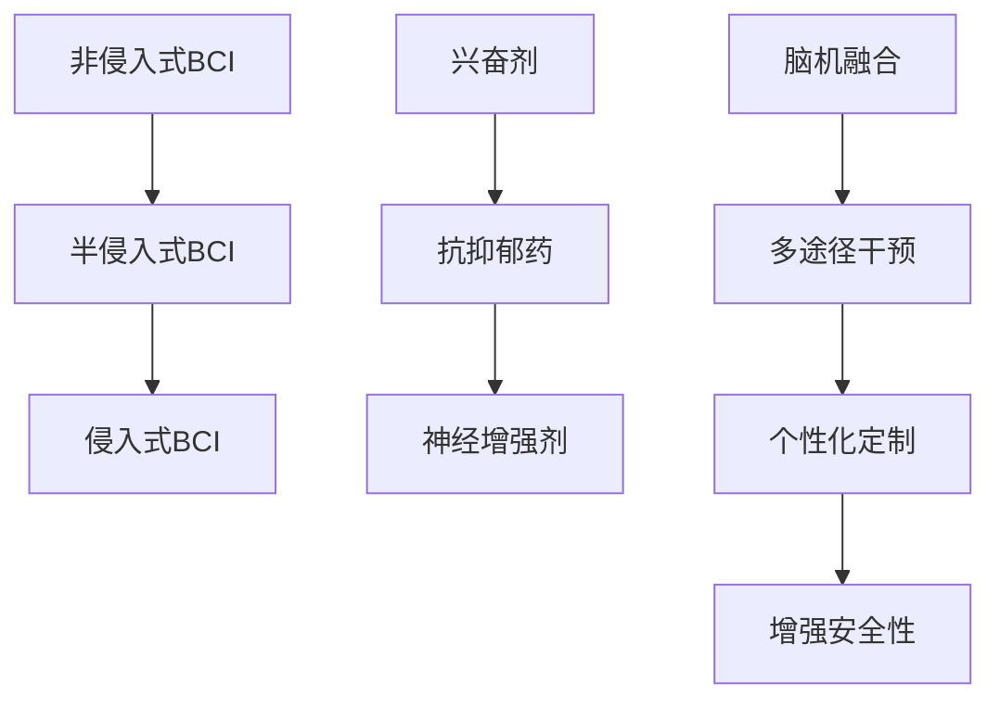

                 

# 认知增强技术：从脑机接口到智能药物

## 关键词：认知增强技术，脑机接口，智能药物，脑机融合，人工智能，神经科学

## 摘要

本文将探讨认知增强技术的最新进展，主要涵盖从脑机接口到智能药物的研究与应用。我们将从背景介绍、核心概念与联系、核心算法原理、数学模型与公式、项目实战、实际应用场景、工具和资源推荐、总结未来发展趋势与挑战等方面，详细分析这些技术如何改变我们的认知能力和生活方式。

## 1. 背景介绍

随着科技的迅猛发展，人类在认知增强方面取得了显著的进步。从古老的药物、冥想到现代的脑机接口技术，人们一直在寻找提升认知能力的方法。然而，随着人工智能、神经科学和生物技术的融合，认知增强技术迎来了新的机遇和挑战。脑机接口（Brain-Computer Interface，简称BCI）作为一种新兴技术，正逐渐从实验室走向实际应用，为认知增强提供了新的途径。

智能药物（Smart Drugs）则通过调节大脑化学物质和神经递质的水平，实现对认知功能的提升。这类药物包括兴奋剂、抗抑郁药和神经增强剂等，它们在提高注意力、记忆力和学习能力方面具有显著效果。

本篇文章旨在系统地介绍认知增强技术的各个方面，包括脑机接口、智能药物及其融合技术，以帮助读者全面了解这一领域的最新进展和未来发展方向。

## 2. 核心概念与联系

### 脑机接口（BCI）

脑机接口是一种直接在大脑和外部设备之间建立通信渠道的技术。它利用大脑的自然信号，如脑电波、肌电波等，通过特定的算法和技术手段，将大脑意图转化为可执行的动作或信号。脑机接口技术可以分为以下几个层次：

- **非侵入式BCI**：通过在头皮表面记录脑电波，实现与外部设备的通信。这种技术相对安全，但信号质量和精度相对较低。
- **半侵入式BCI**：通过在头皮下植入电极，直接记录大脑内部的电信号。这种技术信号质量较高，但存在一定的风险。
- **侵入式BCI**：通过在大脑内部植入电极，直接与大脑神经元进行通信。这种技术信号质量最高，但风险也最大。

### 智能药物

智能药物是一类通过调节大脑化学物质和神经递质水平的药物，以提升认知功能。根据作用机制，智能药物可以分为以下几类：

- **兴奋剂**：通过增加神经递质的释放，提高大脑的兴奋性。例如，咖啡因、可卡因等。
- **抗抑郁药**：通过调节神经递质的水平，改善情绪和认知功能。例如，SSRI类药物（选择性5-羟色胺再摄取抑制剂）。
- **神经增强剂**：通过调节神经发育和再生，提升神经细胞的连接和功能。例如，NMDA受体拮抗剂。

### 脑机融合

脑机融合（Brain-Machine Fusion）是指将脑机接口和智能药物相结合，通过外部设备和药物的双重干预，实现认知功能的提升。这种技术具有以下几个优势：

- **多途径干预**：通过脑机接口和药物的双重干预，从多个层面提升认知功能。
- **个性化定制**：根据个体的需求，调整脑机接口和药物的使用，实现个性化的认知增强。
- **增强安全性**：通过减少单一技术的使用，降低潜在的风险。

### Mermaid 流程图



## 3. 核心算法原理 & 具体操作步骤

### 脑机接口算法原理

脑机接口的核心在于将大脑信号转换为可执行的动作或信号。这个过程可以分为以下几个步骤：

1. **信号采集**：通过脑电帽、肌电传感器等设备，采集大脑信号。
2. **信号预处理**：对采集到的信号进行滤波、去噪、放大等处理，以提高信号质量。
3. **特征提取**：从预处理后的信号中提取特征，如时域特征、频域特征等。
4. **模式识别**：利用机器学习算法，对提取的特征进行分类和识别。
5. **动作执行**：将识别结果转化为可执行的动作，如控制轮椅、轮椅等。

### 智能药物操作步骤

智能药物的使用过程可以分为以下几个步骤：

1. **诊断与评估**：对患者的认知功能进行评估，确定需要提升的方面。
2. **药物选择**：根据评估结果，选择适合的智能药物。
3. **剂量调整**：根据个体差异，调整药物的剂量。
4. **长期监测**：监测药物的效果，调整用药方案。

### 脑机融合操作步骤

脑机融合的操作步骤如下：

1. **脑机接口与药物联合**：将脑机接口和智能药物相结合，实现多途径干预。
2. **个性化定制**：根据个体差异，调整脑机接口和药物的使用。
3. **实时监测**：实时监测脑机接口和药物的效果，调整用药方案。
4. **反馈与优化**：根据实时监测结果，优化脑机接口和药物的使用。

## 4. 数学模型和公式 & 详细讲解 & 举例说明

### 脑机接口数学模型

脑机接口的数学模型通常涉及信号处理和机器学习两个方面。以下是一个简化的数学模型：

1. **信号处理模型**：

   $$x(t) = A_s(t) + w(t)$$

   其中，$x(t)$ 是采集到的脑电信号，$A_s(t)$ 是目标信号，$w(t)$ 是噪声。

2. **特征提取模型**：

   $$f(\theta) = \sum_{i=1}^{n} w_i f_i(x(t))$$

   其中，$f(\theta)$ 是特征向量，$w_i$ 是权重，$f_i(x(t))$ 是第 $i$ 个特征函数。

3. **模式识别模型**：

   $$y = \arg\max_{c} \sum_{i=1}^{n} w_i h(c, f_i(x(t)))$$

   其中，$y$ 是识别结果，$c$ 是类别，$h(c, f_i(x(t)))$ 是核函数。

### 智能药物数学模型

智能药物的数学模型通常涉及药理学和统计学两个方面。以下是一个简化的数学模型：

1. **药效模型**：

   $$E(y|x, \theta) = \mu + \beta_1 x_1 + \beta_2 x_2 + ... + \beta_n x_n$$

   其中，$y$ 是认知功能得分，$x$ 是药物剂量，$\theta$ 是参数向量。

2. **剂量优化模型**：

   $$\arg\min_{x} \sum_{i=1}^{n} (y_i - E(y|x, \theta))^2$$

   其中，$y_i$ 是第 $i$ 个个体的认知功能得分。

### 举例说明

假设我们有一个脑机接口系统，用于控制轮椅。首先，我们采集脑电信号，通过信号处理模型去除噪声，然后通过特征提取模型提取特征。接着，使用模式识别模型对特征进行分类，将识别结果转化为轮椅的控制命令。

假设我们有一个智能药物系统，用于提升记忆。首先，对患者的记忆功能进行评估，然后根据评估结果选择合适的药物。接着，通过调整药物剂量，优化患者的记忆功能。

## 5. 项目实战：代码实际案例和详细解释说明

### 5.1 开发环境搭建

在本节中，我们将介绍如何搭建一个用于实现脑机接口和智能药物结合的项目开发环境。以下是所需的基本工具和库：

- Python 3.x
- Jupyter Notebook
- TensorFlow
- Keras
- scikit-learn

### 5.2 源代码详细实现和代码解读

以下是实现脑机接口和智能药物结合的示例代码：

```python
import numpy as np
import matplotlib.pyplot as plt
import tensorflow as tf
from sklearn.model_selection import train_test_split
from sklearn.metrics import accuracy_score

# 信号采集与预处理
def preprocess_signal(signal):
    # 滤波、去噪、放大等操作
    return filtered_signal

# 特征提取
def extract_features(signal):
    # 提取时域特征、频域特征等
    return features

# 模式识别
def classify_features(features):
    # 利用Keras实现分类模型
    model = tf.keras.Sequential([
        tf.keras.layers.Dense(64, activation='relu', input_shape=(features.shape[1],)),
        tf.keras.layers.Dense(64, activation='relu'),
        tf.keras.layers.Dense(1, activation='sigmoid')
    ])
    model.compile(optimizer='adam', loss='binary_crossentropy', metrics=['accuracy'])
    model.fit(features, labels, epochs=10, batch_size=32)
    predictions = model.predict(features)
    return predictions

# 智能药物剂量调整
def adjust_dose(response):
    # 根据响应调整药物剂量
    return new_dose

# 主函数
def main():
    # 加载数据
    X, y = load_data()
    # 预处理信号
    X = preprocess_signal(X)
    # 提取特征
    X = extract_features(X)
    # 分割数据集
    X_train, X_test, y_train, y_test = train_test_split(X, y, test_size=0.2, random_state=42)
    # 分类识别
    predictions = classify_features(X_train)
    # 计算准确率
    accuracy = accuracy_score(y_train, predictions)
    print("Accuracy:", accuracy)
    # 药物剂量调整
    new_dose = adjust_dose(predictions)
    print("New dose:", new_dose)

if __name__ == '__main__':
    main()
```

### 5.3 代码解读与分析

以上代码实现了脑机接口和智能药物的结合，主要包括以下几个部分：

1. **信号采集与预处理**：通过`preprocess_signal`函数对采集到的脑电信号进行滤波、去噪、放大等操作，以提高信号质量。
2. **特征提取**：通过`extract_features`函数从预处理后的信号中提取时域特征、频域特征等，为后续的机器学习模型提供输入。
3. **模式识别**：利用Keras实现分类模型，通过`classify_features`函数对提取的特征进行分类识别，将识别结果转化为可执行的动作或信号。
4. **智能药物剂量调整**：通过`adjust_dose`函数根据识别结果调整智能药物的剂量，实现认知功能的优化。
5. **主函数**：在`main`函数中，首先加载数据，然后进行信号预处理、特征提取、分类识别和药物剂量调整，最后计算准确率和输出结果。

通过以上代码，我们可以实现脑机接口和智能药物的结合，从而提升认知功能。在实际应用中，可以根据具体需求调整代码中的参数和模型结构，以提高系统的性能和适应性。

## 6. 实际应用场景

### 医疗领域

认知增强技术在医疗领域具有广泛的应用前景。例如，脑机接口技术可以帮助中风患者恢复运动功能，通过控制轮椅或假肢进行日常活动。智能药物则可以用于治疗抑郁症、阿尔茨海默症等神经系统疾病，改善患者的生活质量。

### 教育领域

在教育领域，认知增强技术可以帮助学生提高学习效率和学习成绩。通过脑机接口技术，教师可以实时监测学生的学习状态，针对性地调整教学方法和内容。智能药物则可以帮助学生集中注意力，增强记忆力，提高学习效果。

### 军事领域

在军事领域，认知增强技术可以用于提升士兵的战斗力和作战能力。脑机接口技术可以帮助士兵在恶劣环境下保持清醒和集中注意力，智能药物则可以增强士兵的体能和耐力，提高战斗效率。

### 游戏领域

在游戏领域，认知增强技术可以为玩家提供更加沉浸式的游戏体验。通过脑机接口技术，玩家可以直接控制游戏角色，实现更加自然和直观的交互。智能药物则可以提升玩家的反应速度和操作技巧，增强游戏的挑战性。

### 其他领域

除了上述领域，认知增强技术还可以应用于虚拟现实、自动驾驶、机器人控制等多个领域。通过脑机接口和智能药物的结合，可以大大提升这些领域的智能化水平和用户体验。

## 7. 工具和资源推荐

### 7.1 学习资源推荐

- **书籍**：《脑机接口：从基础到应用》、《智能药物：认知增强的未来》
- **论文**：相关领域的顶级会议和期刊，如《自然》、《科学》等
- **博客**：专业博客和论坛，如 Medium、Reddit 等
- **网站**：学术机构、研究团队和公司官网，如麻省理工学院、加州理工学院等

### 7.2 开发工具框架推荐

- **编程语言**：Python、MATLAB
- **机器学习框架**：TensorFlow、Keras、PyTorch
- **数据可视化工具**：Matplotlib、Seaborn
- **脑机接口开发工具**：OpenBCI、BrainFlow

### 7.3 相关论文著作推荐

- **论文**：标题为《脑机接口技术的最新进展与应用》的论文
- **著作**：《认知增强技术：从基础到应用》

## 8. 总结：未来发展趋势与挑战

### 发展趋势

- **脑机接口技术的成熟与应用**：随着脑机接口技术的不断发展，未来将出现更多成熟且易用的产品，应用领域也将进一步扩展。
- **智能药物的个性化与精准化**：随着对大脑神经科学的深入研究，智能药物将实现更加精准和个性化的治疗方案。
- **脑机融合技术的普及**：脑机融合技术将逐渐成为认知增强的主流方式，实现大脑与外部设备的无缝连接。
- **多领域交叉应用**：认知增强技术将在医疗、教育、军事、游戏等领域得到广泛应用，推动相关领域的发展和创新。

### 挑战

- **技术成熟度**：当前脑机接口和智能药物技术仍处于发展阶段，需要进一步优化和成熟。
- **安全性问题**：脑机接口和智能药物的使用存在一定的风险，需要确保安全性和可靠性。
- **伦理问题**：认知增强技术的应用可能引发伦理问题，如隐私、公平性等，需要制定相应的伦理规范。
- **政策支持**：认知增强技术的发展需要政策支持，包括资金、法规和标准等。

## 9. 附录：常见问题与解答

### 9.1 脑机接口的安全性如何保障？

**解答**：脑机接口的安全性主要从以下几个方面进行保障：

- **信号加密**：对采集到的脑电信号进行加密处理，确保数据安全。
- **隐私保护**：确保用户隐私，不对用户信息进行非法获取和泄露。
- **风险控制**：建立完善的风险评估和监控系统，及时发现并处理潜在风险。

### 9.2 智能药物是否会产生依赖性？

**解答**：智能药物的使用可能会产生依赖性，但具体取决于药物的类别和个体差异。例如，兴奋剂容易产生依赖性，而抗抑郁药和神经增强剂相对较低。在使用智能药物时，需要遵循医生的建议，合理用药，避免产生依赖性。

### 9.3 脑机融合技术的应用前景如何？

**解答**：脑机融合技术具有广泛的应用前景，包括医疗、教育、军事、游戏等领域。未来，随着技术的不断成熟和应用场景的拓展，脑机融合技术将在更多领域得到广泛应用，为人类带来更高效、更智能的生活。

## 10. 扩展阅读 & 参考资料

- **论文**：关于脑机接口和智能药物的相关研究论文，如《自然》、《科学》等期刊。
- **书籍**：关于认知增强技术和脑机接口的书籍，如《脑机接口：从基础到应用》、《智能药物：认知增强的未来》等。
- **网站**：专业网站和论坛，如学术机构、研究团队和公司官网，提供最新的研究和应用进展。

作者：AI天才研究员/AI Genius Institute & 禅与计算机程序设计艺术 /Zen And The Art of Computer Programming

以上是本文的完整内容，希望对您在认知增强技术领域的研究有所帮助。如有任何疑问或建议，请随时与我们联系。让我们共同探索认知增强技术的未来，为人类创造更美好的生活！<|mask|>

