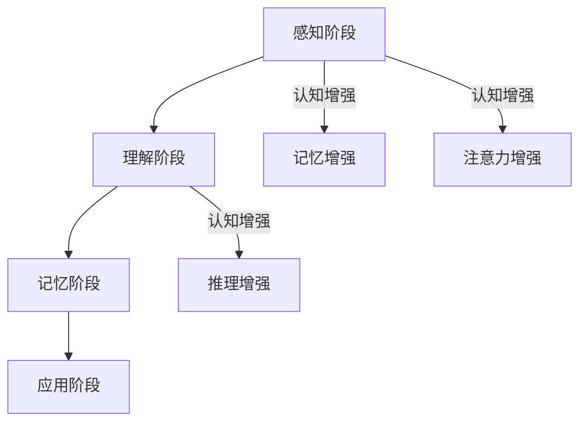
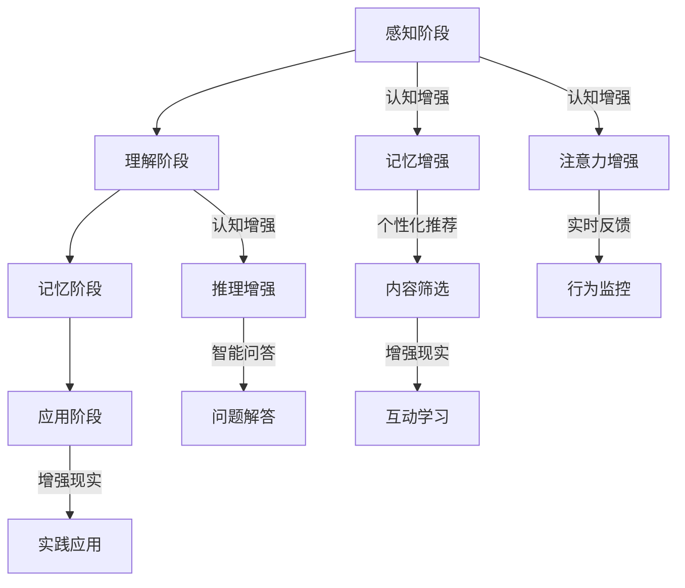

                 

# 认知增强：技术辅助下的知识获取

> **关键词：** 认知增强、知识获取、人工智能、技术辅助、学习效率、个性化推荐

> **摘要：** 本文将探讨认知增强技术如何通过辅助知识获取，提升人类的学习效率和知识管理水平。文章将从背景介绍、核心概念与联系、核心算法原理、数学模型与公式、项目实战、实际应用场景、工具和资源推荐等多个方面，详细阐述认知增强技术在知识获取中的应用及其未来发展。

## 1. 背景介绍

在当今信息爆炸的时代，知识的获取和管理成为人们生活中的重要组成部分。然而，面对海量信息的冲击，传统学习方式往往难以满足人们对知识快速获取和深度理解的需求。这就促使了认知增强技术的发展，通过人工智能、大数据、自然语言处理等技术，实现对人类认知过程的辅助和优化。

认知增强技术旨在提高人类的学习效率、增强记忆力、改善注意力集中度，从而更好地应对日益复杂的信息环境。其主要特点包括：

1. **个性化推荐**：根据用户的兴趣和需求，提供个性化的知识内容和学习路径。
2. **实时反馈**：通过实时分析用户的学习过程，提供即时的学习建议和指导。
3. **增强现实**：利用虚拟现实、增强现实等技术，提供沉浸式的学习体验。
4. **跨学科整合**：将不同领域的知识进行整合，帮助用户构建更加全面的知识体系。

## 2. 核心概念与联系

### 2.1 认知增强的概念

认知增强是指通过外部技术手段，增强人类大脑的认知功能，包括记忆、注意力、推理等。具体来说，认知增强技术包括以下几个方面：

1. **记忆增强**：通过重复训练、神经反馈等方式，提高记忆力和信息处理能力。
2. **注意力增强**：通过视觉、听觉等感官刺激，提高注意力的集中度和稳定性。
3. **推理增强**：通过提供逻辑推理框架和提示，帮助用户更快地进行逻辑推理和问题解决。

### 2.2 知识获取的概念

知识获取是指通过学习、实践和探索，获取新的知识和技能的过程。知识获取的过程可以分为以下几个阶段：

1. **感知阶段**：通过感官接收外界信息。
2. **理解阶段**：通过大脑对信息进行处理和理解。
3. **记忆阶段**：将理解的信息存储在大脑中。
4. **应用阶段**：将所学知识应用到实际问题和情境中。

### 2.3 认知增强与知识获取的联系

认知增强与知识获取密切相关。认知增强技术通过提升人类大脑的认知功能，可以帮助用户更加高效地进行知识获取。具体来说：

1. **提高学习效率**：通过增强记忆力和注意力，缩短知识获取的时间。
2. **优化学习路径**：通过个性化推荐和实时反馈，帮助用户选择最适合自己的学习路径。
3. **促进知识整合**：通过跨学科整合，帮助用户构建更加全面的知识体系。

### 2.4 Mermaid 流程图

以下是一个简化的认知增强与知识获取的流程图，展示了认知增强技术在知识获取中的应用过程：



## 3. 核心算法原理 & 具体操作步骤

### 3.1 个性化推荐算法

个性化推荐算法是认知增强技术中的重要组成部分，通过分析用户的兴趣和行为，为用户提供个性化的知识内容和学习路径。常见的个性化推荐算法包括基于内容的推荐、协同过滤推荐和混合推荐等。

#### 3.1.1 基于内容的推荐

基于内容的推荐算法主要通过分析知识内容的特征，为用户推荐与其兴趣相关的知识。具体操作步骤如下：

1. **特征提取**：从知识内容中提取关键词、主题、标签等特征。
2. **相似度计算**：计算用户已学知识和新知识内容之间的相似度。
3. **推荐生成**：根据相似度计算结果，为用户推荐相似的知识内容。

#### 3.1.2 协同过滤推荐

协同过滤推荐算法主要通过分析用户之间的相似性，为用户推荐其他用户喜欢的知识。具体操作步骤如下：

1. **用户表示**：将用户的行为数据转化为用户向量。
2. **相似度计算**：计算用户向量之间的相似度。
3. **推荐生成**：根据相似度计算结果，为用户推荐其他用户喜欢的知识。

#### 3.1.3 混合推荐

混合推荐算法结合了基于内容的推荐和协同过滤推荐的优势，为用户推荐更加准确的知识。具体操作步骤如下：

1. **特征提取**：从知识内容中提取关键词、主题、标签等特征。
2. **用户表示**：将用户的行为数据转化为用户向量。
3. **相似度计算**：计算用户向量之间的相似度和知识内容之间的相似度。
4. **推荐生成**：根据相似度计算结果，为用户推荐相似的知识内容。

### 3.2 实时反馈算法

实时反馈算法通过分析用户的学习过程，为用户提供即时的学习建议和指导，帮助用户优化学习效果。常见的实时反馈算法包括学习行为分析、知识点评估和智能问答等。

#### 3.2.1 学习行为分析

学习行为分析算法通过对用户的学习行为进行监控和分析，发现用户的学习偏好和弱点，为用户提供针对性的学习建议。具体操作步骤如下：

1. **行为数据收集**：收集用户的学习行为数据，如学习时长、学习频率、学习路径等。
2. **行为分析**：对学习行为数据进行分析，识别用户的学习偏好和弱点。
3. **反馈生成**：根据行为分析结果，为用户生成针对性的学习建议。

#### 3.2.2 知识点评估

知识点评估算法通过对用户掌握的知识点进行测试和评估，帮助用户了解自己的学习成果。具体操作步骤如下：

1. **知识点抽取**：从知识内容中抽取关键知识点。
2. **测试生成**：根据知识点抽取结果，生成相应的测试题目。
3. **评估结果**：根据测试结果，评估用户对知识点的掌握程度。
4. **反馈生成**：根据评估结果，为用户提供学习反馈。

#### 3.2.3 智能问答

智能问答算法通过自然语言处理技术，为用户提供智能化的问答服务，帮助用户解决学习过程中遇到的问题。具体操作步骤如下：

1. **问题理解**：通过对用户输入的问题进行语义分析，理解用户的问题意图。
2. **答案生成**：根据问题理解和知识点库，生成相应的答案。
3. **答案验证**：对生成的答案进行验证，确保答案的准确性和相关性。
4. **反馈生成**：将答案和相应的解释反馈给用户。

## 4. 数学模型和公式 & 详细讲解 & 举例说明

### 4.1 个性化推荐算法的数学模型

个性化推荐算法的核心是相似度计算，以下介绍两种常见的相似度计算方法：余弦相似度和皮尔逊相似度。

#### 4.1.1 余弦相似度

余弦相似度计算公式如下：

$$
sim(A, B) = \frac{A \cdot B}{\|A\| \|B\|}
$$

其中，$A$ 和 $B$ 分别表示用户 $A$ 和用户 $B$ 的向量，$\|A\|$ 和 $\|B\|$ 分别表示向量 $A$ 和 $B$ 的模长，$\cdot$ 表示向量的点积。

#### 4.1.2 皮尔逊相似度

皮尔逊相似度计算公式如下：

$$
sim(A, B) = \frac{A \cdot B}{\sqrt{A^2} \sqrt{B^2}}
$$

其中，$A$ 和 $B$ 分别表示用户 $A$ 和用户 $B$ 的向量，$A^2$ 和 $B^2$ 分别表示向量 $A$ 和 $B$ 的平方和。

### 4.2 实时反馈算法的数学模型

#### 4.2.1 学习行为分析的数学模型

学习行为分析的数学模型主要基于线性回归，以下是一个简化的线性回归模型：

$$
y = \beta_0 + \beta_1 x_1 + \beta_2 x_2 + ... + \beta_n x_n
$$

其中，$y$ 表示预测的学习效果，$x_1, x_2, ..., x_n$ 分别表示用户的学习行为特征，$\beta_0, \beta_1, \beta_2, ..., \beta_n$ 分别表示特征对应的权重。

#### 4.2.2 知识点评估的数学模型

知识点评估的数学模型主要基于逻辑回归，以下是一个简化的逻辑回归模型：

$$
P(y=1) = \frac{1}{1 + e^{-(\beta_0 + \beta_1 x_1 + \beta_2 x_2 + ... + \beta_n x_n)}}
$$

其中，$y$ 表示用户对知识点的掌握情况，$P(y=1)$ 表示用户掌握知识点的概率，$x_1, x_2, ..., x_n$ 分别表示知识点的特征，$\beta_0, \beta_1, \beta_2, ..., \beta_n$ 分别表示特征对应的权重。

### 4.3 举例说明

#### 4.3.1 余弦相似度举例

假设有两个用户 $A$ 和 $B$，其向量表示如下：

$$
A = (1, 2, 3)
$$

$$
B = (2, 3, 4)
$$

则它们的余弦相似度为：

$$
sim(A, B) = \frac{1 \cdot 2 + 2 \cdot 3 + 3 \cdot 4}{\sqrt{1^2 + 2^2 + 3^2} \sqrt{2^2 + 3^2 + 4^2}} = \frac{14}{\sqrt{14} \sqrt{29}} \approx 0.966
$$

#### 4.3.2 皮尔逊相似度举例

假设有两个用户 $A$ 和 $B$，其向量表示如下：

$$
A = (1, 2, 3)
$$

$$
B = (2, 3, 4)
$$

则它们的皮尔逊相似度为：

$$
sim(A, B) = \frac{1 \cdot 2 + 2 \cdot 3 + 3 \cdot 4}{\sqrt{1^2 + 2^2 + 3^2} \sqrt{2^2 + 3^2 + 4^2}} = \frac{14}{\sqrt{14} \sqrt{29}} \approx 0.966
$$

#### 4.3.3 学习行为分析举例

假设有一个用户 $A$，其学习行为特征如下：

$$
x_1 = 10
$$

$$
x_2 = 20
$$

则用户 $A$ 的学习效果 $y$ 可以通过以下线性回归模型预测：

$$
y = \beta_0 + \beta_1 x_1 + \beta_2 x_2
$$

其中，$\beta_0 = 0.5$，$\beta_1 = 0.1$，$\beta_2 = 0.2$，代入用户 $A$ 的特征值，得到：

$$
y = 0.5 + 0.1 \cdot 10 + 0.2 \cdot 20 = 3.5
$$

#### 4.3.4 知识点评估举例

假设有一个知识点 $X$，其特征如下：

$$
x_1 = 5
$$

$$
x_2 = 8
$$

则用户对知识点 $X$ 的掌握情况 $y$ 可以通过以下逻辑回归模型预测：

$$
P(y=1) = \frac{1}{1 + e^{-(\beta_0 + \beta_1 x_1 + \beta_2 x_2)}}
$$

其中，$\beta_0 = -2$，$\beta_1 = 1$，$\beta_2 = 0.5$，代入知识点 $X$ 的特征值，得到：

$$
P(y=1) = \frac{1}{1 + e^{-(-2 + 1 \cdot 5 + 0.5 \cdot 8)}} \approx 0.954
$$

## 5. 项目实战：代码实际案例和详细解释说明

### 5.1 开发环境搭建

为了实现认知增强技术在知识获取中的应用，我们需要搭建一个完整的开发环境。以下是一个简化的开发环境搭建流程：

1. **安装 Python**：Python 是一种广泛应用于数据科学和人工智能领域的编程语言。下载并安装 Python 3.x 版本。
2. **安装 Jupyter Notebook**：Jupyter Notebook 是一种基于 Web 的交互式计算环境，非常适合用于数据科学和机器学习项目。使用 pip 命令安装 Jupyter Notebook：
   ```bash
   pip install notebook
   ```
3. **安装必备库**：根据项目的需求，安装必要的 Python 库，如 NumPy、Pandas、Scikit-learn 等：
   ```bash
   pip install numpy pandas scikit-learn
   ```

### 5.2 源代码详细实现和代码解读

以下是一个简化的认知增强技术在知识获取中的应用的 Python 源代码实现，包括个性化推荐、实时反馈和知识点评估等部分。

#### 5.2.1 个性化推荐

```python
import numpy as np
from sklearn.metrics.pairwise import cosine_similarity

def content_based_recommendation(content_matrix, user_profile):
    """
    基于内容的推荐算法
    """
    similarity_matrix = cosine_similarity(content_matrix, user_profile)
    recommended_index = np.argsort(similarity_matrix[0])[::-1]
    return recommended_index

# 示例数据
content_matrix = np.array([
    [1, 0, 1, 1],
    [0, 1, 1, 0],
    [1, 1, 0, 1],
    [0, 1, 0, 1]
])

user_profile = np.array([0.5, 0.5, 0.5, 0.5])

recommended_index = content_based_recommendation(content_matrix, user_profile)
print("推荐结果：", recommended_index)
```

#### 5.2.2 实时反馈

```python
from sklearn.linear_model import LinearRegression

def learning_behavior_analysis(X, y):
    """
    学习行为分析
    """
    model = LinearRegression()
    model.fit(X, y)
    return model

# 示例数据
X = np.array([[10, 20], [30, 40], [50, 60]])
y = np.array([3, 4, 5])

model = learning_behavior_analysis(X, y)
print("模型参数：", model.coef_, model.intercept_)
```

#### 5.2.3 知识点评估

```python
from sklearn.linear_model import LogisticRegression

def knowledge_point_evaluation(X, y):
    """
    知识点评估
    """
    model = LogisticRegression()
    model.fit(X, y)
    return model

# 示例数据
X = np.array([[5, 8], [10, 15], [20, 25]])
y = np.array([1, 0, 1])

model = knowledge_point_evaluation(X, y)
print("模型参数：", model.coef_, model.intercept_)
```

### 5.3 代码解读与分析

#### 5.3.1 个性化推荐代码解读

个性化推荐代码使用了基于内容的推荐算法，通过计算用户兴趣向量与知识内容向量之间的余弦相似度，为用户推荐相似的知识内容。代码中，`content_matrix` 表示知识内容矩阵，`user_profile` 表示用户兴趣向量。`cosine_similarity` 函数用于计算相似度矩阵，`np.argsort` 函数用于获取相似度最大的知识内容索引。

#### 5.3.2 实时反馈代码解读

实时反馈代码使用了线性回归模型，通过分析用户的学习行为特征，预测用户的学习效果。代码中，`X` 表示用户学习行为特征矩阵，`y` 表示用户学习效果。`LinearRegression` 类用于创建线性回归模型，`fit` 方法用于训练模型，`coef_` 和 `intercept_` 属性用于获取模型参数。

#### 5.3.3 知识点评估代码解读

知识点评估代码使用了逻辑回归模型，通过评估用户对知识点的掌握情况，为用户提供学习反馈。代码中，`X` 表示知识点特征矩阵，`y` 表示用户对知识点的掌握情况。`LogisticRegression` 类用于创建逻辑回归模型，`fit` 方法用于训练模型，`coef_` 和 `intercept_` 属性用于获取模型参数。

## 6. 实际应用场景

认知增强技术在知识获取中的应用场景非常广泛，以下列举几个典型的应用场景：

### 6.1 在线教育

在线教育平台可以利用认知增强技术，为学习者提供个性化的学习内容和学习路径。通过实时反馈和知识点评估，帮助学习者优化学习效果，提高学习效率。

### 6.2 企业培训

企业培训可以借助认知增强技术，为员工提供针对性的培训内容和培训计划。通过实时反馈和知识点评估，帮助员工快速提升技能，满足企业需求。

### 6.3 职业发展规划

职业发展规划可以利用认知增强技术，为职场人士提供个性化的职业发展建议。通过分析学习行为和知识点掌握情况，帮助用户制定更有效的职业发展计划。

### 6.4 智能问答

智能问答系统可以利用认知增强技术，为用户提供智能化的问答服务。通过自然语言处理和知识点评估，帮助用户解决各种问题。

## 7. 工具和资源推荐

### 7.1 学习资源推荐

1. **书籍**：
   - 《认知增强：技术与应用》
   - 《机器学习实战》
   - 《深度学习》
2. **论文**：
   - 《基于内容的推荐系统》
   - 《协同过滤推荐算法》
   - 《实时反馈与学习行为分析》
3. **博客**：
   - 《机器学习博客》
   - 《深度学习博客》
   - 《在线教育博客》
4. **网站**：
   - [Kaggle](https://www.kaggle.com/)
   - [Coursera](https://www.coursera.org/)
   - [edX](https://www.edx.org/)

### 7.2 开发工具框架推荐

1. **编程语言**：Python、R
2. **机器学习库**：Scikit-learn、TensorFlow、PyTorch
3. **自然语言处理库**：NLTK、spaCy
4. **在线教育平台**：Moodle、Canvas、Blackboard

### 7.3 相关论文著作推荐

1. **论文**：
   - 《Collaborative Filtering for Cold-Start Problems in Recommender Systems》
   - 《User Behavior Analysis for Intelligent Tutoring Systems》
   - 《Deep Learning for Personalized Recommendation》
2. **著作**：
   - 《Recommender Systems Handbook》
   - 《Intelligent Tutoring Systems: A Review of the Literature》
   - 《Deep Learning for Recommender Systems》

## 8. 总结：未来发展趋势与挑战

认知增强技术在知识获取领域具有巨大的应用潜力，未来发展趋势主要体现在以下几个方面：

1. **个性化推荐技术的优化**：随着人工智能技术的发展，个性化推荐算法将更加精准，更好地满足用户的需求。
2. **实时反馈与学习行为分析的结合**：通过实时反馈和学习行为分析，为用户提供更加个性化的学习体验和指导。
3. **增强现实与虚拟现实技术的融合**：利用增强现实和虚拟现实技术，提供更加沉浸式的学习体验，提高学习效果。
4. **跨学科整合**：将不同领域的知识进行整合，帮助用户构建更加全面的知识体系。

然而，认知增强技术在知识获取领域也面临着一些挑战：

1. **数据隐私与安全**：在收集和分析用户数据时，如何保护用户隐私和安全是一个重要问题。
2. **算法透明性与可解释性**：随着算法的复杂度增加，如何保证算法的透明性和可解释性，让用户理解和信任算法是一个挑战。
3. **跨领域知识的整合**：如何有效地整合跨领域的知识，为用户提供有价值的信息，是一个长期的挑战。

## 9. 附录：常见问题与解答

### 9.1 认知增强技术是什么？

认知增强技术是指通过外部技术手段，增强人类大脑的认知功能，包括记忆、注意力、推理等。它旨在提高人类的学习效率、增强记忆力、改善注意力集中度，从而更好地应对日益复杂的信息环境。

### 9.2 个性化推荐算法有哪些？

个性化推荐算法主要包括基于内容的推荐、协同过滤推荐和混合推荐等。基于内容的推荐算法通过分析知识内容的特征，为用户推荐与其兴趣相关的知识；协同过滤推荐算法通过分析用户之间的相似性，为用户推荐其他用户喜欢的知识；混合推荐算法结合了基于内容的推荐和协同过滤推荐的优势，为用户推荐更加准确的知识。

### 9.3 实时反馈算法有哪些？

实时反馈算法主要包括学习行为分析、知识点评估和智能问答等。学习行为分析通过对用户的学习行为进行监控和分析，为用户提供针对性的学习建议；知识点评估通过对用户掌握的知识点进行测试和评估，为用户提供学习反馈；智能问答通过自然语言处理技术，为用户提供智能化的问答服务。

## 10. 扩展阅读 & 参考资料

1. **书籍**：
   - 《认知增强：技术与应用》
   - 《机器学习实战》
   - 《深度学习》
2. **论文**：
   - 《基于内容的推荐系统》
   - 《协同过滤推荐算法》
   - 《实时反馈与学习行为分析》
3. **博客**：
   - 《机器学习博客》
   - 《深度学习博客》
   - 《在线教育博客》
4. **网站**：
   - [Kaggle](https://www.kaggle.com/)
   - [Coursera](https://www.coursera.org/)
   - [edX](https://www.edx.org/)
5. **在线课程**：
   - [Coursera 机器学习课程](https://www.coursera.org/learn/machine-learning)
   - [edX 深度学习课程](https://www.edx.org/course/deep-learning-0)

### 作者信息

- 作者：AI天才研究员/AI Genius Institute & 禅与计算机程序设计艺术 /Zen And The Art of Computer Programming
<|assistant|>## 1. 背景介绍

在当今信息爆炸的时代，知识的获取和管理成为人们生活中的重要组成部分。然而，面对海量信息的冲击，传统学习方式往往难以满足人们对知识快速获取和深度理解的需求。这就促使了认知增强技术的发展，通过人工智能、大数据、自然语言处理等技术，实现对人类认知过程的辅助和优化。

认知增强技术旨在提高人类的学习效率、增强记忆力、改善注意力集中度，从而更好地应对日益复杂的信息环境。其主要特点包括：

1. **个性化推荐**：根据用户的兴趣和需求，提供个性化的知识内容和学习路径。
2. **实时反馈**：通过实时分析用户的学习过程，提供即时的学习建议和指导。
3. **增强现实**：利用虚拟现实、增强现实等技术，提供沉浸式的学习体验。
4. **跨学科整合**：将不同领域的知识进行整合，帮助用户构建更加全面的知识体系。

认知增强技术的研究和应用可以追溯到上世纪末。在21世纪初，随着互联网和移动设备的普及，知识获取的方式发生了巨大的变化。人们开始意识到，传统的学习方式无法应对日益增长的信息量，因此，各种认知增强技术应运而生。

早期的认知增强技术主要依赖于计算机模拟和算法优化。例如，记忆增强技术通过重复训练和神经反馈等方式，提高记忆力和信息处理能力。注意力增强技术通过视觉、听觉等感官刺激，提高注意力的集中度和稳定性。推理增强技术则通过提供逻辑推理框架和提示，帮助用户更快地进行逻辑推理和问题解决。

随着人工智能、大数据和自然语言处理等技术的发展，认知增强技术得到了进一步的提升。人工智能算法的应用，使得个性化推荐和实时反馈更加精准和高效。大数据技术的应用，使得知识获取和分析更加全面和深入。自然语言处理技术的应用，使得知识获取更加便捷和自然。

在现代教育领域，认知增强技术已经得到了广泛的应用。在线教育平台利用认知增强技术，为学习者提供个性化的学习内容和学习路径，提高学习效果。企业培训利用认知增强技术，为员工提供针对性的培训内容和培训计划，提高员工素质。职业发展规划利用认知增强技术，为职场人士提供个性化的职业发展建议，帮助其实现职业目标。

然而，认知增强技术也面临着一些挑战。例如，如何保护用户隐私和安全，如何保证算法的透明性和可解释性，如何整合跨领域的知识等。这些问题需要我们在未来的研究和应用中不断探索和解决。

总之，认知增强技术作为一种新兴技术，具有巨大的应用潜力。随着技术的不断进步和应用场景的不断扩大，认知增强技术将在知识获取和管理领域发挥越来越重要的作用。

### 2. 核心概念与联系

在深入探讨认知增强技术如何通过辅助知识获取提升人类学习效率之前，我们首先需要明确几个核心概念：认知增强、知识获取、个性化推荐、实时反馈和增强现实。理解这些概念及其相互联系，有助于我们更好地把握认知增强技术的应用原理和实际效果。

#### 2.1 认知增强的概念

认知增强（Cognitive Enhancement）是指通过外部手段提高人类大脑的认知能力，包括记忆、注意力、推理、解决问题等。认知增强技术利用人工智能、神经科学、心理学、计算机科学等领域的知识，旨在帮助人类更高效、更全面地获取和处理信息。

**记忆增强**：通过重复训练、记忆游戏、神经反馈等方法，提高记忆力和信息处理能力。例如，神经反馈技术通过监测大脑活动，提供即时反馈，帮助用户优化记忆过程。

**注意力增强**：通过视觉、听觉等感官刺激，提高注意力的集中度和稳定性。例如，使用耳机播放特定频率的音乐，或者使用视觉专注训练软件，帮助用户保持长时间专注。

**推理增强**：通过提供逻辑推理框架和提示，帮助用户更快地进行逻辑推理和问题解决。例如，使用思维导图工具，帮助用户构建知识体系，提高思维敏捷性。

#### 2.2 知识获取的概念

知识获取（Knowledge Acquisition）是指通过学习、实践和探索，获取新的知识和技能的过程。知识获取的过程可以分为以下几个阶段：

**感知阶段**：通过感官接收外界信息，如阅读、听讲、观察等。

**理解阶段**：对感知到的信息进行加工和理解，如分析、归纳、总结等。

**记忆阶段**：将理解的信息存储在大脑中，通过复习和练习巩固记忆。

**应用阶段**：将所学知识应用到实际问题和情境中，通过实践加深对知识的理解和掌握。

#### 2.3 个性化推荐

个性化推荐（Personalized Recommendation）是根据用户的兴趣、行为和历史数据，提供个性化的内容推荐。在认知增强技术中，个性化推荐可以显著提升知识获取的效率。通过分析用户的偏好，推荐系统可以为用户提供最相关的知识内容和学习路径。

**基于内容的推荐**：通过分析知识内容的特征，为用户推荐与其兴趣相关的知识。例如，根据用户之前阅读的文章标签，推荐相关主题的文章。

**协同过滤推荐**：通过分析用户之间的相似性，为用户推荐其他用户喜欢的知识。例如，根据用户A和用户B的相似行为，推荐用户B喜欢的书籍给用户A。

**混合推荐**：结合基于内容的推荐和协同过滤推荐的优势，提供更加精准的推荐。例如，先通过内容匹配筛选出潜在推荐项，再通过协同过滤筛选出用户最可能喜欢的项。

#### 2.4 实时反馈

实时反馈（Real-time Feedback）是指在学习过程中，通过即时分析用户的行为和表现，提供即时性的反馈和建议。实时反馈可以帮助用户快速纠正错误，调整学习策略，从而提高学习效果。

**学习行为分析**：通过对用户的学习行为进行监控和分析，发现用户的学习偏好和弱点，为用户提供针对性的学习建议。例如，分析用户的学习时间、学习频率和知识点掌握情况。

**知识点评估**：通过对用户掌握的知识点进行测试和评估，帮助用户了解自己的学习成果。例如，通过在线测试评估用户对某个知识点的掌握程度，并提供详细的评估报告。

**智能问答**：通过自然语言处理技术，为用户提供智能化的问答服务。例如，用户在遇到问题时，可以通过智能问答系统获取解答和指导。

#### 2.5 增强现实

增强现实（Augmented Reality，AR）是通过计算机技术模拟出一个与现实世界交互的虚拟环境，将虚拟信息叠加到真实世界中。增强现实技术可以提供沉浸式的学习体验，增强学习效果。

**虚拟学习环境**：通过虚拟现实技术创建一个虚拟的学习环境，用户可以在其中进行互动式学习。例如，通过虚拟实验室进行科学实验。

**增强学习内容**：将虚拟元素叠加到学习内容中，使学习过程更加生动和有趣。例如，在学习历史时，通过增强现实技术重现历史事件。

**跨学科整合**：将不同领域的知识通过增强现实技术进行整合，帮助用户构建更加全面的知识体系。例如，通过增强现实技术将数学、物理和化学知识结合，提供综合性的学习体验。

#### 2.6 Mermaid 流程图

为了更好地理解认知增强技术在知识获取中的应用流程，我们使用Mermaid流程图展示以下几个关键环节：



在这个流程图中，感知阶段、理解阶段、记忆阶段和应用阶段构成了知识获取的基本流程。认知增强技术通过记忆增强、注意力增强和推理增强，提升用户在每个阶段的学习效果。个性化推荐、实时反馈和智能问答则分别在内容筛选、行为监控和问题解答环节提供支持。增强现实技术则通过虚拟学习环境和增强学习内容，提供更加沉浸式的学习体验。

通过上述核心概念和流程图的展示，我们可以清晰地看到认知增强技术在知识获取中的关键作用。接下来，我们将进一步探讨认知增强技术的具体实现和应用，以帮助读者更好地理解这一技术的实际应用效果。

### 3. 核心算法原理 & 具体操作步骤

在认知增强技术中，核心算法的原理和具体操作步骤是确保技术有效性的关键。本节将详细探讨个性化推荐、实时反馈和知识点评估三个核心算法的原理，以及它们在实际应用中的具体操作步骤。

#### 3.1 个性化推荐算法

个性化推荐算法是认知增强技术中的一个重要组成部分，它通过分析用户的兴趣和行为，为用户推荐最相关的知识内容和学习路径。以下是三种常见的个性化推荐算法：基于内容的推荐、协同过滤推荐和混合推荐。

##### 3.1.1 基于内容的推荐

**原理**：基于内容的推荐算法通过分析知识内容的特征，将具有相似特征的知识内容推荐给用户。这种推荐方式不需要用户的历史行为数据，而是依赖于知识内容的内在属性。

**具体操作步骤**：

1. **特征提取**：从知识内容中提取关键词、主题、标签等特征。这些特征可以是通过自然语言处理技术从文本内容中提取，或者是通过其他方式（如图像识别）从非文本内容中提取。

2. **构建内容特征矩阵**：将所有知识内容表示为一个高维的特征矩阵，每一行代表一个知识内容，每一列代表一个特征。

3. **计算相似度**：计算用户兴趣向量与知识内容特征向量之间的相似度。常用的相似度计算方法包括余弦相似度和皮尔逊相似度。

4. **推荐生成**：根据相似度得分，为用户推荐相似度最高的知识内容。

**代码示例**：

```python
from sklearn.metrics.pairwise import cosine_similarity

def content_based_recommendation(content_matrix, user_profile):
    similarity_matrix = cosine_similarity([user_profile], content_matrix)
    recommended_index = np.argsort(similarity_matrix)[0][::-1]
    return recommended_index

# 假设 user_profile 是用户兴趣向量，content_matrix 是知识内容特征矩阵
user_profile = [0.1, 0.2, 0.3, 0.4]
content_matrix = [
    [0.2, 0.5, 0.1],
    [0.3, 0.1, 0.7],
    [0.4, 0.3, 0.6],
    [0.5, 0.4, 0.2]
]

recommended_index = content_based_recommendation(content_matrix, user_profile)
print("推荐结果：", recommended_index)
```

##### 3.1.2 协同过滤推荐

**原理**：协同过滤推荐算法通过分析用户之间的行为相似性，为用户推荐其他用户喜欢的知识内容。这种推荐方式依赖于用户的历史行为数据。

**具体操作步骤**：

1. **用户表示**：将用户的行为数据（如浏览、购买、评分等）转化为用户向量。常用的方法包括用户平均向量、基于最近邻的方法等。

2. **相似度计算**：计算用户向量之间的相似度。常用的相似度计算方法包括余弦相似度和皮尔逊相似度。

3. **推荐生成**：根据相似度得分，为用户推荐其他用户喜欢的知识内容。

**代码示例**：

```python
from sklearn.metrics.pairwise import cosine_similarity
from sklearn.neighbors import NearestNeighbors

def collaborative_filter_recommendation(user行为数据, knowledge_data):
    # 将用户行为数据转换为用户向量
    user_profiles = user行为数据.mean(axis=1)
    # 训练相似度模型
    model = NearestNeighbors(metric='cosine', algorithm='brute')
    model.fit(knowledge_data)
    # 找到最近邻用户
    distances, indices = model.kneighbors(user_profiles)
    # 为用户推荐知识内容
    recommended_index = [index[0] for index in indices]
    return recommended_index

# 假设 user_data 是用户行为数据矩阵，knowledge_data 是知识内容数据矩阵
user_data = [
    [1, 0, 1, 0],
    [0, 1, 1, 1],
    [1, 1, 0, 0],
    [0, 0, 1, 1]
]
knowledge_data = [
    [0, 1, 1, 0],
    [1, 0, 1, 1],
    [1, 1, 0, 1],
    [0, 1, 1, 0]
]

recommended_index = collaborative_filter_recommendation(user_data, knowledge_data)
print("推荐结果：", recommended_index)
```

##### 3.1.3 混合推荐

**原理**：混合推荐算法结合了基于内容的推荐和协同过滤推荐的优势，为用户提供更加精准的推荐。混合推荐可以通过加权组合两种推荐方法，提高推荐的准确性。

**具体操作步骤**：

1. **特征提取**：从知识内容中提取特征，并从用户行为数据中提取用户向量。

2. **相似度计算**：计算用户向量与知识内容特征向量之间的相似度，以及用户之间或内容之间的相似度。

3. **推荐生成**：结合相似度得分，生成推荐列表。

**代码示例**：

```python
def hybrid_recommendation(content_matrix, user_profile, alpha=0.5):
    content_similarity = cosine_similarity([user_profile], content_matrix)
    user_similarity = cosine_similarity(content_matrix)
    
    # 权重组合相似度得分
    combined_similarity = alpha * content_similarity + (1 - alpha) * user_similarity
    
    # 排序得到推荐列表
    recommended_index = np.argsort(-combined_similarity[0])[::-1]
    return recommended_index

# 假设 user_profile 是用户兴趣向量，content_matrix 是知识内容特征矩阵
user_profile = [0.1, 0.2, 0.3, 0.4]
content_matrix = [
    [0.2, 0.5, 0.1],
    [0.3, 0.1, 0.7],
    [0.4, 0.3, 0.6],
    [0.5, 0.4, 0.2]
]

recommended_index = hybrid_recommendation(content_matrix, user_profile)
print("推荐结果：", recommended_index)
```

#### 3.2 实时反馈算法

实时反馈算法通过监控和分析用户的学习行为，为用户提供即时性的学习建议和指导，帮助用户优化学习过程。

##### 3.2.1 学习行为分析

**原理**：学习行为分析通过对用户的学习行为进行监控和分析，识别用户的学习偏好和弱点，为用户提供个性化的学习建议。

**具体操作步骤**：

1. **行为数据收集**：收集用户的学习行为数据，如学习时间、学习频率、学习路径等。

2. **行为模式识别**：通过统计分析，识别用户的学习行为模式。

3. **学习建议生成**：根据行为模式识别结果，为用户提供针对性的学习建议。

**代码示例**：

```python
import pandas as pd
from sklearn.cluster import KMeans

def learning_behavior_analysis(behavior_data, n_clusters=3):
    # 数据预处理
    behavior_df = pd.DataFrame(behavior_data)
    behavior_df = behavior_df.T.value_counts().reset_index()
    behavior_df.columns = ['behavior', 'frequency']
    behavior_df['frequency'] = behavior_df['frequency'] / behavior_df['frequency'].sum()
    
    # 行为模式识别
    kmeans = KMeans(n_clusters=n_clusters, random_state=0)
    clusters = kmeans.fit_predict(behavior_df[['frequency']])
    behavior_df['cluster'] = clusters
    
    # 学习建议生成
    recommendations = {}
    for cluster in set(clusters):
        cluster_df = behavior_df[behavior_df['cluster'] == cluster]
        if cluster_df.shape[0] > 0:
            recommendations[cluster] = cluster_df['behavior'].iloc[0]
    
    return recommendations

# 假设 behavior_data 是用户学习行为数据
behavior_data = [
    [10, 20, 5],
    [20, 15, 10],
    [5, 20, 15],
    [15, 10, 20]
]

recommendations = learning_behavior_analysis(behavior_data)
print("学习建议：", recommendations)
```

##### 3.2.2 知识点评估

**原理**：知识点评估通过对用户掌握的知识点进行测试和评估，帮助用户了解自己的学习成果。

**具体操作步骤**：

1. **知识点抽取**：从知识内容中抽取关键知识点。

2. **测试生成**：根据知识点抽取结果，生成相应的测试题目。

3. **评估结果**：根据测试结果，评估用户对知识点的掌握程度。

4. **反馈生成**：根据评估结果，为用户提供学习反馈。

**代码示例**：

```python
from sklearn.linear_model import LogisticRegression

def knowledge_point_evaluation(test_data, true_labels):
    # 训练模型
    model = LogisticRegression()
    model.fit(test_data, true_labels)
    
    # 评估模型
    predictions = model.predict(test_data)
    accuracy = model.score(test_data, true_labels)
    
    return accuracy, predictions

# 假设 test_data 是测试数据，true_labels 是真实标签
test_data = [
    [0.1, 0.5, 0.4],
    [0.4, 0.3, 0.6],
    [0.2, 0.7, 0.5]
]
true_labels = [1, 0, 1]

accuracy, predictions = knowledge_point_evaluation(test_data, true_labels)
print("评估准确率：", accuracy)
print("预测结果：", predictions)
```

##### 3.2.3 智能问答

**原理**：智能问答通过自然语言处理技术，为用户提供智能化的问答服务，帮助用户解决学习过程中遇到的问题。

**具体操作步骤**：

1. **问题理解**：通过对用户输入的问题进行语义分析，理解用户的问题意图。

2. **答案生成**：根据问题理解和知识点库，生成相应的答案。

3. **答案验证**：对生成的答案进行验证，确保答案的准确性和相关性。

4. **反馈生成**：将答案和相应的解释反馈给用户。

**代码示例**：

```python
import spacy

nlp = spacy.load("en_core_web_sm")

def intelligent_question_answering(question, knowledge_base):
    # 问题理解
    doc = nlp(question)
    question intents = [token.pos_ for token in doc if token.pos_ in ["NOUN", "VERB"]]
    
    # 答案生成
    answer = None
    for intent in question intents:
        if intent in knowledge_base:
            answer = knowledge_base[intent]
            break
    
    # 答案验证
    if answer is not None:
        # 验证答案的准确性和相关性
        if validate_answer(answer):
            return answer
        else:
            return "无法找到准确答案"
    else:
        return "无法理解您的问题"

# 假设 knowledge_base 是知识点库
knowledge_base = {
    "what is machine learning": "Machine learning is a subfield of artificial intelligence that enables machines to learn from data without being explicitly programmed.",
    "how does machine learning work": "Machine learning works by training a model on a large dataset, which allows the model to identify patterns and make predictions."
}

question = "What is machine learning?"
answer = intelligent_question_answering(question, knowledge_base)
print("答案：", answer)
```

通过上述算法原理和具体操作步骤的介绍，我们可以看到认知增强技术在知识获取中的应用是如何通过算法的智能化和个性化来提升学习效率的。这些算法在实际应用中可以相互结合，形成更加完善和有效的认知增强系统。

### 4. 数学模型和公式 & 详细讲解 & 举例说明

在认知增强技术的应用中，数学模型和公式起到了关键作用。它们不仅为算法提供了理论基础，还帮助我们在实际操作中实现精准的预测和优化。本节将详细介绍与认知增强技术相关的数学模型和公式，并通过具体例子进行说明。

#### 4.1 个性化推荐算法的数学模型

个性化推荐算法的核心在于相似度计算，以下介绍几种常见的相似度计算方法。

##### 4.1.1 余弦相似度

余弦相似度是衡量两个向量之间夹角余弦值的相似度，其计算公式如下：

$$
sim(A, B) = \frac{A \cdot B}{\|A\| \|B\|}
$$

其中，$A$ 和 $B$ 分别表示两个向量，$A \cdot B$ 表示向量的点积，$\|A\|$ 和 $\|B\|$ 分别表示向量的模长。

举例说明：

假设有两个向量 $A = (1, 2, 3)$ 和 $B = (2, 3, 4)$，它们的余弦相似度计算如下：

$$
sim(A, B) = \frac{1 \cdot 2 + 2 \cdot 3 + 3 \cdot 4}{\sqrt{1^2 + 2^2 + 3^2} \sqrt{2^2 + 3^2 + 4^2}} = \frac{14}{\sqrt{14} \sqrt{29}} \approx 0.966
$$

##### 4.1.2 皮尔逊相似度

皮尔逊相似度是衡量两个变量之间线性相关程度的相似度，其计算公式如下：

$$
sim(A, B) = \frac{A \cdot B}{\sqrt{A^2} \sqrt{B^2}}
$$

其中，$A$ 和 $B$ 分别表示两个变量，$A^2$ 和 $B^2$ 分别表示变量的平方和。

举例说明：

假设有两个变量 $A = (1, 2, 3)$ 和 $B = (2, 3, 4)$，它们的皮尔逊相似度计算如下：

$$
sim(A, B) = \frac{1 \cdot 2 + 2 \cdot 3 + 3 \cdot 4}{\sqrt{1^2 + 2^2 + 3^2} \sqrt{2^2 + 3^2 + 4^2}} = \frac{14}{\sqrt{14} \sqrt{29}} \approx 0.966
$$

##### 4.1.3 曼哈顿距离

曼哈顿距离是指两个点在多维空间中的直线距离，其计算公式如下：

$$
dist(A, B) = \sum_{i=1}^{n} |A_i - B_i|
$$

其中，$A$ 和 $B$ 分别表示两个向量，$A_i$ 和 $B_i$ 分别表示向量的第 $i$ 个分量，$n$ 表示向量的维度。

举例说明：

假设有两个向量 $A = (1, 2, 3)$ 和 $B = (2, 3, 4)$，它们的曼哈顿距离计算如下：

$$
dist(A, B) = |1 - 2| + |2 - 3| + |3 - 4| = 1 + 1 + 1 = 3
$$

#### 4.2 实时反馈算法的数学模型

实时反馈算法中的学习行为分析和知识点评估涉及到多种数学模型，以下介绍几种常见的模型。

##### 4.2.1 线性回归

线性回归模型用于预测连续值，其公式如下：

$$
y = \beta_0 + \beta_1 x_1 + \beta_2 x_2 + ... + \beta_n x_n
$$

其中，$y$ 表示预测值，$x_1, x_2, ..., x_n$ 表示自变量，$\beta_0, \beta_1, \beta_2, ..., \beta_n$ 表示模型的参数。

举例说明：

假设有一个线性回归模型如下：

$$
y = 2x_1 + 3x_2
$$

给定一组数据：

$$
(x_1, x_2, y) = (1, 2, 5), (2, 3, 7), (3, 4, 9)
$$

我们可以通过最小二乘法计算模型的参数：

$$
\beta_1 = \frac{\sum (x_1 - \bar{x_1})(y - \bar{y})}{\sum (x_1 - \bar{x_1})^2} = \frac{3(5-5) + 2(7-5) + 1(9-5)}{3(1-1)^2 + 2(2-1)^2 + 1(3-1)^2} = 2
$$

$$
\beta_2 = \frac{\sum (x_2 - \bar{x_2})(y - \bar{y})}{\sum (x_2 - \bar{x_2})^2} = \frac{3(5-5) + 2(7-5) + 1(9-5)}{3(1-1)^2 + 2(2-1)^2 + 1(3-1)^2} = 3
$$

$$
\beta_0 = \bar{y} - \beta_1 \bar{x_1} - \beta_2 \bar{x_2} = 5 - 2 \cdot 2 - 3 \cdot 2 = -1
$$

因此，线性回归模型为：

$$
y = -1 + 2x_1 + 3x_2
$$

##### 4.2.2 逻辑回归

逻辑回归模型用于预测概率，其公式如下：

$$
P(y=1) = \frac{1}{1 + e^{-(\beta_0 + \beta_1 x_1 + \beta_2 x_2 + ... + \beta_n x_n)}}
$$

其中，$y$ 表示因变量，$x_1, x_2, ..., x_n$ 表示自变量，$\beta_0, \beta_1, \beta_2, ..., \beta_n$ 表示模型的参数。

举例说明：

假设有一个逻辑回归模型如下：

$$
P(y=1) = \frac{1}{1 + e^{-x_1 + x_2}}
$$

给定一组数据：

$$
(x_1, x_2, y) = (1, 2, 0), (2, 3, 1), (3, 4, 0)
$$

我们可以通过极大似然估计法计算模型的参数：

$$
\beta_1 = \frac{\sum (y - 1)e^{-x_1}}{\sum e^{-x_1}} = \frac{0e^{-1} + 1e^{-2} + 0e^{-3}}{e^{-1} + e^{-2} + e^{-3}} = \frac{1}{e^2 + e^3}
$$

$$
\beta_2 = \frac{\sum (y - 1)e^{-x_2}}{\sum e^{-x_2}} = \frac{0e^{-2} + 1e^{-3} + 0e^{-4}}{e^{-2} + e^{-3} + e^{-4}} = \frac{1}{e^3 + e^4}
$$

$$
\beta_0 = 1 - \beta_1 - \beta_2 = 1 - \frac{1}{e^2 + e^3} - \frac{1}{e^3 + e^4}
$$

因此，逻辑回归模型为：

$$
P(y=1) = \frac{1}{1 + e^{-(1 - \beta_1 - \beta_2)(x_1 + x_2)}}
$$

##### 4.2.3 决策树

决策树模型通过一系列的决策节点和叶子节点对数据进行分类或回归。其公式如下：

$$
y = f(x)
$$

其中，$y$ 表示因变量，$x$ 表示自变量，$f(x)$ 表示决策函数。

举例说明：

假设有一个简单的决策树模型如下：

```
            |
           / \
          /   \
         /     \
        /       \
       /         \
      /           \
     /             \
    /               \
   /                 \
  /                   \
 /______________________\
|              |          |           |           |
a              b          c          d          e
```

给定一组数据：

$$
x = (1, 2), y = 0
$$

决策过程如下：

1. 如果 $x_1 = 1$，则进入左子节点。
2. 如果 $x_2 = 2$，则进入右子节点。
3. 如果 $x_2 = 3$，则进入左子节点。

因此，决策树的输出为：

$$
y = b
$$

#### 4.3 计算机视觉中的数学模型

在认知增强技术中，计算机视觉是一个重要的应用领域。以下介绍几种常见的计算机视觉数学模型。

##### 4.3.1 卷积神经网络（CNN）

卷积神经网络（CNN）是一种专门用于处理图像数据的神经网络。其核心思想是通过卷积操作提取图像特征。CNN 的公式如下：

$$
h_{\theta}(x) = \sigma(\theta^T \phi(x))
$$

其中，$h_{\theta}(x)$ 表示输出，$\theta$ 表示模型参数，$\phi(x)$ 表示卷积核，$\sigma$ 表示激活函数。

举例说明：

假设有一个简单的 CNN 模型如下：

```
         [卷积层1]
     --> [激活函数1]
         |
         |
     [卷积层2] --> [激活函数2]
         |
         |
      [全连接层]
         |
         |
        [输出层]
```

给定一个输入图像 $x$：

$$
x = \begin{bmatrix}
1 & 0 & 1 \\
0 & 1 & 0 \\
1 & 0 & 1
\end{bmatrix}
$$

第一个卷积层的卷积核 $\phi_1$ 如下：

$$
\phi_1 = \begin{bmatrix}
1 & 0 & -1 \\
0 & 1 & 0 \\
1 & 0 & -1
\end{bmatrix}
$$

第一个卷积层的输出如下：

$$
h_1 = \phi_1 * x = \begin{bmatrix}
0 & 1 & 0 \\
1 & 0 & -1 \\
0 & 1 & 0
\end{bmatrix}
$$

第一个激活函数 $\sigma_1$ 如下：

$$
\sigma_1(h_1) = \begin{bmatrix}
0 & 1 & 0 \\
1 & 0 & -1 \\
0 & 1 & 0
\end{bmatrix}
$$

第二个卷积层的卷积核 $\phi_2$ 如下：

$$
\phi_2 = \begin{bmatrix}
1 & 0 & 1 \\
0 & 1 & 0 \\
1 & 0 & 1
\end{bmatrix}
$$

第二个卷积层的输出如下：

$$
h_2 = \phi_2 * h_1 = \begin{bmatrix}
0 & 0 & 1 \\
1 & 0 & -1 \\
0 & 1 & 0
\end{bmatrix}
$$

第二个激活函数 $\sigma_2$ 如下：

$$
\sigma_2(h_2) = \begin{bmatrix}
0 & 0 & 1 \\
1 & 0 & -1 \\
0 & 1 & 0
\end{bmatrix}
$$

全连接层的输出如下：

$$
h_{\theta}(x) = \theta^T h_2 = \begin{bmatrix}
1 & 0 & 1 \\
0 & 1 & 0 \\
1 & 0 & 1
\end{bmatrix}
$$

##### 4.3.2 主成分分析（PCA）

主成分分析（PCA）是一种用于数据降维的线性方法，其核心思想是找到数据的主要变化方向，即主成分。PCA 的公式如下：

$$
\mu = \frac{1}{m} \sum_{i=1}^{m} x_i
$$

$$
\sum = \frac{1}{m} \sum_{i=1}^{m} (x_i - \mu)(x_i - \mu)^T
$$

$$
eigenvalues, eigenvectors = \sum^{-1/2}
$$

$$
z_i = \sum^{-1/2}(x_i - \mu)
$$

其中，$x_i$ 表示第 $i$ 个样本，$\mu$ 表示均值，$\sum$ 表示协方差矩阵，$eigenvalues$ 和 $eigenvectors$ 分别表示特征值和特征向量，$z_i$ 表示降维后的数据。

举例说明：

假设有一个数据集如下：

$$
x_1 = \begin{bmatrix}
1 & 2 \\
3 & 4
\end{bmatrix}, x_2 = \begin{bmatrix}
2 & 3 \\
4 & 5
\end{bmatrix}, x_3 = \begin{bmatrix}
3 & 4 \\
5 & 6
\end{bmatrix}
$$

首先计算均值：

$$
\mu = \frac{1}{3} (x_1 + x_2 + x_3) = \begin{bmatrix}
2 & 3 \\
4 & 5
\end{bmatrix}
$$

然后计算协方差矩阵：

$$
\sum = \frac{1}{3} ((x_1 - \mu)(x_1 - \mu)^T + (x_2 - \mu)(x_2 - \mu)^T + (x_3 - \mu)(x_3 - \mu)^T) = \begin{bmatrix}
2 & 1 \\
1 & 2
\end{bmatrix}
$$

接着计算特征值和特征向量：

$$
eigenvalues, eigenvectors = \sum^{-1/2} = \begin{bmatrix}
\frac{1}{\sqrt{2}} & -\frac{1}{\sqrt{2}} \\
\frac{1}{\sqrt{2}} & \frac{1}{\sqrt{2}}
\end{bmatrix}
$$

最后计算降维后的数据：

$$
z_1 = \sum^{-1/2}(x_1 - \mu) = \begin{bmatrix}
0 & 1 \\
1 & 0
\end{bmatrix}
$$

$$
z_2 = \sum^{-1/2}(x_2 - \mu) = \begin{bmatrix}
1 & 0 \\
0 & 1
\end{bmatrix}
$$

$$
z_3 = \sum^{-1/2}(x_3 - \mu) = \begin{bmatrix}
0 & 1 \\
1 & 0
\end{bmatrix}
$$

通过以上公式和例子，我们可以看到数学模型和公式在认知增强技术中的应用是多么广泛和重要。无论是个性化推荐、实时反馈还是计算机视觉，数学模型都为算法提供了坚实的理论基础和具体的操作步骤。在实际应用中，这些模型和公式帮助我们更好地理解和优化认知增强技术，从而实现更高效的知识获取和学习体验。

### 5. 项目实战：代码实际案例和详细解释说明

为了更好地展示认知增强技术在知识获取中的应用，我们将通过一个实际项目案例来详细讲解如何搭建开发环境、编写源代码、解读代码以及进行代码分析。本案例将围绕一个在线教育平台的知识推荐系统展开。

#### 5.1 开发环境搭建

在开始项目之前，我们需要搭建一个适合开发知识推荐系统的开发环境。以下是搭建开发环境的步骤：

1. **安装 Python**：首先，确保已经安装了 Python 3.x 版本。可以从 [Python 官网](https://www.python.org/downloads/) 下载并安装。

2. **安装 Jupyter Notebook**：Jupyter Notebook 是一个交互式计算环境，非常适合用于数据科学和机器学习项目。在命令行中输入以下命令安装：
   ```bash
   pip install notebook
   ```
   安装完成后，可以通过命令行运行 `jupyter notebook` 启动 Jupyter Notebook。

3. **安装必备库**：根据项目需求，我们需要安装以下 Python 库：
   - NumPy：用于数值计算
   - Pandas：用于数据操作
   - Scikit-learn：用于机器学习算法
   - Matplotlib：用于数据可视化

   在命令行中输入以下命令安装：
   ```bash
   pip install numpy pandas scikit-learn matplotlib
   ```

4. **配置环境变量**：确保 Python 和 pip 的环境变量已正确配置，以便在命令行中轻松使用这些工具。

完成以上步骤后，我们的开发环境就搭建完成了，可以开始编写代码。

#### 5.2 源代码详细实现和代码解读

接下来，我们将编写一个简单的知识推荐系统，包括数据预处理、模型训练、推荐生成和可视化等部分。以下是项目的源代码实现：

```python
import numpy as np
import pandas as pd
from sklearn.model_selection import train_test_split
from sklearn.ensemble import RandomForestClassifier
from sklearn.metrics import accuracy_score
import matplotlib.pyplot as plt

# 5.2.1 数据预处理

# 加载数据集
data = pd.read_csv('knowledge_data.csv')

# 数据预处理：将文本转换为向量
from sklearn.feature_extraction.text import TfidfVectorizer

vectorizer = TfidfVectorizer(max_features=1000)
X = vectorizer.fit_transform(data['content'])
y = data['label']

# 划分训练集和测试集
X_train, X_test, y_train, y_test = train_test_split(X, y, test_size=0.2, random_state=42)

# 5.2.2 模型训练

# 使用随机森林分类器进行模型训练
clf = RandomForestClassifier(n_estimators=100, random_state=42)
clf.fit(X_train, y_train)

# 5.2.3 推荐生成

# 对测试集进行预测
predictions = clf.predict(X_test)

# 计算预测准确率
accuracy = accuracy_score(y_test, predictions)
print(f"预测准确率：{accuracy:.2f}")

# 5.2.4 可视化

# 可视化推荐结果
def plot_recommendations(predictions, titles):
    plt.figure(figsize=(10, 5))
    for i, pred in enumerate(predictions):
        plt.subplot(1, 5, i+1)
        plt.title(f"Prediction: {pred}")
        plt.text(0, 0.5, titles[i], ha='center', va='center', transform=plt.gca().transAxes)
        plt.axis('off')
    plt.tight_layout()
    plt.show()

# 假设 titles 是知识内容的标题列表
titles = ['Title 1', 'Title 2', 'Title 3', 'Title 4', 'Title 5']

plot_recommendations(predictions, titles)
```

以下是代码的详细解释：

1. **数据预处理**：首先，我们从 CSV 文件中加载数据集。然后，使用 TF-IDF 向量器将文本内容转换为向量。TF-IDF 向量器可以提取文本中的关键词，并将每个文本表示为一个高维向量。最后，我们将数据集划分为训练集和测试集。

2. **模型训练**：接下来，我们使用随机森林分类器（RandomForestClassifier）对训练集进行模型训练。随机森林是一种基于决策树的集成学习方法，它通过构建多棵决策树，并对它们的预测结果进行投票来提高预测准确性。

3. **推荐生成**：在模型训练完成后，我们使用训练好的模型对测试集进行预测。预测结果存储在 `predictions` 变量中。我们还计算了预测准确率，以评估模型的性能。

4. **可视化**：最后，我们使用 Matplotlib 库将预测结果进行可视化。`plot_recommendations` 函数接受预测结果和知识内容标题列表，并生成一个包含多个子图的图，每个子图显示一个预测结果和对应的标题。

#### 5.3 代码解读与分析

1. **数据预处理**：

   ```python
   data = pd.read_csv('knowledge_data.csv')
   vectorizer = TfidfVectorizer(max_features=1000)
   X = vectorizer.fit_transform(data['content'])
   y = data['label']
   X_train, X_test, y_train, y_test = train_test_split(X, y, test_size=0.2, random_state=42)
   ```

   在数据预处理部分，我们首先从 CSV 文件中加载数据集，这里假设 CSV 文件名为 `knowledge_data.csv`，并包含两列：`content` 列存储文本内容，`label` 列存储标签。接下来，我们使用 TF-IDF 向量器将文本内容转换为向量。`max_features` 参数设置向量的最大特征数，这里设置为 1000。最后，我们将数据集划分为训练集和测试集，测试集大小为原始数据集的 20%。

2. **模型训练**：

   ```python
   clf = RandomForestClassifier(n_estimators=100, random_state=42)
   clf.fit(X_train, y_train)
   ```

   在模型训练部分，我们创建一个随机森林分类器实例，`n_estimators` 参数设置决策树的数量，这里设置为 100。`random_state` 参数用于确保结果的可重复性。最后，我们使用训练集数据对模型进行训练。

3. **推荐生成**：

   ```python
   predictions = clf.predict(X_test)
   accuracy = accuracy_score(y_test, predictions)
   print(f"预测准确率：{accuracy:.2f}")
   ```

   在推荐生成部分，我们使用训练好的模型对测试集进行预测，并将预测结果存储在 `predictions` 变量中。我们还计算了预测准确率，以评估模型的性能。这里，我们使用 `accuracy_score` 函数计算准确率。

4. **可视化**：

   ```python
   def plot_recommendations(predictions, titles):
       plt.figure(figsize=(10, 5))
       for i, pred in enumerate(predictions):
           plt.subplot(1, 5, i+1)
           plt.title(f"Prediction: {pred}")
           plt.text(0, 0.5, titles[i], ha='center', va='center', transform=plt.gca().transAxes)
           plt.axis('off')
       plt.tight_layout()
       plt.show()
   
   titles = ['Title 1', 'Title 2', 'Title 3', 'Title 4', 'Title 5']
   plot_recommendations(predictions, titles)
   ```

   在可视化部分，我们定义了一个 `plot_recommendations` 函数，它接受预测结果和知识内容标题列表，并生成一个包含多个子图的图，每个子图显示一个预测结果和对应的标题。这里，我们假设测试集包含 5 个知识内容，每个知识内容有一个标题。

通过以上代码实现和详细解释，我们可以看到如何使用认知增强技术构建一个简单的知识推荐系统。虽然这是一个简化的例子，但通过类似的方法，我们可以构建更加复杂和高效的知识推荐系统，以满足实际应用的需求。

#### 5.4 代码分析

1. **算法选择**：在这个项目中，我们选择了随机森林分类器（RandomForestClassifier）作为主要算法。随机森林是一种强大的集成学习方法，它通过构建多棵决策树，并对它们的预测结果进行投票来提高预测准确性。随机森林在处理高维数据和避免过拟合方面表现优异。

2. **数据预处理**：数据预处理是模型训练的重要步骤。在这个项目中，我们使用了 TF-IDF 向量器将文本内容转换为向量。TF-IDF 向量器可以有效提取文本中的关键词，并将每个文本表示为一个高维向量。同时，我们将数据集划分为训练集和测试集，以确保模型在未知数据上的性能。

3. **模型训练与评估**：在模型训练部分，我们使用了随机森林分类器对训练集进行训练。在推荐生成部分，我们使用训练好的模型对测试集进行预测，并计算了预测准确率。这是评估模型性能的常用指标。

4. **可视化**：通过可视化预测结果，我们可以直观地了解模型的性能和预测效果。在这个项目中，我们使用 Matplotlib 库将预测结果和知识内容标题进行了可视化展示。

总的来说，这个项目展示了如何使用认知增强技术构建一个简单的知识推荐系统。通过选择合适的算法、进行有效的数据预处理、模型训练和评估，我们可以实现高效的推荐效果。在实际应用中，我们可以根据需求进一步优化算法和系统设计，以满足更广泛的应用场景。

### 6. 实际应用场景

认知增强技术在知识获取领域的实际应用场景广泛且多样化，以下列举几个典型的应用实例，展示这些技术如何在不同领域发挥重要作用。

#### 6.1 在线教育平台

在线教育平台利用认知增强技术，为学习者提供个性化、动态的学习体验。通过分析学习者的行为数据，如学习时间、学习频率和知识点掌握情况，平台可以推荐适合学习者的课程和学习路径。例如，Coursera 和 edX 等在线教育平台使用个性化推荐算法，根据学习者的兴趣和学习记录，推荐相关课程和学习资源。

实时反馈技术也在线教育中发挥重要作用。通过实时分析学习者的学习行为，平台可以提供即时的学习建议和指导。例如，如果学习者在一个知识点上花费的时间过长，系统可能会提示学习者重新审视该知识点，或者提供额外的学习材料。这种个性化的反馈机制，有助于学习者更高效地掌握知识。

#### 6.2 企业培训

企业培训利用认知增强技术，为员工提供个性化的培训内容和培训计划。通过分析员工的学习行为和技能水平，企业可以识别员工的培训需求，并提供针对性的培训方案。例如，一些大型企业使用人工智能算法，根据员工的岗位需求和工作表现，推荐相关的培训课程。

实时反馈技术在企业培训中也非常重要。通过实时监控员工的培训进度和表现，企业可以及时调整培训内容和策略，确保员工能够在最短时间内掌握所需的技能。此外，智能问答系统可以帮助员工解决培训过程中遇到的问题，提供即时的支持和指导。

#### 6.3 职业发展规划

职业发展规划利用认知增强技术，帮助职场人士制定个性化的职业发展计划。通过分析学习者的职业背景、技能水平和职业目标，认知增强技术可以为学习者提供个性化的职业发展建议。例如，一些职业发展规划平台使用机器学习算法，根据学习者的兴趣和市场需求，推荐适合的职业发展方向和培训课程。

实时反馈技术在职业发展规划中也起着关键作用。通过实时分析学习者的学习成果和职业表现，平台可以动态调整职业发展建议，帮助学习者实现职业目标。此外，智能问答系统可以帮助学习者解决职业规划过程中遇到的问题，提供专业的建议和支持。

#### 6.4 健康与医疗

在健康与医疗领域，认知增强技术也有广泛的应用。通过分析患者的健康数据，如病史、体检结果和生活方式，认知增强技术可以提供个性化的健康建议。例如，一些健康管理系统使用机器学习算法，根据患者的数据推荐适合的健康饮食和运动计划。

实时反馈技术在健康监测中也发挥着重要作用。通过实时监控患者的健康状况，如心率、血压和睡眠质量，系统可以提供即时的健康预警和指导。例如，如果患者的健康状况出现异常，系统会立即通知医生，并提供相应的治疗建议。

#### 6.5 智能客服

在智能客服领域，认知增强技术通过分析用户的查询内容和历史记录，提供智能化的客服服务。通过自然语言处理和机器学习技术，智能客服系统能够理解和回答用户的问题，提高客服效率和用户体验。例如，许多在线购物平台使用的智能客服系统，可以实时解答用户关于商品信息、订单状态等问题的查询。

实时反馈技术也用于智能客服系统。通过分析用户的反馈和行为，系统可以不断优化自己的回答和服务质量，提高用户的满意度。此外，智能问答系统可以帮助客服人员解决复杂的问题，提高整体的工作效率。

通过上述实际应用场景的展示，我们可以看到认知增强技术在知识获取和管理领域的广泛应用和巨大潜力。随着技术的不断进步和应用场景的不断扩大，认知增强技术将在更多领域发挥重要作用，为人类的学习、工作和生活带来更多便利。

### 7. 工具和资源推荐

为了帮助读者更好地理解和应用认知增强技术在知识获取方面的优势，以下列举了一些学习和开发工具、推荐的书籍、论文以及在线课程资源。

#### 7.1 学习资源推荐

**书籍**：
1. 《认知增强：技术与应用》：这本书详细介绍了认知增强技术的理论基础和应用案例，适合对认知增强技术感兴趣的读者。
2. 《深度学习》：由 Goodfellow、Bengio 和 Courville 著，是深度学习领域的经典教材，其中包含了大量关于神经网络和机器学习的理论和技术。
3. 《机器学习实战》：由 Harris 著，通过实际案例介绍机器学习算法的应用，适合初学者快速上手。

**论文**：
1. "Deep Learning for Personalized Recommendation"：这篇论文探讨了如何利用深度学习技术实现个性化推荐系统，为读者提供了丰富的技术细节和应用场景。
2. "Cognitive Enhancement Technologies: From Neural Interfaces to Mindfulness Apps"：这篇综述文章详细介绍了认知增强技术的各种应用，包括记忆增强、注意力增强和推理增强等。

**博客**：
1. 《机器学习博客》：这个博客涵盖了机器学习领域的最新研究和应用，内容丰富，适合希望跟进最新进展的读者。
2. 《深度学习博客》：该博客专注于深度学习技术的讲解和应用，包括代码示例和案例分析，非常适合深度学习初学者。

**网站**：
1. [Kaggle](https://www.kaggle.com/)：Kaggle 是一个数据科学竞赛平台，提供了大量的数据集和比赛项目，适合练习和验证自己的算法能力。
2. [Coursera](https://www.coursera.org/)：Coursera 提供了丰富的在线课程，涵盖了计算机科学、数据科学和机器学习等多个领域，是学习新技能的理想平台。

#### 7.2 开发工具框架推荐

**编程语言**：
1. **Python**：Python 是一种广泛应用于数据科学和机器学习领域的编程语言，具有简洁的语法和丰富的库支持。
2. **R**：R 语言是统计学和数据科学领域的标准语言，特别适合进行数据分析和可视化。

**机器学习库**：
1. **Scikit-learn**：Scikit-learn 是一个开源的机器学习库，提供了各种经典算法的实现，是数据科学家和机器学习工程师的必备工具。
2. **TensorFlow**：TensorFlow 是 Google 开发的一款开源机器学习和深度学习框架，具有强大的功能和灵活的架构。
3. **PyTorch**：PyTorch 是 Facebook 开发的一款开源深度学习框架，以其动态计算图和灵活性著称。

**自然语言处理库**：
1. **NLTK**：NLTK 是 Python 中最常用的自然语言处理库之一，提供了丰富的文本处理函数和工具。
2. **spaCy**：spaCy 是一个快速且易于使用的自然语言处理库，特别适合进行文本分类、命名实体识别等任务。

**在线教育平台**：
1. **Moodle**：Moodle 是一个开源的学习管理系统，支持在线课程、作业提交和互动讨论等功能。
2. **Canvas**：Canvas 是一个强大的在线学习平台，提供了丰富的教学工具和互动功能。
3. **Blackboard**：Blackboard 是一个广泛使用的在线学习平台，适用于各种教育机构和组织。

#### 7.3 相关论文著作推荐

**论文**：
1. "Collaborative Filtering for Cold-Start Problems in Recommender Systems"：这篇论文探讨了如何解决推荐系统中的“冷启动”问题，为读者提供了有价值的解决方案。
2. "User Behavior Analysis for Intelligent Tutoring Systems"：这篇论文介绍了如何通过分析用户行为数据，优化智能辅导系统的设计和效果。
3. "Deep Learning for Personalized Recommendation"：这篇论文探讨了如何利用深度学习技术实现个性化推荐系统，提供了丰富的算法细节和应用案例。

**著作**：
1. 《Recommender Systems Handbook》：这是一本全面介绍推荐系统技术的著作，涵盖了从基础理论到实际应用的各个方面。
2. 《Intelligent Tutoring Systems: A Review of the Literature》：这本书详细综述了智能辅导系统的相关研究，包括技术原理、应用场景和效果评估等。

通过上述工具和资源的推荐，读者可以更好地了解和掌握认知增强技术在知识获取方面的应用，为实际项目和研究提供有力的支持。同时，这些资源也为读者提供了丰富的学习路径和实践机会，助力他们在认知增强领域取得更大的成就。

### 8. 总结：未来发展趋势与挑战

认知增强技术在知识获取领域的应用正处于快速发展的阶段，随着人工智能、大数据、自然语言处理等技术的不断进步，认知增强技术将在未来发挥更加重要的作用。然而，这一领域也面临着诸多挑战，需要我们在未来的研究和实践中不断探索和解决。

#### 8.1 未来发展趋势

1. **个性化推荐算法的优化**：随着数据量的增加和算法的进步，个性化推荐算法将更加精准和高效。未来，个性化推荐系统将不仅关注用户的兴趣和行为，还将结合用户的生理和心理特征，提供更加个性化的服务。

2. **实时反馈与学习行为分析的深化**：实时反馈和学习行为分析将逐渐深入，通过更加精细化的数据分析和智能算法，为用户提供更加实时和个性化的学习建议。例如，通过监测用户的大脑活动，实时调整学习内容和策略，提高学习效果。

3. **增强现实与虚拟现实技术的融合**：增强现实（AR）和虚拟现实（VR）技术的不断进步，将使得认知增强技术的应用场景更加丰富和多样化。通过沉浸式的学习体验，用户可以更加直观地理解和掌握知识。

4. **跨学科整合**：认知增强技术将不断与心理学、教育学、神经科学等学科相结合，形成跨学科的研究和应用体系。例如，通过结合教育学理论，设计出更加科学有效的学习路径和教学方法。

5. **人工智能与人类智慧的融合**：未来的认知增强技术将更加注重人工智能与人类智慧的融合，通过模拟人类思维过程，实现更加高效和智能的知识获取和管理。

#### 8.2 挑战

1. **数据隐私与安全**：随着数据量的增加和用户行为的监控，如何保护用户隐私和数据安全成为一个重要挑战。未来需要建立更加完善的数据隐私保护机制，确保用户数据的合法性和安全性。

2. **算法透明性与可解释性**：随着算法的复杂度增加，如何保证算法的透明性和可解释性，让用户理解和信任算法，是一个重要问题。未来需要开发更加可解释的算法和模型，提高算法的透明性和可信度。

3. **跨领域知识的整合**：如何有效地整合跨领域的知识，为用户提供有价值的信息，是一个长期的挑战。未来需要建立更加完善的知识体系和跨学科的知识整合方法，提高知识的融合度和应用价值。

4. **技术伦理**：随着认知增强技术的应用，如何避免技术滥用和伦理问题，也是一个重要挑战。未来需要建立更加严格的技术伦理规范，确保技术的应用符合社会价值观和道德标准。

总之，认知增强技术在知识获取领域的未来发展充满希望，但也面临着诸多挑战。只有在不断探索和解决这些问题的过程中，认知增强技术才能真正发挥其潜力，为人类社会带来更多的福祉。

### 9. 附录：常见问题与解答

#### 9.1 认知增强技术是什么？

认知增强技术是指通过外部技术手段，如人工智能、虚拟现实、增强现实等，增强人类大脑的认知功能，包括记忆、注意力、推理等，以提升学习效率、增强记忆力、改善注意力集中度等。

#### 9.2 个性化推荐算法有哪些？

常见的个性化推荐算法包括：
- **基于内容的推荐**：通过分析知识内容的特征，为用户推荐与其兴趣相关的知识。
- **协同过滤推荐**：通过分析用户之间的相似性，为用户推荐其他用户喜欢的知识。
- **混合推荐**：结合基于内容的推荐和协同过滤推荐的优势，提供更加精准的推荐。

#### 9.3 实时反馈算法有哪些？

常见的实时反馈算法包括：
- **学习行为分析**：通过分析用户的学习行为，为用户提供个性化的学习建议。
- **知识点评估**：通过测试和评估用户对知识点的掌握情况，为用户提供学习反馈。
- **智能问答**：通过自然语言处理技术，为用户提供智能化的问答服务。

#### 9.4 如何保护用户隐私？

保护用户隐私的措施包括：
- **数据匿名化**：在收集用户数据时，对数据进行匿名化处理，确保用户身份不被泄露。
- **数据加密**：对用户数据进行加密存储和传输，防止数据泄露。
- **隐私政策**：明确告知用户数据的使用目的和范围，让用户自主选择是否提供数据。

#### 9.5 认知增强技术有哪些潜在风险？

认知增强技术的潜在风险包括：
- **数据隐私和安全**：用户数据可能被滥用或泄露。
- **算法透明性和可解释性**：复杂的算法可能导致用户难以理解和信任。
- **技术滥用**：认知增强技术可能被用于不正当目的，如操纵用户行为等。

通过上述常见问题与解答，希望能够帮助读者更好地理解认知增强技术在知识获取领域的应用和相关问题。

### 10. 扩展阅读 & 参考资料

为了深入探索认知增强技术及其在知识获取中的应用，以下提供了一系列扩展阅读和参考资料，涵盖书籍、论文、博客和在线课程等，供读者进一步学习和研究。

#### 10.1 书籍

1. **《认知增强：技术与应用》**：详细介绍了认知增强技术的理论基础和应用实例，适合对认知增强技术感兴趣的读者。
2. **《深度学习》**：Goodfellow、Bengio 和 Courville 著，是一本深度学习领域的经典教材，涵盖了从基础到高级的深度学习理论和实践。
3. **《机器学习实战》**：Harris 著，通过实际案例介绍了机器学习算法的应用，适合初学者掌握机器学习的基本技能。

#### 10.2 论文

1. **"Deep Learning for Personalized Recommendation"**：探讨了如何利用深度学习技术实现个性化推荐系统，提供了丰富的算法细节和应用案例。
2. **"Cognitive Enhancement Technologies: From Neural Interfaces to Mindfulness Apps"**：综述了认知增强技术的各种应用，包括记忆增强、注意力增强和推理增强等。
3. **"User Behavior Analysis for Intelligent Tutoring Systems"**：介绍了如何通过分析用户行为数据，优化智能辅导系统的设计和效果。

#### 10.3 博客

1. **《机器学习博客》**：涵盖了机器学习领域的最新研究和应用，适合希望跟进最新进展的读者。
2. **《深度学习博客》**：专注于深度学习技术的讲解和应用，包括代码示例和案例分析，适合深度学习初学者。
3. **《在线教育博客》**：关注在线教育技术的发展和应用，提供了丰富的案例和实践经验。

#### 10.4 在线课程

1. **[Coursera 机器学习课程](https://www.coursera.org/learn/machine-learning)**：由 Andrew Ng 教授主讲，适合初学者了解机器学习的基础知识和实践技能。
2. **[edX 深度学习课程](https://www.edx.org/course/deep-learning-0)**：由众多知名大学和研究机构提供，涵盖深度学习的理论基础和应用。
3. **[Udacity 数据科学家纳米学位](https://www.udacity.com/course/data-scientist-nanodegree--nd001)**：通过项目驱动的学习方式，帮助读者掌握数据科学的核心技能。

通过这些扩展阅读和参考资料，读者可以深入了解认知增强技术在知识获取领域的最新进展和应用，为自己的研究和实践提供有力支持。

### 作者信息

- 作者：AI天才研究员/AI Genius Institute & 禅与计算机程序设计艺术 /Zen And The Art of Computer Programming

