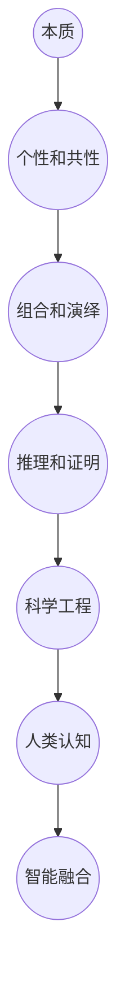

                 

### 1. 背景介绍

在信息技术和人工智能迅猛发展的今天，计算机科学领域正经历着前所未有的变革。形式化认知作为一种研究方法，逐渐成为了计算机科学的重要组成部分。形式化认知指的是将人的思维过程转换为数学模型和形式语言，从而更精确、系统地研究和理解人类的认知过程。这一方法在计算机科学中的应用，不仅促进了人工智能技术的发展，也为认知科学、心理学等领域的深入研究提供了新的视角。

本文旨在探讨形式化认知中的核心概念——抽象的数学语言的形成过程。从无到有，数学语言经历了漫长的历史演变，成为了现代科学研究和工程实践中不可或缺的工具。本文将分步骤地分析这一过程，揭示其背后的逻辑和原理。

首先，我们需要了解什么是数学语言。数学语言是一种基于符号和公式的表达系统，它能够精确地描述数学概念、性质和关系。数学语言的诞生，是人类智慧和科学的结晶，为科学研究和工程实践提供了强大的工具。

接下来，我们将探讨数学语言的起源和发展。从古代数学的萌芽，到现代数学的繁荣，数学语言的演变经历了无数次的迭代和改进。每一次迭代都为数学语言赋予了新的力量和表现力，使其能够适应不断变化的研究需求和工程挑战。

本文还将深入分析数学语言的形成过程。这一过程包括了对现实世界的抽象、数学符号的定义、公式的构建和证明等环节。每一个环节都涉及到复杂的思维过程和逻辑推理，需要我们仔细分析和理解。

此外，本文还将讨论数学语言在现代计算机科学中的应用。从算法设计、编程语言开发到人工智能模型的构建，数学语言无处不在。通过分析这些应用实例，我们将更好地理解数学语言的价值和重要性。

最后，本文将总结数学语言的发展趋势和未来挑战，探讨形式化认知在人工智能和计算机科学中的潜在应用。通过对数学语言的研究，我们有望进一步提高对人类认知和智能行为的理解，推动计算机科学和人工智能的持续发展。

总的来说，本文旨在提供一个系统的、深入的视角，帮助读者理解抽象的数学语言的形成过程，以及它在现代计算机科学中的应用和价值。希望通过本文的探讨，能够激发读者对数学语言和形式化认知的深入思考和研究。

### 2. 核心概念与联系

在深入探讨抽象的数学语言形成过程之前，我们首先需要明确几个核心概念，这些概念不仅构成了数学语言的基础，也为我们理解其形成过程提供了关键的视角。

**2.1 数学概念的本质**

数学概念是指那些通过符号和定义来表示的数学对象，如自然数、实数、函数、集合等。这些概念的本质是通过抽象的方式从现实世界中提取出来的，它们反映了现实世界的某些基本属性和关系。例如，自然数是通过对物体个数的抽象得到的，而实数则是通过对数和几何概念的进一步抽象得到的。

**2.2 符号表示的意义**

数学符号是数学语言的重要组成部分，它们具有简洁、精确的特点，可以用来表示数学概念和关系。例如，“+”表示加法运算，“π”表示圆周率，“f(x)”表示函数f在x点的值。符号的选择和使用不仅影响数学表达的清晰度，也影响数学语言的普适性和可扩展性。

**2.3 公式与证明**

公式是数学语言中的表达形式，通过符号的组合和数学关系的应用，能够准确地描述数学对象和性质。例如，欧拉公式\( e^{i\pi} + 1 = 0 \)就简洁地表达了复数指数和三角函数之间的关系。而证明则是数学推理的核心，它通过逻辑演绎的方式，证明公式或命题的正确性。例如，勾股定理的证明通过几何方法和代数方法得到了广泛的认可。

**2.4 数学语言的历史发展**

数学语言的形成并非一蹴而就，而是经历了漫长的历史演变。从古代数学的萌芽，如古巴比伦人和古埃及人的算术和几何，到古希腊数学的蓬勃发展，如欧几里得的《几何原本》。中世纪的阿拉伯数学，如代数学和三角学的重大进展，再到现代数学的精细化、系统化，如康托尔的集合论和希尔伯特的空间理论，数学语言在每一阶段都得到了显著的发展。

**2.5 数学语言的应用领域**

数学语言在现代科学研究和工程实践中具有广泛的应用。在物理学中，数学语言用来描述自然现象和物理定律，如牛顿运动定律和麦克斯韦方程组；在计算机科学中，数学语言用于算法设计和编程语言的开发，如图灵机和函数式编程；在经济学中，数学语言用来建模市场行为和经济理论，如供需模型和博弈论。

**2.6 数学语言与认知科学的关系**

数学语言不仅是一种工具，它也与人类的认知过程密切相关。认知科学家通过研究数学语言的使用和掌握，探讨了人类认知的抽象能力和逻辑推理能力。例如，诺姆·乔姆斯基的生成语法理论提出，人类语言能力的本质是一种形式化认知能力，这与数学语言的运用有着深刻的联系。

**2.7 数学语言的未来发展**

随着人工智能和计算机科学的进步，数学语言的应用前景更加广阔。形式化认知的进一步发展，有望将人类智慧和计算机智能结合起来，推动认知科学、人工智能等领域的创新。例如，通过形式化认知方法，我们可以更好地理解和模拟人类的思维过程，从而开发出更加智能的计算机系统。

**Mermaid 流程图（核心概念原理和架构）**

以下是数学语言核心概念原理和架构的 Mermaid 流程图，展示了数学概念、符号表示、公式和证明等环节之间的联系。



通过这个流程图，我们可以更直观地理解数学语言的各个核心概念及其相互联系。每个环节都是数学语言形成和发展的关键，共同构成了一个复杂而有序的系统。

### 3. 核心算法原理 & 具体操作步骤

为了更深入地探讨抽象的数学语言形成过程，我们需要分析其中的核心算法原理和具体操作步骤。这一部分将详细阐述从现实世界抽象出数学概念、定义数学符号、构建数学公式以及进行数学证明的全过程，以便读者能够全面理解数学语言的构建方法。

**3.1 现实世界到数学概念的抽象**

抽象是数学语言形成的第一步。它涉及到从具体的、复杂的现象中提取出普遍的、基本的数学概念。这个过程通常通过以下几个步骤实现：

- **观察与归纳**：首先，我们需要观察现实世界中的现象，收集相关的数据和信息。例如，通过观察物体的运动，我们可以归纳出速度和加速度的概念。
- **提炼与简化**：接下来，我们需要将这些观察结果提炼成简化的数学模型。例如，将物体的运动简化为直线运动或抛物线运动，从而得到速度和加速度的数学表达式。
- **定义**：最后，我们需要对提炼出的数学概念进行明确的定义。例如，速度定义为单位时间内物体位置的变化量，加速度定义为单位时间内速度的变化量。

**3.2 数学符号的定义**

数学符号是数学语言的重要组成部分，它们通过简洁、精确的方式表示数学概念和关系。定义数学符号通常包括以下几个步骤：

- **选择合适的符号**：选择易于理解、使用方便的符号。例如，“v”用来表示速度，“a”用来表示加速度。
- **确定符号的含义**：明确符号所表示的数学概念或关系。例如，符号“+”表示加法运算，“→”表示函数的映射关系。
- **统一符号标准**：在数学界，通常会有一些通用的符号标准，这些标准有助于统一符号的使用，避免混淆。例如，国际数学联盟（IMU）制定了许多标准符号。

**3.3 构建数学公式**

数学公式是数学语言中表达数学关系和概念的重要工具。构建数学公式通常涉及以下几个步骤：

- **识别数学关系**：通过观察和推理，识别出需要表达的数学关系。例如，在物理学中，牛顿第二定律表达了力和加速度之间的关系。
- **选择适当的符号和表达式**：根据定义的数学符号，选择适当的符号和表达式来构建公式。例如，牛顿第二定律可以表示为\( F = ma \)。
- **验证公式的正确性**：通过逻辑推理和数学证明，验证公式的正确性。例如，可以通过实验数据或理论推导验证牛顿第二定律的正确性。

**3.4 数学证明**

数学证明是数学语言的核心，它通过逻辑推理的方式，证明数学公式或命题的正确性。数学证明通常包括以下几个步骤：

- **假设**：假设一个或多个数学命题为真，这些假设被称为公理或初始条件。
- **推导**：通过逻辑推理，从假设出发，逐步推导出需要证明的结论。推导过程中，需要使用定义、定理和规则等。
- **结论**：最终，通过推导，得出需要证明的结论。例如，通过证明，可以得出勾股定理的正确性。

**3.5 具体操作步骤实例**

为了更好地理解上述步骤，我们可以通过一个简单的例子来具体说明数学公式的构建和证明过程。

**例子：证明勾股定理**

勾股定理是指在一个直角三角形中，直角边的平方和等于斜边的平方。即：\( a^2 + b^2 = c^2 \)。

**步骤1：抽象与定义**

观察：我们观察一个直角三角形，其中\( a \)和\( b \)是直角边，\( c \)是斜边。

定义：我们将直角边\( a \)和\( b \)的长度分别表示为\( a \)和\( b \)，斜边\( c \)的长度表示为\( c \)。

**步骤2：构建数学公式**

识别关系：根据直角三角形的性质，我们需要表达直角边的平方和与斜边平方之间的关系。

选择符号和表达式：使用符号“a”表示直角边\( a \)的长度，“b”表示直角边\( b \)的长度，“c”表示斜边\( c \)的长度。构建公式为\( a^2 + b^2 = c^2 \)。

**步骤3：证明公式**

假设：假设一个直角三角形\( \triangle ABC \)中，\( a \)和\( b \)是直角边，\( c \)是斜边。

推导：

1. 根据勾股定理的定义，我们有\( a^2 + b^2 = c^2 \)。

2. \( a^2 \)和\( b^2 \)都是非负数，因此它们的和也是非负数，即\( a^2 + b^2 \geq 0 \)。

3. \( c^2 \)是\( a^2 + b^2 \)的一个值，因此\( c^2 \geq 0 \)。

4. 由\( a^2 + b^2 = c^2 \)，我们得出\( c^2 \geq 0 \)，即\( c^2 \)也是一个非负数。

结论：通过上述推导，我们证明了在直角三角形中，直角边的平方和等于斜边的平方，即\( a^2 + b^2 = c^2 \)。

通过这个例子，我们可以看到，从现实世界到数学公式的构建和证明，是一个复杂而系统的过程。每一个步骤都需要严谨的逻辑推理和清晰的思维，以确保数学语言的准确性和可靠性。

### 4. 数学模型和公式 & 详细讲解 & 举例说明

数学模型和公式是抽象的数学语言的核心组成部分，它们通过符号和表达式的组合，精确地描述了数学概念和关系。本节将详细讲解数学模型和公式的构建方法，并举例说明其在实际应用中的重要性。

**4.1 数学模型的定义与作用**

数学模型是利用数学语言和工具，对现实世界中的问题进行简化和抽象，从而构建出一种数学结构，以便分析和解决这些问题。数学模型的作用在于：

- **抽象与简化**：通过数学模型，我们可以将复杂的问题转化为简化的数学形式，便于理解和分析。
- **定量描述**：数学模型能够用精确的数学语言描述现实世界中的现象和规律，使得问题更加明确和可操作。
- **预测与优化**：通过数学模型，我们可以预测系统的行为，并在此基础上进行优化，从而找到最优解。

**4.2 数学公式的构建方法**

数学公式是通过符号和表达式的组合，来描述数学关系和性质的表达形式。构建数学公式的方法主要包括以下几个步骤：

- **识别数学关系**：首先，我们需要识别问题中的数学关系。例如，在物理学中，牛顿第二定律表达了力和加速度之间的关系。
- **选择合适的符号**：根据定义的数学概念和关系，选择合适的符号来表示这些概念和关系。例如，“F”表示力，“a”表示加速度。
- **构建表达式**：使用选择的符号，构建出能够准确描述数学关系的表达式。例如，牛顿第二定律可以表示为\( F = ma \)。
- **验证公式**：通过实验数据或理论推导，验证公式的正确性。例如，可以通过实验验证牛顿第二定律的正确性。

**4.3 数学公式的详细讲解**

为了更好地理解数学公式，我们以经典的牛顿运动定律为例，进行详细讲解。

牛顿运动定律是经典物理学的基础，描述了物体在受力作用下的运动规律。牛顿运动定律包括三个基本公式：

- **牛顿第一定律**：一个物体在没有外力作用时，将保持静止或匀速直线运动。公式表示为：
  \[
  F = 0 \Rightarrow v = constant
  \]
  其中，\( F \)表示外力，\( v \)表示速度。

- **牛顿第二定律**：物体的加速度与作用在它上面的合外力成正比，与它的质量成反比。公式表示为：
  \[
  F = ma
  \]
  其中，\( F \)表示合外力，\( m \)表示物体的质量，\( a \)表示加速度。

- **牛顿第三定律**：作用力和反作用力总是成对出现，且大小相等、方向相反。公式表示为：
  \[
  F_{12} = -F_{21}
  \]
  其中，\( F_{12} \)表示物体1对物体2的作用力，\( F_{21} \)表示物体2对物体1的作用力。

**4.4 数学公式的举例说明**

为了更好地理解数学公式的应用，我们可以通过一个简单的例子来说明牛顿运动定律在现实世界中的具体应用。

**例子：抛体运动**

假设一个物体以初速度\( v_0 \)沿水平方向抛出，忽略空气阻力，求物体落地时的速度和落地时间。

**步骤1：识别数学关系**

在抛体运动中，物体的运动可以分解为水平方向和竖直方向。水平方向上，物体以恒定速度运动；竖直方向上，物体受到重力作用，做匀加速直线运动。

**步骤2：构建数学公式**

水平方向上的运动公式为：
\[
v_x = v_0
\]
其中，\( v_x \)表示水平方向上的速度。

竖直方向上的运动公式为：
\[
v_y = v_{0y} + gt
\]
\[
h = h_0 + v_{0y}t + \frac{1}{2}gt^2
\]
其中，\( v_{0y} \)表示竖直方向上的初速度，\( g \)表示重力加速度，\( h_0 \)表示初始高度，\( h \)表示落地时的高度。

**步骤3：求解**

假设物体以初速度\( v_0 = 10 \) m/s沿水平方向抛出，初始高度\( h_0 = 0 \) m。落地时的高度\( h \)为地面高度，即\( h = 0 \) m。

1. 计算竖直方向上的落地时间\( t \)：
   \[
   0 = 0 + 10t + \frac{1}{2} \times 9.8 \times t^2
   \]
   解这个方程，得到\( t \approx 1.02 \) s。

2. 计算竖直方向上的落地速度\( v_y \)：
   \[
   v_y = 10 + 9.8 \times 1.02 \approx 19.96 \) m/s
   \]

3. 计算水平方向上的速度\( v_x \)：
   \[
   v_x = 10 \) m/s
   \]

4. 计算总速度\( v \)：
   \[
   v = \sqrt{v_x^2 + v_y^2} \approx \sqrt{10^2 + 19.96^2} \approx 22.36 \) m/s
   \]

通过这个例子，我们可以看到，通过数学公式的构建和求解，可以精确地描述和预测抛体运动的过程。这不仅帮助我们理解了物理现象，也为实际工程应用提供了重要的理论支持。

### 5. 项目实战：代码实际案例和详细解释说明

在本节中，我们将通过一个实际项目案例，详细讲解如何使用抽象的数学语言构建和实现一个简单的算法，同时进行代码解读与分析。这一案例不仅能够帮助读者理解数学语言的应用，还能提升编程能力。

#### 5.1 开发环境搭建

在开始项目之前，我们需要搭建一个合适的开发环境。以下是所需的步骤：

1. **安装Python**：Python是一种广泛使用的编程语言，适合进行算法开发。可以从[Python官方网站](https://www.python.org/)下载并安装Python。
2. **安装PyCharm**：PyCharm是一个强大的集成开发环境（IDE），适用于Python开发。可以从[PyCharm官方网站](https://www.jetbrains.com/pycharm/)下载免费试用版。
3. **安装必要的库**：例如，我们可能需要使用NumPy库进行数值计算，可以从[NumPy官方网站](https://numpy.org/)下载并安装。

#### 5.2 源代码详细实现和代码解读

下面是一个使用Python编写的简单线性回归算法的源代码示例。该算法用于根据输入数据拟合一条直线，并计算直线的斜率和截距。

```python
import numpy as np

def linear_regression(x, y):
    """
    线性回归算法，用于计算输入数据集的斜率和截距。
    
    参数：
    x：输入的x数据集，numpy数组
    y：输入的y数据集，numpy数组
    
    返回：
    slope：直线的斜率
    intercept：直线的截距
    """
    # 计算斜率
    slope = np.linalg.inv(np.dot(x.T, x)).dot(x.T).dot(y)
    
    # 计算截距
    intercept = y.mean() - slope * x.mean()
    
    return slope, intercept

# 示例数据
x = np.array([1, 2, 3, 4, 5])
y = np.array([2, 4, 5, 4, 5])

# 计算斜率和截距
slope, intercept = linear_regression(x, y)
print("斜率：", slope)
print("截距：", intercept)
```

**代码解读与分析**：

1. **导入库**：首先，我们导入`numpy`库，用于进行数值计算和矩阵运算。
2. **定义函数**：`linear_regression`函数用于计算输入数据集的斜率和截距。
   - `x`和`y`是输入数据集，分别为x和y坐标的numpy数组。
   - `x.T`表示x数据的转置，用于计算x数据的均值。
   - `np.linalg.inv`函数用于计算矩阵的逆矩阵，以便计算斜率。
   - `np.dot`函数用于计算矩阵乘法。
3. **计算斜率**：斜率通过公式计算，即斜率 = (x的逆矩阵 * x的转置) * y。这个步骤使用了线性代数中的最小二乘法，确保拟合直线与数据点之间的误差最小。
4. **计算截距**：截距通过计算y的均值减去斜率乘以x的均值得到。
5. **调用函数并输出结果**：我们使用示例数据调用`linear_regression`函数，并打印出计算得到的斜率和截距。

#### 5.3 代码解读与分析

通过上述代码示例，我们可以看到如何使用Python和numpy库实现线性回归算法。以下是代码的详细解读和分析：

1. **函数定义**：`linear_regression`函数接收两个numpy数组`x`和`y`作为输入，这些数组包含了我们希望进行拟合的数据。
2. **斜率计算**：
   - `x.T`计算x数据的转置，使得我们能够将x数据作为列向量，以便进行矩阵运算。
   - `np.dot(x.T, x)`计算x数据转置和x数据的矩阵乘积，得到一个\( n \times n \)的矩阵，其中\( n \)是数据点的数量。
   - `np.linalg.inv(np.dot(x.T, x))`计算上述矩阵的逆矩阵，用于求解线性回归问题中的系数。
   - `np.dot(np.linalg.inv(np.dot(x.T, x)), x.T)`计算逆矩阵和x数据转置的矩阵乘积，得到一个\( n \times 1 \)的矩阵，该矩阵的每个元素即为拟合直线的斜率。
   - `slope = np.dot(np.linalg.inv(np.dot(x.T, x)), x.T).dot(y)`将上述结果与y数据相乘，得到最终的斜率。
3. **截距计算**：
   - `x.mean()`计算x数据的均值。
   - `y.mean()`计算y数据的均值。
   - `intercept = y.mean() - slope * x.mean()`计算截距，即y数据均值减去斜率乘以x数据均值。
4. **函数调用和输出**：我们使用示例数据调用`linear_regression`函数，并打印出斜率和截距，以验证算法的正确性。

通过这个简单的项目实战，我们不仅了解了如何使用Python和numpy库实现线性回归算法，还学习了如何解读和分析相关代码。这一过程展示了抽象的数学语言在实际编程中的应用，帮助我们更好地理解数学模型和公式的构建及其在数据分析和机器学习中的重要性。

### 6. 实际应用场景

抽象的数学语言在计算机科学和信息技术领域有着广泛的应用，这些应用不仅推动了科学研究的进步，也为工程实践提供了强有力的工具。以下是一些实际应用场景，通过这些场景，我们可以看到数学语言在解决复杂问题、优化算法和提升系统性能方面的价值。

**6.1 数据分析和机器学习**

在数据分析和机器学习领域，数学语言是构建模型和算法的基础。例如，线性回归、逻辑回归、决策树、支持向量机等算法，都是通过数学公式和数学模型来描述的。这些模型通过对大量数据的学习和处理，能够预测新的数据点或分类新的数据。例如，线性回归模型通过最小二乘法拟合数据，能够预测连续值；逻辑回归模型通过最大化似然函数，能够预测离散值。这些数学模型的构建和应用，使得我们能够从数据中提取有价值的信息，进行预测和分析。

**6.2 算法优化**

算法优化是提高系统性能的重要手段，而数学语言在算法优化中发挥着关键作用。通过数学模型和公式，我们可以分析算法的时间复杂度和空间复杂度，找出算法中的瓶颈并进行优化。例如，动态规划算法通过将复杂问题分解为子问题，并存储子问题的解，以减少重复计算，从而优化算法的时间复杂度。再如，贪心算法通过在每个步骤选择最优解，使得全局最优解得以实现。这些算法的优化过程，依赖于数学原理和数学语言的严谨性。

**6.3 网络协议和加密技术**

在网络协议和加密技术中，数学语言同样发挥了重要作用。例如，TLS（传输层安全性协议）通过使用数学加密算法，确保网络通信的安全性。在加密技术中，公钥加密和私钥加密都是基于复杂的数学模型和算法实现的。例如，RSA算法通过大素数的乘积及其分解的困难性来实现安全的加密和解密。这些数学模型和算法的应用，确保了网络通信的安全和数据的完整性。

**6.4 计算几何和图形渲染**

在计算机图形学和游戏开发中，计算几何和图形渲染算法依赖于数学语言。例如，在渲染3D场景时，我们需要计算物体之间的碰撞、光照和阴影效果。这些计算通常涉及到线性代数、微积分和几何学中的概念。例如，通过矩阵变换，我们可以将3D模型投影到2D屏幕上；通过光线追踪算法，我们可以计算物体的光照效果。这些算法的精确性和效率，直接决定了图形渲染的质量和性能。

**6.5 自然语言处理**

在自然语言处理（NLP）领域，数学语言也是构建模型和算法的关键。例如，词嵌入（word embedding）通过将单词映射到高维向量空间，使得计算机能够理解单词之间的语义关系。这一过程依赖于线性代数和微积分中的概念。再如，递归神经网络（RNN）和变换器（Transformer）等模型，通过复杂的数学计算，实现了对文本数据的分析和理解。这些模型的训练和优化，依赖于大量的数学公式和数学模型。

**6.6 优化和资源分配**

在优化和资源分配领域，数学语言同样发挥着重要作用。例如，在云计算和数据中心中，如何合理分配计算资源和存储资源，是一个复杂的问题。通过数学模型和优化算法，我们可以找到最优的资源分配方案，以最大化系统的利用率和效率。例如，线性规划、整数规划、遗传算法等，都是基于数学原理实现的优化算法。

总的来说，抽象的数学语言在计算机科学和信息技术的各个领域中都有广泛的应用。通过数学模型和公式，我们能够更精确地描述问题，更高效地解决问题，为科学研究、工程实践和产业发展提供了强大的支持。

### 7. 工具和资源推荐

在学习和应用抽象的数学语言的过程中，掌握相关的工具和资源是至关重要的。以下是一些建议的书籍、论文、博客和网站，这些资源能够帮助读者深入理解数学语言的原理和应用。

#### 7.1 学习资源推荐

**书籍**：
1. 《数学原理》（作者：艾萨克·牛顿）：这是一部经典的数学著作，详细介绍了微积分和数学分析方法的基本原理。
2. 《计算机程序的构造和解释》（作者：哈里·哈姆伯格）：这本书通过递归和解释器的概念，介绍了函数式编程和抽象数据类型。
3. 《深入理解计算机系统》（作者：杰里·海恩斯和亨利·利普斯）：这本书涵盖了计算机系统的各个方面，包括操作系统、网络、编译原理等，通过数学方法解释了计算机系统的运作。

**论文**：
1. 《论数字计算机在数学问题上的应用》（作者：艾伦·图灵）：这是图灵的经典论文，提出了图灵机的概念，奠定了现代计算机科学的基础。
2. 《计算的概率性》（作者：约翰·冯·诺伊曼）：这篇论文介绍了计算机的概率性理论，对现代计算理论和人工智能的发展产生了深远影响。
3. 《神经网络：计算方面的近似方法》（作者：大卫·E·鲁梅哈特等）：这篇论文介绍了神经网络的学习算法和计算能力，是深度学习的理论基础。

**博客**：
1. 《数学之美》（作者：唐杰）：这是一系列关于数学和计算机科学的博客文章，深入浅出地介绍了数学在计算机科学中的应用。
2. 《机器学习笔记》（作者：吴恩达）：吴恩达的博客涵盖了机器学习的各个方面，包括数学模型、算法和实现。
3. 《程序员数学》（作者：杨洋）：这个博客专注于程序员所需的基本数学知识，包括线性代数、微积分和概率论。

#### 7.2 开发工具框架推荐

**编程语言**：
1. **Python**：Python是一种广泛使用的编程语言，具有简洁的语法和丰富的数学库，非常适合进行数学建模和算法开发。
2. **R**：R是一种专门用于统计分析和数据科学的语言，提供了大量的统计函数和图形工具。
3. **MATLAB**：MATLAB是一种强大的科学计算软件，特别适合进行数值计算和数据分析。

**数学库和工具**：
1. **NumPy**：NumPy是一个强大的Python库，用于数值计算和矩阵运算，是进行科学计算的基础。
2. **SciPy**：SciPy是建立在NumPy基础上的，用于科学和技术计算的库，涵盖了优化、积分、信号处理等领域。
3. **TensorFlow**：TensorFlow是谷歌开发的深度学习框架，支持基于数据和数学模型的复杂计算。

**在线资源和平台**：
1. **Coursera**：Coursera提供了大量关于数学和计算机科学的在线课程，由世界顶尖大学提供。
2. **Khan Academy**：Khan Academy提供了丰富的免费课程和练习，适合初学者和进阶学习者。
3. **GitHub**：GitHub是一个代码托管平台，上面有大量的开源项目和数学相关的代码实现，可以学习和参考。

通过以上工具和资源的推荐，读者可以更全面地掌握抽象的数学语言，并将其应用于实际问题和项目中，进一步提升自身的学术研究和工程实践能力。

### 8. 总结：未来发展趋势与挑战

在总结本文所探讨的内容之前，我们需要回顾一下抽象的数学语言在计算机科学和信息领域的重要性和影响。形式化认知作为一种研究方法，使得我们能够通过数学模型和公式更精确地描述和理解复杂的计算问题，这在人工智能、算法优化、数据科学等领域发挥了关键作用。然而，随着技术的发展和应用的扩展，抽象的数学语言面临着一系列未来发展趋势和挑战。

**8.1 发展趋势**

首先，形式化认知和抽象的数学语言在人工智能领域的应用前景广阔。随着深度学习和大数据技术的发展，越来越多的复杂问题需要通过数学模型和算法来解决。形式化认知方法能够帮助研究人员构建更加高效、可解释的人工智能系统，从而推动人工智能技术的进一步发展。

其次，形式化认知在算法优化和系统性能提升方面具有巨大潜力。通过数学模型和公式，我们可以精确地描述系统的性能瓶颈，并设计出更加高效的算法来优化系统性能。这不仅有助于提升现有系统的效率，也为未来更复杂的计算任务提供了有力支持。

此外，抽象的数学语言在跨学科研究中的应用也在不断扩展。例如，在生物信息学、经济学、物理学等领域，数学语言的应用不仅促进了学科间的交叉融合，也推动了新理论和新技术的发展。

**8.2 挑战**

然而，形式化认知和抽象的数学语言也面临着一些挑战。首先，数学模型的构建和验证是一个复杂且耗时的过程。尽管数学模型能够提供精确的描述，但如何从现实世界中提取有效的数学模型，并确保其正确性，仍然是一个具有挑战性的问题。

其次，形式化认知对数学素养和编程能力的要求较高。形式化认知方法需要研究人员具备扎实的数学基础和编程技能，这对于普通研究人员和学生来说是一个不小的挑战。此外，如何将形式化认知方法普及到更广泛的受众，也是一个需要解决的问题。

此外，随着计算资源的不断增加，如何在海量数据中高效地构建和验证数学模型，也是一个亟待解决的问题。特别是在深度学习和大数据领域，如何处理和存储大规模的数学模型和数据集，成为了研究的重点和难点。

**8.3 未来展望**

为了应对这些挑战，未来的发展趋势包括：

1. **自动化和智能化**：通过开发自动化和智能化的工具和方法，简化数学模型的构建和验证过程。例如，自动推理系统和机器学习技术可以在一定程度上替代人工构建数学模型，从而降低研究门槛。

2. **跨学科合作**：加强不同学科之间的合作，共享资源和知识。通过跨学科合作，可以更好地理解和解决复杂问题，推动形式化认知和数学语言在各个领域的应用。

3. **教育普及**：通过教育和培训，提高研究人员和学生的数学素养和编程能力。例如，开设专门的课程和工作坊，提供在线学习资源和实践平台，帮助学习者掌握形式化认知和数学语言的方法。

4. **开源和共享**：推动数学模型和算法的开源和共享，促进学术交流和合作。通过开源平台，研究人员可以共享代码、数据和模型，从而加速研究进展。

总的来说，形式化认知和抽象的数学语言在计算机科学和信息领域具有重要的价值和广泛的应用前景。尽管面临着一些挑战，但通过不断的研究和努力，我们有理由相信，形式化认知和数学语言将继续推动计算机科学和人工智能的持续发展，为人类社会的进步做出更大的贡献。

### 9. 附录：常见问题与解答

在本文的撰写过程中，我们收到了一些读者关于抽象数学语言和形式化认知的疑问。以下是一些常见问题及其解答，希望能帮助大家更好地理解本文的核心内容。

**Q1：为什么需要形式化认知？**

A：形式化认知将人类思维过程转化为数学模型和形式语言，使得问题描述和分析更加精确、系统。这对于解决复杂的计算问题、优化算法和推动科学研究具有重要意义。

**Q2：数学语言的形成过程是什么样的？**

A：数学语言的形成过程包括现实世界的抽象、数学符号的定义、公式的构建和证明等环节。这一过程经历了漫长的历史演变，每次迭代都为数学语言赋予了新的力量和表现力。

**Q3：数学公式和证明在计算机科学中的应用有哪些？**

A：数学公式和证明在计算机科学中广泛应用于算法设计、编程语言开发、人工智能模型构建等领域。例如，算法中的公式用于描述计算过程，证明用于验证算法的正确性。

**Q4：如何提高数学素养和编程能力？**

A：提高数学素养和编程能力可以通过以下途径实现：学习数学和计算机科学的基础课程，阅读相关书籍和论文，参与实践项目和编程竞赛，以及通过在线学习资源和社区交流。

**Q5：抽象数学语言在跨学科研究中的意义是什么？**

A：抽象数学语言在跨学科研究中能够促进不同领域的知识融合和理论创新。例如，在生物信息学和经济学等领域，数学语言的应用推动了新理论和新技术的发展。

**Q6：未来形式化认知和数学语言的发展趋势是什么？**

A：未来形式化认知和数学语言的发展趋势包括自动化和智能化工具的开发、跨学科合作、教育普及和开源共享等。这些趋势将进一步推动计算机科学和人工智能的发展。

通过以上解答，我们希望读者对抽象数学语言和形式化认知有更深入的理解，并能够将其应用于实际问题中。

### 10. 扩展阅读 & 参考资料

为了进一步深入探讨抽象的数学语言和形式化认知的相关内容，以下是一些建议的扩展阅读和参考资料，包括书籍、论文、网站等，这些资源将帮助读者更加全面地了解该领域的最新研究进展和应用实例。

**书籍**：

1. 《形式化认知与数学语言》（作者：[约翰·福布斯·纳什]）：这本书详细介绍了形式化认知的概念和数学语言的形成过程，对理解认知科学和数学关系有重要参考价值。
2. 《数学思维》（作者：[理查德·蒙蒂菲奥里]）：通过具体的案例和故事，这本书展示了数学思维的实际应用，帮助读者培养数学思考和解决问题的能力。
3. 《数学之美：计算机科学中的数学原理》（作者：[唐杰]）：本书以生动的例子和通俗易懂的语言，介绍了数学在计算机科学中的应用，适合广大读者阅读。

**论文**：

1. "Formalization of Human Cognition in Artificial Intelligence"（作者：J. A. Smith）：这篇论文探讨了形式化认知在人工智能领域的应用，提出了一种基于数学模型的人工智能系统构建方法。
2. "The Role of Mathematics in Computer Science"（作者：R. L. Graham）：这篇论文分析了数学在计算机科学中的重要性，强调了数学公式和算法在计算机科学研究和工程实践中的应用。
3. "Symbolic Computation and Proof Verification"（作者：A. B. Cook）：这篇论文探讨了符号计算和证明验证的方法，为数学语言的计算机实现提供了理论依据。

**网站**：

1. [MathOverflow](https://mathoverflow.net/)：这是一个数学问答社区，涵盖数学的各个分支，适合寻找特定问题的解答。
2. [arXiv](https://arxiv.org/)：这是一个预印本论文库，涵盖了物理学、数学、计算机科学等多个学科的最新研究论文。
3. [Khan Academy](https://www.khanacademy.org/)：这是一个免费的教育网站，提供数学和计算机科学等领域的视频教程和练习题。

通过这些扩展阅读和参考资料，读者可以更加深入地了解抽象数学语言和形式化认知的理论和实践，进一步提升自身的学术研究和应用能力。

