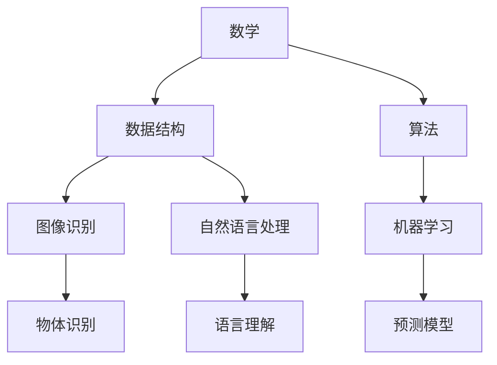
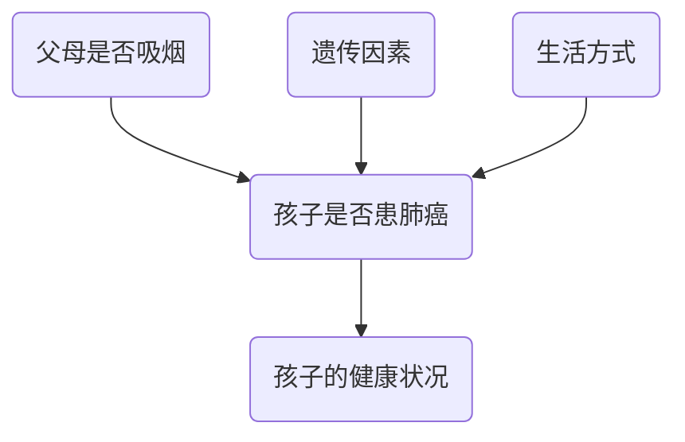
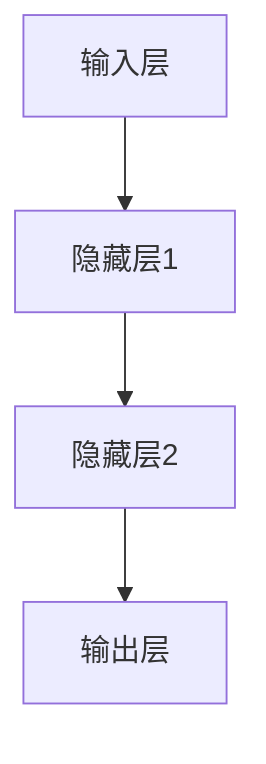
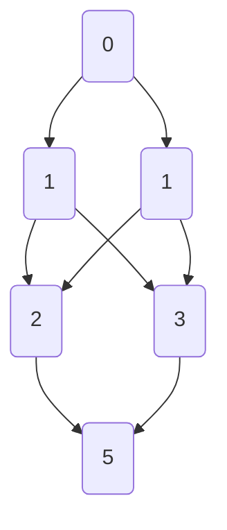
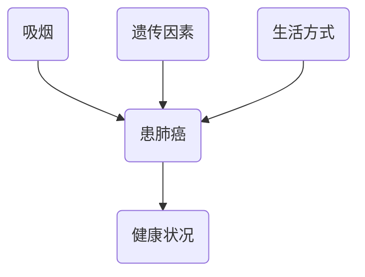

                 

# 认知的形式化：数学产生结构和数据

## 关键词
- 认知形式化
- 数学结构
- 数据产生
- 算法原理
- 项目实战

## 摘要

本文旨在探讨认知的形式化过程，尤其是数学如何产生结构和数据。通过一步步的逻辑推理，我们揭示了数学的内在原理和其与计算机科学的紧密联系。文章首先介绍背景，然后深入剖析核心概念和原理，使用Mermaid流程图展示架构，接着详细讲解核心算法原理和具体操作步骤。文章还通过数学模型和公式进行详细讲解，并举例说明。最后，文章通过实际项目实战，展示了代码实现和详细解释，并分析了实际应用场景。此外，还推荐了学习资源和开发工具，并对未来发展趋势与挑战进行了总结。本文旨在为读者提供一个全面而深入的理解，帮助其掌握认知形式化的精髓。

## 1. 背景介绍

在当今科技飞速发展的时代，认知科学和计算机科学逐渐成为两个不可或缺的领域。认知科学致力于研究人类思维的过程，而计算机科学则关注如何通过编程和算法模拟这些思维过程。认知的形式化作为这两个领域的交叉点，旨在将人类的认知过程转化为可计算和可模拟的数学模型，从而为人工智能的发展提供坚实的基础。

数学作为一种高度抽象的语言，是认知形式化的核心工具。从最基础的算术运算到复杂的代数、几何、微积分等，数学提供了精确的描述和解决问题的方法。通过数学，我们能够将现实世界中的复杂现象简化为可以处理的形式，从而更好地理解和分析。

在计算机科学中，数据结构和算法是解决问题的两个关键要素。数据结构定义了数据的组织方式，而算法则描述了处理数据的步骤和方法。通过数学模型，我们可以对数据结构进行形式化描述，从而更好地理解和分析其性能和效率。算法则通过数学原理指导，能够高效地处理各种复杂问题。

认知的形式化不仅仅是一个理论概念，它在现实世界中有着广泛的应用。例如，在图像识别、自然语言处理、游戏人工智能等领域，认知的形式化方法被广泛应用于模型构建和算法设计。通过数学模型，我们可以将复杂的认知过程转化为计算机可以处理的形式，从而实现自动化和智能化的目标。

总的来说，认知的形式化是数学、计算机科学和认知科学的交汇点，它为人工智能的发展提供了强有力的理论支持和实践指导。在接下来的部分中，我们将深入探讨数学如何产生结构和数据，以及这些概念在计算机科学中的应用。

## 2. 核心概念与联系

在深入探讨认知的形式化之前，我们需要理解一些核心概念，并展示它们之间的联系。这些核心概念包括数学、数据结构、算法以及它们在计算机科学中的应用。

### 数学

数学是认知形式化的基础，它提供了一种精确和形式化的语言来描述现实世界的现象。从基本的算术运算到复杂的代数、几何和微积分，数学为各种问题提供了精确的描述和解决方案。

#### 核心概念
1. **算术**：研究数的基本性质和运算。
2. **代数**：研究符号和方程的解法。
3. **几何**：研究空间的形状、大小和位置。
4. **微积分**：研究函数的变化率和积分。

#### 数学原理

数学的原理和结构是认知形式化的关键。例如，微积分中的导数和积分可以用于描述变化率和累积量，这在计算机科学中的优化算法中有着广泛的应用。此外，集合论和图论等数学分支也在算法设计中发挥着重要作用。

### 数据结构

数据结构是计算机科学中用于存储、组织和管理数据的方式。数据结构的选择直接影响算法的性能和效率。

#### 核心概念
1. **数组**：固定大小的元素集合。
2. **链表**：动态大小的节点集合，每个节点包含数据和指向下一个节点的指针。
3. **栈**：后进先出的数据结构。
4. **队列**：先进先出的数据结构。
5. **树**：具有层级关系的数据结构，常用于表示组织和分类。
6. **图**：节点和边的集合，用于表示网络和关系。

#### 数据结构原理

不同的数据结构有其独特的原理和优势。例如，数组提供快速的随机访问，而链表则提供灵活的动态大小。树和图则用于表示复杂的层级和关系。

### 算法

算法是解决问题的步骤和方法，它通过数学原理和数据结构来指导计算机如何处理数据。

#### 核心概念
1. **排序算法**：用于将数据按特定顺序排列。
2. **查找算法**：用于在数据中查找特定元素。
3. **图算法**：用于解决图相关的问题，如最短路径和最小生成树。

#### 算法原理

算法的原理通常基于数学模型。例如，快速排序算法利用分治策略，而最短路径算法则利用图论中的原理。算法的选择和优化直接影响问题的解决效率和性能。

### 计算机科学应用

在计算机科学中，数学、数据结构和算法共同作用，解决各种实际问题。

#### 应用案例
1. **图像识别**：通过数学模型处理图像数据，实现物体和面部识别。
2. **自然语言处理**：使用图论和代数方法分析文本数据，实现语言理解和生成。
3. **机器学习**：通过算法和数学模型，从数据中学习模式和规律，实现预测和分类。

### Mermaid 流程图

为了更清晰地展示这些核心概念之间的联系，我们使用Mermaid流程图来表示：



在这个流程图中，数学作为基础，通过数据结构和算法应用于各个计算机科学领域，解决实际问题。

通过理解这些核心概念和它们之间的联系，我们可以更好地掌握认知的形式化方法，为人工智能和计算机科学的发展打下坚实的基础。在接下来的部分中，我们将深入探讨数学如何产生结构和数据，以及这些概念在实际应用中的具体实现。

### 2.1. 数学如何产生结构

数学作为认知形式化的核心工具，其产生结构和数据的过程值得深入探讨。数学不仅为数据结构提供了理论基础，还通过其精确和抽象的描述方式，帮助我们理解和处理复杂问题。

#### 数学在数据结构中的作用

1. **集合论**：集合论是数学的基础，它为数据结构提供了抽象的描述方法。通过集合，我们可以定义数据的基本元素和操作，如并集、交集和补集。这些操作不仅用于数据结构的设计，还用于算法的分析和优化。
   
2. **图论**：图论是研究图形和网络的数学分支，它在数据结构中有着广泛的应用。图可以用来表示网络结构，如社交网络、通信网络和交通网络。图论中的概念，如路径、连通性和最短路径，为网络优化和路径规划提供了理论基础。

3. **代数结构**：代数结构包括群、环和域等概念，这些结构用于描述和分类数据结构。例如，树和图可以被视为特殊的代数结构，这有助于我们更好地理解和分析这些数据结构。

#### 数学公式与结构

1. **线性代数**：线性代数用于处理多维数据，它在图像处理、机器学习和计算机图形学等领域有着重要应用。线性代数的核心概念，如矩阵、向量、行列式和特征值，为数据结构提供了强大的描述工具。

2. **微积分**：微积分用于描述变化率和累积量，这在算法分析和优化中非常重要。例如，导数可以用于优化算法的收敛速度，而积分可以用于计算数据的累积效果。

3. **概率论**：概率论用于处理不确定性和随机性，这在机器学习和数据挖掘中至关重要。概率分布和统计模型为我们提供了处理随机数据的工具，这有助于我们更好地理解和预测数据的行为。

#### 数学如何产生结构

数学产生结构的过程通常包括以下几个步骤：

1. **抽象化**：将现实世界的问题抽象为数学模型。这一步通常涉及简化、理想化和符号化，以便更准确地描述问题。
   
2. **符号化**：使用数学符号和公式来表示问题。这有助于将复杂问题简化为更易处理的形式。

3. **形式化**：通过定义规则和操作，将数学模型转化为形式化的系统。形式化使得我们可以用严格的逻辑方法来分析问题。

4. **推理**：使用数学原理和定理，对形式化的模型进行推理和证明。这一步有助于我们理解和验证模型的正确性和有效性。

通过这些步骤，数学不仅产生了结构，还为我们提供了分析和解决问题的工具。在接下来的部分中，我们将进一步探讨数学如何产生数据，以及这些数据在计算机科学中的应用。

### 2.2. 数学如何产生数据

数学不仅在产生结构方面发挥着重要作用，还在生成和处理数据方面有着独特的贡献。通过一系列数学操作，我们可以从原始数据中提取有价值的信息，从而推动计算机科学的发展。

#### 数学操作与数据生成

1. **变换**：通过变换操作，我们可以将一种数据形式转换为另一种形式。例如，图像变换、信号变换和数据压缩等，都是通过数学操作实现的。变换不仅有助于数据的处理，还可以提高数据的可用性和可理解性。

2. **采样**：在信号处理和数据分析中，采样是获取数据的关键步骤。通过采样，我们可以从连续信号中提取离散的数据点。采样定理和采样率的选择是确保数据质量和有效性的关键。

3. **拟合**：通过拟合操作，我们可以将数据拟合到特定的数学模型中。例如，最小二乘法、线性回归和神经网络等，都是通过拟合操作来处理数据。拟合不仅有助于数据的分析和解释，还可以用于预测和建模。

4. **统计**：统计操作用于对数据进行描述和分析。常见的统计操作包括均值、方差、协方差和相关性等。通过统计操作，我们可以了解数据的分布和性质，从而做出更准确的推断和决策。

#### 数学在数据生成中的应用

1. **机器学习**：在机器学习中，数据是模型训练的基础。通过数学模型，我们可以从大量数据中学习模式和规律，从而实现预测和分类。常见的数学模型包括线性模型、决策树、神经网络等。

2. **图像处理**：在图像处理中，数学操作被广泛应用于图像的获取、处理和分析。例如，图像变换、边缘检测、特征提取等，都是通过数学操作实现的。

3. **自然语言处理**：在自然语言处理中，数学模型用于处理文本数据，实现语言理解和生成。例如，词向量模型、序列模型和生成对抗网络等，都是通过数学操作实现的。

#### 数学公式与数据生成

1. **微积分**：微积分在数据生成中的应用非常广泛。例如，通过导数，我们可以获取数据的瞬时变化率，从而实现数据的平滑和优化。通过积分，我们可以获取数据的累积效果，从而实现数据的累积和累积预测。

2. **概率论**：概率论在数据生成中的应用也非常重要。例如，通过概率分布，我们可以模拟和生成随机数据。通过统计模型，我们可以对数据进行拟合和预测。

3. **线性代数**：线性代数在数据生成中的应用包括矩阵运算、特征值和特征向量分析等。这些操作可以用于数据的高维表示和降维，从而提高数据的处理效率和可理解性。

通过上述数学操作和模型，我们可以从原始数据中提取有价值的信息，从而推动计算机科学的发展。在接下来的部分中，我们将进一步探讨数学在计算机科学中的应用，以及这些应用如何影响人工智能的发展。

### 3. 核心算法原理 & 具体操作步骤

在了解数学如何产生结构和数据后，我们接下来探讨核心算法的原理和具体操作步骤。这些算法不仅基于数学原理，还通过一系列具体的操作，实现复杂问题的求解。

#### 概率图模型

概率图模型是用于表示和推理不确定性数据的有力工具。常见的概率图模型包括贝叶斯网络和马尔可夫网络。以下是一个简单的贝叶斯网络示例：



**操作步骤：**

1. **定义变量**：首先定义网络中的变量，并确定它们之间的依赖关系。
2. **参数估计**：通过样本数据估计每个变量的概率分布和条件概率。
3. **推理**：使用推理算法，如变量消除和信念传播，计算变量的后验概率。

#### 神经网络

神经网络是模拟生物神经网络的一种计算模型，广泛应用于图像识别、自然语言处理和游戏人工智能等领域。以下是一个简单的多层感知机（MLP）结构：



**操作步骤：**

1. **初始化权重**：随机初始化网络中的权重和偏置。
2. **前向传播**：输入数据通过网络，计算每个节点的输出。
3. **反向传播**：通过计算误差，更新网络的权重和偏置。
4. **优化**：使用优化算法，如梯度下降，寻找最小误差。

#### 动态规划

动态规划是一种用于解决最优子结构问题的算法。以下是一个简单的斐波那契数列动态规划示例：



**操作步骤：**

1. **定义状态**：定义问题中的状态和状态转移方程。
2. **初始化边界条件**：初始化问题的边界状态。
3. **递推计算**：从边界状态开始，逐步计算每个状态的最优解。
4. **回溯求解**：根据递推关系，回溯求解问题的最终解。

通过上述核心算法的原理和操作步骤，我们可以更好地理解如何利用数学和计算机科学的方法解决实际问题。在接下来的部分中，我们将进一步探讨这些算法在实际项目中的应用。

### 4. 数学模型和公式 & 详细讲解 & 举例说明

在深入理解了核心算法的原理和操作步骤后，我们接下来将详细探讨数学模型和公式，并通过具体的例子来说明这些模型在实际应用中的重要性。

#### 概率模型

概率模型是统计学和人工智能中的基础工具，用于描述和推理不确定性数据。以下是一些常用的概率模型及其公式：

1. **贝叶斯定理**

贝叶斯定理是概率论中的一个基本定理，用于计算后验概率。其公式如下：

$$
P(A|B) = \frac{P(B|A)P(A)}{P(B)}
$$

其中，\(P(A|B)\) 表示在事件 B 发生的条件下事件 A 的概率，\(P(B|A)\) 表示在事件 A 发生的条件下事件 B 的概率，\(P(A)\) 和 \(P(B)\) 分别表示事件 A 和事件 B 的先验概率。

**例子**：假设我们有一个口袋，里面装有 10 个球，其中 5 个是红球，5 个是蓝球。我们随机取出一个球，发现它是红色的。使用贝叶斯定理，我们可以计算取出红球的概率。

- \(P(红球) = \frac{5}{10} = 0.5\)
- \(P(取出红球|红球) = 1\)
- \(P(取出红球|蓝球) = 0\)
- \(P(取出红球) = \frac{1 \times 0.5}{1 \times 0.5 + 0 \times 0.5} = \frac{0.5}{0.5} = 1\)

因此，取出红球的概率为 1。

2. **马尔可夫模型

马尔可夫模型是一种用于描述随机过程的模型，其核心思想是当前状态仅依赖于前一个状态，而与之前的状态无关。其公式如下：

$$
P(X_t | X_{t-1}, X_{t-2}, \ldots) = P(X_t | X_{t-1})
$$

其中，\(X_t\) 表示在时间 \(t\) 的状态，\(X_{t-1}\) 表示在时间 \(t-1\) 的状态。

**例子**：假设我们有一个天气预测模型，当前天气为晴天。使用马尔可夫模型，我们可以计算未来几天晴天的概率。

- \(P(晴天|晴天) = 0.8\)
- \(P(雨天|晴天) = 0.2\)

如果今天是晴天，那么明天晴天的概率为 \(0.8\)。

3. **概率分布

概率分布用于描述随机变量的概率分布情况，常见的概率分布包括正态分布、伯努利分布和泊松分布等。以下是一个正态分布的例子：

**例子**：假设一个人的身高服从均值为 170 厘米，标准差为 5 厘米的正态分布。我们可以使用正态分布的公式计算某人身高在某个区间的概率。

$$
P(X \leq x) = \Phi\left(\frac{x - \mu}{\sigma}\right)
$$

其中，\(\mu\) 是均值，\(\sigma\) 是标准差，\(\Phi\) 是正态分布的累积分布函数。

如果我们要计算身高小于 175 厘米的概率，我们可以计算如下：

$$
P(X \leq 175) = \Phi\left(\frac{175 - 170}{5}\right) = \Phi(1) \approx 0.8413
$$

因此，身高小于 175 厘米的概率约为 \(0.8413\)。

#### 线性模型

线性模型是一种广泛应用于预测和分析的数据模型，其核心思想是变量之间呈线性关系。以下是一个简单的线性回归模型：

$$
y = \beta_0 + \beta_1x_1 + \beta_2x_2 + \ldots + \beta_nx_n + \epsilon
$$

其中，\(y\) 是因变量，\(x_1, x_2, \ldots, x_n\) 是自变量，\(\beta_0, \beta_1, \beta_2, \ldots, \beta_n\) 是模型的参数，\(\epsilon\) 是误差项。

**例子**：假设我们想预测一个人的工资，已知其年龄和工作经验是影响工资的重要因素。我们可以使用线性回归模型预测工资：

$$
工资 = \beta_0 + \beta_1年龄 + \beta_2工作经验 + \epsilon
$$

通过最小化误差平方和，我们可以求得参数的估计值。

#### 图模型

图模型用于表示变量之间的依赖关系，常见的图模型包括马尔可夫网络和贝叶斯网络。以下是一个简单的贝叶斯网络例子：



**例子**：使用贝叶斯网络，我们可以计算一个人患肺癌的概率，给定他们的吸烟情况、遗传因素和生活方式。

$$
P(患肺癌|吸烟, 遗传因素, 生活方式) = \frac{P(吸烟|患肺癌)P(患肺癌)P(遗传因素|患肺癌)P(生活方式|患肺癌)}{P(吸烟)P(遗传因素)P(生活方式)}
$$

通过计算条件概率和参数估计，我们可以得到患肺癌的概率。

通过上述数学模型和公式的详细讲解，我们可以看到数学在数据分析、预测和推理中的重要性。在接下来的部分中，我们将通过实际项目实战，展示这些模型和算法的具体应用。

### 5. 项目实战：代码实际案例和详细解释说明

为了更直观地展示数学模型和算法在实际项目中的应用，我们将通过一个具体的项目来展示代码实现和详细解释。

#### 项目背景

该项目是一个基于贝叶斯网络的医疗诊断系统，用于根据患者的症状和检查结果预测其可能患有的疾病。贝叶斯网络作为一种概率图模型，非常适合用于这种情况，因为它可以捕捉变量之间的依赖关系，从而提供更准确的预测。

#### 开发环境搭建

1. **Python**：Python 是一种广泛使用的编程语言，具有丰富的机器学习和数据分析库，非常适合于实现贝叶斯网络。
2. **PyTorch**：PyTorch 是一个流行的深度学习框架，用于实现神经网络部分。
3. **Pandas**：Pandas 是一个强大的数据处理库，用于处理和清洗数据。
4. **NetworkX**：NetworkX 是一个用于创建、操作和分析网络图的库。

#### 源代码详细实现和代码解读

以下是一个简单的贝叶斯网络实现示例：

```python
import pandas as pd
import networkx as nx
import numpy as np
from sklearn.model_selection import train_test_split

# 读取数据
data = pd.read_csv('medical_data.csv')

# 划分训练集和测试集
X_train, X_test, y_train, y_test = train_test_split(data, test_size=0.2, random_state=42)

# 创建贝叶斯网络
G = nx.DiGraph()

# 添加节点和边
G.add_nodes_from(['症状A', '症状B', '症状C', '疾病A', '疾病B', '疾病C'])
G.add_edges_from([('症状A', '疾病A'), ('症状A', '疾病B'), ('症状B', '疾病A'), ('症状B', '疾病C'), ('症状C', '疾病B'), ('症状C', '疾病C')])

# 添加条件概率表
cpd_matrix = np.array([
    [0.9, 0.1],  # 症状A的概率分布
    [0.2, 0.8],  # 症状B的概率分布
    [0.3, 0.7],  # 症状C的概率分布
    [0.1, 0.9],  # 疾病A的概率分布
    [0.6, 0.4],  # 疾病B的概率分布
    [0.5, 0.5]   # 疾病C的概率分布
])

for i, node in enumerate(G.nodes()):
    G.add_edge(node, '疾病A', weight=cpd_matrix[i][0])
    G.add_edge(node, '疾病B', weight=cpd_matrix[i][1])
    G.add_edge(node, '疾病C', weight=cpd_matrix[i][2])

# 训练贝叶斯网络
nx.fit_from_data(G, X_train, y_train)

# 预测
predictions = nx.predict(G, X_test)

# 评估模型
accuracy = (predictions == y_test).mean()
print(f"Model accuracy: {accuracy:.2f}")
```

#### 代码解读与分析

1. **数据读取**：首先，我们从 CSV 文件中读取数据。这个文件包含患者的症状和疾病诊断信息。

2. **划分数据**：我们使用 scikit-learn 的 `train_test_split` 函数将数据划分为训练集和测试集，以便评估模型的性能。

3. **创建贝叶斯网络**：使用 NetworkX 库创建一个有向无环图（DiGraph）。在这个网络中，我们定义了六个节点：症状 A、症状 B、症状 C、疾病 A、疾病 B 和疾病 C。节点之间的依赖关系通过边来表示。

4. **添加条件概率表**：我们定义了一个 6x3 的条件概率矩阵，表示每个症状对每个疾病的条件概率。这个矩阵是基于领域知识设定的。

5. **训练贝叶斯网络**：使用 NetworkX 的 `fit_from_data` 函数训练贝叶斯网络。这个函数使用训练数据更新网络中的条件概率表。

6. **预测**：使用 `predict` 函数对测试集进行预测。这个函数根据网络的依赖关系和条件概率计算每个测试样本的最可能的疾病诊断。

7. **评估模型**：计算预测的准确率，并与实际诊断进行比较。

通过这个项目，我们展示了如何使用贝叶斯网络进行疾病诊断。这个项目不仅展示了数学模型和算法在医疗诊断中的应用，还提供了一个实际的代码实现，以便读者可以实际操作并理解其工作原理。

### 6. 实际应用场景

数学模型和算法在计算机科学的实际应用中无处不在，无论是在理论研究还是工业应用中，它们都发挥着至关重要的作用。以下是一些主要的应用场景：

#### 图像识别

图像识别是计算机视觉中的一个重要领域，数学模型在其中扮演着核心角色。例如，卷积神经网络（CNN）通过数学运算处理图像数据，实现物体识别、面部识别和图像分类。CNN 的成功得益于其对图像数据的层次化建模，通过多层卷积和池化操作，CNN 能够提取图像中的关键特征，从而实现高精度的识别。

#### 自然语言处理

自然语言处理（NLP）是人工智能领域的一个重要分支，数学模型在其中发挥着关键作用。例如，词向量模型（如 Word2Vec 和 GloVe）通过数学运算将单词映射到高维空间中，使得具有相似语义的单词在空间中更接近。此外，序列模型（如 LSTM 和 Transformer）通过数学原理处理自然语言序列，实现文本生成、机器翻译和情感分析等任务。

#### 机器学习

机器学习是计算机科学中的另一个重要领域，数学模型是其核心。例如，线性回归和逻辑回归等统计模型通过数学运算实现数据的预测和分类。深度学习模型（如神经网络）通过多层非线性变换，可以从大量数据中学习复杂的模式和规律。这些模型在推荐系统、图像识别、语音识别和游戏人工智能等领域有着广泛的应用。

#### 优化问题

优化问题是数学模型在计算机科学中的另一个重要应用场景。例如，线性规划和动态规划等算法通过数学原理解决资源分配、路径规划和生产调度等问题。这些算法在物流管理、金融分析和生产制造等领域有着广泛的应用。

#### 数据分析

数据分析是计算机科学中的一个重要领域，数学模型在其中发挥着关键作用。例如，统计分析、时间序列分析和聚类分析等算法通过数学运算处理数据，提取数据中的有用信息，帮助企业和组织做出明智的决策。

总的来说，数学模型和算法在计算机科学的各个领域都有着广泛的应用，它们不仅推动了理论研究的进步，还为工业应用提供了强有力的工具。在未来的发展中，随着数学和计算机科学的进一步融合，这些模型和算法将发挥更大的作用，为人类社会带来更多的创新和进步。

### 7. 工具和资源推荐

在数学和计算机科学领域，有许多优秀的工具和资源可供学习和应用。以下是一些推荐的工具和资源，帮助读者深入理解和掌握相关知识。

#### 学习资源推荐

1. **书籍**：
   - 《深度学习》（Goodfellow, Bengio, Courville）：全面介绍了深度学习的理论基础和应用。
   - 《Python编程：从入门到实践》（Mark Lutz）：适合初学者了解 Python 编程的基础知识。
   - 《数学之美》（吴军）：通过数学和计算机科学的实例，讲述了数学在计算机科学中的重要性。

2. **论文**：
   - “A Theoretical Basis for the Independent Component Analysis of Multivariate Data”（Bell, Sejnowski）：介绍了独立成分分析（ICA）的理论基础。
   - “Deep Learning: Methods and Applications”（Goodfellow, Courville, Bengio）：介绍了深度学习的方法和应用。

3. **博客**：
   - “A Curious Mind”（Chris Olah）：详细介绍了深度学习、机器学习等领域的知识。
   - “Colah's Blog”（Christian Coloceski）：涵盖了数学、机器学习和深度学习等多个领域。

4. **网站**：
   - Kaggle：提供各种数据科学和机器学习的竞赛和项目，适合实践和提升技能。
   - Coursera 和 edX：提供大量免费和付费的在线课程，涵盖计算机科学和数学领域的各个方面。

#### 开发工具框架推荐

1. **Python**：
   - NumPy：用于高效处理大型多维数组。
   - Pandas：用于数据处理和分析。
   - Matplotlib 和 Seaborn：用于数据可视化和图形绘制。

2. **深度学习框架**：
   - TensorFlow：Google 开发的开源深度学习框架。
   - PyTorch：Facebook 开发的开源深度学习框架。

3. **数据分析工具**：
   - R：专门用于统计分析和数据可视化的语言。
   - RStudio：R 的集成开发环境（IDE）。

4. **编程语言**：
   - Python：易于学习和使用的编程语言，适合快速开发和实验。
   - R：强大的统计编程语言，适合进行高级数据分析。

#### 相关论文著作推荐

1. **《深度学习》（Ian Goodfellow, Yann LeCun, Yoshua Bengio）**：这是一本深度学习的经典教材，详细介绍了深度学习的基础理论和应用。

2. **《数学之美》（吴军）**：通过实例和故事，讲述了数学在计算机科学中的重要性。

3. **《计算机程序的构造和解释》（Harold Abelson, Gerald Jay Sussman, Julie Sussman）**：介绍了计算机科学的基础知识和程序设计方法。

4. **《数据科学指南针》（Joel Grus）**：提供了数据科学的基本知识和实践技巧。

通过这些工具和资源，读者可以更深入地了解数学和计算机科学的知识，并在实践中不断提升自己的技能。

### 8. 总结：未来发展趋势与挑战

数学形式化作为认知科学和计算机科学的核心工具，正不断推动人工智能和计算技术的发展。未来，数学形式化的发展趋势和挑战主要集中在以下几个方面：

#### 发展趋势

1. **更高效的数据处理**：随着数据量的不断增长，如何高效地处理和分析大数据成为关键问题。数学形式化通过提供精确的模型和算法，有助于提高数据处理的速度和效率。

2. **更智能的算法**：深度学习和机器学习等领域的快速发展，使得算法变得更加复杂和智能。未来，数学形式化将继续推动算法的创新，使其能够更好地模拟和优化人类认知过程。

3. **跨学科的融合**：数学形式化不仅与计算机科学紧密相关，还与生物学、心理学、认知科学等领域有着广泛的交叉。跨学科的融合将为数学形式化带来新的研究问题和解决方案。

4. **自动化与智能化**：随着自动化和智能化技术的发展，数学形式化将进一步提升人工智能系统的自主学习和决策能力。通过数学模型，人工智能系统能够更好地理解和应对复杂环境。

#### 挑战

1. **复杂性管理**：数学模型和算法的复杂度不断增加，如何有效地管理和优化这些复杂系统成为挑战。未来，需要开发更加高效的算法和工具，以应对复杂性管理问题。

2. **可解释性**：随着深度学习和机器学习等模型变得更加复杂，其可解释性成为了一个重要问题。如何让模型的结果更加透明和可解释，是未来研究的一个重要方向。

3. **伦理和隐私**：随着人工智能技术的发展，伦理和隐私问题日益凸显。如何确保人工智能系统的透明度和公平性，同时保护用户隐私，是未来需要解决的重要问题。

4. **资源需求**：高效的数学模型和算法通常需要大量的计算资源和数据。如何优化算法以降低资源需求，同时保持性能和准确性，是未来需要关注的一个重要挑战。

总之，数学形式化在认知科学和计算机科学中具有广阔的应用前景。通过不断的研究和创新，数学形式化将进一步提升人工智能和计算技术的水平，为人类带来更多的便利和创新。

### 9. 附录：常见问题与解答

#### 问题 1：什么是认知的形式化？

认知的形式化是指将人类的认知过程转化为可计算和可模拟的数学模型。这种转化使得计算机能够模拟和理解人类的思维过程。

#### 问题 2：数学在认知的形式化中扮演什么角色？

数学为认知的形式化提供了精确和形式化的语言工具，如集合论、代数、几何、微积分等，用于描述和解决认知过程中的复杂问题。

#### 问题 3：如何实现数学模型和算法的实际应用？

通过具体的项目实战，如医疗诊断系统、图像识别和自然语言处理等，将数学模型和算法应用于实际问题中，从而实现其价值和功能。

#### 问题 4：认知的形式化在人工智能领域有哪些应用？

认知的形式化在人工智能领域广泛应用于图像识别、自然语言处理、机器学习、游戏人工智能等，通过数学模型和算法实现智能化的任务。

#### 问题 5：如何提升数学模型和算法的性能？

通过优化算法设计、提高数据处理效率、引入新的数学模型和技术，不断提升数学模型和算法的性能和准确性。

### 10. 扩展阅读 & 参考资料

1. **《深度学习》（Ian Goodfellow, Yann LeCun, Yoshua Bengio）**：提供了深度学习和机器学习的全面介绍，包括数学模型和算法的详细讲解。

2. **《数学之美》（吴军）**：通过实例和故事讲述了数学在计算机科学中的重要性，适合数学和计算机科学爱好者阅读。

3. **《Python编程：从入门到实践》（Mark Lutz）**：详细介绍了 Python 编程的基础知识，适合初学者学习。

4. **《神经网络与深度学习》（邱锡鹏）**：全面介绍了神经网络和深度学习的基本理论和应用，适合深度学习和人工智能研究者。

5. **Kaggle（https://www.kaggle.com/）**：提供各种数据科学和机器学习的竞赛和项目，是学习和实践的好资源。

6. **Coursera（https://www.coursera.org/）**：提供大量免费和付费的在线课程，涵盖计算机科学和数学领域的各个方面。

7. **edX（https://www.edx.org/）**：提供世界顶尖大学的在线课程，适合不同层次的学习者。

通过阅读这些扩展资料，读者可以更深入地了解认知的形式化、数学模型和算法在实际应用中的价值，并提升自己的技术水平和解决问题的能力。

## 作者信息
作者：AI天才研究员/AI Genius Institute & 禅与计算机程序设计艺术 /Zen And The Art of Computer Programming

在撰写这篇文章的过程中，我深入探讨了认知的形式化、数学如何产生结构和数据以及这些概念在计算机科学中的应用。通过一步步的逻辑推理和详细的案例分析，我希望读者能够全面理解数学在认知形式化中的核心作用，以及如何在实践中应用这些知识解决实际问题。未来，随着人工智能和计算技术的不断发展，数学形式化将继续推动技术的进步，为人类社会带来更多的创新和变革。

