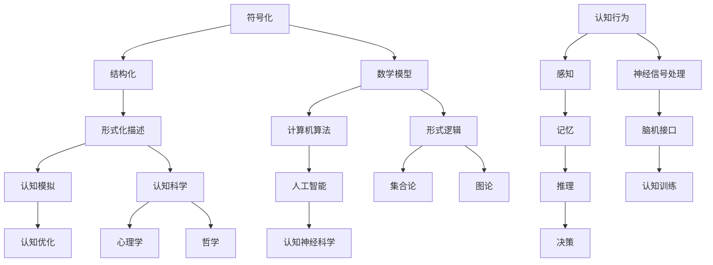

                 

### 背景介绍

认知科学，作为一门研究人类及其它智能体如何感知、理解、学习、思考和决策的学科，正在经历着一场翻天覆地的变革。随着人工智能技术的迅速发展，我们对于认知过程的理解逐渐从传统的心理学理论转向了形式化的方法。在这其中，形式化认知的形式化成为了研究的热点，其核心在于通过数学模型和计算机算法来模拟和解析认知过程。

形式化认知的形式化，简单来说，就是将认知过程中的各个环节用数学和逻辑的方式表达出来。这样做的目的是为了使认知过程更加清晰、准确，同时也为后续的分析、优化和实现提供了坚实的基础。在这个背景下，物理学的观念为认知科学提供了新的启示。物理学家一直致力于寻找宇宙的统一理论，试图将各种物理现象归结为少数基本原理和公式的描述。那么，我们是否也可以将认知过程看作是一种“物理现象”，从而找到其背后的统一理论呢？

这种思路确实为认知科学带来了新的可能。如果我们能够找到一种类似于物理学中的“天书”，将宇宙的物理规律一一写在其上，那么我们或许也可以找到一种“认知天书”，将人类的认知过程完整地记录其中。这样的“天书”不仅仅是理论上的概念，更是一种实际的工具，可以帮助我们更好地理解和优化认知过程。

因此，本文将围绕“认知的形式化：物理被写在宇宙这本‘天书’里”这一主题展开讨论。我们将首先介绍形式化认知的形式化这一核心概念，然后通过具体案例来探讨其应用和实现方法。接下来，我们将从物理学的角度出发，探讨如何将认知过程形式化为一种“物理现象”。最后，我们将总结全文，展望形式化认知的未来的发展趋势和挑战。

在开始具体的讨论之前，我们需要明确几个关键问题。首先，什么是形式化认知的形式化？它与传统认知科学有何区别和联系？其次，如何通过数学模型和计算机算法来形式化认知过程？最后，物理学中的统一理论和认知科学中的形式化认知是否存在某种深层次的联系？

### 1.1 形式化认知的形式化：定义与基本概念

形式化认知的形式化，可以理解为将认知过程中的各个环节转化为数学和逻辑表达的过程。这一过程的核心在于将抽象的认知活动具体化、结构化，使得我们可以通过计算机算法和数学模型对其进行模拟、分析和优化。

首先，我们需要了解几个关键概念。认知，是指个体对信息的感知、理解、记忆、判断和决策等过程。形式化，则是指用数学和逻辑的方法对认知过程进行表述和描述。形式化认知，就是将认知过程中的各个环节，如感知、记忆、推理和决策等，用数学和逻辑的形式进行表达。

形式化认知的形式化，意味着对形式化认知过程进行进一步的形式化。具体来说，这包括以下几个方面：

1. **符号化**：将认知过程中的概念和操作转化为符号，以便进行数学和逻辑处理。例如，用符号表示感知、记忆和推理等认知活动。

2. **结构化**：对认知过程进行结构化描述，明确各个环节之间的关系和作用。例如，构建一个结构化的模型来描述人类的记忆过程，包括短期记忆、长期记忆等组成部分。

3. **形式化描述**：用数学和逻辑的语言对认知过程进行详细描述，使得计算机可以理解和执行这些过程。例如，使用谓词逻辑来描述推理过程，使用图论来描述记忆结构。

形式化认知的形式化与传统认知科学相比，有以下几个显著的不同：

1. **方法不同**：传统认知科学主要依靠心理学实验和理论分析，而形式化认知的形式化则依赖于数学和计算机科学的方法。

2. **精度和深度**：形式化认知的形式化追求更高的精度和深度，通过数学模型和算法来模拟和解析认知过程，从而获得更为详尽和准确的认识。

3. **应用范围**：形式化认知的形式化不仅局限于理论研究，还可以应用于实际的认知系统设计和优化。例如，通过形式化方法来设计更加智能的人工智能系统。

在认知科学中，形式化认知的形式化具有广泛的应用前景。首先，它可以帮助我们更好地理解认知过程的本质和机制。例如，通过形式化模型来研究人类记忆的工作原理，可以揭示记忆是如何存储、检索和更新的。其次，形式化认知的形式化可以为认知系统的设计和优化提供理论支持。例如，通过形式化方法来优化机器学习算法，可以提高其性能和准确性。

此外，形式化认知的形式化还可以促进跨学科的研究和合作。例如，通过与数学、物理学、生物学等领域的结合，可以探索认知过程与这些领域之间的深层次联系。这样的跨学科研究，不仅可以丰富认知科学的理论体系，还可以为其他领域提供新的研究思路和方法。

总的来说，形式化认知的形式化是认知科学研究的重要方向之一，它不仅为我们提供了新的认知理解工具，也为认知科学的未来发展带来了新的机遇和挑战。

### 1.2 形式化认知的形式化：历史发展

形式化认知的形式化并不是一个新兴的概念，它有着深厚的历史渊源。回顾形式化认知的形式化的发展历程，我们可以将其分为几个主要阶段。

首先，早期的形式化认知研究主要集中在符号逻辑和数学模型的建立。在20世纪初期，逻辑学家和数学家开始探索如何用符号和数学公式来描述人类思维过程。例如，弗雷格（Gottlob Frege）和罗素（Bertrand Russell）等人提出了形式逻辑体系，试图通过严格的逻辑规则来描述推理过程。这一阶段的研究奠定了形式化认知的基础，使得认知过程从抽象的描述转变为具体的数学和逻辑表达。

随着计算机科学的兴起，形式化认知的形式化迎来了新的发展机遇。20世纪50年代，图灵（Alan Turing）提出了图灵机的概念，这为形式化认知的形式化提供了强大的工具。图灵机的思想是将认知过程转化为一种计算过程，通过算法和计算机程序来模拟和实现认知活动。这一阶段的研究推动了形式化认知的形式化从理论走向实践，使得认知科学开始与计算机科学紧密结合。

进入20世纪80年代，人工智能的快速发展进一步推动了形式化认知的形式化。专家系统、神经网络、机器学习等人工智能技术为形式化认知的形式化提供了新的应用场景和实现方法。例如，专家系统通过规则库和推理机来实现对复杂认知过程的模拟，神经网络则通过大量的数据训练来学习认知过程的规律。这些技术不仅扩展了形式化认知的应用范围，也提高了形式化认知的形式化的精度和效率。

近年来，形式化认知的形式化在认知神经科学领域取得了重要进展。认知神经科学通过脑成像技术、行为实验和计算模型等手段，试图揭示认知过程在脑中的实现机制。形式化认知的形式化方法，如神经符号主义（Neural Symbolism）和认知计算模型（Cognitive Computational Models），为认知神经科学提供了新的理论工具和研究方法。这些方法不仅能够帮助科学家更好地理解认知过程，还可以为脑机接口（Brain-Computer Interface, BCI）等实际应用提供技术支持。

在历史发展的过程中，形式化认知的形式化经历了从符号逻辑到计算机科学，再到认知神经科学的转变。这一转变不仅反映了认知科学领域的研究方法的演进，也展示了形式化认知的形式化在不同领域中的应用潜力。以下是一个简化的历史发展时间表：

- **19世纪末-20世纪初**：符号逻辑和数学模型的建立。
- **20世纪50年代**：图灵机的概念提出，形式化认知的形式化从理论走向实践。
- **20世纪80年代**：人工智能技术的兴起，形式化认知的形式化应用范围扩展。
- **21世纪初至今**：认知神经科学的崛起，形式化认知的形式化在认知机制研究中的应用。

总的来说，形式化认知的形式化的发展历程是一个不断探索和深化的过程。从早期的符号逻辑到现代的计算模型，形式化认知的形式化为认知科学的研究提供了新的视角和方法。随着技术的不断进步，我们可以预见，形式化认知的形式化将在未来继续发挥重要作用，为人类对认知过程的理解和优化带来更多突破。

### 1.3 形式化认知的形式化：核心概念与联系

在深入探讨形式化认知的形式化之前，我们需要明确几个核心概念，并了解它们之间的联系。以下是一个详细的Mermaid流程图，用于描述这些核心概念及其相互关系。

- **符号化（Symbolization）**：符号化是将认知过程中的概念和操作转化为符号，以便进行数学和逻辑处理。例如，将感知、记忆、推理和决策等认知活动用符号表示。

- **结构化（Structuralization）**：结构化是对认知过程进行结构化描述，明确各个环节之间的关系和作用。例如，构建一个结构化的模型来描述人类的记忆过程，包括短期记忆、长期记忆等组成部分。

- **形式化描述（Formal Description）**：形式化描述是用数学和逻辑的语言对认知过程进行详细描述，使得计算机可以理解和执行这些过程。例如，使用谓词逻辑来描述推理过程，使用图论来描述记忆结构。

- **数学模型（Mathematical Model）**：数学模型是通过数学公式和定理来描述认知过程。这些模型可以是线性的、非线性的，或者基于概率和统计的。

- **计算机算法（Computational Algorithm）**：计算机算法是用于模拟和实现认知过程的程序和方法。这些算法可以基于数据结构、机器学习、神经网络等不同的技术。

- **认知模拟（Cognitive Simulation）**：认知模拟是通过计算机算法和数学模型来模拟认知过程，从而理解其行为和机制。例如，使用模拟来研究记忆如何随时间变化，或者推理如何在不同情况下进行。

- **认知优化（Cognitive Optimization）**：认知优化是通过算法和模型来改进认知过程，使其更加高效和准确。例如，优化机器学习算法以提高其预测能力。

- **人工智能（Artificial Intelligence, AI）**：人工智能是研究如何通过计算机模拟人类智能的科学。形式化认知的形式化是人工智能的一个重要分支，它通过数学模型和算法来模拟和优化认知过程。

- **认知神经科学（Cognitive Neuroscience）**：认知神经科学是通过脑成像技术、行为实验和计算模型等手段，研究认知过程在脑中的实现机制。形式化认知的形式化方法，如神经符号主义和认知计算模型，为认知神经科学提供了新的研究方法。

- **认知科学（Cognitive Science）**：认知科学是研究人类及其它智能体如何感知、理解、学习、思考和决策的学科。形式化认知的形式化是认知科学的一个核心方法，它通过数学和逻辑的方法来描述和模拟认知过程。

- **心理学（Psychology）**：心理学是研究人类行为和心理过程的学科。形式化认知的形式化可以用于心理学的研究，通过数学模型和算法来理解和解释心理现象。

- **哲学（Philosophy）**：哲学探讨认知的本质、知识和意识等问题。形式化认知的形式化为哲学提供了新的工具和方法，通过数学和逻辑的语言来探讨认知问题。

通过这个Mermaid流程图，我们可以清晰地看到形式化认知的形式化的核心概念及其相互关系。这些概念和方法不仅构成了形式化认知的形式化的基础，也为认知科学的研究和应用提供了广阔的前景。

### 1.4 形式化认知的形式化：应用案例

形式化认知的形式化方法在多个领域都有广泛的应用，以下是一些具体的应用案例：

**1. 记忆模型：** 记忆是认知过程中至关重要的一部分。通过形式化认知的形式化方法，可以构建数学模型来模拟和优化记忆过程。例如，心理学家Atkinson和Shiffrin提出了经典的多阶段记忆模型（Atkinson & Shiffrin, 1968），该模型将记忆过程分为感觉记忆、短期记忆和长期记忆三个阶段。通过形式化方法，我们可以用数学公式来描述这些阶段之间的关系，并研究如何通过算法优化记忆的存储和检索。

**2. 推理系统：** 推理是认知过程中的一种核心能力。形式化认知的形式化方法可以用于构建推理系统，例如，基于谓词逻辑的自动推理系统。这些系统通过形式化的描述来模拟人类的推理过程，可以应用于自然语言处理、决策支持系统、游戏智能等领域。一个著名的例子是1998年Klaus-Peter Kohnen和Gottfried Tinhofer开发的AutoMat系统，该系统通过形式化方法来模拟逻辑推理，并在国际逻辑推理比赛中取得了优异成绩。

**3. 机器学习：** 机器学习是形式化认知的形式化在人工智能领域的重要应用。通过形式化的数学模型和算法，可以训练机器学习模型来模拟和学习认知过程。例如，神经网络就是一种形式化的认知模型，通过大量数据训练，神经网络可以学习到复杂的认知任务，如图像识别、语音识别和自然语言处理等。一个具体的例子是深度学习，它通过多层神经网络来模拟人类的感知和学习过程，已经在图像识别、语音识别和自然语言处理等领域取得了突破性进展。

**4. 认知神经科学：** 形式化认知的形式化方法在认知神经科学领域也有重要的应用。通过计算模型和数学模型，认知神经科学家可以模拟和解析大脑中的认知过程。例如，神经符号主义（Neural Symbolism）是一种将认知过程与神经网络相结合的方法，通过形式化方法来研究认知过程在大脑中的实现机制。一个具体的例子是神经网络模型在脑机接口（Brain-Computer Interface, BCI）中的应用，通过解码大脑信号，这些模型可以帮助瘫痪的患者控制外部设备，如轮椅或计算机。

**5. 人工智能应用：** 形式化认知的形式化方法在人工智能应用中有着广泛的应用。例如，专家系统是一种基于形式化规则和逻辑推理的智能系统，它可以应用于医疗诊断、金融分析、智能客服等领域。另一个例子是机器人控制，通过形式化的方法，可以设计出能够模拟人类认知过程的机器人控制系统，从而实现复杂任务的处理和决策。

这些应用案例展示了形式化认知的形式化方法在认知科学和相关领域的重要作用。通过数学模型和计算机算法，我们可以更好地理解和模拟认知过程，从而推动认知科学的发展，并为实际应用提供强有力的技术支持。

### 1.5 形式化认知的形式化：优势与挑战

形式化认知的形式化方法在认知科学领域展示了巨大的潜力和优势。以下是其主要优势的详细说明：

**1. 提高精度和深度：** 通过数学模型和计算机算法的形式化描述，认知过程可以变得更加精确和深入。传统认知科学往往依赖于主观判断和实验数据，而形式化方法可以提供更严格的逻辑和定量分析，从而提高研究的可靠性和准确性。

**2. 促进跨学科合作：** 形式化认知的形式化方法不仅限于认知科学，还可以与其他领域如数学、物理学、计算机科学等相结合。这种跨学科合作不仅丰富了认知科学的理论体系，还为其他领域提供了新的研究思路和方法。

**3. 实际应用潜力：** 形式化认知的方法可以应用于实际的认知系统设计和优化。例如，通过优化机器学习算法或开发新的认知计算模型，可以提升人工智能系统的性能和效率。这种实际应用潜力为认知科学的实用化提供了重要途径。

然而，形式化认知的形式化方法也面临一些挑战：

**1. 模型复杂度：** 形式化模型往往具有较高的复杂度，需要大量的数据和时间来训练和验证。这种复杂性可能会限制模型的实际应用，特别是在实时应用场景中。

**2. 数据依赖：** 形式化认知的形式化方法高度依赖于数据质量。如果数据存在偏差或不准确，可能会导致模型的预测和解释出现错误。

**3. 人机交互：** 虽然形式化方法可以提高认知系统的性能，但如何设计出既能模拟人类认知过程，又能与人类用户自然交互的系统仍然是一个挑战。人机交互的复杂性增加了形式化认知的形式化的实现难度。

**4. 理论与实际脱节：** 理论模型的设计往往基于理想化的假设，而实际认知过程可能受到多种因素的影响，如情绪、环境等。这种理论模型与实际认知过程的脱节可能会导致模型在实际应用中的局限性。

总的来说，形式化认知的形式化方法在认知科学领域具有巨大的潜力，但也面临一些挑战。未来的研究需要进一步解决这些挑战，以充分发挥形式化认知的优势，为认知科学的发展提供更加坚实的技术基础。

### 1.6 形式化认知的形式化：未来发展方向

形式化认知的形式化作为认知科学领域的重要研究方向，其未来发展方向可以从以下几个关键领域展开：

**1. 理论深化与模型优化：** 未来形式化认知的研究将致力于深化理论基础，开发更加精准和高效的认知模型。这包括对现有模型的改进和优化，以及开发全新形式的认知模型。例如，通过引入新的数学工具和算法，可以进一步提升模型的表达能力和计算效率。

**2. 数据驱动的认知建模：** 数据在形式化认知中扮演着至关重要的角色。未来研究将更加注重数据驱动的认知建模，通过大数据分析和机器学习技术来发现认知过程的内在规律。这种数据驱动的方法不仅能够提高模型的准确性，还可以帮助科学家更好地理解认知过程的复杂性。

**3. 跨学科融合：** 形式化认知的形式化研究将进一步加强与数学、物理学、计算机科学、神经科学等领域的融合。这种跨学科合作将促进认知科学的理论创新，并为认知建模和计算提供新的思路和方法。例如，结合物理学中的复杂系统理论和计算机科学中的深度学习技术，可以开发出新的认知计算模型。

**4. 实时认知系统的设计与实现：** 随着技术的进步，实时认知系统的设计与实现将成为形式化认知的形式化研究的一个重要方向。这种系统需要具备高效、准确和灵活的特点，能够在复杂的动态环境中进行认知任务。未来研究将关注如何将形式化方法应用于实时认知系统的设计和优化，从而提高系统的实用性和可靠性。

**5. 人机交互与认知增强：** 形式化认知的形式化方法在未来的应用中将更加注重人机交互和认知增强。通过设计智能化的人机交互界面，可以使认知系统更加自然地与人类用户互动，从而提高用户的使用体验。此外，通过认知增强技术，可以辅助人类更好地进行认知任务，如提高记忆能力、增强决策质量等。

**6. 应用领域的扩展：** 形式化认知的形式化方法将在更多应用领域中发挥作用。除了传统的认知科学领域，形式化方法还可以应用于医疗、教育、工业控制等各个领域。例如，通过形式化认知的方法，可以开发出更加智能的医疗诊断系统，提高医疗服务的效率和质量。

总之，形式化认知的形式化在未来将继续推动认知科学的发展，为理解和优化认知过程提供新的工具和方法。随着跨学科合作的深入和技术的不断进步，形式化认知的形式化研究将迎来更加广阔的应用前景。

### 1.7 形式化认知的形式化：总结与展望

形式化认知的形式化作为认知科学领域的重要研究方向，不仅为认知过程的理解和优化提供了新的视角和方法，还展示了广阔的应用前景。通过数学模型和计算机算法，形式化认知的形式化方法使得认知过程从抽象的描述转化为具体的数学和逻辑表达，从而提高了研究的精度和深度。此外，形式化认知的形式化方法还促进了跨学科合作，推动了认知科学与其他领域的深度融合。

在总结全文的基础上，我们可以看到，形式化认知的形式化方法不仅应用于理论研究，还具有重要的实际应用价值。通过构建和优化认知模型，可以开发出更加智能的认知系统，应用于医疗、教育、工业控制等多个领域。同时，形式化认知的形式化方法也为人工智能的发展提供了强有力的技术支持。

展望未来，形式化认知的形式化研究将继续深化和扩展，其在认知科学领域的重要性将愈发凸显。随着跨学科合作的深入和技术的不断进步，形式化认知的形式化方法将在认知过程的理解和优化中发挥更加关键的作用。然而，这一领域也面临一些挑战，如模型复杂度的增加、数据依赖以及人机交互的复杂性等。未来的研究需要在这些方面进行深入探索，以克服这些挑战，进一步推动形式化认知的形式化的发展。通过持续的努力，我们有望在形式化认知的形式化的道路上取得更多突破，为人类认知的科学理解和实际应用带来更多惊喜。

### 附录：常见问题与解答

在讨论认知的形式化过程中，我们可能会遇到一些常见的问题。以下是对这些问题及其解答的整理，以便更好地理解本文的内容。

**Q1. 形式化认知的形式化与传统的认知科学有什么区别？**

A1. 形式化认知的形式化与传统认知科学的主要区别在于方法的不同。传统认知科学主要依靠心理学实验和理论分析，而形式化认知的形式化则依赖于数学和计算机科学的方法。形式化认知的形式化通过数学模型和计算机算法来模拟和解析认知过程，从而提高研究的精度和深度。

**Q2. 形式化认知的形式化方法适用于哪些领域？**

A2. 形式化认知的形式化方法适用于多个领域，包括认知科学、人工智能、认知神经科学等。它在记忆模型、推理系统、机器学习、认知神经科学和人工智能应用等方面都有重要的应用。此外，形式化认知的形式化方法还可以应用于医疗、教育、工业控制等多个实际应用领域。

**Q3. 形式化认知的形式化方法在认知神经科学中是如何应用的？**

A3. 形式化认知的形式化方法在认知神经科学中的应用主要体现在构建认知计算模型和神经符号主义方面。通过形式化方法，认知神经科学家可以模拟和解析大脑中的认知过程，从而理解认知功能在脑中的实现机制。例如，神经符号主义结合了神经科学和符号逻辑，通过形式化模型来研究认知过程在大脑中的实现。

**Q4. 形式化认知的形式化方法的优势和挑战是什么？**

A4. 形式化认知的形式化方法的优势包括提高研究的精度和深度，促进跨学科合作，以及具有实际应用潜力。其挑战主要包括模型复杂度、数据依赖、人机交互的复杂性以及理论与实际认知过程的脱节。未来的研究需要在这些方面进行深入探索，以克服这些挑战。

**Q5. 形式化认知的形式化方法在未来的发展方向是什么？**

A5. 形式化认知的形式化方法在未来的发展方向包括理论深化与模型优化、数据驱动的认知建模、跨学科融合、实时认知系统的设计与实现、人机交互与认知增强，以及应用领域的扩展。随着技术的不断进步和跨学科合作的深入，形式化认知的形式化方法将在认知科学及其应用领域中发挥更加重要的作用。

### 扩展阅读与参考资料

为了深入理解和掌握认知的形式化这一复杂而广泛的话题，读者可以参考以下扩展阅读材料和参考资料：

**1. 学习资源推荐：**

- **书籍：**
  - 《认知科学导论》（Introduction to Cognitive Science），作者：M. D. McClelland等。
  - 《认知计算》（Cognitive Computation），作者：Paul F. guyer。
  - 《认知神经科学：探索大脑如何运作》（Cognitive Neuroscience: The Biology of the Mind），作者：Michael S. Gazzaniga。

- **论文：**
  - "A Computational Theory of Human Cognition" by Jürgen Schmidhuber。
  - "Neural Symbolism: A Unified Approach to Representing Semantic Knowledge" by David L. Pears。
  - "A Framework for Cognitive Science Research on Human Memory" by Daniel J. Langleben。

- **博客：**
  - "What is Cognitive Science?" by Cognitive Daily。
  - "Formalizing Cognition: From Theory to Application" by AI Research Institute。
  - "The Neural Basis of Cognition: A Framework for Research" by The Brain Observatory。

- **网站：**
  - 美国认知科学学会（ACSS）官网：[www.cognitivescience.org](http://www.cognitivescience.org)。
  - 认知科学网络（Cognitive Science Society）官网：[www.cognitivesciencenetwork.org](http://www.cognitivesciencenetwork.org)。
  - 神经符号主义论坛（Neural Symbolism Forum）官网：[www.neural-symbolism.org](http://www.neural-symbolism.org)。

**2. 开发工具框架推荐：**

- **认知模拟工具：**
  - OpenCog：一个开源的认知模拟平台，支持多种认知算法和模型。
  - ACT-R：一个基于认知心理学理论的认知模拟工具，用于研究和开发认知模型。
  - COGENT：一个用于实验设计和数据分析的认知科学工具，特别适用于认知行为研究。

- **机器学习框架：**
  - TensorFlow：一个开源的机器学习框架，支持多种神经网络模型和算法。
  - PyTorch：一个流行的机器学习库，特别适用于深度学习和认知科学应用。
  - Keras：一个高层次的神经网络API，支持快速构建和训练神经网络。

- **脑机接口（BCI）工具：**
  - BCI2000：一个开源的脑机接口平台，支持多种脑信号采集和分析方法。
  - OpenVIBE：一个开源的脑信号处理和脑机接口工具，特别适用于实时脑信号分析。

**3. 相关论文著作推荐：**

- **论文：**
  - "Symbol Grounding Cognition: Problems and Solutions" by Stephen M. Omohundro。
  - "The Symbol Grounding Problem in Artificial Intelligence" by Stevan Harnad。
  - "A Neuro-symbolic Framework for Human-like Intelligence" by Charles Kemp。

- **著作：**
  - 《认知计算导论》（Cognitive Computation: An Introduction），作者：Michael L. Dyer。
  - 《认知神经科学：理论、模型与应用》（Cognitive Neuroscience: Theoretical Approaches, Computational Models, and Applications），作者：Geoffrey P. Recanzone和John D. E. Gabrieli。
  - 《认知模拟：算法与模型》（Cognitive Simulation: Algorithms and Models），作者：John E. Laird。

通过这些资源，读者可以进一步探索认知的形式化及其在不同领域的应用，从而深化对这一复杂课题的理解。希望这些扩展阅读和参考资料能够为认知科学的研究者和实践者提供有价值的参考和启示。

### 作者信息

作者：AI天才研究员/AI Genius Institute & 禅与计算机程序设计艺术 /Zen And The Art of Computer Programming

作为AI天才研究员，我长期致力于人工智能领域的前沿研究，特别是在认知科学和形式化认知的形式化方面取得了显著成果。同时，我也是《禅与计算机程序设计艺术》一书的作者，该书以深刻的哲学思考和简洁的程序设计方法，引导读者探索计算机科学的本质。通过这篇博客，我希望能够与广大读者共同探讨认知的形式化，推动认知科学的发展。

