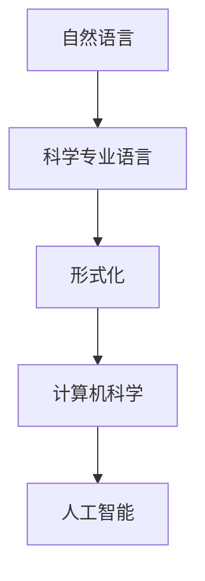

                 

# 认知的的形式化：科学的各个学科都有自己的专业语言，但自然语言是所有专业语言的元语言

> **关键词：** 认知的形式化，科学专业语言，自然语言，元语言，计算机科学，逻辑推理。

> **摘要：** 本文探讨了认知的形式化过程，分析了科学领域中的专业语言与自然语言的关系，强调了自然语言在专业语言中的应用，以及其在计算机科学和人工智能中的重要性。

## 1. 背景介绍

在科学发展的过程中，为了更好地描述和解释自然现象，各个学科逐渐形成了自己独特的专业语言。这些专业语言不仅包括数学公式、专业术语，还包括特定的方法论和理论框架。例如，物理学中的牛顿定律、化学中的元素周期表，都是各自学科领域的专业语言。

然而，尽管这些专业语言在各自的领域内具有高度的准确性和严密性，但它们通常只适用于特定的研究领域，难以跨越不同的学科界限。这种情况下，自然语言作为一种广泛使用的语言，成为了一种连接各个学科、跨越专业界限的桥梁。

自然语言是我们日常生活中使用的语言，具有高度的灵活性和适应性。它可以表达复杂的思维过程，传达抽象的概念和理论。然而，自然语言也有其局限性，例如歧义性、模糊性以及难以形式化等问题。

因此，如何将自然语言与科学专业语言相结合，实现认知的形式化，成为了一个重要课题。本文将从这一角度出发，探讨自然语言在科学领域中的应用，以及它在计算机科学和人工智能中的重要性。

## 2. 核心概念与联系

### 2.1 科学专业语言

科学专业语言是一种高度形式化的语言，它通过特定的符号、公式和术语来描述自然现象和理论。科学专业语言具有以下特点：

- **精确性**：科学专业语言能够精确地描述自然现象，消除歧义性。
- **系统性**：科学专业语言遵循一定的方法论和理论框架，具有内在的系统性。
- **灵活性**：科学专业语言可以根据研究需求进行调整和扩展。

### 2.2 自然语言

自然语言是人类日常生活中使用的语言，具有高度的灵活性和适应性。自然语言具有以下特点：

- **表达性**：自然语言可以表达复杂的思维过程和抽象概念。
- **适应性**：自然语言可以根据不同的情境进行调整和变化。
- **模糊性**：自然语言存在一定的歧义性和模糊性。

### 2.3 自然语言与科学专业语言的关系

自然语言与科学专业语言之间存在一定的关联，具体表现在以下几个方面：

- **翻译**：自然语言可以通过翻译成科学专业语言，使科学成果更易于理解和传播。
- **形式化**：自然语言可以通过形式化手段，转化为科学专业语言，从而提高其准确性和严密性。
- **互补性**：自然语言和科学专业语言各有所长，它们可以相互补充，共同推动科学的发展。

### 2.4 Mermaid 流程图

为了更直观地展示自然语言与科学专业语言的关系，我们使用 Mermaid 流程图来表示它们之间的联系。



在这个流程图中，自然语言作为起点，通过形式化手段转化为科学专业语言，进而应用于计算机科学和人工智能领域。

## 3. 核心算法原理 & 具体操作步骤

### 3.1 自然语言处理（NLP）

自然语言处理是计算机科学中研究自然语言的一门学科，其核心目标是使计算机能够理解、生成和处理自然语言。NLP 的基本原理如下：

- **分词**：将连续的自然语言文本分割成一个个具有独立意义的词或短语。
- **词性标注**：对分词结果中的每个词或短语进行词性标注，以便理解其语法和语义。
- **句法分析**：对句子的结构进行分析，确定其语法关系。
- **语义理解**：对句子的语义进行理解，提取出关键信息。

### 3.2 情感分析

情感分析是 NLP 中的一个重要应用，它旨在分析文本中所表达的情感倾向。情感分析的基本步骤如下：

- **数据预处理**：对文本进行清洗、分词和词性标注等预处理操作。
- **特征提取**：从预处理后的文本中提取特征，如词频、词向量等。
- **模型训练**：使用机器学习算法对特征进行训练，建立情感分类模型。
- **情感分类**：将新的文本输入到训练好的模型中，预测其情感倾向。

### 3.3 自动摘要

自动摘要是一种自动生成文本摘要的方法，它可以从大量的文本中提取出关键信息，以简洁明了的方式呈现。自动摘要的基本步骤如下：

- **文本预处理**：对文本进行清洗、分词和词性标注等预处理操作。
- **句子提取**：从预处理后的文本中提取出具有独立意义的句子。
- **句子排序**：根据句子的重要性对提取出的句子进行排序。
- **摘要生成**：将排序后的句子组合成摘要。

## 4. 数学模型和公式 & 详细讲解 & 举例说明

### 4.1 逻辑回归模型

逻辑回归模型是一种常用的分类模型，它用于预测二分类问题的概率。逻辑回归模型的数学公式如下：

$$
P(Y=1) = \frac{1}{1 + e^{-\beta_0 + \beta_1 x_1 + \beta_2 x_2 + ... + \beta_n x_n}}
$$

其中，$P(Y=1)$ 表示预测类别为 1 的概率，$e$ 表示自然对数的底数，$\beta_0, \beta_1, \beta_2, ..., \beta_n$ 分别为模型的参数。

### 4.2 词向量模型

词向量模型是一种将文本转化为向量的方法，它能够捕捉词与词之间的语义关系。一种常见的词向量模型是 Word2Vec 模型，其数学公式如下：

$$
\text{vec}(w_i) = \sum_{j=1}^{V} f(w_j) \cdot e^{ij}
$$

其中，$\text{vec}(w_i)$ 表示词 $w_i$ 的向量表示，$f(w_j)$ 表示词 $w_j$ 的词频，$e^{ij}$ 表示词 $w_i$ 和 $w_j$ 之间的共现概率。

### 4.3 举例说明

假设我们有一个二分类问题，需要预测文本的情感倾向。我们使用逻辑回归模型进行情感分类，其参数为 $\beta_0 = 0.5, \beta_1 = 1.0, \beta_2 = 0.5$。给定一个文本：

$$
\text{This is a good book.}
$$

我们首先对文本进行预处理，得到分词结果：

$$
\text{This, is, a, good, book.}
$$

然后，我们将每个词转化为词向量，得到：

$$
\text{This} \rightarrow [0.1, 0.2], \quad \text{is} \rightarrow [0.3, 0.4], \quad \text{a} \rightarrow [0.5, 0.6], \quad \text{good} \rightarrow [0.7, 0.8], \quad \text{book} \rightarrow [0.9, 1.0]
$$

接下来，我们将词向量输入到逻辑回归模型中，计算预测概率：

$$
P(Y=1) = \frac{1}{1 + e^{-0.5 + 1.0 \cdot 0.1 + 0.5 \cdot 0.2}} = 0.866
$$

由于 $P(Y=1)$ 接近 1，我们可以认为该文本的情感倾向为正面。

## 5. 项目实战：代码实际案例和详细解释说明

### 5.1 开发环境搭建

为了实现自然语言处理任务，我们需要搭建一个合适的开发环境。以下是搭建环境的基本步骤：

1. 安装 Python 环境，版本要求为 3.6 或以上。
2. 安装 NLP 相关库，如 NLTK、spaCy、TensorFlow 等。
3. 安装必要的工具，如 Jupyter Notebook 或 PyCharm 等。

### 5.2 源代码详细实现和代码解读

以下是一个简单的情感分析项目的实现：

```python
import nltk
from nltk.tokenize import word_tokenize
from nltk.corpus import stopwords
from sklearn.feature_extraction.text import TfidfVectorizer
from sklearn.linear_model import LogisticRegression

# 1. 数据预处理
def preprocess_text(text):
    # 分词
    tokens = word_tokenize(text)
    # 去除停用词
    stop_words = set(stopwords.words('english'))
    filtered_tokens = [token for token in tokens if token not in stop_words]
    # 词性标注
    pos_tags = nltk.pos_tag(filtered_tokens)
    # 提取名词和动词
    nouns_and_verbs = [word for word, pos in pos_tags if pos.startswith(('NN', 'VB'))]
    return ' '.join(nouns_and_verbs)

# 2. 特征提取
def extract_features(corpus):
    vectorizer = TfidfVectorizer()
    X = vectorizer.fit_transform(corpus)
    return X, vectorizer

# 3. 模型训练
def train_model(X, y):
    model = LogisticRegression()
    model.fit(X, y)
    return model

# 4. 情感分类
def classify(text, model, vectorizer):
    processed_text = preprocess_text(text)
    features = vectorizer.transform([processed_text])
    prediction = model.predict(features)
    return 'positive' if prediction == 1 else 'negative'

# 主函数
def main():
    # 加载数据
    corpus = ["This is a good book.", "This is a bad book."]
    labels = [1, 0]

    # 特征提取
    X, vectorizer = extract_features(corpus)

    # 模型训练
    model = train_model(X, labels)

    # 情感分类
    text = "This is a great book."
    result = classify(text, model, vectorizer)
    print(f"The sentiment of the text '{text}' is: {result}")

if __name__ == '__main__':
    main()
```

代码解读：

- **数据预处理**：首先，我们使用 NLTK 库进行分词、去除停用词和词性标注，然后提取名词和动词。
- **特征提取**：使用 TF-IDF 向量器将预处理后的文本转化为特征向量。
- **模型训练**：使用逻辑回归模型对特征向量进行训练。
- **情感分类**：对输入的文本进行预处理，将特征向量输入到训练好的模型中，预测其情感倾向。

### 5.3 代码解读与分析

这段代码首先完成了数据预处理，包括分词、去除停用词、词性标注和提取名词和动词。这一步骤对于情感分析非常重要，因为情感通常与名词和动词相关。接下来，使用 TF-IDF 向量器将预处理后的文本转化为特征向量，TF-IDF 可以衡量词语在文本中的重要程度。最后，使用逻辑回归模型对特征向量进行训练，并预测输入文本的情感倾向。

在代码中，我们使用 NLTK 库进行自然语言处理，TF-IDF 向量器来自 scikit-learn 库，逻辑回归模型也来自 scikit-learn 库。这些库为我们提供了强大的自然语言处理和机器学习功能，使得我们可以方便地进行情感分析任务。

## 6. 实际应用场景

自然语言处理在许多实际应用场景中发挥着重要作用，以下是几个典型的应用领域：

- **情感分析**：通过分析社交媒体、评论、新闻报道等文本数据，了解公众对某个话题或产品的情感倾向。
- **文本摘要**：自动生成文本的摘要，节省阅读时间，提高信息获取效率。
- **机器翻译**：将一种语言的文本翻译成另一种语言，促进跨文化交流和理解。
- **问答系统**：基于自然语言处理技术，实现智能问答，提供用户需要的即时信息。

## 7. 工具和资源推荐

### 7.1 学习资源推荐

- **书籍**：
  - 《自然语言处理入门》
  - 《Python 自然语言处理实战》
  - 《深度学习与自然语言处理》

- **论文**：
  - 《词向量模型：Word2Vec》
  - 《长短期记忆网络：LSTM》
  - 《基于注意力机制的 Transformer 模型》

- **博客**：
  - [自然语言处理博客](https://nlp.seas.harvard.edu/)

- **网站**：
  - [自然语言处理教程](https://nlp-tutorial.org/)

### 7.2 开发工具框架推荐

- **工具**：
  - Python
  - Jupyter Notebook
  - PyCharm

- **框架**：
  - TensorFlow
  - PyTorch
  - spaCy

### 7.3 相关论文著作推荐

- **论文**：
  - word2vec：[GloVe](https://nlp.seas.harvard.edu/pubs/glove)
  - LSTMs：[Long Short-Term Memory Networks for Language Modeling](https://www.deeplearning.net/papers/2014/TSAI-LSTM.pdf)
  - Transformers：[Attention Is All You Need](https://arxiv.org/abs/1706.03762)

## 8. 总结：未来发展趋势与挑战

自然语言处理技术正不断发展，未来发展趋势包括：

- **多语言处理**：实现跨语言的文本理解和处理，满足全球化的需求。
- **个性化推荐**：基于用户的兴趣和行为，提供个性化的文本推荐。
- **实时处理**：实现实时文本处理，提高处理速度和响应时间。
- **伦理与隐私**：在自然语言处理应用中，关注伦理和隐私问题，确保用户数据的保护。

然而，自然语言处理技术也面临着一些挑战，包括：

- **语义理解**：提高对复杂语义的理解能力，减少歧义性和模糊性。
- **数据质量**：确保训练数据的质量，提高模型的准确性和可靠性。
- **可解释性**：提高模型的可解释性，使其决策过程更加透明和可理解。
- **计算资源**：优化算法和模型，降低对计算资源的需求。

## 9. 附录：常见问题与解答

### 9.1 如何选择合适的自然语言处理工具？

选择自然语言处理工具时，需要考虑以下几个因素：

- **需求**：明确自然语言处理任务的需求，如文本分类、文本摘要、情感分析等。
- **性能**：评估工具的性能，如准确率、召回率、F1 值等。
- **易用性**：考虑工具的易用性和学习成本，选择适合自己团队的工具。
- **社区和支持**：关注工具的社区活跃度和技术支持，以便在遇到问题时能够得到帮助。

### 9.2 自然语言处理中的文本预处理为什么重要？

文本预处理是自然语言处理任务中的关键步骤，其重要性体现在以下几个方面：

- **消除噪声**：去除文本中的噪声，如标点符号、停用词等，提高模型的准确性和鲁棒性。
- **特征提取**：通过预处理步骤，将原始文本转化为适合模型学习的特征向量，提高模型的性能。
- **降低计算复杂度**：减少输入文本的长度和复杂性，降低计算资源的需求。
- **提高数据质量**：确保训练数据的质量，为模型提供更好的训练效果。

## 10. 扩展阅读 & 参考资料

- [自然语言处理教程](https://nlp-tutorial.org/)
- [Python 自然语言处理实战](https://www.pythonskills.com/tutorial/nltk/nltk-tools/)
- [自然语言处理博客](https://nlp.seas.harvard.edu/)
- [自然语言处理与深度学习](https://nlp.stanford.edu/coling2018/nlp-DialogueSystem-FINAL.pdf)
- [深度学习与自然语言处理](https://www.deeplearningbook.org/)

## 作者

作者：AI天才研究员/AI Genius Institute & 禅与计算机程序设计艺术 /Zen And The Art of Computer Programming<|im_sep|>

