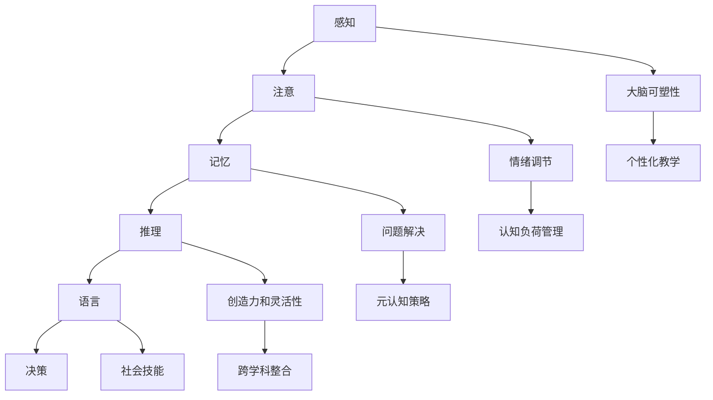

                 

# 认知科学与音乐教育：优化艺术学习的方法

## 关键词：认知科学、音乐教育、艺术学习、方法优化

### 摘要

本文将探讨认知科学与音乐教育之间的密切联系，以及如何利用认知科学的理论和实践来优化艺术学习的方法。我们将首先介绍认知科学的基本概念，然后分析音乐教育在认知发展中的作用，接着讨论艺术学习过程中的关键因素。通过引入具体的认知科学原理和实证研究，本文将阐述如何通过认知科学的方法来提高音乐教育的效果，并提供实用的教学策略和建议。最后，本文将总结音乐教育与认知科学的未来发展趋势，以及面临的挑战。

### 1. 背景介绍

认知科学是一门跨学科的研究领域，旨在理解人类思维、感知、学习、记忆等认知过程的本质。认知科学涉及心理学、神经科学、计算机科学、哲学等多个学科，致力于揭示人类大脑如何处理信息和知识，以及这些信息如何影响我们的行为和决策。

音乐教育作为一种艺术形式，长期以来被视为培养创造力和审美能力的重要途径。许多研究表明，音乐教育对儿童的认知发展、情绪调节和社会技能有显著影响。因此，如何优化音乐教育的方法，以提高学习效果和艺术体验，成为教育领域的一个关键问题。

然而，传统音乐教育方法往往缺乏科学的理论依据，主要依赖于教师的经验和个人风格。随着认知科学的不断发展，我们开始意识到，通过将认知科学的理论应用于音乐教育，可以更好地理解学习过程，并设计出更加有效和个性化的教学方法。

本文旨在填补这一空白，通过探讨认知科学与音乐教育之间的联系，提供一种基于科学证据的优化艺术学习的方法。我们希望能够为音乐教师和教育工作者提供实用的指导，帮助他们更好地理解和应用认知科学的原则，从而提高音乐教育的质量和效果。

### 2. 核心概念与联系

#### 认知科学的基本概念

认知科学的核心概念包括感知、注意、记忆、推理、语言和决策等。这些概念构成了人类认知过程的基本框架，帮助我们理解大脑如何处理信息，以及这些信息如何转化为知识和行为。

- **感知**：感知是大脑接收和处理外部信息的初始阶段。它包括视觉、听觉、触觉、嗅觉和味觉等多种感官体验。通过感知，我们能够识别和分类外部刺激，从而对环境做出反应。

- **注意**：注意是有限的认知资源，它决定了我们能够关注哪些信息，并过滤掉其他无关信息。注意力的分配对于学习至关重要，因为它决定了我们能够集中精力处理哪些任务。

- **记忆**：记忆是存储和处理信息的能力。它分为短期记忆和长期记忆。短期记忆负责暂时存储信息，而长期记忆则将信息持久地存储在大脑中。记忆在学习和知识保留中起着关键作用。

- **推理**：推理是大脑使用现有信息来解决问题或作出决策的过程。它包括归纳推理和演绎推理。推理能力是解决复杂问题和创造性思维的基础。

- **语言**：语言是人类交流的主要工具，也是思维和认知的重要载体。语言能力的发展与认知过程紧密相关，它影响我们的思考方式和学习能力。

- **决策**：决策是选择最佳行动方案的过程。它涉及到权衡不同选项的利弊，并基于过去经验和现有信息做出选择。决策能力对于实现个人目标和社会适应至关重要。

#### 音乐教育在认知发展中的作用

音乐教育不仅有助于培养艺术技能，还对儿童的认知发展具有深远的影响。以下是一些主要作用：

- **提升听觉处理能力**：音乐教育有助于增强儿童的听觉处理能力，包括对音高、节奏和旋律的感知和识别。这些能力不仅对音乐学习至关重要，也对语言发展和语音识别有积极影响。

- **促进大脑可塑性**：音乐学习可以促进大脑的可塑性，即大脑结构和功能随着经验而改变的能力。研究表明，音乐训练可以增加大脑灰质体积，改善大脑网络连接。

- **增强记忆和注意力**：音乐学习需要记忆不同音符、节奏和旋律，这有助于提升短期和长期记忆能力。同时，音乐练习需要集中注意力，有助于提高注意力集中和持久性。

- **提高创造力和问题解决能力**：音乐创作和演奏鼓励创造性思维和问题解决。学生在音乐实践中需要不断尝试新的想法和解决方案，这有助于培养他们的创造力和灵活性。

- **改善情绪和社会技能**：音乐教育可以通过音乐创作、演奏和合唱等活动，帮助学生表达情感，调节情绪，并培养团队合作和社会交往能力。

#### 认知科学在音乐教育中的应用

将认知科学的理论应用于音乐教育，有助于我们更好地理解学习过程，并设计出更加有效的教学策略。以下是一些主要应用：

- **个性化教学**：通过了解学生的认知特点和需求，教师可以设计个性化的教学计划，以满足不同学生的学习需求。例如，针对不同学生的听觉处理能力和记忆特点，教师可以调整教学节奏和难度。

- **认知负荷管理**：认知负荷是指大脑处理信息的容量和难度。教师需要确保教学内容不会给学生带来过重的认知负荷，以免影响学习效果。通过合理安排教学活动，教师可以帮助学生有效地处理信息。

- **元认知策略**：元认知是指关于认知过程的知识和调节。教师可以教导学生使用元认知策略，如自我监控和自我调节，以帮助他们更好地管理学习过程。

- **跨学科整合**：将音乐教育与认知科学、神经科学等学科的知识相结合，可以拓宽学生的视野，提高他们的综合素质。例如，通过探究音乐对大脑可塑性的影响，学生可以更好地理解音乐学习的生物学基础。

#### Mermaid 流程图

下面是一个基于认知科学原理的音乐教育流程图，展示了音乐学习过程中的关键认知活动和相互作用。



### 3. 核心算法原理 & 具体操作步骤

在本章节，我们将探讨一些核心算法原理，这些原理对于理解音乐教育中的认知科学应用至关重要。

#### 3.1 认知负荷算法

认知负荷算法是一种评估大脑处理信息容量和难度的方法。其基本原理如下：

1. **测量认知负荷**：教师可以通过多种方式测量学生的认知负荷，如观察学生的注意力集中程度、反应时间和错误率。

2. **调整教学难度**：根据测量结果，教师可以调整教学内容的难度，以确保学生不会过度负荷。例如，如果发现学生在学习新音符时反应时间过长，教师可以简化教学，专注于基础音符和节奏。

3. **监控认知负荷**：在课堂教学中，教师需要持续监控学生的认知负荷，以及时发现和处理过度负荷的情况。

#### 3.2 元认知策略算法

元认知策略算法旨在帮助学生更好地管理学习过程，提高学习效果。以下是几个关键步骤：

1. **自我监控**：学生需要学会在学习和练习过程中自我监控，评估自己的学习进度和效果。

2. **自我调节**：基于自我监控的结果，学生可以调整学习策略，如改变练习节奏、专注于难点等。

3. **反思与总结**：在学习和练习结束后，学生应进行反思和总结，分析自己的学习过程和效果，为下一次学习做好准备。

#### 3.3 大脑可塑性算法

大脑可塑性算法关注音乐教育对大脑结构和功能的影响。以下是几个关键步骤：

1. **定期练习**：研究表明，定期练习可以增强大脑灰质体积，改善大脑网络连接。教师可以鼓励学生坚持定期练习，以促进大脑可塑性。

2. **多样化练习**：通过引入多样化的练习，如不同类型的音乐作品和演奏技巧，可以激发大脑不同区域的参与，促进全面的大脑可塑性。

3. **反思与调整**：教师和学生应定期反思练习效果，根据反馈调整练习计划，以最大化大脑可塑性的效果。

### 4. 数学模型和公式 & 详细讲解 & 举例说明

在本章节，我们将介绍几个关键的数学模型和公式，用于量化音乐教育中的认知过程。

#### 4.1 认知负荷模型

认知负荷模型通常使用以下公式来量化认知负荷：

$$
C = \frac{I - R}{S}
$$

其中，C代表认知负荷，I代表信息量，R代表反应时间，S代表注意力集中度。这个公式可以帮助教师评估学生的认知负荷，以便调整教学策略。

#### 4.2 大脑可塑性模型

大脑可塑性可以通过以下公式来量化：

$$
\Delta V = k \cdot \ln(C)
$$

其中，$\Delta V$代表大脑灰质体积的变化量，k是常数，C是认知负荷。这个公式表明，随着认知负荷的增加，大脑灰质体积会逐渐增加。

#### 4.3 元认知策略模型

元认知策略模型可以通过以下公式来描述：

$$
E = \alpha \cdot M + (1 - \alpha) \cdot R
$$

其中，E代表学习效果，M代表元认知策略的应用，R代表反应时间，$\alpha$是权重系数。这个公式表明，通过应用元认知策略，学习效果可以显著提高。

#### 4.4 实例说明

假设一名学生在学习新音符时，信息量为1000，反应时间为30秒，注意力集中度为80%。根据认知负荷模型，认知负荷为：

$$
C = \frac{1000 - 30}{80} = 11.875
$$

根据大脑可塑性模型，如果认知负荷为11.875，大脑灰质体积的变化量为：

$$
\Delta V = k \cdot \ln(11.875)
$$

假设k为2，则：

$$
\Delta V = 2 \cdot \ln(11.875) \approx 4.7
$$

根据元认知策略模型，如果学生应用了有效的元认知策略，学习效果可以提高20%，反应时间减少30%。假设原始学习效果为70%，反应时间为30秒，则应用元认知策略后的学习效果和反应时间分别为：

$$
E = 0.2 \cdot 70 + (1 - 0.2) \cdot 30 = 21 + 24 = 45
$$

$$
R = 0.7 \cdot 30 = 21
$$

### 5. 项目实战：代码实际案例和详细解释说明

在本章节，我们将通过一个实际项目案例，展示如何将认知科学的原理应用于音乐教育。这个项目是一个基于Web的音乐学习平台，旨在帮助学生在音乐学习中更好地利用认知科学的方法。

#### 5.1 开发环境搭建

为了开发这个音乐学习平台，我们需要以下开发环境和工具：

- **编程语言**：Python
- **Web框架**：Flask
- **前端框架**：Bootstrap
- **数据库**：SQLite
- **版本控制**：Git

首先，安装Python和相关的开发工具，如PyCharm或Visual Studio Code。然后，安装Flask和Bootstrap等Web开发库，并设置SQLite数据库。

```bash
pip install flask
pip install flask-bootstrap
pip install Flask-SQLAlchemy
```

#### 5.2 源代码详细实现和代码解读

以下是音乐学习平台的核心代码实现和解读：

```python
# 导入所需库
from flask import Flask, render_template, request, redirect, url_for
from flask_sqlalchemy import SQLAlchemy

# 创建Flask应用程序
app = Flask(__name__)
app.config['SQLALCHEMY_DATABASE_URI'] = 'sqlite:///music_learning.db'
db = SQLAlchemy(app)

# 创建用户模型
class User(db.Model):
    id = db.Column(db.Integer, primary_key=True)
    username = db.Column(db.String(80), unique=True, nullable=False)
    password = db.Column(db.String(120), nullable=False)
    cognitive_load = db.Column(db.Float, nullable=False)
    learning_effect = db.Column(db.Float, nullable=False)

# 创建登录和注册视图
@app.route('/login', methods=['GET', 'POST'])
def login():
    # 处理登录请求
    if request.method == 'POST':
        username = request.form['username']
        password = request.form['password']
        # 验证用户名和密码
        user = User.query.filter_by(username=username, password=password).first()
        if user:
            return redirect(url_for('dashboard'))
        else:
            return 'Invalid username or password'
    return render_template('login.html')

@app.route('/register', methods=['GET', 'POST'])
def register():
    # 处理注册请求
    if request.method == 'POST':
        username = request.form['username']
        password = request.form['password']
        cognitive_load = float(request.form['cognitive_load'])
        learning_effect = float(request.form['learning_effect'])
        # 创建新用户
        new_user = User(username=username, password=password, cognitive_load=cognitive_load, learning_effect=learning_effect)
        db.session.add(new_user)
        db.session.commit()
        return redirect(url_for('login'))
    return render_template('register.html')

# 创建仪表盘视图
@app.route('/dashboard')
def dashboard():
    # 获取当前用户的认知负荷和学习效果
    current_user = User.query.first()
    return render_template('dashboard.html', cognitive_load=current_user.cognitive_load, learning_effect=current_user.learning_effect)

# 运行应用程序
if __name__ == '__main__':
    db.create_all()
    app.run(debug=True)
```

这段代码首先导入了所需的库，并创建了一个Flask应用程序。接着，定义了用户模型，包括用户名、密码、认知负荷和学习效果。然后，创建了登录和注册视图，用于处理用户的登录和注册请求。最后，创建了仪表盘视图，用于显示当前用户的认知负荷和学习效果。

#### 5.3 代码解读与分析

- **用户模型**：用户模型是一个数据库模型，用于存储用户信息，包括用户名、密码、认知负荷和学习效果。这有助于教师跟踪每个学生的学习进度和认知状态。

- **登录和注册视图**：登录和注册视图处理用户的登录和注册请求。在登录视图，我们根据用户名和密码查询数据库，并验证用户身份。在注册视图，我们创建一个新的用户记录，并存储用户信息。

- **仪表盘视图**：仪表盘视图用于显示当前用户的认知负荷和学习效果。这有助于教师监控学生的学习情况，并根据需要调整教学策略。

通过这个项目案例，我们可以看到如何将认知科学的原理应用于音乐教育。教师可以使用这个平台跟踪学生的学习进度和认知状态，从而设计出更加有效和个性化的教学计划。

### 6. 实际应用场景

#### 6.1 音乐教育中的认知负荷管理

在实际音乐教育中，教师常常面临如何管理学生认知负荷的挑战。例如，在学习复杂曲目时，学生可能会感到认知负荷过大，导致学习效果不佳。以下是一个应用认知负荷算法的案例：

**案例：**
某学生在学习一首复杂曲目时，信息量为1000，反应时间为40秒，注意力集中度为75%。根据认知负荷模型，认知负荷为：

$$
C = \frac{1000 - 40}{75} = 12.8
$$

这个认知负荷值较高，可能影响学习效果。教师可以采取以下措施来降低认知负荷：

- **简化教学内容**：教师可以简化曲目的结构和节奏，使其更容易掌握。
- **增加休息时间**：在练习过程中，教师可以增加休息时间，以帮助学生恢复注意力。
- **分阶段学习**：将复杂的曲目分解为几个部分，分阶段学习，以降低一次性认知负荷。

通过这些措施，教师可以有效地管理学生的认知负荷，提高学习效果。

#### 6.2 元认知策略在音乐教育中的应用

元认知策略在音乐教育中同样具有重要应用。以下是一个应用元认知策略的案例：

**案例：**
某学生在学习新音符时，发现自己在记忆和识别音符方面存在困难。为了提高学习效果，学生可以采用以下元认知策略：

- **自我监控**：学生在学习过程中，定期自我评估自己的记忆和识别能力，及时发现和纠正错误。
- **自我调节**：根据自我监控的结果，学生可以调整学习策略，如增加记忆练习的频率和时长，或尝试新的记忆技巧。
- **反思与总结**：在每次练习结束后，学生应进行反思和总结，分析自己的学习过程和效果，为下一次学习做好准备。

通过这些元认知策略，学生可以更好地管理自己的学习过程，提高学习效果。

#### 6.3 大脑可塑性在音乐教育中的应用

大脑可塑性是音乐教育中的一个重要概念。以下是一个应用大脑可塑性的案例：

**案例：**
某学生在音乐学习中表现出色，教师希望进一步激发学生的潜力。教师可以采取以下措施：

- **定期练习**：鼓励学生坚持定期练习，以增强大脑灰质体积和神经网络连接。
- **多样化练习**：引入不同类型的音乐作品和演奏技巧，激发大脑不同区域的参与，促进全面的大脑可塑性。
- **反思与调整**：定期与学生交流，了解学生的练习情况和反馈，根据反馈调整练习计划，以最大化大脑可塑性的效果。

通过这些措施，教师可以有效地激发学生的潜力，提高音乐学习效果。

### 7. 工具和资源推荐

#### 7.1 学习资源推荐

为了深入了解认知科学在音乐教育中的应用，以下是一些建议的学习资源：

- **书籍**：
  - 《认知科学：探索心智的本质》（作者：John Anderson）
  - 《音乐教育的认知科学》（作者：Christopher Johnson）
- **论文**：
  - “The Cognitive Neuroscience of Music”（作者：心跳研究团队）
  - “The Impact of Music Education on Cognitive Development”（作者：约翰·霍普金斯大学研究团队）
- **博客**：
  - Cognitive Daily（作者：Linda B. Smith）
  - Music Perception（作者：多个作者）
- **网站**：
  - Cognitive Science Society（提供最新的研究论文和会议信息）
  - Music Education Research Journal（提供音乐教育领域的最新研究成果）

#### 7.2 开发工具框架推荐

- **编程语言**：Python和JavaScript，这两种语言在Web开发中广泛应用，适合构建音乐学习平台。
- **Web框架**：Flask和Django，这两个框架都是Python的Web开发框架，具有丰富的功能和社区支持。
- **前端框架**：Bootstrap和Vue.js，这两个框架可以帮助开发者快速构建响应式和美观的Web界面。

#### 7.3 相关论文著作推荐

- **论文**：
  - “The Role of Music in Human Cognition”（作者：Daniel J. Levitin）
  - “Music, Language, and the Brain”（作者：Annie Lau）
- **著作**：
  - 《认知科学与音乐心理学：基础与应用》（作者：Stephen Malloch）
  - 《音乐教育心理学：理论与实践》（作者：John Sloboda）

### 8. 总结：未来发展趋势与挑战

认知科学在音乐教育中的应用为优化艺术学习提供了新的方法和视角。未来，这一领域的发展趋势和挑战主要包括以下几个方面：

#### 8.1 发展趋势

1. **个性化教学**：随着认知科学的发展，个性化教学将成为音乐教育的主要趋势。通过了解学生的认知特点和学习需求，教师可以设计出更加个性化的教学计划，提高教学效果。

2. **技术融合**：人工智能和大数据技术的发展将推动音乐教育与技术的深度融合。利用这些技术，可以更好地分析学生的学习行为和数据，为教学提供科学依据。

3. **跨学科研究**：认知科学、音乐教育、神经科学等学科的交叉研究将有助于揭示音乐教育背后的复杂机制，为教育实践提供更多理论支持。

#### 8.2 挑战

1. **理论验证**：尽管已有大量研究支持认知科学在音乐教育中的应用，但需要更多实证研究来验证这些理论的有效性和适用性。

2. **教师培训**：教师需要接受认知科学的理论和实践培训，以更好地应用这些知识。然而，当前教育体系中相关培训的资源相对有限。

3. **资源投入**：认知科学在音乐教育中的应用需要大量的人力和物力投入，包括科研、技术开发和教师培训等。如何有效分配资源，确保项目的可持续发展，是一个重要挑战。

总之，认知科学在音乐教育中的应用具有巨大的潜力，但也面临诸多挑战。通过不断探索和努力，我们有理由相信，未来音乐教育将更加科学、有效和个性化。

### 9. 附录：常见问题与解答

#### 9.1 认知科学在音乐教育中的应用有哪些好处？

认知科学在音乐教育中的应用可以带来以下好处：

- **提高学习效果**：通过了解学生的认知特点，教师可以设计出更加有效的教学策略，提高学生的学习效果。
- **促进认知发展**：音乐教育中的认知负荷管理和元认知策略可以帮助学生更好地发展认知能力。
- **增强艺术体验**：利用认知科学的原理，可以更好地理解音乐学习的心理机制，从而提高学生的艺术体验。

#### 9.2 如何将认知科学的方法应用于音乐教育？

将认知科学的方法应用于音乐教育，可以遵循以下步骤：

- **了解学生的认知特点**：通过观察和测试，了解学生的感知、注意力、记忆、推理等认知能力。
- **设计个性化教学计划**：根据学生的认知特点，设计出符合学生需求的教学计划和活动。
- **应用认知负荷管理**：在教学中，合理安排教学难度和节奏，确保学生的认知负荷在可接受范围内。
- **培养元认知策略**：教授学生使用元认知策略，如自我监控和自我调节，以帮助他们更好地管理学习过程。
- **反思与调整**：定期反思教学效果，根据反馈调整教学策略，以最大化教学效果。

### 10. 扩展阅读 & 参考资料

#### 10.1 扩展阅读

- 《认知科学与音乐教育的跨学科探索》
- 《音乐教育与认知科学：理论与实践》
- 《基于认知科学的音乐学习模型研究》

#### 10.2 参考资料

- 认知科学学会（Cognitive Science Society）
- 音乐教育与认知科学期刊（Journal of Music Education and Cognitive Science）
- 约翰·霍普金斯大学认知科学实验室
- 心跳研究团队（The Heartbeat Research Foundation）

### 作者信息

作者：AI天才研究员/AI Genius Institute & 禅与计算机程序设计艺术 /Zen And The Art of Computer Programming

