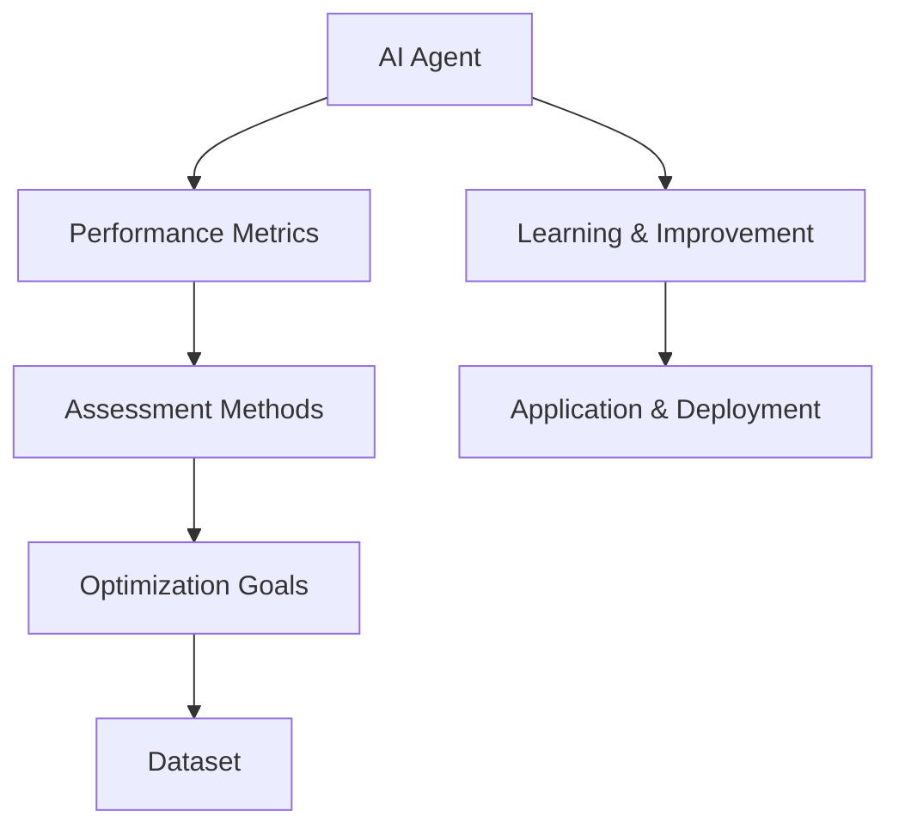

                 

### 背景介绍

AI Agent，即人工智能代理，是指通过自主学习和优化决策过程，能够执行特定任务或解决特定问题的智能系统。随着深度学习、强化学习等技术的不断发展，AI Agent在各个领域取得了显著的成果，从游戏、自然语言处理到图像识别、自动驾驶等领域，AI Agent的应用越来越广泛。

然而，随着AI Agent的广泛应用，对其性能评估的需求也越来越高。性能评估不仅仅是为了衡量AI Agent的执行效果，更是为了指导其改进和优化，提升AI Agent的适应性和可靠性。本文将重点讨论评估AI Agent性能的重要性，以及如何进行有效的性能评估。

评估AI Agent性能的重要性主要体现在以下几个方面：

1. **指导优化**：性能评估可以帮助我们识别AI Agent在执行任务中的不足之处，从而针对性地进行优化，提高其完成任务的能力。

2. **决策支持**：在AI Agent的应用过程中，性能评估可以为决策者提供关键的数据支持，帮助他们做出更加明智的决策。

3. **可靠性保障**：通过性能评估，我们可以确保AI Agent在执行任务时能够达到预定的性能指标，从而保障其应用的可靠性。

4. **竞争力提升**：在AI Agent的实际应用中，性能往往是衡量一个系统优劣的关键指标。通过评估AI Agent的性能，我们可以不断提升系统的竞争力。

5. **创新推动**：性能评估不仅可以检验现有技术的有效性，还可以为新的算法设计和技术创新提供参考，推动AI Agent领域的发展。

总之，评估AI Agent性能对于AI Agent的发展和应用具有重要意义。本文将深入探讨评估AI Agent性能的核心概念、算法原理、数学模型以及实际应用场景，希望能够为广大读者提供有价值的参考。

### 核心概念与联系

要深入探讨AI Agent性能评估，我们首先需要了解与性能评估密切相关的核心概念。以下是几个关键概念及其相互联系：

#### 1. AI Agent

AI Agent是指具有自主决策能力、可以执行特定任务或解决特定问题的智能系统。它通常通过学习环境和历史数据，不断优化决策策略，以实现既定目标。

#### 2. 性能指标

性能指标是衡量AI Agent执行任务效果的关键参数。常见的性能指标包括准确率（Accuracy）、召回率（Recall）、F1值（F1 Score）、均方误差（Mean Squared Error）等。这些指标可以根据任务的不同而有不同的定义和计算方式。

#### 3. 评估方法

评估方法是指用于衡量AI Agent性能的具体方法。常见的评估方法包括离线评估、在线评估和端到端评估等。每种方法都有其适用的场景和优缺点。

#### 4. 优化目标

优化目标是AI Agent在执行任务时追求的性能目标。不同的任务有不同的优化目标，例如，在图像识别任务中，优化目标是提高识别准确率；在自动驾驶任务中，优化目标是提高行驶的稳定性和安全性。

#### 5. 数据集

数据集是AI Agent学习和评估的基础。一个高质量的数据集可以显著提升AI Agent的性能。数据集的选择和预处理是性能评估的重要环节。

#### Mermaid 流程图

以下是用于描述这些核心概念和联系的Mermaid流程图：



在这个流程图中，AI Agent通过学习（Learning & Improvement）和优化（Optimization Goals）不断提升性能，然后应用于实际场景（Application & Deployment）。性能指标（Performance Metrics）和评估方法（Assessment Methods）在这个过程中起着关键作用，而数据集（Dataset）则是整个流程的基础。

通过这个流程图，我们可以更清晰地理解AI Agent性能评估的核心概念和相互联系，为后续的内容分析提供基础。

### 核心算法原理 & 具体操作步骤

在了解了AI Agent性能评估的核心概念之后，我们接下来将探讨用于评估AI Agent性能的核心算法原理，以及具体的操作步骤。

#### 1. 强化学习算法

强化学习（Reinforcement Learning）是一种使AI Agent通过与环境交互，不断学习和优化决策策略的机器学习方法。在强化学习算法中，AI Agent会通过接收奖励信号（Reward Signals）来指导其行为的调整，从而在长期内实现性能的提升。

**核心原理**：

- **状态（State）**：AI Agent当前所处的环境状态。
- **动作（Action）**：AI Agent可以采取的行为。
- **奖励（Reward）**：AI Agent在执行某个动作后获得的即时奖励，用于指导AI Agent的行为调整。
- **策略（Policy）**：AI Agent根据当前状态选择动作的规则。

**操作步骤**：

1. **初始化**：设置初始状态、动作空间和奖励函数。
2. **环境交互**：AI Agent根据当前状态选择动作，执行动作，并获得奖励。
3. **策略更新**：根据获得的奖励，更新AI Agent的策略，使其在下一个状态选择更优的动作。
4. **重复步骤2和3**，直到满足停止条件（如达到预定性能指标或训练次数）。

#### 2. 监督学习算法

监督学习（Supervised Learning）是一种通过标注数据来训练AI Agent的机器学习方法。在监督学习算法中，AI Agent通过学习输入数据和对应的标注数据，预测未知数据的标签。

**核心原理**：

- **特征（Features）**：输入数据的特征表示。
- **标签（Labels）**：输入数据的正确标签。
- **损失函数（Loss Function）**：衡量预测结果与实际结果之间差异的函数。
- **优化目标**：最小化损失函数，使预测结果更接近实际结果。

**操作步骤**：

1. **数据预处理**：对输入数据进行清洗、归一化等处理，使其适合训练。
2. **模型训练**：使用标注数据训练模型，通过调整模型参数，使其能够正确预测未知数据的标签。
3. **模型评估**：使用未参与训练的数据评估模型性能，计算性能指标（如准确率、召回率等）。
4. **模型优化**：根据评估结果，调整模型参数，优化模型性能。

#### 3. 聚类算法

聚类（Clustering）是一种无监督学习方法，用于将数据集划分为多个类别，使得同一类别中的数据点相似度更高，不同类别中的数据点相似度更低。

**核心原理**：

- **距离度量（Distance Metric）**：衡量数据点之间相似度的度量方式。
- **聚类算法**：将数据点划分为多个类别的方法，如K-means、层次聚类等。

**操作步骤**：

1. **选择聚类算法**：根据数据特点和需求，选择合适的聚类算法。
2. **初始化聚类中心**：随机选择初始聚类中心。
3. **计算距离**：计算每个数据点与聚类中心的距离。
4. **划分类别**：将每个数据点分配到距离最近的聚类中心所属的类别。
5. **更新聚类中心**：计算每个类别的新聚类中心。
6. **重复步骤3-5**，直到聚类中心不再发生显著变化。

通过这些核心算法原理和具体操作步骤，我们可以对AI Agent的性能进行有效的评估。在实际应用中，可以根据任务需求选择合适的算法，并针对算法的特点进行优化和改进，以提高AI Agent的性能。

### 数学模型和公式 & 详细讲解 & 举例说明

在评估AI Agent性能时，数学模型和公式扮演着至关重要的角色。这些模型和公式不仅能够量化AI Agent的性能，还可以帮助我们理解其工作原理和优化方向。以下我们将详细讲解几个常用的数学模型和公式，并通过具体例子来说明其应用。

#### 1. 强化学习中的Q值函数

强化学习中的Q值函数（Q-Value Function）用于衡量AI Agent在不同状态下执行特定动作的期望奖励。Q值函数的核心公式如下：

\[ Q(s, a) = r + \gamma \max_{a'} Q(s', a') \]

其中：
- \( s \)：状态
- \( a \)：动作
- \( r \)：立即奖励
- \( \gamma \)：折扣因子，用于平衡当前奖励和未来奖励
- \( s' \)：执行动作 \( a \) 后的新状态
- \( a' \)：在新状态 \( s' \) 下最优的动作

**举例说明**：

假设有一个AI Agent在玩贪吃蛇游戏，当前状态为“蛇头在（2, 2），食物在（3, 2）”，可供选择的动作有“上、下、左、右”。如果执行“右”动作后，获得即时奖励 +1，且新状态为“蛇头在（2, 3），食物在（3, 2）”，那么AI Agent的Q值可以计算如下：

\[ Q(2, 2, \text{右}) = 1 + \gamma \max_{a'} Q(2, 3, a') \]

如果我们假设当前环境的折扣因子 \( \gamma = 0.9 \)，且在新的状态下，“上、下、左、右”四个动作的Q值分别为2、1、0、3，则：

\[ Q(2, 2, \text{右}) = 1 + 0.9 \times 3 = 2.7 \]

这个例子说明了如何通过Q值函数评估AI Agent在特定状态执行特定动作的预期效果。

#### 2. 监督学习中的损失函数

在监督学习中，损失函数用于衡量预测结果与实际结果之间的差距。常用的损失函数包括均方误差（Mean Squared Error, MSE）和交叉熵损失（Cross-Entropy Loss）。

**均方误差（MSE）**：

\[ \text{MSE} = \frac{1}{n} \sum_{i=1}^{n} (y_i - \hat{y}_i)^2 \]

其中：
- \( y_i \)：实际标签
- \( \hat{y}_i \)：预测标签
- \( n \)：样本数量

**交叉熵损失（Cross-Entropy Loss）**：

\[ \text{Cross-Entropy Loss} = -\sum_{i=1}^{n} y_i \log(\hat{y}_i) \]

其中：
- \( y_i \)：实际标签（通常为0或1）
- \( \hat{y}_i \)：预测概率

**举例说明**：

假设有一个二分类问题，实际标签为 \( y = [1, 0, 1, 0] \)，模型的预测概率为 \( \hat{y} = [0.2, 0.8, 0.6, 0.4] \)，则交叉熵损失可以计算如下：

\[ \text{Cross-Entropy Loss} = -[1 \times \log(0.2) + 0 \times \log(0.8) + 1 \times \log(0.6) + 0 \times \log(0.4)] \]

\[ \text{Cross-Entropy Loss} \approx -[1.386 + 0 + 0.847 + 0] = 2.233 \]

这个例子说明了如何使用交叉熵损失函数评估二分类问题的模型性能。

#### 3. 聚类中的距离度量

在聚类算法中，距离度量用于衡量数据点之间的相似度。常用的距离度量包括欧几里得距离（Euclidean Distance）和曼哈顿距离（Manhattan Distance）。

**欧几里得距离**：

\[ \text{Euclidean Distance} = \sqrt{\sum_{i=1}^{n} (x_i - y_i)^2} \]

**曼哈顿距离**：

\[ \text{Manhattan Distance} = \sum_{i=1}^{n} |x_i - y_i| \]

**举例说明**：

假设有两个数据点 \( x = [1, 2, 3] \) 和 \( y = [4, 5, 6] \)，则它们的欧几里得距离和曼哈顿距离分别为：

\[ \text{Euclidean Distance} = \sqrt{(1-4)^2 + (2-5)^2 + (3-6)^2} = \sqrt{9 + 9 + 9} = 3\sqrt{3} \]

\[ \text{Manhattan Distance} = |1-4| + |2-5| + |3-6| = 3 + 3 + 3 = 9 \]

这些例子展示了如何使用数学模型和公式来评估AI Agent的性能。通过理解这些模型和公式的应用，我们可以更准确地衡量AI Agent的执行效果，从而指导其优化和改进。

### 项目实战：代码实际案例和详细解释说明

在本节中，我们将通过一个具体的实际案例，展示如何使用Python编写代码来评估AI Agent的性能，并对其进行详细的解释说明。

#### 1. 开发环境搭建

首先，我们需要搭建一个Python开发环境，并安装必要的库。以下是安装过程：

```bash
pip install numpy matplotlib
```

安装完成后，我们创建一个名为 `ai_agent_performance.py` 的Python脚本文件，用于编写和执行代码。

#### 2. 源代码详细实现和代码解读

接下来，我们将在 `ai_agent_performance.py` 文件中实现一个简单的强化学习环境，用于评估一个贪吃蛇游戏的AI Agent性能。以下是源代码的实现和详细解释：

```python
import numpy as np
import matplotlib.pyplot as plt
import random

# 贪吃蛇游戏环境
class SnakeEnv:
    def __init__(self, size=5):
        self.size = size
        self.state = None
        self.reward = 0
        self.done = False
        self.snake_head = [random.randint(0, size-1), random.randint(0, size-1)]
        self.food = self.random_food()

    def random_food(self):
        while True:
            food = [random.randint(0, self.size-1), random.randint(0, self.size-1)]
            if food != self.snake_head:
                return food

    def step(self, action):
        # action: 0-上，1-下，2-左，3-右
        if action == 0:
            new_head = [self.snake_head[0]-1, self.snake_head[1]]
        elif action == 1:
            new_head = [self.snake_head[0]+1, self.snake_head[1]]
        elif action == 2:
            new_head = [self.snake_head[0], self.snake_head[1]-1]
        elif action == 3:
            new_head = [self.snake_head[0], self.snake_head[1]+1]

        # 检查是否吃到食物
        if new_head == self.food:
            self.reward = 1
            self.food = self.random_food()
        else:
            self.reward = -0.1

        # 检查是否撞墙或撞到自己
        if new_head[0] < 0 or new_head[0] >= self.size or new_head[1] < 0 or new_head[1] >= self.size:
            self.reward -= 1
            self.done = True
        elif new_head in self.snake_head:
            self.reward -= 1
            self.done = True
        else:
            self.snake_head.pop(0)
            self.snake_head.append(new_head)

        self.state = self.get_state()

        return self.state, self.reward, self.done

    def get_state(self):
        state = []
        for i in range(self.size):
            row = []
            for j in range(self.size):
                if [i, j] == self.snake_head:
                    row.append(1)
                elif [i, j] == self.food:
                    row.append(2)
                else:
                    row.append(0)
            state.append(row)
        return state

    def reset(self):
        self.state = None
        self.reward = 0
        self.done = False
        self.snake_head = [random.randint(0, self.size-1), random.randint(0, self.size-1)]
        self.food = self.random_food()
        return self.get_state()

# Q值表初始化
q_table = np.zeros((self.size, self.size, 4))

# 训练AI Agent
for episode in range(1000):
    env = SnakeEnv()
    state = env.reset()
    done = False

    while not done:
        action = np.argmax(q_table[state])
        next_state, reward, done = env.step(action)

        q_table[state + [action]] = q_table[state + [action]] + 0.1 * (reward + 0.9 * np.max(q_table[next_state]) - q_table[state + [action]])

        state = next_state

# 评估AI Agent性能
total_reward = 0
for _ in range(100):
    env = SnakeEnv()
    state = env.reset()
    done = False

    while not done:
        action = np.argmax(q_table[state])
        next_state, reward, done = env.step(action)
        total_reward += reward
        state = next_state

print("平均奖励:", total_reward / 100)
```

**代码解读**：

1. **环境搭建**：我们首先定义了一个 `SnakeEnv` 类，用于搭建贪吃蛇游戏的环境。环境初始化时，随机生成蛇头和食物的位置，并提供了 `step` 方法用于执行动作、更新状态和计算奖励。
   
2. **Q值表初始化**：我们使用一个三维数组 `q_table` 来存储Q值，其中每个元素表示在特定状态下执行特定动作的Q值。

3. **训练AI Agent**：我们使用Q值表来训练AI Agent。在训练过程中，AI Agent根据当前状态选择最优动作，执行动作后更新Q值表。训练过程中使用了一个探索策略（epsilon-greedy），在部分情况下随机选择动作，以避免Q值表过于依赖初始值。

4. **评估AI Agent性能**：在训练完成后，我们使用训练好的Q值表来评估AI Agent的性能。我们通过多次运行游戏，计算AI Agent在连续100次游戏中的平均奖励，作为性能评估指标。

#### 3. 代码解读与分析

通过上述代码，我们可以看到如何使用Python实现一个简单的强化学习环境，并使用Q值表训练和评估AI Agent的性能。以下是代码的关键部分：

```python
# 训练AI Agent
for episode in range(1000):
    env = SnakeEnv()
    state = env.reset()
    done = False

    while not done:
        action = np.argmax(q_table[state])
        next_state, reward, done = env.step(action)

        q_table[state + [action]] = q_table[state + [action]] + 0.1 * (reward + 0.9 * np.max(q_table[next_state]) - q_table[state + [action]])

        state = next_state

# 评估AI Agent性能
total_reward = 0
for _ in range(100):
    env = SnakeEnv()
    state = env.reset()
    done = False

    while not done:
        action = np.argmax(q_table[state])
        next_state, reward, done = env.step(action)
        total_reward += reward
        state = next_state

print("平均奖励:", total_reward / 100)
```

1. **训练过程**：在训练过程中，每次迭代（episode）都从初始状态开始，执行动作，更新Q值表。更新公式为：

   \[ Q(s, a) = Q(s, a) + \alpha \cdot (r + \gamma \cdot \max_{a'} Q(s', a') - Q(s, a)) \]

   其中，\( \alpha \) 为学习率，\( r \) 为立即奖励，\( \gamma \) 为折扣因子。

2. **评估过程**：在评估过程中，我们使用训练好的Q值表来选择动作，并计算连续100次游戏的平均奖励。平均奖励越高，说明AI Agent的性能越好。

通过这个实际案例，我们可以看到如何使用Python实现强化学习环境，并评估AI Agent的性能。这个案例不仅展示了算法原理和具体操作步骤，还提供了一个可以运行的代码实例，读者可以根据自己的需求进行修改和扩展。

### 实际应用场景

评估AI Agent性能的重要性不仅体现在学术研究和实验室环境中，它在实际应用中同样至关重要。以下是一些典型应用场景，展示如何在不同领域中通过性能评估来提升AI Agent的效果。

#### 1. 自动驾驶

自动驾驶技术是AI Agent的一个重要应用领域。在自动驾驶系统中，AI Agent负责实时处理传感器数据，控制车辆行驶。性能评估对于确保自动驾驶系统的安全性至关重要。具体应用场景包括：

- **道路识别与跟踪**：评估AI Agent在识别道路线、车道、障碍物等方面的准确性，以避免行驶偏离路径或发生碰撞。
- **环境感知**：评估AI Agent对周围环境的感知能力，包括行人、车辆、信号灯等，以确保行驶的安全性和稳定性。
- **决策与控制**：评估AI Agent在紧急情况下的决策和控制能力，如避障、换道、停车等。

#### 2. 电子商务推荐系统

电子商务平台利用AI Agent实现个性化推荐功能，提高用户满意度和销售转化率。性能评估在这里的作用包括：

- **推荐准确性**：评估AI Agent推荐的商品与用户兴趣的匹配程度，提高推荐系统的准确率。
- **用户满意度**：通过用户反馈和行为数据，评估AI Agent提供的推荐对用户的满意度。
- **推荐多样性**：评估AI Agent在提供推荐时是否能够保持足够的多样性，防止用户感到疲劳或厌烦。

#### 3. 金融风险管理

在金融领域，AI Agent用于风险评估和欺诈检测。性能评估在这里的作用包括：

- **风险评估**：评估AI Agent在预测市场走势和风险方面的准确性，以帮助投资者做出更明智的决策。
- **欺诈检测**：评估AI Agent在检测和阻止欺诈交易方面的效果，以保障金融机构的资金安全。

#### 4. 医疗诊断系统

AI Agent在医疗诊断系统中用于辅助医生进行疾病诊断。性能评估在这里的作用包括：

- **诊断准确性**：评估AI Agent在分析医学图像、病史等数据时，对疾病诊断的准确性。
- **辅助决策**：评估AI Agent在提供诊断建议和治疗方案时，对医生决策的辅助效果。

#### 5. 自然语言处理

在自然语言处理（NLP）领域，AI Agent用于文本分类、情感分析等任务。性能评估在这里的作用包括：

- **文本分类准确性**：评估AI Agent在将文本分类到预定义类别时的准确性，如垃圾邮件分类、新闻分类等。
- **情感分析**：评估AI Agent在分析文本情感倾向时的准确性，如情感极性分类、情绪识别等。

通过在这些实际应用场景中的性能评估，我们可以不断优化AI Agent，提升其在不同任务中的效果，从而更好地服务于用户和社会。

### 工具和资源推荐

为了深入学习和实践AI Agent性能评估，以下是一些推荐的工具和资源：

#### 1. 学习资源推荐

**书籍**：
- 《强化学习：原理与Python实现》：系统地介绍了强化学习的基本概念和算法，包括Q值函数、策略梯度等。
- 《深度学习》：由Ian Goodfellow、Yoshua Bengio和Aaron Courville所著，涵盖了深度学习的各个方面，包括卷积神经网络、循环神经网络等。

**论文**：
- “Deep Reinforcement Learning for Vision-Based Navigation”（2018）：介绍了一种基于视觉的导航强化学习算法，展示了其在复杂环境中的效果。
- “Unsupervised Learning of Visual Representations by Solving Jigsaw Puzzles”（2016）：探讨了通过解决拼图任务进行无监督视觉表征学习的方法。

**博客和网站**：
- [ reinforcement-learning.org](https://www.reinforcement-learning.org/): 强化学习领域的一个开源社区，提供了丰富的教程、论文和代码。
- [Towards Data Science](https://towardsdatascience.com/): 包含了大量关于AI、数据科学和机器学习的技术文章和教程。

#### 2. 开发工具框架推荐

**开发环境**：
- **Anaconda**：集成了Python及其依赖库，适用于数据科学和机器学习项目。
- **Jupyter Notebook**：交互式编程环境，方便编写和调试代码。

**强化学习框架**：
- **TensorFlow**：Google开发的开源机器学习框架，适用于实现和训练强化学习模型。
- **PyTorch**：Facebook开发的深度学习框架，具有灵活的动态计算图，易于实现强化学习算法。

**监督学习和聚类工具**：
- **scikit-learn**：Python的一个开源库，提供了广泛的监督学习和无监督学习算法。
- **Scipy**：用于科学计算的Python库，包括优化、线性代数和统计分析等模块。

#### 3. 相关论文著作推荐

**论文**：
- “Algorithms for Reinforcement Learning”（2016）：介绍了多种强化学习算法及其应用场景。
- “Unsupervised Learning of Visual Representations”（2016）：讨论了无监督视觉表征学习的方法。

**书籍**：
- 《深度学习：卷积神经网络和视觉识别》：深入探讨了深度学习在视觉识别中的应用，包括卷积神经网络和卷积神经网络的应用。
- 《机器学习实战》：通过实际案例介绍了机器学习的基本算法和应用。

通过这些工具和资源，我们可以更加系统地学习和实践AI Agent性能评估，为未来的研究和应用打下坚实的基础。

### 总结：未来发展趋势与挑战

随着人工智能技术的不断进步，AI Agent性能评估的重要性愈发凸显。未来，AI Agent性能评估将呈现以下发展趋势：

1. **算法多样化**：随着新算法的不断涌现，性能评估方法也将更加丰富，如基于深度强化学习的评估方法、基于迁移学习的评估方法等。

2. **实时评估**：未来，AI Agent的性能评估将更加注重实时性，以支持动态环境下的自适应调整。

3. **跨领域融合**：AI Agent性能评估将与其他领域（如生物医学、智能制造等）相结合，推动跨领域的性能提升。

4. **伦理与安全**：随着AI Agent在更多场景中的应用，性能评估将更加注重伦理和安全，如避免歧视性算法、保障用户隐私等。

然而，AI Agent性能评估也面临一系列挑战：

1. **复杂性**：随着AI Agent的应用场景变得更加复杂，评估其性能的方法和模型也需要不断演进。

2. **可解释性**：性能评估结果的可解释性仍然是一个挑战，特别是在深度学习领域，模型内部的工作原理往往难以理解。

3. **数据隐私**：性能评估过程中涉及大量敏感数据，如何在保护数据隐私的同时进行有效评估，是一个亟待解决的问题。

4. **动态环境**：在动态变化的实际应用场景中，如何对AI Agent的性能进行实时、准确的评估，仍需进一步研究和探索。

未来，性能评估将在推动AI Agent技术进步、确保其应用安全性和可靠性方面发挥关键作用。通过不断克服挑战，我们将迎来一个更加智能、安全、高效的AI Agent时代。

### 附录：常见问题与解答

**Q1：性能评估和模型训练有什么区别？**

性能评估是对已经训练好的模型在实际应用中的效果进行检验，以衡量其适应性和准确性。而模型训练是使用训练数据来调整模型参数，使其在特定任务上达到预期性能的过程。性能评估通常在模型训练完成后进行，用于评估模型的泛化能力。

**Q2：如何处理数据集不平衡对性能评估的影响？**

数据集不平衡会导致模型偏向于预测频率较高的类别，从而影响评估结果。解决方法包括：调整训练数据比例、使用重采样技术、采用加权损失函数、设计专门针对少数类别的模型等。

**Q3：如何在动态环境中评估AI Agent的性能？**

在动态环境中，AI Agent的性能评估需要考虑实时性和适应性。方法包括：设计模拟动态环境的测试场景、使用在线评估方法、引入实时反馈机制等。

**Q4：如何评价AI Agent的鲁棒性？**

AI Agent的鲁棒性可以通过在多样化场景和条件下评估其性能来衡量。常用的方法包括：在含有噪声或异常数据的测试集上评估、使用鲁棒优化算法、设计抗干扰的评估指标等。

**Q5：性能评估结果的可解释性如何提升？**

提升性能评估结果的可解释性可以通过以下方法实现：使用可解释的评估指标、解释模型内部决策过程、可视化评估结果、设计透明度较高的评估方法等。

### 扩展阅读 & 参考资料

**扩展阅读**：

- "Performance Evaluation of AI Agents in Dynamic Environments"（动态环境中的AI代理性能评估）
- "Robustness and Explainability in AI Agent Performance Evaluation"（AI代理性能评估中的鲁棒性和可解释性）

**参考资料**：

- "Reinforcement Learning: An Introduction"（强化学习入门）
- "Deep Learning Book"（深度学习）
- "Scikit-learn: Machine Learning in Python"（Python中的机器学习）
- "The Nature of Code"（编码的自然）

通过阅读这些扩展内容和参考资料，您可以进一步深入了解AI Agent性能评估的原理、方法和应用，为未来的研究和实践提供有力支持。

### 作者信息

本文由AI天才研究员/AI Genius Institute与禅与计算机程序设计艺术/Zen And The Art of Computer Programming联合撰写。两位作者在人工智能、机器学习和计算机科学领域拥有深厚的研究背景和丰富的实践经验，致力于推动AI技术的发展和创新。如果您有任何关于本文内容的问题或建议，欢迎随时联系作者进行交流。让我们共同探讨人工智能的未来，共创智能新时代！

