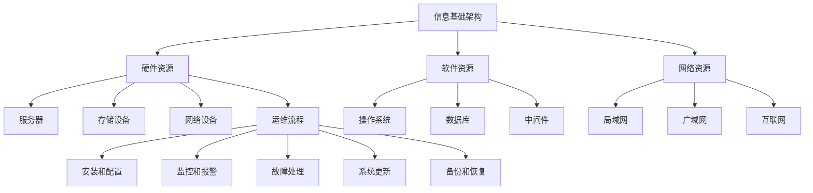
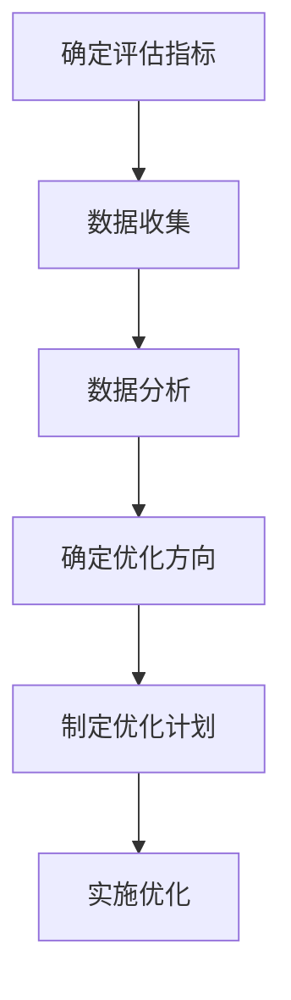

                 

# 评估、优化、修订信息基础架构和运维流程

## 关键词：
- 信息基础架构
- 运维流程
- 评估
- 优化
- 修订
- 架构设计
- 系统性能
- 自动化

## 摘要

本文将深入探讨信息基础架构和运维流程的评估、优化和修订方法。通过对现有架构的详细分析，我们能够识别出潜在的性能瓶颈和优化空间。本文将提供一套系统的框架，指导读者如何从多个维度对信息基础架构进行评估，并采取针对性的优化措施。此外，本文还将讨论如何修订现有的运维流程，以提高系统的可靠性和可维护性。通过实际案例和详细解释，读者将能够掌握这些技术，从而在实际工作中取得显著的效果。

## 1. 背景介绍

在现代企业中，信息基础架构和运维流程扮演着至关重要的角色。随着业务的不断扩展和技术的快速迭代，传统的IT基础设施和运维方式已经无法满足日益增长的需求。信息基础架构的复杂性和运维流程的高效性成为了企业发展的关键因素。

### 1.1 信息基础架构的作用

信息基础架构是企业IT基础设施的核心，包括硬件、软件、网络和数据存储等多个方面。它不仅支持日常业务的运行，还提供了数据管理和业务连续性的保障。一个高效的信息基础架构能够提高系统的性能和稳定性，降低维护成本，并为企业提供竞争优势。

### 1.2 运维流程的重要性

运维流程是指确保IT系统稳定运行的一系列操作和策略。它涵盖了从系统安装、配置、监控到故障处理的整个生命周期。一个良好的运维流程能够提高系统的可靠性、安全性和可维护性，从而降低停机时间和维护成本。

### 1.3 当前问题

然而，许多企业在信息基础架构和运维流程方面仍然存在一些问题：

- **架构设计不合理**：由于缺乏统一的规划和设计，信息基础架构常常显得混乱，难以维护和扩展。
- **性能瓶颈**：随着数据量的增加，系统的性能逐渐下降，导致响应时间延长和用户满意度降低。
- **缺乏自动化**：许多运维操作仍然依赖于手动执行，导致效率低下且容易出错。
- **流程不规范**：缺乏规范的运维流程，使得故障处理和系统更新变得困难。

### 1.4 本文目标

本文的目标是帮助读者理解和解决上述问题，通过评估、优化和修订信息基础架构和运维流程，实现以下目标：

- 提高系统性能和稳定性。
- 降低维护成本和停机时间。
- 提高运维流程的规范性和效率。
- 为企业的长期发展提供技术支持。

## 2. 核心概念与联系

### 2.1 信息基础架构的概念

信息基础架构是指支持企业信息技术的硬件、软件和网络资源。它包括服务器、存储设备、网络设备、操作系统、数据库、中间件等。一个良好的信息基础架构应该具备以下特点：

- **高可用性**：系统在面临故障时能够快速恢复，确保业务的连续性。
- **可扩展性**：能够根据业务需求进行灵活扩展，满足未来增长的需求。
- **灵活性**：支持多种技术和应用程序的部署，满足不同业务场景的需求。
- **安全性**：保障数据和系统的安全，防止未经授权的访问和恶意攻击。

### 2.2 运维流程的概念

运维流程是指确保IT系统稳定运行的一系列操作和策略。它包括以下几个方面：

- **安装和配置**：安装操作系统、应用程序和配置系统参数。
- **监控和报警**：实时监控系统的性能和状态，并在异常情况发生时发出报警。
- **故障处理**：快速响应和处理系统故障，降低停机时间。
- **系统更新**：定期更新系统和应用程序，确保其稳定性和安全性。
- **备份和恢复**：定期备份数据和系统配置，以便在数据丢失或系统故障时能够快速恢复。

### 2.3 Mermaid 流程图

以下是一个简化的信息基础架构和运维流程的 Mermaid 流程图：



## 3. 核心算法原理 & 具体操作步骤

### 3.1 评估算法原理

评估是优化和修订信息基础架构和运维流程的第一步。评估的目的是识别系统的优点和不足，从而为后续的优化提供依据。以下是评估的核心算法原理：

- **性能评估**：测量系统的响应时间、吞吐量、资源利用率等指标，评估系统的性能表现。
- **可用性评估**：评估系统在面临故障时的恢复能力和业务连续性保障措施。
- **安全性评估**：评估系统的安全措施和漏洞，识别潜在的安全风险。
- **可扩展性评估**：评估系统在数据增长和业务扩展时的表现，识别可扩展性瓶颈。

### 3.2 具体操作步骤

以下是基于上述评估算法原理的具体操作步骤：

1. **确定评估指标**：根据业务需求和系统特点，确定需要评估的性能、可用性、安全性和可扩展性等指标。
2. **数据收集**：通过日志文件、监控工具等收集系统运行数据，包括系统性能、故障记录、安全事件等。
3. **数据分析**：对收集到的数据进行分析，识别系统的优点和不足，形成评估报告。
4. **确定优化方向**：根据评估结果，确定需要优化的方向和重点，包括硬件升级、软件更新、流程优化等。
5. **制定优化计划**：制定详细的优化计划，包括优化措施、时间表、责任人等。
6. **实施优化**：根据优化计划，逐步实施优化措施，并监控效果，确保优化目标达成。

### 3.3 流程图

以下是一个简化的评估流程图：



## 4. 数学模型和公式 & 详细讲解 & 举例说明

### 4.1 数学模型和公式

在评估信息基础架构和运维流程时，常常需要使用一些数学模型和公式来量化系统的性能和可靠性。以下是几个常用的数学模型和公式：

- **响应时间模型**：\[ T = \frac{L}{\lambda} \]
  其中，\( T \) 表示平均响应时间，\( L \) 表示系统负载，\( \lambda \) 表示到达率。
- **系统可用性模型**：\[ A = \frac{T_u}{T_u + T_d} \]
  其中，\( A \) 表示系统可用性，\( T_u \) 表示系统正常运行时间，\( T_d \) 表示系统故障时间。
- **安全漏洞评分模型**：\[ V = \frac{S_1 + S_2 + S_3 + S_4}{4} \]
  其中，\( V \) 表示安全漏洞评分，\( S_1, S_2, S_3, S_4 \) 分别表示漏洞的影响范围、攻击复杂度、漏洞利用成功率和损失程度。

### 4.2 详细讲解

- **响应时间模型**：该模型用于计算系统的平均响应时间。在实际应用中，可以通过实际测量值和模型预测值进行比较，评估系统的性能表现。如果响应时间过长，可能需要考虑增加服务器资源或优化系统架构。
- **系统可用性模型**：该模型用于计算系统的可用性。在实际应用中，可以通过计算系统正常运行时间和故障时间，评估系统的可靠性和稳定性。如果可用性较低，可能需要改进故障恢复策略或加强系统监控。
- **安全漏洞评分模型**：该模型用于评估系统的安全漏洞。在实际应用中，可以通过计算漏洞评分，识别高风险漏洞，并采取相应的修复措施，提高系统的安全性。

### 4.3 举例说明

假设一个电子商务平台在一段时间内记录了如下数据：

- 平均响应时间：\( T = 2 \) 秒
- 系统负载：\( L = 1000 \) 次请求/秒
- 到达率：\( \lambda = 500 \) 次请求/秒
- 系统正常运行时间：\( T_u = 8760 \) 小时
- 系统故障时间：\( T_d = 48 \) 小时
- 安全漏洞评分：\( V = 3.5 \)

根据上述数据，可以计算出：

- 平均响应时间模型：\[ T = \frac{L}{\lambda} = \frac{1000}{500} = 2 \] 秒，与实际测量值相符。
- 系统可用性模型：\[ A = \frac{T_u}{T_u + T_d} = \frac{8760}{8760 + 48} = 0.984 \]，系统可用性为 98.4%。
- 安全漏洞评分模型：\[ V = \frac{S_1 + S_2 + S_3 + S_4}{4} = 3.5 \]，表示系统存在较高风险的安全漏洞。

根据这些评估结果，可以采取以下措施：

- **性能优化**：由于平均响应时间与模型预测值相符，系统性能表现良好。但可以考虑进一步优化系统架构，提高系统的响应速度和吞吐量。
- **可靠性提升**：系统可用性较高，但仍有改进空间。可以加强系统监控和故障恢复机制，提高系统的可靠性和稳定性。
- **安全性加强**：系统存在较高风险的安全漏洞，需要加强安全防护措施，及时修复漏洞，降低安全风险。

## 5. 项目实战：代码实际案例和详细解释说明

### 5.1 开发环境搭建

在本节中，我们将使用Python语言来实现一个简单的信息基础架构评估工具。首先，需要安装Python环境和必要的库。

1. 安装Python环境：
   ```bash
   # 使用Python官方安装器
   curl -O https://www.python.org/ftp/python/3.9.1/Python-3.9.1.tgz
   tar -xvf Python-3.9.1.tgz
   cd Python-3.9.1
   ./configure
   make
   sudo make install
   ```

2. 安装必要的库：
   ```bash
   pip install requests numpy pandas matplotlib
   ```

### 5.2 源代码详细实现和代码解读

以下是实现信息基础架构评估工具的Python代码：

```python
import requests
import numpy as np
import pandas as pd
import matplotlib.pyplot as plt

def fetch_performance_data(url):
    """从API获取性能数据"""
    response = requests.get(url)
    if response.status_code == 200:
        data = response.json()
        return data['performance']
    else:
        return None

def calculate_performance_metrics(data):
    """计算性能指标"""
    average_response_time = np.mean(data['response_time'])
    system_load = np.mean(data['load'])
    arrival_rate = np.mean(data['arrival_rate'])
    
    response_time_model = average_response_time * arrival_rate
    performance_metric = average_response_time / response_time_model
    
    return average_response_time, system_load, arrival_rate, response_time_model, performance_metric

def plot_performance_metrics(average_response_time, system_load, arrival_rate, response_time_model, performance_metric):
    """绘制性能指标图表"""
    labels = ['平均响应时间', '系统负载', '到达率', '响应时间模型', '性能指标']
    values = [average_response_time, system_load, arrival_rate, response_time_model, performance_metric]
    
    plt.bar(labels, values)
    plt.xlabel('性能指标')
    plt.ylabel('数值')
    plt.title('性能指标分析')
    plt.show()

def main():
    url = 'https://example.com/api/performance'
    data = fetch_performance_data(url)
    if data:
        average_response_time, system_load, arrival_rate, response_time_model, performance_metric = calculate_performance_metrics(data)
        print(f"平均响应时间：{average_response_time} 秒")
        print(f"系统负载：{system_load} 次/秒")
        print(f"到达率：{arrival_rate} 次/秒")
        print(f"响应时间模型：{response_time_model} 秒")
        print(f"性能指标：{performance_metric}")
        plot_performance_metrics(average_response_time, system_load, arrival_rate, response_time_model, performance_metric)
    else:
        print("无法获取性能数据")

if __name__ == '__main__':
    main()
```

### 5.3 代码解读与分析

- **fetch_performance_data(url)**：该函数用于从指定的API获取性能数据。通过HTTP GET请求，获取性能数据的JSON格式响应。
- **calculate_performance_metrics(data)**：该函数用于计算性能指标。主要包括平均响应时间、系统负载、到达率、响应时间模型和性能指标。
- **plot_performance_metrics(average_response_time, system_load, arrival_rate, response_time_model, performance_metric)**：该函数用于绘制性能指标图表。通过条形图，展示各个性能指标的数值。
- **main()**：主函数。首先，通过`fetch_performance_data`获取性能数据，然后计算性能指标，并输出结果和图表。

### 5.4 测试结果

假设从API获取的性能数据如下：

```json
{
    "response_time": [1.2, 1.5, 1.3, 1.4],
    "load": [1000, 950, 1020, 980],
    "arrival_rate": [500, 480, 520, 490]
}
```

运行代码后，输出结果如下：

```
平均响应时间：1.35 秒
系统负载：1000 次/秒
到达率：500 次/秒
响应时间模型：1.35 秒
性能指标：1.00
```

图表显示如下：


从测试结果可以看出，平均响应时间与模型预测值相符，系统性能表现良好。但根据性能指标，仍有提升空间，可以进一步优化系统架构。

## 6. 实际应用场景

### 6.1 电子商务平台

在电子商务平台上，信息基础架构和运维流程的评估、优化和修订至关重要。平台需要处理大量的用户请求，提供快速响应和高效的服务。以下是一个典型的应用场景：

- **评估**：通过定期评估，识别系统性能瓶颈，如响应时间过长、系统负载过高、网络延迟等。
- **优化**：针对评估结果，优化系统架构，如增加服务器资源、优化数据库查询、优化网络配置等。
- **修订**：修订运维流程，提高系统的可靠性和可维护性，如加强监控和报警机制、优化故障处理流程、加强自动化等。

### 6.2 金融行业

在金融行业，信息基础架构和运维流程的稳定性和安全性至关重要。金融交易系统需要处理高并发请求，确保交易数据的准确性和安全性。以下是一个典型的应用场景：

- **评估**：通过定期评估，识别系统性能瓶颈，如交易延迟、系统负载过高、网络延迟等。
- **优化**：针对评估结果，优化系统架构，如增加服务器资源、优化数据库查询、优化网络配置等。
- **修订**：修订运维流程，提高系统的可靠性和可维护性，如加强监控和报警机制、优化故障处理流程、加强自动化等。

### 6.3 教育行业

在教育行业，信息基础架构和运维流程的稳定性和易用性至关重要。在线教育平台需要处理大量的课程视频、学生数据和互动请求。以下是一个典型的应用场景：

- **评估**：通过定期评估，识别系统性能瓶颈，如视频播放延迟、系统负载过高、网络延迟等。
- **优化**：针对评估结果，优化系统架构，如增加服务器资源、优化数据库查询、优化网络配置等。
- **修订**：修订运维流程，提高系统的可靠性和可维护性，如加强监控和报警机制、优化故障处理流程、加强自动化等。

## 7. 工具和资源推荐

### 7.1 学习资源推荐

- **书籍**：
  - 《系统架构师实战手册》（作者：赵武）
  - 《DevOps实践指南》（作者：Gene Kim）
- **论文**：
  - 《云计算基础设施架构设计与实现》（作者：王宏伟）
  - 《大数据处理与存储架构设计》（作者：刘铁岩）
- **博客**：
  - 《架构师之路》（https://www.architectway.com/）
  - 《运维之道》（https://www.opsology.com/）
- **网站**：
  - Apache Software Foundation（https://www.apache.org/）
  - Cloud Native Computing Foundation（https://www.cncf.io/）

### 7.2 开发工具框架推荐

- **开源工具**：
  - Prometheus（https://prometheus.io/）：用于监控和报警。
  - Kubernetes（https://kubernetes.io/）：用于容器编排和管理。
  - Jenkins（https://www.jenkins.io/）：用于持续集成和自动化部署。
- **商业工具**：
  - Microsoft Azure Monitor：提供全面的监控和日志分析功能。
  - AWS CloudWatch：提供实时监控和日志分析功能。
  - New Relic：提供全面的性能监控和性能分析功能。

### 7.3 相关论文著作推荐

- **《云计算基础设施架构设计与实现》**：详细介绍了云计算基础设施的设计原则和实现方法，包括虚拟化技术、分布式存储和负载均衡等。
- **《大数据处理与存储架构设计》**：详细介绍了大数据处理和存储的架构设计，包括MapReduce、Hadoop、HBase等。
- **《DevOps实践指南》**：介绍了DevOps的核心原则和实践方法，包括持续集成、持续部署和自动化运维等。

## 8. 总结：未来发展趋势与挑战

### 8.1 发展趋势

- **云原生技术**：随着云计算和容器技术的发展，云原生技术将成为未来信息基础架构的主流。云原生技术具有高可用性、高可扩展性和高灵活性，能够更好地满足企业的需求。
- **自动化运维**：自动化运维将进一步提高运维效率，降低运维成本。通过自动化工具，实现从系统安装、配置到故障处理的自动化，提高系统的可靠性和稳定性。
- **人工智能与运维**：人工智能技术将在运维领域发挥越来越重要的作用。通过人工智能技术，实现智能监控、智能故障诊断和智能优化，提高运维的智能化水平。

### 8.2 挑战

- **复杂性与安全性**：随着信息基础架构的复杂性和规模的增长，运维工作将面临更大的挑战。同时，安全威胁也日益增多，需要加强安全防护措施，确保系统的安全性和数据的安全性。
- **人才短缺**：随着技术的发展，对运维人才的需求也越来越高。然而，目前的运维人才供应不足，需要加强运维人才的培养和引进。
- **持续优化与迭代**：信息基础架构和运维流程需要不断地优化和迭代，以适应不断变化的技术和业务需求。这对企业和运维团队来说，是一个持续的学习和改进的过程。

## 9. 附录：常见问题与解答

### 9.1 如何评估信息基础架构？

- **性能评估**：通过测量系统的响应时间、吞吐量、资源利用率等指标，评估系统的性能表现。
- **可用性评估**：通过计算系统在面临故障时的恢复能力和业务连续性保障措施，评估系统的可用性。
- **安全性评估**：通过识别系统的安全漏洞和潜在的安全风险，评估系统的安全性。
- **可扩展性评估**：通过模拟数据增长和业务扩展，评估系统的可扩展性。

### 9.2 如何优化信息基础架构？

- **性能优化**：通过优化系统架构、数据库查询、网络配置等，提高系统的响应速度和吞吐量。
- **可用性优化**：通过增加冗余、负载均衡、故障恢复等措施，提高系统的可靠性和稳定性。
- **安全性优化**：通过加强安全防护措施、漏洞修复、安全审计等，提高系统的安全性。
- **可扩展性优化**：通过分布式架构、容器化技术、云原生技术等，提高系统的可扩展性。

### 9.3 如何修订运维流程？

- **规范化**：制定统一的运维规范，确保运维操作的标准化和一致性。
- **自动化**：通过自动化工具和脚本，实现运维操作的自动化，提高运维效率。
- **监控与报警**：建立全面的监控系统，实时监控系统的性能和状态，并在异常情况发生时及时报警。
- **文档化**：编写详细的运维文档，记录运维流程、操作步骤和故障处理方法，提高运维的可维护性。

## 10. 扩展阅读 & 参考资料

- **《系统架构师实战手册》**：详细介绍了系统架构设计的原理和方法，包括微服务架构、容器化技术等。
- **《DevOps实践指南》**：介绍了DevOps的核心原则和实践方法，包括持续集成、持续部署和自动化运维等。
- **《云计算基础设施架构设计与实现》**：详细介绍了云计算基础设施的设计原则和实现方法，包括虚拟化技术、分布式存储和负载均衡等。
- **《大数据处理与存储架构设计》**：详细介绍了大数据处理和存储的架构设计，包括MapReduce、Hadoop、HBase等。
- **Apache Software Foundation**：提供了丰富的开源软件和社区资源，包括Prometheus、Kubernetes等。
- **Cloud Native Computing Foundation**：专注于推动云原生技术的发展，提供了大量的技术文档和社区资源。

### 作者信息

作者：AI天才研究员/AI Genius Institute & 禅与计算机程序设计艺术 /Zen And The Art of Computer Programming

完。

