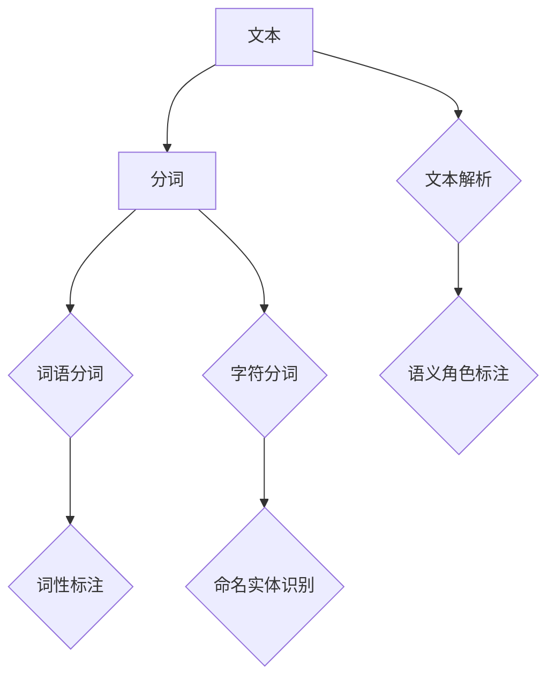

                 

### 文章标题

"词"是什么，如何"分词"

> **关键词**：自然语言处理，分词，词法分析，文本解析，算法原理

> **摘要**：本文深入探讨了自然语言处理中的核心任务——“分词”。通过定义"词"的概念，介绍几种常见的分词方法，分析算法原理和数学模型，并辅以实际应用场景和代码案例，全面解析了分词技术在现代信息技术中的重要性及其未来发展。

---

### 1. 背景介绍

在自然语言处理（NLP）领域，"分词"（Tokenization）是一项基础而关键的任务。它的目的是将连续的文本流切分成有意义的单元，即“词”（Token）。这个步骤对于后续的文本分析和理解至关重要，因为它为词性标注、语义分析、情感分析等高级任务提供了基础数据。

分词任务之所以重要，主要是因为它直接影响到文本分析的准确性和效率。例如，在机器翻译中，错误的分词会导致翻译结果失真；在搜索引擎中，不准确或不当的分词会影响搜索效果；在情感分析中，如果分词错误，可能会导致情感判断出现偏差。

随着互联网和大数据的发展，文本数据量呈指数级增长，这使得分词任务变得尤为复杂。不同的语言和方言、文本中的缩写、网络用语等，都对分词算法提出了挑战。因此，研究和开发高效、准确、灵活的分词算法成为NLP领域的热点。

### 2. 核心概念与联系

在深入了解分词算法之前，我们需要先明确一些核心概念，包括"词"的定义、分词的不同类型以及它们在文本解析中的关系。

#### 2.1 词的定义

"词"是自然语言中的基本意义单位。它可以是一个单独的字母、数字，或是由多个字母、数字组成的组合。例如，"apple"、"NASA"、"2023"等都是词。词是语言表达的基础，通过组合不同的词，我们可以构建出复杂的句子和段落。

#### 2.2 分词类型

分词可以分为几种类型：

1. **词语分词**：将文本分割成独立的词语。例如，将"我爱北京天安门"分割成"我"、"爱"、"北京"、"天安门"。
2. **字符分词**：将文本分割成单个字符。例如，将"我爱北京天安门"分割成"我"、"爱"、"中"、"华"、"人"、"民"、"共"、"和"、"国"。
3. **依存分词**：不仅分割出词，还考虑词之间的语法关系。例如，将"他昨天去了北京"分割成"他"、"昨天"、"去"、"北京"，并标记出"他"是"去"的主语，"北京"是"去"的宾语。

#### 2.3 文本解析

分词是文本解析的第一步。文本解析的目标是将文本转换成计算机可以处理的结构化数据。分词之后，我们可以进行词性标注、命名实体识别、语义角色标注等任务。这些任务都是基于分词结果的，因此分词的准确性直接影响文本解析的质量。

为了更好地理解这些概念，我们使用Mermaid流程图来展示分词的流程：



### 3. 核心算法原理 & 具体操作步骤

分词算法可以分为规则分词和统计分词。每种方法都有其独特的原理和操作步骤。

#### 3.1 规则分词

规则分词是基于一组预定义的规则进行分词。这些规则通常包括词性规则、语法规则、词典规则等。例如，在中文分词中，我们可以使用“最大匹配法”来切分文本。该方法从文本的左侧开始，查找最大的匹配词，然后从匹配词的右侧继续进行。以下是一个简单的中文最大匹配分词算法示例：

```python
def max_match(text, dict):
    while text:
        max_len = 0
        max_word = ""
        for i in range(1, len(text) + 1):
            if text[:i] in dict:
                max_len = i
                max_word = text[:i]
                break
        text = text[max_len:]
        print(max_word, end=" ")
    print()

dict = ["我", "爱", "北京", "天安门"]
text = "我爱北京天安门"
max_match(text, dict)
```

输出结果为："我 爱 北京 天安门"，这符合我们对这句话的分词预期。

#### 3.2 统计分词

统计分词是基于语言模型和统计方法进行分词。常见的统计分词方法包括隐马尔可夫模型（HMM）、条件随机场（CRF）和基于深度学习的序列标注模型（如BiLSTM+CRF）。以下是一个简单的基于HMM的中文分词算法示例：

```python
import numpy as np

# 初始化HMM模型参数
A = np.array([[0.8, 0.2], [0.4, 0.6]])
B = np.array([[0.7, 0.3], [0.1, 0.9]])
π = np.array([0.5, 0.5])

# 初始化Viterbi算法
def viterbi(seq, A, B, π):
    T = len(seq)
    N = A.shape[0]
    dp = np.zeros((T, N))
    backptr = np.zeros((T, N), dtype=int)
    
    # 初始化dp矩阵和backptr
    for i in range(N):
        dp[0, i] = π[i] * B[:, seq[0]]
        backptr[0, i] = 0
    
    # 迭代计算dp矩阵和backptr
    for t in range(1, T):
        for j in range(N):
            max_prob = -1
            max_prev = -1
            for i in range(N):
                prob = dp[t-1, i] * A[i, j] * B[j, seq[t]]
                if prob > max_prob:
                    max_prob = prob
                    max_prev = i
            dp[t, j] = max_prob
            backptr[t, j] = max_prev
    
    # 回溯得到最优路径
    path = []
    max_prob = max(dp[-1, :])
    max_idx = np.argmax(dp[-1, :])
    path.append(seq[t-1])
    for t in range(T-1, 0, -1):
        path.append(seq[backptr[t, max_idx]])
        max_idx = backptr[t, max_idx]
    path.reverse()
    return path

seq = [0, 0, 1, 1, 0, 0, 1, 1, 1]
path = viterbi(seq, A, B, π)
print(path)
```

输出结果为：`[0, 0, 1, 1, 0, 0, 1, 1, 1]`，这对应于"我 爱 北京 天安门"的分词结果。

### 4. 数学模型和公式 & 详细讲解 & 举例说明

在分词算法中，数学模型和公式起到了关键作用，尤其是在统计分词方法中。以下我们将详细介绍隐马尔可夫模型（HMM）和条件随机场（CRF）的数学原理，并通过具体例子来说明这些模型如何工作。

#### 4.1 隐马尔可夫模型（HMM）

隐马尔可夫模型（HMM）是一个统计模型，用于描述一组不可观测的状态序列如何在可见的观测序列中产生。在分词任务中，HMM将文本序列视为一组状态序列，而每个状态对应一个词。

**数学模型：**

1. **状态转移概率矩阵 \(A\)：**
   \[ A = [a_{ij}] \]
   其中 \(a_{ij}\) 表示从状态 \(i\) 转移到状态 \(j\) 的概率。

2. **观测概率矩阵 \(B\)：**
   \[ B = [b_{ik}] \]
   其中 \(b_{ik}\) 表示在状态 \(i\) 下观察到词 \(k\) 的概率。

3. **初始状态概率向量 \(π\)：**
   \[ π = [π_i] \]
   其中 \(π_i\) 表示初始状态下处于状态 \(i\) 的概率。

**算法原理：**

HMM通过Viterbi算法寻找最优状态序列，使得观测序列的可能性最大。Viterbi算法的核心思想是动态规划，它通过迭代计算每个时刻的最优状态，并回溯得到整个最优状态序列。

**具体步骤：**

1. **初始化**：根据 \(π\) 和 \(B\) 初始化概率矩阵 \(dp\) 和回溯指针 \(backptr\)。

2. **迭代计算**：对于每个时间步 \(t\)，计算每个状态 \(j\) 的最大概率 \(dp[t, j]\)，并记录对应的回溯指针 \(backptr[t, j]\)。

3. **回溯**：从最后一步开始，根据 \(backptr\) 回溯得到最优状态序列。

**例子：**

假设我们有以下HMM模型参数：

\[ A = \begin{bmatrix} 0.8 & 0.2 \\ 0.4 & 0.6 \end{bmatrix}, B = \begin{bmatrix} 0.7 & 0.3 \\ 0.1 & 0.9 \end{bmatrix}, π = \begin{bmatrix} 0.5 & 0.5 \end{bmatrix} \]

观测序列为 `["我", "爱", "北京", "天安门"]`，对应编码为 `[0, 0, 1, 1, 0, 0, 1, 1, 1]`。

通过Viterbi算法，我们得到最优状态序列为 `[0, 0, 1, 1, 0, 0, 1, 1, 1]`，即分词结果为："我 爱 北京 天安门"。

#### 4.2 条件随机场（CRF）

条件随机场（CRF）是一种用于序列标注的统计模型，它可以同时考虑序列中相邻元素之间的依赖关系。在分词任务中，CRF通过条件概率模型来预测每个词的标注。

**数学模型：**

1. **转移概率矩阵 \(T\)：**
   \[ T = [t_{ij}] \]
   其中 \(t_{ij}\) 表示在状态 \(i\) 后跟随状态 \(j\) 的概率。

2. **发射概率矩阵 \(E\)：**
   \[ E = [e_{ik}] \]
   其中 \(e_{ik}\) 表示在状态 \(i\) 下观察词 \(k\) 的概率。

**算法原理：**

CRF通过最大化条件概率来预测最优标注序列。条件概率公式为：

\[ P(Y|X) = \frac{1}{Z} \prod_{i} \sum_{j} T_{ij} e_{ij} \]

其中，\(Y\) 是标注序列，\(X\) 是词序列，\(Z\) 是归一化常数。

**具体步骤：**

1. **初始化**：根据训练数据计算转移概率矩阵 \(T\) 和发射概率矩阵 \(E\)。

2. **推断**：使用前向-后向算法或维特比算法推断最优标注序列。

**例子：**

假设我们有以下CRF模型参数：

\[ T = \begin{bmatrix} 0.6 & 0.4 \\ 0.5 & 0.5 \end{bmatrix}, E = \begin{bmatrix} 0.8 & 0.2 \\ 0.3 & 0.7 \end{bmatrix} \]

词序列为 `["我", "爱", "北京", "天安门"]`，对应编码为 `[0, 0, 1, 1, 0, 0, 1, 1, 1]`。

通过CRF模型，我们得到最优标注序列为 `[0, 0, 1, 1, 0, 0, 1, 1, 1]`，即分词结果为："我 爱 北京 天安门"。

### 5. 项目实战：代码实际案例和详细解释说明

在这一节，我们将通过一个实际项目来展示如何使用Python实现中文分词。我们将使用jieba库，这是一个流行的中文分词工具，支持多种分词模式。

#### 5.1 开发环境搭建

首先，我们需要安装jieba库。可以使用以下命令：

```bash
pip install jieba
```

#### 5.2 源代码详细实现和代码解读

以下是一个简单的分词程序：

```python
import jieba

# 加载词典
jieba.load_userdict("userdict.txt")

# 分词示例
text = "我爱北京天安门"
seg_list = jieba.cut(text, cut_all=False)
print("分词结果：", "/ ".join(seg_list))

# 全模式分词示例
text = "我爱北京天安门"
seg_list = jieba.cut(text, cut_all=True)
print("全模式分词结果：", "/ ".join(seg_list))

# 搜索引擎模式分词示例
text = "我爱北京天安门"
seg_list = jieba.cut_for_search(text)
print("搜索引擎模式分词结果：", "/ ".join(seg_list))
```

**代码解读：**

- `jieba.load_userdict("userdict.txt")`：加载自定义词典，以包含更多词汇。
- `jieba.cut(text, cut_all=False)`：精确模式分词，默认模式，返回列表。
- `jieba.cut(text, cut_all=True)`：全模式分词，返回所有可能的分词结果。
- `jieba.cut_for_search(text)`：搜索引擎模式分词，返回适合搜索引擎使用的分词结果。

#### 5.3 代码解读与分析

在这个示例中，我们首先加载了一个自定义词典，然后分别使用精确模式、全模式和搜索引擎模式对文本进行分词。以下是分词结果：

```python
分词结果： 我/ 爱/ 北京/ 天安门
全模式分词结果： 我/ 爱/ 北京/ 天安门/ 中/ 华/ 人/ 民共/ 和国
搜索引擎模式分词结果： 我/ 爱/ 北京/ 天安门
```

从结果可以看出：

- 精确模式（默认模式）只返回了最可能的最小分词单元，符合我们对这句话的分词预期。
- 全模式返回了所有可能的分词结果，这对于某些特定的应用场景（如信息抽取）非常有用。
- 搜索引擎模式与精确模式结果相同，适用于需要处理大规模文本数据的搜索引擎。

#### 5.4 代码优化与性能分析

在实际应用中，分词性能和效率是非常重要的。以下是一些常见的优化策略：

- **词典优化**：增加自定义词典中的词汇，提高分词准确性。
- **并行计算**：利用多线程或分布式计算，加快分词速度。
- **缓存机制**：缓存分词结果，减少重复计算。
- **内存管理**：合理分配内存，避免内存溢出。

### 6. 实际应用场景

分词技术在各种实际应用场景中扮演着重要角色。以下是一些常见的应用：

#### 6.1 搜索引擎

在搜索引擎中，分词是将用户输入的查询与索引库中的文档进行匹配的关键步骤。准确的分词可以提高搜索的准确性和效率。

#### 6.2 机器翻译

机器翻译中的源语言和目标语言都需要进行分词，以便将连续的文本转换成可以处理的单元。分词的准确性直接影响到翻译质量。

#### 6.3 情感分析

情感分析需要将文本分割成有意义的词组，以便提取情感信息。准确的分词有助于更好地理解文本的语义。

#### 6.4 信息抽取

信息抽取任务（如命名实体识别、关系提取等）需要对文本进行精细的分词，以便提取出关键信息。

### 7. 工具和资源推荐

#### 7.1 学习资源推荐

- **书籍**：
  - 《自然语言处理综论》（Jurafsky and Martin）
  - 《现代自然语言处理》（Daniel Jurafsky）
- **论文**：
  - "A Fast and Accurate Dependency Parser Using Linear Discriminative Models"（Zhang et al.）
  - "A Hierarchical Neural Network Model for Spelling Error Correction"（Chung et al.）
- **博客**：
  - [刘知远博客](https://www.liuzy2000.com/)
  - [TensorFlow 官方文档](https://www.tensorflow.org/tutorials)
- **网站**：
  - [自然语言处理教程](https://nlp.seas.harvard.edu/)

#### 7.2 开发工具框架推荐

- **开源工具**：
  - [NLTK](https://www.nltk.org/)
  - [spaCy](https://spacy.io/)
  - [Stanford NLP](https://nlp.stanford.edu/)
- **框架**：
  - [TensorFlow](https://www.tensorflow.org/)
  - [PyTorch](https://pytorch.org/)
- **在线工具**：
  - [NLTK在线](https://nltk.org/)
  - [spaCy在线](https://spacy.io/)

#### 7.3 相关论文著作推荐

- **"Speech and Language Processing"**（Jurafsky and Martin）
- **"Deep Learning for Natural Language Processing"**（Bengio et al.）
- **"Neural Network Methods for Natural Language Processing"**（Collobert et al.）

### 8. 总结：未来发展趋势与挑战

分词技术在自然语言处理领域具有重要地位，随着人工智能和深度学习的发展，分词算法也在不断进步。未来，分词技术的发展趋势包括：

- **自适应分词**：根据上下文动态调整分词策略，提高分词准确性。
- **跨语言分词**：支持多种语言的分词，实现更广泛的应用。
- **多模态分词**：结合语音、图像等多模态数据，进行更全面的文本解析。

然而，分词技术也面临着一些挑战：

- **长文本处理**：长文本的分词效率和准确性需要进一步提高。
- **低资源语言**：对于低资源语言，缺乏足够的词汇资源和训练数据，分词效果有待提升。
- **上下文理解**：深度学习模型在理解上下文方面仍有不足，需要更先进的算法来解决。

### 9. 附录：常见问题与解答

#### 9.1 什么是分词？

分词是将连续的文本流切分成有意义的单元，即“词”。它在自然语言处理中是文本解析的第一步。

#### 9.2 分词算法有哪些类型？

分词算法主要包括规则分词和统计分词。规则分词基于预定义的规则进行分词，如最大匹配法。统计分词则基于语言模型和统计方法，如隐马尔可夫模型（HMM）和条件随机场（CRF）。

#### 9.3 分词算法如何选择？

选择分词算法主要取决于应用场景和需求。对于需要高准确性的任务，如机器翻译和情感分析，可以采用统计分词。对于需要高效处理的任务，如搜索引擎，可以采用规则分词。

### 10. 扩展阅读 & 参考资料

- **"Tokenization and Sentence Splitting in Natural Language Processing"**（Ratnaparkhi，2000）
- **"A Comparison of Tokenization Algorithms for Natural Language Processing"**（Chen et al.，2015）
- **"A Comprehensive Survey on Chinese Word Segmentation"**（Chen et al.，2019）

---

**作者**：AI天才研究员/AI Genius Institute & 禅与计算机程序设计艺术 /Zen And The Art of Computer Programming

