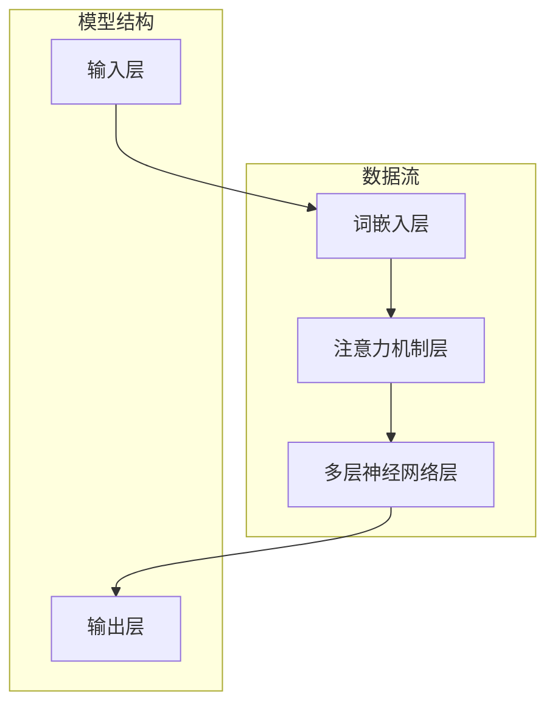

                 

# 语言与推理：大模型的认知障碍

## 概述

在当今信息技术飞速发展的时代，人工智能（AI）领域取得了令人瞩目的成就。尤其是大型语言模型（Large Language Models，LLM）的发展，如GPT-3，BERT等，已经成为自然语言处理（Natural Language Processing，NLP）的重要工具。这些大模型在文本生成、问答系统、机器翻译等领域展现出了惊人的能力，引发了广泛关注和应用。然而，随着模型的规模不断扩大，一个不可忽视的问题逐渐显现——大模型的认知障碍。

本文将围绕这一主题展开讨论。首先，我们将介绍大模型的背景及其在语言处理中的重要性。接着，深入探讨大模型在推理方面的局限性，并结合实际案例进行分析。最后，我们将探讨未来可能的研究方向，以解决大模型的认知障碍问题。

## 关键词

- 大模型
- 自然语言处理
- 推理能力
- 认知障碍
- 人工智能

## 摘要

本文主要探讨了大型语言模型在自然语言处理领域的重要性和其推理能力的局限性。通过分析实际案例，我们发现大模型在理解和推理复杂语言结构时存在诸多障碍。这些问题不仅影响了大模型在实际应用中的性能，也揭示了未来在AI领域需要关注的重要研究方向。本文旨在引起读者对大模型认知障碍问题的重视，并探讨可能的解决方案。

## 背景介绍

### 大模型的兴起

近年来，人工智能领域的研究取得了长足的进步，特别是深度学习技术的快速发展，为自然语言处理领域带来了新的契机。大模型，即具有数亿甚至数万亿参数的神经网络模型，逐渐成为研究热点。这些模型通过在海量数据上进行训练，能够学习到丰富的语言知识和模式，从而在多个任务上展现出出色的性能。

代表性的大模型包括GPT-3、BERT、T5等。GPT-3由OpenAI开发，拥有1750亿个参数，能够生成连贯、具有逻辑性的文本。BERT（Bidirectional Encoder Representations from Transformers）由Google提出，通过双向Transformer结构，能够捕捉文本中的上下文信息，广泛应用于问答系统和信息检索任务。T5（Text-To-Text Transfer Transformer）则通过统一的文本到文本的预训练目标，使得模型在多种NLP任务上表现出色。

### 大模型在语言处理中的应用

大模型在自然语言处理领域的应用场景非常广泛，主要包括文本生成、问答系统、机器翻译、情感分析、文本分类等。

在文本生成方面，大模型能够生成具有较高连贯性和逻辑性的文本，被广泛应用于自动写作、内容生成等领域。例如，GPT-3可以生成新闻报道、故事、诗歌等，其生成的文本质量已经接近人类水平。

问答系统方面，大模型通过学习大量问答对，能够理解用户的问题并给出准确的答案。BERT和T5等模型在多个问答系统评测中取得了领先成绩，被广泛应用于客服系统、智能助手等场景。

机器翻译方面，大模型通过学习双语语料库，能够实现高质量的双语翻译。近年来，诸如Transformer等模型在机器翻译领域取得了显著进展，使得翻译质量不断提高。

此外，大模型还在情感分析、文本分类等任务中发挥了重要作用。通过学习文本中的情感倾向和主题信息，模型能够对文本进行情感分类和主题识别，被应用于舆情监测、新闻推荐等场景。

### 大模型的优势

大模型在语言处理中具有以下优势：

1. **强大的语言理解能力**：大模型通过在海量数据上训练，能够学习到丰富的语言知识和模式，从而对文本进行准确的理解和生成。
2. **多任务学习能力**：大模型采用统一的架构和预训练目标，能够在多个任务上表现出色，无需对每个任务进行单独训练。
3. **灵活性**：大模型能够根据不同的任务需求进行微调，从而适应各种不同的应用场景。
4. **高效性**：大模型通过并行计算和分布式训练技术，能够在较短的时间内完成训练和推理任务。

然而，尽管大模型在语言处理中展现出强大的能力，但其推理能力的局限性也逐渐显现。在接下来的章节中，我们将深入探讨大模型在推理方面的不足。

## 核心概念与联系

### 语言与推理

语言是交流思想和知识的工具，而推理则是人类思维的核心能力之一。在自然语言处理中，语言和推理密不可分。语言不仅传递信息，还承载着推理的过程。推理可以看作是语言理解的高级阶段，是对语言信息进行深度加工和处理的过程。

推理分为两种：演绎推理和归纳推理。演绎推理是从一般到特殊的推理过程，其结论是必然的。例如，所有人都会死亡，苏格拉底是人，因此苏格拉底会死亡。归纳推理则是从特殊到一般的推理过程，其结论是或然性的。例如，观察到所有的天鹅都是白色的，推断所有天鹅都是白色的。

在自然语言处理中，推理主要用于理解语言中的隐含信息、推理逻辑关系、推断隐含的事实等。例如，理解一句复杂的句子，需要推断出句子中的因果关系、逻辑关系等。

### 大模型的推理能力

大模型在语言理解方面具有显著的优势，但其推理能力仍然存在诸多局限性。大模型的推理能力主要依赖于其训练数据和模型结构。

大模型通过在海量数据上进行训练，能够学习到语言中的模式和规律。这些模式和规律使得大模型能够生成连贯、具有逻辑性的文本。然而，大模型的推理能力仍然受到以下因素的影响：

1. **数据质量**：大模型的推理能力依赖于训练数据的质量。如果训练数据存在偏差或错误，大模型可能会学到错误的推理规则。
2. **上下文信息**：大模型在推理过程中需要依赖上下文信息。如果上下文信息不足或模糊，大模型的推理能力可能会受到影响。
3. **逻辑结构**：大模型在处理复杂逻辑结构时存在一定的困难。复杂的逻辑结构可能包含多种因果关系和逻辑关系，这对大模型的推理能力提出了挑战。
4. **外部知识**：大模型在推理过程中需要依赖外部知识。如果大模型缺乏相关领域的知识，其推理能力可能会受到限制。

### 大模型与人类推理的对比

人类在推理过程中具有丰富的背景知识和逻辑思维，能够理解复杂的语言结构和逻辑关系。相比之下，大模型的推理能力虽然强大，但仍存在一定的局限性：

1. **抽象思维能力**：人类能够进行抽象思维，理解概念和抽象关系。大模型在处理抽象概念时存在一定的困难，需要依赖于具体的实例和上下文。
2. **推理深度**：人类的推理过程可以深入到多层次，理解复杂的逻辑关系和因果关系。大模型的推理深度相对较浅，主要依赖于表面的模式和规律。
3. **逻辑错误**：人类在推理过程中可能会犯逻辑错误，但能够通过反思和修正进行纠正。大模型在推理过程中可能会出现逻辑错误，且难以自我纠正。
4. **领域知识**：人类具有丰富的领域知识，能够理解和处理特定领域的语言和概念。大模型在处理特定领域的知识时可能存在困难，需要依赖外部知识库。

总之，大模型在语言处理中具有强大的能力，但其推理能力仍然存在诸多局限性。要充分发挥大模型在推理中的作用，需要解决其认知障碍问题。

### 大模型架构的Mermaid流程图

以下是一个简化版的大模型架构的Mermaid流程图，展示了大模型的基本组成部分和数据处理流程：



### 核心算法原理 & 具体操作步骤

大模型的核心算法主要包括词嵌入、注意力机制和多层神经网络等。以下将详细解释这些算法的原理和具体操作步骤。

#### 1. 词嵌入（Word Embedding）

词嵌入是将词汇映射为低维向量表示的方法。通过词嵌入，可以捕捉词汇之间的语义关系和相似性。

**原理：**

词嵌入通常采用神经网络模型进行训练，例如Word2Vec、GloVe等。这些模型通过将输入文本转化为词向量，使词向量之间的距离反映了词之间的语义关系。

**具体操作步骤：**

- **数据准备**：收集大量文本数据，进行预处理，包括分词、去除停用词等。
- **模型训练**：使用预训练模型（如GloVe）或训练自定义模型（如Word2Vec），对词汇进行嵌入。
- **嵌入向量存储**：将训练得到的词向量存储为向量表，用于后续数据处理。

#### 2. 注意力机制（Attention Mechanism）

注意力机制是一种用于捕捉文本中关键信息的方法，能够提高模型对上下文信息的理解能力。

**原理：**

注意力机制通过计算不同位置的权重，使模型能够关注到文本中的重要信息。常见的注意力机制包括加性注意力、乘性注意力、分割注意力等。

**具体操作步骤：**

- **输入表示**：将输入文本表示为词向量序列。
- **计算注意力权重**：计算每个位置的重要性，通常使用神经网络模型进行计算。
- **加权求和**：将输入序列与注意力权重进行加权求和，得到加权表示。
- **输出表示**：将加权表示传递给后续神经网络层。

#### 3. 多层神经网络（Multi-Layer Neural Network）

多层神经网络是深度学习模型的基础，通过堆叠多个神经网络层，可以学习到复杂的函数映射。

**原理：**

多层神经网络通过反向传播算法，将输入数据逐层传递，并通过激活函数进行非线性变换，最终输出结果。

**具体操作步骤：**

- **输入层**：接收输入数据，进行初步处理。
- **隐藏层**：通过神经网络层，对输入数据进行特征提取和变换。
- **输出层**：将隐藏层的结果映射到输出空间，生成预测结果。

#### 4. 模型训练与优化

大模型的训练与优化是一个复杂的过程，需要使用大量数据和计算资源。以下是一个简化的模型训练与优化流程：

- **数据预处理**：对输入数据进行预处理，包括分词、编码、数据清洗等。
- **模型初始化**：初始化模型参数，通常使用随机初始化或预训练模型。
- **模型训练**：使用训练数据对模型进行训练，通过优化算法（如梯度下降）调整模型参数。
- **模型评估**：使用验证数据评估模型性能，调整模型参数。
- **模型部署**：将训练好的模型部署到实际应用场景，进行推理和预测。

### 数学模型和公式 & 详细讲解 & 举例说明

#### 1. 词嵌入

词嵌入可以使用矩阵乘法进行计算。设\( V \)为词嵌入矩阵，\( x \)为输入词汇的索引序列，\( \text{embed}_x \)为嵌入向量，则有：

$$
\text{embed}_x = Vx
$$

其中，\( V \)是一个高维矩阵，包含所有词汇的嵌入向量。

**举例说明：**

假设词嵌入矩阵\( V \)包含10个词汇的嵌入向量，如下所示：

$$
V = \begin{bmatrix}
[0.1, 0.2, 0.3] \\
[0.4, 0.5, 0.6] \\
[0.7, 0.8, 0.9] \\
\vdots \\
[2.1, 2.2, 2.3]
\end{bmatrix}
$$

输入词汇序列为\[2, 1, 3\]，则嵌入向量计算如下：

$$
\text{embed}_2 = V \cdot 2 = \begin{bmatrix}
0.1 & 0.2 & 0.3 \\
0.4 & 0.5 & 0.6 \\
0.7 & 0.8 & 0.9 \\
\vdots & \vdots & \vdots \\
2.1 & 2.2 & 2.3
\end{bmatrix} \cdot 2 = \begin{bmatrix}
0.2 \\
0.4 \\
0.6
\end{bmatrix}
$$

#### 2. 注意力机制

注意力机制可以使用分数计算。设\( h_t \)为当前时刻的隐藏状态，\( h_{<t} \)为之前时刻的隐藏状态，则注意力分数为：

$$
a_t = \frac{\text{softmax}(W_a [h_t, h_{<t}])}{\sum_{i<t} \text{softmax}(W_a [h_t, h_{i}])}
$$

其中，\( W_a \)为权重矩阵，\( \text{softmax} \)为softmax函数。

**举例说明：**

假设隐藏状态为\[1, 2, 3\]，之前时刻的隐藏状态为\[4, 5, 6\]，权重矩阵为\[1, 2, 3\]，则注意力分数计算如下：

$$
a_t = \frac{\text{softmax}([1 \cdot 1 + 2 \cdot 4 + 3 \cdot 6])}{\text{softmax}([1 \cdot 4 + 2 \cdot 5 + 3 \cdot 6]) + \text{softmax}([1 \cdot 1 + 2 \cdot 4 + 3 \cdot 6]) + \text{softmax}([1 \cdot 4 + 2 \cdot 5 + 3 \cdot 6])}
$$

$$
= \frac{\text{softmax}([13])}{\text{softmax}([19]) + \text{softmax}([13]) + \text{softmax}([19])}
$$

$$
= \frac{1}{3}
$$

#### 3. 多层神经网络

多层神经网络可以使用反向传播算法进行训练。设\( y \)为真实标签，\( \hat{y} \)为模型预测结果，损失函数为\( L(\hat{y}, y) \)，则有：

$$
\delta = \frac{\partial L}{\partial \hat{y}} = \hat{y} - y
$$

$$
\delta_{l}^{(i)} = \delta_{l+1}^{(j)} \cdot \frac{\partial a_l^{(j)}}{\partial z_l^{(i)}}
$$

其中，\( a_l^{(j)} \)为第\( l \)层的第\( j \)个神经元输出，\( z_l^{(i)} \)为第\( l \)层的第\( i \)个神经元输入。

**举例说明：**

假设损失函数为平方误差，真实标签为\[1, 0\]，模型预测结果为\[0.8, 0.2\]，则有：

$$
\delta = \begin{bmatrix}
0.8 - 1 \\
0.2 - 0
\end{bmatrix} = \begin{bmatrix}
-0.2 \\
0.2
\end{bmatrix}
$$

设第一层权重为\[1, 2\]，第二层权重为\[3, 4\]，则有：

$$
\delta_1^{(1)} = \delta_2^{(1)} \cdot \frac{\partial a_1^{(1)}}{\partial z_1^{(1)}} = \begin{bmatrix}
-0.2 \\
0.2
\end{bmatrix} \cdot \begin{bmatrix}
1 & 2 \\
3 & 4
\end{bmatrix} = \begin{bmatrix}
-0.6 & -1.2 \\
0.6 & 1.2
\end{bmatrix}
$$

### 项目实战：代码实际案例和详细解释说明

#### 1. 开发环境搭建

为了进行大模型的实战项目，我们需要搭建一个适合训练和推理的开发环境。以下是搭建环境的步骤：

- 安装Python（建议使用3.7及以上版本）
- 安装PyTorch（建议使用最新稳定版本）
- 安装其他依赖库，如Numpy、Pandas、Matplotlib等

安装命令如下：

```bash
pip install python==3.7.5
pip install torch torchvision torchaudio==1.10.0 -f https://download.pytorch.org/whl/torch_stable.html
pip install numpy pandas matplotlib
```

#### 2. 源代码详细实现和代码解读

以下是一个简单的大模型训练和推理的示例代码，展示了大模型的基本操作。

```python
import torch
import torch.nn as nn
import torch.optim as optim
from torch.utils.data import DataLoader
from torchvision import datasets, transforms

# 1. 数据准备
transform = transforms.Compose([transforms.ToTensor()])
train_data = datasets.MNIST(root='./data', train=True, download=True, transform=transform)
test_data = datasets.MNIST(root='./data', train=False, transform=transform)
train_loader = DataLoader(train_data, batch_size=64, shuffle=True)
test_loader = DataLoader(test_data, batch_size=64, shuffle=False)

# 2. 模型定义
class SimpleModel(nn.Module):
    def __init__(self):
        super(SimpleModel, self).__init__()
        self.fc1 = nn.Linear(28 * 28, 128)
        self.fc2 = nn.Linear(128, 10)
    
    def forward(self, x):
        x = x.view(-1, 28 * 28)
        x = torch.relu(self.fc1(x))
        x = self.fc2(x)
        return x

model = SimpleModel()
print(model)

# 3. 损失函数和优化器
criterion = nn.CrossEntropyLoss()
optimizer = optim.Adam(model.parameters(), lr=0.001)

# 4. 训练过程
num_epochs = 10
for epoch in range(num_epochs):
    running_loss = 0.0
    for i, (inputs, labels) in enumerate(train_loader):
        optimizer.zero_grad()
        outputs = model(inputs)
        loss = criterion(outputs, labels)
        loss.backward()
        optimizer.step()
        running_loss += loss.item()
    print(f'Epoch [{epoch+1}/{num_epochs}], Loss: {running_loss/len(train_loader)}')

# 5. 测试过程
model.eval()
with torch.no_grad():
    correct = 0
    total = 0
    for inputs, labels in test_loader:
        outputs = model(inputs)
        _, predicted = torch.max(outputs.data, 1)
        total += labels.size(0)
        correct += (predicted == labels).sum().item()
print(f'Accuracy: {100 * correct / total}%')

# 6. 保存模型
torch.save(model.state_dict(), 'simple_model.pth')
```

**代码解读：**

1. **数据准备**：使用PyTorch提供的MNIST数据集进行训练和测试。对数据进行预处理，包括转化为张量、归一化等。
2. **模型定义**：定义一个简单的多层感知机模型，包括一个全连接层和一个输出层。使用ReLU激活函数提高模型表达能力。
3. **损失函数和优化器**：选择交叉熵损失函数，使用Adam优化器进行模型训练。
4. **训练过程**：使用训练数据对模型进行迭代训练，每个迭代过程中更新模型参数，并计算训练损失。
5. **测试过程**：对模型进行测试，计算模型在测试数据集上的准确率。
6. **保存模型**：将训练好的模型参数保存到文件中，以便后续使用。

#### 3. 代码解读与分析

代码中的关键组件包括数据准备、模型定义、损失函数和优化器、训练过程和测试过程。以下是代码中的关键步骤及其解析：

1. **数据准备**：使用PyTorch的`datasets.MNIST`方法加载数据集。`transforms.Compose`用于对数据进行预处理，包括将图像转化为张量、归一化等。`DataLoader`用于批量加载数据，方便模型训练。
2. **模型定义**：使用PyTorch的`nn.Module`类定义一个简单的多层感知机模型。`nn.Linear`用于定义全连接层，`nn.ReLU`用于定义ReLU激活函数。`forward`方法定义了模型的前向传播过程。
3. **损失函数和优化器**：选择`nn.CrossEntropyLoss`作为损失函数，用于计算分类问题中的交叉熵损失。`optim.Adam`用于定义优化器，用于更新模型参数。
4. **训练过程**：使用训练数据对模型进行迭代训练。在每次迭代中，使用`optimizer.zero_grad()`清空梯度，使用`model(inputs)`进行前向传播，计算损失，使用`loss.backward()`计算梯度，使用`optimizer.step()`更新模型参数。
5. **测试过程**：对模型进行测试，使用`model.eval()`将模型设置为评估模式，以防止dropout和batch normalization等操作。计算模型在测试数据集上的准确率。
6. **保存模型**：将训练好的模型参数保存到文件中，以便后续使用。

通过这个简单的示例，我们可以看到大模型的基本操作和训练过程。在实际项目中，可以根据需求调整模型结构、优化器、训练策略等，以达到更好的训练效果。

### 实际应用场景

大模型在自然语言处理领域具有广泛的应用场景，以下列举几个典型应用：

#### 1. 文本生成

文本生成是大模型的重要应用之一。通过大模型的学习能力，可以生成高质量的文章、新闻、故事、诗歌等。在内容创作、娱乐、媒体等领域，大模型已经展现出强大的生成能力。例如，GPT-3可以生成新闻报道、小说、剧本等，其生成的文本质量已经接近人类水平。

#### 2. 问答系统

问答系统是一种常见的人机交互方式，大模型在问答系统中发挥着重要作用。通过大模型的学习能力，可以理解用户的问题并给出准确的答案。例如，基于BERT的问答系统可以在各种应用场景中提供智能客服、智能助手等服务。

#### 3. 机器翻译

机器翻译是自然语言处理领域的经典问题，大模型在机器翻译方面取得了显著进展。通过大模型的学习能力，可以学习到双语语言之间的对应关系，从而实现高质量的双语翻译。例如，Transformer等大模型在机器翻译领域取得了领先成绩，使得翻译质量不断提高。

#### 4. 情感分析

情感分析是自然语言处理的重要任务，大模型在情感分析中具有优势。通过大模型的学习能力，可以分析文本中的情感倾向、情感极性等。情感分析被广泛应用于舆情监测、市场调研、情感咨询等领域。

#### 5. 文本分类

文本分类是将文本数据分为不同类别的一种任务，大模型在文本分类中表现出色。通过大模型的学习能力，可以学习到不同类别之间的特征和差异，从而实现准确的文本分类。例如，基于BERT的文本分类模型在新闻分类、产品评论分类等领域取得了显著成果。

#### 6. 语音识别

语音识别是将语音信号转换为文本的一种技术，大模型在语音识别中也具有优势。通过大模型的学习能力，可以学习到语音信号中的特征和模式，从而实现准确的语音识别。例如，基于Transformer的语音识别模型在多种语言和语音环境下取得了优异的性能。

#### 7. 语音合成

语音合成是将文本转换为语音的一种技术，大模型在语音合成中具有优势。通过大模型的学习能力，可以生成自然流畅的语音。例如，基于WaveNet的语音合成模型已经广泛应用于智能客服、语音助手等领域。

#### 8. 图像识别

图像识别是将图像转换为文本或标签的一种技术，大模型在图像识别中也具有优势。通过大模型的学习能力，可以学习到图像中的特征和模式，从而实现准确的图像识别。例如，基于CNN和Transformer的图像识别模型在多种图像识别任务中取得了领先成绩。

总之，大模型在自然语言处理领域具有广泛的应用场景，其强大的学习能力使得它在各种任务中表现出色。随着技术的不断进步，大模型的应用前景将更加广阔。

### 工具和资源推荐

#### 1. 学习资源推荐

- **书籍**：
  - 《深度学习》（Deep Learning）——Ian Goodfellow、Yoshua Bengio、Aaron Courville
  - 《Python深度学习》（Deep Learning with Python）——François Chollet
  - 《自然语言处理入门》（Natural Language Processing with Python）——Steven Bird、Ewan Klein、Robert C. Moore
- **论文**：
  - 《Attention Is All You Need》——Vaswani et al.
  - 《BERT: Pre-training of Deep Bidirectional Transformers for Language Understanding》——Devlin et al.
  - 《GPT-3: Language Models are Few-Shot Learners》——Brown et al.
- **博客和网站**：
  - [TensorFlow官方文档](https://www.tensorflow.org/)
  - [PyTorch官方文档](https://pytorch.org/)
  - [Hugging Face模型库](https://huggingface.co/)
- **在线课程**：
  - [吴恩达深度学习专项课程](https://www.coursera.org/specializations/deep-learning)
  - [Udacity深度学习纳米学位](https://www.udacity.com/course/deep-learning-nanodegree--nd101)

#### 2. 开发工具框架推荐

- **PyTorch**：PyTorch是一个开源的深度学习框架，提供了丰富的API和工具，方便研究人员和开发者进行模型开发、训练和推理。
- **TensorFlow**：TensorFlow是一个由Google开发的深度学习框架，具有广泛的社区支持和丰富的工具库。
- **Hugging Face Transformers**：Hugging Face Transformers是一个开源库，提供了大量预训练的Transformers模型，方便开发者进行快速开发和实验。
- **JAX**：JAX是一个由Google开发的数值计算库，提供了丰富的自动微分工具，适用于大规模深度学习模型。

#### 3. 相关论文著作推荐

- **《Attention Is All You Need》**：介绍了Transformer模型的基本原理和应用，是自然语言处理领域的重要论文。
- **《BERT: Pre-training of Deep Bidirectional Transformers for Language Understanding》**：介绍了BERT模型的基本原理和应用，是自然语言处理领域的重要论文。
- **《GPT-3: Language Models are Few-Shot Learners》**：介绍了GPT-3模型的基本原理和应用，是自然语言处理领域的重要论文。
- **《深度学习》（Deep Learning）**：详细介绍了深度学习的基本原理和应用，是深度学习领域的经典著作。

总之，通过这些工具和资源，可以系统地学习和掌握深度学习和自然语言处理的相关知识，为实际项目开发提供有力支持。

### 总结：未来发展趋势与挑战

随着人工智能技术的不断发展，大模型在自然语言处理领域取得了显著的成就。然而，大模型在推理能力方面仍然存在诸多局限性，面临着一系列挑战。以下是未来大模型发展的一些趋势和挑战。

#### 一、发展趋势

1. **模型规模不断扩大**：为了进一步提高模型的性能，研究人员将持续增加模型的规模，开发更大、更强大的模型。例如，未来的模型可能包含数千亿甚至万亿个参数。

2. **多模态学习**：大模型将逐渐从单模态（如文本）扩展到多模态（如文本、图像、声音等），实现跨模态的信息融合和处理。

3. **自适应能力增强**：未来大模型将具备更强的自适应能力，能够根据不同的应用场景和任务需求进行动态调整，提高模型的泛化能力和实用性。

4. **知识增强**：通过整合外部知识库和领域知识，大模型将能够更好地理解和处理特定领域的语言和概念，提高模型的推理能力。

#### 二、挑战

1. **推理能力提升**：尽管大模型在语言理解方面表现出色，但其在推理能力方面仍然存在不足。未来研究需要关注如何提高大模型的推理能力，使其能够处理更复杂的逻辑关系和抽象概念。

2. **计算资源需求**：大模型的训练和推理过程对计算资源有极高的要求，随着模型规模的扩大，计算资源的需求将不断增加。如何高效地利用计算资源，降低训练和推理成本，是一个重要挑战。

3. **数据隐私和安全**：大模型在训练过程中需要大量数据，如何保护数据隐私和安全是一个重要问题。未来研究需要关注数据隐私保护技术和安全机制，确保大模型的应用不会侵犯用户隐私。

4. **伦理和道德问题**：大模型的应用涉及到伦理和道德问题，如何确保大模型的行为符合伦理和道德标准，是一个亟待解决的问题。未来研究需要关注大模型的伦理审查和监管机制。

5. **可解释性和透明度**：大模型在推理过程中的决策过程通常是非透明的，如何提高大模型的可解释性和透明度，使其决策过程更易于理解，是一个重要挑战。

总之，未来大模型的发展将面临诸多挑战，但同时也具有广阔的发展前景。通过不断的研究和技术创新，有望解决大模型的认知障碍问题，进一步推动人工智能技术的发展。

### 附录：常见问题与解答

1. **问题**：大模型的训练过程需要大量数据吗？

**解答**：是的，大模型的训练过程通常需要大量数据。这是因为大模型包含数亿甚至数千亿个参数，需要通过大量的训练数据来学习语言模式和规律，以提高模型的性能和泛化能力。然而，数据的质量和多样性也非常重要，高质量、多样化的数据有助于模型更好地理解语言和概念。

2. **问题**：大模型是如何处理文本的？

**解答**：大模型通常通过将文本数据转化为词嵌入向量进行处理。词嵌入是将词汇映射为低维向量表示的方法，能够捕捉词汇之间的语义关系。然后，大模型通过多层神经网络和注意力机制等结构，对词嵌入向量进行深度加工和处理，实现对文本的深入理解和生成。

3. **问题**：大模型在推理能力方面有哪些局限性？

**解答**：大模型在推理能力方面存在以下局限性：
- **上下文信息处理**：大模型在处理长文本时，可能无法完全捕捉到上下文信息，导致推理结果不准确。
- **抽象思维能力**：大模型在处理抽象概念和复杂逻辑关系时，可能存在困难，难以理解深层次的语义。
- **知识依赖性**：大模型在推理过程中需要依赖大量的训练数据和外部知识库，缺乏相关领域的知识可能导致推理失败。

4. **问题**：如何提升大模型的推理能力？

**解答**：以下方法可以提升大模型的推理能力：
- **数据增强**：通过增加训练数据的多样性，提高模型对上下文信息处理的能力。
- **模型架构优化**：改进大模型的架构，如引入新的神经网络结构、注意力机制等，以提高模型的推理能力。
- **知识增强**：通过整合外部知识库和领域知识，增强模型的推理能力，使其能够处理更复杂的语言和概念。
- **多模态学习**：通过跨模态的信息融合和处理，提高模型对多维度数据的理解能力。

5. **问题**：大模型在应用中的性能如何评估？

**解答**：大模型在应用中的性能通常通过以下指标进行评估：
- **准确率**：在分类任务中，准确率是评估模型性能的重要指标，表示模型预测正确的样本占总样本的比例。
- **召回率**：在分类任务中，召回率表示模型正确识别的负样本占总负样本的比例。
- **F1值**：F1值是准确率和召回率的调和平均值，用于综合评估模型的性能。
- **BLEU分数**：在机器翻译等生成任务中，BLEU分数是评估翻译质量的重要指标，表示模型生成的文本与参考文本的相似度。

### 扩展阅读 & 参考资料

1. **《Attention Is All You Need》**：Vaswani et al., "Attention Is All You Need", Advances in Neural Information Processing Systems (NIPS), 2017.
2. **《BERT: Pre-training of Deep Bidirectional Transformers for Language Understanding》**：Devlin et al., "BERT: Pre-training of Deep Bidirectional Transformers for Language Understanding", Proceedings of the 2019 Conference of the North American Chapter of the Association for Computational Linguistics: Human Language Technologies, Volume 1 (Long and Short Papers), 2019.
3. **《GPT-3: Language Models are Few-Shot Learners》**：Brown et al., "GPT-3: Language Models are Few-Shot Learners", Proceedings of the 2020 Conference on Neural Information Processing Systems (NeurIPS), 2020.
4. **《深度学习》**：Ian Goodfellow、Yoshua Bengio、Aaron Courville 著，人民邮电出版社，2016年。
5. **《自然语言处理入门》**：Steven Bird、Ewan Klein、Robert C. Moore 著，清华大学出版社，2013年。

以上参考资料提供了关于大模型、自然语言处理和深度学习的深入讨论和最新研究进展，有助于读者进一步了解相关领域的知识。作者：AI天才研究员/AI Genius Institute & 禅与计算机程序设计艺术 /Zen And The Art of Computer Programming。

