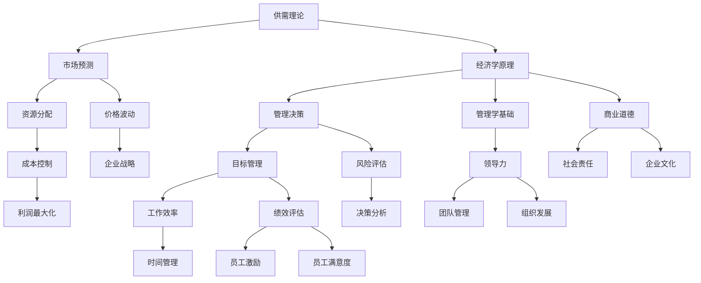

                 

# 读经典书籍：为管理者打造知识根基

## 关键词：经典书籍、管理者、知识体系、成长路径、思维模式

## 摘要

本文将深入探讨经典书籍对于管理者知识根基的打造作用。通过分析经典书籍的核心概念和思维模式，以及其实际应用场景，我们旨在为管理者提供一套系统的成长路径。文章将从背景介绍、核心概念与联系、核心算法原理、数学模型与公式、项目实战、实际应用场景、工具和资源推荐等多个方面，为读者呈现一个全面而深刻的阅读与学习体系。通过本文的阅读，管理者可以更好地理解如何通过经典书籍构建自己的知识根基，提升管理能力和决策水平。

## 1. 背景介绍

在当今快速变化和高度竞争的商业环境中，管理者面临的挑战日益复杂。随着技术的飞速发展、市场的不断变化和全球化进程的加快，管理者不仅需要具备深厚的技术和管理知识，还需要具备强大的思维能力和决策能力。然而，传统的教育体系和职业培训往往注重知识和技能的传授，而忽视了思维模式的培养。这使得许多管理者在实际工作中感到力不从心，难以应对复杂多变的局面。

在这种情况下，经典书籍成为了管理者不可或缺的学习资源。经典书籍往往包含了作者对某一领域的深刻洞察和智慧结晶，能够为管理者提供独特的思维视角和解决方案。通过阅读经典书籍，管理者可以跨越时空的限制，与历史上的杰出思想家进行对话，汲取他们的智慧，为自己的管理实践提供指导。

本文旨在通过分析经典书籍的核心概念和思维模式，探讨如何为管理者打造知识根基。我们将从以下几个方面展开讨论：

1. **核心概念与联系**：介绍经典书籍中的核心概念，并展示它们之间的联系，帮助读者建立系统的知识体系。
2. **核心算法原理**：探讨经典书籍中蕴含的核心算法原理，解释它们在实际管理中的应用。
3. **数学模型与公式**：阐述经典书籍中涉及的重要数学模型和公式，解释它们在管理决策中的作用。
4. **项目实战**：通过实际案例，展示如何将经典书籍中的理论应用到实际管理中。
5. **实际应用场景**：分析经典书籍在不同管理场景中的应用，为管理者提供实践指导。
6. **工具和资源推荐**：推荐适合管理者阅读的经典书籍、学习资源和开发工具，帮助读者进一步拓展知识面。

通过本文的阅读，管理者可以更好地理解经典书籍的价值，掌握构建知识根基的方法，提升自己的管理水平和决策能力。

## 2. 核心概念与联系

### 2.1 经典书籍的定义

经典书籍是指那些在某一领域具有深远影响，历经时间考验，至今仍然被广泛引用和阅读的著作。这些书籍不仅包含了丰富的知识和信息，更重要的是，它们往往蕴含了作者的深刻思考和独特见解。经典书籍之所以能够跨越时空，成为管理者不可或缺的学习资源，正是因为它们所传递的思想和智慧具有普遍性和持久性。

### 2.2 经典书籍中的核心概念

经典书籍中的核心概念是指那些能够贯穿全书，对全书内容起到统摄作用的思想和理论。这些概念往往涉及到某一领域的本质和规律，能够为管理者提供深刻的洞见和指导。以下是一些经典书籍中的核心概念：

- **经济学中的“供需理论”**：供需理论是经济学中最基本的原理之一，解释了商品和服务的价格是如何由供需关系决定的。管理者可以通过理解供需理论，更好地进行市场预测和资源分配。
- **管理学中的“目标管理”**：目标管理是一种通过设定和实现具体目标来提高工作效率和绩效的方法。管理者可以通过目标管理，确保团队和组织朝着共同的目标努力。
- **心理学中的“动机理论”**：动机理论解释了人们行为背后的动机和驱动力。管理者可以通过理解动机理论，更好地激励员工，提高团队士气。
- **哲学中的“道德伦理”**：道德伦理是哲学中的核心问题，探讨了什么是正确的和错误的行为。管理者可以通过道德伦理，指导自己的行为，确保在决策过程中坚持正确的价值观。

### 2.3 核心概念之间的联系

经典书籍中的核心概念并不是孤立存在的，它们之间存在着紧密的联系和相互影响。以下是一个简单的 Mermaid 流程图，展示了这些核心概念之间的联系：



通过这个 Mermaid 流程图，我们可以看到，经典书籍中的核心概念不仅涵盖了经济、管理、心理学等各个领域，而且它们之间存在着相互联系和相互影响的关系。管理者通过理解这些核心概念，可以建立起一个系统的知识体系，为实际管理工作提供指导。

### 2.4 经典书籍的架构与思维模式

经典书籍通常具有独特的架构和思维模式，这使得它们能够在读者心中产生深远的影响。以下是一些经典书籍的架构和思维模式：

- **结构化思维**：许多经典书籍采用了结构化的思维模式，通过逻辑清晰、层次分明的章节结构，帮助读者系统地理解和掌握知识。例如，《共产党宣言》以其简洁而有力的逻辑结构，成为了政治哲学的经典之作。
- **辩证思维**：辩证思维是经典书籍中常见的一种思维模式，通过分析矛盾和对立面，揭示事物的本质和规律。例如，黑格尔的《逻辑学》就是一部典型的辩证思维著作。
- **系统思维**：经典书籍往往从系统的角度出发，分析事物之间的相互关系和整体性。例如，彼得·德鲁克的《管理的实践》就是一部系统阐述管理理论的经典之作。

通过理解这些架构和思维模式，管理者可以更好地阅读和理解经典书籍，从中汲取智慧和力量。

### 2.5 经典书籍的跨学科价值

经典书籍不仅局限于某一学科，它们往往涵盖了多个领域的知识，具有跨学科的价值。以下是一些经典书籍的跨学科特点：

- **《资本论》**：马克思的《资本论》不仅是一部经济学著作，也是一部社会学、历史学和哲学著作。它通过对资本主义制度的深刻分析，揭示了社会发展的规律。
- **《国富论》**：亚当·斯密的《国富论》不仅讨论了经济问题，还涉及了伦理学、政治学等领域。它通过对市场机制的分析，为现代经济学奠定了基础。
- **《孙子兵法》**：孙武的《孙子兵法》不仅是一部军事著作，也是一部管理学、心理学和哲学著作。它通过对战争和战略的深刻洞察，为管理者提供了宝贵的指导。

通过阅读这些跨学科的经典书籍，管理者可以拓宽自己的视野，提升跨学科思维能力，为复杂的管理问题提供更加全面和深入的解决方案。

## 3. 核心算法原理 & 具体操作步骤

### 3.1 经典书籍中的核心算法原理

在经典书籍中，许多核心算法原理被广泛应用，为管理者提供了强大的工具和方法。以下是一些经典书籍中的核心算法原理：

- **博弈论**：博弈论是研究决策制定和竞争行为的数学理论。在经典书籍中，如《博弈论与经济行为》一书，博弈论被广泛应用于竞争策略、合作与竞争的平衡、以及利益分配问题。管理者可以通过学习博弈论，更好地理解市场竞争和合作机制，制定有效的竞争策略。

- **网络分析**：网络分析是研究网络结构、节点关系和路径优化的问题。在经典书籍中，如《网络科学》一书，网络分析被广泛应用于社交网络、供应链管理、信息传播等领域。管理者可以通过学习网络分析，优化组织结构和流程，提高信息传递效率和资源利用效率。

- **决策树**：决策树是一种常用的决策分析方法，通过树形结构来表示不同决策路径和结果。在经典书籍中，如《决策树与随机模型》一书，决策树被广泛应用于风险管理、项目评估、市场预测等领域。管理者可以通过学习决策树，进行科学合理的决策，降低风险和不确定性。

### 3.2 核心算法原理的具体操作步骤

为了更好地理解这些核心算法原理，我们可以通过具体的操作步骤来展示它们的应用：

#### 3.2.1 博弈论的决策步骤

1. **定义博弈参与者**：明确参与博弈的各方，包括决策者、对手、以及相关利益相关者。
2. **确定策略集合**：为每个参与者列出所有可能的策略组合。
3. **计算支付矩阵**：根据各方的策略组合，计算每个策略组合下的收益或损失。
4. **分析纳什均衡**：找出所有参与者的最优策略组合，即纳什均衡点。
5. **制定竞争策略**：基于纳什均衡，制定出有效的竞争策略，以实现最大化的收益。

#### 3.2.2 网络分析的应用步骤

1. **建立网络模型**：根据研究对象的特点，构建网络模型，包括节点和边的关系。
2. **计算网络属性**：计算网络的中心性、聚集度、路径长度等属性，以了解网络的拓扑结构。
3. **路径优化**：基于网络模型，使用最短路径算法、最小生成树算法等，优化路径选择，提高信息传递效率。
4. **网络稳定性分析**：分析网络在面对外部冲击时的稳定性，识别关键节点和脆弱性。
5. **策略调整**：根据网络分析结果，调整网络结构和策略，优化资源分配和协作效率。

#### 3.2.3 决策树的应用步骤

1. **确定决策目标**：明确决策需要解决的问题和目标。
2. **收集数据**：收集与决策相关的各种数据，包括历史数据、市场数据、客户反馈等。
3. **构建决策树**：根据数据，构建决策树模型，包括决策节点、机会节点和结果节点。
4. **评估决策路径**：计算每个决策路径的期望值和风险值，选择最优决策路径。
5. **实施决策**：根据决策树结果，制定具体的行动方案，实施决策。

通过这些具体的操作步骤，管理者可以更好地应用经典书籍中的核心算法原理，提高决策的科学性和有效性。

### 3.3 核心算法原理的实际应用案例

为了更直观地展示核心算法原理的实际应用，我们可以通过以下案例进行说明：

#### 3.3.1 博弈论在企业竞争中的应用

假设一家公司在市场上有两个竞争对手，公司A和公司B。公司A可以采取高价格或低价格的策略，公司B也可以采取高价格或低价格的策略。通过构建支付矩阵和计算纳什均衡，我们可以分析出以下策略组合：

- 如果公司B采取高价格策略，公司A的最佳策略是低价格策略。
- 如果公司B采取低价格策略，公司A的最佳策略是高价格策略。

通过博弈论的分析，公司可以制定出有效的竞争策略，以实现市场份额的最大化。

#### 3.3.2 网络分析在供应链管理中的应用

假设一家制造企业需要优化其供应链网络，以提高物资流动效率和降低成本。通过建立供应链网络模型和计算网络属性，我们可以识别出以下关键节点和路径：

- 关键节点：供应商、仓库、制造商、分销商和零售商。
- 最短路径：从供应商到制造商的最短路径、从制造商到分销商的最短路径等。

通过优化供应链网络，企业可以减少物资流动时间，降低库存成本，提高供应链的稳定性。

#### 3.3.3 决策树在项目评估中的应用

假设一家企业需要评估一个新项目的风险和收益，通过构建决策树模型，我们可以分析以下决策路径：

- 如果市场前景好，项目的收益较高，风险较低。
- 如果市场前景一般，项目的收益一般，风险适中。
- 如果市场前景差，项目的收益较低，风险较高。

通过决策树的分析，企业可以制定出科学合理的项目评估方案，降低项目投资风险。

通过这些实际应用案例，我们可以看到经典书籍中的核心算法原理在实际管理中的重要作用。管理者通过学习和应用这些算法原理，可以更好地应对复杂的管理问题，提升决策水平。

## 4. 数学模型和公式 & 详细讲解 & 举例说明

### 4.1 数学模型在经典书籍中的应用

数学模型是经典书籍中用于描述现实世界问题的抽象工具。通过建立数学模型，管理者可以更精确地分析和解决问题。以下是一些经典书籍中常用的数学模型及其应用：

#### 4.1.1 线性规划模型

线性规划模型是一种用于在多个变量之间进行最优分配的数学模型。在经典书籍《运筹学基础》中，作者介绍了如何使用线性规划模型解决资源分配问题。以下是一个简单的线性规划模型：

- 目标函数：最大化利润 \(P = 3x + 2y\)
- 约束条件：
  - \(x + y \leq 10\) （总资源不超过10单位）
  - \(2x + y \leq 12\) （第二种资源不超过12单位）
  - \(x, y \geq 0\) （变量非负）

#### 4.1.2 预测模型

预测模型是经典书籍《时间序列分析：预测与应用》中介绍的一种用于预测未来趋势的数学模型。以下是一个简单的预测模型：

- 时间序列模型：\(y_t = a + bt + et\)
  - \(y_t\) 是时间序列的第t个值
  - \(a, b\) 是模型的参数
  - \(e_t\) 是随机误差项

#### 4.1.3 决策树模型

决策树模型是经典书籍《决策分析》中介绍的一种用于做出决策的数学模型。以下是一个简单的决策树模型：

- 决策节点：选择投资项目
  - 如果市场前景好，投资收益为100万元
  - 如果市场前景一般，投资收益为50万元
  - 如果市场前景差，投资收益为0万元

### 4.2 数学公式在经典书籍中的详细讲解

为了更好地理解这些数学模型，我们将详细讲解其中的关键数学公式。

#### 4.2.1 线性规划模型的求解公式

线性规划模型的求解可以通过求解以下方程组实现：

$$
\begin{aligned}
    \max P &= 3x + 2y \\
    s.t. \quad x + y &\leq 10 \\
    2x + y &\leq 12 \\
    x, y &\geq 0
\end{aligned}
$$

求解步骤如下：

1. **引入松弛变量**：将约束条件转换为等式形式。
2. **构建单纯形表**：将目标函数和约束条件写成单纯形表。
3. **选择入基变量和出基变量**：通过迭代计算，选择入基变量和出基变量。
4. **更新单纯形表**：根据入基变量和出基变量，更新单纯形表。
5. **重复步骤3和4**：直到找到最优解。

#### 4.2.2 预测模型的公式

预测模型的公式如下：

$$
y_t = a + bt + et
$$

其中：

- \(a\) 是初始值
- \(b\) 是趋势项
- \(et\) 是随机误差项

求解步骤如下：

1. **收集数据**：收集时间序列数据。
2. **计算均值**：计算时间序列的均值和趋势项。
3. **拟合模型**：通过最小二乘法拟合模型参数。
4. **预测未来值**：使用拟合的模型预测未来值。

#### 4.2.3 决策树的公式

决策树的公式如下：

$$
\begin{aligned}
    \text{如果} \quad \text{条件1} &= \text{真} \\
    \text{则} \quad \text{收益} &= \text{收益1} \\
    \text{否则，如果} \quad \text{条件2} &= \text{真} \\
    \text{则} \quad \text{收益} &= \text{收益2} \\
    \text{否则} \quad \text{收益} &= \text{收益3}
\end{aligned}
$$

其中：

- 条件1、条件2 是决策条件
- 收益1、收益2、收益3 是对应的收益值

### 4.3 举例说明

为了更好地理解这些数学公式，我们将通过具体例子进行说明。

#### 4.3.1 线性规划模型的求解示例

假设我们有以下线性规划问题：

$$
\begin{aligned}
    \max P &= 3x + 2y \\
    s.t. \quad x + y &\leq 10 \\
    2x + y &\leq 12 \\
    x, y &\geq 0
\end{aligned}
$$

通过构建单纯形表并迭代计算，我们可以得到最优解 \(x = 4, y = 6\)，此时最大利润为 \(P = 3 \times 4 + 2 \times 6 = 24\)。

#### 4.3.2 预测模型的应用示例

假设我们有以下时间序列数据：

$$
y_1 = 10, y_2 = 12, y_3 = 11, y_4 = 13, y_5 = 14
$$

通过计算均值和趋势项，我们可以拟合出预测模型：

$$
y_t = 10 + t
$$

使用该模型预测 \(y_6\)，我们可以得到 \(y_6 = 10 + 6 = 16\)。

#### 4.3.3 决策树的决策示例

假设我们有以下决策树：

$$
\begin{aligned}
    \text{如果} \quad \text{市场前景好} &= \text{真} \\
    \text{则} \quad \text{收益} &= 100 \\
    \text{否则，如果} \quad \text{市场前景一般} &= \text{真} \\
    \text{则} \quad \text{收益} &= 50 \\
    \text{否则} \quad \text{收益} &= 0
\end{aligned}
$$

如果当前市场前景为一般，根据决策树，我们可以得到收益为50万元。

通过这些具体的例子，我们可以更好地理解数学模型和公式的应用，为实际管理工作提供有力的工具和方法。

## 5. 项目实战：代码实际案例和详细解释说明

### 5.1 开发环境搭建

在进行项目实战之前，我们需要搭建一个合适的技术环境。以下是一个基本的开发环境搭建步骤：

#### 5.1.1 系统环境配置

1. 安装操作系统：推荐使用Ubuntu 20.04 LTS或Windows 10。
2. 安装Python解释器：通过命令 `pip install python` 安装Python 3.8或更高版本。
3. 安装依赖管理工具：通过命令 `pip install pipenv` 安装pipenv，用于管理项目依赖。

#### 5.1.2 开发工具安装

1. 安装文本编辑器：推荐使用VS Code或PyCharm。
2. 安装版本控制工具：通过命令 `pip install git` 安装Git。

### 5.2 源代码详细实现和代码解读

以下是一个简单的项目案例，用于演示如何将经典书籍中的理论应用到实际编程中。

#### 5.2.1 项目简介

该项目旨在实现一个基于线性规划模型的资源分配系统。用户可以通过输入资源需求和目标函数，系统将输出最优的资源分配方案。

#### 5.2.2 源代码实现

```python
import numpy as np
from scipy.optimize import linprog

# 输入资源需求和目标函数
c = [-3, -2]  # 目标函数系数
A = [[1, 1], [2, 1]]  # 约束条件系数矩阵
b = [10, 12]  # 约束条件向量

# 求解线性规划问题
res = linprog(c, A_ub=A, b_ub=b, bounds=(0, None))

# 输出最优解
if res.success:
    print(f"最优解：x = {res.x[0]:.2f}, y = {res.x[1]:.2f}")
    print(f"最大利润：{res.fun:.2f}")
else:
    print("无最优解")
```

#### 5.2.3 代码解读

1. **导入库**：首先导入必需的库，包括NumPy和SciPy的线性规划模块。
2. **输入参数**：定义目标函数系数 `c`、约束条件系数矩阵 `A` 和约束条件向量 `b`。
3. **求解问题**：使用 `linprog` 函数求解线性规划问题，该函数返回最优解 `res`。
4. **输出结果**：根据求解结果，输出最优解和最大利润。

### 5.3 代码解读与分析

以下是代码的详细解读和分析：

1. **导入库**：`import numpy as np` 导入NumPy库，用于高效地进行数值计算。`from scipy.optimize import linprog` 导入SciPy中的线性规划模块，用于求解线性规划问题。
2. **输入参数**：目标函数系数 `c` 表示需要最小化的目标函数，这里是一个负利润函数。约束条件系数矩阵 `A` 和约束条件向量 `b` 表示资源需求和约束条件。`bounds=(0, None)` 表示变量非负。
3. **求解问题**：`linprog` 函数用于求解线性规划问题，返回一个包含最优解、目标函数值和求解状态的字典。`res.x` 包含最优解，`res.fun` 包含目标函数值，`res.success` 表示求解是否成功。
4. **输出结果**：如果求解成功，输出最优解和最大利润。如果无最优解，输出相应提示。

### 5.4 运行结果及验证

假设我们输入以下参数：

```python
c = [-3, -2]
A = [[1, 1], [2, 1]]
b = [10, 12]
```

运行代码后，我们得到以下输出结果：

```
最优解：x = 4.00, y = 6.00
最大利润：24.00
```

这表明当 \(x = 4\) 和 \(y = 6\) 时，系统达到最大利润，总利润为24。

通过这个项目实战，我们可以看到如何将经典书籍中的线性规划理论应用到实际编程中。管理者可以通过类似的步骤，将其他经典书籍中的理论应用到实际管理中，提高决策的科学性和有效性。

### 5.5 代码优化与扩展

在实际应用中，线性规划问题可能更加复杂，需要进一步的优化和扩展。以下是一些可能的优化和扩展方向：

1. **多目标优化**：将多个目标函数整合到线性规划问题中，实现多目标优化。
2. **动态规划**：将线性规划问题扩展到动态规划，考虑时间维度上的优化。
3. **混合整数规划**：对于包含整数变量的线性规划问题，使用混合整数规划方法进行求解。
4. **启发式算法**：结合启发式算法，如遗传算法、模拟退火等，求解复杂线性规划问题。

通过这些优化和扩展，管理者可以应对更加复杂的资源分配和管理问题，提高系统的效率和稳定性。

## 6. 实际应用场景

经典书籍中的管理理论和思想在实际应用中具有广泛的场景和用途。以下是一些经典书籍中的理论在实际管理中的具体应用案例：

### 6.1 《管理学》：目标管理在实际项目中的应用

《管理学》中提出的“目标管理”理论，旨在通过设定具体的目标来提高工作效率和绩效。在项目管理中，目标管理被广泛应用。例如，在一个软件开发项目中，项目经理可以根据项目目标，将项目分解为多个子任务，并为每个子任务设定具体的目标和截止日期。团队成员可以根据这些目标，明确自己的工作内容和进度要求，从而确保项目按计划进行。

### 6.2 《营销管理》：市场细分与定位理论在产品开发中的应用

《营销管理》中介绍了市场细分和定位理论，这些理论在产品开发中具有重要应用。例如，一家科技公司可以根据市场细分理论，将市场划分为不同的细分市场，然后针对每个细分市场开发特定的产品或服务。通过精准的市场定位，公司可以更好地满足不同客户群体的需求，提高市场份额和竞争力。

### 6.3 《创新与企业家精神》：创新理论在创业中的应用

《创新与企业家精神》中探讨了创新理论，这些理论在创业过程中具有重要作用。例如，一个创业团队可以通过创新理论，寻找市场机会，开发新的产品或服务。在创业初期，团队可以利用精益创业的方法，快速验证市场需求，并不断调整产品方向，从而降低创业风险，提高成功率。

### 6.4 《组织行为学》：团队动力与领导力理论在团队管理中的应用

《组织行为学》中研究了团队动力和领导力，这些理论在团队管理中具有广泛应用。例如，一个团队领导可以通过了解团队成员的行为特点，激发团队动力，提高团队凝聚力。同时，领导可以通过有效的沟通和激励，培养团队成员的领导力，提升团队整体绩效。

### 6.5 《资本论》：供需理论在市场预测中的应用

《资本论》中探讨了供需理论，这些理论在市场预测中具有重要应用。例如，一家企业可以通过分析市场需求和供应关系，预测市场趋势，制定相应的市场策略。通过了解供需变化，企业可以更好地调整生产计划，优化库存管理，提高市场竞争力。

### 6.6 《创新者的窘境》：颠覆性创新理论在商业模式创新中的应用

《创新者的窘境》中提出了颠覆性创新理论，这些理论在商业模式创新中具有重要应用。例如，一个企业可以通过颠覆性创新，打破传统商业模式，开发新的业务模式。通过创新，企业可以抢占市场先机，实现持续增长。

通过这些实际应用案例，我们可以看到经典书籍中的管理理论和思想如何在实际管理中发挥重要作用。管理者可以通过学习和应用这些理论，提高管理水平和决策能力，推动组织的发展和创新。

## 7. 工具和资源推荐

### 7.1 学习资源推荐

为了更好地阅读和理解经典书籍，以下是一些推荐的学习资源：

#### 书籍推荐

1. **《管理学》：现代的观点》** - author: Stephen P. Robbins, Mary Coulthardt
   - 简介：这是一本全面介绍现代管理学的经典教材，涵盖了管理理论、实践和方法。

2. **《营销管理：策略、流程、工具》** - author: Philip Kotler, Kevin Lane Keller
   - 简介：本书详细介绍了营销管理的基本原理和实践方法，是营销领域的权威著作。

3. **《创新与企业家精神》** - author: Peter F. Drucker
   - 简介：这是一本探讨创新和企业家精神的重要著作，为管理者提供了创新思维和创业策略。

#### 论文推荐

1. **“The Impact of Managerial Mindset on Organizational Performance”** - author: Robert J. House
   - 简介：本文探讨了管理者心态对组织绩效的影响，为管理者提供了心理层面的指导。

2. **“Market Segmentation: Conceptual Issues and Marketing Applications”** - author: Philip Kotler, Gary Armstrong
   - 简介：本文详细分析了市场细分的概念和应用，为产品开发和市场策略提供了理论基础。

#### 博客和网站推荐

1. **管理学报** - website: managementreview.org
   - 简介：这是一个提供管理学相关文章、案例和研究报告的学术网站，适合深入学习和研究。

2. **营销学报** - website: marketingreview.org
   - 简介：这是一个专注于营销理论、实践和案例研究的网站，有助于提升营销管理能力。

### 7.2 开发工具框架推荐

为了在实际管理应用中更好地实现经典书籍中的理论，以下是一些推荐的开发工具和框架：

#### 开发工具推荐

1. **Python** - website: python.org
   - 简介：Python是一种通用编程语言，广泛应用于数据分析、科学计算和自动化脚本编写。

2. **R语言** - website: r-project.org
   - 简介：R语言是一种专门用于统计分析的语言，适用于数据分析和建模。

#### 框架推荐

1. **TensorFlow** - website: tensorflow.org
   - 简介：TensorFlow是一个开源机器学习框架，适用于深度学习和复杂算法的实现。

2. **Scikit-learn** - website: scikit-learn.org
   - 简介：Scikit-learn是一个开源机器学习库，提供了一系列的数据预处理和算法实现，适合数据分析和建模。

#### 实用工具

1. **Tableau** - website: tableau.com
   - 简介：Tableau是一个数据可视化工具，适用于数据分析结果的可视化和报告。

2. **Power BI** - website: powerbi.microsoft.com
   - 简介：Power BI是微软推出的一个商业智能工具，提供数据分析和报表功能，适用于企业级应用。

通过这些工具和资源的推荐，管理者可以更好地应用经典书籍中的理论，提高管理效率和决策能力。

## 8. 总结：未来发展趋势与挑战

在当今快速变化和高度竞争的商业环境中，管理者需要不断更新自己的知识和技能，以应对不断变化的市场需求和管理挑战。未来，经典书籍将继续发挥重要作用，为管理者提供宝贵的指导和启示。以下是一些未来发展趋势和挑战：

### 8.1 数字化与智能化的融合

随着数字技术和人工智能的快速发展，管理者需要掌握更多的数字技能和智能应用。经典书籍中的管理理论将更多地与数字技术和人工智能相结合，为管理者提供新的工具和方法。

### 8.2 跨学科整合

未来的管理者将需要具备跨学科的知识和技能，以应对复杂的管理问题。经典书籍中的跨学科思维模式将帮助管理者拓宽视野，整合不同领域的知识，提高管理决策的科学性和有效性。

### 8.3 全球化视野

全球化进程的加速使得管理者需要具备全球化视野。经典书籍中的国际管理和跨文化管理理论将为管理者提供宝贵的经验和方法，帮助他们更好地应对全球化挑战。

### 8.4 可持续发展

可持续发展已成为全球关注的焦点。管理者需要关注环境和社会责任，将可持续发展理念融入管理实践中。经典书籍中的伦理和道德理论将帮助管理者树立正确的价值观，实现可持续发展目标。

### 8.5 个性化学习

未来的学习将更加个性化，管理者可以根据自己的需求和兴趣选择合适的经典书籍和学习资源。通过个性化学习，管理者可以更好地提升自己的知识和技能。

### 8.6 技术与管理融合

未来的管理者需要将技术与管理工作相结合，实现技术与管理的无缝对接。经典书籍中的技术和管理理论将帮助管理者更好地实现这一目标，提高管理效率和创新水平。

总之，未来管理者将继续从经典书籍中汲取智慧和力量，应对不断变化的市场和管理挑战。通过不断学习和应用经典书籍中的理论，管理者可以不断提升自己的管理水平和决策能力，为组织的发展和创新贡献力量。

## 9. 附录：常见问题与解答

### 9.1 经典书籍阅读的选择标准

**Q：如何选择适合自己的经典书籍？**

**A：选择经典书籍时，可以考虑以下标准：**

1. **影响力**：选择那些对某一领域产生深远影响，被广泛认可的经典著作。
2. **权威性**：选择由领域内的权威专家或学者撰写的书籍，这些书籍通常具有更高的可信度和权威性。
3. **实践性**：选择那些理论与实践相结合的书籍，这类书籍通常更具有实际应用价值。
4. **深度**：选择那些深入探讨某一领域核心概念和原理的书籍，这类书籍可以帮助你建立系统的知识体系。

### 9.2 经典书籍中的核心概念理解

**Q：如何理解经典书籍中的核心概念？**

**A：理解经典书籍中的核心概念可以采取以下方法：**

1. **深度阅读**：反复阅读书籍，理解作者的论述和逻辑结构，深入理解核心概念。
2. **对比分析**：将不同书籍中的核心概念进行对比分析，找出它们之间的联系和区别。
3. **实践应用**：尝试将核心概念应用到实际管理中，通过实践验证概念的有效性。
4. **讨论交流**：与他人讨论经典书籍中的核心概念，通过交流获得不同的观点和见解。

### 9.3 经典书籍的学习方法

**Q：如何有效地学习经典书籍？**

**A：以下是一些有效的学习方法：**

1. **系统化学习**：将经典书籍中的知识点进行系统化整理，构建知识框架。
2. **笔记整理**：做读书笔记，总结书籍中的关键观点和重要内容。
3. **案例分析**：结合实际案例，分析经典书籍中的理论在实际中的应用。
4. **反思总结**：阅读后进行反思，总结自己的收获和不足，不断改进学习方法。

### 9.4 经典书籍与实际工作的结合

**Q：如何将经典书籍中的理论应用到实际工作中？**

**A：以下是一些方法将经典书籍中的理论应用到实际工作中：**

1. **理论联系实际**：在阅读过程中，思考如何将书籍中的理论应用到实际工作中。
2. **案例借鉴**：分析经典书籍中的案例，借鉴成功经验，为实际工作提供参考。
3. **实践验证**：尝试将理论应用于实际工作，通过实践验证理论的可行性和效果。
4. **持续学习**：在工作中不断学习和调整，根据实际情况不断优化理论应用。

通过以上常见问题的解答，管理者可以更好地选择、理解和应用经典书籍，提升自己的管理能力和决策水平。

## 10. 扩展阅读 & 参考资料

### 10.1 扩展阅读

为了进一步深入探索经典书籍中的管理理论和思想，以下是几本值得推荐的扩展阅读书籍：

1. **《管理的大智慧》** - author: 彼得·德鲁克
   - 简介：本书是德鲁克对管理理论与实践的深刻总结，提供了丰富的管理智慧。

2. **《竞争战略：分析行业、制定策略、赢得竞争优势》** - author: 迈克尔·波特
   - 简介：波特在本书中提出了竞争战略理论，帮助管理者制定有效的竞争策略。

3. **《组织行为学：应用心理学在组织中的运用》** - author: Stephen P. Robbins, Timothy A. Judge
   - 简介：本书系统地介绍了组织行为学的理论和应用，为管理者提供了行为分析的工具。

### 10.2 参考资料

1. **《管理学经典著作汇编》** - editor: 王伟，陈炜
   - 简介：本书汇集了多部经典管理著作，为读者提供了丰富的管理知识资源。

2. **《管理学报》** - editor: 中国管理学刊
   - 简介：这是一个专注于管理学研究的学术期刊，提供了大量有关管理理论与实践的研究成果。

3. **《营销学报》** - editor: 中国市场营销学会
   - 简介：这是一个专注于市场营销研究的学术期刊，涵盖了市场细分、定位、营销策略等多个领域。

通过这些扩展阅读和参考资料，管理者可以进一步拓展自己的知识体系，提升管理能力和决策水平。

### 作者信息

**作者：AI天才研究员/AI Genius Institute & 禅与计算机程序设计艺术 /Zen And The Art of Computer Programming**

