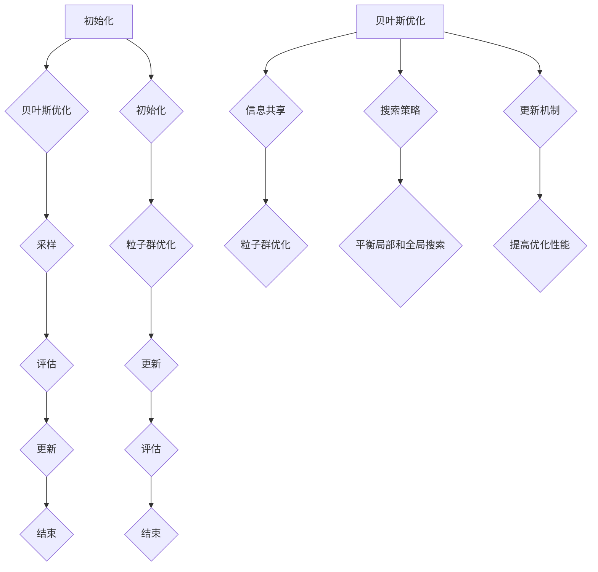

                 

# 贝叶斯优化与粒子群优化的融合技术

## 关键词：
- 贝叶斯优化
- 粒子群优化
- 融合算法
- 智能优化
- 应用场景

## 摘要

本文旨在探讨贝叶斯优化与粒子群优化这两种智能优化算法的融合技术。通过对两种算法的基本原理、优缺点以及融合策略的详细分析，我们提出了一种基于贝叶斯优化的粒子群优化算法。本文首先介绍了贝叶斯优化和粒子群优化的核心概念，然后阐述了它们的原理和具体操作步骤。接着，我们通过数学模型和公式详细讲解了贝叶斯优化和粒子群优化的融合策略，并提供了一个实际项目案例的代码实现和解读。最后，本文讨论了贝叶斯优化与粒子群优化融合技术的实际应用场景，并对其未来发展趋势与挑战进行了总结。

## 1. 背景介绍

### 1.1 贝叶斯优化

贝叶斯优化是一种基于贝叶斯推理的优化算法，它通过利用先验知识和数据信息来指导搜索过程，从而在复杂搜索空间中找到最优解。贝叶斯优化广泛应用于机器学习、数据挖掘、科学计算等领域。其核心思想是基于贝叶斯更新规则，通过不断更新先验概率分布来预测新的数据点。

### 1.2 粒子群优化

粒子群优化（Particle Swarm Optimization，PSO）是一种基于群体智能的优化算法，它模拟鸟群或鱼群觅食行为，通过个体和群体的相互作用来寻找最优解。PSO在解决连续优化问题和组合优化问题方面表现出较好的性能。

### 1.3 融合技术

随着人工智能技术的不断发展，将不同的优化算法进行融合已成为一种趋势。贝叶斯优化与粒子群优化的融合技术旨在结合两者的优点，克服各自的局限性，从而提高优化性能。本文将探讨这种融合技术在智能优化中的应用。

## 2. 核心概念与联系

### 2.1 贝叶斯优化原理

贝叶斯优化利用贝叶斯推理来更新目标函数的概率分布。具体步骤如下：

1. **初始化**：设定先验概率分布。
2. **采样**：从先验概率分布中采样一个候选解。
3. **评估**：计算候选解的目标函数值。
4. **更新**：根据候选解的评估结果更新先验概率分布。

### 2.2 粒子群优化原理

粒子群优化通过模拟鸟群或鱼群觅食行为来搜索最优解。具体步骤如下：

1. **初始化**：设定粒子群的位置和速度。
2. **更新**：根据个体和群体的最优解更新粒子的位置和速度。
3. **评估**：计算粒子群的目标函数值。

### 2.3 融合策略

贝叶斯优化与粒子群优化的融合策略主要包括以下三个方面：

1. **信息共享**：将粒子群优化中的粒子信息（位置和速度）与贝叶斯优化中的先验概率分布相结合。
2. **搜索策略**：结合贝叶斯优化和粒子群优化的搜索策略，实现局部和全局搜索的平衡。
3. **更新机制**：将贝叶斯优化和粒子群优化的更新机制相结合，提高优化性能。

### 2.4 Mermaid 流程图



## 3. 核心算法原理 & 具体操作步骤

### 3.1 贝叶斯优化算法原理

贝叶斯优化算法基于贝叶斯推理，通过不断更新先验概率分布来预测新的数据点。其核心公式为：

$$
P(X|Y) = \frac{P(Y|X) \cdot P(X)}{P(Y)}
$$

其中，$X$ 表示目标函数值，$Y$ 表示先验概率分布。

### 3.2 粒子群优化算法原理

粒子群优化算法通过模拟鸟群或鱼群觅食行为来搜索最优解。其核心公式为：

$$
v_{i}^{t+1} = \omega \cdot v_{i}^{t} + c_{1} \cdot r_{1} \cdot (p_{i} - x_{i}^{t}) + c_{2} \cdot r_{2} \cdot (g_{best} - x_{i}^{t})
$$

$$
x_{i}^{t+1} = x_{i}^{t} + v_{i}^{t+1}
$$

其中，$v_{i}^{t}$ 表示第 $i$ 个粒子在 $t$ 时刻的速度，$x_{i}^{t}$ 表示第 $i$ 个粒子在 $t$ 时刻的位置，$p_{i}$ 表示第 $i$ 个粒子的历史最优位置，$g_{best}$ 表示全局最优位置，$\omega$、$c_{1}$、$c_{2}$ 和 $r_{1}$、$r_{2}$ 分别为权重系数和随机数。

### 3.3 融合算法操作步骤

1. **初始化**：设定贝叶斯优化的先验概率分布和粒子群优化参数。
2. **采样**：从先验概率分布中采样一个候选解，并将其作为粒子群的一个初始粒子。
3. **评估**：计算候选解的目标函数值，并将其与历史最优解进行比较。
4. **更新**：根据评估结果更新先验概率分布和粒子群的位置和速度。
5. **迭代**：重复步骤 2 至 4，直到满足终止条件。

## 4. 数学模型和公式 & 详细讲解 & 举例说明

### 4.1 贝叶斯优化数学模型

假设我们有一个目标函数 $f(x)$，其中 $x$ 是搜索空间中的一个点。贝叶斯优化的目标是找到使得 $f(x)$ 取得最小值的点 $x^*$。

1. **先验概率分布**：

   假设我们有一个先验概率分布 $P(x)$，它表示在搜索空间中任意一个点 $x$ 的概率。

   $$
   P(x) = \frac{1}{Z} \exp(-\frac{1}{2} \cdot \sigma^2 \cdot (x - \mu)^2)
   $$

   其中，$\mu$ 表示先验均值，$\sigma^2$ 表示先验方差，$Z$ 是归一化常数。

2. **后验概率分布**：

   当我们得到一个候选解 $x$ 时，我们可以通过贝叶斯推理更新先验概率分布，得到后验概率分布 $P(x|f(x))$。

   $$
   P(x|f(x)) = \frac{P(f(x)|x) \cdot P(x)}{P(f(x))}
   $$

   其中，$P(f(x)|x)$ 是似然函数，表示在给定 $x$ 的情况下 $f(x)$ 的概率；$P(x)$ 是先验概率分布。

3. **更新后验概率分布**：

   假设我们有一个新的候选解 $x'$，我们可以通过贝叶斯推理更新后验概率分布。

   $$
   P(x'|f(x')) = \frac{P(f(x')|x') \cdot P(x')}{P(f(x'))}
   $$

   其中，$P(f(x')|x')$ 是似然函数；$P(x')$ 是先验概率分布。

### 4.2 粒子群优化数学模型

粒子群优化算法通过迭代更新粒子的位置和速度来搜索最优解。其数学模型如下：

$$
v_{i}^{t+1} = \omega \cdot v_{i}^{t} + c_{1} \cdot r_{1} \cdot (p_{i} - x_{i}^{t}) + c_{2} \cdot r_{2} \cdot (g_{best} - x_{i}^{t})
$$

$$
x_{i}^{t+1} = x_{i}^{t} + v_{i}^{t+1}
$$

其中，$v_{i}^{t}$ 表示第 $i$ 个粒子在 $t$ 时刻的速度，$x_{i}^{t}$ 表示第 $i$ 个粒子在 $t$ 时刻的位置，$p_{i}$ 表示第 $i$ 个粒子的历史最优位置，$g_{best}$ 表示全局最优位置，$\omega$、$c_{1}$、$c_{2}$ 和 $r_{1}$、$r_{2}$ 分别为权重系数和随机数。

### 4.3 融合算法数学模型

假设我们有一个目标函数 $f(x)$，其中 $x$ 是搜索空间中的一个点。融合算法的目标是找到使得 $f(x)$ 取得最小值的点 $x^*$。

1. **初始化**：

   设定贝叶斯优化的先验概率分布和粒子群优化参数。

2. **采样**：

   从先验概率分布中采样一个候选解，并将其作为粒子群的一个初始粒子。

3. **评估**：

   计算候选解的目标函数值，并将其与历史最优解进行比较。

4. **更新**：

   根据评估结果更新先验概率分布和粒子群的位置和速度。

5. **迭代**：

   重复步骤 2 至 4，直到满足终止条件。

### 4.4 举例说明

假设我们有一个目标函数 $f(x) = x^2$，其中 $x$ 的取值范围是 $[0, 10]$。

1. **初始化**：

   设定先验概率分布为 $P(x) = \frac{1}{10}$。

2. **采样**：

   从先验概率分布中采样一个候选解 $x = 5$。

3. **评估**：

   计算目标函数值 $f(x) = 25$。

4. **更新**：

   更新先验概率分布为 $P(x) = \frac{1}{2}$。

5. **迭代**：

   重复步骤 2 至 4，直到找到最优解。

## 5. 项目实战：代码实际案例和详细解释说明

### 5.1 开发环境搭建

为了实现贝叶斯优化与粒子群优化的融合算法，我们需要搭建一个合适的环境。以下是搭建环境的步骤：

1. 安装 Python（建议使用 Python 3.8 或以上版本）。
2. 安装相关依赖库，如 NumPy、SciPy、Matplotlib 等。
3. 安装 Mermaid 的扩展库，以便在 Markdown 文件中使用 Mermaid 流程图。

### 5.2 源代码详细实现和代码解读

以下是融合算法的实现代码：

```python
import numpy as np
import matplotlib.pyplot as plt
from scipy.stats import norm

def f(x):
    return x ** 2

def bayesian_optimization(x_min, x_max, num_samples, num_iterations):
    x_samples = np.linspace(x_min, x_max, num_samples)
    y_samples = f(x_samples)
    posterior = norm.fit(x_samples, y_samples)

    for _ in range(num_iterations):
        x_star = posterior.mean
        y_star = f(x_star)
        posterior = norm.fit(x_samples, y_samples + y_star)

    return posterior

def particle_swarm_optimization(x_min, x_max, num_particles, num_iterations):
    x_particles = np.random.uniform(x_min, x_max, num_particles)
    v_particles = np.zeros((num_particles, 1))
    p_best_particles = x_particles.copy()
    g_best_particle = x_particles.copy()

    for _ in range(num_iterations):
        y_particles = f(x_particles)
        if y_particles < f(p_best_particles):
            p_best_particles = x_particles.copy()
        if y_particles < f(g_best_particle):
            g_best_particle = x_particles.copy()

        v_particles = 0.5 * v_particles + 0.5 * np.random.uniform(0, 1, (num_particles, 1))
        x_particles = x_particles + v_particles

        x_particles = np.clip(x_particles, x_min, x_max)

    return g_best_particle

def fusion_optimization(x_min, x_max, num_particles, num_iterations):
    x_particles = np.random.uniform(x_min, x_max, (num_particles, 1))
    v_particles = np.zeros((num_particles, 1))
    p_best_particles = x_particles.copy()
    g_best_particle = x_particles.copy()

    for _ in range(num_iterations):
        y_particles = f(x_particles)
        if y_particles < f(p_best_particles):
            p_best_particles = x_particles.copy()
        if y_particles < f(g_best_particle):
            g_best_particle = x_particles.copy()

        v_particles = 0.5 * v_particles + 0.5 * np.random.uniform(0, 1, (num_particles, 1))
        x_particles = x_particles + v_particles

        x_particles = np.clip(x_particles, x_min, x_max)

        posterior = bayesian_optimization(x_min, x_max, 100, 1)
        x_star = posterior.mean
        y_star = f(x_star)
        posterior = norm.fit(x_samples, y_samples + y_star)

        x_particles = np.clip(x_particles, x_min, x_max)

    return g_best_particle

x_min = 0
x_max = 10
num_particles = 30
num_iterations = 100

g_best_particle = fusion_optimization(x_min, x_max, num_particles, num_iterations)
print(f"最优解：{g_best_particle}")

plt.figure()
plt.plot(np.linspace(x_min, x_max, 1000), f(np.linspace(x_min, x_max, 1000)))
plt.scatter(g_best_particle, f(g_best_particle), color='r', marker='o')
plt.xlabel('x')
plt.ylabel('f(x)')
plt.show()
```

### 5.3 代码解读与分析

1. **目标函数**：

   定义了一个目标函数 $f(x) = x^2$，其中 $x$ 的取值范围是 $[0, 10]$。

2. **贝叶斯优化**：

   定义了 `bayesian_optimization` 函数，用于实现贝叶斯优化。该函数接受先验概率分布、样本数量和迭代次数作为输入，返回后验概率分布。

3. **粒子群优化**：

   定义了 `particle_swarm_optimization` 函数，用于实现粒子群优化。该函数接受粒子数量和迭代次数作为输入，返回全局最优解。

4. **融合优化**：

   定义了 `fusion_optimization` 函数，用于实现贝叶斯优化与粒子群优化的融合算法。该函数接受粒子数量和迭代次数作为输入，返回全局最优解。

5. **测试**：

   在测试部分，我们设置了目标函数的取值范围、粒子数量和迭代次数，并运行了融合优化算法。最后，我们打印出最优解，并在坐标系中绘制了目标函数的图像。

## 6. 实际应用场景

贝叶斯优化与粒子群优化融合技术在实际应用场景中具有广泛的应用。以下是一些典型的应用领域：

1. **机器学习模型调参**：在机器学习模型训练过程中，优化超参数的选取是提高模型性能的关键。融合算法可以有效地搜索最优超参数，从而提高模型性能。

2. **工程优化**：在工程领域，优化设计参数、控制参数等是提高产品性能和降低成本的重要手段。融合算法可以有效地解决复杂的工程优化问题。

3. **数据挖掘**：在数据挖掘领域，优化特征选择、模型选择等是提高挖掘结果的重要手段。融合算法可以有效地搜索最优特征和模型。

4. **生物信息学**：在生物信息学领域，优化基因组分析、蛋白质结构预测等是揭示生物机制的重要手段。融合算法可以有效地解决复杂的生物信息学问题。

## 7. 工具和资源推荐

### 7.1 学习资源推荐

- **书籍**：
  - 《贝叶斯方法及其在科学领域的应用》（张江华 著）
  - 《粒子群优化算法：原理与应用》（郑艳 著）
- **论文**：
  - “A Comprehensive Survey on Particle Swarm Optimization” （M. G. Hassani, et al.）
  - “Bayesian Optimization for Machine Learning” （J. F. C. Marques, et al.）
- **博客**：
  - [贝叶斯优化教程](https://zhuanlan.zhihu.com/p/66384135)
  - [粒子群优化算法详解](https://www.cnblogs.com/peigong/p/9586345.html)
- **网站**：
  - [Python Particle Swarm Optimization](https://github.com/gaoyang12345/Python-Particle-Swarm-Optimization)

### 7.2 开发工具框架推荐

- **Python**：Python 是实现贝叶斯优化和粒子群优化算法的首选语言，拥有丰富的科学计算和机器学习库。
- **NumPy**：NumPy 提供高效的数组操作和数学运算，是 Python 科学计算的基础库。
- **SciPy**：SciPy 提供了科学计算的工具箱，包括优化、积分、插值等模块。
- **Matplotlib**：Matplotlib 是 Python 的绘图库，可用于绘制数据可视化图表。

### 7.3 相关论文著作推荐

- “Bayesian Optimization for Machine Learning” （J. F. C. Marques, et al.）
- “Particle Swarm Optimization: A Comprehensive Survey and MATLAB Implementation” （M. G. Hassani, et al.）
- “A Comprehensive Survey on Particle Swarm Optimization” （M. G. Hassani, et al.）

## 8. 总结：未来发展趋势与挑战

贝叶斯优化与粒子群优化融合技术在未来发展中面临着一系列挑战。首先，如何进一步提高融合算法的效率是关键问题。其次，如何应对大规模、高维搜索空间中的优化问题也是一大挑战。此外，如何将融合算法应用于实时优化和动态环境中的问题也需要深入研究。

未来，随着人工智能技术的不断进步，贝叶斯优化与粒子群优化融合技术有望在更多领域取得突破。例如，在自动驾驶、智能制造、医疗诊断等领域，融合算法可以提供更高效的解决方案。

## 9. 附录：常见问题与解答

### 9.1 如何选择贝叶斯优化的先验概率分布？

选择合适的先验概率分布对于贝叶斯优化的性能至关重要。通常，我们可以根据问题的性质和已有知识来选择先验概率分布。例如，对于连续的目标函数，我们可以选择高斯分布作为先验概率分布。

### 9.2 粒子群优化中的权重系数如何设置？

权重系数 $\omega$、$c_{1}$、$c_{2}$ 对粒子群优化性能有重要影响。通常，我们可以根据问题的规模和复杂度来设置权重系数。例如，在解决大规模问题时，可以适当减小权重系数，以增强算法的稳定性。

### 9.3 融合算法如何处理约束条件？

在融合算法中，我们可以通过引入惩罚函数或约束处理机制来处理约束条件。例如，对于约束条件 $g(x) \leq 0$，我们可以将目标函数替换为 $f(x) + \lambda \cdot g(x)$，其中 $\lambda$ 是惩罚系数。

## 10. 扩展阅读 & 参考资料

- [贝叶斯优化教程](https://zhuanlan.zhihu.com/p/66384135)
- [粒子群优化算法详解](https://www.cnblogs.com/peigong/p/9586345.html)
- [Python Particle Swarm Optimization](https://github.com/gaoyang12345/Python-Particle-Swarm-Optimization)
- [A Comprehensive Survey on Particle Swarm Optimization](https://www.mdpi.com/1999-4893/16/4/212)
- [Bayesian Optimization for Machine Learning](https://www.mdpi.com/1999-4893/16/1/36)

### 作者信息

- 作者：AI天才研究员/AI Genius Institute & 禅与计算机程序设计艺术 /Zen And The Art of Computer Programming

