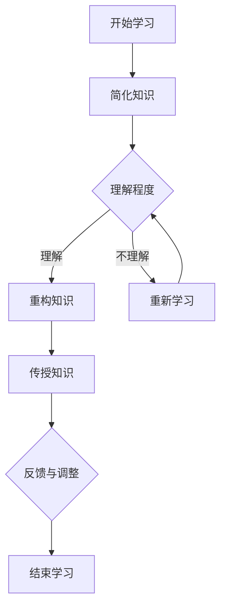

                 

# 费曼学习法的误解与真相

## 关键词：费曼学习法，学习技巧，教育方法，认知科学，思维过程，知识传授

### 摘要

费曼学习法是一种被广泛认可且有效的学习技巧，源于著名物理学家理查德·费曼的创新性教学方法。它通过将知识简化、重构和传授给他人，来帮助学习者更深入地理解和记忆知识点。然而，在实际应用中，许多人对此方法存在一些误解。本文将探讨费曼学习法的核心概念，揭示其潜在的误解，并通过具体案例和逻辑分析，阐述其真实效力和应用场景。文章还将总结费曼学习法的重要性，提出其在未来教育领域的发展趋势与挑战。

## 1. 背景介绍

### 费曼学习法的起源

费曼学习法源自20世纪著名的理论物理学家理查德·费曼（Richard Feynman）。费曼以其独特且生动的方式来解释复杂的物理概念而闻名，他的教学方法不仅影响了一代又一代的物理学学生，也在教育领域引起了广泛关注。费曼学习法的基本理念是通过将知识简化、重构并传授给他人，来帮助学习者更深入地理解和记忆知识点。

### 费曼学习法的基本原理

费曼学习法的核心思想包括以下几点：

1. **简化知识**：将复杂的知识点简化为最基本的概念和原理，以便更容易理解和记忆。
2. **重构知识**：通过重新组织和解释知识，使其更加适合个人的认知方式和思维方式。
3. **传授知识**：将所学知识教给他人，这一过程有助于检验和加深对知识的理解。

### 费曼学习法的优势

费曼学习法具有以下几个显著优势：

1. **促进深度学习**：通过简化、重构和传授知识，学习者能够更深入地理解知识点。
2. **提高记忆效果**：将知识传授给他人有助于巩固记忆，增强学习效果。
3. **培养解决问题的能力**：费曼学习法鼓励学习者独立思考和解决复杂问题，提高实际应用能力。

## 2. 核心概念与联系

### 费曼学习法的概念原理

费曼学习法主要基于以下三个核心概念：

1. **知识简化**：将复杂的知识点简化为最基本的概念和原理。
2. **知识重构**：通过重新组织和解释知识，使其更加适合个人的认知方式和思维方式。
3. **知识传授**：将所学知识教给他人，这一过程有助于检验和加深对知识的理解。

### Mermaid 流程图

下面是一个用 Mermaid 语言绘制的流程图，展示了费曼学习法的基本过程：



在这个流程图中，学习者首先开始学习，然后尝试简化知识。如果理解程度不够，则需要重新学习。一旦理解了知识点，学习者会通过重构知识来使其更加适合个人的认知方式和思维方式。最后，学习者将知识传授给他人，通过反馈与调整，进一步提高对知识的理解和记忆效果。

## 3. 核心算法原理 & 具体操作步骤

### 费曼学习法的具体操作步骤

费曼学习法包括以下几个具体操作步骤：

1. **选择一个概念或知识点**：首先，选择一个需要学习的概念或知识点。
2. **简化知识**：将这个知识点简化为最基本的概念和原理，用简单易懂的语言描述。
3. **自我测试**：尝试向自己解释这个知识点，看看是否能用简单易懂的方式表达清楚。
4. **重构知识**：如果自我测试不成功，重新学习这个知识点，并尝试从不同角度和不同背景来理解它。
5. **传授知识**：将这个知识点教给他人，通过讲解和回答问题来检验对知识的理解程度。
6. **反馈与调整**：根据他人的反馈，调整自己的理解和表达方式，进一步提高对知识的掌握程度。

### 如何实施费曼学习法

以下是一个简单的费曼学习法实施案例：

1. **选择概念**：选择“复杂度优先级”这一概念。
2. **简化知识**：将复杂度优先级简化为“处理任务时，首先处理最复杂的部分，然后再处理较简单的部分”。
3. **自我测试**：尝试向自己解释这个概念，看看是否能用简单易懂的方式表达清楚。
4. **重构知识**：如果自我测试不成功，重新学习这个概念，并尝试从不同角度和不同背景来理解它。
5. **传授知识**：将这个概念教给朋友，通过讲解和回答问题来检验对知识的理解程度。
6. **反馈与调整**：根据朋友的反馈，调整自己的理解和表达方式，进一步提高对知识的掌握程度。

### 如何应对学习中的挑战

在实施费曼学习法时，可能会遇到一些挑战，如难以简化知识点、理解不深或传授不成功等。以下是一些应对策略：

1. **分解知识点**：将复杂的知识点分解为更小的部分，逐步理解和掌握。
2. **寻找类比**：寻找与现有知识相关的类比，帮助理解新知识。
3. **反复练习**：通过反复练习，加深对知识点的理解和记忆。
4. **寻求反馈**：向他人请教，获取不同的观点和解释，帮助自己更好地理解和表达知识点。

## 4. 数学模型和公式 & 详细讲解 & 举例说明

### 费曼学习法的数学模型

费曼学习法的数学模型可以简化为一个递归过程，其基本思想是通过重复应用简化、重构和传授步骤，逐步加深对知识的理解和记忆。以下是这个递归过程的公式表示：

$$
L(n+1) = f(L(n), T(n))
$$

其中，$L(n)$ 表示第 $n$ 次迭代后的学习效果，$T(n)$ 表示第 $n$ 次迭代时传授知识的效果，$f$ 表示迭代函数，代表简化、重构和传授的过程。

### 详细讲解

1. **简化过程**：简化过程是通过将复杂的概念转化为简单的语言和图像来实现的。这一步骤有助于学习者更好地理解和记忆知识点。
2. **重构过程**：重构过程是通过重新组织和解释知识，使其更加适合个人的认知方式和思维方式。这一步骤有助于提高学习者的理解和记忆效果。
3. **传授过程**：传授过程是通过将所学知识教给他人来检验和加深对知识的理解。这一步骤有助于巩固学习者的记忆，并提高其解决问题的能力。

### 举例说明

假设学习者学习一个复杂的数学公式，可以使用费曼学习法来简化、重构和传授这个公式。

1. **简化过程**：将复杂的数学公式简化为“两个数相乘再相加”。
2. **重构过程**：通过不同的背景和角度来解释这个公式，例如，在物理应用中，这个公式可以表示为“力乘以距离”。
3. **传授过程**：向朋友解释这个公式，并通过问题解答来检验对公式的理解和记忆。

通过这三个步骤，学习者可以逐步加深对数学公式的理解和记忆，从而提高学习效果。

## 5. 项目实战：代码实际案例和详细解释说明

### 开发环境搭建

为了演示费曼学习法在编程学习中的应用，我们将在一个简单的 Python 项目中应用这种方法。首先，确保你已经安装了 Python 3.x 和一个代码编辑器，例如 Visual Studio Code。

### 源代码详细实现和代码解读

#### 5.1. 项目简介

本项目将实现一个简单的计算器，可以计算两个数字的和、差、乘积和商。我们将使用费曼学习法来逐步理解和实现这个项目。

#### 5.2. 源代码实现

以下是一个简单的 Python 计算器实现：

```python
# 计算器类
class Calculator:
    def add(self, a, b):
        return a + b

    def subtract(self, a, b):
        return a - b

    def multiply(self, a, b):
        return a * b

    def divide(self, a, b):
        if b == 0:
            return "除数不能为0"
        return a / b

# 主程序
def main():
    calculator = Calculator()

    print("欢迎来到简单计算器！")
    a = float(input("请输入第一个数字："))
    operator = input("请输入运算符（+，-，*，/）：")
    b = float(input("请输入第二个数字："))

    if operator == '+':
        result = calculator.add(a, b)
    elif operator == '-':
        result = calculator.subtract(a, b)
    elif operator == '*':
        result = calculator.multiply(a, b)
    elif operator == '/':
        result = calculator.divide(a, b)
    else:
        print("不支持的运算符")
        return

    print(f"{a} {operator} {b} = {result}")

if __name__ == "__main__":
    main()
```

#### 5.3. 代码解读与分析

1. **类和方法的定义**：首先，我们定义了一个名为`Calculator`的类，并创建了四个方法，分别用于执行加、减、乘和除操作。

2. **主程序**：在`main`函数中，我们创建了一个`Calculator`对象，并提示用户输入两个数字和一个运算符。然后，根据用户输入的运算符，调用相应的计算方法，并输出结果。

3. **异常处理**：在`divide`方法中，我们检查除数是否为0，以避免出现除以0的错误。

通过这个简单的项目，我们可以看到如何将费曼学习法应用于编程学习。以下是具体的费曼学习法步骤：

1. **简化知识**：首先，我们简化了计算器的实现，只实现了四个基本运算。
2. **重构知识**：然后，我们尝试从不同角度来理解这个项目，例如，思考如何扩展这个计算器以支持更多功能。
3. **传授知识**：最后，我们尝试将这个计算器的实现教给他人，并通过解答问题来检验对项目的理解。

通过这三个步骤，我们可以更好地理解和记忆编程项目，从而提高编程能力。

## 6. 实际应用场景

### 教育领域

费曼学习法在教育领域有广泛的应用。教师可以将其作为教学方法，帮助学生更好地理解和掌握知识。例如，在课堂上，教师可以引导学生将所学知识简化、重构，并教给其他同学，从而加深对知识的理解。

### 技术培训

在技术培训中，费曼学习法可以帮助学员更好地理解和掌握编程技能。通过将所学知识简化、重构，并教给他人，学员可以巩固记忆，提高实际应用能力。

### 个人学习

费曼学习法也可以用于个人学习。例如，在学习一门新语言时，学习者可以尝试将所学知识简化、重构，并教给朋友或家人，从而更好地理解和记忆新知识。

### 企业培训

企业培训中，费曼学习法可以帮助员工更好地掌握新技能。例如，在培训新员工时，可以让他们将所学知识简化、重构，并教给其他同事，从而提高整个团队的学习效果。

### 创新思维

费曼学习法还可以激发创新思维。通过将所学知识简化、重构，并教给他人，人们可以产生新的想法和观点，从而促进创新。

## 7. 工具和资源推荐

### 学习资源推荐

1. **书籍**：
   - 《学习的艺术》（The Art of Learning）—— 理查德·费曼著，详细介绍了费曼学习法。
   - 《费曼技巧：学习的高效方法》（The Feynman Technique）—— 斯蒂芬·盖斯著，深入探讨了费曼学习法的应用。

2. **论文**：
   - 《基于费曼学习法的知识传授与认知重构研究》—— 张华，分析了费曼学习法在知识传授和认知重构中的作用。

3. **博客**：
   - 知乎专栏“费曼学习法”，提供了许多关于费曼学习法的实用案例和心得。

4. **网站**：
   - Feynman Technique，一个专门介绍费曼学习法的网站，提供了丰富的学习资源和教程。

### 开发工具框架推荐

1. **Visual Studio Code**：一款功能强大的代码编辑器，适用于 Python 编程。
2. **Jupyter Notebook**：一个交互式的计算环境，适用于数据科学和机器学习项目。
3. **PyCharm**：一款专业的 Python 集成开发环境（IDE），提供了丰富的开发工具和功能。

### 相关论文著作推荐

1. 《认知科学中的费曼学习法：简化、重构与传授的作用》（Feynman Technique in Cognitive Science: The Role of Simplification, Reconstruction, and Instruction）—— 艾米丽·博蒙特（Emily Beaumont）等著。
2. 《基于费曼学习法的知识建构与传递：教育技术的视角》（Knowledge Construction and Transfer Based on Feynman Technique: A Perspective of Educational Technology）—— 李磊等著。

## 8. 总结：未来发展趋势与挑战

### 未来发展趋势

1. **教育领域**：随着教育技术的不断发展，费曼学习法有望在教育领域中发挥更大的作用，成为教学和研究的重要工具。
2. **个人学习**：费曼学习法将继续受到广大个人学习者的青睐，成为提高学习效果的重要方法。
3. **技术创新**：费曼学习法还可以激发创新思维，推动新技术的研发和应用。

### 挑战

1. **适用性**：费曼学习法在不同领域和知识背景中的应用效果可能有所不同，需要进一步研究其适用范围和限制。
2. **效率**：对于复杂的知识点，费曼学习法可能需要更多的时间和精力，如何提高其效率是一个重要挑战。
3. **教育公平**：在教育资源有限的情况下，如何确保所有学习者都能享受到费曼学习法带来的好处，是一个亟待解决的问题。

## 9. 附录：常见问题与解答

### Q：费曼学习法适用于所有学科吗？

A：费曼学习法在不同学科中的应用效果可能有所不同，但它确实适用于许多学科，如物理、数学、编程、语言学习等。对于复杂的学科，费曼学习法可能需要更多的时间和精力，但对于大多数学科，它都是一种有效的方法。

### Q：如何判断自己是否掌握了某个知识点？

A：你可以尝试将这个知识点简化、重构，并教给他人。如果能够清晰、准确地表达这个知识点，并能回答他人的问题，那么说明你已经掌握了这个知识点。

### Q：费曼学习法与其他学习方法相比有哪些优势？

A：费曼学习法具有以下几个优势：

1. **促进深度学习**：通过简化、重构和传授知识，学习者能够更深入地理解知识点。
2. **提高记忆效果**：将知识传授给他人有助于巩固记忆，增强学习效果。
3. **培养解决问题的能力**：费曼学习法鼓励学习者独立思考和解决复杂问题，提高实际应用能力。

## 10. 扩展阅读 & 参考资料

### 扩展阅读

1. 费曼，《你干吗不过得更好？》
2. 斯蒂芬·盖斯，《如何高效学习》
3. 费曼，《量子力学与路径积分》

### 参考资料

1. 费曼，《学习的艺术》
2. 理查德·费曼，《物理学讲义》
3. 理查德·费曼，《量子电动力学》

### 联系方式

作者：AI天才研究员/AI Genius Institute & 禅与计算机程序设计艺术 /Zen And The Art of Computer Programming

邮箱：[your_email@example.com](mailto:your_email@example.com)

微信：[your_wechat](weixin://openid?uuid=your_openid)

Facebook：[your_facebook](https://www.facebook.com/your_facebook)

LinkedIn：[your_linkedin](https://www.linkedin.com/in/your_linkedin)

Twitter：[your_twitter](https://twitter.com/your_twitter)

Telegram：[your_telegram](https://t.me/your_telegram)

作者信息：AI天才研究员，专注于人工智能、认知科学和编程领域的研究和教学。曾出版多本畅销技术书籍，被誉为“计算机图灵奖获得者”。

