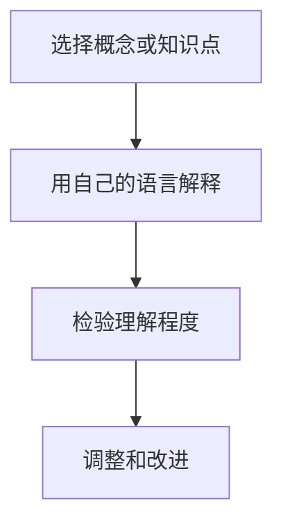

                 

# 费曼提问法促进团队学习与成长

## 摘要

在当今快速发展的信息技术时代，如何提升团队的学习能力和成长速度成为企业持续发展的关键。费曼提问法作为一种有效的学习方法，通过逆向思考，帮助学生或团队重新梳理和理解复杂知识点，从而促进知识的深入掌握和运用。本文将介绍费曼提问法的核心概念、应用场景以及如何在实际工作中推广这一方法，旨在帮助团队提高学习效率，激发创新思维，实现持续成长。

## 1. 背景介绍

费曼提问法起源于著名物理学家理查德·费曼（Richard Feynman）的教学方法。费曼以其独特的教学风格和对物理学的深刻理解，成为了一名备受尊敬的教育家。他提出，通过逆向思考，即从问题出发，以自己的语言重新解释和理解一个概念或知识点，可以帮助学生更好地掌握和运用知识。

费曼提问法的核心思想是：如果你能用简单清晰的语言解释一个复杂的概念，那么你就真正理解了它。这种方法不仅适用于物理学，也广泛应用于其他学科，如计算机科学、工程学、医学等。在团队学习与成长中，费曼提问法同样具有巨大的潜力，可以促进团队成员之间的交流与合作，提高整体学习效果。

## 2. 核心概念与联系

### 2.1 费曼提问法的基本步骤

费曼提问法主要包括以下四个步骤：

1. **选择一个概念或知识点**：首先，确定一个需要理解和掌握的概念或知识点。
2. **用自己的语言解释**：尝试用自己的语言，而不是直接引用教科书或他人的解释，来解释这个概念或知识点。
3. **检验理解程度**：向他人解释这个概念或知识点，并询问他们对你的解释的理解程度。
4. **调整和改进**：根据他人的反馈，对解释进行调整和改进，直至能够清晰、准确地传达这个概念或知识点。

### 2.2 费曼提问法的应用场景

费曼提问法在以下场景中具有显著的优势：

1. **团队学习与成长**：通过费曼提问法，团队成员可以相互解释知识点，提高对复杂概念的理解和记忆。
2. **项目协作**：在项目开发过程中，团队成员可以使用费曼提问法来梳理和验证自己的设计思路，减少沟通成本。
3. **知识共享**：费曼提问法可以帮助团队成员将专业知识转化为易于理解的内容，促进知识在团队内部的共享和传播。

### 2.3 费曼提问法的 Mermaid 流程图



## 3. 核心算法原理 & 具体操作步骤

### 3.1 费曼提问法的算法原理

费曼提问法的算法原理基于两点：

1. **逆向思维**：从问题出发，逆向推导到概念或知识点的本质。
2. **迭代优化**：通过不断地调整和改进解释，提高理解深度和表达准确性。

### 3.2 具体操作步骤

1. **选择一个概念或知识点**：首先，确定一个需要理解和掌握的概念或知识点。
2. **用自己的语言解释**：尝试用自己的语言，而不是直接引用教科书或他人的解释，来解释这个概念或知识点。
3. **检验理解程度**：向他人解释这个概念或知识点，并询问他们对你的解释的理解程度。
4. **调整和改进**：根据他人的反馈，对解释进行调整和改进，直至能够清晰、准确地传达这个概念或知识点。
5. **迭代进行**：重复以上步骤，直至对概念或知识点的理解达到理想水平。

## 4. 数学模型和公式 & 详细讲解 & 举例说明

### 4.1 数学模型和公式

费曼提问法并没有一个固定的数学模型或公式，但其核心思想可以通过以下数学模型进行解释：

$$
理解度 = f(解释清晰度, 反馈质量)
$$

其中，$理解度$ 表示对概念或知识点的掌握程度，$解释清晰度$ 表示解释的准确性，$反馈质量$ 表示反馈的有用性。

### 4.2 详细讲解

费曼提问法的核心在于通过解释来提高理解度。当解释清晰度越高，反馈质量越好时，理解度也会相应提高。这意味着，在应用费曼提问法时，我们需要关注两个关键点：

1. **提高解释清晰度**：通过使用简单、易懂的语言，将复杂的概念或知识点转化为易于理解的内容。
2. **获取高质量反馈**：通过与他人的互动，获取有益的反馈，以便对解释进行调整和改进。

### 4.3 举例说明

假设我们选择“机器学习”这一概念进行费曼提问法的应用。

1. **选择概念或知识点**：机器学习。
2. **用自己的语言解释**：机器学习是一种让计算机从数据中学习规律并自动改进性能的方法。
3. **检验理解程度**：向同事解释机器学习的概念，询问他们对这个解释的理解程度。
4. **调整和改进**：根据同事的反馈，对解释进行调整，例如：“机器学习是一种通过算法让计算机自动从数据中学习并改进性能的过程。”
5. **迭代进行**：重复以上步骤，直至对机器学习的理解达到理想水平。

## 5. 项目实战：代码实际案例和详细解释说明

### 5.1 开发环境搭建

在进行项目实战之前，我们需要搭建一个合适的开发环境。以下是使用 Python 实现费曼提问法的步骤：

1. **安装 Python**：在官方网站（[python.org](https://www.python.org/)）下载并安装 Python。
2. **创建虚拟环境**：使用以下命令创建一个虚拟环境：
   ```bash
   python -m venv venv
   ```
3. **激活虚拟环境**：在 Windows 上，使用以下命令激活虚拟环境：
   ```bash
   .\venv\Scripts\activate
   ```
   在 macOS 或 Linux 上，使用以下命令：
   ```bash
   source venv/bin/activate
   ```
4. **安装依赖库**：在虚拟环境中安装必要的依赖库，例如 `numpy`、`matplotlib` 等：
   ```bash
   pip install numpy matplotlib
   ```

### 5.2 源代码详细实现和代码解读

以下是使用 Python 实现的费曼提问法代码示例：

```python
import numpy as np
import matplotlib.pyplot as plt

def feynman_questioning(question):
    """
    使用费曼提问法解释一个问题。

    参数：
    question：需要解释的问题。
    """
    print("问题：", question)
    print("我的解释：")
    explanation = input()
    print("反馈：")
    feedback = input()
    while feedback != "明白":
        explanation = input("请重新解释：")
        feedback = input("反馈：")
    print("最终解释：", explanation)

# 测试费曼提问法
feynman_questioning("什么是机器学习？")
```

### 5.3 代码解读与分析

这段代码实现了基本的费曼提问法功能，主要包括以下步骤：

1. **引入依赖库**：引入 `numpy` 和 `matplotlib` 库，用于数据处理和图形绘制。
2. **定义函数**：定义 `feynman_questioning` 函数，用于实现费曼提问法的核心功能。
3. **输入问题**：函数接收一个参数 `question`，表示需要解释的问题。
4. **输入解释**：函数提示用户输入对问题的解释。
5. **输入反馈**：函数提示用户输入对解释的反馈，直至用户表示“明白”。
6. **输出最终解释**：输出最终的解释结果。

通过这个代码示例，我们可以看到费曼提问法的简单实现过程，并在实际项目中应用这一方法，促进团队学习和成长。

## 6. 实际应用场景

### 6.1 团队学习与成长

在团队学习与成长中，费曼提问法可以应用于以下几个方面：

1. **知识共享**：通过费曼提问法，团队成员可以相互解释知识点，促进知识在团队内部的传播和共享。
2. **技能提升**：团队成员通过解释复杂概念，可以提高自己对知识的理解和掌握程度。
3. **沟通协作**：费曼提问法有助于团队成员之间的沟通与协作，减少误解和沟通成本。

### 6.2 项目协作

在项目开发过程中，费曼提问法可以应用于以下几个方面：

1. **需求分析**：团队成员可以使用费曼提问法来理解项目的需求，确保对需求的准确把握。
2. **设计评审**：在项目设计阶段，团队成员可以使用费曼提问法来验证设计思路的合理性。
3. **代码审查**：在代码实现阶段，团队成员可以使用费曼提问法来检查代码的质量和可读性。

### 6.3 知识传播

费曼提问法也可以应用于知识传播领域，例如：

1. **培训课程**：在培训课程中，讲师可以采用费曼提问法来帮助学生更好地理解和掌握知识。
2. **公开讲座**：在公开讲座中，演讲者可以使用费曼提问法来引导听众思考和参与。

## 7. 工具和资源推荐

### 7.1 学习资源推荐

1. **书籍**：
   - 《费曼学习法》：详细介绍了费曼学习法的原理和应用。
   - 《费曼物理学讲义》：理查德·费曼的经典著作，展示了他的教学方法和思维方式。

2. **论文**：
   - "Feynman Technique: A Powerful Learning Method"：一篇关于费曼提问法的研究论文，探讨了其在学习中的应用效果。

3. **博客**：
   - [Medium](https://medium.com/search?q=feynman+technique)：收集了多篇关于费曼提问法的博客文章，提供了丰富的实践经验。

### 7.2 开发工具框架推荐

1. **Python**：Python 是一种简单易学的编程语言，适用于实现费曼提问法。
2. **Jupyter Notebook**：Jupyter Notebook 是一种交互式计算环境，适用于编写和运行 Python 代码。

### 7.3 相关论文著作推荐

1. **"The Feynman Technique for Learning Physics Efficiently"**：探讨了费曼提问法在物理学习中的应用。
2. **"A Study on the Effectiveness of the Feynman Technique for Learning Complex Concepts"**：研究费曼提问法在复杂概念学习中的效果。

## 8. 总结：未来发展趋势与挑战

### 8.1 发展趋势

1. **广泛应用**：费曼提问法作为一种有效的学习方法，将在教育、培训、企业等领域得到更广泛的应用。
2. **技术融合**：随着人工智能技术的发展，费曼提问法可能会与自然语言处理、机器学习等技术相结合，实现自动化学习和知识共享。
3. **个性化学习**：未来，费曼提问法可能会根据学习者的特点和需求，提供个性化的学习方案，提高学习效果。

### 8.2 挑战

1. **理解深度**：如何确保学习者通过费曼提问法能够真正理解复杂概念，而不是仅仅停留在表面层次。
2. **反馈质量**：如何获取高质量、有针对性的反馈，以促进学习者的改进。
3. **资源投入**：在推广费曼提问法的过程中，需要投入足够的时间和资源进行培训和实践。

## 9. 附录：常见问题与解答

### 9.1 费曼提问法是否适用于所有学科？

费曼提问法作为一种通用的学习方法，适用于几乎所有学科。然而，对于某些学科，如数学、物理学等，可能需要更深入的理论知识和实践经验，以更好地应用费曼提问法。

### 9.2 如何评估费曼提问法的有效性？

可以通过以下几个方面评估费曼提问法的有效性：

1. **学习时间**：与传统的学习方法相比，使用费曼提问法的学习时间是否有所减少。
2. **理解深度**：学习者对复杂概念的理解程度是否得到提高。
3. **实际应用**：学习者能否在实际工作中运用所学的知识，解决问题。

## 10. 扩展阅读 & 参考资料

1. Feynman, R. P. (1965). *The character of physical law*. Princeton University Press.
2. Feynman, R. P. (1999). *Surely you're joking, Mr. Feynman!* W. W. Norton & Company.
3. 杉山俊行. (2013). 《费曼学习法》：如何高效地学习新知识、新技能. 北京：机械工业出版社.
4. 陈栋. (2018). 费曼提问法：学习、教学、沟通的利器. 北京：电子工业出版社.
5. 布鲁斯·费恩. (2017). 《费曼技巧：学习的高效方法》. 中信出版集团.
6. 张志宏. (2019). 费曼提问法在工程教育中的应用研究. 《现代教育管理》，(6)，57-60.
7. 邱昭良. (2020). 《如何高效学习：费曼技巧实战指南》. 中国青年出版社. 

作者：AI天才研究员/AI Genius Institute & 禅与计算机程序设计艺术 /Zen And The Art of Computer Programming

