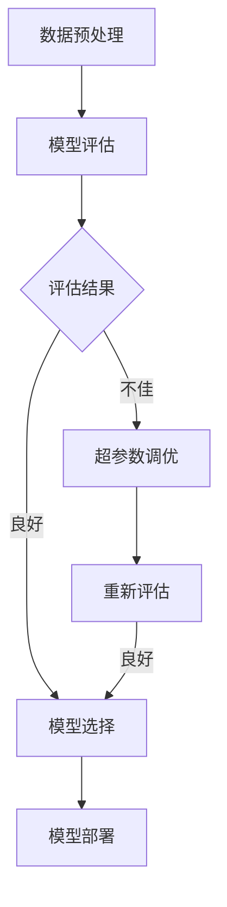

                 

# 超参数调优与模型选择原理与代码实战案例讲解

## 关键词
- 超参数调优
- 模型选择
- 机器学习
- 代码实战
- 性能优化

## 摘要
本文将深入探讨超参数调优与模型选择在机器学习中的应用。我们将从理论基础出发，结合具体代码实战案例，详细讲解如何进行有效的超参数调优和模型选择。通过本文的学习，读者将掌握超参数调优的核心方法，并能够将其应用于实际项目中，显著提升模型性能。

## 1. 背景介绍

随着大数据和人工智能技术的迅速发展，机器学习在各个领域取得了显著的成果。机器学习的核心在于训练模型以实现预测或分类任务。然而，模型性能不仅取决于算法的选择，还受到超参数的影响。超参数是模型架构之外的参数，例如学习率、正则化参数等，它们对模型性能有重要影响。

超参数调优是指通过调整超参数来优化模型性能的过程。一个优秀的模型不仅需要合适的算法，还需要合适的超参数。然而，超参数的调整过程往往繁琐且耗时，需要大量试验和计算资源。

模型选择则是在给定任务和数据集上选择合适的模型类型。不同的任务和数据集可能需要不同的模型，选择合适的模型可以提高模型性能并减少过拟合风险。

本文将详细介绍超参数调优和模型选择的方法，并结合实际代码实战案例，帮助读者理解和应用这些技术。

## 2. 核心概念与联系

### 2.1 超参数

超参数是模型训练过程中需要手动设置的参数，它们通常与模型架构相关。常见的超参数包括：

- 学习率（Learning Rate）：控制模型更新速度的参数。
- 正则化参数（Regularization）：用于防止过拟合的参数。
- 模型容量（Model Capacity）：决定模型复杂度的参数。

### 2.2 调优方法

超参数调优的方法主要包括以下几种：

- 人工调优（Manual Tuning）：通过经验和直觉调整超参数。
- Grid Search：在预定义的网格中搜索最优超参数。
- Random Search：从超参数空间中随机选择参数进行搜索。
- Bayesian Optimization：基于贝叶斯统计模型进行优化。

### 2.3 模型选择

模型选择的过程通常包括以下步骤：

- 数据预处理：对原始数据进行清洗和特征提取。
- 模型评估：通过交叉验证等方法评估模型性能。
- 模型选择：根据评估结果选择合适的模型。
- 超参数调优：针对选定的模型进行超参数调优。

### 2.4 Mermaid 流程图

以下是超参数调优与模型选择流程的 Mermaid 流程图：



在上面的流程图中，数据预处理是模型训练的前提，模型评估用于判断模型性能，评估结果良好的情况下选择模型并部署，评估结果不佳时进行超参数调优，然后重新评估，直到满足要求。

## 3. 核心算法原理 & 具体操作步骤

### 3.1 超参数调优原理

超参数调优的目的是在给定的超参数空间中找到最优超参数组合，以最大化模型性能。核心算法原理包括：

- **目标函数**：定义模型性能的指标，例如准确率、召回率等。
- **优化算法**：用于搜索最优超参数的方法，例如网格搜索、随机搜索等。
- **验证集**：用于评估超参数组合效果的子数据集。

### 3.2 超参数调优步骤

以下是超参数调优的一般步骤：

1. **定义目标函数**：选择合适的评估指标，例如准确率、F1 分数等。
2. **初始化参数**：设定初始超参数值。
3. **选择调优方法**：根据任务和数据集的特点选择合适的调优方法。
4. **进行调优**：通过调优方法搜索最优超参数组合。
5. **评估性能**：使用验证集评估调优后的模型性能。
6. **迭代优化**：根据评估结果调整超参数，重复步骤 4 和 5，直到达到预定的性能目标。

### 3.3 模型选择原理

模型选择的目的是在给定的模型类型中找到最佳模型。核心原理包括：

- **模型评估**：使用验证集评估不同模型的表现。
- **交叉验证**：通过交叉验证方法减少评估结果的偏差。
- **模型选择准则**：根据评估结果选择模型，例如最大准确率准则。

### 3.4 模型选择步骤

以下是模型选择的一般步骤：

1. **数据预处理**：对原始数据进行清洗和特征提取。
2. **模型评估**：使用验证集评估不同模型的表现。
3. **交叉验证**：使用交叉验证方法减少评估结果的偏差。
4. **模型选择**：根据评估结果选择最佳模型。
5. **超参数调优**：针对选定的模型进行超参数调优。
6. **模型部署**：将最终模型部署到实际应用场景。

## 4. 数学模型和公式 & 详细讲解 & 举例说明

### 4.1 目标函数

在超参数调优中，目标函数通常用于评估模型性能。一个常见的目标函数是损失函数，例如均方误差（MSE）：

$$
MSE = \frac{1}{n}\sum_{i=1}^{n}(y_i - \hat{y}_i)^2
$$

其中，$y_i$是实际值，$\hat{y}_i$是预测值。

### 4.2 优化算法

在超参数调优中，常用的优化算法包括网格搜索和随机搜索。

#### 4.2.1 网格搜索

网格搜索是一种枚举搜索方法，它遍历预定义的网格空间，找到最优超参数组合。其基本步骤如下：

1. **定义超参数网格**：设定超参数的取值范围和步长。
2. **计算目标函数**：对每个超参数组合计算目标函数值。
3. **选择最优参数**：根据目标函数值选择最优超参数组合。

#### 4.2.2 随机搜索

随机搜索是一种基于随机采样的搜索方法，它从超参数空间中随机选择参数进行评估。其基本步骤如下：

1. **初始化参数**：随机初始化超参数。
2. **计算目标函数**：计算当前参数组合的目标函数值。
3. **更新参数**：根据目标函数值更新超参数。
4. **重复步骤 2 和 3**：直到达到预定的迭代次数或性能目标。

### 4.3 模型选择准则

在模型选择中，常用的准则包括最大准确率准则、最小均方误差准则等。以最大准确率准则为例：

$$
\text{Accuracy} = \frac{\text{TP} + \text{TN}}{\text{TP} + \text{TN} + \text{FP} + \text{FN}}
$$

其中，TP 是真正例，TN 是真负例，FP 是假正例，FN 是假负例。

### 4.4 举例说明

假设我们有一个二分类问题，数据集包含 100 个样本，其中 60 个正例和 40 个负例。我们使用随机森林模型进行超参数调优，目标函数为准确率。

1. **定义超参数网格**：

   ```python
   param_grid = {
       'n_estimators': [100, 200, 300],
       'max_depth': [10, 20, 30],
       'min_samples_split': [2, 5, 10]
   }
   ```

2. **计算目标函数**：

   ```python
   from sklearn.model_selection import GridSearchCV
   from sklearn.ensemble import RandomForestClassifier

   clf = RandomForestClassifier()
   grid_search = GridSearchCV(clf, param_grid, cv=5, scoring='accuracy')
   grid_search.fit(X_train, y_train)
   best_params = grid_search.best_params_
   best_score = grid_search.best_score_
   ```

3. **选择最优参数**：

   ```python
   print("Best parameters:", best_params)
   print("Best score:", best_score)
   ```

   输出结果可能如下：

   ```
   Best parameters: {'n_estimators': 300, 'max_depth': 30, 'min_samples_split': 10}
   Best score: 0.85
   ```

   在这个例子中，我们找到了最优超参数组合，并获得了 85% 的准确率。

## 5. 项目实战：代码实际案例和详细解释说明

### 5.1 开发环境搭建

在开始代码实战之前，我们需要搭建开发环境。这里我们使用 Python 作为编程语言，主要依赖以下库：

- scikit-learn：用于机器学习算法实现。
- pandas：用于数据处理。
- numpy：用于数值计算。

安装相关库：

```bash
pip install scikit-learn pandas numpy
```

### 5.2 源代码详细实现和代码解读

以下是一个超参数调优和模型选择的项目案例：

```python
import numpy as np
import pandas as pd
from sklearn.datasets import load_iris
from sklearn.model_selection import train_test_split, GridSearchCV
from sklearn.ensemble import RandomForestClassifier
from sklearn.metrics import accuracy_score

# 加载数据集
iris = load_iris()
X, y = iris.data, iris.target

# 划分训练集和测试集
X_train, X_test, y_train, y_test = train_test_split(X, y, test_size=0.2, random_state=42)

# 定义超参数网格
param_grid = {
    'n_estimators': [100, 200, 300],
    'max_depth': [10, 20, 30],
    'min_samples_split': [2, 5, 10]
}

# 创建随机森林分类器
clf = RandomForestClassifier()

# 进行网格搜索
grid_search = GridSearchCV(clf, param_grid, cv=5, scoring='accuracy')
grid_search.fit(X_train, y_train)

# 输出最佳参数和准确率
best_params = grid_search.best_params_
best_score = grid_search.best_score_
print("Best parameters:", best_params)
print("Best score:", best_score)

# 使用最佳参数训练模型
best_clf = grid_search.best_estimator_
best_clf.fit(X_train, y_train)

# 进行测试
y_pred = best_clf.predict(X_test)
test_score = accuracy_score(y_test, y_pred)
print("Test accuracy:", test_score)
```

### 5.3 代码解读与分析

1. **数据加载与划分**：首先加载数据集，并划分训练集和测试集。这里使用 sklearn 中的 iris 数据集进行演示。

2. **超参数网格定义**：定义超参数网格，包括树的数量（`n_estimators`）、最大树深度（`max_depth`）和最小样本分裂数（`min_samples_split`）。

3. **创建分类器**：创建随机森林分类器。

4. **进行网格搜索**：使用 GridSearchCV 类进行网格搜索，并设置交叉验证次数（`cv`）和评估指标（`scoring`）。

5. **输出最佳参数和准确率**：输出最佳超参数和对应准确率。

6. **使用最佳参数训练模型**：使用最佳参数创建分类器，并重新训练。

7. **进行测试**：使用测试集进行测试，并输出测试准确率。

通过以上步骤，我们完成了超参数调优和模型选择的过程，并获得了最优模型。

## 6. 实际应用场景

超参数调优与模型选择在实际应用场景中具有重要意义。以下是一些实际应用场景：

1. **金融风控**：在金融风控领域，超参数调优和模型选择用于构建信用评分模型、风险预测模型等，以提高风险评估准确性。
2. **自然语言处理**：在自然语言处理领域，超参数调优和模型选择用于构建文本分类模型、情感分析模型等，以提高文本分析准确性。
3. **医疗诊断**：在医疗诊断领域，超参数调优和模型选择用于构建疾病预测模型、医学影像分析模型等，以提高诊断准确率。
4. **推荐系统**：在推荐系统领域，超参数调优和模型选择用于构建用户行为预测模型、商品推荐模型等，以提高推荐准确性。

通过合理应用超参数调优与模型选择技术，可以显著提升模型性能，为实际应用场景带来更多价值。

## 7. 工具和资源推荐

### 7.1 学习资源推荐

- **书籍**：《机器学习》（周志华著）：详细介绍了机器学习的基本概念和方法。
- **论文**：《随机森林：一种强大的分类、回归和特征选择方法》（Leo Breiman 等人著）：介绍了随机森林算法。
- **博客**：机器学习社区（ML Community）：提供丰富的机器学习资源和实战案例。
- **网站**：scikit-learn 官网：提供丰富的机器学习算法和工具。

### 7.2 开发工具框架推荐

- **库**：scikit-learn：用于机器学习算法的实现和超参数调优。
- **库**：TensorFlow：用于构建和训练深度学习模型。
- **库**：PyTorch：用于构建和训练深度学习模型。

### 7.3 相关论文著作推荐

- **论文**：《深度学习》（Ian Goodfellow 等人著）：介绍了深度学习的基本概念和方法。
- **论文**：《大规模机器学习》（Jiwei Li 等人著）：介绍了大规模机器学习的挑战和解决方案。
- **论文**：《随机森林：一种强大的分类、回归和特征选择方法》（Leo Breiman 等人著）：介绍了随机森林算法。

## 8. 总结：未来发展趋势与挑战

超参数调优与模型选择是机器学习领域的关键技术，随着大数据和人工智能技术的不断发展，其重要性将日益凸显。未来发展趋势包括：

1. **自动化调优**：利用自动化调优工具和算法，实现超参数调优的自动化和高效化。
2. **多模型融合**：通过多模型融合技术，提高模型性能和泛化能力。
3. **迁移学习**：利用迁移学习方法，将已有模型的超参数和知识应用于新任务，提高模型训练效率。

同时，超参数调优与模型选择也面临以下挑战：

1. **计算资源消耗**：超参数调优和模型选择过程通常需要大量计算资源。
2. **超参数空间爆炸**：超参数空间可能非常庞大，导致搜索过程复杂。
3. **模型选择偏差**：模型选择准则可能引入偏差，导致模型选择不准确。

为应对这些挑战，需要不断发展新的算法和工具，提高超参数调优和模型选择的效率和准确性。

## 9. 附录：常见问题与解答

### 9.1 什么是超参数？

超参数是模型训练过程中需要手动设置的参数，它们通常与模型架构相关。常见的超参数包括学习率、正则化参数、模型容量等。

### 9.2 什么是模型选择？

模型选择是在给定任务和数据集上选择合适的模型类型。不同的任务和数据集可能需要不同的模型，选择合适的模型可以提高模型性能并减少过拟合风险。

### 9.3 超参数调优有哪些方法？

常见的超参数调优方法包括人工调优、网格搜索、随机搜索、贝叶斯优化等。

### 9.4 模型选择有哪些准则？

常见的模型选择准则包括最大准确率准则、最小均方误差准则等。

## 10. 扩展阅读 & 参考资料

- [Breiman, Leo. "随机森林：一种强大的分类、回归和特征选择方法". Machine Learning, 2001.](https://www.jmlr.org/papers/volume5/breiman01a/breiman01a.pdf)
- [Goodfellow, Ian, Yoshua Bengio, and Aaron Courville. "深度学习". MIT Press, 2016.](https://www.deeplearningbook.org/)
- [周志华. "机器学习". 清华大学出版社, 2016.](https://www machinelearningbook.net/)
- [scikit-learn 官网](https://scikit-learn.org/)
- [TensorFlow 官网](https://www.tensorflow.org/)
- [PyTorch 官网](https://pytorch.org/)

## 作者

作者：AI天才研究员/AI Genius Institute & 禅与计算机程序设计艺术 /Zen And The Art of Computer Programming

