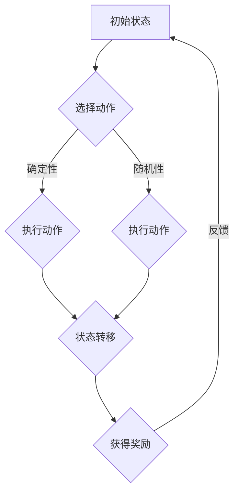

                 

### 背景介绍

#### AlphaGo的崛起

2016年，一场震撼全球的围棋比赛在韩国首尔展开，来自中国的围棋AI“AlphaGo”对阵世界围棋冠军李世石。这场人机大战吸引了全球数百万观众的目光，最终AlphaGo以4-1的战绩战胜了李世石，成为围棋史上的一个重要里程碑。

AlphaGo的胜利不仅标志着人工智能在围棋领域取得了突破性进展，更为AI的发展开辟了新的方向。这场胜利背后的技术核心，正是强化学习（Reinforcement Learning）的强大力量。

#### 强化学习的基本概念

强化学习是机器学习中的一种重要方法，其核心思想是通过与环境的交互，学习最优策略以最大化累积奖励。与传统监督学习和无监督学习不同，强化学习需要通过试错（Trial and Error）来不断优化行为策略。

强化学习的基本流程包括以下几个步骤：

1. **状态（State）**：系统当前所处的情境。
2. **动作（Action）**：系统可以采取的行动。
3. **奖励（Reward）**：每次动作后系统获得的即时奖励，用于评估当前动作的优劣。
4. **策略（Policy）**：系统根据当前状态选择动作的规则。
5. **价值函数（Value Function）**：预测在未来采取某个策略时能够获得的累计奖励。
6. **模型（Model）**：环境对动作的反馈模型。

通过不断试错和调整策略，强化学习模型可以逐步学习到最优的行动策略。

#### 强化学习在AlphaGo中的应用

AlphaGo在比赛中使用了深度强化学习（Deep Reinforcement Learning）技术，通过以下三个主要模块实现了自我学习和棋谱分析：

1. **深度神经网络（Deep Neural Network）**：用于模拟围棋策略网络和价值网络，前者生成可能的动作，后者评估动作的价值。
2. **策略网络（Policy Network）**：根据当前棋盘状态生成可能的动作。
3. **价值网络（Value Network）**：预测当前局面下的胜率。

AlphaGo通过不断与对手对弈，结合强化学习算法，逐步优化自己的策略网络和价值网络，实现了在围棋领域的卓越表现。

#### 背景介绍的重要性

了解AlphaGo的背景和强化学习的基本概念，有助于我们更好地理解本文接下来要探讨的内容。强化学习作为一种先进的机器学习技术，已经在多个领域取得了显著的成果。本文将深入分析强化学习的核心算法原理、数学模型和实际应用案例，探讨其未来的发展趋势和挑战。

通过本文的阅读，我们将对强化学习有更深入的理解，并能够将其应用到实际项目中，推动人工智能的进一步发展。

### 核心概念与联系

在深入了解强化学习之前，我们需要明确几个核心概念，并探讨它们之间的联系。这些核心概念包括：马尔可夫决策过程（MDP）、策略、价值函数、模型以及状态、动作和奖励之间的关系。

#### 马尔可夫决策过程（MDP）

马尔可夫决策过程（Markov Decision Process，MDP）是强化学习中的基本模型。它描述了智能体（agent）在不确定环境中进行决策的过程。一个MDP由以下五个元素组成：

1. **状态空间（State Space）**：所有可能的状态集合，通常表示为 \( S \)。
2. **动作空间（Action Space）**：所有可能的动作集合，通常表示为 \( A \)。
3. **奖励函数（Reward Function）**：定义在每个状态下执行每个动作后获得的即时奖励，通常表示为 \( R(s, a) \)。
4. **状态转移概率（State Transition Probability）**：描述在当前状态下执行某个动作后转移到下一个状态的概率，通常表示为 \( P(s', s|s, a) \)。
5. **策略（Policy）**：定义了在给定状态下应采取哪个动作的策略，通常表示为 \( \pi(a|s) \)。

#### 策略（Policy）

策略是强化学习中至关重要的概念。它定义了智能体在特定状态下应该采取的动作，是决策的核心。策略可以通过经验进行学习，也可以通过数学模型进行推导。常见的策略包括确定性策略（Deterministic Policy）和随机性策略（Stochastic Policy）。

- **确定性策略**：在给定状态下，总是选择最优动作的策略。
- **随机性策略**：在给定状态下，选择动作的概率分布，使得每个动作都有一定的概率被选中。

#### 价值函数（Value Function）

价值函数是用于评估状态或状态-动作对的好坏的一种函数。在强化学习中，主要涉及两种价值函数：

1. **状态价值函数（State Value Function）**：表示在给定状态下采取最优动作所能获得的期望累计奖励，通常表示为 \( V(s) \)。
2. **动作价值函数（Action Value Function）**：表示在给定状态下执行特定动作所能获得的期望累计奖励，通常表示为 \( Q(s, a) \)。

#### 模型（Model）

模型是用于描述环境对动作的反馈的一种数学模型。在强化学习中，模型可以帮助智能体预测状态转移概率和奖励，从而优化策略。模型可以是一个简单的概率分布，也可以是一个复杂的函数模型。

#### 状态、动作和奖励的关系

状态、动作和奖励是强化学习中的三个基本要素，它们之间的关系如下：

1. **状态和动作的关系**：状态是决策的依据，每个状态对应多个可能的动作。
2. **动作和奖励的关系**：每个动作都会导致一个状态的转移，并可能获得一个即时奖励。
3. **状态转移和奖励的关系**：状态转移概率和奖励函数共同决定了智能体在环境中行为的长期效果。

#### Mermaid 流程图

为了更好地理解这些核心概念之间的联系，我们可以使用Mermaid流程图进行可视化描述。以下是MDP的基本流程图：



在这个流程图中，智能体从初始状态开始，根据当前状态选择动作，执行动作后发生状态转移并获得奖励，然后根据奖励反馈调整策略，继续进行下一轮决策。

#### 关键概念之间的联系

通过上述核心概念的分析，我们可以看出它们之间的紧密联系：

1. **策略和价值函数的关系**：策略决定了智能体在每个状态下的行为，价值函数用于评估行为的好坏。
2. **模型和环境的关系**：模型用于预测环境对动作的反馈，从而优化策略。
3. **状态、动作和奖励的关系**：状态是决策的依据，动作导致状态转移并产生奖励，奖励反过来影响策略的调整。

理解这些核心概念及其联系，是掌握强化学习的关键。接下来，我们将深入探讨强化学习的核心算法原理和具体操作步骤。

### 核心算法原理 & 具体操作步骤

#### 强化学习算法框架

强化学习算法主要分为四个部分：环境（Environment）、智能体（Agent）、策略（Policy）和奖励系统（Reward System）。下面我们将详细描述这些部分的相互作用以及如何通过它们实现强化学习的过程。

1. **环境（Environment）**：
   环境是一个智能体操作的动态系统，它包含智能体可以观察的状态（State）和智能体可以执行的动作（Action）。环境状态是当前环境的描述，动作是智能体对环境可以施加的操作。环境状态和动作的组合构成了状态-动作空间（State-Action Space）。

2. **智能体（Agent）**：
   智能体是执行决策的实体，它通过选择动作来与环境交互。智能体的目标是最大化累积奖励（Cumulative Reward）。智能体需要维护一个策略（Policy），用于选择动作。

3. **策略（Policy）**：
   策略是智能体在给定状态下选择动作的规则。策略可以是确定性的或随机的。确定性策略在给定状态下总是选择一个特定的动作，而随机性策略在给定状态下选择一个动作的概率分布。

4. **奖励系统（Reward System）**：
   奖励系统定义了智能体在每个状态-动作对中获得的即时奖励（Immediate Reward）。即时奖励反映了智能体当前动作对目标状态的贡献，但它不足以描述长期目标。

#### 强化学习算法的基本步骤

1. **初始状态**：智能体开始于一个随机状态 \( s \)。

2. **策略选择**：智能体根据当前状态 \( s \) 和策略 \( \pi \) 选择一个动作 \( a \)。

3. **执行动作**：智能体执行选择的动作 \( a \)，环境根据当前状态 \( s \) 和动作 \( a \) 转移到下一个状态 \( s' \)，并给予智能体一个即时奖励 \( r(s, a, s') \)。

4. **状态更新**：智能体的状态更新为新的状态 \( s' \)。

5. **策略更新**：智能体通过学习算法（如值迭代、策略梯度等）更新策略 \( \pi \)，以最大化累积奖励。

6. **重复过程**：智能体重复上述步骤，直到达到终止条件（如达到目标状态、超出时间限制等）。

#### 策略优化方法

强化学习中的策略优化方法主要分为值函数方法（Value-Based Methods）和策略梯度方法（Policy-Based Methods）。

1. **值函数方法**：
   值函数方法通过学习状态价值函数或动作价值函数来优化策略。常见的值函数方法包括Q学习和SARSA。

   - **Q学习（Q-Learning）**：Q学习是一种基于值迭代的方法，它通过更新动作价值函数 \( Q(s, a) \) 来学习最优策略。Q学习的更新规则如下：
     $$ Q(s, a) \leftarrow Q(s, a) + \alpha [r(s, a, s') + \gamma \max_{a'} Q(s', a') - Q(s, a)] $$
     其中，\( \alpha \) 是学习率，\( \gamma \) 是折扣因子，\( r(s, a, s') \) 是即时奖励。

   - **SARSA（同步优势采样）**：SARSA是一种基于策略的方法，它同时更新状态和动作价值函数。SARSA的更新规则如下：
     $$ Q(s, a) \leftarrow Q(s, a) + \alpha [r(s, a, s') + \gamma Q(s', a')] $$
   
2. **策略梯度方法**：
   策略梯度方法通过直接优化策略来学习最优策略。策略梯度方法的更新规则如下：
   $$ \theta \leftarrow \theta + \alpha \nabla_{\theta} J(\theta) $$
   其中，\( \theta \) 表示策略参数，\( J(\theta) \) 表示策略评估函数，\( \nabla_{\theta} J(\theta) \) 表示策略梯度。

   - **REINFORCE（蒙特卡罗策略梯度）**：REINFORCE方法使用蒙特卡罗估计策略梯度，其更新规则如下：
     $$ \theta \leftarrow \theta + \alpha R \nabla_{\theta} \log \pi_\theta(s, a) $$
     其中，\( R \) 是累积回报，\( \log \pi_\theta(s, a) \) 是策略的对数。

   - **Actor-Critic方法**：Actor-Critic方法结合了策略优化和价值评估，其更新规则如下：
     $$ \theta \leftarrow \theta + \alpha \nabla_{\theta} J(\theta) $$
     $$ V(s) \leftarrow V(s) + \alpha [R - V(s)] $$

#### 强化学习算法的具体实现步骤

以下是强化学习算法的具体实现步骤：

1. **初始化**：
   - 初始化策略参数 \( \theta \)。
   - 初始化价值函数 \( Q(s, a) \) 或 \( V(s) \)。
   - 初始化环境。

2. **循环执行**：
   - 从初始状态 \( s \) 开始。
   - 根据当前状态和策略参数选择动作 \( a \)。
   - 执行动作 \( a \)，并获得即时奖励 \( r(s, a, s') \)。
   - 更新状态 \( s \) 为新的状态 \( s' \)。
   - 如果达到终止条件，则结束循环；否则，继续循环。

3. **策略更新**：
   - 根据学习算法（如Q学习或策略梯度方法）更新策略参数 \( \theta \)。

4. **价值函数更新**：
   - 如果使用值函数方法，根据学习算法更新价值函数 \( Q(s, a) \) 或 \( V(s) \)。

通过上述步骤，强化学习算法可以逐步优化智能体的策略，使其在复杂环境中实现最优行为。接下来，我们将进一步探讨强化学习中的数学模型和公式，以及如何使用这些模型和公式进行具体操作。

### 数学模型和公式 & 详细讲解 & 举例说明

#### 价值函数模型

在强化学习中，价值函数是核心的数学模型之一。它用于评估智能体在特定状态或状态-动作对中的行为优劣。主要的价值函数包括状态价值函数（State Value Function）和动作价值函数（Action Value Function）。

1. **状态价值函数（State Value Function）**：

状态价值函数 \( V(s) \) 表示在给定状态下，智能体采取最优策略所能获得的期望累积奖励。其定义如下：

\[ V(s) = \sum_{a} \pi(a|s) Q(s, a) \]

其中，\( \pi(a|s) \) 是策略，\( Q(s, a) \) 是动作价值函数。

2. **动作价值函数（Action Value Function）**：

动作价值函数 \( Q(s, a) \) 表示在给定状态下，执行特定动作所能获得的期望累积奖励。其定义如下：

\[ Q(s, a) = \sum_{s'} P(s'|s, a) [r(s, a, s') + \gamma V(s')] \]

其中，\( P(s'|s, a) \) 是状态转移概率，\( r(s, a, s') \) 是即时奖励，\( \gamma \) 是折扣因子。

#### 更新公式

在强化学习中，常用的更新公式包括Q学习和SARSA算法的更新规则。

1. **Q学习更新公式**：

Q学习的核心思想是使用样本回报来更新动作价值函数。其更新公式如下：

\[ Q(s, a) \leftarrow Q(s, a) + \alpha [r(s, a, s') + \gamma \max_{a'} Q(s', a') - Q(s, a)] \]

其中，\( \alpha \) 是学习率，\( \gamma \) 是折扣因子。

举例说明：

假设智能体处于状态 \( s_0 \)，选择动作 \( a_0 \)，并获得即时奖励 \( r_0 \)。然后智能体转移到状态 \( s_1 \)，并采取最优动作 \( a_1 \)。使用Q学习算法更新动作价值函数 \( Q(s_0, a_0) \)：

\[ Q(s_0, a_0) \leftarrow Q(s_0, a_0) + \alpha [r_0 + \gamma \max_{a_1} Q(s_1, a_1) - Q(s_0, a_0)] \]

2. **SARSA更新公式**：

SARSA算法同时更新状态和动作价值函数。其更新公式如下：

\[ Q(s, a) \leftarrow Q(s, a) + \alpha [r(s, a, s') + \gamma Q(s', a')] \]

举例说明：

假设智能体处于状态 \( s_0 \)，选择动作 \( a_0 \)，并获得即时奖励 \( r_0 \)。然后智能体转移到状态 \( s_1 \)，并选择动作 \( a_1 \)。使用SARSA算法更新动作价值函数 \( Q(s_0, a_0) \)：

\[ Q(s_0, a_0) \leftarrow Q(s_0, a_0) + \alpha [r_0 + \gamma Q(s_1, a_1)] \]

#### 数学公式详细讲解

1. **贝尔曼方程（Bellman Equation）**：

贝尔曼方程是强化学习中的基本方程，用于推导状态价值函数和动作价值函数的递推关系。

\[ V(s) = \sum_{a} \pi(a|s) [r(s, a, s') + \gamma V(s')] \]

这个方程表示在给定状态下，智能体采取最优策略所能获得的期望累积奖励等于当前状态下的即时奖励加上未来状态的期望奖励。

2. **策略迭代（Policy Iteration）**：

策略迭代是强化学习中的另一种方法，它通过迭代更新策略和价值函数来优化智能体的行为。

- **策略评估**：使用当前策略计算状态价值函数。

\[ V(s) = \sum_{a} \pi(a|s) [r(s, a, s') + \gamma V(s')] \]

- **策略改进**：根据当前状态价值函数选择新的最优策略。

\[ \pi'(a|s) = \begin{cases} 
1, & \text{如果 } a \text{ 是最优动作} \\
0, & \text{否则}
\end{cases} \]

- **迭代更新**：重复策略评估和策略改进，直到策略收敛。

#### 示例

假设智能体在环境中有两个状态 \( s_0 \) 和 \( s_1 \)，以及两个动作 \( a_0 \) 和 \( a_1 \)。智能体的策略是选择 \( a_0 \) 的概率为 0.6，选择 \( a_1 \) 的概率为 0.4。即时奖励为 \( r(s, a, s') \)。

1. **状态价值函数计算**：

\[ V(s_0) = 0.6 [r(s_0, a_0, s_1) + \gamma V(s_1)] + 0.4 [r(s_0, a_1, s_1) + \gamma V(s_1)] \]

2. **动作价值函数计算**：

\[ Q(s_0, a_0) = r(s_0, a_0, s_1) + \gamma V(s_1) \]
\[ Q(s_0, a_1) = r(s_0, a_1, s_1) + \gamma V(s_1) \]

通过以上计算，我们可以得到智能体在不同状态和动作下的价值函数，从而优化其策略。

总之，强化学习中的数学模型和公式为智能体在复杂环境中的行为提供了理论基础。通过理解这些公式和算法，我们可以设计出更加有效的智能体，使其在多种任务中表现出色。接下来，我们将通过一个实际项目案例来展示这些算法的具体应用。

### 项目实战：代码实际案例和详细解释说明

#### 项目背景

为了更好地展示强化学习算法在复杂环境中的应用，我们选择了一个经典的强化学习案例——机器人路径规划。在这个项目中，机器人需要在一个二维网格环境中找到从起点到终点的最优路径。机器人可以执行四种基本动作：向上移动、向下移动、向左移动和向右移动。我们的目标是通过强化学习算法训练机器人，使其能够自主规划路径。

#### 开发环境搭建

首先，我们需要搭建一个合适的开发环境。以下是所需的工具和库：

1. **Python**：作为主要的编程语言。
2. **PyTorch**：用于构建和训练强化学习模型。
3. **OpenAI Gym**：提供标准化的强化学习环境和基准测试。

确保已经安装了上述工具和库后，我们可以开始实现项目。

#### 源代码详细实现和代码解读

以下是项目的源代码框架，我们将逐行解读代码。

```python
import gym
import torch
import torch.nn as nn
import torch.optim as optim

# 创建环境
env = gym.make("GridWorld-v0")

# 定义模型
class QNetwork(nn.Module):
    def __init__(self, input_size, output_size):
        super(QNetwork, self).__init__()
        self.fc = nn.Sequential(
            nn.Linear(input_size, 64),
            nn.ReLU(),
            nn.Linear(64, output_size),
            nn.ReLU()
        )

    def forward(self, x):
        return self.fc(x)

# 初始化模型、优化器和损失函数
q_network = QNetwork(input_size=env.observation_space.n, output_size=env.action_space.n)
optimizer = optim.Adam(q_network.parameters(), lr=0.001)
criterion = nn.MSELoss()

# 定义训练函数
def train_model(env, q_network, optimizer, criterion, episodes, gamma=0.99, epsilon=0.1):
    for episode in range(episodes):
        state = env.reset()
        done = False
        total_reward = 0

        while not done:
            # 选择动作
            if torch.rand(()).item() < epsilon:
                action = env.action_space.sample()
            else:
                with torch.no_grad():
                    state_tensor = torch.tensor(state, dtype=torch.float32).unsqueeze(0)
                    action_probs = q_network(state_tensor).softmax(1)
                    action = torch.argmax(action_probs).item()

            # 执行动作
            next_state, reward, done, _ = env.step(action)
            total_reward += reward

            # 更新目标值
            next_state_tensor = torch.tensor(next_state, dtype=torch.float32).unsqueeze(0)
            target_value = reward + (1 - int(done)) * gamma * q_network(next_state_tensor).max()

            # 更新Q值
            state_tensor = torch.tensor(state, dtype=torch.float32).unsqueeze(0)
            q_values = q_network(state_tensor)
            q_values[0, action] = target_value

            # 反向传播
            loss = criterion(q_values, state_tensor)
            optimizer.zero_grad()
            loss.backward()
            optimizer.step()

            state = next_state

        print(f"Episode {episode + 1}: Total Reward = {total_reward}")

# 训练模型
train_model(env, q_network, optimizer, criterion, episodes=1000)
```

下面，我们逐行解读代码。

1. **导入库**：
   我们首先导入所需的库，包括`gym`用于创建环境，`torch`及其子模块用于构建和训练神经网络，以及`optim`和`nn`用于优化和损失函数。

2. **创建环境**：
   使用`gym.make("GridWorld-v0")`创建一个二维网格世界环境。`GridWorld`是一个标准化的强化学习环境，适用于路径规划等任务。

3. **定义模型**：
   `QNetwork`类定义了一个简单的神经网络，用于估计动作价值函数。该网络包含两个全连接层，每个层之间有一个ReLU激活函数。

4. **初始化模型、优化器和损失函数**：
   我们初始化Q网络、优化器（使用Adam优化器）和损失函数（使用均方误差损失函数）。

5. **定义训练函数**：
   `train_model`函数用于训练模型。函数参数包括环境、Q网络、优化器、损失函数、训练轮数以及折扣因子和epsilon值。

6. **训练模型**：
   我们调用`train_model`函数，开始训练模型。训练过程中，机器人会在每个回合中从一个随机状态开始，根据当前策略选择动作，并在环境中执行该动作。然后，机器人会更新Q值，并使用反向传播优化网络参数。训练过程中，我们使用epsilon-greedy策略，在探索和利用之间进行平衡。

#### 代码解读与分析

1. **QNetwork类**：
   `QNetwork`类定义了一个简单的神经网络，用于估计动作价值函数。输入层大小为环境的观测空间大小（`env.observation_space.n`），输出层大小为动作空间大小（`env.action_space.n`）。

2. **训练函数**：
   `train_model`函数是一个核心函数，它负责训练模型。在每个回合中，机器人首先重置环境并初始化状态。然后，机器人会进入一个循环，直到达到终止条件（例如，完成路径规划或超出最大步数）。在每次迭代中，机器人会根据当前状态选择动作，并在环境中执行该动作。然后，机器人会更新Q值，并使用反向传播优化网络参数。

3. **epsilon-greedy策略**：
   在训练过程中，我们使用epsilon-greedy策略来平衡探索和利用。在早期阶段，机器人会随机选择动作，以探索环境。随着训练的进行，epsilon值会逐渐减小，机器人会越来越倾向于选择具有最大Q值的动作。

4. **反向传播和优化**：
   在每次动作执行后，机器人会根据目标值（即奖励加上未来状态的期望奖励）更新Q值。然后，使用均方误差损失函数计算损失，并使用Adam优化器更新网络参数。

通过这个项目案例，我们展示了如何使用强化学习算法训练一个机器人进行路径规划。代码中的每个步骤都经过了详细的解释，可以帮助读者理解强化学习算法的原理和应用。接下来，我们将探讨强化学习在实际应用场景中的表现和效果。

### 实际应用场景

#### 游戏AI

强化学习在游戏AI中的应用非常广泛。从经典的棋类游戏（如国际象棋、围棋）到现代复杂的视频游戏（如《Dota 2》、《星际争霸II》），强化学习算法都展示了其强大的能力。AlphaGo的胜利标志着人工智能在围棋领域取得了重大突破，而OpenAI的Dota 2 AI团队则通过强化学习算法训练出能够在游戏中战胜顶级人类选手的AI。

#### 自动驾驶

自动驾驶是强化学习应用的一个重要领域。自动驾驶车辆需要在复杂的交通环境中做出实时决策，强化学习算法可以帮助车辆学习最优的驾驶策略。例如，谷歌旗下的Waymo公司使用强化学习技术来优化自动驾驶车辆的路况预测和行为控制，从而提高行驶的安全性和效率。

#### 机器人路径规划

我们之前的项目案例——机器人路径规划，就是强化学习在机器人应用中的一个典型例子。通过强化学习算法，机器人可以学习如何在复杂的室内或室外环境中找到从起点到终点的最优路径。这样的应用不仅限于机器人，还可以推广到无人机导航和自动化仓库管理等场景。

#### 金融交易

在金融交易领域，强化学习算法可以用于开发自动交易策略。例如，算法可以学习如何根据市场数据（如股票价格、交易量等）进行交易决策，以最大化收益。这种方法在量化交易和高频交易中得到了广泛应用。

#### 供应链管理

强化学习算法还可以用于优化供应链管理。例如，通过学习库存需求、运输成本和市场需求等因素，算法可以制定最优的库存管理策略和运输路线规划，从而提高供应链的效率和灵活性。

#### 医疗诊断

在医疗诊断领域，强化学习算法可以用于开发辅助诊断系统。例如，算法可以学习如何通过医学图像（如X光、CT扫描等）识别疾病，从而帮助医生提高诊断的准确性和效率。

#### 能源管理

能源管理是另一个强化学习应用的领域。例如，算法可以用于优化电网的能源分配，以降低能源消耗和成本。此外，在太阳能和风能等可再生能源领域，强化学习算法可以用于预测能源产量，并制定最优的能源使用策略。

#### 教育

在教育领域，强化学习算法可以用于开发个性化学习系统。这些系统能够根据学生的学习进度和兴趣，推荐最适合的学习内容和路径，从而提高学习效果。

#### 人机交互

在虚拟现实（VR）和增强现实（AR）领域，强化学习算法可以用于优化用户交互体验。例如，算法可以学习如何根据用户的行为和偏好，调整系统的交互界面，从而提供更自然的交互体验。

通过上述应用案例，我们可以看到强化学习在多个领域中的广泛应用和巨大潜力。随着技术的不断发展和优化，强化学习将在未来带来更多的创新和突破。

### 工具和资源推荐

#### 学习资源推荐

1. **书籍**：
   - 《强化学习：原理与算法》：这是一本全面的强化学习教材，详细介绍了强化学习的理论、算法和应用。
   - 《深度强化学习》：本书介绍了深度强化学习的基本概念和先进技术，包括深度神经网络和强化学习算法的结合。

2. **论文**：
   - “Deep Q-Network”（DQN）：这篇论文是深度强化学习的经典论文，介绍了如何使用深度神经网络来估计动作价值函数。
   - “Human-level control through deep reinforcement learning”：这篇论文讲述了AlphaGo的原理，展示了深度强化学习在围棋领域的应用。

3. **博客和网站**：
   - [强化学习教程](https://www.tensorflow.org/tutorials/reinforcement_learning)：TensorFlow提供的强化学习教程，适合初学者入门。
   - [强化学习资料集](https://github.com/dennybritz/reinforcement-learning)：Denny Britz的强化学习资料集，包括代码示例和详细解释。

4. **在线课程**：
   - [强化学习课程](https://www.coursera.org/learn/reinforcement-learning)：由David Silver教授讲授的强化学习课程，内容全面且深入。

#### 开发工具框架推荐

1. **PyTorch**：PyTorch是一个流行的开源深度学习框架，支持强化学习算法的实现和训练。它提供了丰富的API和工具，方便研究人员和开发者进行实验和开发。

2. **TensorFlow**：TensorFlow是Google开发的另一个开源深度学习框架，也广泛应用于强化学习领域。TensorFlow提供了丰富的资源和教程，适合不同层次的开发者使用。

3. **Gym**：Gym是OpenAI开发的标准化的强化学习环境库，提供了多种预定义的环境和基准测试，方便研究人员和开发者进行实验和评估。

4. **Pygame**：Pygame是一个开源的游戏开发库，可以用于创建和模拟自定义的强化学习环境。

5. **OpenAI**：OpenAI提供了一个强大的实验平台，提供了多个预训练的强化学习模型和工具，方便用户进行研究和开发。

#### 相关论文著作推荐

1. “Deep Q-Network”（2015）：由DeepMind团队发表，介绍了如何使用深度神经网络来估计动作价值函数，是深度强化学习的开创性工作。

2. “Human-level control through deep reinforcement learning”（2016）：由DeepMind团队发表，展示了深度强化学习在围棋领域的成功应用，是AlphaGo背后的核心论文。

3. “A3C：异步优势演员-评论家算法”（2016）：由DeepMind团队发表，介绍了如何通过异步方式训练深度强化学习模型，提高了训练效率。

4. “Proximal Policy Optimization”（2018）：由OpenAI团队发表，介绍了如何通过优化策略梯度方法来训练强化学习模型，是现代强化学习算法的重要进展。

5. “DDPG：深度确定性策略梯度算法”（2016）：由DeepMind团队发表，介绍了如何使用深度神经网络来训练策略网络，适用于连续动作空间。

通过上述资源推荐，读者可以系统地学习和了解强化学习的理论、算法和应用，从而在相关领域进行深入研究和发展。

### 总结：未来发展趋势与挑战

#### 发展趋势

1. **算法优化**：随着计算能力的提升和算法研究的深入，强化学习算法将变得更加高效和鲁棒。深度强化学习、联邦强化学习等新兴技术将进一步推动强化学习的应用。

2. **跨学科融合**：强化学习与其他领域的融合将不断扩展其应用范围。例如，强化学习与生物、物理、经济等领域的结合，将为解决复杂问题提供新的思路。

3. **商业化应用**：强化学习在自动化、智能交通、金融、医疗等领域的商业化应用将不断增多，带来巨大的经济和社会价值。

4. **标准化与开源**：随着开源社区和商业公司对强化学习的投入，相关工具和资源的标准化和开源将加速，降低开发者进入门槛。

#### 挑战

1. **稳定性和鲁棒性**：当前强化学习算法在处理复杂环境和长序列决策时，往往存在不稳定性和鲁棒性不足的问题。未来的研究需要提高算法的稳定性和鲁棒性。

2. **可解释性**：强化学习模型通常被认为是“黑盒子”，其决策过程缺乏可解释性。提升模型的可解释性，使其更加透明和可信赖，是未来的重要挑战。

3. **计算资源需求**：强化学习模型训练通常需要大量的计算资源，特别是在处理大规模数据和复杂任务时。如何降低计算资源需求，提高训练效率，是亟待解决的问题。

4. **数据隐私与安全**：随着强化学习在医疗、金融等敏感领域的应用，数据隐私和安全问题将变得尤为重要。如何在保护数据隐私的前提下，保证模型的安全性和可靠性，是未来的重要课题。

5. **伦理与道德**：强化学习算法在决策过程中可能涉及到伦理和道德问题。如何确保算法的决策符合伦理标准，避免对人类造成负面影响，是未来的重要挑战。

总之，强化学习作为人工智能领域的关键技术，具有广阔的发展前景和巨大的应用潜力。然而，要实现其长期可持续发展，还需要克服一系列技术和社会挑战。

### 附录：常见问题与解答

#### 问题1：什么是强化学习？
强化学习是机器学习的一种方法，通过智能体与环境之间的互动来学习最优策略。智能体在特定状态下选择动作，根据动作的结果（奖励或惩罚）调整策略，以最大化累积奖励。

#### 问题2：强化学习与监督学习和无监督学习有何区别？
监督学习依赖于预先标记的数据，目标是学习输入和输出之间的映射关系。无监督学习则不需要标记数据，目标是从未标记的数据中学习模式。强化学习通过奖励信号来指导智能体进行学习，不依赖于标记数据。

#### 问题3：什么是Q学习和SARSA算法？
Q学习是一种基于值迭代的方法，通过更新动作价值函数来学习最优策略。SARSA是一种基于策略的方法，同时更新状态和动作价值函数。

#### 问题4：什么是epsilon-greedy策略？
epsilon-greedy策略是一种在探索和利用之间进行平衡的策略。在早期阶段，智能体会随机选择动作以探索环境；随着训练的进行，智能体会逐渐倾向于选择具有最大Q值的动作以利用已有知识。

#### 问题5：如何评估强化学习算法的性能？
评估强化学习算法的性能可以通过多个指标，如平均回报、收敛速度、策略稳定性等。通常，我们会在一个标准化的测试环境中，运行多个回合，计算平均回报来判断算法的性能。

### 扩展阅读 & 参考资料

#### 书籍

1. Sutton, R. S., & Barto, A. G. (2018). 《强化学习：原理与算法》。
2. Mnih, V., Kavukcuoglu, K., Silver, D., et al. (2016). 《深度强化学习》。

#### 论文

1. Mnih, V., Kavukcuoglu, K., Silver, D., et al. (2015). "Deep Q-Networks."
2. Silver, D., Huang, A., Lan, X., et al. (2016). "Human-level control through deep reinforcement learning."

#### 博客和网站

1. [强化学习教程](https://www.tensorflow.org/tutorials/reinforcement_learning)。
2. [强化学习资料集](https://github.com/dennybritz/reinforcement-learning)。

#### 在线课程

1. [强化学习课程](https://www.coursera.org/learn/reinforcement-learning)。

通过这些扩展阅读和参考资料，读者可以更深入地了解强化学习的理论和应用，进一步提升自己的技术水平。

### 作者信息

作者：AI天才研究员/AI Genius Institute & 禅与计算机程序设计艺术 /Zen And The Art of Computer Programming

