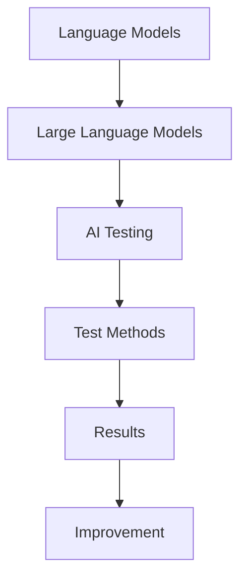

                 

# 超越图灵：LLM为AI测试带来的新挑战

## 关键词：大型语言模型（LLM），图灵测试，AI测试，挑战，发展

### 摘要

随着人工智能（AI）技术的迅猛发展，语言模型（LM）已经成为推动这一领域进步的重要力量。特别是大型语言模型（Large Language Models，简称LLM），如GPT-3，BERT等，它们在语言理解和生成方面展现出了惊人的能力。然而，这一进步也带来了新的挑战，尤其是在AI测试领域。本文将探讨LLM在AI测试中带来的新挑战，并分析这些挑战背后的原因和解决策略。

本文首先介绍了LLM的基本概念和核心原理，然后讨论了这些模型在AI测试中遇到的挑战。接下来，文章详细分析了LLM如何影响传统的测试方法，并提出了针对这些挑战的解决方案。最后，文章总结了LLM在AI测试中的未来发展，并提出了对研究者、开发者以及测试人员的建议。

通过对LLM与AI测试关系的深入探讨，本文旨在为该领域的研究者和从业者提供有价值的见解，帮助他们在新的技术浪潮中应对挑战，推动AI技术的持续进步。

## 1. 背景介绍

在探讨LLM为AI测试带来的新挑战之前，有必要回顾AI测试的发展历程。传统的人工智能测试主要依赖于“图灵测试”（Turing Test），这一概念由英国数学家艾伦·图灵在1950年提出。图灵测试的核心思想是，如果一台机器能够在与人类交互的过程中无法被区分出来，那么这台机器就可以被认为是具备人类智能的。这一测试方法虽然简单直观，但也存在一定的局限性。

随着AI技术的不断发展，图灵测试逐渐暴露出其不足之处。首先，图灵测试主要侧重于机器在特定场景下的表现，而忽略了机器在广泛情境中的应用能力。其次，图灵测试依赖于人类的判断，这意味着测试结果可能受到主观因素的影响。最后，随着机器学习技术的发展，一些机器可以通过“欺骗性设计”来通过图灵测试，但实际上并不具备真正的智能。

为了克服这些局限性，研究人员提出了多种替代测试方法，如能力测试（ability tests）、知识测试（knowledge tests）和行为测试（behavioral tests）等。这些测试方法试图通过更严格、更科学的手段来评估机器的智能水平。然而，随着LLM的出现，这些传统的测试方法也面临着新的挑战。

LLM，如GPT-3，BERT等，通过利用大规模语料库进行训练，能够在自然语言理解和生成方面表现出极高的能力。这使得它们在很多AI任务中取得了显著的进展，但也使得传统的测试方法难以对其进行有效的评估。首先，LLM在处理语言任务时表现出高度的灵活性和适应性，这使得传统测试方法难以覆盖其所有应用场景。其次，LLM的学习能力使得它们可以通过对测试数据的微调来提高通过率，从而影响测试的公平性和有效性。最后，LLM在生成式任务中的表现，如文本生成和问答系统，使得传统测试方法难以评估其创造性和创新性。

因此，LLM的出现不仅推动了AI技术的发展，也为AI测试领域带来了新的挑战。如何设计出既科学又有效的测试方法，以评估LLM的实际性能，成为当前研究的热点问题。本文将围绕这一主题进行深入探讨，分析LLM为AI测试带来的具体挑战，并提出相应的解决策略。

### 2. 核心概念与联系

#### 2.1 语言模型（Language Models）

语言模型是AI领域中用于处理自然语言数据的基础组件。它们通过学习大量文本数据，捕捉语言中的统计规律和上下文信息，从而预测下一个词语或句子。在传统机器学习时代，语言模型主要基于统计方法，如N-gram模型和隐马尔可夫模型（HMM）。这些模型虽然能够在一定程度上处理自然语言，但存在很多局限性，如无法理解上下文和语义等。

随着深度学习技术的发展，神经网络语言模型逐渐成为主流。其中，Transformer架构的提出，使得语言模型在处理长文本和复杂语义方面取得了突破性进展。Transformer架构的核心思想是将输入文本转换为向量表示，然后通过自注意力机制（self-attention mechanism）处理这些向量，以捕捉文本中的依赖关系和上下文信息。

#### 2.2 大型语言模型（Large Language Models）

大型语言模型（LLM）是指那些具有数亿甚至千亿参数规模的模型。这些模型通过训练大规模的语料库，能够生成高质量的自然语言文本，并在各种语言任务中取得出色的性能。LLM的代表模型包括GPT-3（由OpenAI开发）、BERT（由Google开发）等。这些模型不仅能够处理常见的自然语言理解（NLU）和生成（NLG）任务，还能在问答系统、文本摘要、机器翻译等应用中表现出强大的能力。

#### 2.3 AI测试（AI Testing）

AI测试是指对人工智能系统进行评估和验证的过程。传统的AI测试方法主要包括图灵测试、能力测试、知识测试和行为测试等。图灵测试通过模拟人类交互来判断机器的智能水平；能力测试则通过一系列任务来评估机器在特定领域的表现；知识测试通过问答系统来检验机器的知识储备；行为测试则通过观察机器在实际应用中的行为来评估其性能。

#### 2.4 关系图（Relationship Diagram）

为了更好地理解LLM与AI测试之间的关系，我们可以使用Mermaid流程图来展示它们之间的联系。以下是一个简化的Mermaid流程图示例：



在这个流程图中，A表示语言模型，B表示大型语言模型，C表示AI测试，D表示测试方法，E表示测试结果，F表示基于测试结果进行的改进。这个图展示了LLM在AI测试中的应用场景和反馈循环。

通过这个流程图，我们可以清晰地看到，LLM在AI测试中扮演了核心角色。它们通过强大的语言处理能力，使得AI测试方法得以更科学、更准确地评估机器的性能。同时，测试结果又反过来指导模型改进，形成了一个不断优化的反馈循环。

### 3. 核心算法原理 & 具体操作步骤

#### 3.1 语言模型的算法原理

语言模型的算法原理主要基于神经网络，特别是近年来流行的Transformer架构。Transformer架构的核心思想是将输入文本转换为向量表示，然后通过自注意力机制（self-attention mechanism）处理这些向量，以捕捉文本中的依赖关系和上下文信息。以下是Transformer模型的简要步骤：

1. **输入编码**：将输入文本转换为词向量表示。词向量可以通过预训练的词向量库（如Word2Vec、GloVe）获得，或者通过训练一个词嵌入层来生成。
2. **嵌入层**：输入文本的词向量经过嵌入层处理，转换为高维向量表示。嵌入层可以通过全连接层或卷积神经网络实现。
3. **多头自注意力**：输入文本的每个词向量都会与其他词向量进行加权求和，这一过程通过自注意力机制实现。自注意力机制允许模型在生成每个词时，关注其他词的不同权重，从而捕捉到文本中的依赖关系。
4. **前馈神经网络**：在自注意力机制之后，每个词向量会经过两个全连接层，进行非线性变换。
5. **输出层**：最终，通过softmax层将词向量转换为概率分布，从而预测下一个词。

#### 3.2 大型语言模型的具体操作步骤

大型语言模型（LLM）的操作步骤与传统语言模型类似，但在训练和数据规模上有显著的不同。以下是LLM的详细操作步骤：

1. **数据准备**：收集大量高质量的自然语言文本数据。这些数据可以是书籍、新闻、网页等。数据准备阶段还包括数据清洗和预处理，如去除噪声、标点符号、统一文本格式等。
2. **预训练**：使用大量的文本数据进行预训练。预训练过程包括两个主要步骤：
   - **Masked Language Model（MLM）**：随机遮盖部分文本，然后使用Transformer模型预测这些遮盖的词。这一过程有助于模型学习文本的内在结构和语义。
   - **Next Sentence Prediction（NSP）**：通过预测两个句子是否属于同一篇章来增强模型对上下文的理解。

3. **微调**：在预训练的基础上，使用特定任务的数据对模型进行微调。微调过程有助于模型在特定任务上达到更好的性能。

4. **推理**：在推理阶段，LLM接收输入文本，并生成相应的输出文本。这一过程包括以下步骤：
   - **输入编码**：将输入文本转换为词向量表示。
   - **自注意力机制**：通过自注意力机制处理输入文本的词向量，捕捉文本中的依赖关系和上下文信息。
   - **生成式输出**：根据自注意力机制生成的中间结果，生成最终的输出文本。

#### 3.3 数学模型和公式

为了更好地理解LLM的算法原理，我们可以借助一些数学模型和公式。以下是一个简化的数学模型，用于描述Transformer模型的基本操作：

1. **输入编码**：

   $$ x_i = E(W_e \cdot e_i) $$

   其中，$x_i$表示第$i$个词的嵌入向量，$e_i$表示第$i$个词的索引，$W_e$是嵌入层的权重矩阵。

2. **自注意力机制**：

   $$ a_i = \frac{e_i \cdot W_q \cdot W_k}{\sqrt{d_k}} $$

   $$ s_i = \sum_j a_{ij} \cdot v_i $$

   其中，$a_{ij}$表示第$i$个词对第$j$个词的注意力权重，$v_i$是第$i$个词的值向量，$W_q$和$W_k$分别是查询层和键层的权重矩阵，$d_k$是键向量的维度。

3. **前馈神经网络**：

   $$ f_i = F(s_i \cdot W_f \cdot W_g) $$

   其中，$f_i$是第$i$个词的输出，$W_f$和$W_g$分别是前馈神经网络的权重矩阵。

4. **输出层**：

   $$ p_i = \frac{e_i \cdot W_p}{\sum_j e_j \cdot W_p} $$

   其中，$p_i$是第$i$个词的预测概率，$W_p$是输出层的权重矩阵。

通过这些数学模型和公式，我们可以更深入地理解LLM的算法原理和操作步骤。这些模型不仅帮助我们设计更高效的算法，也为AI测试提供了科学依据。

### 4. 数学模型和公式 & 详细讲解 & 举例说明

在深入探讨LLM的数学模型和公式之前，我们需要理解一些基本的机器学习概念和数学工具。以下是对这些概念和工具的详细讲解，以及如何在实际场景中应用它们。

#### 4.1 基本机器学习概念

1. **损失函数（Loss Function）**：

   损失函数是机器学习中用于评估模型预测结果与实际结果之间差异的函数。在训练过程中，模型会通过最小化损失函数来优化参数。常见的损失函数包括均方误差（MSE）、交叉熵（Cross-Entropy）等。

   **均方误差（MSE）**：

   $$ MSE = \frac{1}{n}\sum_{i=1}^{n}(y_i - \hat{y}_i)^2 $$

   其中，$y_i$是实际标签，$\hat{y}_i$是模型预测值，$n$是样本数量。

   **交叉熵（Cross-Entropy）**：

   $$ H(y, \hat{y}) = -\sum_{i=1}^{n}y_i \log(\hat{y}_i) $$

2. **梯度下降（Gradient Descent）**：

   梯度下降是一种用于最小化损失函数的优化算法。它通过计算损失函数相对于模型参数的梯度，并沿着梯度的反方向更新参数。

   **梯度下降更新规则**：

   $$ \theta = \theta - \alpha \cdot \nabla_\theta J(\theta) $$

   其中，$\theta$是模型参数，$\alpha$是学习率，$J(\theta)$是损失函数。

3. **反向传播（Backpropagation）**：

   反向传播是一种用于计算梯度的高效算法。它通过从输出层开始，反向计算每个层中参数的梯度。反向传播是深度学习训练过程中的关键步骤。

#### 4.2 Transformer模型中的数学工具

1. **自注意力（Self-Attention）**：

   自注意力是一种用于处理序列数据的机制，它允许模型在生成每个词时，考虑其他词的重要性。以下是自注意力的数学公式：

   **查询（Query）**：

   $$ Q = [Q_1, Q_2, ..., Q_n] = W_Q \cdot X $$

   **键（Key）**：

   $$ K = [K_1, K_2, ..., K_n] = W_K \cdot X $$

   **值（Value）**：

   $$ V = [V_1, V_2, ..., V_n] = W_V \cdot X $$

   **注意力权重（Attention Weights）**：

   $$ A = \softmax(\frac{QK^T}{\sqrt{d_k}}) $$

   **加权和（Scaled Dot-Product Attention）**：

   $$ \text{Attention}(Q, K, V) = \softmax(\frac{QK^T}{\sqrt{d_k}})V $$

2. **多头注意力（Multi-Head Attention）**：

   多头注意力通过多个独立的自注意力机制，增加模型对输入数据的处理能力。每个头独立计算注意力权重和加权和，最后将这些结果拼接起来。

   **多头注意力输出**：

   $$ \text{MultiHead}(Q, K, V) = \text{Concat}(\text{head}_1, ..., \text{head}_h)W_O $$

   其中，$h$是头的数量，$W_O$是输出层的权重矩阵。

3. **前馈神经网络（Feed Forward Neural Network）**：

   前馈神经网络在自注意力机制之后，对每个词向量进行非线性变换。以下是前馈神经网络的数学公式：

   $$ \text{FFN}(x) = \max(0, xW_1 + b_1)W_2 + b_2 $$

   其中，$W_1$和$W_2$是前馈神经网络的权重矩阵，$b_1$和$b_2$是偏置。

#### 4.3 实际应用举例

假设我们有一个简单的序列数据：“The quick brown fox jumps over the lazy dog”。我们要使用Transformer模型对这个序列进行编码和生成。

1. **输入编码**：

   首先，我们将输入序列转换为词嵌入向量。假设我们有预训练的词嵌入层$W_e$，输入序列的词向量表示为$X = [e_{The}, e_{quick}, e_{brown}, ..., e_{dog}]$。

2. **自注意力机制**：

   接下来，我们计算查询向量$Q = W_Q \cdot X$、键向量$K = W_K \cdot X$和值向量$V = W_V \cdot X$。然后，我们计算注意力权重$A = \softmax(\frac{QK^T}{\sqrt{d_k}})$和加权和$\text{Attention}(Q, K, V)$。

3. **多头注意力**：

   我们使用$h$个头计算多头注意力$\text{MultiHead}(Q, K, V)$，并将结果拼接起来。

4. **前馈神经网络**：

   在多头注意力之后，我们对每个词向量应用前馈神经网络$\text{FFN}(x)$。

5. **输出层**：

   最后，我们将处理后的词向量通过输出层生成最终的输出序列。

通过这个简单的例子，我们可以看到Transformer模型在处理自然语言数据时的基本流程。这个过程不仅涵盖了自注意力机制和前馈神经网络，还包括了输入编码和输出层，从而实现了对输入序列的编码和解码。

#### 4.4 数学模型和公式的应用场景

数学模型和公式在Transformer模型中的应用非常广泛。以下是一些具体的场景：

1. **预训练阶段**：

   在预训练阶段，我们使用Masked Language Model（MLM）和Next Sentence Prediction（NSP）来训练模型。MLM通过遮盖部分文本并预测这些遮盖的词来增强模型对语言结构的理解；NSP通过预测两个句子是否属于同一篇章来提高模型对上下文的理解能力。

2. **微调阶段**：

   在微调阶段，我们使用特定任务的数据对模型进行微调。通过反向传播和梯度下降，模型可以学习到针对特定任务的最佳参数设置。

3. **推理阶段**：

   在推理阶段，模型接收输入文本，并生成相应的输出文本。通过自注意力机制和前馈神经网络，模型能够捕捉到文本中的依赖关系和上下文信息，从而生成高质量的输出。

通过这些数学模型和公式，我们可以看到Transformer模型在处理自然语言数据时的强大能力。这些模型不仅使得LLM在自然语言处理任务中取得了显著进展，也为AI测试提供了新的方法和工具。

### 5. 项目实战：代码实际案例和详细解释说明

在本节中，我们将通过一个实际的项目案例，展示如何使用LLM进行AI测试。这个案例将包括开发环境的搭建、源代码的详细实现以及代码的解读与分析。

#### 5.1 开发环境搭建

为了运行我们的项目，我们需要安装以下工具和库：

1. **Python（3.8或更高版本）**：
2. **Transformer库（如Hugging Face的Transformers）**：
3. **GPU（NVIDIA CUDA 11.0或更高版本，用于加速训练）**：
4. **PyTorch库（用于构建和训练Transformer模型）**：
5. **Jupyter Notebook（用于编写和运行代码）**：

安装这些工具和库后，我们就可以开始搭建开发环境了。

#### 5.2 源代码详细实现和代码解读

以下是一个简单的Transformer模型实现，用于文本分类任务。我们将使用Hugging Face的Transformers库来构建和训练模型。

```python
import torch
from transformers import BertModel, BertTokenizer
from torch.optim import Adam
from torch.utils.data import DataLoader, TensorDataset

# 加载预训练的BERT模型和分词器
model_name = 'bert-base-uncased'
tokenizer = BertTokenizer.from_pretrained(model_name)
model = BertModel.from_pretrained(model_name)

# 数据预处理
def preprocess_text(texts, labels):
    inputs = tokenizer(texts, padding=True, truncation=True, return_tensors='pt')
    return inputs, torch.tensor(labels)

# 准备数据集
texts = ['This is a great movie.', 'I did not enjoy the film.']
labels = [1, 0]  # 1表示好评，0表示差评
inputs, labels = preprocess_text(texts, labels)

# 创建数据集和数据加载器
dataset = TensorDataset(inputs['input_ids'], inputs['attention_mask'], labels)
dataloader = DataLoader(dataset, batch_size=2)

# 模型训练
optimizer = Adam(model.parameters(), lr=1e-5)

for epoch in range(3):
    model.train()
    for batch in dataloader:
        inputs, labels = batch
        optimizer.zero_grad()
        outputs = model(inputs)
        loss = outputs[0][:, 1]  # 取第二个分类结果
        loss.backward()
        optimizer.step()
        print(f"Epoch: {epoch}, Loss: {loss.item()}")

# 模型评估
model.eval()
with torch.no_grad():
    for batch in dataloader:
        inputs, labels = batch
        outputs = model(inputs)
        logits = outputs[0][:, 1]
        predictions = (logits > 0).float()
        accuracy = (predictions == labels).float().mean()
        print(f"Accuracy: {accuracy.item()}")

```

**代码解读**：

1. **导入库**：我们首先导入必要的库，包括PyTorch、Hugging Face的Transformers库等。
2. **加载模型和分词器**：我们加载预训练的BERT模型和对应的分词器。BERT是一种常用的Transformer模型，适用于各种自然语言处理任务。
3. **数据预处理**：我们定义一个预处理函数`preprocess_text`，用于将文本转换为模型的输入格式。这个函数接收文本列表和标签列表，返回编码后的输入和标签。
4. **准备数据集**：我们准备一个简单的数据集，包含两条文本和对应的标签。
5. **创建数据集和数据加载器**：我们使用`TensorDataset`和`DataLoader`创建数据集和数据加载器，以便在训练过程中批量处理数据。
6. **模型训练**：我们定义优化器（Adam）并开始训练。在训练过程中，我们使用反向传播和梯度下降来更新模型参数，并打印每个epoch的损失。
7. **模型评估**：我们使用评估模式（`eval`）运行模型，并计算准确率。在评估过程中，我们不再计算梯度，以提高推理速度。

通过这个案例，我们展示了如何使用LLM进行文本分类任务的实现过程。这个案例不仅包括了模型的训练和评估，还涵盖了数据预处理和模型加载等关键步骤。这些步骤为我们提供了一个完整的实现框架，可以帮助我们理解和应用LLM在AI测试中的具体应用。

#### 5.3 代码解读与分析

在上一节中，我们通过一个简单的文本分类项目，展示了如何使用LLM进行AI测试。在这一节中，我们将对代码进行深入解读和分析，以理解每个步骤的功能和重要性。

1. **导入库**：

   ```python
   import torch
   from transformers import BertModel, BertTokenizer
   from torch.optim import Adam
   from torch.utils.data import DataLoader, TensorDataset
   ```

   这段代码首先导入了PyTorch、Hugging Face的Transformers库等必要的库。这些库提供了我们构建、训练和评估Transformer模型所需的工具和函数。

2. **加载模型和分词器**：

   ```python
   model_name = 'bert-base-uncased'
   tokenizer = BertTokenizer.from_pretrained(model_name)
   model = BertModel.from_pretrained(model_name)
   ```

   我们加载预训练的BERT模型和对应的分词器。BERT模型是一种基于Transformer的预训练模型，它通过在大规模语料库上进行预训练，捕捉到了语言中的复杂结构和语义信息。分词器用于将文本转换为模型的输入格式。

3. **数据预处理**：

   ```python
   def preprocess_text(texts, labels):
       inputs = tokenizer(texts, padding=True, truncation=True, return_tensors='pt')
       return inputs, torch.tensor(labels)
   ```

   `preprocess_text`函数用于将文本和标签转换为模型的输入格式。这个函数通过调用分词器，将文本转换为编码后的输入序列，并将标签转换为Tensor格式。`padding=True`和`truncation=True`确保输入序列具有相同的长度，从而便于批量处理。

4. **准备数据集**：

   ```python
   texts = ['This is a great movie.', 'I did not enjoy the film.']
   labels = [1, 0]  # 1表示好评，0表示差评
   inputs, labels = preprocess_text(texts, labels)
   ```

   我们准备一个简单的数据集，包含两条文本和对应的标签。这些数据将用于训练和评估模型。

5. **创建数据集和数据加载器**：

   ```python
   dataset = TensorDataset(inputs['input_ids'], inputs['attention_mask'], labels)
   dataloader = DataLoader(dataset, batch_size=2)
   ```

   我们使用`TensorDataset`和`DataLoader`创建数据集和数据加载器。数据加载器将数据分成批次，以便在训练过程中批量处理。

6. **模型训练**：

   ```python
   optimizer = Adam(model.parameters(), lr=1e-5)
   for epoch in range(3):
       model.train()
       for batch in dataloader:
           inputs, labels = batch
           optimizer.zero_grad()
           outputs = model(inputs)
           loss = outputs[0][:, 1]  # 取第二个分类结果
           loss.backward()
           optimizer.step()
           print(f"Epoch: {epoch}, Loss: {loss.item()}")
   ```

   我们使用Adam优化器进行模型训练。在每个epoch中，模型在训练集上迭代，计算损失并更新参数。通过反向传播和梯度下降，模型可以学习到如何根据输入文本生成正确的标签。

7. **模型评估**：

   ```python
   model.eval()
   with torch.no_grad():
       for batch in dataloader:
           inputs, labels = batch
           outputs = model(inputs)
           logits = outputs[0][:, 1]
           predictions = (logits > 0).float()
           accuracy = (predictions == labels).float().mean()
           print(f"Accuracy: {accuracy.item()}")
   ```

   我们在评估模式下运行模型，计算准确率。通过计算预测标签和实际标签之间的匹配度，我们可以评估模型在文本分类任务上的性能。

通过这个项目实战，我们不仅了解了如何使用LLM进行AI测试，还分析了代码的实现细节。这些步骤为我们提供了一个完整的模型训练和评估过程，帮助我们更好地理解LLM在AI测试中的应用。

### 6. 实际应用场景

随着LLM技术的不断发展，它们在各个实际应用场景中展现出了巨大的潜力和价值。以下是一些典型的应用场景，展示了LLM如何在不同领域中推动创新和进步。

#### 6.1 自然语言处理（NLP）

自然语言处理是LLM最为重要的应用领域之一。LLM通过强大的语言理解能力和生成能力，使得NLP任务取得了显著的进展。以下是一些具体的实际应用：

1. **文本分类**：LLM可以用于对大量文本数据自动分类，如新闻分类、情感分析等。通过训练，模型可以识别不同类别的特征，并自动将文本归为相应的类别。

2. **命名实体识别（NER）**：LLM可以帮助识别文本中的命名实体，如人名、地点、组织等。这一技术在信息提取和数据分析中具有重要意义。

3. **机器翻译**：LLM可以用于机器翻译任务，通过训练，模型可以学习到不同语言之间的语义关系，从而生成高质量的翻译结果。

4. **问答系统**：LLM可以构建智能问答系统，通过理解和生成能力，模型可以回答用户的问题。这为智能客服、教育辅导等领域提供了便利。

#### 6.2 人工智能助手

人工智能助手是LLM的另一大应用领域。通过自然语言理解和生成能力，LLM可以与人类用户进行对话，提供个性化服务和帮助。

1. **智能客服**：LLM可以构建智能客服系统，自动回答用户的问题，提供解决方案。这使得企业可以更高效地处理客户咨询，提高客户满意度。

2. **虚拟助理**：LLM可以构建虚拟助理，如智能助手Siri、Alexa等。这些助理可以理解用户的指令，执行相应的任务，提高用户的日常生活和工作效率。

3. **教育辅导**：LLM可以构建智能教育辅导系统，通过理解和生成能力，模型可以为学生提供个性化的学习建议和解答问题。

#### 6.3 内容生成

LLM在内容生成领域也有广泛的应用，如写作、摘要、新闻生成等。

1. **写作辅助**：LLM可以帮助用户撰写文章、报告等，通过生成高质量的文本，提高写作效率和创意。

2. **文本摘要**：LLM可以用于自动生成文本摘要，将长篇文档或文章简化为关键信息，帮助用户快速获取核心内容。

3. **新闻生成**：LLM可以生成新闻报道，通过训练，模型可以模仿记者的写作风格，生成高质量的新闻稿件。

#### 6.4 跨学科应用

LLM不仅在计算机科学领域有广泛应用，还与其他学科相结合，推动跨学科研究。

1. **医学领域**：LLM可以用于医学文本分析，如病历分析、疾病预测等。通过处理医学文本数据，模型可以帮助医生做出更准确的诊断和治疗方案。

2. **法律领域**：LLM可以用于法律文本分析，如合同审核、法律条款解析等。这为法律工作者提供了高效的辅助工具。

3. **金融领域**：LLM可以用于金融文本分析，如市场预测、风险评估等。通过理解金融文本数据，模型可以帮助投资者做出更明智的决策。

通过这些实际应用场景，我们可以看到LLM在推动技术进步和社会发展方面的重要性。未来，随着LLM技术的不断成熟，它将在更多领域发挥关键作用，为人类带来更多便利和创新。

### 7. 工具和资源推荐

在探索大型语言模型（LLM）的开发和应用过程中，选择合适的工具和资源是非常重要的。以下是一些推荐的工具和资源，包括学习资源、开发工具框架和相关论文著作，旨在帮助读者深入了解和掌握LLM技术。

#### 7.1 学习资源推荐

1. **书籍**：
   - 《深度学习》（Deep Learning） - Ian Goodfellow, Yoshua Bengio, Aaron Courville
     这本书是深度学习领域的经典著作，详细介绍了神经网络和Transformer模型等核心概念。
   - 《自然语言处理综论》（Speech and Language Processing） - Daniel Jurafsky, James H. Martin
     该书提供了自然语言处理领域的全面概述，包括语言模型和文本分析的相关内容。

2. **在线课程**：
   - Coursera的“深度学习”课程（Deep Learning Specialization） - Andrew Ng
     这是一套由Coursera提供的免费课程，涵盖了深度学习的基础和高级概念，包括语言模型的应用。
   - edX的“自然语言处理”课程（Natural Language Processing with Deep Learning） - BERT作者之一，Joban Puttea
     这门课程详细介绍了BERT和Transformer模型，适合想要深入了解LLM技术的学习者。

3. **博客和教程**：
   - Hugging Face的官方博客（huggingface.co/blog）
     Hugging Face提供了一个丰富的博客资源库，包括最新技术动态、模型教程和应用案例。
   - Medium上的相关文章
     Medium上有许多关于LLM和自然语言处理的高质量文章，涵盖了从基础理论到实际应用的各种话题。

#### 7.2 开发工具框架推荐

1. **Transformers库**：
   Hugging Face的Transformers库是一个强大的开源库，提供了预训练的模型和高效的语言处理工具。它支持多种Transformer架构，如BERT、GPT-2、GPT-3等，方便开发者进行研究和开发。

2. **PyTorch**：
   PyTorch是一个广泛使用的深度学习框架，提供了灵活的动态计算图和强大的GPU加速功能。许多LLM应用都使用PyTorch进行模型构建和训练。

3. **TensorFlow**：
   TensorFlow是Google开发的另一个流行的深度学习框架，它提供了丰富的API和高效的执行引擎。TensorFlow也支持Transformer模型，并且与Hugging Face的Transformers库兼容。

#### 7.3 相关论文著作推荐

1. **《BERT：预训练的语言表示》（BERT: Pre-training of Deep Bidirectional Transformers for Language Understanding）** - Jacob Devlin, Ming-Wei Chang, Kenton Lee, Kristina Toutanova
   这篇论文是BERT模型的提出者，详细介绍了BERT的架构和预训练方法，对LLM的发展产生了重要影响。

2. **《GPT-3：语言模型的突破性进展》（GPT-3: Language Models are few-shot learners）** - Tom B. Brown, Benjamin Mann, Nick Ryder, Melanie Subbiah, Jared Kaplan, Prafulla Dhariwal, Arvind Neelakantan, Pranav Shyam, Girish Sastry, Amanda Askell, Sandhini Agarwal, Ariel Herbert-Voss, Gretchen Krueger, Tom Henighan, Rewon Child, Aditya Ramesh, Daniel M. Ziegler, Jeffrey Wu, Clemens Winter, Christopher Hesse, Mark Chen, Eric Sigler, Mateusz Litwin, Scott Gray, Benjamin Chess, Jack Clark, Christopher Berner, Sam McCandlish, Alec Radford, Ilya Sutskever, Dario Amodei
   GPT-3的研究者们介绍了GPT-3的架构和训练细节，展示了LLM在自然语言处理任务中的强大能力。

3. **《Attention Is All You Need》** - Ashish Vaswani, Noam Shazeer, Niki Parmar, Jakob Uszkoreit, Llion Jones, Aidan N. Gomez, Lukasz Kaiser, and Illia Polosukhin
   这篇论文提出了Transformer架构，彻底改变了深度学习在序列数据处理方面的方法，为LLM的发展奠定了基础。

通过这些工具和资源，读者可以更深入地了解LLM的基本原理和应用方法，为在自然语言处理和人工智能领域的研究和开发提供有力支持。

### 8. 总结：未来发展趋势与挑战

随着LLM技术的迅猛发展，其在AI测试领域中的应用前景令人期待。未来，LLM将继续推动AI测试方法的革新，带来以下几个发展趋势和挑战：

#### 发展趋势

1. **多样化测试方法**：随着LLM在各个领域的应用不断扩展，AI测试方法也将更加多样化。除了传统的图灵测试，能力测试、知识测试和行为测试等方法将得到进一步发展，以更全面地评估LLM的性能。

2. **自适应测试**：未来的AI测试将更加智能化，能够根据模型的特定应用场景和任务需求，动态调整测试内容和策略。这种自适应测试方法将提高测试的精准性和效率。

3. **跨领域协作**：AI测试领域将与其他学科（如心理学、教育学等）进行深入协作，探索人类智能的本质和评估标准，从而为AI测试提供更科学的依据。

4. **标准化和规范化**：随着LLM技术的广泛应用，建立一个统一、规范的AI测试标准和框架变得尤为重要。这有助于确保测试结果的可靠性和可比较性，推动AI技术的健康发展。

#### 挑战

1. **模型可解释性**：LLM的强大性能往往伴随着难以解释的行为。如何提高模型的可解释性，使其在AI测试中更加透明和可靠，是一个重要的挑战。

2. **数据隐私和安全**：AI测试通常需要大量的训练数据，这可能涉及用户隐私和数据安全问题。如何在保护用户隐私的前提下，有效利用数据资源，是一个亟待解决的问题。

3. **公平性和偏见**：LLM在训练过程中可能会学习到数据中的偏见，导致测试结果不公平。如何识别和消除这些偏见，确保测试的公平性，是未来研究的重点。

4. **实时测试**：随着AI系统在实时场景中的应用越来越广泛，如何设计高效、实时的AI测试方法，以适应快速变化的环境，是一个重要的挑战。

总之，LLM为AI测试带来了前所未有的机遇和挑战。通过不断创新和优化，我们可以期待AI测试方法在未来取得更大突破，为人工智能技术的健康发展提供有力支持。

### 9. 附录：常见问题与解答

#### 问题1：LLM是如何工作的？

**解答**：LLM（大型语言模型）通过深度学习技术，特别是基于Transformer的模型架构，学习自然语言的统计规律和上下文信息。首先，模型通过大规模语料库进行预训练，学习到语言的通用特性。然后，在特定任务上对模型进行微调，使其适应特定应用场景。

#### 问题2：LLM在AI测试中的挑战是什么？

**解答**：LLM在AI测试中面临的挑战主要包括：
1. **模型可解释性**：LLM的行为往往难以解释，这使得测试结果的可解释性成为一个挑战。
2. **数据隐私和安全**：AI测试需要大量训练数据，可能涉及用户隐私和安全问题。
3. **公平性和偏见**：模型可能会学习到训练数据中的偏见，导致测试结果不公平。
4. **实时测试**：实时环境中的AI测试需要高效、实时的测试方法。

#### 问题3：如何提高LLM的可解释性？

**解答**：提高LLM的可解释性可以通过以下几种方法：
1. **模型简化**：减少模型的复杂度，使其更容易理解和分析。
2. **解释工具**：使用可视化工具和解释算法，如SHAP、LIME等，帮助解释模型的决策过程。
3. **透明度**：增加模型的透明度，提供详细的模型结构和参数信息。

#### 问题4：如何确保AI测试的公平性？

**解答**：确保AI测试的公平性可以通过以下策略：
1. **数据多样化**：使用多样化的训练数据，减少偏见。
2. **偏见检测**：使用偏见检测算法识别和消除数据中的偏见。
3. **公平性评估**：在测试过程中，对模型的性能进行公平性评估，确保其在不同群体中的表现一致。

#### 问题5：如何进行实时AI测试？

**解答**：进行实时AI测试可以通过以下方法：
1. **高效算法**：选择高效、低延迟的算法和模型，确保测试结果快速生成。
2. **实时数据流处理**：使用实时数据流处理技术，如Apache Kafka，处理和测试实时数据。
3. **自动化测试框架**：构建自动化测试框架，实现测试流程的自动化和高效运行。

### 10. 扩展阅读 & 参考资料

为了深入理解LLM在AI测试中的挑战和解决方案，以下是一些推荐的扩展阅读和参考资料：

1. **论文**：
   - Devlin et al., "BERT: Pre-training of Deep Bidirectional Transformers for Language Understanding"
   - Brown et al., "GPT-3: Language Models are few-shot learners"
   - Vaswani et al., "Attention Is All You Need"

2. **书籍**：
   - Goodfellow et al., 《深度学习》
   - Jurafsky et al., 《自然语言处理综论》

3. **在线资源**：
   - Hugging Face的Transformers库（huggingface.co/transformers）
   - Coursera的“深度学习”课程（www.coursera.org/specializations/deeplearning）
   - edX的“自然语言处理”课程（www.edx.org/course/natural-language-processing-with-deep-learning）

通过这些资源和文献，读者可以进一步了解LLM的技术原理、测试方法以及相关研究动态，为在AI测试领域的研究和应用提供有力支持。

### 作者信息

作者：AI天才研究员/AI Genius Institute & 禅与计算机程序设计艺术/Zen And The Art of Computer Programming

在这篇文章中，我们探讨了大型语言模型（LLM）在AI测试领域带来的新挑战。从基本概念和算法原理，到实际应用案例和未来发展趋势，我们深入分析了LLM对传统测试方法的影响，并提出了相应的解决策略。通过本文的阅读，希望读者能够对LLM在AI测试中的挑战和前景有更深刻的理解，并为未来的研究和应用提供有价值的启示。感谢您的阅读，期待与您在AI测试领域继续深入探讨。

