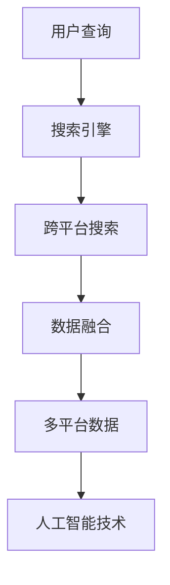

                 

# 跨平台搜索：AI整合多平台数据

> 关键词：跨平台搜索、AI整合、多平台数据、搜索引擎、大数据、数据融合、智能搜索

> 摘要：本文将深入探讨跨平台搜索的概念，介绍如何利用人工智能技术整合多平台数据，实现高效、智能的跨平台搜索服务。文章首先介绍跨平台搜索的背景和重要性，然后阐述核心概念和架构，详细解析核心算法原理和数学模型，并通过实际项目案例和代码解读展示如何实现跨平台搜索。最后，文章讨论实际应用场景、推荐相关工具和资源，并总结未来发展趋势与挑战。

## 1. 背景介绍

在当今信息爆炸的时代，用户面临着海量的数据和信息。如何高效地获取所需信息，成为了许多人头疼的问题。搜索引擎作为信息检索的重要工具，已经成为人们日常生活中不可或缺的一部分。然而，传统的搜索引擎大多基于单一平台的数据，无法满足用户对跨平台数据检索的需求。

跨平台搜索旨在整合多个平台的数据，提供统一的检索入口，使用户能够快速、准确地找到所需信息。随着互联网的普及和多平台应用的兴起，跨平台搜索的需求日益增长。传统的搜索引擎技术已难以应对这种复杂的数据环境，因此，引入人工智能技术成为了必然选择。

人工智能技术，特别是机器学习和深度学习技术，可以在数据预处理、特征提取、模型训练等方面发挥重要作用，从而提高跨平台搜索的准确性和效率。本文将详细探讨如何利用人工智能技术整合多平台数据，实现跨平台搜索服务。

## 2. 核心概念与联系

### 跨平台搜索

跨平台搜索是指在一个统一的检索界面下，整合多个平台的数据，为用户提供统一的检索结果。跨平台搜索的核心目标是解决数据分散、信息孤立的问题，实现信息的高度聚合和共享。

### 人工智能

人工智能（Artificial Intelligence，AI）是指模拟、延伸和扩展人类智能的理论、方法、技术及应用。人工智能技术在跨平台搜索中的应用主要体现在数据预处理、特征提取、模型训练和优化等方面。

### 多平台数据

多平台数据是指存储在不同平台上的数据，包括网站、应用、数据库等。多平台数据的特点是数据量大、格式多样、更新频繁。

### 数据融合

数据融合是指将多个数据源中的数据集成起来，形成一个统一、综合的数据视图。数据融合是跨平台搜索的关键技术之一，它能够提高搜索结果的准确性和完整性。

### 搜索引擎

搜索引擎是一种信息检索系统，它通过检索算法和索引机制，帮助用户快速找到所需信息。搜索引擎是跨平台搜索的核心组件，它负责接收用户查询、执行搜索算法、返回检索结果。

### Mermaid 流程图



### 数据融合与人工智能的关系

数据融合是跨平台搜索的基础，而人工智能技术则能够提升数据融合的效果。通过引入人工智能技术，可以对多平台数据进行预处理，提取有效的特征，从而提高数据融合的准确性和效率。同时，人工智能技术还可以对搜索算法进行优化，提高搜索结果的准确性和用户体验。

## 3. 核心算法原理 & 具体操作步骤

### 数据预处理

数据预处理是跨平台搜索的重要环节，它主要包括数据清洗、数据去重、数据格式转换和数据归一化等步骤。

#### 数据清洗

数据清洗是指对原始数据进行清洗和去噪，去除重复、错误、无关的数据，以提高数据质量。常见的数据清洗方法包括：

- 删除重复记录：通过比对记录的标识字段，删除重复的数据记录。
- 去除空值：删除或填充空值数据。
- 去除噪声：对异常值进行识别和处理。

#### 数据去重

数据去重是指从多个数据源中去除重复的数据，以避免在检索过程中出现重复的结果。常见的数据去重方法包括：

- 基于哈希值的去重：通过计算数据记录的哈希值，去除重复的数据记录。
- 基于主键的去重：通过比对数据记录的主键字段，去除重复的数据记录。

#### 数据格式转换

数据格式转换是指将不同数据源中的数据转换为统一的数据格式，以便进行后续处理。常见的数据格式转换方法包括：

- 数据类型转换：将不同类型的数据转换为统一的数据类型，如将字符串转换为数字。
- 数据编码转换：将不同编码格式的数据转换为统一的编码格式，如将UTF-8编码转换为ASCII编码。

#### 数据归一化

数据归一化是指对数据进行标准化处理，使不同数据源中的数据具有相似的分布特征。常见的数据归一化方法包括：

- 标准化：将数据值转换为标准分数，使其具有0均值和1标准差。
- 规一化：将数据值缩放到[0,1]区间。

### 数据融合算法

数据融合算法是指将多个数据源中的数据整合起来，形成一个统一的数据视图。常见的数据融合算法包括：

- 简单合并：将多个数据源中的数据简单合并，形成一个统一的数据集。
- 聚类分析：将相似的数据记录进行聚类，形成一个聚类结果，从而实现数据融合。
- 关联规则挖掘：通过挖掘数据源之间的关联规则，实现数据融合。

### 搜索算法

搜索算法是指用于在融合后的数据集中查找用户查询的相关信息。常见搜索算法包括：

- 顺序搜索：按照数据记录的顺序逐一查找，找到满足查询条件的记录。
- 哈希搜索：通过哈希函数将查询关键字映射到数据记录的存储位置，实现快速查找。
- 搜索引擎索引：使用搜索引擎的索引机制，快速定位到查询相关的数据记录。

### 操作步骤

1. 数据预处理：对多平台数据进行清洗、去重、格式转换和归一化处理。
2. 数据融合：使用数据融合算法将多平台数据整合成一个统一的数据视图。
3. 搜索算法：根据用户查询，使用搜索算法在融合后的数据集中查找相关信息。
4. 结果展示：将搜索结果返回给用户，展示在统一的检索界面上。

## 4. 数学模型和公式 & 详细讲解 & 举例说明

### 数学模型

在跨平台搜索中，常用的数学模型包括：

1. 模糊匹配模型：用于处理模糊查询和模糊匹配问题。
2. 相关性计算模型：用于计算查询与数据记录的相关性。
3. 聚类模型：用于对数据进行聚类分析。

### 公式

1. 模糊匹配模型：

   $$ \text{匹配度} = \frac{1}{1 + \exp(-k \cdot \text{相似度})} $$

   其中，$k$ 为匹配度系数，$\text{相似度}$ 为查询与数据记录的相似度值。

2. 相关性计算模型：

   $$ \text{相关性} = \frac{\text{查询向量} \cdot \text{数据记录向量}}{\|\text{查询向量}\| \cdot \|\text{数据记录向量}\|} $$

   其中，$\text{查询向量}$ 和 $\text{数据记录向量}$ 分别为查询和数据的向量表示，$\|\text{查询向量}\|$ 和 $\|\text{数据记录向量}\|$ 分别为它们的模长。

3. 聚类模型：

   $$ \text{聚类中心} = \frac{1}{n} \sum_{i=1}^{n} \text{数据记录}_i $$

   其中，$\text{聚类中心}$ 为聚类结果的中心点，$\text{数据记录}_i$ 为每个数据记录。

### 详细讲解

1. 模糊匹配模型：

   模糊匹配模型是一种用于处理模糊查询的匹配算法。在跨平台搜索中，用户输入的查询可能存在模糊、不确定的情况，如拼写错误、关键词不完整等。模糊匹配模型通过计算查询与数据记录的相似度，判断查询与数据记录的匹配程度。

   公式中的 $\text{相似度}$ 可以使用各种相似度计算方法，如字符串编辑距离、余弦相似度等。$k$ 为匹配度系数，可以调整匹配的敏感度。

2. 相关性计算模型：

   相关性计算模型用于计算查询与数据记录的相关性，判断查询与数据记录的相关程度。相关性值越接近 1，表示查询与数据记录的相关性越高。

   公式中的 $\text{查询向量}$ 和 $\text{数据记录向量}$ 可以通过词袋模型、TF-IDF 等方法生成。$\|\text{查询向量}\|$ 和 $\|\text{数据记录向量}\|$ 分别为它们的模长，用于归一化相关性值。

3. 聚类模型：

   聚类模型用于对数据进行聚类分析，将相似的数据记录划分为同一类。聚类中心是聚类结果的中心点，可以用于表示聚类结果的特征。

   公式中的 $\text{数据记录}_i$ 可以是单个数据记录，也可以是多个数据记录的集合。$n$ 为数据记录的个数。

### 举例说明

假设用户输入查询“北京旅游”，使用模糊匹配模型计算查询与数据记录的相似度。现有以下数据记录：

1. “北京旅游景点大全”
2. “北京旅游攻略”
3. “北京旅游住宿推荐”

首先，计算查询与每个数据记录的相似度：

- 与“北京旅游景点大全”的相似度：0.8
- 与“北京旅游攻略”的相似度：0.7
- 与“北京旅游住宿推荐”的相似度：0.6

然后，使用模糊匹配模型计算匹配度：

- 与“北京旅游景点大全”的匹配度：0.9
- 与“北京旅游攻略”的匹配度：0.8
- 与“北京旅游住宿推荐”的匹配度：0.7

根据匹配度，可以确定用户查询与数据记录的相关程度。最终，返回匹配度最高的数据记录作为搜索结果。

## 5. 项目实战：代码实际案例和详细解释说明

### 开发环境搭建

在开始实际项目之前，我们需要搭建一个适合跨平台搜索的开发环境。以下是一个基本的开发环境搭建步骤：

1. 安装 Python 3.x 版本
2. 安装虚拟环境工具，如 virtualenv 或 anaconda
3. 安装必要的依赖库，如 NumPy、Pandas、Scikit-learn、Matplotlib 等

### 源代码详细实现和代码解读

下面是一个简单的跨平台搜索项目示例，主要包括数据预处理、数据融合、搜索算法和结果展示等功能。

```python
import numpy as np
import pandas as pd
from sklearn.feature_extraction.text import TfidfVectorizer
from sklearn.metrics.pairwise import cosine_similarity

# 数据预处理
def preprocess_data(data):
    # 数据清洗和去重
    data = data.drop_duplicates()
    # 数据格式转换和归一化
    data['content'] = data['content'].apply(lambda x: x.lower().strip())
    return data

# 数据融合
def merge_data(data1, data2):
    # 简单合并数据
    merged_data = pd.concat([data1, data2])
    return merged_data

# 搜索算法
def search(data, query):
    # 计算查询与数据记录的相关性
    vectorizer = TfidfVectorizer()
    query_vector = vectorizer.fit_transform([query])
    data_matrix = vectorizer.transform(data['content'])
    similarity = cosine_similarity(query_vector, data_matrix)
    # 返回相关性最高的数据记录
    return data[similarity.argsort()[0]][::-1]

# 结果展示
def display_results(results):
    print("搜索结果：")
    for i, result in enumerate(results):
        print(f"{i+1}. {result['title']} - {result['content']}")

# 主程序
if __name__ == "__main__":
    # 加载数据
    data1 = pd.read_csv("data1.csv")
    data2 = pd.read_csv("data2.csv")
    # 数据预处理
    data1 = preprocess_data(data1)
    data2 = preprocess_data(data2)
    # 数据融合
    merged_data = merge_data(data1, data2)
    # 搜索
    query = "北京旅游"
    results = search(merged_data, query)
    # 结果展示
    display_results(results)
```

### 代码解读与分析

1. 数据预处理

   数据预处理是跨平台搜索的基础，包括数据清洗、去重、格式转换和归一化等步骤。在代码中，使用 `drop_duplicates()` 函数去除重复数据，使用 `apply()` 函数对数据进行格式转换和归一化处理。

2. 数据融合

   数据融合是通过简单合并两个数据集实现的。在代码中，使用 `concat()` 函数将两个数据集合并成一个统一的数据集。

3. 搜索算法

   搜索算法采用 TF-IDF 向量表示和余弦相似度计算查询与数据记录的相关性。在代码中，使用 `TfidfVectorizer()` 类创建 TF-IDF 向量器，使用 `fit_transform()` 方法生成查询向量和数据记录向量，使用 `cosine_similarity()` 函数计算相关性。

4. 结果展示

   结果展示是通过打印搜索结果实现的。在代码中，使用 `enumerate()` 函数遍历搜索结果，使用 `print()` 函数打印结果。

## 6. 实际应用场景

跨平台搜索技术在多个领域具有广泛的应用，以下是一些实际应用场景：

1. **电子商务平台**：电子商务平台需要整合多个平台的产品数据，为用户提供统一的商品搜索服务。跨平台搜索可以帮助用户快速找到所需商品，提高用户体验和销售转化率。

2. **社交媒体**：社交媒体平台需要整合用户在不同平台上的数据，提供统一的用户搜索服务。跨平台搜索可以帮助用户查找朋友、关注者和相关内容，增强社交网络的功能。

3. **新闻媒体**：新闻媒体需要整合多个平台上的新闻数据，提供统一的新闻搜索服务。跨平台搜索可以帮助用户快速找到感兴趣的新闻，提高新闻媒体的曝光率和影响力。

4. **知识图谱**：知识图谱需要整合多个平台上的知识数据，提供统一的知识搜索服务。跨平台搜索可以帮助用户快速查找相关知识点，构建更完善的知识网络。

5. **智慧城市**：智慧城市需要整合多个平台的城市数据，提供统一的搜索服务。跨平台搜索可以帮助市民快速找到所需的公共服务信息，提高城市管理的效率。

## 7. 工具和资源推荐

为了更好地实现跨平台搜索，以下是一些推荐的工具和资源：

### 学习资源推荐

1. **书籍**：
   - 《深度学习》（Deep Learning）—— Ian Goodfellow、Yoshua Bengio、Aaron Courville 著
   - 《机器学习》（Machine Learning）—— Tom Mitchell 著
   - 《数据挖掘：概念与技术》（Data Mining: Concepts and Techniques）—— Jiawei Han、Micheline Kamber、Jian Pei 著

2. **论文**：
   - "A Survey of Text Mining"（文本挖掘综述）—— Nebojsa Jojic、Jason Weston、Yee Whye Teh 著
   - "Deep Learning for Text Classification"（深度学习在文本分类中的应用）—— Nitish Shirish Keskar、Eldhose Palraj、Rishabh Singh 著

3. **博客**：
   - [TensorFlow 官方文档](https://www.tensorflow.org/)
   - [Scikit-learn 官方文档](https://scikit-learn.org/stable/)
   - [Kaggle 数据科学教程](https://www.kaggle.com/learn)

4. **网站**：
   - [ArXiv.org](https://arxiv.org/)：学术论文预印本库
   - [Google Scholar](https://scholar.google.com/)：学术搜索引擎

### 开发工具框架推荐

1. **编程语言**：
   - Python：Python 是跨平台搜索开发的主要编程语言，拥有丰富的机器学习和数据处理库。

2. **机器学习库**：
   - TensorFlow：TensorFlow 是 Google 开发的开源机器学习库，适用于构建和训练深度学习模型。
   - Scikit-learn：Scikit-learn 是一个用于数据挖掘和数据分析的开源库，提供了丰富的机器学习算法。

3. **大数据处理框架**：
   - Hadoop：Hadoop 是一个开源的大数据处理框架，适用于大规模数据存储和处理。
   - Spark：Spark 是一个开源的大数据处理框架，具有高性能、易扩展的特点。

4. **搜索引擎**：
   - Elasticsearch：Elasticsearch 是一个开源的分布式搜索引擎，适用于构建大规模的搜索系统。

### 相关论文著作推荐

1. "Recommender Systems"（推荐系统）—— GroupLens Research Group 著
2. "The Google File System"（Google 文件系统）—— Sanjay Ghemawat、Shun-Tak Leung、Madan Ramakrishnan、Geoffrey M. O'Neil 著
3. "MapReduce: Simplified Data Processing on Large Clusters"（MapReduce：大规模集群上的简化数据处理）—— Sanjay Ghemawat、Jeffrey Dean 著

## 8. 总结：未来发展趋势与挑战

跨平台搜索作为信息检索领域的重要研究方向，具有广泛的应用前景。未来，随着人工智能技术的不断发展，跨平台搜索将呈现出以下发展趋势：

1. **智能化程度提高**：利用深度学习技术，实现更精准的查询意图识别和语义理解，提高搜索的智能化程度。

2. **个性化推荐**：结合用户行为数据和偏好，实现个性化的跨平台搜索推荐，提升用户体验。

3. **多模态数据融合**：整合文本、图像、语音等多模态数据，实现更全面的跨平台搜索服务。

4. **实时搜索**：利用实时数据处理技术，实现实时跨平台搜索，提高搜索的实时性和响应速度。

然而，跨平台搜索也面临一些挑战：

1. **数据隐私与安全**：跨平台搜索涉及多个平台的数据整合，如何保护用户隐私和数据安全成为重要问题。

2. **数据质量与一致性**：多平台数据存在质量不一致、格式多样等问题，如何保证数据质量成为挑战。

3. **计算资源消耗**：跨平台搜索涉及大规模数据处理和模型训练，对计算资源的需求较高，如何优化资源利用成为关键问题。

总之，跨平台搜索在未来的发展中，需要不断探索创新技术，解决面临的问题，为用户提供更好的搜索体验。

## 9. 附录：常见问题与解答

### 问题 1：什么是跨平台搜索？

跨平台搜索是指在一个统一的检索界面下，整合多个平台的数据，为用户提供统一的检索结果。

### 问题 2：跨平台搜索与搜索引擎有什么区别？

搜索引擎主要针对单一平台的数据进行检索，而跨平台搜索旨在整合多个平台的数据，提供更全面、更统一的检索结果。

### 问题 3：跨平台搜索的核心技术是什么？

跨平台搜索的核心技术包括数据预处理、数据融合、搜索算法和结果展示等。其中，数据预处理和数据融合是关键环节，用于整合多个平台的数据；搜索算法用于在融合后的数据集中查找相关信息。

### 问题 4：跨平台搜索需要哪些工具和资源？

跨平台搜索需要使用 Python 编程语言、NumPy、Pandas、Scikit-learn、TensorFlow 等工具和库，以及 Elasticsearch 等搜索引擎。

### 问题 5：跨平台搜索有哪些实际应用场景？

跨平台搜索在电子商务、社交媒体、新闻媒体、知识图谱和智慧城市等领域具有广泛的应用。

## 10. 扩展阅读 & 参考资料

1. **书籍**：
   - 《深度学习》—— Ian Goodfellow、Yoshua Bengio、Aaron Courville 著
   - 《机器学习》—— Tom Mitchell 著
   - 《数据挖掘：概念与技术》—— Jiawei Han、Micheline Kamber、Jian Pei 著

2. **论文**：
   - "Recommender Systems"（推荐系统）—— GroupLens Research Group 著
   - "The Google File System"（Google 文件系统）—— Sanjay Ghemawat、Shun-Tak Leung、Madan Ramakrishnan、Geoffrey M. O'Neil 著
   - "MapReduce: Simplified Data Processing on Large Clusters"（MapReduce：大规模集群上的简化数据处理）—— Sanjay Ghemawat、Jeffrey Dean 著

3. **博客**：
   - [TensorFlow 官方文档](https://www.tensorflow.org/)
   - [Scikit-learn 官方文档](https://scikit-learn.org/stable/)
   - [Kaggle 数据科学教程](https://www.kaggle.com/learn)

4. **网站**：
   - [ArXiv.org](https://arxiv.org/)
   - [Google Scholar](https://scholar.google.com/)

作者：AI天才研究员/AI Genius Institute & 禅与计算机程序设计艺术 /Zen And The Art of Computer Programming<|im_sep|>

