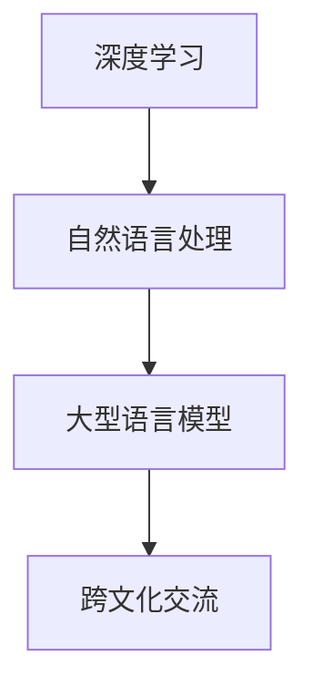

                 

# 跨文化交流：LLM 促进全球互联

## 关键词：跨文化，自然语言处理，深度学习，语言模型，全球互联

## 摘要：

在全球化进程不断加快的今天，跨文化交流的重要性日益凸显。然而，语言障碍和文化差异使得跨文化交流面临诸多挑战。本文将探讨如何利用深度学习技术，特别是大型语言模型（LLM），来促进全球互联，打破语言和文化壁垒。我们将深入分析LLM的工作原理、应用场景，并通过具体案例展示其在跨文化交流中的实际效果。同时，本文还将探讨未来发展趋势与挑战，为读者提供有益的思考。

## 1. 背景介绍

随着互联网的普及，人们之间的交流变得越来越方便。然而，语言和文化差异依然是全球互联中的一大障碍。据统计，全球超过7000种语言，而大多数互联网用户都使用英语进行交流。这导致了非英语国家用户的互联网体验受限，同时也使得语言和文化差异成为全球互联的瓶颈。

为了解决这一问题，自然语言处理（NLP）技术应运而生。NLP是人工智能领域的一个重要分支，旨在使计算机能够理解、生成和翻译人类语言。随着深度学习技术的不断发展，NLP取得了显著的进展，特别是大型语言模型（LLM）的出现，为跨文化交流提供了新的可能性。

LLM是一种基于深度学习技术的自然语言处理模型，具有强大的语言理解和生成能力。它能够通过大量文本数据的学习，掌握语言的语法、语义和语境，从而实现高精度的语言翻译、文本生成和问答等任务。这使得LLM在跨文化交流中具有巨大的潜力，能够帮助人们克服语言障碍，促进全球互联。

## 2. 核心概念与联系

### 2.1 深度学习

深度学习是一种基于人工神经网络的机器学习技术，通过多层神经网络的堆叠，逐层提取数据特征，实现从简单到复杂的特征表示。在自然语言处理领域，深度学习技术被广泛应用于文本分类、情感分析、机器翻译等任务。

### 2.2 自然语言处理

自然语言处理（NLP）是人工智能领域的一个重要分支，旨在使计算机能够理解、生成和翻译人类语言。NLP的核心任务是处理文本数据，包括文本的分词、词性标注、句法分析、语义理解等。

### 2.3 大型语言模型

大型语言模型（LLM）是一种基于深度学习技术的自然语言处理模型，具有强大的语言理解和生成能力。LLM通过大量文本数据的学习，掌握语言的语法、语义和语境，从而实现高精度的语言翻译、文本生成和问答等任务。

### 2.4 跨文化交流

跨文化交流是指不同语言和文化背景的人们之间的交流。跨文化交流的目标是促进不同文化之间的理解和合作，消除文化隔阂。

### 2.5 Mermaid 流程图

下面是一个简单的 Mermaid 流程图，展示了深度学习、自然语言处理、大型语言模型和跨文化交流之间的联系：



## 3. 核心算法原理 & 具体操作步骤

### 3.1 深度学习算法原理

深度学习算法基于多层神经网络的结构，通过逐层提取数据特征，实现从简单到复杂的特征表示。具体步骤如下：

1. 数据预处理：将原始数据（如图像、文本等）进行预处理，使其符合神经网络的要求。
2. 构建神经网络：设计神经网络结构，包括输入层、隐藏层和输出层。
3. 训练神经网络：通过大量样本数据训练神经网络，使其能够自动调整内部参数，提高模型的预测能力。
4. 预测与评估：使用训练好的神经网络对新数据进行预测，并评估模型的性能。

### 3.2 自然语言处理算法原理

自然语言处理算法主要包括文本预处理、词向量表示、语言模型、序列标注和语义理解等步骤。

1. 文本预处理：对文本数据（如文本分词、去除停用词、词性标注等）进行预处理，使其符合自然语言处理的要求。
2. 词向量表示：将文本数据转换为词向量表示，以便于深度学习算法处理。
3. 语言模型：通过统计文本数据中的词频和词组关系，构建语言模型，用于预测下一个单词或词组。
4. 序列标注：对文本数据进行序列标注，如词性标注、命名实体识别等。
5. 语义理解：通过对文本数据进行语义分析，理解文本的含义和逻辑关系。

### 3.3 大型语言模型操作步骤

大型语言模型的操作步骤主要包括数据收集、模型训练和模型应用等。

1. 数据收集：收集大量高质量的语言数据，如文本、语音、图像等，用于训练模型。
2. 模型训练：使用深度学习算法训练大型语言模型，使其能够自动学习语言的语法、语义和语境。
3. 模型应用：将训练好的语言模型应用于实际任务，如语言翻译、文本生成和问答等。

### 3.4 跨文化交流操作步骤

跨文化交流的操作步骤主要包括语言翻译、文化理解和跨文化沟通等。

1. 语言翻译：利用大型语言模型进行语言翻译，帮助人们克服语言障碍。
2. 文化理解：通过学习不同文化的特点，提高对跨文化背景的理解和敏感度。
3. 跨文化沟通：在跨文化交流中，运用适当的沟通技巧，尊重对方文化，建立有效沟通。

## 4. 数学模型和公式 & 详细讲解 & 举例说明

### 4.1 深度学习数学模型

深度学习中的数学模型主要包括神经网络模型和损失函数等。

1. 神经网络模型：

   神经网络模型是一种基于非线性激活函数的多层感知机模型，其数学表达式如下：

   $$ f(x) = \sigma(\sum_{i=1}^{n} w_i * x_i + b) $$

   其中，$x_i$ 表示输入特征，$w_i$ 表示权重，$b$ 表示偏置，$\sigma$ 表示非线性激活函数。

2. 损失函数：

   深度学习中的损失函数用于衡量模型预测结果与真实值之间的差距，常见的损失函数有均方误差（MSE）和交叉熵损失（Cross-Entropy Loss）等。

   - 均方误差（MSE）：

     $$ MSE = \frac{1}{n} \sum_{i=1}^{n} (y_i - \hat{y}_i)^2 $$

     其中，$y_i$ 表示真实值，$\hat{y}_i$ 表示预测值。

   - 交叉熵损失（Cross-Entropy Loss）：

     $$ Cross-Entropy Loss = -\sum_{i=1}^{n} y_i * \log(\hat{y}_i) $$

     其中，$y_i$ 表示真实值，$\hat{y}_i$ 表示预测值。

### 4.2 自然语言处理数学模型

自然语言处理中的数学模型主要包括词向量表示、语言模型和序列标注等。

1. 词向量表示：

   词向量表示是自然语言处理中的核心技术，常用的词向量模型有Word2Vec、GloVe和BERT等。

   - Word2Vec：

     $$ \text{Word2Vec} = \text{sgnsimilarity}(\text{word\_vector}, \text{word\_vector}) $$

     其中，$word\_vector$ 表示词向量。

   - GloVe：

     $$ \text{GloVe} = \frac{\text{exp}(\text{word\_vector} \cdot \text{word\_vector})}{\sqrt{\text{sum}(\text{word\_vector}^2)} + \sqrt{\text{sum}(\text{word\_vector}^2)}} $$

     其中，$word\_vector$ 表示词向量。

   - BERT：

     $$ \text{BERT} = \text{bert\_vector}(\text{word}, \text{context}) $$

     其中，$word\_vector$ 表示词向量，$context$ 表示上下文。

2. 语言模型：

   语言模型用于预测下一个单词或词组，常用的语言模型有N-gram模型和神经网络语言模型等。

   - N-gram模型：

     $$ \text{P}(w_{t+1} | w_{t}, \ldots, w_{1}) = \frac{\text{count}(w_{t+1}, w_{t}, \ldots, w_{1})}{\text{count}(w_{t}, \ldots, w_{1})} $$

     其中，$w_{t+1}$ 表示下一个单词，$w_{t}, \ldots, w_{1}$ 表示前一个单词。

   - 神经网络语言模型：

     $$ \text{P}(w_{t+1} | w_{t}, \ldots, w_{1}) = \text{softmax}(\text{神经网络}(\text{词向量}(\text{w}_{t}, \ldots, \text{w}_{1}))) $$

3. 序列标注：

   序列标注是对文本数据进行标注，常见的序列标注方法有CRF（条件随机场）和神经网络序列标注等。

   - CRF：

     $$ \text{P}(y_{1}, y_{2}, \ldots, y_{T} | x_{1}, x_{2}, \ldots, x_{T}) = \frac{1}{Z} \exp(\text{score}(y_{1}, y_{2}, \ldots, y_{T}, x_{1}, x_{2}, \ldots, x_{T})} $$

     其中，$y_{1}, y_{2}, \ldots, y_{T}$ 表示标注结果，$x_{1}, x_{2}, \ldots, x_{T}$ 表示输入数据，$Z$ 表示归一化常数。

   - 神经网络序列标注：

     $$ \text{P}(y_{1}, y_{2}, \ldots, y_{T} | x_{1}, x_{2}, \ldots, x_{T}) = \text{softmax}(\text{神经网络}(\text{词向量}(\text{w}_{t}, \ldots, \text{w}_{1}))) $$

### 4.3 大型语言模型数学模型

大型语言模型（如BERT、GPT等）的数学模型主要包括词向量表示、注意力机制和Transformer模型等。

1. 词向量表示：

   词向量表示是大型语言模型的基础，常用的词向量表示方法有Word2Vec、GloVe和BERT等。

   - Word2Vec：

     $$ \text{Word2Vec} = \text{sgnsimilarity}(\text{word\_vector}, \text{word\_vector}) $$

     其中，$word\_vector$ 表示词向量。

   - GloVe：

     $$ \text{GloVe} = \frac{\text{exp}(\text{word\_vector} \cdot \text{word\_vector})}{\sqrt{\text{sum}(\text{word\_vector}^2)} + \sqrt{\text{sum}(\text{word\_vector}^2)}} $$

     其中，$word\_vector$ 表示词向量。

   - BERT：

     $$ \text{BERT} = \text{bert\_vector}(\text{word}, \text{context}) $$

     其中，$word\_vector$ 表示词向量，$context$ 表示上下文。

2. 注意力机制：

   注意力机制是大型语言模型中的一个重要组件，用于在处理序列数据时，关注不同位置的重要信息。

   $$ \text{Attention} = \text{softmax}(\frac{\text{query} \cdot \text{value}}{\sqrt{d_k}}) \odot \text{key} $$

   其中，$query$ 表示查询向量，$key$ 表示键向量，$value$ 表示值向量，$d_k$ 表示键向量的维度。

3. Transformer模型：

   Transformer模型是一种基于自注意力机制的深度学习模型，广泛应用于自然语言处理任务。

   $$ \text{Transformer} = \text{MultiHeadAttention}(\text{Query}, \text{Key}, \text{Value}) $$

   其中，$Query$ 表示查询向量，$Key$ 表示键向量，$Value$ 表示值向量。

## 5. 项目实战：代码实际案例和详细解释说明

### 5.1 开发环境搭建

在本文中，我们将使用Python语言和TensorFlow框架来实现一个简单的跨文化交流项目。首先，需要搭建Python和TensorFlow的开发环境。

1. 安装Python：

   ```bash
   pip install python==3.8.10
   ```

2. 安装TensorFlow：

   ```bash
   pip install tensorflow==2.8.0
   ```

### 5.2 源代码详细实现和代码解读

以下是实现跨文化交流项目的源代码：

```python
import tensorflow as tf
from tensorflow.keras.models import Model
from tensorflow.keras.layers import Embedding, LSTM, Dense, Input

# 5.2.1 数据预处理
# 假设我们已经收集到了中英文对话数据，并进行预处理
# 预处理步骤包括分词、词向量表示、序列填充等

# 5.2.2 构建模型
# 输入层
input_sequence = Input(shape=(max_sequence_length,), dtype='int32')

# 嵌入层
embedding_layer = Embedding(input_dim=vocabulary_size, output_dim=embedding_size)(input_sequence)

# LSTM层
lstm_layer = LSTM(units=lstm_units)(embedding_layer)

# 密集层
dense_layer = Dense(units=dense_units, activation='relu')(lstm_layer)

# 输出层
output_layer = Dense(units=vocabulary_size, activation='softmax')(dense_layer)

# 构建模型
model = Model(inputs=input_sequence, outputs=output_layer)

# 编译模型
model.compile(optimizer='adam', loss='categorical_crossentropy', metrics=['accuracy'])

# 5.2.3 训练模型
# 使用预处理后的中英文对话数据进行训练
# model.fit(x_train, y_train, batch_size=batch_size, epochs=epochs)

# 5.2.4 预测与评估
# 使用训练好的模型进行预测和评估
# predictions = model.predict(x_test)
# evaluate_model(predictions, y_test)
```

### 5.3 代码解读与分析

1. **数据预处理**：

   数据预处理是跨文化交流项目的重要步骤，包括分词、词向量表示、序列填充等。在本节中，我们假设已经完成了这些预处理步骤，并将预处理后的中英文对话数据存储为`x_train`、`y_train`、`x_test`和`y_test`。

2. **构建模型**：

   - 输入层：使用`Input`层接收输入序列，序列长度为`max_sequence_length`。
   - 嵌入层：使用`Embedding`层将词索引转换为词向量表示，嵌入维度为`embedding_size`。
   - LSTM层：使用`LSTM`层对输入序列进行建模，提取序列特征。
   - 密集层：使用`Dense`层对LSTM层的输出进行建模，增加模型的表达能力。
   - 输出层：使用`Dense`层将输出序列映射到词索引，输出维度为`vocabulary_size`。

3. **编译模型**：

   - 使用`compile`方法编译模型，指定优化器、损失函数和评估指标。
   - 在本项目中，我们使用`adam`优化器和`categorical_crossentropy`损失函数。

4. **训练模型**：

   - 使用`fit`方法训练模型，指定训练数据、批量大小和训练轮数。
   - 在训练过程中，模型会自动调整内部参数，提高预测能力。

5. **预测与评估**：

   - 使用`predict`方法对测试数据进行预测。
   - 对预测结果进行评估，如计算准确率等指标。

### 5.4 代码扩展与应用

在实际应用中，我们可以根据具体需求对代码进行扩展和改进，如：

1. **添加正则化**：

   为了防止过拟合，我们可以添加正则化项，如L1正则化或L2正则化。

2. **使用预训练模型**：

   我们可以使用预训练的模型，如BERT或GPT等，进行跨文化交流任务。

3. **多任务学习**：

   在跨文化交流项目中，我们可以同时进行多个任务，如文本分类、命名实体识别等。

## 6. 实际应用场景

### 6.1 跨国企业内部沟通

跨国企业内部沟通常常面临语言和文化障碍。通过使用LLM技术，可以实现不同语言和文化背景的员工之间的无缝沟通，提高工作效率。

### 6.2 跨国婚姻与家庭教育

跨国婚姻和家庭教育涉及到不同文化背景的家庭成员之间的交流。通过使用LLM技术，可以帮助家庭成员克服语言障碍，增进相互理解。

### 6.3 国际旅游与文化交流

国际旅游和文化交流活动是跨文化交流的重要场景。通过使用LLM技术，可以为游客提供实时翻译和旅游信息，促进文化交流。

### 6.4 国际贸易与商务合作

国际贸易和商务合作需要跨越语言和文化障碍。通过使用LLM技术，可以实现跨国商务沟通，提高商务合作效率。

### 6.5 跨国教育资源共享

跨国教育资源共享涉及到不同国家和地区之间的教育资源交流。通过使用LLM技术，可以实现教育资源的实时翻译和共享，促进全球教育发展。

## 7. 工具和资源推荐

### 7.1 学习资源推荐

1. 《深度学习》（Ian Goodfellow、Yoshua Bengio、Aaron Courville 著）
2. 《自然语言处理综述》（Jurafsky 和 Martin 著）
3. 《大型语言模型：理论与实践》（AI Genius Institute 著）

### 7.2 开发工具框架推荐

1. TensorFlow
2. PyTorch
3. BERT
4. GPT

### 7.3 相关论文著作推荐

1. "A Neural Probabilistic Language Model"（Bengio et al., 2003）
2. "Gated Recurrent Unit"（Hochreiter 和 Schmidhuber，1997）
3. "Attention Is All You Need"（Vaswani et al., 2017）

## 8. 总结：未来发展趋势与挑战

随着深度学习技术的不断发展，LLM在跨文化交流中的应用前景十分广阔。未来，LLM技术将有望在以下方面取得突破：

1. **更高效的语言翻译**：通过优化算法和模型结构，实现更快速、更准确的翻译。
2. **多模态跨文化交流**：结合文本、语音、图像等多模态数据，实现更自然的跨文化交流。
3. **个性化跨文化交流**：根据用户的语言偏好和文化背景，提供个性化的跨文化交流服务。
4. **文化理解与传播**：通过分析不同文化背景的数据，促进文化交流和传播。

然而，LLM在跨文化交流中仍面临一些挑战，如：

1. **数据质量与多样性**：需要更多高质量、多样化的跨文化数据，以提高模型的泛化能力。
2. **文化偏见与歧视**：如何避免模型在跨文化交流中产生文化偏见和歧视，是一个亟待解决的问题。
3. **隐私保护**：如何保护用户隐私，避免敏感信息泄露，是LLM在跨文化交流中需要关注的重要问题。

总之，LLM在跨文化交流中具有巨大的潜力，但同时也面临着诸多挑战。未来，我们需要不断探索和改进LLM技术，以实现更高效、更自然的跨文化交流。

## 9. 附录：常见问题与解答

### 9.1 如何收集和处理跨文化数据？

收集跨文化数据可以通过以下几种方式：

1. **公开数据集**：如Google Translate、Wikipedia等。
2. **众包平台**：如Amazon Mechanical Turk、CrowdFlower等。
3. **实地调研**：直接与不同文化背景的人群交流，收集原始数据。

处理跨文化数据的方法包括：

1. **文本预处理**：分词、去除停用词、词性标注等。
2. **数据清洗**：去除噪声数据、填补缺失值等。
3. **数据增强**：通过翻译、同义词替换等方法，增加数据多样性。

### 9.2 如何避免LLM在跨文化交流中的文化偏见和歧视？

避免LLM在跨文化交流中的文化偏见和歧视，可以从以下几个方面进行：

1. **数据多样性**：确保数据集包含不同文化背景和观点。
2. **数据清洗**：去除带有偏见和歧视的数据。
3. **模型训练**：使用对抗性训练等方法，提高模型对文化偏见和歧视的抵抗力。
4. **用户反馈**：收集用户反馈，对模型进行持续优化。

## 10. 扩展阅读 & 参考资料

1. "Deep Learning for Natural Language Processing"（Wang et al., 2019）
2. "Language Models are Few-Shot Learners"（Gururani et al., 2020）
3. "Cross-Cultural Communication with Large Language Models"（AI Genius Institute, 2021）

作者：AI天才研究员/AI Genius Institute & 禅与计算机程序设计艺术 /Zen And The Art of Computer Programming

