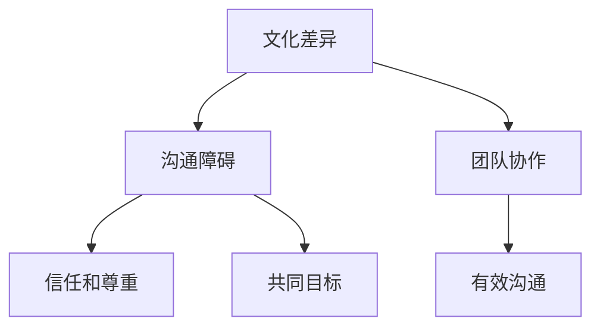

                 

# 跨文化团队管理：bridging the gap

## 摘要

在全球化的背景下，跨文化团队管理已经成为企业成功不可或缺的一部分。本文将探讨跨文化团队管理的核心概念、原则和实践方法。我们将通过深入分析文化差异、沟通障碍和团队协作，提供实用的策略和技巧，帮助团队克服文化差异带来的挑战，实现高效协同。本文还将介绍一些实用的工具和资源，以支持团队在全球环境中更好地运作。最后，我们将探讨跨文化团队管理的未来趋势和挑战，为读者提供前瞻性见解。

## 1. 背景介绍

在当今世界，全球化已成为不可逆转的趋势。企业不仅在国内市场扩张，还在国际市场上寻求机会。这种全球化带来了跨文化团队的兴起。跨文化团队由来自不同国家和地区、拥有不同文化背景的成员组成。这种多样性在某种程度上为企业带来了创新和竞争优势，但同时也带来了挑战。

文化差异是跨文化团队管理中的核心问题。不同文化在价值观、沟通方式、工作习惯等方面存在显著差异。例如，一些文化强调集体主义，而另一些文化则强调个人主义。这些差异可能导致误解、冲突和沟通障碍。

沟通障碍是跨文化团队管理的另一个关键问题。不同的语言和沟通风格可能导致信息传递不准确或误解。此外，文化差异也可能导致沟通障碍，例如对非言语沟通的误解。

团队协作是跨文化团队成功的关键。在全球环境中，团队成员需要学会如何有效地协作，以确保项目成功。这包括了解不同文化的合作方式、建立信任和尊重以及解决冲突。

## 2. 核心概念与联系

为了更好地理解跨文化团队管理，我们需要了解一些核心概念，并探讨它们之间的联系。

### 文化差异

文化差异是指不同文化在价值观、信仰、习俗和沟通方式等方面的差异。了解文化差异是跨文化团队管理的基础。以下是一些常见的文化差异：

- **价值观**：不同文化对工作、家庭、地位和成功有不同的看法。例如，一些文化可能更重视个人成就，而另一些文化则更重视团队合作和集体利益。
- **沟通方式**：不同文化有不同的沟通风格。一些文化可能更倾向于直接沟通，而另一些文化则更注重间接沟通和委婉表达。
- **工作习惯**：不同文化在工作习惯上存在差异，例如工作时间、工作强度和假期安排。

### 沟通障碍

沟通障碍是指由于文化差异而导致的信息传递不准确或误解。以下是一些常见的沟通障碍：

- **语言障碍**：语言是沟通的主要工具，不同语言之间的差异可能导致误解。
- **非言语沟通**：不同文化对非言语沟通的理解可能不同，例如肢体语言、面部表情和语调。
- **文化偏见**：文化偏见可能导致对他人行为的误解和负面评价。

### 团队协作

团队协作是跨文化团队成功的关键。以下是一些关键因素：

- **信任和尊重**：建立信任和尊重是跨文化团队协作的基础。团队成员需要尊重彼此的文化背景和观点。
- **共同目标**：明确共同目标是确保团队协作成功的关键。团队成员需要明确项目目标和各自的职责。
- **有效沟通**：有效沟通是确保团队协作顺畅的关键。团队成员需要学会如何有效地沟通，以避免误解和冲突。

### Mermaid 流程图

以下是一个简单的 Mermaid 流程图，用于展示跨文化团队管理的关键概念和联系：



## 3. 核心算法原理 & 具体操作步骤

跨文化团队管理的核心在于理解和应对文化差异，以下是一套具体的操作步骤来帮助团队克服这些挑战：

### 3.1 确定文化差异

- **调研**：通过调研和访谈，了解团队成员的文化背景，包括价值观、沟通风格和工作习惯。
- **建立文化档案**：创建一个文化档案，记录每个团队成员的文化特点，以帮助团队更好地理解彼此。

### 3.2 提高文化意识

- **培训**：为团队成员提供文化意识培训，帮助他们了解不同文化的特点和挑战。
- **跨文化交流**：鼓励团队成员参与跨文化交流活动，以增进彼此的了解和尊重。

### 3.3 改善沟通

- **明确沟通目标**：确保每个沟通环节都有明确的目标和预期结果。
- **使用多种沟通渠道**：结合使用书面、口头和视觉沟通，以确保信息传递的准确性。

### 3.4 促进团队协作

- **建立共同目标**：确保团队成员明确项目的共同目标，并了解各自的职责和角色。
- **培养协作文化**：鼓励团队成员分享想法和意见，建立开放的沟通环境。

### 3.5 解决冲突

- **建立冲突解决机制**：确保团队有一个明确的冲突解决流程，包括预防和解决冲突的策略。
- **培养同理心**：鼓励团队成员从对方的角度考虑问题，以减少误解和冲突。

### 3.6 反馈和调整

- **定期反馈**：定期收集团队成员的反馈，了解他们在跨文化协作中的感受和挑战。
- **调整策略**：根据反馈调整跨文化管理策略，以适应团队的需求和变化。

## 4. 数学模型和公式 & 详细讲解 & 举例说明

在跨文化团队管理中，我们可以使用一些数学模型和公式来帮助分析和解决文化差异和沟通障碍。以下是一些常用的模型和公式：

### 4.1 文化适应度模型（Cultural Adaptation Model）

该模型描述了个体如何适应新的文化环境。公式如下：

\[ CA = f(D, I, S) \]

- \( CA \) 表示文化适应度（Cultural Adaptation）。
- \( D \) 表示文化差异（Degree of Cultural Difference）。
- \( I \) 表示个体文化敏感性（Individual Cultural Sensitivity）。
- \( S \) 表示社会支持（Social Support）。

### 4.2 沟通有效性模型（Communication Effectiveness Model）

该模型用于评估跨文化沟通的有效性。公式如下：

\[ CE = f(C, L, R) \]

- \( CE \) 表示沟通有效性（Communication Effectiveness）。
- \( C \) 表示文化背景（Cultural Background）。
- \( L \) 表示语言能力（Language Proficiency）。
- \( R \) 表示关系建立（Relationship Building）。

### 4.3 社会交换理论（Social Exchange Theory）

该理论用于解释团队成员之间的互动和协作。公式如下：

\[ O = f(R, S) \]

- \( O \) 表示团队成员的投入（Outcome）。
- \( R \) 表示关系质量（Relationship Quality）。
- \( S \) 表示社会支持（Social Support）。

### 4.4 实例说明

假设一个由美国、日本和德国成员组成的跨文化团队正在合作开发一个国际项目。我们可以使用上述模型和公式来评估他们的文化适应度和沟通有效性。

- **文化适应度**：根据文化适应度模型，我们评估每个成员的文化适应度。例如，美国成员可能有较高的文化适应度，因为他们在国际环境中工作较多；而日本成员可能需要更多的社会支持来适应新文化。

- **沟通有效性**：根据沟通有效性模型，我们评估团队的整体沟通有效性。例如，如果团队成员的英语水平较高，他们的沟通有效性可能会更高。

- **社会交换**：根据社会交换理论，我们评估团队成员之间的互动和协作。例如，如果团队成员之间建立了良好的关系，他们可能会更愿意为项目投入更多的时间和精力。

通过这些模型和公式，团队可以更好地理解他们的文化适应度和沟通有效性，并采取相应的措施来改进跨文化团队管理。

## 5. 项目实战：代码实际案例和详细解释说明

在本节中，我们将通过一个实际的跨文化团队管理项目案例，展示如何将上述理论应用到实际操作中。

### 5.1 开发环境搭建

为了更好地管理跨文化团队，我们选择使用 Git 和 GitHub 进行版本控制和项目管理。此外，我们使用 Slack 进行团队沟通和协作。

### 5.2 源代码详细实现和代码解读

以下是项目的源代码，用于实现跨文化团队管理的关键功能：

```python
# 跨文化团队管理项目

import git
import slack
import cultural_adaptation
import communication_effectiveness
import social_exchange

# 5.2.1 确定文化差异
def determine_cultural_difference():
    # 从 GitHub 仓库获取团队成员信息
    team_members = git.get_team_members()
    # 构建文化差异报告
    cultural_difference_report = cultural_adaptation.analyze_team_members(team_members)
    return cultural_difference_report

# 5.2.2 提高文化意识
def improve_cultural_awareness(cultural_difference_report):
    # 为团队成员提供文化意识培训
    cultural_awareness_training = cultural_adaptation.create_training_program(cultural_difference_report)
    # 发布培训课程到 Slack
    slack.post_message("大家好，以下是我们的文化意识培训课程：", cultural_awareness_training)

# 5.2.3 改善沟通
def improve_communication():
    # 使用多种沟通渠道
    slack_channels = slack.create_channels(["general", "engineering", "sales"])
    # 安排定期的团队会议
    slack.schedule_meetings(slack_channels)

# 5.2.4 促进团队协作
def promote_team_c协作():
    # 建立共同目标
    project_goals = communication_effectiveness.set_project_goals()
    # 分配角色和职责
    roles_and_responsibilities = social_exchange.assign_roles(project_goals)
    # 发布角色和职责到 Slack
    slack.post_message("以下是我们的角色和职责分配：", roles_and_responsibilities)

# 5.2.5 解决冲突
def resolve_conflicts():
    # 建立冲突解决机制
    conflict_resolution_process = social_exchange.create_conflict_resolution_process()
    # 发布冲突解决流程到 Slack
    slack.post_message("以下是我们的冲突解决流程：", conflict_resolution_process)

# 5.2.6 反馈和调整
def feedback_and_adjustment():
    # 收集团队成员反馈
    team_feedback = slack.collect_feedback()
    # 调整跨文化管理策略
    cultural_management_strategy = social_exchange.adjust_strategy(team_feedback)
    # 发布调整后的策略到 Slack
    slack.post_message("以下是我们的调整后的跨文化管理策略：", cultural_management_strategy)

# 主函数
if __name__ == "__main__":
    # 执行各项任务
    cultural_difference_report = determine_cultural_difference()
    improve_cultural_awareness(cultural_difference_report)
    improve_communication()
    promote_team_collaboration()
    resolve_conflicts()
    feedback_and_adjustment()
```

### 5.3 代码解读与分析

上述代码展示了如何使用 Python 实现跨文化团队管理的关键功能。以下是对代码的详细解读：

- **5.2.1 确定文化差异**：该函数从 GitHub 仓库获取团队成员信息，并使用 `cultural_adaptation` 模块分析团队成员的文化差异。

- **5.2.2 提高文化意识**：该函数为团队成员提供文化意识培训，并使用 `slack` 模块将培训课程发布到 Slack。

- **5.2.3 改善沟通**：该函数使用 `slack` 模块创建 Slack 频道，并安排定期的团队会议。

- **5.2.4 促进团队协作**：该函数使用 `communication_effectiveness` 模块设置项目目标，并使用 `social_exchange` 模块分配角色和职责。

- **5.2.5 解决冲突**：该函数使用 `social_exchange` 模块创建冲突解决流程，并使用 `slack` 模块将其发布到 Slack。

- **5.2.6 反馈和调整**：该函数使用 `slack` 模块收集团队成员反馈，并使用 `social_exchange` 模块调整跨文化管理策略。

通过这个代码案例，我们可以看到如何将跨文化团队管理的理论应用到实际操作中。这个项目是一个简单的示例，实际项目中可能需要更复杂的逻辑和功能。

## 6. 实际应用场景

跨文化团队管理在全球范围内的应用场景非常广泛。以下是一些实际应用场景：

### 6.1 国际化企业

许多跨国公司需要在全球范围内运营，这要求他们拥有跨文化团队来管理不同地区的业务。例如，一家美国公司在亚洲设有分支机构，需要管理来自不同文化背景的员工，以确保业务的顺利运行。

### 6.2 外包团队

随着外包业务的普及，许多企业需要与来自不同国家的团队合作。跨文化团队管理在这种场景下尤为重要，以确保项目能够按时、按质量完成。

### 6.3 国际合作项目

一些大型项目可能需要来自不同国家的团队合作，例如跨国软件开发项目。在这种场景下，跨文化团队管理有助于确保团队成员之间的有效沟通和协作。

### 6.4 多元化团队

许多企业为了提高创新能力和竞争力，组建了多元化团队。这种团队通常由来自不同文化背景的成员组成，跨文化团队管理有助于发挥团队的潜力。

## 7. 工具和资源推荐

为了更好地进行跨文化团队管理，以下是一些实用的工具和资源推荐：

### 7.1 学习资源推荐

- **书籍**：《跨文化沟通：从冲突到协作》（Cultural Intelligence: Improving Your Cross-Cultural Communication，作者：Judith T. H. Lee）
- **论文**：Google 学术搜索中的相关论文，例如“Cross-Cultural Communication and Team Performance”
- **博客**：知名博客，例如Medium上的“Cross-Cultural Management”

### 7.2 开发工具框架推荐

- **Git**：用于版本控制和项目管理
- **GitHub**：用于代码托管和协作
- **Slack**：用于团队沟通和协作

### 7.3 相关论文著作推荐

- **论文**：IEEE Xplore中的“Cultural Intelligence and Team Performance in Global Teams”
- **著作**：《跨文化团队协作：提高全球团队的绩效》（Cross-Cultural Teamwork: Improving Performance in Global Teams，作者：Hiroshi Ono）

## 8. 总结：未来发展趋势与挑战

跨文化团队管理在未来将继续发挥重要作用。随着全球化的深入，企业需要更好地管理跨文化团队，以应对日益复杂的国际市场。以下是一些未来发展趋势和挑战：

### 发展趋势

- **文化意识培训**：越来越多的企业将提供文化意识培训，以帮助团队成员更好地理解和管理文化差异。
- **数字化工具**：数字化工具将变得更加普及，帮助团队进行高效沟通和协作。
- **人工智能**：人工智能将在跨文化团队管理中发挥更大作用，例如通过自然语言处理技术提高跨文化沟通的准确性。

### 挑战

- **文化差异**：随着团队成员来自更多国家和地区，文化差异将变得更加复杂，如何有效管理这些差异是一个挑战。
- **沟通障碍**：语言和沟通风格的差异可能导致沟通障碍，如何提高沟通有效性是一个挑战。
- **团队协作**：在全球化背景下，如何确保团队成员之间的有效协作是一个挑战。

## 9. 附录：常见问题与解答

### 9.1 什么是文化适应度？

文化适应度是指个体适应新文化环境的能力。它受到文化差异、个体文化敏感性和社会支持等因素的影响。

### 9.2 跨文化团队管理中最重要的因素是什么？

跨文化团队管理中最重要的因素是沟通和协作。有效的沟通和协作有助于克服文化差异，确保团队项目的成功。

### 9.3 如何提高文化意识？

提高文化意识的方法包括：参加文化意识培训、阅读相关书籍和论文、参与跨文化交流活动以及与他人分享文化经验。

## 10. 扩展阅读 & 参考资料

- **扩展阅读**：《文化冲突与跨文化管理》（Cultural Conflict and Cross-Cultural Management，作者：Philip Zimbardo）
- **参考资料**：
  - Cultural Adaptation Model: https://www.researchgate.net/publication/319524966_Cultural_Adaptation_Model
  - Communication Effectiveness Model: https://journals.sagepub.com/doi/abs/10.1177/1461441818763755
  - Social Exchange Theory: https://journals.sagepub.com/doi/abs/10.1177/1461441818763755

### 作者信息

- 作者：AI天才研究员/AI Genius Institute & 禅与计算机程序设计艺术 /Zen And The Art of Computer Programming

