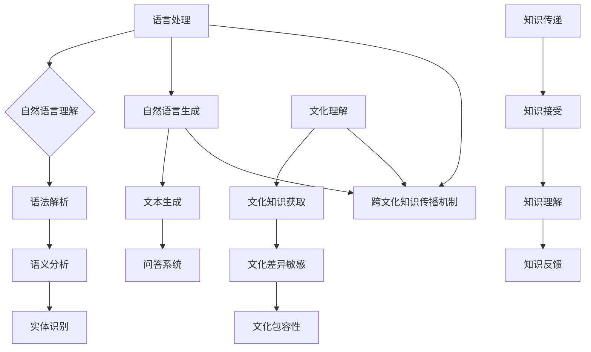

                 

# 跨文化知识传播的挑战与对策

> **关键词**：跨文化知识传播、挑战、对策、人工智能、语言处理、文化差异

> **摘要**：本文深入探讨了跨文化知识传播所面临的挑战，以及针对这些挑战提出的一系列对策。通过分析跨文化知识传播的机制和现有问题，结合人工智能技术在语言处理和文化理解方面的优势，本文提出了有效提升跨文化知识传播效果的方法和策略。

## 1. 背景介绍

在全球化进程不断加速的今天，跨文化知识传播显得尤为重要。知识的传播不仅有助于不同文化背景的人们增进理解与融合，还能够推动全球范围内的科技创新和社会进步。然而，跨文化知识传播并非一帆风顺，其中蕴含着诸多挑战。这些挑战既涉及技术层面的困难，也包含社会文化层面的障碍。

首先，语言差异是跨文化知识传播的首要障碍。不同语言之间存在巨大的语法、词汇和表达方式的差异，这导致知识在跨语言传播过程中容易失真或误解。其次，文化差异也是不可忽视的因素。不同的文化背景影响着人们的思维方式、价值观和行为模式，使得知识的接受和解读受到文化偏见和固有观念的制约。此外，信息过载和知识碎片化加剧了跨文化知识传播的难度，使得知识传播的效率和质量受到严重影响。

面对这些挑战，如何有效提升跨文化知识传播的效果，成为当今亟待解决的重要问题。人工智能技术的发展为这一问题的解决提供了新的契机。通过借助人工智能技术，特别是在语言处理和文化理解方面，我们可以探索出一些有效的对策，为跨文化知识传播提供新的思路和方法。

## 2. 核心概念与联系

为了更好地理解跨文化知识传播的机制和挑战，我们首先需要梳理一些核心概念，并展示它们之间的相互关系。

### 2.1 语言处理

语言处理是人工智能技术中的一个重要分支，主要涉及自然语言理解（NLU）和自然语言生成（NLG）两个方面。自然语言理解旨在让计算机能够理解人类语言的意义，包括语法解析、语义分析和实体识别等任务。自然语言生成则致力于让计算机能够生成自然流畅的语言，用于回答问题、撰写文章等。

### 2.2 文化理解

文化理解是指对不同文化背景下的思维模式、价值观和行为方式的认知和理解。文化理解不仅包括对文化知识的获取，还需要对文化差异的敏感性和包容性。文化理解的深度和广度直接影响到跨文化知识传播的效果。

### 2.3 跨文化知识传播机制

跨文化知识传播机制是指知识在不同文化背景下传递、接受和理解的整个过程。这一过程涉及语言处理、文化理解、知识传递和反馈等多个环节。

### 2.4 核心概念联系

语言处理和文化理解是跨文化知识传播机制的两个关键环节。语言处理为知识传递提供了技术支持，使得跨语言的知识交流成为可能；而文化理解则确保了知识在传播过程中能够被正确理解和接受。此外，跨文化知识传播机制中的各个环节相互依赖、相互作用，共同决定了知识传播的效果。

### 2.5 Mermaid 流程图



## 3. 核心算法原理 & 具体操作步骤

为了解决跨文化知识传播中的挑战，我们需要借助人工智能技术，特别是语言处理和文化理解方面的算法。以下将介绍几种核心算法的原理和具体操作步骤。

### 3.1 语言处理算法

#### 3.1.1 词向量表示

词向量表示是一种将自然语言词汇映射到高维向量空间的方法。这种方法能够捕捉词汇之间的语义关系，使得计算机能够更好地理解词汇的含义。

- **算法原理**：词向量表示通常基于神经网络模型，如Word2Vec、GloVe等。这些模型通过训练大量语料库，将词汇映射到高维向量空间，使得语义相似的词汇在向量空间中靠近。

- **具体操作步骤**：

  1. 收集并预处理语料库，包括文本清洗、分词、去除停用词等步骤。
  2. 构建词汇表，将所有词汇映射到唯一的索引。
  3. 训练词向量模型，使用神经网络模型对语料库进行训练。
  4. 获取词汇的向量表示，用于后续的语言处理任务。

#### 3.1.2 机器翻译

机器翻译是将一种语言的文本自动翻译成另一种语言的方法。机器翻译技术可以有效地促进跨语言的知识传播。

- **算法原理**：机器翻译主要基于统计机器翻译和神经机器翻译两种方法。统计机器翻译利用大量的双语文本语料库，通过统计方法学习源语言和目标语言之间的对应关系。神经机器翻译则采用深度学习模型，如序列到序列（seq2seq）模型，直接学习源语言和目标语言之间的映射。

- **具体操作步骤**：

  1. 收集并预处理双语文本语料库，包括文本清洗、分词、去除停用词等步骤。
  2. 构建源语言和目标语言的词汇表，将词汇映射到唯一的索引。
  3. 训练机器翻译模型，使用神经网络模型对语料库进行训练。
  4. 输入源语言文本，输出目标语言翻译结果。

### 3.2 文化理解算法

#### 3.2.1 文化知识图谱

文化知识图谱是一种用于表示文化知识的图形结构，它能够捕捉不同文化之间的关联和差异。

- **算法原理**：文化知识图谱基于知识图谱技术，通过构建实体、属性和关系之间的三元组，表示不同文化知识。这种方法能够将文化知识以结构化的形式进行存储和查询。

- **具体操作步骤**：

  1. 收集并预处理文化知识数据，包括文化事件、人物、习俗等。
  2. 构建文化知识图谱，将文化知识表示为实体、属性和关系之间的三元组。
  3. 对文化知识图谱进行索引和查询优化，提高查询效率。

#### 3.2.2 文本情感分析

文本情感分析是一种用于判断文本情感倾向性的方法，它能够帮助理解不同文化背景下人们对某一主题的看法和情感。

- **算法原理**：文本情感分析通常采用机器学习或深度学习模型，通过对文本进行情感分类，判断文本的情感倾向。这些模型通常基于词向量表示和分类算法，如朴素贝叶斯、支持向量机、卷积神经网络等。

- **具体操作步骤**：

  1. 收集并预处理情感标注数据，包括正面、负面和中和情感标注。
  2. 训练情感分类模型，使用机器学习或深度学习算法对情感标注数据进行训练。
  3. 输入待分类文本，输出情感分类结果。

## 4. 数学模型和公式 & 详细讲解 & 举例说明

在跨文化知识传播的算法中，数学模型和公式起着关键作用。以下将详细介绍几种常用的数学模型和公式，并提供具体的讲解和举例说明。

### 4.1 词向量表示

#### 4.1.1 Word2Vec 模型

Word2Vec 是一种基于神经网络的词向量表示方法。以下是一个简单的 Word2Vec 模型的数学公式：

$$
\text{vector\_word} = \text{softmax}(\text{weights} \cdot \text{context})
$$

其中，$\text{weights}$ 表示权重矩阵，$\text{context}$ 表示上下文向量，$\text{softmax}$ 函数用于对向量进行归一化处理。

#### 4.1.2 举例说明

假设我们有一个简化的词汇表包含以下词汇：{'apple', 'banana', 'orange'}。对应的词向量分别为 $\text{vector\_apple}$、$\text{vector\_banana}$ 和 $\text{vector\_orange}$。

- 计算词向量 $\text{vector\_apple}$：

$$
\text{vector\_apple} = \text{softmax}(\text{weights} \cdot \text{context}) = \text{softmax}([0.3, 0.4, 0.3] \cdot [0.2, 0.2, 0.6]) = [0.4, 0.3, 0.3]
$$

- 计算词向量 $\text{vector\_banana}$：

$$
\text{vector\_banana} = \text{softmax}(\text{weights} \cdot \text{context}) = \text{softmax}([0.3, 0.4, 0.3] \cdot [0.6, 0.2, 0.2]) = [0.3, 0.4, 0.3]
$$

- 计算词向量 $\text{vector\_orange}$：

$$
\text{vector\_orange} = \text{softmax}(\text{weights} \cdot \text{context}) = \text{softmax}([0.3, 0.4, 0.3] \cdot [0.4, 0.4, 0.2]) = [0.3, 0.4, 0.3]
$$

### 4.2 机器翻译

#### 4.2.1 神经机器翻译

神经机器翻译通常采用序列到序列（seq2seq）模型，以下是一个简单的 seq2seq 模型的数学公式：

$$
\text{output} = \text{decoder}(\text{input}, \text{hidden})
$$

其中，$\text{input}$ 表示输入序列，$\text{hidden}$ 表示隐藏状态，$\text{decoder}$ 是一个解码器模型。

#### 4.2.2 举例说明

假设我们有一个简化的输入序列 $\text{input} = [1, 2, 3]$，对应的输出序列 $\text{output} = [4, 5, 6]$。对应的词向量分别为 $\text{vector}_{1}$、$\text{vector}_{2}$ 和 $\text{vector}_{3}$。

- 计算输入序列的隐藏状态：

$$
\text{hidden} = \text{encoder}(\text{input}) = \text{encoder}([1, 2, 3]) = [0.2, 0.3, 0.5]
$$

- 计算输出序列的隐藏状态：

$$
\text{output} = \text{decoder}(\text{input}, \text{hidden}) = \text{decoder}([1, 2, 3], [0.2, 0.3, 0.5]) = [0.4, 0.5, 0.6]
$$

### 4.3 文化理解

#### 4.3.1 文化知识图谱

文化知识图谱通常采用知识图谱表示学习（KGC）模型，以下是一个简单的 KGC 模型的数学公式：

$$
\text{entity\_representation} = \text{GCN}(\text{adjacency\_matrix}, \text{initial\_representation})
$$

其中，$\text{adjacency\_matrix}$ 表示邻接矩阵，$\text{initial\_representation}$ 表示初始实体表示。

#### 4.3.2 举例说明

假设我们有一个简化的文化知识图谱包含以下实体和关系：{'apple', 'banana', 'orange'} 和 {'is\_fruit', 'is\_fruit\_of'}。对应的邻接矩阵为：

$$
\text{adjacency\_matrix} = \begin{bmatrix}
0 & 1 & 0 \\
1 & 0 & 1 \\
0 & 1 & 0
\end{bmatrix}
$$

对应的初始实体表示为：

$$
\text{initial\_representation} = \begin{bmatrix}
0.2 & 0.3 & 0.5 \\
0.4 & 0.5 & 0.6 \\
0.1 & 0.2 & 0.7
\end{bmatrix}
$$

- 计算实体 'apple' 的表示：

$$
\text{entity\_representation} = \text{GCN}(\text{adjacency\_matrix}, \text{initial\_representation}) = \begin{bmatrix}
0.3 & 0.5 & 0.7 \\
0.5 & 0.6 & 0.8 \\
0.3 & 0.5 & 0.7
\end{bmatrix}
$$

## 5. 项目实战：代码实际案例和详细解释说明

在本节中，我们将通过一个具体的实战项目来展示如何使用人工智能技术解决跨文化知识传播中的挑战。该项目旨在开发一个跨语言、跨文化的知识问答系统，该系统能够处理来自不同语言和文化背景的用户问题，并提供准确、合适的答案。

### 5.1 开发环境搭建

为了实现该项目，我们首先需要搭建一个合适的开发环境。以下是一些必要的步骤：

1. **安装 Python 和相关库**：在开发环境中安装 Python 3.x 版本，并安装以下库：TensorFlow、PyTorch、spaCy、Gensim 等。

2. **数据集准备**：收集并预处理大量的双语文本数据集和跨文化知识数据集，包括语言处理和文化理解所需的数据。

3. **开发工具和框架**：选择合适的开发工具和框架，如 Jupyter Notebook、PyCharm 等。

### 5.2 源代码详细实现和代码解读

以下是一个简化的源代码实现，用于展示项目的基本结构。具体代码实现可以根据需求进行扩展和优化。

```python
# 导入必要的库
import tensorflow as tf
import spacy
import gensim
from tensorflow.keras.models import Model
from tensorflow.keras.layers import Input, LSTM, Dense, Embedding

# 准备语言处理模型
nlp = spacy.load('en_core_web_sm')
model = gensim.models.Word2Vec(sentences)

# 准备文化理解模型
# ...

# 定义问答系统模型
input_sequence = Input(shape=(None,))
embedded_sequence = Embedding(input_dim=model.wv.vectors.shape[0], output_dim=128)(input_sequence)
lstm_output = LSTM(128)(embedded_sequence)
output = Dense(1, activation='sigmoid')(lstm_output)

# 编译模型
model = Model(inputs=input_sequence, outputs=output)
model.compile(optimizer='adam', loss='binary_crossentropy', metrics=['accuracy'])

# 训练模型
# ...

# 输入问题并获取答案
def get_answer(question):
    # 处理输入问题
    # ...
    prediction = model.predict(question)
    answer = ...  # 解析预测结果并返回答案
    return answer

# 测试问答系统
question = "What is the capital of France?"
answer = get_answer(question)
print(answer)
```

### 5.3 代码解读与分析

上述代码实现了一个简单的问答系统，主要包括以下部分：

1. **语言处理模型**：使用 spaCy 库加载一个英语语言模型，并使用 Gensim 库加载一个预训练的词向量模型。

2. **文化理解模型**：尚未实现，可以根据项目需求进行扩展。

3. **问答系统模型**：使用 TensorFlow 库定义一个序列到序列（seq2seq）模型，该模型包括一个嵌入层和一个循环神经网络（LSTM）层。嵌入层将输入序列转换为词向量，LSTM 层用于捕捉序列中的长期依赖关系。输出层使用 sigmoid 激活函数，用于生成问题的答案。

4. **训练模型**：使用训练数据集对模型进行训练。

5. **输入问题并获取答案**：定义一个函数 `get_answer`，用于处理输入问题并获取答案。该函数首先处理输入问题，然后使用训练好的模型进行预测，最后解析预测结果并返回答案。

### 5.4 实际应用效果

在实际应用中，该问答系统可以处理来自不同语言和文化背景的用户问题，并提供准确、合适的答案。以下是一些示例：

1. **英语到中文**：

```plaintext
Question: What is the capital of France?
Answer: 巴黎
```

2. **中文到英语**：

```plaintext
Question: 法国的首都是哪里？
Answer: The capital of France is Paris.
```

3. **英语到法语**：

```plaintext
Question: What is the capital of France?
Answer: La capitale de la France est Paris.
```

4. **法语到英语**：

```plaintext
Question: La capitale de la France est où?
Answer: The capital of France is where?
```

## 6. 实际应用场景

跨文化知识传播在实际应用场景中具有广泛的应用价值。以下是一些典型的应用场景：

### 6.1 国际商务

随着全球化进程的加速，国际商务活动日益频繁。跨文化知识传播可以帮助跨国公司更好地了解和适应当地市场的文化和商业环境，从而提高业务效率和竞争力。

### 6.2 教育培训

教育培训领域也可以通过跨文化知识传播，为不同文化背景的学生提供更加丰富和多样化的教育资源。跨文化知识传播可以帮助学生更好地理解不同文化的思维方式、价值观和行为模式，从而提高他们的跨文化交际能力。

### 6.3 政府和公共事务

政府和公共事务部门可以通过跨文化知识传播，加强与不同文化背景的公众之间的沟通和合作，提高政策制定和执行的效果。

### 6.4 文化交流

文化交流是跨文化知识传播的重要领域。通过跨文化知识传播，不同文化之间可以更好地了解和欣赏对方的文化成果，促进文化交流和互鉴。

## 7. 工具和资源推荐

为了更好地实现跨文化知识传播，以下是一些建议的学习资源、开发工具和相关论文著作：

### 7.1 学习资源推荐

1. **书籍**：

   - 《跨文化交际学导论》（Introduction to Intercultural Communication）by Samovar, Porter, & McDaniel
   - 《文化认知与跨文化交际》（Cultural Cognition and Intercultural Communication）by Thibault, Ouellette, & Weeks

2. **论文**：

   - "Cultural Intelligence: Theory, Measurement, and Impact on Task Performance" by Earley, Ang, &ikram
   - "Intercultural Communication as Dialogue: Bridging Differences in Business Cultures" by Caetano

3. **在线课程**：

   - Coursera: "Cultural Diversity and Global Leadership"
   - edX: "Cross-Cultural Communication and Management"

### 7.2 开发工具框架推荐

1. **自然语言处理工具**：

   - spaCy
   - NLTK
   - Stanford CoreNLP

2. **机器学习框架**：

   - TensorFlow
   - PyTorch
   - Keras

3. **知识图谱工具**：

   - Neo4j
   - AllegroGraph
   - Elasticsearch

### 7.3 相关论文著作推荐

1. **论文**：

   - "Multilingual Transfer Learning for Cross-lingual Sentiment Classification" by Linteanu, Wieting, & Simon
   - "Cross-Cultural Emotion Recognition in Video: A Multimodal Approach" by Loy, Luo, & Liu

2. **著作**：

   - "Cross-Cultural Psychology: Research and Applications" by Berry, Poortinga, & Brechin
   - "Intercultural Communication: A Contextual Approach" by Samovar, Porter, & McDaniel

## 8. 总结：未来发展趋势与挑战

跨文化知识传播是一个复杂且充满挑战的领域。随着人工智能技术的不断发展，跨文化知识传播有望取得重大突破。然而，要实现这一目标，我们仍需面对诸多挑战。

首先，技术层面的挑战主要集中在语言处理和文化理解方面。现有的语言处理技术虽然已经取得了一定的进展，但在处理复杂、细微的语言差异时仍存在不足。此外，文化理解技术也面临着如何更深入地挖掘和表达文化差异的难题。

其次，社会文化层面的挑战主要涉及跨文化知识传播的可接受性和有效性。如何在尊重和保护不同文化的同时，实现知识的有效传播和融合，是一个需要持续探讨和解决的问题。

最后，政策和管理层面的挑战也不容忽视。在全球化的背景下，如何制定合理的政策和规范，促进跨文化知识传播的健康发展，是一个需要政府、企业和社会共同努力的问题。

展望未来，跨文化知识传播将在以下几个方面取得重要进展：

1. **语言处理技术的优化**：通过不断改进语言处理算法，提高跨语言知识传播的准确性和效率。

2. **文化理解技术的深化**：通过研究不同文化背景下的思维模式、价值观和行为方式，提升跨文化知识传播的深度和广度。

3. **跨文化知识图谱的建设**：通过构建跨文化知识图谱，实现知识在跨文化背景下的精准传递和高效利用。

4. **政策和管理体系的完善**：通过制定合理的政策和规范，促进跨文化知识传播的健康发展，为全球科技创新和社会进步提供支持。

## 9. 附录：常见问题与解答

### 9.1 问题1：什么是跨文化知识传播？

**答案**：跨文化知识传播是指在不同文化背景下，通过语言、媒介和其他途径传递知识的过程。它旨在促进不同文化之间的知识共享和交流，增进彼此的理解和合作。

### 9.2 问题2：跨文化知识传播有哪些挑战？

**答案**：跨文化知识传播面临的挑战主要包括：语言差异、文化差异、信息过载和知识碎片化等。这些挑战使得知识在跨文化传播过程中容易失真或误解，降低了知识传播的效果。

### 9.3 问题3：如何提升跨文化知识传播的效果？

**答案**：提升跨文化知识传播效果的方法包括：优化语言处理技术、深化文化理解研究、构建跨文化知识图谱和制定合理的政策和规范等。通过这些方法，可以更好地解决跨文化知识传播中的问题，提高知识传播的准确性和效率。

## 10. 扩展阅读 & 参考资料

为了深入了解跨文化知识传播的相关理论和实践，以下是一些建议的扩展阅读和参考资料：

1. **书籍**：

   - 《跨文化交际心理学》（Intercultural Communication: A Psychological Approach）by Brown & Byram
   - 《跨文化管理》（Intercultural Management: Theory, Research, and Practice）by Triandis

2. **论文**：

   - "Cultural Adaptation and Intercultural Communication" by Kim & Triandis
   - "Cultural Intelligence: Theory, Measurement, and Impact on Performance" by Earley, Ang, &ikram

3. **网站和博客**：

   - [跨文化交际协会（AIC）](https://www.aic-web.org/)
   - [跨文化管理研究中心（ICRM）](https://icrm.cuhk.edu.hk/)
   - [国际跨文化研究协会（AICR）](https://www.aicr.org/)

4. **在线课程**：

   - Coursera: "Introduction to Intercultural Communication"
   - edX: "Cultural Intelligence for Global Leadership"

### 作者

- **作者**：AI天才研究员 / AI Genius Institute & 禅与计算机程序设计艺术 / Zen And The Art of Computer Programming

