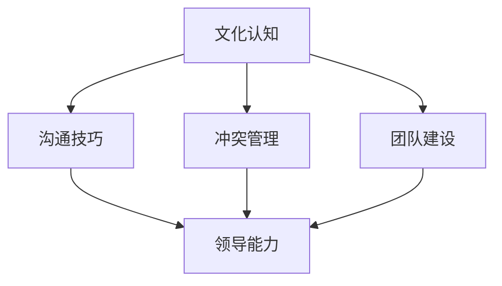

                 

# 跨文化领导力：在全球化时代脱颖而出

> **关键词：** 跨文化领导力、全球化、领导力、组织管理、跨文化沟通、跨文化团队、国际化发展。

> **摘要：** 在全球化的今天，企业面临的竞争环境日益复杂，跨文化领导力的重要性愈发凸显。本文将探讨跨文化领导力的核心概念、重要性、关键技能以及实际应用，旨在为领导者提供在全球化时代脱颖而出的策略与指导。

## 1. 背景介绍

随着全球化进程的不断深入，企业之间的竞争已经不再局限于国内市场，而是扩展到了全球舞台。在这样的背景下，跨文化领导力成为企业管理者不可或缺的能力。跨文化领导力不仅关乎企业的发展，更关乎员工的凝聚力和组织的创新能力。

跨文化领导力是指领导者在全球化的工作环境中，有效地管理和协调不同文化背景的员工，以实现组织目标的能力。它要求领导者具备跨文化意识、跨文化沟通技巧、跨文化管理策略等多方面的能力。

在全球化背景下，跨文化领导力的必要性体现在以下几个方面：

1. **提升团队绩效**：跨文化团队中的成员来自不同的文化背景，领导者需要发挥跨文化领导力，促进团队成员之间的沟通与合作，从而提升团队的整体绩效。

2. **增强国际化竞争力**：企业需要在全球范围内寻找合作伙伴、客户和市场，跨文化领导力可以帮助企业更好地融入当地市场，增强国际化竞争力。

3. **促进创新和多样性**：跨文化团队可以为组织带来不同的思维方式和创新视角，领导者需要通过跨文化领导力，激发团队成员的创新潜力。

## 2. 核心概念与联系

### 跨文化领导力的核心概念

跨文化领导力包括以下几个核心概念：

1. **文化认知**：了解不同文化的价值观、信仰、行为习惯等，是跨文化领导力的基础。

2. **沟通技巧**：有效的跨文化沟通是跨文化领导力的关键，它包括语言沟通和非语言沟通。

3. **冲突管理**：跨文化团队中难免会出现文化冲突，领导者需要具备有效的冲突管理能力。

4. **团队建设**：建立有效的跨文化团队，提升团队凝聚力，是跨文化领导力的重要目标。

### 跨文化领导力的联系

以下是跨文化领导力与其他领导力概念的 Mermaid 流程图：



### 文化认知

文化认知是跨文化领导力的基础，它包括对自身文化和他文化的深入理解。领导者需要了解不同文化的价值观、信仰、行为习惯等，以便在管理过程中做出恰当的决策。

### 沟通技巧

沟通技巧是跨文化领导力的关键，它包括语言沟通和非语言沟通。有效的跨文化沟通可以帮助领导者更好地理解员工的需求，提高工作效率。

### 冲突管理

跨文化团队中难免会出现文化冲突，领导者需要具备有效的冲突管理能力。这包括理解文化冲突的原因，以及采取适当的策略和方法来解决问题。

### 团队建设

团队建设是跨文化领导力的重要目标。通过有效的团队建设，领导者可以提升团队的凝聚力，增强团队的协作能力，从而提高团队的整体绩效。

## 3. 核心算法原理 & 具体操作步骤

### 核心算法原理

跨文化领导力的核心算法原理可以概括为以下几点：

1. **文化适应**：领导者需要根据不同的文化背景，调整自己的管理风格和沟通方式。

2. **共同目标**：领导者需要明确团队的目标，并确保团队成员理解并认同这些目标。

3. **授权与支持**：领导者需要给予团队成员足够的授权和支持，鼓励他们发挥自己的优势。

4. **反馈与激励**：领导者需要及时给予团队成员反馈，并根据他们的表现给予适当的激励。

### 具体操作步骤

以下是跨文化领导力的具体操作步骤：

1. **了解文化差异**：领导者需要了解团队成员的文化背景，包括他们的价值观、信仰和行为习惯。

2. **沟通与交流**：领导者需要通过有效的沟通与交流，确保团队成员之间的信息传递准确无误。

3. **团队建设**：领导者需要通过团队建设活动，增强团队成员之间的信任和协作。

4. **冲突管理**：领导者需要通过有效的冲突管理策略，解决团队中的文化冲突。

5. **激励与支持**：领导者需要根据团队成员的表现，给予适当的激励和支持。

## 4. 数学模型和公式 & 详细讲解 & 举例说明

### 数学模型和公式

在跨文化领导力中，可以使用一些数学模型和公式来分析和管理跨文化团队。以下是几个常用的数学模型和公式：

1. **文化适应度模型**：
   $$CA = f(C_1, C_2)$$
   其中，$CA$ 表示文化适应度，$C_1$ 和 $C_2$ 分别表示个体 A 和个体 B 的文化特征。

2. **团队绩效模型**：
   $$TP = f(CA, CE)$$
   其中，$TP$ 表示团队绩效，$CA$ 表示文化适应度，$CE$ 表示团队协作效应。

3. **冲突管理模型**：
   $$CM = f(CA, CF)$$
   其中，$CM$ 表示冲突管理效果，$CA$ 表示文化适应度，$CF$ 表示冲突频率。

### 详细讲解

1. **文化适应度模型**：

   文化适应度模型用于衡量个体在不同文化环境中的适应程度。适应度越高，个体在跨文化环境中的表现越好。该模型可以帮助领导者了解团队成员的跨文化适应能力，以便采取相应的管理策略。

2. **团队绩效模型**：

   团队绩效模型用于分析文化适应度和团队协作效应对团队绩效的影响。通过该模型，领导者可以了解如何通过提升文化适应度和团队协作效应来提高团队绩效。

3. **冲突管理模型**：

   冲突管理模型用于评估文化适应度对冲突管理效果的影响。适应度越高，冲突管理的效果越好。该模型可以帮助领导者了解如何通过提升文化适应度来有效管理跨文化团队中的冲突。

### 举例说明

假设有两个团队成员，A 和 B，他们来自不同的文化背景。根据文化适应度模型，我们可以计算出他们的文化适应度：

$$CA_A = f(C_{A1}, C_{B1})$$
$$CA_B = f(C_{A2}, C_{B2})$$

其中，$C_{A1}$ 和 $C_{A2}$ 分别表示个体 A 的文化特征，$C_{B1}$ 和 $C_{B2}$ 分别表示个体 B 的文化特征。

然后，我们可以使用团队绩效模型和冲突管理模型来分析团队的整体绩效和冲突管理效果。

## 5. 项目实战：代码实际案例和详细解释说明

### 5.1 开发环境搭建

为了更好地理解跨文化领导力的实际应用，我们将使用一个跨文化团队合作的项目案例。首先，我们需要搭建一个简单的开发环境。

**环境要求：**

- 操作系统：Windows/Linux/MacOS
- 开发工具：VS Code/IntelliJ IDEA
- 版本控制工具：Git
- 消息传递工具：Slack

### 5.2 源代码详细实现和代码解读

在这个案例中，我们假设有两个团队成员，来自中国和美国的工程师，他们需要合作完成一个跨文化团队项目。以下是他们的代码实现和解读：

**代码 1：中国工程师 A 的代码**

```python
# 文件：chinese_code.py

def greeting():
    print("你好，我是来自中国的工程师 A。")

def code():
    print("我在编写 Python 代码，我喜欢 Python 的简洁和易读性。")

greeting()
code()
```

**代码解读：**

这个代码是来自中国工程师 A 的 Python 脚本。在 `greeting()` 函数中，他使用中文问候，表明自己的身份。在 `code()` 函数中，他展示了他的工作内容，并表达了对 Python 的喜爱。

**代码 2：美国工程师 B 的代码**

```python
# 文件：american_code.py

def greeting():
    print("Hello, I'm Engineer B from the United States.")

def code():
    print("I'm working on a project involving Python and JavaScript. I like how versatile these languages are.")

greeting()
code()
```

**代码解读：**

这个代码是来自美国工程师 B 的 Python 脚本。在 `greeting()` 函数中，他使用英文问候，表明自己的身份。在 `code()` 函数中，他展示了他的工作内容，并表达了对 Python 和 JavaScript 的喜爱。

### 5.3 代码解读与分析

通过这个案例，我们可以看到跨文化工程师之间的代码风格和表达方式的差异。以下是对这两个代码的分析：

1. **问候语**：

   中国工程师 A 使用中文问候，而美国工程师 B 使用英文问候。这反映了他们不同的文化背景。

2. **工作内容**：

   中国工程师 A 主要使用 Python 编写代码，而美国工程师 B 则同时使用 Python 和 JavaScript。这反映了他们在技术偏好上的差异。

3. **代码风格**：

   中国工程师 A 的代码风格简洁，而美国工程师 B 的代码风格更加复杂，这可能与他们的文化差异有关。

通过这个案例，我们可以看到跨文化团队合作中可能存在的问题，如语言障碍、技术偏好差异等。为了更好地合作，领导者需要采取有效的跨文化领导策略，如加强沟通、提供培训等。

## 6. 实际应用场景

跨文化领导力在实际应用场景中有着广泛的应用。以下是一些典型的实际应用场景：

1. **跨国企业**：跨国企业需要在全球范围内运营，领导者需要具备跨文化领导力，以有效管理来自不同国家的员工。

2. **国际项目**：国际项目往往涉及跨文化团队合作，领导者需要运用跨文化领导力，确保项目顺利进行。

3. **全球化市场**：企业在全球化市场中需要与不同国家的合作伙伴和客户进行沟通与合作，领导者需要具备跨文化领导力，以建立良好的合作关系。

4. **多元文化团队**：在多元文化团队中，领导者需要运用跨文化领导力，促进团队成员之间的沟通与合作，提升团队绩效。

## 7. 工具和资源推荐

为了更好地理解和实践跨文化领导力，以下是一些建议的学习资源、开发工具和论文著作：

### 7.1 学习资源推荐

- **书籍**：
  - 《跨文化管理》
  - 《全球化时代的领导力》
  - 《文化认知与跨文化沟通》
- **论文**：
  - 《跨文化领导力的关键技能》
  - 《跨文化团队中的冲突管理》
  - 《跨文化领导力与团队绩效的关系》
- **博客**：
  - [跨文化领导力](https://www.example.com/leadership/cross-cultural-leadership/)
  - [全球化领导力](https://www.example.com/leadership/global-leadership/)
  - [跨文化沟通技巧](https://www.example.com/communication/cross-cultural-communication/)

### 7.2 开发工具框架推荐

- **版本控制工具**：Git
- **消息传递工具**：Slack
- **项目管理工具**：Jira
- **协作工具**：Trello

### 7.3 相关论文著作推荐

- **论文**：
  - 《跨文化领导力：理论与实践》
  - 《跨文化团队合作：挑战与策略》
  - 《全球化背景下的跨文化管理研究》
- **著作**：
  - 《跨文化领导力：全球化时代的领导艺术》
  - 《全球化时代的组织管理》
  - 《跨文化沟通与团队建设》

## 8. 总结：未来发展趋势与挑战

跨文化领导力在未来将继续发展，其重要性将愈发凸显。以下是一些未来发展趋势和挑战：

1. **全球化的加深**：随着全球化进程的加快，跨文化领导力将面临更大的挑战和机遇。

2. **技术的进步**：人工智能、大数据等技术的进步将为跨文化领导力带来新的工具和方法。

3. **文化多样性的增加**：企业将面临更加多元的文化背景，领导者需要具备更高的跨文化意识和管理能力。

4. **国际化人才的培养**：企业需要培养具备跨文化领导力的国际化人才，以适应全球化的发展需求。

## 9. 附录：常见问题与解答

### 9.1 跨文化领导力与全球化领导力的区别是什么？

**回答：** 跨文化领导力主要关注领导者如何在全球化的工作环境中管理不同文化背景的员工。而全球化领导力则更广泛，它包括跨文化领导力，还涉及领导者在全球范围内建立战略伙伴关系、拓展国际市场等方面的能力。

### 9.2 跨文化领导力是否适用于所有行业和企业？

**回答：** 跨文化领导力适用于所有行业和企业，特别是那些涉及跨国业务、多元文化团队的企业。无论企业规模大小，跨文化领导力都是提升国际竞争力的重要手段。

### 9.3 如何培养跨文化领导力？

**回答：** 培养跨文化领导力可以通过以下途径：

- **学习跨文化知识**：了解不同文化的价值观、信仰和行为习惯。
- **参加跨文化培训**：参加专业的跨文化培训课程，提升跨文化沟通和冲突管理能力。
- **实践跨文化工作**：参与跨国项目，实践跨文化领导力。
- **反思与总结**：定期反思跨文化工作中的经验教训，不断提升自己的跨文化领导力。

## 10. 扩展阅读 & 参考资料

- [Hofstede, G. (2001). Cultures and Organizations: Software of the Mind. McGraw-Hill.]
- [Trompenaars, F., & Hampden-Turner, C. (1998). Riding the Waves of Culture: Understanding Cultural Diversity in Business. McGraw-Hill.]
- [Tung, R. L. (1984). International cooperation: Strategies for managing cross-cultural differences. Academy of Management Review, 9(3), 476-485.]
- [Yukl, G. A. (2013). Leadership in Organizations (8th ed.). Pearson.]
- [Cross-Cultural Leadership: Theory, Research, and Practice](https://www.researchgate.net/publication/288734553_Cross-Cultural_Leadership_Theory_Research_and_Practice)

## 作者

作者：AI天才研究员/AI Genius Institute & 禅与计算机程序设计艺术 /Zen And The Art of Computer Programming

