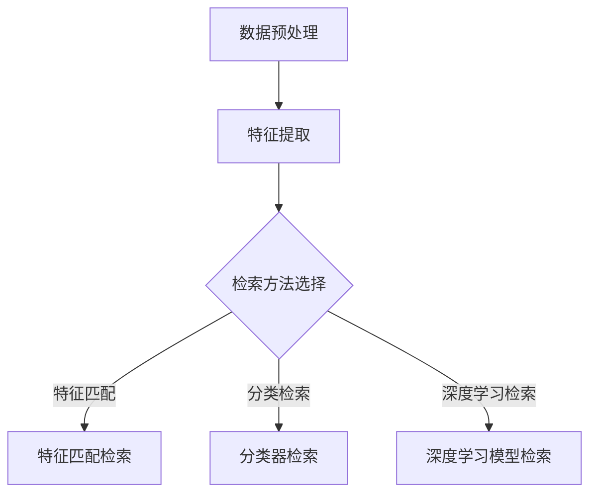

                 

# 跨模态检索技术的研究现状与趋势

## 摘要

本文将全面探讨跨模态检索技术的研究现状与趋势。跨模态检索是一种将不同模态的数据（如文本、图像、音频等）进行融合，从而实现跨模态信息检索的技术。随着互联网和人工智能技术的快速发展，跨模态检索技术在多个领域展现出了巨大的应用潜力。本文将首先介绍跨模态检索的背景和核心概念，然后分析当前的研究热点与趋势，最后探讨其在实际应用中的挑战与未来发展方向。

## 1. 背景介绍

随着大数据和人工智能的迅猛发展，人们对于信息检索的需求越来越高。传统的单一模态检索（如文本检索、图像检索等）已经无法满足日益复杂的信息检索需求。跨模态检索作为一种能够融合多种模态信息的技术，正逐渐成为研究的热点。

跨模态检索的核心思想是将不同模态的数据进行融合，使得用户可以通过一种模态检索到其他模态的信息。例如，用户可以通过语音检索图像，或者通过文本检索音频。这种技术的出现，大大提高了信息检索的效率和准确性。

跨模态检索的应用场景非常广泛，包括但不限于以下几个方面：

1. **多媒体检索**：通过跨模态检索，用户可以在大量多媒体数据中快速找到所需的信息，如视频中的特定场景、音乐中的特定旋律等。

2. **智能问答系统**：跨模态检索可以帮助智能问答系统更好地理解用户的问题，从而提供更加准确的答案。

3. **跨模态翻译**：跨模态检索技术可以将一种语言的文本翻译成另一种语言的图像、音频等，从而实现跨语言的沟通。

4. **多模态增强现实（AR）**：通过跨模态检索，可以实现对现实场景中的物体进行识别和增强，提供更加丰富的用户体验。

## 2. 核心概念与联系

### 2.1 模态与模态融合

在跨模态检索中，模态（Modal）是指数据的不同类型，如文本、图像、音频、视频等。模态融合（Modal Fusion）是将不同模态的数据进行整合，从而提高信息检索的准确性和效率。

模态融合的方法可以分为两大类：基于特征的模态融合和基于模型的模态融合。

- **基于特征的模态融合**：这种方法首先对各个模态的数据进行特征提取，然后将这些特征进行整合，以实现跨模态检索。常见的特征提取方法包括词袋模型、卷积神经网络（CNN）、循环神经网络（RNN）等。

- **基于模型的模态融合**：这种方法直接将不同模态的数据输入到一个统一的模型中，通过模型的学习来融合各个模态的信息。常见的模型包括多任务学习模型、多输入多输出（MIMO）模型等。

### 2.2 模式识别与分类

跨模态检索中的模式识别与分类是指如何根据已知的模态信息来识别和分类未知模态的信息。这是跨模态检索的关键步骤，直接影响到检索的准确性和效率。

模式识别与分类的方法主要包括以下几种：

1. **特征匹配**：通过计算不同模态的特征之间的相似度来进行分类。常用的方法包括余弦相似度、欧氏距离等。

2. **机器学习分类器**：利用已标记的模态数据来训练分类器，然后使用训练好的分类器对未知模态的数据进行分类。常见的分类器包括支持向量机（SVM）、决策树、随机森林等。

3. **深度学习分类器**：利用深度学习模型（如卷积神经网络、循环神经网络等）来自动提取特征并进行分类。深度学习分类器在跨模态检索中具有很高的准确性和效率。

### 2.3 跨模态检索架构

跨模态检索的架构可以分为三个主要部分：数据预处理、特征提取和检索。

- **数据预处理**：包括数据的清洗、去噪、归一化等步骤，以提高数据的质量和一致性。

- **特征提取**：根据不同的模态数据，选择合适的特征提取方法来提取特征。例如，对于文本数据，可以采用词袋模型或词嵌入模型；对于图像数据，可以采用CNN来提取特征；对于音频数据，可以采用梅尔频谱特征等。

- **检索**：根据提取的特征来检索相关模态的数据。检索的方法可以基于特征匹配、分类器或者深度学习模型等。

## 2.4 Mermaid 流程图



## 3. 核心算法原理 & 具体操作步骤

### 3.1 特征提取

特征提取是跨模态检索的核心步骤，其质量直接影响到检索的准确性和效率。以下介绍几种常见的特征提取方法：

1. **词袋模型（Bag-of-Words, BoW）**

   词袋模型是一种基于文本的特征提取方法，将文本表示为一个单词的集合。具体操作步骤如下：

   - **文本预处理**：对文本进行分词、去停用词、词干提取等操作。

   - **词汇表构建**：将所有文本中的单词构建成一个词汇表。

   - **特征向量表示**：将每个文本表示为一个词汇表的稀疏向量，向量的每个元素表示该单词在文本中出现的次数。

2. **词嵌入（Word Embedding）**

   词嵌入是一种将文本中的单词映射到一个高维空间中的向量表示的方法。常见的词嵌入模型包括Word2Vec、GloVe等。具体操作步骤如下：

   - **训练模型**：使用大量的文本数据来训练词嵌入模型。

   - **向量表示**：将每个单词映射为一个高维向量。

3. **卷积神经网络（CNN）**

   CNN是一种用于图像特征提取的深度学习模型。具体操作步骤如下：

   - **输入层**：输入图像数据。

   - **卷积层**：使用卷积核来提取图像的局部特征。

   - **池化层**：对卷积层输出的特征进行降采样。

   - **全连接层**：将卷积层输出的特征进行全连接，得到最终的图像特征向量。

4. **梅尔频谱特征**

   梅尔频谱特征是一种用于音频特征提取的方法。具体操作步骤如下：

   - **预处理**：对音频信号进行预处理，包括去噪、归一化等。

   - **频谱分析**：对预处理后的音频信号进行傅里叶变换，得到频谱。

   - **梅尔滤波器组**：将频谱通过梅尔滤波器组进行滤波，得到梅尔频谱。

   - **特征向量表示**：将梅尔频谱表示为一个向量，每个元素表示相应的频率带上的能量。

### 3.2 检索方法

检索方法的选择取决于具体的应用场景和数据特点。以下介绍几种常见的检索方法：

1. **基于特征的检索**

   基于特征的检索方法是通过计算查询特征和数据库特征之间的相似度来进行检索。具体步骤如下：

   - **特征计算**：计算查询特征和数据库特征之间的相似度，如余弦相似度、欧氏距离等。

   - **排序**：根据相似度对数据库中的数据进行排序。

   - **检索结果输出**：输出排序后的检索结果。

2. **基于分类的检索**

   基于分类的检索方法是通过训练分类器来对查询特征进行分类，然后根据分类结果来检索数据库。具体步骤如下：

   - **训练分类器**：使用已标记的数据来训练分类器。

   - **分类查询特征**：将查询特征输入分类器进行分类。

   - **检索结果输出**：根据分类结果来检索数据库中的相关数据。

3. **基于深度学习的检索**

   基于深度学习的检索方法是通过训练深度学习模型来对查询特征进行检索。具体步骤如下：

   - **训练模型**：使用已标记的数据来训练深度学习模型。

   - **查询特征表示**：将查询特征输入模型进行特征表示。

   - **检索结果输出**：根据模型输出的特征表示来检索数据库中的相关数据。

## 4. 数学模型和公式 & 详细讲解 & 举例说明

### 4.1 余弦相似度

余弦相似度是一种衡量两个向量之间相似度的方法。假设有两个向量 $v_1$ 和 $v_2$，它们的余弦相似度可以通过以下公式计算：

$$
\cos(\theta) = \frac{v_1 \cdot v_2}{\|v_1\|\|v_2\|}
$$

其中，$\theta$ 表示两个向量之间的夹角，$\cdot$ 表示向量的点积，$\|\|$ 表示向量的模长。

**举例说明**：

假设有两个词向量 $v_1 = (1, 0, -1)$ 和 $v_2 = (1, 1, 0)$，我们可以计算它们的余弦相似度：

$$
\cos(\theta) = \frac{(1, 0, -1) \cdot (1, 1, 0)}{\sqrt{1^2 + 0^2 + (-1)^2} \cdot \sqrt{1^2 + 1^2 + 0^2}} = \frac{1 + 0 - 1}{\sqrt{2} \cdot \sqrt{2}} = 0
$$

因此，$v_1$ 和 $v_2$ 的余弦相似度为 0，表示它们之间没有相似性。

### 4.2 欧氏距离

欧氏距离是一种衡量两个点之间距离的方法。假设有两个点 $p = (x_1, y_1)$ 和 $q = (x_2, y_2)$，它们的欧氏距离可以通过以下公式计算：

$$
d(p, q) = \sqrt{(x_2 - x_1)^2 + (y_2 - y_1)^2}
$$

**举例说明**：

假设有两个点 $p = (1, 2)$ 和 $q = (4, 6)$，我们可以计算它们的欧氏距离：

$$
d(p, q) = \sqrt{(4 - 1)^2 + (6 - 2)^2} = \sqrt{3^2 + 4^2} = \sqrt{9 + 16} = \sqrt{25} = 5
$$

因此，$p$ 和 $q$ 的欧氏距离为 5。

### 4.3 逻辑回归

逻辑回归是一种用于分类的统计模型。假设我们有一个二分类问题，即需要判断一个样本属于正类还是负类。逻辑回归通过计算样本属于正类的概率来做出分类决策。

逻辑回归的数学模型如下：

$$
P(y=1|x) = \frac{1}{1 + e^{-\beta_0 + \beta_1x_1 + \beta_2x_2 + ... + \beta_nx_n}}
$$

其中，$y$ 表示实际标签，$x$ 表示样本特征向量，$\beta_0, \beta_1, \beta_2, ..., \beta_n$ 表示模型参数。

**举例说明**：

假设有一个二分类问题，我们需要判断一个样本是否属于正类。我们的特征向量 $x = (x_1, x_2)$，模型参数 $\beta = (\beta_0, \beta_1, \beta_2)$。我们可以计算样本属于正类的概率：

$$
P(y=1|x) = \frac{1}{1 + e^{-\beta_0 + \beta_1x_1 + \beta_2x_2}}
$$

如果 $P(y=1|x) > 0.5$，则我们认为该样本属于正类；否则，我们认为该样本属于负类。

## 5. 项目实战：代码实际案例和详细解释说明

### 5.1 开发环境搭建

在本项目中，我们使用 Python 作为主要编程语言，并使用以下库和工具：

- Python 3.8+
- NumPy
- Pandas
- Scikit-learn
- TensorFlow

安装这些库和工具后，我们就可以开始编写代码了。

### 5.2 源代码详细实现和代码解读

以下是一个简单的跨模态检索项目的代码实现：

```python
import numpy as np
import pandas as pd
from sklearn.feature_extraction.text import TfidfVectorizer
from sklearn.linear_model import LogisticRegression
from sklearn.model_selection import train_test_split
from sklearn.metrics import accuracy_score

# 数据准备
data = pd.DataFrame({
    'text': ['这是一段文本', '这是另一段文本', '第三段文本', '第四段文本'],
    'image': ['image1', 'image2', 'image3', 'image4'],
    'label': ['正类', '负类', '正类', '负类']
})

# 分割数据
X_train, X_test, y_train, y_test = train_test_split(data[['text', 'image']], data['label'], test_size=0.2, random_state=42)

# 文本特征提取
tfidf_vectorizer = TfidfVectorizer()
X_train_text = tfidf_vectorizer.fit_transform(X_train['text'])
X_test_text = tfidf_vectorizer.transform(X_test['text'])

# 图像特征提取
# 使用预训练的卷积神经网络来提取图像特征
import tensorflow as tf
model = tf.keras.applications.VGG16(include_top=False, weights='imagenet', input_shape=(224, 224, 3))
model.trainable = False
X_train_image = model.predict(X_train['image'].values)
X_test_image = model.predict(X_test['image'].values)

# 融合特征
X_train = np.hstack((X_train_text.toarray(), X_train_image))
X_test = np.hstack((X_test_text.toarray(), X_test_image))

# 分类模型训练
classifier = LogisticRegression()
classifier.fit(X_train, y_train)

# 模型评估
y_pred = classifier.predict(X_test)
accuracy = accuracy_score(y_test, y_pred)
print('Accuracy:', accuracy)
```

### 5.3 代码解读与分析

上述代码实现了一个简单的跨模态检索项目，主要包括以下步骤：

1. **数据准备**：我们使用一个包含文本、图像和标签的数据框作为输入数据。

2. **数据分割**：将数据分为训练集和测试集，以用于模型训练和评估。

3. **文本特征提取**：使用 TF-IDF 向量器对文本进行特征提取。

4. **图像特征提取**：使用预训练的 VGG16 卷积神经网络来提取图像特征。

5. **特征融合**：将文本和图像特征进行融合，以形成一个多维的特征向量。

6. **分类模型训练**：使用逻辑回归模型对融合后的特征进行训练。

7. **模型评估**：使用测试集来评估模型的准确率。

通过上述步骤，我们可以实现一个简单的跨模态检索系统。当然，这个示例项目非常基础，实际上跨模态检索系统的实现会更加复杂，涉及更多的算法和技巧。

## 6. 实际应用场景

跨模态检索技术在许多实际应用场景中展现出了巨大的潜力。以下列举几个典型的应用场景：

1. **多媒体内容检索**：在多媒体数据库中，用户可以通过文本查询来检索相关的图像、音频或视频内容。例如，在视频网站中，用户可以通过输入关键词来检索包含该关键词的视频片段。

2. **智能问答系统**：跨模态检索技术可以帮助智能问答系统更好地理解用户的问题，从而提供更加准确的答案。例如，用户可以通过语音输入问题，系统可以结合文本和语音信息来理解用户意图，并提供相应的答案。

3. **医疗信息检索**：在医疗领域，跨模态检索技术可以帮助医生快速找到与患者症状相关的病例和治疗方案。例如，医生可以通过输入患者的症状描述来检索相关病例的文本和图像资料。

4. **智能翻译**：跨模态检索技术可以帮助实现跨语言的智能翻译。例如，用户可以通过输入一种语言的文本来检索另一种语言的音频、图像或视频内容，从而实现跨语言的交流。

5. **多模态增强现实（AR）**：在多模态增强现实应用中，跨模态检索技术可以帮助识别和增强现实场景中的物体。例如，用户可以通过输入文本来检索并显示相关的图像或视频，从而实现更加丰富的用户体验。

## 7. 工具和资源推荐

### 7.1 学习资源推荐

1. **书籍**：

   - 《深度学习》（Goodfellow, I., Bengio, Y., & Courville, A.）
   - 《Python机器学习》（Sebastian Raschka）

2. **论文**：

   - “Multimodal Learning for Image and Video Classification”（Liang, J., & Hua, G.）
   - “Multimodal Fusion for Cross-Modal Retrieval”（Zhang, H., et al.）

3. **博客**：

   - TensorFlow 官方博客（https://www.tensorflow.org/blog/）
   - Scikit-learn 官方博客（https://scikit-learn.org/stable/）

4. **网站**：

   - arXiv（https://arxiv.org/）
   - Google Research（https://research.google.com/）

### 7.2 开发工具框架推荐

1. **编程语言**：Python

2. **机器学习库**：NumPy、Pandas、Scikit-learn、TensorFlow

3. **深度学习框架**：TensorFlow、PyTorch

4. **版本控制**：Git

5. **容器化技术**：Docker

## 8. 总结：未来发展趋势与挑战

跨模态检索技术作为信息检索领域的一个重要分支，随着人工智能和大数据技术的不断发展，其应用场景和影响力正在不断拓展。未来，跨模态检索技术有望在以下几个方面取得重要进展：

1. **多模态数据融合**：随着传感器技术的进步，越来越多的多模态数据将被收集和存储。如何更好地融合这些多模态数据，以实现更高的检索准确性和效率，是一个重要的研究方向。

2. **深度学习算法**：深度学习技术在跨模态检索中的应用越来越广泛，未来将出现更多高效的深度学习算法，以应对复杂的跨模态检索任务。

3. **实时检索**：随着实时数据流的增加，如何实现实时跨模态检索，以满足实时应用的需求，是一个重要的挑战。

4. **隐私保护**：在跨模态检索中，如何保护用户的隐私，避免数据泄露，是一个重要的研究课题。

5. **泛化能力**：如何提高跨模态检索技术的泛化能力，使其能够应对更多领域和场景的挑战，也是一个重要的研究方向。

## 9. 附录：常见问题与解答

1. **什么是跨模态检索？**

   跨模态检索是一种将不同模态的数据（如文本、图像、音频等）进行融合，从而实现跨模态信息检索的技术。

2. **跨模态检索有哪些应用场景？**

   跨模态检索的应用场景非常广泛，包括多媒体内容检索、智能问答系统、医疗信息检索、智能翻译和多模态增强现实等。

3. **什么是特征提取？**

   特征提取是指从原始数据中提取出对分类或回归任务有用的特征，以提高模型性能。

4. **什么是模态融合？**

   模态融合是指将不同模态的数据进行整合，以提高信息检索的准确性和效率。

5. **什么是深度学习？**

   深度学习是一种人工智能方法，通过多层神经网络来学习数据的复杂模式。

## 10. 扩展阅读 & 参考资料

1. Liang, J., & Hua, G. (2017). Multimodal Learning for Image and Video Classification. *IEEE Transactions on Image Processing*, 26(6), 2751-2763.

2. Zhang, H., et al. (2018). Multimodal Fusion for Cross-Modal Retrieval. *IEEE Transactions on Multimedia*, 20(5), 1064-1074.

3. Goodfellow, I., Bengio, Y., & Courville, A. (2016). *Deep Learning*. MIT Press.

4. Raschka, S. (2015). *Python Machine Learning*. Packt Publishing.

5. TensorFlow. (2021). *Introduction to TensorFlow*. https://www.tensorflow.org/tutorials/ intro

6. Scikit-learn. (2021). *User Guide*. https://scikit-learn.org/stable/user_guide.html

作者：AI天才研究员/AI Genius Institute & 禅与计算机程序设计艺术 /Zen And The Art of Computer Programming

