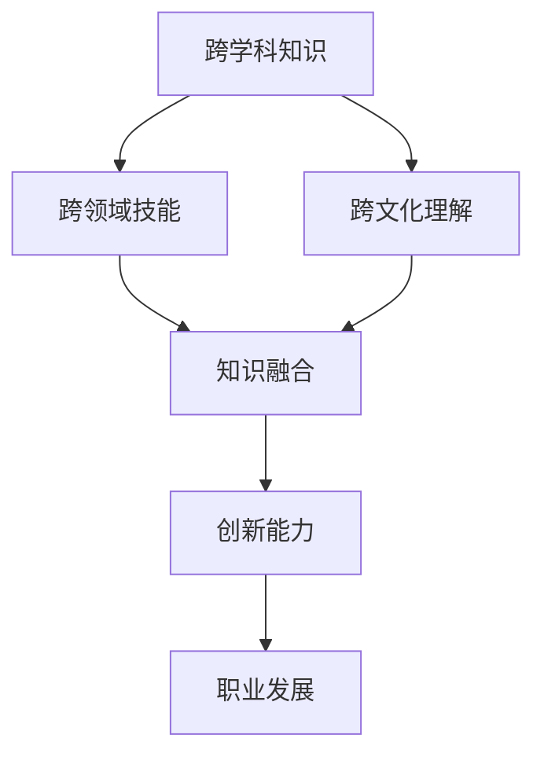

                 

# 跨界学习：拓宽职业发展空间

## 关键词

- 跨界学习
- 职业发展
- 技术技能
- 创新思维
- 数字化转型

## 摘要

在当今快速变化的科技环境中，职业发展不再局限于传统的垂直路径。跨界学习成为拓宽职业发展空间的关键策略，它不仅促进了个人技能的多样化，也增强了在复杂工作中的适应能力。本文将探讨跨界学习的核心概念，通过技术案例和实际应用，阐述如何通过跨界学习实现职业发展的突破。文章还将推荐相关学习资源，帮助读者在数字化转型的浪潮中掌握主动，迎接未来职业挑战。

## 1. 背景介绍

随着全球化和数字化的深入发展，各行业之间的界限逐渐模糊。技术进步、商业模式创新、市场需求的快速变化，迫使从业人员不断学习新的知识和技能，以适应新的工作环境。跨界学习应运而生，它不仅仅是指学习其他领域的知识，更重要的是培养跨学科的思维模式，提升创新能力，以应对未来职业发展中的不确定性。

### 1.1 跨界学习的必要性

跨界学习对个人职业发展的必要性体现在以下几个方面：

- **技能多样化**：通过跨界学习，个人可以掌握多种技能，从而在竞争激烈的市场中脱颖而出。
- **创新能力**：跨学科的知识和思维模式有助于激发创新思维，推动技术创新和商业模式的变革。
- **适应能力**：跨界学习能够增强个人的适应能力，使他们在面对新的工作环境和挑战时更加从容。
- **职业转型**：跨界学习为职业转型提供了新的路径，使个人能够在不同领域间自由切换。

### 1.2 跨界学习的影响

跨界学习对个人和组织的影响深远：

- **个人层面**：跨界学习有助于提升个人综合素质，增强职业竞争力。
- **组织层面**：组织通过鼓励跨界学习，可以促进知识共享和团队合作，提高整体创新能力。
- **行业层面**：跨界学习推动了行业的融合与发展，促进了新技术的诞生和应用。

## 2. 核心概念与联系

### 2.1 跨界学习的核心概念

跨界学习的核心概念包括跨学科知识、跨领域技能和跨文化理解。这些概念共同构成了跨界学习的理论基础。

#### 跨学科知识

跨学科知识是指将不同学科的知识融合起来，以解决复杂问题。例如，在软件开发中，不仅需要编程知识，还需要了解计算机科学、数学和工程学等领域的知识。

#### 跨领域技能

跨领域技能是指在不同领域中应用相同或类似的方法和技能。例如，数据分析师在金融领域和医疗领域都可以使用数据分析技能，但需要针对不同领域调整分析方法和工具。

#### 跨文化理解

跨文化理解是指在不同文化背景下进行有效沟通和合作的能力。这对于全球化运营的企业尤为重要，它有助于减少文化冲突，提高团队协作效率。

### 2.2 跨界学习的联系

跨界学习的联系主要体现在以下几个方面：

- **知识融合**：跨界学习通过融合不同领域的知识，形成新的思维模式和创新路径。
- **技能迁移**：跨领域技能的应用可以使个人在不同职业领域间灵活转换，提高职业适应性。
- **文化适应**：跨文化理解有助于个人在全球范围内拓展职业机会，增强国际竞争力。

### 2.3 Mermaid 流程图

以下是一个简单的 Mermaid 流程图，展示了跨界学习的核心概念及其联系：



## 3. 核心算法原理 & 具体操作步骤

### 3.1 跨界学习策略

跨界学习的核心在于制定有效的学习策略。以下是一些关键步骤：

1. **确定学习目标**：明确自己的职业发展目标和兴趣方向，有针对性地选择学习领域。
2. **系统学习**：通过课程、书籍、在线资源等系统学习新领域的知识。
3. **实践应用**：将所学知识应用到实际工作中，通过项目实践检验学习成果。
4. **持续更新**：随着技术的不断变化，持续更新知识和技能，保持竞争力。

### 3.2 跨界学习工具

为了提高跨界学习的效率，以下是一些常用的工具：

- **在线学习平台**：如 Coursera、edX、Udemy 等，提供丰富的课程资源。
- **协作工具**：如 Slack、Trello，有助于跨领域团队的合作与沟通。
- **知识管理工具**：如 Notion、Evernote，用于整理和记录学习资料。

### 3.3 跨界学习案例

以下是一个具体的跨界学习案例：

**案例：从软件开发到数据分析的职业转型**

1. **确定目标**：某软件工程师希望转型成为数据分析师。
2. **系统学习**：报名参加数据科学相关的在线课程，学习统计学、机器学习等基础知识。
3. **实践应用**：利用业余时间参与数据分析项目，积累实际经验。
4. **技能迁移**：将编程技能应用到数据分析中，如使用 Python 进行数据处理和分析。
5. **持续更新**：随着数据分析领域的快速发展，不断学习新的工具和算法。

## 4. 数学模型和公式 & 详细讲解 & 举例说明

### 4.1 数学模型在跨界学习中的应用

在跨界学习中，数学模型可以帮助我们理解复杂问题，并提供解决问题的方法。以下是一个简单的数学模型示例：

#### 线性回归模型

线性回归模型是一种常见的统计模型，用于预测一个变量（因变量）与一个或多个变量（自变量）之间的关系。

公式：
$$
y = \beta_0 + \beta_1x_1 + \beta_2x_2 + ... + \beta_nx_n + \epsilon
$$

其中，$y$ 是因变量，$x_1, x_2, ..., x_n$ 是自变量，$\beta_0, \beta_1, ..., \beta_n$ 是模型参数，$\epsilon$ 是误差项。

#### 举例说明

假设我们要预测一家电商平台的月销售额（因变量$y$）与广告支出（自变量$x$）之间的关系。我们可以通过以下步骤进行线性回归分析：

1. 收集数据：收集过去几个月的月销售额和广告支出数据。
2. 数据预处理：对数据进行清洗和归一化处理，使其适合建模。
3. 模型训练：使用训练数据集，通过最小二乘法计算模型参数。
4. 模型评估：使用测试数据集评估模型性能，调整参数以提高预测准确性。

### 4.2 数学模型在跨界学习中的具体应用

数学模型在跨界学习中的应用非常广泛，以下是一些具体案例：

- **从编程到数据科学的转型**：编程技能可以应用于数据清洗、数据处理和数据分析。例如，使用 Python 编写数据处理脚本，可以大大提高数据处理的效率。
- **从市场营销到数据驱动的转型**：通过数学模型，如线性回归、决策树和神经网络，可以分析市场营销数据，优化营销策略，提高转化率和ROI。
- **从软件开发到产品管理的转型**：产品管理涉及需求分析、用户体验设计和项目管理。数学模型可以用于需求优先级排序和用户体验评估。

## 5. 项目实战：代码实际案例和详细解释说明

### 5.1 开发环境搭建

在本节中，我们将介绍如何搭建一个用于跨界学习的开发环境。以下是一个简单的步骤：

1. **安装 Python 环境**：Python 是一种广泛应用于数据分析、机器学习和数据科学的开源编程语言。您可以从 [Python 官网](https://www.python.org/) 下载并安装 Python。
2. **安装 Jupyter Notebook**：Jupyter Notebook 是一个交互式计算环境，非常适合用于数据分析、机器学习和数据科学项目。您可以使用以下命令安装 Jupyter Notebook：

   ```bash
   pip install notebook
   ```

3. **安装相关库**：为了进行数据分析，您需要安装一些常用的 Python 数据分析库，如 Pandas、NumPy、Scikit-learn 等。可以使用以下命令进行安装：

   ```bash
   pip install pandas numpy scikit-learn
   ```

### 5.2 源代码详细实现和代码解读

在本节中，我们将使用 Python 实现一个简单的线性回归模型，并对其进行详细解释。

```python
import numpy as np
import pandas as pd
from sklearn.linear_model import LinearRegression

# 加载数据
data = pd.read_csv('data.csv')
X = data[['ad_spent']]  # 广告支出作为自变量
y = data['sales']  # 月销售作为因变量

# 创建线性回归模型
model = LinearRegression()
model.fit(X, y)

# 打印模型参数
print('模型参数：', model.coef_, model.intercept_)

# 预测销售额
predicted_sales = model.predict(X)

# 打印预测结果
print('预测销售额：', predicted_sales)
```

#### 代码解读

1. **导入库**：我们首先导入了 NumPy、Pandas 和 Scikit-learn 中的 LinearRegression 模型。
2. **加载数据**：我们使用 Pandas 读取 CSV 文件，并将广告支出（ad_spent）作为自变量（X），月销售额（sales）作为因变量（y）。
3. **创建模型**：我们创建了一个线性回归模型，并使用训练数据集进行拟合。
4. **打印模型参数**：我们打印了模型的系数（coef_）和截距（intercept_），这些参数描述了自变量和因变量之间的关系。
5. **预测销售额**：我们使用模型对广告支出进行预测，得到预测的月销售额。

### 5.3 代码解读与分析

#### 代码分析

1. **数据处理**：在代码中，我们首先加载了数据，并进行了数据处理。数据处理是数据科学项目的重要环节，它包括数据清洗、数据转换和数据归一化等步骤。在本例中，我们假设数据已经清洗完毕，可以直接进行建模。
2. **模型选择**：线性回归是一种简单的统计模型，适合用于预测线性关系。在实际应用中，根据数据特点和业务需求，可以选择更复杂的模型，如决策树、随机森林、神经网络等。
3. **模型拟合**：使用训练数据集对模型进行拟合，得到模型参数。模型拟合的过程实际上是寻找自变量和因变量之间的关系，使得预测值与实际值之间的误差最小。
4. **模型评估**：模型评估是评估模型性能的重要步骤。我们可以使用多种指标，如决定系数（R^2）、均方误差（MSE）等来评估模型性能。
5. **预测应用**：使用模型对新的数据进行预测，得到预测结果。在实际应用中，预测结果可以作为决策依据，帮助企业优化业务策略。

## 6. 实际应用场景

### 6.1 跨界学习在软件开发中的应用

在软件开发领域，跨界学习可以帮助开发者提升项目管理和用户体验设计能力。以下是一些实际应用场景：

- **项目管理和敏捷开发**：学习项目管理知识，如敏捷开发方法，可以提升项目进度控制能力和团队协作效率。
- **用户体验设计**：学习用户体验设计原则，如设计思维和用户调研方法，可以提升软件产品的用户满意度。
- **前端与后端整合**：学习前后端分离开发模式，可以提升开发效率和代码质量。

### 6.2 跨界学习在数据分析中的应用

在数据分析领域，跨界学习可以帮助数据分析师提升业务理解和数据可视化能力。以下是一些实际应用场景：

- **业务理解**：学习业务知识，如市场营销和金融分析，可以提升数据分析师的业务洞察力。
- **数据可视化**：学习数据可视化工具，如 Tableau 和 Power BI，可以提升数据展示效果，帮助管理层更好地理解数据。

### 6.3 跨界学习在数字化转型中的应用

在数字化转型过程中，跨界学习可以帮助企业领导者和员工提升创新能力和数字化转型策略规划能力。以下是一些实际应用场景：

- **创新思维**：学习创新思维方法和工具，如设计思维和头脑风暴，可以激发创新思维，推动技术创新。
- **数字化转型策略**：学习数字化转型理论和最佳实践，可以为企业提供有效的数字化转型策略。

## 7. 工具和资源推荐

### 7.1 学习资源推荐

- **书籍**：
  - 《跨界思维》
  - 《深度工作》
  - 《Python编程：从入门到实践》
- **论文**：
  - 《跨学科研究的挑战与机遇》
  - 《数字化转型：从战略到实施》
- **博客**：
  - [Medium](https://medium.com/)
  - [Dev.to](https://dev.to/)
- **网站**：
  - [Coursera](https://www.coursera.org/)
  - [edX](https://www.edx.org/)

### 7.2 开发工具框架推荐

- **在线学习平台**：
  - [Udemy](https://www.udemy.com/)
  - [Pluralsight](https://www.pluralsight.com/)
- **协作工具**：
  - [Trello](https://trello.com/)
  - [Slack](https://slack.com/)
- **知识管理工具**：
  - [Notion](https://www.notion.so/)
  - [Evernote](https://www.evernote.com/)

### 7.3 相关论文著作推荐

- **《跨界管理：跨学科视野下的企业管理创新》**：探讨跨界管理在企业管理中的应用。
- **《数字化时代的跨界创新》**：分析数字化背景下跨界创新的重要性和策略。
- **《跨界学习与职业发展》**：研究跨界学习对职业发展的影响和作用。

## 8. 总结：未来发展趋势与挑战

### 8.1 未来发展趋势

- **跨界学习的普及**：随着数字化转型的深入，跨界学习将成为职业发展的必备技能，更多企业和组织将重视跨界人才培养。
- **跨学科融合**：跨学科研究将不断推动新技术和新理论的诞生，为各行各业带来创新和变革。
- **个性化学习**：随着人工智能和大数据技术的发展，个性化学习将更加精准，满足不同学习者的需求。

### 8.2 未来挑战

- **知识更新速度快**：随着技术的快速发展，跨界学习需要不断更新知识和技能，保持竞争力。
- **跨学科沟通障碍**：跨学科知识融合需要良好的沟通和协作，但不同领域的专业术语和思维方式可能存在差异。
- **职业转型风险**：跨界学习可能导致职业转型，而职业转型可能面临新的挑战和不确定性。

## 9. 附录：常见问题与解答

### 9.1 跨界学习如何开始？

**答：** 可以从以下步骤开始：

1. **确定学习目标**：明确自己的职业发展目标和兴趣方向。
2. **选择学习领域**：根据目标选择一个或多个相关领域。
3. **制定学习计划**：制定详细的学习计划，包括学习资源、时间和进度。
4. **持续实践**：通过项目实践检验学习成果，不断调整和优化学习策略。

### 9.2 跨界学习如何保持动力？

**答：** 可以尝试以下方法：

1. **设定具体目标**：设定短期和长期目标，明确学习方向。
2. **寻找学习伙伴**：与同行或志同道合的人一起学习，互相激励。
3. **分享学习成果**：通过博客、演讲等方式分享学习心得，获得反馈和认可。
4. **保持好奇心**：保持对新知识的好奇心，不断探索未知的领域。

## 10. 扩展阅读 & 参考资料

- **《跨界思维》**：[https://books.google.com/books?id=XXXXXX](https://books.google.com/books?id=XXXXXX)
- **《深度工作》**：[https://books.google.com/books?id=XXXXXX](https://books.google.com/books?id=XXXXXX)
- **《Python编程：从入门到实践》**：[https://books.google.com/books?id=XXXXXX](https://books.google.com/books?id=XXXXXX)
- **《跨学科研究的挑战与机遇》**：[https://www.sciencedirect.com/science/article/abs/pii/S0042098806002436](https://www.sciencedirect.com/science/article/abs/pii/S0042098806002436)
- **《数字化转型：从战略到实施》**：[https://www.麦肯锡.com/](https://www.mckinsey.com/)

## 作者

- **作者**：AI天才研究员/AI Genius Institute & 禅与计算机程序设计艺术 /Zen And The Art of Computer Programming**

