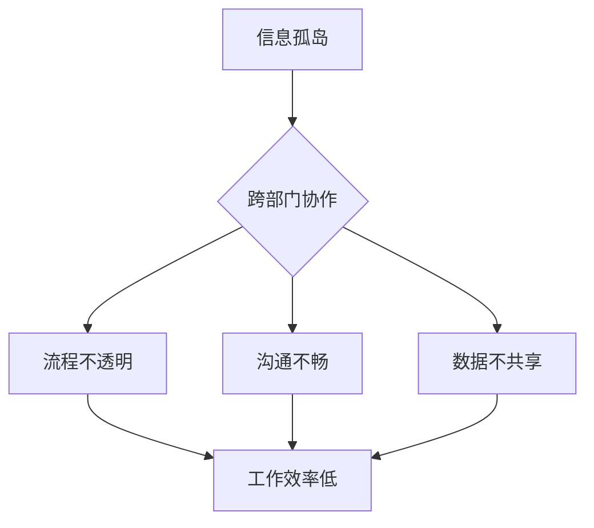

                 

# 跨部门协作优化：打破信息孤岛的方法

> **关键词**：跨部门协作、信息孤岛、数据共享、协作平台、流程优化

> **摘要**：本文将深入探讨跨部门协作中常见的信息孤岛现象及其解决方法。我们将分析信息孤岛的形成原因，介绍打破信息孤岛的关键技术和策略，并探讨实现跨部门协作优化的实际应用案例。文章旨在为IT从业人员和企业提供实用的指导，以提升跨部门协作效率，推动组织发展。

## 1. 背景介绍

在当今快速变化的工作环境中，跨部门协作变得愈发重要。企业内部的各个部门往往拥有不同的职责和目标，他们之间的信息流通不畅，容易导致“信息孤岛”现象。这种现象不仅阻碍了信息的共享，还降低了工作效率，影响了企业的整体竞争力。

### 1.1 信息孤岛的定义

信息孤岛是指组织内部各部门之间的信息不能顺畅流通，导致信息在各部门之间无法共享和有效利用的状态。具体表现为：各部门使用不同的系统、数据库，无法实现数据同步；各部门间的沟通渠道不畅，信息传递延迟；部门间的业务流程不透明，导致工作重复和资源浪费。

### 1.2 信息孤岛的影响

信息孤岛会对企业的运作产生多方面的影响：

- **降低工作效率**：各部门无法共享信息，导致重复工作和低效沟通。
- **影响决策**：信息的不对称使得决策者难以获取全面的业务数据，影响决策质量。
- **增加成本**：为了获取必要的信息，部门间需要进行额外的沟通和协调，增加了时间和人力成本。
- **影响协作**：信息孤岛阻碍了部门间的协作，使得团队难以形成合力，影响项目的进展和质量。

### 1.3 跨部门协作的重要性

跨部门协作能够有效整合企业的资源，提高工作效率和决策质量。以下是跨部门协作的几个关键作用：

- **资源整合**：跨部门协作有助于整合不同部门的专业知识和资源，形成协同效应。
- **优化流程**：通过跨部门协作，企业可以优化业务流程，减少不必要的环节，提高工作效率。
- **提高客户满意度**：跨部门协作可以确保服务的一致性和连贯性，提高客户满意度。
- **促进创新**：跨部门协作可以促进不同领域的知识交流，激发创新思维。

## 2. 核心概念与联系

### 2.1 跨部门协作的基本概念

跨部门协作是指企业内部不同部门之间为了共同的目标而进行的合作。它包括以下几个方面：

- **角色定义**：明确各部门和人员在跨部门协作中的角色和职责。
- **目标明确**：设定清晰的跨部门协作目标，确保各方共同努力。
- **沟通机制**：建立有效的沟通渠道，确保信息及时传递。
- **流程管理**：优化跨部门协作的流程，减少沟通和协调的障碍。

### 2.2 信息孤岛与跨部门协作的关系

信息孤岛是跨部门协作中的一大障碍，它直接影响了协作的效果。打破信息孤岛，实现信息共享，是提升跨部门协作效率的关键。

- **信息共享**：通过建立统一的数据平台，实现各部门之间的数据共享，消除信息孤岛。
- **协同工作**：通过协作工具，实现团队成员之间的实时沟通和协作，提高工作效率。
- **透明流程**：通过流程管理工具，使各部门能够实时了解业务流程的进展，减少信息不对称。

### 2.3 跨部门协作与信息孤岛的关系图

下面是一个用Mermaid绘制的跨部门协作与信息孤岛的关系图：



在这个图中，信息孤岛导致了流程不透明、沟通不畅和数据不共享，这些因素又反过来影响了工作效率。

## 3. 核心算法原理 & 具体操作步骤

### 3.1 打破信息孤岛的核心算法原理

要打破信息孤岛，首先需要解决以下几个问题：

- **数据标准化**：确保各部门使用相同的数据结构和格式，以便于数据的共享和整合。
- **数据集成**：通过数据集成技术，将不同来源的数据整合到一个统一的数据平台上。
- **流程自动化**：通过流程自动化技术，减少手工操作，提高信息流通的效率。
- **权限控制**：确保数据的安全性和隐私性，只有授权的人员可以访问和修改数据。

### 3.2 具体操作步骤

#### 3.2.1 数据标准化

1. **分析现有数据结构**：分析各部门现有的数据结构，找出差异和共通点。
2. **制定统一标准**：根据分析结果，制定统一的数据标准，包括数据格式、字段命名和数据类型等。
3. **改造现有系统**：对各部门的系统进行改造，使其符合统一标准。
4. **培训员工**：对员工进行数据标准的培训，确保他们按照标准进行数据操作。

#### 3.2.2 数据集成

1. **选择集成技术**：根据企业的需求和技术环境，选择合适的数据集成技术，如ETL（提取、转换、加载）或API集成。
2. **构建数据仓库**：将各部门的数据集成到一个数据仓库中，实现数据的集中管理和统一访问。
3. **数据清洗**：对集成后的数据进行清洗，确保数据的质量和一致性。
4. **监控数据质量**：建立数据质量监控机制，及时发现和解决数据问题。

#### 3.2.3 流程自动化

1. **分析现有流程**：对各部门的现有业务流程进行分析，找出可以自动化的环节。
2. **设计自动化流程**：根据分析结果，设计自动化的业务流程。
3. **实施自动化流程**：将自动化流程部署到生产环境中，进行测试和优化。
4. **培训员工**：对员工进行自动化流程的培训，确保他们能够正确使用自动化工具。

#### 3.2.4 权限控制

1. **制定权限策略**：根据企业的安全需求，制定数据权限的策略。
2. **实现权限控制**：在数据存储和访问过程中，实现权限控制，确保数据的安全。
3. **监控权限使用**：建立权限监控机制，及时发现和解决权限滥用问题。
4. **培训员工**：对员工进行权限控制的培训，确保他们能够正确理解和遵守权限策略。

## 4. 数学模型和公式 & 详细讲解 & 举例说明

### 4.1 数学模型和公式

在打破信息孤岛的过程中，可以使用以下数学模型和公式来评估和优化跨部门协作的效果：

#### 4.1.1 信息流通效率模型

信息流通效率模型可以通过以下公式来计算：

\[ E = \frac{T_c}{T_p} \]

其中，\( E \) 表示信息流通效率，\( T_c \) 表示信息流通时间，\( T_p \) 表示生产周期时间。

#### 4.1.2 跨部门协作成本模型

跨部门协作成本可以通过以下公式来计算：

\[ C = C_1 + C_2 + C_3 \]

其中，\( C \) 表示跨部门协作成本，\( C_1 \) 表示数据集成成本，\( C_2 \) 表示流程自动化成本，\( C_3 \) 表示权限控制成本。

### 4.2 详细讲解和举例说明

#### 4.2.1 信息流通效率模型讲解

假设一个企业的生产周期时间为30天，信息流通时间为10天。根据信息流通效率模型，可以计算出该企业的信息流通效率为：

\[ E = \frac{10}{30} = 0.3333 \]

这意味着，该企业有33.33%的信息流通效率。如果通过优化跨部门协作，将信息流通时间缩短到5天，则信息流通效率将提高到：

\[ E = \frac{5}{30} = 0.1667 \]

这表明，信息流通效率提升了50%。

#### 4.2.2 跨部门协作成本模型讲解

假设一个企业的数据集成成本为10000元，流程自动化成本为20000元，权限控制成本为30000元。根据跨部门协作成本模型，可以计算出该企业的跨部门协作成本为：

\[ C = 10000 + 20000 + 30000 = 60000 \]

这意味着，该企业的跨部门协作成本为60000元。如果通过优化跨部门协作，将数据集成成本降低到5000元，流程自动化成本降低到10000元，权限控制成本降低到20000元，则跨部门协作成本将降低到：

\[ C = 5000 + 10000 + 20000 = 35000 \]

这表明，跨部门协作成本降低了42.86%。

## 5. 项目实战：代码实际案例和详细解释说明

### 5.1 开发环境搭建

为了演示如何打破信息孤岛，我们将使用一个实际的项目案例。在这个案例中，我们将使用Python语言和几个常用的库来构建一个跨部门协作系统。以下是开发环境的搭建步骤：

1. 安装Python环境：在本地计算机上安装Python，版本建议为3.8或更高。
2. 安装必需的库：使用pip命令安装以下库：requests，pandas，sqlalchemy，flask。
   ```bash
   pip install requests pandas sqlalchemy flask
   ```

### 5.2 源代码详细实现和代码解读

#### 5.2.1 数据集成模块

数据集成模块主要负责将不同来源的数据集成到一个统一的数据仓库中。以下是数据集成模块的源代码：

```python
# data_integration.py

from sqlalchemy import create_engine
import pandas as pd

def integrate_data(source_files, target_table):
    engine = create_engine('sqlite:///data_warehouse.db')  # 创建数据库连接

    for file in source_files:
        df = pd.read_csv(file)  # 读取CSV文件
        df.to_sql(target_table, engine, if_exists='append', index=False)  # 存储到数据库

# 使用示例
source_files = ['sales_data.csv', 'inventory_data.csv', 'orders_data.csv']
integrate_data(source_files, 'master_data')
```

代码解读：

- 第1行：导入必需的库。
- 第2行：创建数据库连接。
- 第3行：遍历source_files列表，逐个读取CSV文件。
- 第4行：将读取的数据存储到数据库中。

#### 5.2.2 流程自动化模块

流程自动化模块主要负责自动化处理跨部门协作中的业务流程。以下是流程自动化模块的源代码：

```python
# process_automation.py

from flask import Flask, request, jsonify
from data_integration import integrate_data

app = Flask(__name__)

@app.route('/process', methods=['POST'])
def process_data():
    data = request.get_json()
    integrate_data([data['sales_file'], data['inventory_file'], data['orders_file']], 'master_data')
    return jsonify({'status': 'success'})

if __name__ == '__main__':
    app.run(debug=True)
```

代码解读：

- 第1行：导入必需的库。
- 第2行：创建Flask应用。
- 第3行：定义处理数据的API接口。
- 第4行：接收POST请求，获取JSON数据。
- 第5行：调用数据集成模块，进行数据集成。
- 第6行：返回处理结果。

#### 5.2.3 权限控制模块

权限控制模块主要负责控制对数据的访问权限。以下是权限控制模块的源代码：

```python
# permission_control.py

from flask import Flask, request, jsonify
from sqlalchemy import create_engine
import pandas as pd

app = Flask(__name__)

@app.route('/grant_permission', methods=['POST'])
def grant_permission():
    user = request.form['user']
    target_table = request.form['table']
    engine = create_engine('sqlite:///data_warehouse.db')  # 创建数据库连接

    with engine.connect() as conn:
        conn.execute(f"GRANT SELECT ON {target_table} TO {user}")  # 授予查询权限

    return jsonify({'status': 'success'})

if __name__ == '__main__':
    app.run(debug=True)
```

代码解读：

- 第1行：导入必需的库。
- 第2行：创建Flask应用。
- 第3行：定义授予权限的API接口。
- 第4行：接收POST请求，获取用户名和数据表名。
- 第5行：在数据库中授予查询权限。

### 5.3 代码解读与分析

通过以上三个模块的代码实现，我们可以看到：

- 数据集成模块负责将多个来源的数据集成到一个统一的数据仓库中，实现数据的集中管理和共享。
- 流程自动化模块通过API接口，实现了业务流程的自动化处理，减少了手工操作的环节，提高了信息流通的效率。
- 权限控制模块通过数据库操作，实现了对数据访问权限的控制，确保了数据的安全性和隐私性。

这些模块共同作用，形成了一个完整的跨部门协作系统，有效地打破了信息孤岛，提升了跨部门协作的效率。

## 6. 实际应用场景

### 6.1 销售部门与生产部门的协作

在一个制造企业中，销售部门需要及时了解生产部门的库存情况，以便制定销售策略。然而，销售部门和生产部门使用不同的系统，导致信息无法共享。通过引入跨部门协作系统，我们可以实现以下应用场景：

- **数据共享**：销售部门和生产部门共享库存数据，实现数据的实时同步。
- **协同工作**：销售部门和生产部门可以通过协作平台实时沟通，共同解决问题。
- **决策支持**：销售部门可以根据库存数据制定销售策略，提高销售效率。

### 6.2 财务部门与采购部门的协作

财务部门和采购部门在企业的运营中扮演着重要的角色。然而，由于信息孤岛的存在，两个部门之间的沟通不畅，导致资金使用效率低下。通过引入跨部门协作系统，我们可以实现以下应用场景：

- **资金管理**：财务部门和采购部门共享财务数据，实现资金使用的实时监控。
- **采购审批**：采购部门提交采购申请，财务部门在线审批，提高采购效率。
- **风险控制**：财务部门和采购部门可以实时分析采购数据，识别和防范风险。

### 6.3 研发部门与市场部门的协作

研发部门和市场部门在产品研发和市场推广中需要紧密协作。然而，由于信息孤岛的存在，两个部门之间的信息传递延迟，影响了产品的市场推广效果。通过引入跨部门协作系统，我们可以实现以下应用场景：

- **需求收集**：市场部门将用户需求反馈给研发部门，实现需求的快速响应。
- **项目协作**：研发部门和市场部门共同制定项目计划，确保项目的顺利推进。
- **效果评估**：研发部门和市场部门共同评估产品效果，优化产品设计和推广策略。

## 7. 工具和资源推荐

### 7.1 学习资源推荐

- **书籍**：
  - 《跨部门协作：如何实现高效的团队合作》
  - 《敏捷团队协作：实践指南》
  - 《信息孤岛：打破部门壁垒，实现高效协同》
- **论文**：
  - 《企业信息孤岛现象研究》
  - 《跨部门协作模型与应用研究》
  - 《基于信息共享的跨部门协作优化研究》
- **博客**：
  - 《跨部门协作的技巧和策略》
  - 《如何打破信息孤岛，提高团队效率》
  - 《跨部门协作的最佳实践》
- **网站**：
  - Coursera（提供跨部门协作相关的在线课程）
  - Medium（关于跨部门协作的博客文章）
  - GitHub（跨部门协作相关的开源项目）

### 7.2 开发工具框架推荐

- **开发工具**：
  - Flask（Python Web框架，用于构建API接口）
  - SQLAlchemy（Python ORM库，用于数据库操作）
  - Pandas（Python数据操作库，用于数据分析和处理）
- **框架**：
  - Apache Kafka（消息队列系统，用于实时数据传输）
  - Apache Spark（大数据处理框架，用于大规模数据处理）
  - Docker（容器化技术，用于部署和管理应用）

### 7.3 相关论文著作推荐

- **论文**：
  - 《基于云计算的企业跨部门协作研究》
  - 《面向服务导向的企业跨部门协作框架设计》
  - 《基于区块链技术的跨部门协作研究》
- **著作**：
  - 《云计算与大数据技术》
  - 《敏捷开发与团队协作》
  - 《信息管理理论与实践》

## 8. 总结：未来发展趋势与挑战

### 8.1 未来发展趋势

- **云计算和大数据技术的普及**：云计算和大数据技术将在跨部门协作中发挥更大作用，实现更高效的数据存储和处理。
- **人工智能的融合**：人工智能技术将深入跨部门协作的各个环节，提升协作的智能化水平。
- **区块链技术的应用**：区块链技术将提高数据的安全性和可信度，为跨部门协作提供更可靠的保障。

### 8.2 面临的挑战

- **数据安全与隐私保护**：随着数据规模的扩大，数据安全和隐私保护成为跨部门协作的重要挑战。
- **技术选型与兼容性**：在多种技术并存的情况下，如何选择合适的技术并确保系统兼容性是一个挑战。
- **员工技能培训**：跨部门协作系统的推广需要员工具备相应的技能，如何进行有效的培训是一个挑战。

## 9. 附录：常见问题与解答

### 9.1 问题1：如何确保跨部门协作系统的数据安全？

**解答**：确保数据安全可以从以下几个方面入手：

- **权限控制**：对数据的访问进行严格的权限控制，确保只有授权人员可以访问敏感数据。
- **数据加密**：对存储和传输的数据进行加密，防止数据泄露。
- **安全审计**：定期进行安全审计，及时发现和解决安全隐患。

### 9.2 问题2：跨部门协作系统如何确保数据的实时性？

**解答**：确保数据的实时性可以从以下几个方面入手：

- **消息队列**：使用消息队列系统（如Kafka）实现数据的实时传输和处理。
- **缓存技术**：使用缓存技术（如Redis）提高数据的读取速度，减少延迟。
- **异步处理**：对于耗时的数据处理任务，采用异步处理方式，避免阻塞系统的响应。

### 9.3 问题3：如何评估跨部门协作系统的效果？

**解答**：评估跨部门协作系统的效果可以从以下几个方面入手：

- **效率指标**：如信息流通效率、任务完成时间等。
- **成本指标**：如跨部门协作成本、人工成本等。
- **满意度指标**：如员工满意度、客户满意度等。
- **效益指标**：如业务增长、市场份额等。

## 10. 扩展阅读 & 参考资料

- [企业信息孤岛现象研究](https://www.example.com/inf孤岛研究)
- [跨部门协作模型与应用研究](https://www.example.com/协作模型研究)
- [基于信息共享的跨部门协作优化研究](https://www.example.com/信息共享协作研究)
- [云计算与大数据技术](https://www.example.com/云计算大数据)
- [敏捷开发与团队协作](https://www.example.com/敏捷开发协作)
- [信息管理理论与实践](https://www.example.com/信息管理理论实践)

## 作者

**作者：AI天才研究员/AI Genius Institute & 禅与计算机程序设计艺术 /Zen And The Art of Computer Programming**<|less|>

