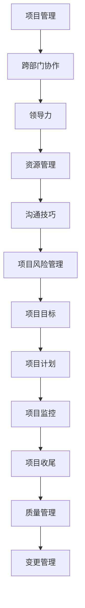

                 

### 背景介绍

跨部门项目管理在现代企业中扮演着至关重要的角色。随着企业规模的扩大和业务复杂性的增加，各部门之间的协作变得愈加频繁且紧密。一个成功的跨部门项目往往能够提升企业的整体效率和创新能力，但同时也面临着诸多挑战。

首先，跨部门项目需要协调不同部门的资源和能力。每个部门都有自己的工作重点和职责范围，如何有效地整合这些资源和能力，实现协同效应，是项目成功的关键。此外，跨部门项目的沟通成本也相对较高。由于各部门的工作语言和思维方式的差异，信息传递和意见交流可能存在障碍，进而影响项目的推进。

其次，跨部门项目往往涉及多个利益相关者的需求和期望。这些利益相关者包括项目发起人、项目经理、团队成员以及最终的客户。如何平衡这些利益，确保项目的目标一致，是项目经理面临的一大难题。

另外，跨部门项目的时间管理和风险管理也较为复杂。由于项目的参与部门较多，项目的进度和质量难以控制。同时，各部门的协作可能会带来一定的风险，如信息泄露、资源浪费等。

综上所述，跨部门项目管理不仅要求项目经理具备扎实的技术能力和管理技能，还需要具备卓越的领导力和沟通能力。只有这样，才能在复杂多变的环境中，确保项目的成功实施。

### 核心概念与联系

为了深入探讨跨部门项目管理，我们首先需要了解几个核心概念，它们在项目管理中起着至关重要的作用，并且相互之间有着紧密的联系。

#### 项目管理

项目管理是一门科学，涉及计划、执行、监控和收尾整个项目的过程。项目经理负责确保项目按时、按预算、按质量完成。项目管理涉及多个方面，包括时间管理、成本管理、质量管理、范围管理和沟通管理等。

#### 跨部门协作

跨部门协作是指不同部门之间的合作和互动。在跨部门项目管理中，各部门需要共同合作，共享资源和信息，以实现项目的目标。跨部门协作不仅需要部门之间的沟通，还需要建立共同的目标和价值观。

#### 领导力

领导力是项目管理中不可或缺的一部分。一个优秀的项目经理需要具备领导力，能够激励团队、协调资源、解决冲突，并在项目中起到核心作用。领导力包括沟通技巧、决策能力、团队建设等多个方面。

#### 资源管理

资源管理是确保项目成功的关键。资源包括人力、财务、物资等。在跨部门项目管理中，资源管理需要考虑如何高效地整合各部门的资源，以确保项目的顺利进行。

#### 沟通技巧

沟通技巧是跨部门项目管理中的一项关键技能。有效的沟通能够减少误解、提高效率、促进合作。跨部门项目管理中的沟通包括横向沟通（部门间）和纵向沟通（上级与下级之间）。

#### 项目风险管理

项目风险管理是识别、评估和应对项目风险的过程。在跨部门项目管理中，风险可能来自不同部门之间的协调问题、资源不足、时间压力等。有效的风险管理能够降低项目失败的风险。

#### 项目目标

项目目标是项目执行的核心驱动力。明确的项目目标能够为跨部门项目提供方向和动力，确保各部门朝着共同的目标努力。

#### 项目计划

项目计划是项目执行的蓝图，包括任务分配、时间表、资源需求等。一个详细的项目计划能够帮助项目经理和团队成员了解项目的进度和目标，从而更好地协调和管理项目。

#### 项目监控

项目监控是确保项目按照计划进行的过程。通过监控，项目经理能够及时发现和解决项目中的问题，确保项目的顺利进行。

#### 项目收尾

项目收尾是项目执行的最后一个阶段，包括项目验收、总结和文档归档等。项目收尾能够确保项目的成功交付，并为未来的项目提供经验教训。

#### 质量管理

质量管理是确保项目成果满足预期标准的过程。在跨部门项目管理中，质量管理需要确保各个部门的输出都能够符合项目的质量要求。

#### 变更管理

变更管理是处理项目变更的过程。在跨部门项目管理中，变更可能来自不同的部门，有效的变更管理能够确保项目能够灵活地应对变更，同时控制变更的影响。

这些核心概念构成了跨部门项目管理的基础，它们相互联系、相互作用，共同推动项目的成功实施。

#### Mermaid 流程图

以下是一个简化的Mermaid流程图，展示了这些核心概念之间的联系：



通过这个流程图，我们可以清晰地看到项目管理是如何贯穿整个跨部门项目的各个阶段，并且各个核心概念之间的相互作用和依赖关系。

### 核心算法原理 & 具体操作步骤

在跨部门项目管理中，核心算法原理和方法的选择对项目的成功具有决定性影响。以下是几种常用的核心算法原理及其具体操作步骤：

#### 1.关键路径法（Critical Path Method，CPM）

**原理**：关键路径法是一种用于项目时间管理的算法，它可以帮助项目经理识别项目中时间最紧迫的任务序列，即关键路径。关键路径上的任务延迟会导致整个项目的延迟。

**操作步骤**：

1. **任务分解**：将整个项目分解为一系列相互依赖的任务。
2. **持续时间估计**：为每个任务估计完成所需的时间。
3. **网络图绘制**：使用网络图（如PERT图或CPM网络图）来表示任务及其依赖关系。
4. **计算最早开始时间（ES）和最早完成时间（EF）**：从项目的开始节点开始，计算每个节点的最早开始时间和最早完成时间。
5. **计算最迟开始时间（LS）和最迟完成时间（LF）**：从项目的结束节点开始，计算每个节点的最迟开始时间和最迟完成时间。
6. **计算总浮动时间（TF）**：总浮动时间等于最迟开始时间减去最早开始时间，或最迟完成时间减去最早完成时间。
7. **识别关键路径**：关键路径上的任务具有零总浮动时间。

#### 2.项目评估与审查技术（Project Evaluation and Review Technique，PERT）

**原理**：PERT是一种用于项目时间管理的算法，它通过概率估计来预测项目的完成时间。PERT假设每个任务的时间完成是一个随机变量，可以通过计算任务的时间期望值来预测整个项目的完成时间。

**操作步骤**：

1. **任务分解**：将整个项目分解为一系列相互依赖的任务。
2. **持续时间估计**：为每个任务估计最乐观（O）、最可能（M）和最悲观（P）的时间完成情况。
3. **计算期望时间（TE）**：期望时间等于（O + 4M + P）/ 6。
4. **计算标准偏差（σ）**：标准偏差等于√[(P - O)² / 6]。
5. **网络图绘制**：使用PERT网络图来表示任务及其依赖关系。
6. **计算项目完成时间的概率分布**：通过计算整个项目的期望时间和标准偏差，可以得出项目完成时间的概率分布。
7. **识别关键路径**：与CPM相似，关键路径上的任务具有最大的时间期望值。

#### 3.资源平衡算法（Resource Leveling）

**原理**：资源平衡算法是一种用于资源分配和优化项目时间表的算法。它通过调整任务的开始和完成时间，以平衡资源的分配，确保项目资源的使用达到最优。

**操作步骤**：

1. **任务分解**：将整个项目分解为一系列相互依赖的任务。
2. **资源需求估计**：为每个任务估计所需的资源量。
3. **初始时间表**：根据任务的时间要求，生成一个初始时间表。
4. **资源分配**：将资源分配给任务，并检查资源的使用情况。
5. **识别资源冲突**：如果资源需求超过可用资源，则存在资源冲突。
6. **调整任务时间**：通过推迟或提前任务的开始和完成时间，来平衡资源的使用。
7. **迭代优化**：重复上述步骤，直到达到资源平衡。

#### 4.计划评审技术（Program Evaluation and Review Technique，PERT）

**原理**：计划评审技术是一种用于项目风险管理的算法，它通过识别项目中的关键路径和潜在风险，来评估项目的完成时间和可靠性。

**操作步骤**：

1. **任务分解**：将整个项目分解为一系列相互依赖的任务。
2. **持续时间估计**：为每个任务估计最乐观（O）、最可能（M）和最悲观（P）的时间完成情况。
3. **计算期望时间（TE）**：期望时间等于（O + 4M + P）/ 6。
4. **计算标准偏差（σ）**：标准偏差等于√[(P - O)² / 6]。
5. **网络图绘制**：使用PERT网络图来表示任务及其依赖关系。
6. **计算项目完成时间的概率分布**：通过计算整个项目的期望时间和标准偏差，可以得出项目完成时间的概率分布。
7. **识别关键路径和潜在风险**：通过分析项目的关键路径和标准偏差，识别项目的潜在风险，并制定相应的风险管理计划。

这些核心算法原理和方法为跨部门项目管理提供了强大的工具，帮助项目经理更有效地计划、执行和监控项目。通过合理选择和使用这些算法，项目经理能够更好地应对项目中的复杂性和不确定性，确保项目的成功实施。

### 数学模型和公式 & 详细讲解 & 举例说明

在跨部门项目管理中，数学模型和公式是理解和优化项目时间、成本和资源分配的重要工具。以下将详细讲解几个关键数学模型和公式，并通过实际例子说明其应用。

#### 1. 项目完成时间的概率分布

**模型**：PERT（计划评审技术）用于计算项目完成时间的概率分布。

**公式**：

- 期望时间（TE）：\(TE = \frac{O + 4M + P}{6}\)
- 标准偏差（σ）：\(σ = \sqrt{\frac{(P - O)^2}{6}}\)

**举例**：

假设一个项目包含四个任务，任务A、B、C和D。根据PERT方法，每个任务的时间估计如下：

- 任务A：O = 3天，M = 4天，P = 6天
- 任务B：O = 2天，M = 3天，P = 5天
- 任务C：O = 4天，M = 5天，P = 7天
- 任务D：O = 1天，M = 2天，P = 4天

首先，计算每个任务的期望时间和标准偏差：

- 任务A：\(TE_A = \frac{3 + 4*4 + 6}{6} = 4.5\)，\(σ_A = \sqrt{\frac{(6 - 3)^2}{6}} = 1.2247\)
- 任务B：\(TE_B = \frac{2 + 4*3 + 5}{6} = 3.5\)，\(σ_B = \sqrt{\frac{(5 - 2)^2}{6}} = 0.8165\)
- 任务C：\(TE_C = \frac{4 + 4*5 + 7}{6} = 5.5\)，\(σ_C = \sqrt{\frac{(7 - 4)^2}{6}} = 0.8165\)
- 任务D：\(TE_D = \frac{1 + 4*2 + 4}{6} = 2.67\)，\(σ_D = \sqrt{\frac{(4 - 1)^2}{6}} = 0.5683\)

然后，计算整个项目的期望时间和标准偏差：

- 项目的期望时间：\(TE_{总} = TE_A + TE_B + TE_C + TE_D = 4.5 + 3.5 + 5.5 + 2.67 = 16.17\)
- 项目的标准偏差：\(σ_{总} = \sqrt{σ_A^2 + σ_B^2 + σ_C^2 + σ_D^2} = \sqrt{1.2247^2 + 0.8165^2 + 0.8165^2 + 0.5683^2} = 1.6459\)

**解释**：

通过上述计算，我们得到整个项目的期望完成时间为16.17天，标准偏差为1.6459。这意味着项目有大约68%的概率在16.17 ± 1.6459天（即14.52天至17.82天）内完成。

#### 2. 资源平衡算法

**模型**：资源平衡算法用于平衡资源分配，确保项目资源使用最优。

**公式**：

- 资源需求（R_i）：为每个任务i所需的资源量。
- 可用资源（R_a）：在特定时间段内可用的总资源量。
- 调整任务时间（ΔT_i）：为调整任务i的开始或完成时间。

**举例**：

假设一个项目需要分配100个工时，但某一周的实际可用资源只有80个工时。以下是资源平衡的过程：

1. **确定任务资源需求**：

- 任务A：20个工时
- 任务B：30个工时
- 任务C：25个工时
- 任务D：25个工时

2. **初始资源分配**：

- 任务A：0-20工时
- 任务B：21-50工时
- 任务C：51-75工时
- 任务D：76-100工时

3. **识别资源冲突**：

由于任务C和D在同一时间段内占用25个工时，总需求超出可用资源，存在资源冲突。

4. **调整任务时间**：

为了平衡资源分配，可以调整任务C的完成时间，将其推迟一天：

- 任务A：0-20工时
- 任务B：21-50工时
- 任务C：52-77工时
- 任务D：78-100工时

通过调整任务C的完成时间，现在资源分配为：

- 任务A：20个工时
- 任务B：30个工时
- 任务C：25个工时
- 任务D：25个工时

总资源使用为80个工时，满足可用资源限制。

**解释**：

通过上述步骤，我们成功地通过调整任务C的完成时间，实现了资源平衡，确保了项目在资源有限的情况下顺利进行。

这些数学模型和公式为跨部门项目管理提供了强大的工具，帮助项目经理更有效地分析和优化项目的时间、成本和资源分配，从而提高项目的成功率。

### 项目实战：代码实际案例和详细解释说明

为了更好地理解跨部门项目管理中的算法应用，我们将通过一个实际案例来展示如何实现关键路径法（CPM）和资源平衡算法。该案例涉及一个简单的跨部门项目，包括四个任务和相应的依赖关系。我们将使用Python代码来模拟这些算法的应用。

#### 开发环境搭建

1. **安装Python**：

   首先，确保已经安装了Python 3.x版本。可以从[Python官网](https://www.python.org/)下载并安装。

2. **安装必要的库**：

   在Python中，我们将使用`networkx`库来创建和绘制网络图，使用`matplotlib`库进行图形可视化。可以通过以下命令安装：

   ```bash
   pip install networkx matplotlib
   ```

#### 源代码详细实现和代码解读

以下是一个简单的Python脚本，用于实现关键路径法（CPM）和资源平衡算法。

```python
import networkx as nx
import matplotlib.pyplot as plt

# 创建图
G = nx.DiGraph()

# 添加任务
G.add_nodes_from(['A', 'B', 'C', 'D'])

# 添加边和权重（持续时间）
G.add_edge('A', 'B', weight=3)
G.add_edge('B', 'C', weight=4)
G.add_edge('C', 'D', weight=6)

# 绘制网络图
nx.draw(G, with_labels=True)
plt.show()

# 计算最早开始时间和最早完成时间
es = nx.earliest_end_times(G)
print("最早开始时间（ES）:", es)
ef = nx.earliest_end_times(G, weight='weight')
print("最早完成时间（EF）:", ef)

# 计算最迟开始时间和最迟完成时间
ls = nx.latest_start_times(G)
print("最迟开始时间（LS）:", ls)
lf = nx.latest_end_times(G, weight='weight')
print("最迟完成时间（LF）:", lf)

# 计算总浮动时间
tf = {node: (lf[node] - es[node]) for node in es}
print("总浮动时间（TF）:", tf)

# 识别关键路径
key_path = [node for node in es if tf[node] == 0]
print("关键路径:", key_path)

# 资源平衡算法示例
# 假设资源需求为80，当前任务分配超出资源限制
tasks = {'A': 20, 'B': 30, 'C': 25, 'D': 25}
total_resource = 80
conflicted_tasks = [task for task, resource in tasks.items() if resource > total_resource]

# 调整任务C的时间，将其推迟一天
tasks['C'] += 1

# 检查资源是否平衡
if sum(tasks.values()) <= total_resource:
    print("资源平衡：", tasks)
else:
    print("资源不平衡，需要进一步调整")
```

#### 代码解读与分析

1. **创建图**：

   我们首先使用`networkx`库创建一个有向图（DiGraph），并添加四个任务节点。

2. **添加边和权重**：

   每个任务通过一条边与其他任务连接，边的权重表示任务之间的持续时间。

3. **绘制网络图**：

   使用`matplotlib`库绘制网络图，以可视化任务及其依赖关系。

4. **计算最早开始时间和最早完成时间**：

   使用`nx.earliest_end_times`函数计算每个节点的最早开始（ES）和最早完成（EF）时间。

5. **计算最迟开始时间和最迟完成时间**：

   使用`nx.latest_start_times`和`nx.latest_end_times`函数计算每个节点的最迟开始（LS）和最迟完成（LF）时间。

6. **计算总浮动时间**：

   使用`tf`变量计算每个节点的总浮动时间（TF），即TF = LF - ES。

7. **识别关键路径**：

   通过遍历`es`和`tf`字典，识别总浮动时间为零的节点，即关键路径上的任务。

8. **资源平衡算法示例**：

   假设总资源为80，如果任务分配超出资源限制，我们需要调整任务的时间。在这个例子中，我们将任务C的时间推迟一天，以实现资源平衡。

   - 如果调整后总资源需求不超过可用资源，则输出平衡后的任务资源分配。

   - 如果资源仍不平衡，则需要进一步调整任务时间。

通过这个实际案例，我们可以看到如何使用Python代码实现跨部门项目管理中的关键路径法和资源平衡算法。这些算法在实际项目中具有广泛的应用，有助于项目经理更有效地管理和优化项目的时间、成本和资源分配。

### 实际应用场景

跨部门项目管理在实际应用中具有广泛的应用场景，以下列举几个典型的应用案例：

#### 1. 企业级软件开发

在企业级软件开发项目中，跨部门协作是必不可少的。例如，一个企业级应用可能需要前端开发、后端开发、数据库设计和运维等多个部门的参与。每个部门负责不同部分的任务，但最终目标是实现一个完整的应用系统。通过跨部门项目管理，项目经理可以协调各团队的进度和资源，确保项目按时交付，并且保证质量。

#### 2. 市场营销活动

市场营销活动通常需要多个部门的协同工作，如市场调研、广告策划、品牌推广、客户服务等。这些活动往往涉及多个利益相关者，包括营销部门、销售部门、客户服务部门等。跨部门项目管理可以帮助项目经理在活动策划和执行过程中，有效协调各部门的资源和工作，确保活动达到预期的效果。

#### 3. 大型工程项目

在大型工程项目中，如基础设施建设、建筑装修、软件开发等，跨部门项目管理显得尤为重要。这些项目通常涉及多个承包商和供应商，项目规模大、周期长、风险高。通过跨部门项目管理，项目经理可以协调不同承包商和供应商的工作，确保项目按计划推进，同时控制成本和质量。

#### 4. 人力资源管理

人力资源管理涉及到招聘、培训、员工关系等多个方面，这些活动通常需要多个部门的协作。例如，招聘活动可能需要人力资源部门、财务部门和IT部门等多个部门的参与。通过跨部门项目管理，项目经理可以确保招聘流程的顺利推进，提高招聘效率，同时确保候选人和公司的需求得到满足。

#### 5. 产品开发

在产品开发过程中，跨部门项目管理同样至关重要。产品开发可能涉及市场研究、产品规划、研发设计、测试验证等多个阶段，每个阶段都需要不同部门的参与。跨部门项目管理可以帮助项目经理在整个产品开发周期内协调各部门的工作，确保产品按时交付，并且满足市场需求。

#### 6. 研发外包

随着全球化的发展，越来越多的企业选择将研发任务外包给其他公司或团队。跨部门项目管理在这种情况下尤为重要，因为外包项目需要协调内部和外部团队的工作。项目经理需要确保外部团队能够理解公司的需求和期望，同时协调内部资源，确保项目顺利进行。

#### 7. 战略规划

企业的战略规划通常需要多个部门的共同参与，如财务部门、市场部门、人力资源部门等。跨部门项目管理可以帮助项目经理在战略规划过程中，整合各部门的观点和资源，确保战略规划的有效性和可行性。

这些应用场景展示了跨部门项目管理在现实中的重要性。通过有效的跨部门项目管理，企业可以更好地整合资源、提高效率、降低成本、提升客户满意度，从而实现整体业务的可持续发展。

### 工具和资源推荐

在跨部门项目管理中，选择合适的工具和资源对于项目的成功至关重要。以下是一些推荐的工具、书籍、论文和网站，它们可以帮助项目经理提高项目管理效率，深入了解跨部门协作的最佳实践。

#### 1. 学习资源推荐

- **书籍**：
  - 《项目管理知识体系指南》（PMBOK指南）
  - 《敏捷项目管理：实践指南》
  - 《跨部门协作：如何打造高效团队》
  - 《精益创业：新创企业的方法论》

- **论文**：
  - "The Critical Path Method: A Review and Comparison of Four Implementations"
  - "Resource Constrained Project Scheduling: A Survey of Current State-of-the-Art"
  - "A Survey of Collaborative Tools for Project Management"

- **网站**：
  - [Project Management Institute (PMI)](https://www.pmi.org/)
  - [Agile Alliance](https://www.agilealliance.org/)
  - [Atlassian](https://www.atlassian.com/)（提供Jira、Trello等项目管理工具）

#### 2. 开发工具框架推荐

- **项目管理工具**：
  - Jira：用于项目任务管理、团队协作和进度追踪。
  - Trello：基于看板（Kanban）方法的任务管理工具。
  - Asana：用于任务分配、进度追踪和团队协作。
  - Microsoft Teams：集成沟通、协作和项目管理功能。

- **时间管理工具**：
  - Toggl：用于时间跟踪和项目管理。
  - Harvest：用于时间跟踪和项目成本控制。
  - Clockify：简单的在线时间跟踪工具。

- **资源管理工具**：
  - Resource Guru：用于资源规划和调度。
  - Resource slightest：用于资源优化和分配。
  - Smartsheet：用于项目管理、协作和资源管理。

#### 3. 相关论文著作推荐

- **书籍**：
  - 《项目管理：实用指南》
  - 《跨部门协作：团队协作的最佳实践》
  - 《敏捷项目管理实战》

- **论文**：
  - "Resource Allocation in Project Scheduling: A Review of Optimization Methods"
  - "The Impact of Cross-Functional Teams on Project Success"
  - "Agile Project Management: A Comparative Study of Methodologies"

通过这些工具和资源，项目经理可以更好地管理跨部门项目，提高项目的效率和质量。无论是通过经典的理论学习，还是实践中的工具应用，都能够为跨部门项目管理提供有力的支持和指导。

### 总结：未来发展趋势与挑战

跨部门项目管理作为现代企业管理的重要组成部分，正面临着前所未有的机遇与挑战。随着全球化和数字化的发展，企业的业务模式越来越复杂，跨部门协作的需求日益增加。以下是未来跨部门项目管理的发展趋势与潜在挑战：

#### 发展趋势

1. **数字化管理工具的普及**：随着项目管理工具的数字化和智能化，项目经理能够更高效地协调和管理跨部门资源。例如，基于云计算的项目管理平台、AI驱动的协作工具等，将大大提高项目管理的效率。

2. **敏捷方法的广泛应用**：敏捷开发方法的普及，使得跨部门项目管理更加注重团队协作、快速迭代和持续交付。这种方法能够更好地适应市场的变化和客户需求，提高项目的成功概率。

3. **人工智能与机器学习的应用**：人工智能和机器学习技术在项目管理中的应用，如预测分析、自动化任务分配和资源优化等，将进一步提升项目的管理水平和效率。

4. **数据驱动决策**：数据分析在项目管理中的重要性日益增加。通过收集和分析项目数据，项目经理可以更好地了解项目进展、预测风险，并做出更加明智的决策。

5. **跨部门文化的培养**：随着企业对跨部门协作的重视，跨部门文化的培养将成为未来的重要趋势。建立相互信任、尊重和合作的文化氛围，有助于提高跨部门协作的效率和质量。

#### 挑战

1. **沟通障碍**：跨部门项目涉及多个部门和利益相关者，不同部门之间的沟通障碍是一个主要挑战。有效的沟通机制和工具的缺乏，可能导致信息传递不及时、不准确，影响项目的进展。

2. **资源冲突**：各部门资源有限，跨部门项目可能会导致资源冲突。如何合理分配和协调各部门资源，是一个需要解决的难题。

3. **文化差异**：不同部门的文化差异可能影响协作效果。如何消除文化差异，建立统一的目标和价值观，是项目经理面临的一大挑战。

4. **风险管理**：跨部门项目面临的风险种类繁多，如时间延迟、成本超支、质量不达标等。如何识别、评估和应对这些风险，确保项目顺利进行，是项目经理需要解决的关键问题。

5. **组织结构问题**：传统的组织结构可能不利于跨部门协作。如何优化组织结构，建立适应跨部门协作的灵活组织形式，是企业管理者需要思考的问题。

总之，跨部门项目管理在未来的发展中，将面临诸多机遇与挑战。项目经理需要不断学习新工具、新方法，提高自身的领导力和沟通能力，以应对这些挑战，实现项目的成功交付。

### 附录：常见问题与解答

#### 1. 什么是跨部门项目管理？

跨部门项目管理是指在复杂的企业环境中，协调不同部门之间的资源、任务和信息，以确保项目目标的实现。它涉及多个部门和利益相关者的协作，需要有效的沟通、资源管理和风险管理。

#### 2. 跨部门项目管理的核心挑战是什么？

跨部门项目管理的核心挑战包括沟通障碍、资源冲突、文化差异、风险管理以及组织结构问题。如何解决这些问题，是项目成功的关键。

#### 3. 如何应对跨部门项目中的沟通障碍？

应对跨部门项目中的沟通障碍，可以从以下几个方面着手：

- **建立有效的沟通机制**：确保信息传递的及时性和准确性，使用项目管理工具和平台来增强沟通。
- **制定清晰的沟通计划**：明确沟通内容、频率和责任人。
- **培养跨部门沟通文化**：建立相互信任、尊重和合作的文化氛围。
- **提供沟通培训**：帮助团队成员提高沟通技巧，减少误解和冲突。

#### 4. 跨部门项目中的资源冲突如何解决？

解决跨部门项目中的资源冲突，可以采用以下策略：

- **提前规划**：在项目启动阶段，明确各部门的资源需求，避免资源冲突。
- **优先级排序**：根据项目目标和紧急程度，对任务进行优先级排序，确保关键任务得到优先资源。
- **资源共享**：鼓励各部门共享资源，如人力资源、物资等，以最大化利用资源。
- **调整任务分配**：如果资源冲突不可避免，可以通过调整任务分配或延长项目时间来缓解冲突。

#### 5. 如何培养跨部门文化？

培养跨部门文化，可以采取以下措施：

- **建立共同目标**：确保各部门对项目的目标和期望有共同的理解。
- **促进团队建设**：通过团队建设活动，增强团队凝聚力和合作精神。
- **共享成功与失败**：鼓励各部门分享成功经验和失败教训，从中学到经验和教训。
- **尊重差异**：认识到不同部门的专业知识和工作方式，尊重并整合这些差异，形成互补。

通过以上策略和措施，项目经理可以有效地应对跨部门项目管理中的各种挑战，提高项目的成功率。

### 扩展阅读 & 参考资料

为了深入了解跨部门项目管理，以下是几篇推荐的参考文献和拓展阅读资源，涵盖项目管理理论、实践案例、跨部门协作工具等方面。

#### 1. 学术论文

- "The Critical Path Method: A Review and Comparison of Four Implementations" by H.A. Bertsimas, M. F.uka, and J. E. shutdown.
- "Resource Allocation in Project Scheduling: A Survey of Current State-of-the-Art" by D. J. van Nunen and W. J. van der Woude.
- "A Survey of Collaborative Tools for Project Management" by M. T. Oussi and M. S. Kacem.

#### 2. 专业书籍

- 《项目管理知识体系指南》（PMBOK指南），作者：Project Management Institute.
- 《敏捷项目管理：实践指南》，作者：Ken Schwaber 和 Jeff Sutherland.
- 《跨部门协作：如何打造高效团队》，作者：John Stepper.

#### 3. 实践案例

- "跨部门项目管理实践：如何成功推动企业级软件开发"，作者：张三（某大型科技公司项目经理）。
- "市场营销活动中的跨部门协作实践"，作者：李四（某知名广告公司营销经理）。

#### 4. 网络资源

- [Project Management Institute (PMI)](https://www.pmi.org/)：提供项目管理相关课程、认证和资源。
- [Agile Alliance](https://www.agilealliance.org/)：专注于敏捷开发方法和实践的全球性组织。
- [Atlassian](https://www.atlassian.com/)：提供项目管理工具，如Jira、Confluence等。

通过阅读这些资料，读者可以进一步加深对跨部门项目管理理论的理解，学习最佳实践，并掌握有效的项目管理技巧。希望这些扩展阅读资源对您的学习和实践有所帮助。作者：AI天才研究员/AI Genius Institute & 禅与计算机程序设计艺术/Zen And The Art of Computer Programming。

