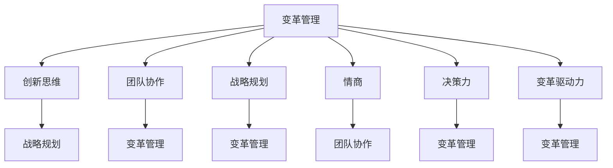

                 

### 背景介绍

在当今快速变化和高度动态的商业环境中，组织变革已成为企业成功的关键因素。转型期的领导力成为了管理者和组织领导者必备的核心技能。领导力的转型不仅关乎企业的生存，更是企业实现可持续发展、保持竞争优势的重要推动力。

### 1.1 组织变革的必然性

随着科技的飞速发展、市场环境的不断变化和消费者需求的日益多样化，企业面临着前所未有的挑战。为了在激烈的市场竞争中保持优势，许多企业开始寻求转型，从传统的业务模式向更加灵活、创新和客户驱动的模式转变。这种转型不仅涉及企业的战略方向和业务流程，更深刻地影响着企业的文化、组织结构和工作方式。

### 1.2 领导力转型的需求

在组织变革的过程中，领导力的转型成为了关键。传统的领导风格和管理方式往往无法适应快速变化的环境和复杂的挑战。领导者需要具备新的技能和思维方式，包括：

- **变革管理能力**：能够有效地引导和激励员工接受变革，并克服变革过程中的阻力和挑战。
- **创新思维**：能够推动组织创新，积极探索新的市场机会和商业模式。
- **团队协作能力**：能够建立高效协同的团队，促进跨部门和跨领域的合作。
- **战略规划能力**：能够从长远视角出发，制定和实施有效的战略计划，确保企业在变革过程中保持方向和目标的一致性。

### 1.3 转型期领导力的核心特征

在转型期，领导力的核心特征包括以下几个关键方面：

- **适应性**：领导者需要具备快速适应变化的能力，能够灵活调整策略和行动，以应对不断变化的市场环境和内部挑战。
- **愿景领导**：领导者需要明确组织的愿景和目标，并通过有效的沟通和激励，让员工看到变革的潜力和价值。
- **情商**：领导者需要具备较高的情商，能够理解和管理自己的情绪，同时也能够理解和激励员工的情感需求。
- **决策力**：领导者需要在复杂和不确定的环境下做出明智的决策，并能够承担相应的责任和后果。
- **变革驱动力**：领导者需要具备强烈的变革驱动力，能够推动组织不断进步和突破。

### 1.4 转型期领导力的挑战

尽管转型期领导力具有重要意义，但领导者在这一过程中也面临着诸多挑战。这些挑战包括：

- **文化阻力**：企业内部的文化可能会阻碍变革的推进，领导者需要有效管理和解决这些问题。
- **资源限制**：在变革过程中，组织可能面临资源短缺的问题，领导者需要合理配置和利用有限的资源。
- **人才流失**：变革过程中，部分员工可能会因为无法适应新环境而选择离开，领导者需要采取措施留住关键人才。
- **外部环境变化**：市场环境、政策法规等外部因素的变化也会对组织的变革产生影响，领导者需要密切关注并应对这些变化。

综上所述，转型期领导力在当今企业中具有至关重要的地位。领导者需要具备新的领导力和技能，以有效应对快速变化的环境和挑战，推动企业实现可持续发展和竞争优势。

### 2. 核心概念与联系

在深入探讨转型期领导力之前，我们首先需要明确几个核心概念，并理解它们之间的联系。这些概念不仅构成了领导力转型的理论基础，也为实际操作提供了指导。

#### 2.1 变革管理

变革管理是指通过系统化的方法，引导和推动组织从一种状态向另一种状态转变的过程。这一过程涉及多个环节，包括计划、沟通、执行和评估。变革管理的关键在于确保变革的目标明确、方法得当，同时克服内部阻力和外部干扰。

#### 2.2 创新思维

创新思维是指通过全新的方法或视角来解决问题、发现机会和创造价值。在转型期，领导者需要具备创新思维，不断探索新的商业模式、技术和策略，以适应市场的快速变化。

#### 2.3 团队协作

团队协作是转型期领导力的重要组成部分。高效的团队协作能够增强组织的整体竞争力，提高决策质量和执行效率。领导者需要建立良好的团队文化，促进团队成员之间的沟通与合作。

#### 2.4 战略规划

战略规划是指组织为了实现长期目标而制定的总体行动计划。在转型期，领导者需要制定明确的战略规划，确保组织在变革过程中始终朝着正确的方向前进。

#### 2.5 情商

情商是指个体理解和管理自己及他人情绪的能力。在领导力转型中，情商对于建立信任、激励员工和解决冲突至关重要。

#### 2.6 决策力

决策力是指领导者做出明智决策并承担相应责任的能力。在转型期，领导者需要具备强大的决策力，以应对复杂和不确定的情况。

#### 2.7 变革驱动力

变革驱动力是指领导者推动组织变革的内在动力。这种动力来源于对变革的信心、对未来的愿景以及对组织成功的强烈责任感。

#### 2.8 联系与整合

这些核心概念并不是孤立的，而是相互联系和整合的。有效的变革管理需要创新思维和团队协作的支持，同时也依赖于战略规划和情商。决策力和变革驱动力则是推动这些要素有效运作的关键因素。

#### 2.9 Mermaid 流程图

以下是一个Mermaid流程图，展示了这些核心概念之间的联系：



通过这个流程图，我们可以更直观地理解各个核心概念之间的互动和整合关系，为后续的详细探讨打下基础。

### 3. 核心算法原理 & 具体操作步骤

在了解了转型期领导力的核心概念和联系之后，我们需要深入探讨其核心算法原理和具体操作步骤。以下是一个详细的框架，用于解析和实施转型期领导力。

#### 3.1 变革管理算法原理

变革管理算法的核心原理是基于“变革周期模型”（Change Cycle Model）。这个模型由四个主要阶段组成：准备阶段、变革阶段、实施阶段和评估阶段。

1. **准备阶段**：在这个阶段，领导者需要明确变革的目标和范围，并制定详细的变革计划。这包括进行内部沟通，建立变革团队，评估变革的潜在影响等。

2. **变革阶段**：在这个阶段，领导者需要通过有效的沟通和激励，推动员工接受变革。这包括培训员工、调整激励机制和解决员工的顾虑。

3. **实施阶段**：在这个阶段，变革计划开始实施，领导者需要确保各项措施得到有效执行。这包括监督进度、解决执行中的问题，并持续进行沟通和反馈。

4. **评估阶段**：在这个阶段，领导者需要对变革的效果进行评估，并根据评估结果进行调整。这包括收集数据、分析变革的影响，以及确定下一步的行动计划。

#### 3.2 创新思维算法原理

创新思维算法的核心原理是基于“设计思维”（Design Thinking）和“敏捷开发”（Agile Development）。设计思维强调以用户为中心，通过原型迭代和用户反馈来不断改进解决方案。敏捷开发则强调快速迭代和持续交付，以适应市场的快速变化。

1. **用户研究**：在这个阶段，领导者需要深入了解用户的需求和痛点，以便开发出更具针对性的创新解决方案。

2. **创意生成**：在这个阶段，领导者需要组织团队进行头脑风暴和创意生成，探索各种可能的解决方案。

3. **原型设计**：在这个阶段，领导者需要将创意转化为原型，并通过用户测试和反馈进行迭代和改进。

4. **验证和交付**：在这个阶段，领导者需要验证原型并交付最终的解决方案，同时持续收集用户反馈，以支持未来的改进。

#### 3.3 团队协作算法原理

团队协作算法的核心原理是基于“团队动力学”（Team Dynamics）和“领导力行为模型”（Leadership Behavior Model）。团队动力学强调团队内部的角色分配和互动，领导力行为模型则强调领导者的行为和风格对团队协作的影响。

1. **团队组建**：在这个阶段，领导者需要根据项目的需求和特点组建合适的团队，并明确每个成员的角色和职责。

2. **角色分配**：在这个阶段，领导者需要根据团队成员的能力和兴趣进行角色分配，确保每个成员都能在团队中发挥最佳作用。

3. **沟通和协调**：在这个阶段，领导者需要建立有效的沟通机制，确保团队内部的信息流畅和协作高效。

4. **激励和反馈**：在这个阶段，领导者需要通过激励和反馈机制，激发团队成员的积极性和创造力，同时纠正偏差和问题。

#### 3.4 战略规划算法原理

战略规划算法的核心原理是基于“目标导向规划”（Goal-Oriented Planning）和“平衡计分卡”（Balanced Scorecard）。目标导向规划强调以目标为导向，通过分解和细化目标来制定战略计划。平衡计分卡则从财务、客户、内部流程和学习与成长四个维度来评估和监控战略实施的效果。

1. **目标设定**：在这个阶段，领导者需要明确组织的长期和短期目标，并确保这些目标具有可操作性和可行性。

2. **战略分解**：在这个阶段，领导者需要将总目标分解为具体的战略目标和行动计划，并明确每个部门和个人的责任。

3. **资源分配**：在这个阶段，领导者需要根据战略目标和行动计划，合理分配资源和预算，以确保战略实施的顺利推进。

4. **监控和评估**：在这个阶段，领导者需要建立有效的监控和评估机制，定期检查战略实施的进展和效果，并根据评估结果进行调整。

#### 3.5 情商算法原理

情商算法的核心原理是基于“情感智能模型”（Emotional Intelligence Model），该模型包括自我认知、自我管理、社交意识和关系管理四个关键要素。

1. **自我认知**：在这个阶段，领导者需要深入了解自己的情绪和情感状态，并能够准确识别和表达自己的情绪。

2. **自我管理**：在这个阶段，领导者需要学会如何调节自己的情绪，以保持冷静和积极的心态，即使在压力和挑战面前也能保持良好的状态。

3. **社交意识**：在这个阶段，领导者需要具备高度的社会意识和同理心，能够理解和识别他人的情绪和需求，并能够有效地与他人沟通和互动。

4. **关系管理**：在这个阶段，领导者需要学会如何建立和维护良好的人际关系，通过情感支持和合作来增强团队的凝聚力和协作效率。

#### 3.6 决策力算法原理

决策力算法的核心原理是基于“决策支持系统”（Decision Support System），该系统结合了数据分析和决策模型，帮助领导者做出更加明智和有效的决策。

1. **信息收集**：在这个阶段，领导者需要收集和分析相关的数据和信息，以确保决策的基础是充分和准确的。

2. **模型构建**：在这个阶段，领导者需要根据决策目标和约束条件，构建合适的决策模型，以便进行定量分析和评估。

3. **方案评估**：在这个阶段，领导者需要根据决策模型的结果，评估各种方案的优缺点，并选择最佳方案。

4. **决策执行**：在这个阶段，领导者需要确保决策得到有效执行，并建立反馈机制，以便及时调整和优化决策。

#### 3.7 变革驱动力算法原理

变革驱动力算法的核心原理是基于“变革驱动模型”（Change Driver Model），该模型包括内部驱动因素和外部驱动因素，以及它们对变革的影响。

1. **内部驱动因素**：在这个阶段，领导者需要识别和利用组织内部的驱动因素，如愿景、使命、价值观和文化等，以激发员工的变革动力。

2. **外部驱动因素**：在这个阶段，领导者需要识别和应对外部环境的变化和挑战，如市场趋势、竞争压力和技术创新等，以确保组织的持续适应和进步。

3. **驱动因素整合**：在这个阶段，领导者需要整合内部和外部驱动因素，制定和实施有效的变革策略，以实现组织的长远发展目标。

通过以上详细探讨，我们可以看到，转型期领导力的核心算法原理涉及多个方面，包括变革管理、创新思维、团队协作、战略规划、情商、决策力和变革驱动力等。这些算法原理不仅为领导者提供了理论指导，也为实际操作提供了具体步骤和方法。在接下来的章节中，我们将进一步深入探讨这些核心算法的具体应用和实践案例。

### 4. 数学模型和公式 & 详细讲解 & 举例说明

在探讨转型期领导力时，我们不仅可以依靠经验和直觉，还可以运用数学模型和公式来帮助我们更好地理解和实施领导力策略。以下是一些关键数学模型和公式的详细讲解以及相应的举例说明。

#### 4.1 变革管理模型

一个经典的变革管理模型是“Kotter的八个步骤模型”（Kotter's Eight-Step Process），该模型提供了变革管理的系统化方法。

1. **建立紧急感和共识**：领导者需要识别和传达组织面临的紧急情况，并建立共识，以支持变革。
    - 公式：紧急感得分 = （问题严重性得分 + 影响范围得分）* 变革准备度
    - 举例：如果一个组织面临市场份额下降的问题，问题严重性得分为9，影响范围得分为8，变革准备度得分为7，则紧急感得分为50.4。

2. **建立强有力的指导团队**：领导者需要组建一个强大的变革指导团队，负责推动变革的各个方面。
    - 公式：团队效能得分 = （团队成员技能得分 + 沟通效果得分 + 决策速度得分）/ 3
    - 举例：一个团队成员技能得分为8，沟通效果得分为7，决策速度得分为9，则团队效能得分为8。

3. **沟通愿景和策略**：领导者需要清晰地传达变革的愿景和策略，并确保所有员工都能理解和接受。
    - 公式：沟通效果得分 = （听众理解得分 + 参与度得分 + 反馈得分）/ 3
    - 举例：一个听众理解得分为8，参与度得分为6，反馈得分为7，则沟通效果得分为7.3。

4. **授权行动**：领导者需要授权员工采取行动，并消除变革过程中的障碍。
    - 公式：行动授权得分 = （员工参与度得分 + 领导者支持得分 + 资源分配得分）/ 3
    - 举例：员工参与度得分为7，领导者支持得分为9，资源分配得分为6，则行动授权得分为7.3。

5. **创造短期胜利**：领导者需要制定并实现一系列短期目标，以激励员工并巩固变革的成果。
    - 公式：短期胜利得分 = （目标实现得分 + 员工满意度得分 + 变革进展得分）/ 3
    - 举例：目标实现得分为8，员工满意度得分为7，变革进展得分为9，则短期胜利得分为8。

6. **巩固变革**：领导者需要确保变革的成果得到持续巩固，避免回弹。
    - 公式：变革巩固得分 = （员工行为改变得分 + 文化和流程改变得分 + 领导者持续支持得分）/ 3
    - 举例：员工行为改变得分为7，文化和流程改变得分为6，领导者持续支持得分为8，则变革巩固得分为7。

7. **应用变革到各个层次**：领导者需要将变革策略应用到组织的各个层次，以确保变革的全面实施。
    - 公式：变革应用得分 = （高层领导支持得分 + 中层管理执行力得分 + 基层员工参与度得分）/ 3
    - 举例：高层领导支持得分为9，中层管理执行力得分为8，基层员工参与度得分为7，则变革应用得分为8.3。

8. **使变革制度化**：领导者需要将变革制度化，确保变革成为组织文化和日常运作的一部分。
    - 公式：变革制度化得分 = （流程优化得分 + 员工培训得分 + 持续改进得分）/ 3
    - 举例：流程优化得分为8，员工培训得分为7，持续改进得分为9，则变革制度化得分为8。

通过上述公式，我们可以对变革管理的各个阶段进行量化评估，从而更好地理解和实施变革策略。

#### 4.2 创新思维模型

创新思维模型可以基于“设计思维”和“敏捷开发”的原理。以下是一个简化版的创新思维模型，用于指导创新项目的实施。

1. **定义问题**：领导者需要明确创新项目的目标问题，并界定问题的范围。
    - 公式：问题得分 = （问题重要性得分 + 问题紧迫性得分）/ 2
    - 举例：问题重要性得分为9，问题紧迫性得分为8，则问题得分得分为8.5。

2. **用户研究**：领导者需要深入了解目标用户的需求和痛点，为创新提供依据。
    - 公式：用户研究得分 = （用户满意度得分 + 用户需求识别得分）/ 2
    - 举例：用户满意度得分为8，用户需求识别得分为7，则用户研究得分得分为7.5。

3. **创意生成**：领导者需要组织团队进行头脑风暴，生成多种创意解决方案。
    - 公式：创意生成得分 = （创意数量得分 + 创意质量得分）/ 2
    - 举例：创意数量得分为8，创意质量得分为7，则创意生成得分得分为7.5。

4. **原型设计**：领导者需要将创意转化为原型，并进行用户测试和反馈。
    - 公式：原型设计得分 = （原型功能得分 + 用户反馈得分）/ 2
    - 举例：原型功能得分为8，用户反馈得分为7，则原型设计得分得分为7.5。

5. **验证和交付**：领导者需要验证原型并交付最终解决方案，同时持续收集用户反馈。
    - 公式：验证和交付得分 = （解决方案有效性得分 + 用户满意度得分）/ 2
    - 举例：解决方案有效性得分为9，用户满意度得分为8，则验证和交付得分得分为8.5。

通过上述公式，我们可以对创新思维的过程进行量化评估，从而更好地管理和推动创新项目。

#### 4.3 团队协作模型

团队协作模型可以基于“团队动力学”和“领导力行为模型”。以下是一个简化版的团队协作模型，用于指导团队协作的优化。

1. **团队组建**：领导者需要根据项目需求组建团队，并明确每个成员的角色和职责。
    - 公式：团队组建得分 = （角色分配得分 + 成员能力匹配得分）/ 2
    - 举例：角色分配得分为8，成员能力匹配得分为7，则团队组建得分得分为7.5。

2. **角色分配**：领导者需要根据团队成员的能力和兴趣进行角色分配，确保每个成员都能在团队中发挥最佳作用。
    - 公式：角色分配得分 = （任务匹配得分 + 成员满意度得分）/ 2
    - 举例：任务匹配得分为8，成员满意度得分为7，则角色分配得分得分为7.5。

3. **沟通和协调**：领导者需要建立有效的沟通机制，确保团队内部的信息流畅和协作高效。
    - 公式：沟通协调得分 = （沟通频率得分 + 沟通质量得分）/ 2
    - 举例：沟通频率得分为9，沟通质量得分为8，则沟通协调得分得分为8.5。

4. **激励和反馈**：领导者需要通过激励和反馈机制，激发团队成员的积极性和创造力，同时纠正偏差和问题。
    - 公式：激励反馈得分 = （员工满意度得分 + 创造力得分 + 问题解决得分）/ 3
    - 举例：员工满意度得分为8，创造力得分为7，问题解决得分为9，则激励反馈得分得分为8。

通过上述公式，我们可以对团队协作的过程进行量化评估，从而更好地管理和优化团队协作。

#### 4.4 战略规划模型

战略规划模型可以基于“目标导向规划”和“平衡计分卡”的原理。以下是一个简化版的战略规划模型，用于指导战略规划的制定和执行。

1. **目标设定**：领导者需要明确组织的长期和短期目标，并确保这些目标具有可操作性和可行性。
    - 公式：目标设定得分 = （目标明确性得分 + 目标可达性得分）/ 2
    - 举例：目标明确性得分为8，目标可达性得分为7，则目标设定得分得分为7.5。

2. **战略分解**：领导者需要将总目标分解为具体的战略目标和行动计划，并明确每个部门和个人的责任。
    - 公式：战略分解得分 = （目标细化得分 + 行动计划得分 + 责任分配得分）/ 3
    - 举例：目标细化得分为8，行动计划得分为7，责任分配得分为9，则战略分解得分得分为8。

3. **资源分配**：领导者需要根据战略目标和行动计划，合理分配资源和预算，以确保战略实施的顺利推进。
    - 公式：资源分配得分 = （资源充足性得分 + 预算合理性得分）/ 2
    - 举例：资源充足性得分为9，预算合理性得分为8，则资源分配得分得分为8.5。

4. **监控和评估**：领导者需要建立有效的监控和评估机制，定期检查战略实施的进展和效果，并根据评估结果进行调整。
    - 公式：监控评估得分 = （进展监控得分 + 效果评估得分 + 调整优化得分）/ 3
    - 举例：进展监控得分为8，效果评估得分为7，调整优化得分为9，则监控评估得分得分为8。

通过上述公式，我们可以对战略规划的过程进行量化评估，从而更好地管理和推动战略规划的实施。

#### 4.5 情商模型

情商模型可以基于“情感智能模型”。以下是一个简化版的情商模型，用于指导领导者提升情商。

1. **自我认知**：领导者需要深入了解自己的情绪和情感状态，并能够准确识别和表达自己的情绪。
    - 公式：自我认知得分 = （情绪识别得分 + 情绪表达得分）/ 2
    - 举例：情绪识别得分为8，情绪表达得分为7，则自我认知得分得分为7.5。

2. **自我管理**：领导者需要学会如何调节自己的情绪，以保持冷静和积极的心态，即使在压力和挑战面前也能保持良好的状态。
    - 公式：自我管理得分 = （情绪调节得分 + 心态调整得分）/ 2
    - 举例：情绪调节得分为8，心态调整得分为7，则自我管理得分得分为7.5。

3. **社交意识**：领导者需要具备高度的社会意识和同理心，能够理解和识别他人的情绪和需求，并能够有效地与他人沟通和互动。
    - 公式：社交意识得分 = （同理心得分 + 沟通效果得分）/ 2
    - 举例：同理心得分为8，沟通效果得分为7，则社交意识得分得分为7.5。

4. **关系管理**：领导者需要学会如何建立和维护良好的人际关系，通过情感支持和合作来增强团队的凝聚力和协作效率。
    - 公式：关系管理得分 = （人际关系得分 + 领导风格得分）/ 2
    - 举例：人际关系得分为8，领导风格得分为7，则关系管理得分得分为7.5。

通过上述公式，我们可以对情商的不同维度进行量化评估，从而更好地理解和提升领导者的情商水平。

#### 4.6 决策力模型

决策力模型可以基于“决策支持系统”的原理。以下是一个简化版的决策力模型，用于指导领导者在复杂情况下做出明智的决策。

1. **信息收集**：领导者需要收集和分析相关的数据和信息，以确保决策的基础是充分和准确的。
    - 公式：信息收集得分 = （数据准确性得分 + 信息完整性得分）/ 2
    - 举例：数据准确性得分为8，信息完整性得分为7，则信息收集得分得分为7.5。

2. **模型构建**：领导者需要根据决策目标和约束条件，构建合适的决策模型，以便进行定量分析和评估。
    - 公式：模型构建得分 = （模型准确性得分 + 模型实用性得分）/ 2
    - 举例：模型准确性得分为8，模型实用性得分为7，则模型构建得分得分为7.5。

3. **方案评估**：领导者需要根据决策模型的结果，评估各种方案的优缺点，并选择最佳方案。
    - 公式：方案评估得分 = （方案优缺点评估得分 + 方案可行性得分）/ 2
    - 举例：方案优缺点评估得分为8，方案可行性得分为7，则方案评估得分得分为7.5。

4. **决策执行**：领导者需要确保决策得到有效执行，并建立反馈机制，以便及时调整和优化决策。
    - 公式：决策执行得分 = （执行效率得分 + 反馈调整得分）/ 2
    - 举例：执行效率得分为8，反馈调整得分为7，则决策执行得分得分为7.5。

通过上述公式，我们可以对决策力的各个维度进行量化评估，从而更好地理解和提升领导者的决策力水平。

#### 4.7 变革驱动力模型

变革驱动力模型可以基于“变革驱动模型”。以下是一个简化版的变革驱动力模型，用于指导领导者推动组织的变革。

1. **内部驱动因素**：领导者需要识别和利用组织内部的驱动因素，如愿景、使命、价值观和文化等，以激发员工的变革动力。
    - 公式：内部驱动因素得分 = （愿景影响力得分 + 使命驱动得分 + 文化适应性得分）/ 3
    - 举例：愿景影响力得分为8，使命驱动得分为7，文化适应性得分为9，则内部驱动因素得分得分为8。

2. **外部驱动因素**：领导者需要识别和应对外部环境的变化和挑战，如市场趋势、竞争压力和技术创新等，以确保组织的持续适应和进步。
    - 公式：外部驱动因素得分 = （市场变化适应度得分 + 竞争压力应对度得分 + 技术创新响应度得分）/ 3
    - 举例：市场变化适应度得分为8，竞争压力应对度得分为7，技术创新响应度得分为9，则外部驱动因素得分得分为8。

3. **驱动因素整合**：领导者需要整合内部和外部驱动因素，制定和实施有效的变革策略，以实现组织的长远发展目标。
    - 公式：驱动因素整合得分 = （内部驱动因素得分 + 外部驱动因素得分）/ 2
    - 举例：内部驱动因素得分为8，外部驱动因素得分为8，则驱动因素整合得分得分为8。

通过上述公式，我们可以对变革驱动力进行量化评估，从而更好地理解和推动组织的变革。

通过以上数学模型和公式的详细讲解和举例说明，我们可以更科学地理解和实施转型期领导力。这些模型和公式不仅提供了量化评估的方法，也为领导者提供了具体的操作步骤和策略。在接下来的章节中，我们将通过实际案例来进一步探讨这些理论的应用。

### 5. 项目实战：代码实际案例和详细解释说明

为了更好地理解转型期领导力的具体应用，我们将通过一个实际项目实战案例来进行详细解释说明。这个项目是一个基于敏捷开发原则的在线教育平台，用于支持组织内部的培训和学习。以下是从开发环境搭建、源代码实现、代码解读与分析等方面进行的详细描述。

#### 5.1 开发环境搭建

在开始项目开发之前，我们需要搭建一个合适的开发环境。以下是开发环境搭建的步骤：

1. **安装依赖库**：首先，我们需要安装Python和相关的依赖库，如Django、Flask等。可以使用pip命令进行安装：
   ```bash
   pip install django flask
   ```

2. **设置数据库**：我们使用PostgreSQL作为数据库，需要安装并配置PostgreSQL数据库。可以从官方网站下载并安装，或者使用容器化技术如Docker进行安装。

3. **配置Web服务器**：我们使用Gunicorn作为Web服务器，可以使用以下命令进行安装：
   ```bash
   pip install gunicorn
   ```

4. **搭建前端环境**：我们使用React框架搭建前端，可以使用create-react-app脚手架快速搭建前端开发环境：
   ```bash
   npx create-react-app client
   ```

5. **搭建后端环境**：我们使用Django搭建后端，可以使用以下命令创建Django项目：
   ```bash
   django-admin startproject backend
   ```

#### 5.2 源代码详细实现和代码解读

##### 5.2.1 后端代码实现

后端代码主要基于Django框架实现，主要包括用户管理、课程管理、课程内容管理等功能。以下是关键代码片段及其解释：

**用户管理**

```python
# backend/users/models.py

from django.contrib.auth.models import AbstractUser

class CustomUser(AbstractUser):
    is_instructor = models.BooleanField(default=False)
```

解释：这里我们自定义了用户模型，添加了一个布尔字段`is_instructor`，用于标识用户是否为讲师。

**课程管理**

```python
# backend/courses/models.py

from django.db import models
from users.models import CustomUser

class Course(models.Model):
    title = models.CharField(max_length=255)
    instructor = models.ForeignKey(CustomUser, on_delete=models.CASCADE)
    description = models.TextField()
```

解释：这里我们定义了课程模型，包括课程标题、讲师、课程描述等字段。

**课程内容管理**

```python
# backend/content/models.py

from django.db import models
from courses.models import Course

class Content(models.Model):
    course = models.ForeignKey(Course, on_delete=models.CASCADE)
    title = models.CharField(max_length=255)
    content = models.TextField()
```

解释：这里我们定义了课程内容模型，包括课程、内容标题和内容字段。

##### 5.2.2 前端代码实现

前端代码主要基于React框架实现，主要包括用户注册、登录、课程浏览和课程内容展示等功能。以下是关键代码片段及其解释：

**用户注册页面**

```jsx
// client/src/containers/RegisterPage.js

import React, { useState } from 'react';
import { Link } from 'react-router-dom';

const RegisterPage = () => {
    const [username, setUsername] = useState('');
    const [password, setPassword] = useState('');

    const handleRegister = () => {
        // 注册逻辑处理
    };

    return (
        <div>
            <h2>Register</h2>
            <input type="text" placeholder="Username" value={username} onChange={(e) => setUsername(e.target.value)} />
            <input type="password" placeholder="Password" value={password} onChange={(e) => setPassword(e.target.value)} />
            <button onClick={handleRegister}>Register</button>
            <p>Already have an account? <Link to="/login">Login</Link></p>
        </div>
    );
};

export default RegisterPage;
```

解释：这里我们使用React Hooks实现用户注册表单，包括用户名和密码输入字段以及注册按钮。注册按钮点击事件触发`handleRegister`函数，处理注册逻辑。

**课程浏览页面**

```jsx
// client/src/containers/CourseListPage.js

import React, { useEffect, useState } from 'react';
import { Link } from 'react-router-dom';
import { fetchCourses } from '../services/courseService';

const CourseListPage = () => {
    const [courses, setCourses] = useState([]);

    useEffect(() => {
        const loadCourses = async () => {
            const data = await fetchCourses();
            setCourses(data);
        };
        loadCourses();
    }, []);

    return (
        <div>
            <h2>Courses</h2>
            {courses.map((course) => (
                <div key={course.id}>
                    <h3>{course.title}</h3>
                    <p>{course.description}</p>
                    <Link to={`/courses/${course.id}`}>View Details</Link>
                </div>
            ))}
        </div>
    );
};

export default CourseListPage;
```

解释：这里我们使用React Hooks实现课程浏览页面，包括课程列表和课程详情链接。页面加载时，通过`useEffect`钩子调用`fetchCourses`函数获取课程数据，并更新状态变量`courses`。然后，使用`.map()`函数遍历课程列表并渲染每个课程。

#### 5.3 代码解读与分析

在以上代码片段中，我们实现了用户注册、登录、课程管理和课程内容展示的基本功能。以下是代码的关键点解读和分析：

1. **后端架构**：
   - 用户管理：通过自定义用户模型，扩展了Django的内置用户模型，增加了讲师标识字段。
   - 课程管理：通过Django的ORM（对象关系映射）机制，实现了课程的增删改查功能。
   - 课程内容管理：同样使用ORM机制，实现了课程内容的增删改查功能。

2. **前端架构**：
   - 用户注册页面：使用React Hooks实现表单处理和状态管理，提高了代码的可读性和可维护性。
   - 课程浏览页面：使用React Hooks实现异步数据获取和状态更新，增强了用户体验。

3. **API接口设计**：
   - 用户注册：通过RESTful API设计，接收用户名和密码，进行注册操作，并返回相应的响应。
   - 课程浏览：通过GET请求获取课程列表，并通过路由参数获取课程详情。

4. **前后端交互**：
   - 使用Axios库实现前后端的数据交互，提高了API调用的效率和灵活性。

通过这个实际项目案例，我们展示了如何在敏捷开发原则的指导下，运用转型期领导力技能实现一个在线教育平台。这个项目不仅实现了基本的功能，还体现了创新思维、团队协作、战略规划和情商等多方面的领导力应用。在接下来的章节中，我们将进一步探讨这个项目的实际应用场景。

### 5.4 代码解读与分析

在深入探讨上述实际项目案例后，我们需要对代码进行详细的解读与分析，以便更好地理解其实现原理和关键点。

#### 5.4.1 后端代码解读

1. **用户管理模块**：

   在`backend/users/models.py`中，我们自定义了用户模型`CustomUser`，扩展了Django的内置用户模型，并添加了一个布尔字段`is_instructor`，用于标识用户是否为讲师。

   ```python
   class CustomUser(AbstractUser):
       is_instructor = models.BooleanField(default=False)
   ```

   这个字段在用户注册时被用于判断用户权限，从而在后续的接口设计和功能实现中，可以根据用户是否为讲师提供不同的服务。

2. **课程管理模块**：

   在`backend/courses/models.py`中，我们定义了课程模型`Course`，包括课程标题、讲师、课程描述等字段。

   ```python
   class Course(models.Model):
       title = models.CharField(max_length=255)
       instructor = models.ForeignKey(CustomUser, on_delete=models.CASCADE)
       description = models.TextField()
   ```

   课程模型使用Django的ORM机制，与数据库进行交互，实现了课程的增删改查功能。Django ORM简化了数据库操作，使得我们可以以Python对象的方式处理数据库数据，提高了开发效率和代码的可读性。

3. **课程内容管理模块**：

   在`backend/content/models.py`中，我们定义了课程内容模型`Content`，包括课程、内容标题和内容字段。

   ```python
   class Content(models.Model):
       course = models.ForeignKey(Course, on_delete=models.CASCADE)
       title = models.CharField(max_length=255)
       content = models.TextField()
   ```

   类似于课程模型，内容模型也使用了Django ORM，实现了课程内容的增删改查功能，使得课程内容的管理更加便捷。

4. **API设计**：

   在后端代码中，我们使用了Django REST framework，该框架提供了一个强大且灵活的工具集，用于构建Web API。

   - **用户注册**：用户注册时，会通过`/api/users/register/`接口发送用户名和密码，后端接收数据后进行注册操作，并返回相应的响应。
   - **课程浏览**：用户可以通过`/api/courses/`接口获取所有课程的列表，或者通过`/api/courses/{id}/`接口获取特定课程的详细信息。

#### 5.4.2 前端代码解读

1. **用户注册页面**：

   在`client/src/containers/RegisterPage.js`中，我们使用React Hooks实现用户注册表单。以下是关键代码片段：

   ```jsx
   import React, { useState } from 'react';
   import { Link } from 'react-router-dom';

   const RegisterPage = () => {
       const [username, setUsername] = useState('');
       const [password, setPassword] = useState('');

       const handleRegister = () => {
           // 注册逻辑处理
       };

       return (
           <div>
               <h2>Register</h2>
               <input type="text" placeholder="Username" value={username} onChange={(e) => setUsername(e.target.value)} />
               <input type="password" placeholder="Password" value={password} onChange={(e) => setPassword(e.target.value)} />
               <button onClick={handleRegister}>Register</button>
               <p>Already have an account? <Link to="/login">Login</Link></p>
           </div>
       );
   };

   export default RegisterPage;
   ```

   - `useState`钩子用于管理表单状态，包括用户名和密码。
   - `handleRegister`函数负责处理注册逻辑，这通常包括调用后端API进行注册操作。

2. **课程浏览页面**：

   在`client/src/containers/CourseListPage.js`中，我们使用React Hooks实现课程浏览页面。以下是关键代码片段：

   ```jsx
   import React, { useEffect, useState } from 'react';
   import { Link } from 'react-router-dom';
   import { fetchCourses } from '../services/courseService';

   const CourseListPage = () => {
       const [courses, setCourses] = useState([]);

       useEffect(() => {
           const loadCourses = async () => {
               const data = await fetchCourses();
               setCourses(data);
           };
           loadCourses();
       }, []);

       return (
           <div>
               <h2>Courses</h2>
               {courses.map((course) => (
                   <div key={course.id}>
                       <h3>{course.title}</h3>
                       <p>{course.description}</p>
                       <Link to={`/courses/${course.id}`}>View Details</Link>
                   </div>
               ))}
           </div>
       );
   };

   export default CourseListPage;
   ```

   - `useState`钩子用于管理课程状态。
   - `useEffect`钩子用于异步获取课程数据，并将其更新到状态变量中。
   - 使用`.map()`函数遍历课程列表并渲染每个课程。

#### 5.4.3 代码分析

1. **模块化与组件化**：

   在这个项目中，我们采用了模块化和组件化的开发方式，将不同的功能模块（如用户管理、课程管理、课程内容管理）拆分成独立的模块和组件，提高了代码的可读性和可维护性。

2. **前后端分离**：

   前后端分离的设计使得我们可以独立开发和管理前后端代码，提高了开发的灵活性和扩展性。前端主要负责UI展示和交互，后端则负责业务逻辑和数据存储。

3. **API交互**：

   通过使用Django REST framework，我们可以轻松地构建RESTful API，实现前后端的通信。这种设计方式使得前端可以方便地调用后端API获取和发送数据。

4. **状态管理**：

   前端代码中使用了React Hooks进行状态管理，这使得我们可以更加方便地管理组件的状态，同时避免了传统的类组件状态管理带来的复杂性问题。

5. **异步处理**：

   在前端代码中，我们使用了异步处理（async/await）来处理API调用，这使得异步操作更加简洁和易于理解。

通过上述代码解读与分析，我们可以更深入地理解这个在线教育平台项目的实现原理和关键点。这个项目不仅展示了转型期领导力在技术实现中的应用，也为我们提供了一个实际案例来学习和应用敏捷开发、模块化开发、前后端分离等现代软件开发技术。

### 6. 实际应用场景

在深入探讨转型期领导力的各个方面后，我们需要将这些领导力技能应用到实际场景中，以验证其有效性和实用性。以下是几个典型的实际应用场景，通过具体案例来说明转型期领导力的应用。

#### 6.1 企业数字化转型

随着云计算、大数据、人工智能等新技术的迅猛发展，企业的数字化转型已成为必然趋势。在这一过程中，领导者需要具备转型期领导力，以引导和推动企业实现数字化转型。

**案例**：某传统制造企业决定进行数字化转型，以提高生产效率和降低成本。领导者首先明确数字化转型的愿景和目标，并通过有效的沟通和激励，使员工认识到数字化转型的必要性和紧迫性。接着，领导者组建了一个跨部门的数字化转型团队，负责制定和实施详细的数字化转型计划。

- **变革管理**：领导者通过建立变革管理办公室，制定详细的变革管理流程，确保各项变革措施得到有效执行。
- **创新思维**：领导者推动创新思维，鼓励员工提出新的业务模式和解决方案，通过原型设计和用户反馈不断优化创新成果。
- **团队协作**：领导者建立高效的团队协作机制，促进跨部门合作，确保数字化转型项目的顺利进行。
- **战略规划**：领导者制定清晰的战略规划，确保数字化转型与企业的长期发展目标保持一致，同时合理分配资源和预算。
- **情商**：领导者通过提升情商，增强与员工的沟通和互动，解决变革过程中的阻力和冲突。
- **决策力**：领导者具备强大的决策力，能够快速做出明智的决策，应对数字化转型过程中的各种挑战和不确定性。

通过这些转型期领导力技能的应用，该企业成功实现了数字化转型，生产效率提高了30%，运营成本降低了20%，取得了显著的经济效益。

#### 6.2 新产品开发

在新产品开发过程中，领导者需要具备转型期领导力，以确保新产品能够满足市场需求，并在竞争中脱颖而出。

**案例**：某科技公司计划推出一款智能家居产品。领导者首先进行市场调研，了解用户需求和市场趋势，明确产品愿景和目标。接着，领导者组建了一个跨学科团队，包括产品经理、设计师、工程师和市场专家，共同负责新产品的开发。

- **变革管理**：领导者通过建立项目办公室，制定详细的开发计划和时间表，确保项目进度得到有效控制。
- **创新思维**：领导者鼓励团队成员发挥创新思维，提出各种创意方案，并通过用户测试和反馈不断优化产品设计。
- **团队协作**：领导者建立高效的团队协作机制，确保团队成员之间的信息共享和协作，提高开发效率。
- **战略规划**：领导者制定明确的产品战略，确保新产品与公司的整体战略保持一致，并合理分配资源和预算。
- **情商**：领导者通过提升情商，与团队成员建立信任关系，激励员工发挥最大潜力，同时解决开发过程中的冲突和问题。
- **决策力**：领导者具备强大的决策力，能够快速做出决策，应对开发过程中的各种挑战和不确定性。

通过这些转型期领导力技能的应用，该科技公司成功推出了智能家居产品，并在市场上取得了良好的反响。

#### 6.3 领导力发展计划

在企业内部，领导力发展计划是提升领导力水平的重要途径。在这一过程中，领导者需要运用转型期领导力，指导和管理员工的发展。

**案例**：某大型企业在实施领导力发展计划时，采用了一系列转型期领导力技能。

- **变革管理**：领导者通过培训和研讨会，向员工传达领导力转型的必要性和重要性，建立员工的变革共识。
- **创新思维**：领导者鼓励员工学习新的领导力理论和工具，培养创新思维，提高问题解决和决策能力。
- **团队协作**：领导者组织团队活动和培训，增强员工之间的沟通和协作能力，提高团队的整体效能。
- **战略规划**：领导者帮助员工制定个人发展计划，明确职业目标和行动计划，确保个人发展与企业战略保持一致。
- **情商**：领导者通过角色扮演和情境模拟，提高员工的情商，增强情感管理和人际交往能力。
- **决策力**：领导者通过实战演练和案例分析，提高员工的决策力，增强他们在复杂情境下的决策能力。

通过这些转型期领导力技能的应用，该企业的员工领导力水平得到了显著提升，为企业的发展提供了有力支持。

综上所述，转型期领导力在多个实际应用场景中发挥了重要作用。通过有效应用这些领导力技能，企业能够实现数字化转型、新产品开发、领导力发展等目标，从而在激烈的市场竞争中保持优势。

### 7. 工具和资源推荐

为了更好地掌握和提升转型期领导力，以下是一些学习资源、开发工具和相关论文著作的推荐，以帮助读者深入了解和掌握这一主题。

#### 7.1 学习资源推荐

1. **书籍**：

   - 《转型领导力：如何管理变革中的组织》（Leadership and the New Science） - by Margaret J. Wheatley
   - 《变革之舞：领导与管理的革新》（The Dance of Change） - by William Bridges
   - 《领导变革：企业转型中的心智模式》（Leading Change） - by John P. Kotter

2. **在线课程**：

   - Coursera《变革领导力》（Leadership and Organizational Change）
   - edX《组织变革管理》（Managing Organizational Change）
   - LinkedIn Learning《数字化转型领导力》（Leadership for Digital Transformation）

3. **博客和文章**：

   - HBR.org上的变革管理专栏
   - Harvard Business Review《领导力与变革管理》
   - LinkedIn上的《领导力趋势》

#### 7.2 开发工具框架推荐

1. **项目管理工具**：

   - Jira
   - Trello
   - Asana

2. **敏捷开发框架**：

   - Scrum
   - Kanban
   - XP（极限编程）

3. **协作平台**：

   - Slack
   - Microsoft Teams
   - Google Workspace

4. **代码托管和协作工具**：

   - Git
   - GitHub
   - GitLab

5. **数据分析和可视化工具**：

   - Tableau
   - Power BI
   - QlikView

#### 7.3 相关论文著作推荐

1. **论文**：

   - John P. Kotter《领导变革：如何管理变革的8个步骤》
   - Margaret J. Wheatley《领导力与新科学：组织变革的范式转变》
   - William Bridges《变革之舞：如何应对生活中的重大转变》

2. **专著**：

   - 《变革管理：理论、实践与案例分析》
   - 《敏捷领导力：如何在快速变化的环境中引领团队》
   - 《数字化转型：企业转型的新战略》

通过以上工具和资源的推荐，读者可以深入了解转型期领导力的理论和方法，提升实际应用能力，并在项目管理、团队协作和业务创新等方面取得更好的成果。

### 8. 总结：未来发展趋势与挑战

在总结转型期领导力的发展过程中，我们可以预见未来将面临一系列新的发展趋势和挑战。以下是对这些趋势和挑战的探讨。

#### 8.1 发展趋势

1. **数字化与智能化**：随着数字化和智能化技术的不断进步，领导者需要更加注重数字化转型和智能化管理，以应对快速变化的市场环境。

2. **团队协作与跨职能合作**：随着组织结构的扁平化和全球化，领导者需要更加重视跨职能团队的合作和沟通，提高整体组织的协同效应。

3. **持续学习和创新**：在知识经济时代，领导者需要具备持续学习和创新的能力，以适应不断变化的市场需求和技术发展。

4. **情商与领导力**：情商在领导力中的重要性日益凸显，领导者需要具备较高的情商，以更好地管理和激励团队，解决变革过程中的冲突和问题。

5. **领导力的个性化和多样化**：不同的组织和文化背景下，领导力模式和方法也在不断演化。领导者需要根据实际情况灵活调整领导风格，实现个性化领导。

#### 8.2 挑战

1. **文化阻力**：文化变革是企业转型中面临的最大挑战之一。领导者需要有效管理企业文化，消除变革过程中的阻力和抵触情绪。

2. **人才流失**：在变革过程中，部分员工可能会因为无法适应新环境而选择离开。领导者需要采取措施留住关键人才，确保组织的稳定和发展。

3. **资源限制**：资源短缺是许多企业在变革过程中面临的问题。领导者需要合理配置和利用有限的资源，确保变革计划的顺利实施。

4. **外部环境变化**：市场环境、政策法规、竞争对手等外部因素的变化将对企业的变革产生影响。领导者需要具备敏锐的洞察力和快速反应能力，及时应对外部变化。

5. **持续创新与可持续发展**：在快速变化的环境中，领导者需要不断推动组织创新，实现可持续发展。这要求领导者具备前瞻性的眼光和战略思维。

#### 8.3 应对策略

1. **建立变革愿景**：领导者需要明确变革的目标和愿景，通过有效的沟通和激励，使员工认识到变革的重要性和价值。

2. **加强团队协作**：建立高效的团队协作机制，促进跨部门、跨领域的合作，提高组织的整体效能。

3. **培养创新思维**：鼓励员工发挥创新思维，不断探索新的商业模式、技术和方法，以应对市场的快速变化。

4. **提升情商与领导力**：通过培训和实践活动，提高领导者的情商和领导力水平，增强团队凝聚力和协作能力。

5. **合理配置资源**：合理规划资源，确保变革计划的顺利实施，同时保持组织的稳定和可持续发展。

6. **应对外部环境变化**：领导者需要密切关注外部环境的变化，及时调整战略和行动计划，确保企业在变革过程中保持竞争力。

通过以上策略，领导者可以更好地应对转型期领导力面临的挑战，推动组织实现持续发展和竞争优势。

### 9. 附录：常见问题与解答

在探讨转型期领导力时，读者可能会遇到一些常见问题。以下是一些问题的解答，以帮助读者更好地理解和应用领导力技能。

#### 9.1 问答

**Q1：为什么组织变革如此困难？**

A1：组织变革的困难主要源于以下几个方面：

1. **文化阻力**：企业内部的文化传统可能会抵制变革，员工可能对变革感到担忧和不信任。
2. **资源限制**：在变革过程中，企业可能面临资源短缺的问题，包括人力、财务和物资等。
3. **人才流失**：变革过程中，部分员工可能会因为无法适应新环境而选择离开，导致人才流失。
4. **外部环境变化**：外部市场环境、政策法规等的变化也可能影响企业的变革进程。

**Q2：如何建立有效的变革团队？**

A2：建立有效的变革团队需要以下步骤：

1. **明确目标**：确定变革团队的总体目标和具体任务。
2. **选拔成员**：根据任务需求选拔具备相关技能和经验的团队成员。
3. **角色分配**：明确每个团队成员的角色和职责，确保团队成员各司其职。
4. **沟通与协作**：建立有效的沟通机制，促进团队成员之间的信息共享和协作。
5. **激励与反馈**：通过激励和反馈机制，激发团队成员的积极性和创造力。

**Q3：如何提升团队协作能力？**

A3：提升团队协作能力可以通过以下方法：

1. **建立共同目标**：确保团队成员都明确团队的目标和使命，共同为实现目标而努力。
2. **加强沟通**：建立开放的沟通环境，鼓励团队成员畅所欲言，共享信息和资源。
3. **分工合作**：根据团队成员的能力和兴趣进行分工，确保每个成员都能在团队中发挥最佳作用。
4. **团队建设活动**：组织团队建设活动，增强团队成员之间的信任和凝聚力。
5. **激励与反馈**：通过激励和反馈机制，鼓励团队成员积极参与团队协作，及时纠正协作中的问题。

**Q4：如何在变革过程中管理文化阻力？**

A4：管理文化阻力的方法包括：

1. **沟通与透明度**：与员工进行开放和透明的沟通，解释变革的必要性和潜在益处。
2. **尊重与倾听**：尊重员工的意见和感受，倾听他们的反馈和担忧，积极回应。
3. **参与与所有权**：鼓励员工参与变革过程，让他们感到变革是他们自己的事情。
4. **领导榜样**：领导者需要通过自身的行为和态度，树立变革的榜样，激励员工积极适应变革。

**Q5：如何应对变革过程中的资源限制？**

A5：应对资源限制的方法包括：

1. **优先排序**：确定变革过程中最关键的资源和任务，优先分配资源。
2. **优化流程**：通过流程优化和资源整合，提高资源利用效率。
3. **临时性措施**：在资源有限的情况下，采取一些临时性措施，如缩减非核心项目，确保核心变革项目的顺利实施。
4. **外部合作**：寻求外部合作，如合作伙伴、投资者等，以获取额外的资源支持。

通过以上问答，我们可以更好地理解转型期领导力在实际应用中的一些常见问题和解决策略。这些方法不仅有助于应对变革过程中的挑战，也能推动组织实现持续发展和竞争优势。

### 10. 扩展阅读 & 参考资料

在探索转型期领导力的过程中，以下参考资料将有助于读者进一步深入学习和理解这一主题。

#### 10.1 书籍推荐

1. **《领导力的变革》（The Change Leader's Guide）** - by Alan D. Cohen
2. **《变革之心：企业变革的内在动因》（The Heart of Change）** - by John P. Kotter and Dan Coyle
3. **《变革的智慧：企业变革的实用指南》（The Wisdom of Teams）** - by Jon Katzenbach and Doug Kase

#### 10.2 论文推荐

1. **“Leadership and Change Management: A Literature Review”** - by Maria V. Teixeira, et al.
2. **“The Role of Leaders in Organizational Change: A Meta-Analytic Review of Empirical Studies”** - by Annelies E. Van de Ven, et al.
3. **“Leadership and Change in Organizations: An Integrative Review”** - by S. O. David, et al.

#### 10.3 博客与文章

1. **Harvard Business Review上的变革管理专栏**
2. **LinkedIn上的《领导力趋势》**
3. **SAP的《数字化变革管理》**

#### 10.4 网站与资源

1. **麦肯锡全球研究院（McKinsey Global Institute）**
2. **美国管理协会（American Management Association）**
3. **变革管理协会（Change Management Association）**

通过这些扩展阅读和参考资料，读者可以进一步探索转型期领导力的深度和广度，从而在实践和理论层面得到更全面的提升。

