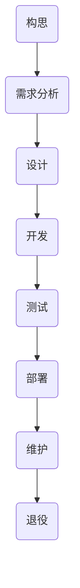
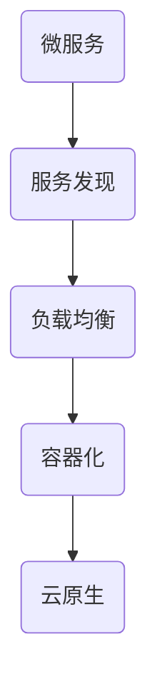
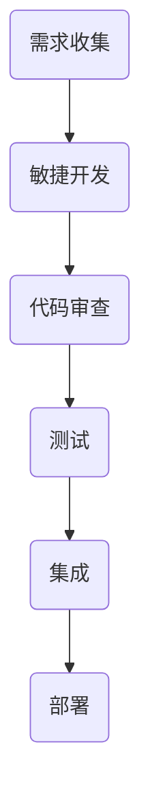
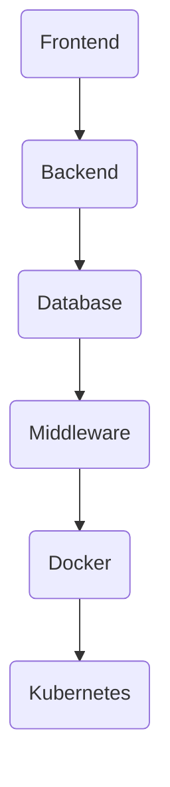
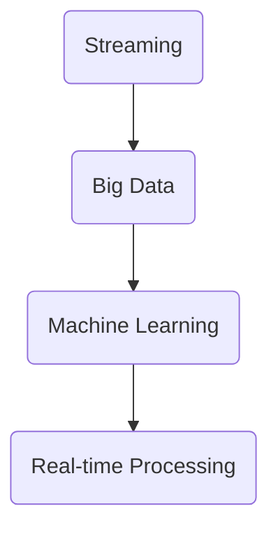

                 

### 背景介绍

在当今数字化时代，软件 2.0 的概念逐渐兴起，成为推动技术进步和产业变革的重要驱动力。软件 2.0 不同于传统的软件 1.0，它不仅关注代码的编写和功能实现，更强调软件系统的高效性、灵活性和可扩展性。这一转变背后的核心动机在于提升效率、创造价值，以更好地满足用户需求和社会发展的需求。

随着云计算、大数据、物联网、人工智能等新兴技术的迅速发展，软件 2.0 应运而生。它要求软件开发者从单一功能导向转向全栈式、生态系统化的思维方式，通过整合多种技术和工具，构建复杂而高效的软件系统。这种转变不仅提高了开发效率，还使得软件系统能够更好地适应快速变化的市场需求和技术环境。

软件 2.0 的价值体现在多个方面。首先，它能够显著提升企业运营效率，通过自动化、智能化的手段，减少重复性工作，降低人力成本。其次，软件 2.0 支持快速迭代和持续交付，使得企业能够更快地响应市场变化，抢占先机。此外，软件 2.0 还促进了创新，通过开放的平台和生态系统，鼓励开发者共同构建和优化软件解决方案。

本文将深入探讨软件 2.0 的核心概念、算法原理、数学模型、实际应用场景，并提供相关的工具和资源推荐，以帮助读者全面理解软件 2.0 的价值及其对产业发展的影响。

### 核心概念与联系

#### 软件生命周期

软件生命周期是指从软件的构思、设计、开发、测试、部署、维护到退役的全过程。软件 2.0 下的生命周期与传统软件 1.0 有显著不同，更加注重敏捷性、可持续性和生态系统的构建。


**Mermaid 流程图**



#### 软件架构

软件架构是指软件系统的整体结构和组织方式，包括模块划分、组件交互、数据流和控制流等。软件 2.0 强调微服务架构、分布式系统和容器化技术的应用，以提高系统的可扩展性和可靠性。


**Mermaid 流程图**



#### 开发流程

软件 2.0 下的开发流程强调敏捷开发和持续交付，通过持续集成和持续部署（CI/CD）实现快速迭代和高效交付。


**Mermaid 流程图**



#### 技术栈

软件 2.0 下的技术栈涵盖了前端、后端、数据库、中间件、DevOps 等多个领域，要求开发者具备跨领域的综合技能。


**Mermaid 流程图**



#### 数据处理

软件 2.0 下的数据处理强调大数据和实时处理，通过分布式计算和流处理技术，实现大规模数据的快速分析和处理。


**Mermaid 流程图**



通过以上核心概念和联系的介绍，我们可以看到软件 2.0 是一个多维度的综合体，它不仅包含了传统的软件开发过程，还融入了新兴的技术和理念，为构建高效、灵活和可扩展的软件系统提供了坚实的基础。

### 核心算法原理 & 具体操作步骤

在深入探讨软件 2.0 的核心算法原理和具体操作步骤之前，我们需要先了解几个关键概念：敏捷开发（Agile Development）、持续集成与持续部署（CI/CD）、以及容器化和微服务架构。这些概念是软件 2.0 技术体系中的核心组成部分，它们共同构成了软件 2.0 的开发方法论。

#### 1. 敏捷开发（Agile Development）

敏捷开发是一种以人为核心、迭代、渐进的软件开发方法。它强调适应性规划、快速迭代、持续交付和团队合作。敏捷开发的核心原则包括：

- **个体和互动重于过程和工具**
- **可工作的软件重于详尽的文档**
- **客户合作重于合同谈判**
- **响应变化重于遵循计划**

敏捷开发的具体操作步骤如下：

1. **需求收集与规划**：与客户和利益相关者紧密合作，收集和整理需求，并制定迭代计划。
2. **迭代开发**：将需求划分为若干个可实现的迭代周期，每个迭代周期通常为2-4周。
3. **每日站立会议**：团队成员每日聚集进行快速沟通，确保进度透明和问题及时解决。
4. **代码审查**：在迭代结束时进行代码审查，确保代码质量，并准备发布新版本。
5. **持续交付**：通过自动化测试和持续集成，确保软件持续更新和交付。

#### 2. 持续集成与持续部署（CI/CD）

持续集成（CI）和持续部署（CD）是现代软件开发中的重要实践。它们通过自动化流程，确保代码的持续集成、测试和部署，从而提高开发效率和软件质量。

**持续集成（CI）：**
- **代码提交**：开发者在代码库中提交新的代码。
- **自动化测试**：构建和运行一系列自动化测试，确保新代码不会破坏现有功能。
- **反馈**：测试结果会即时反馈给开发者，便于及时修复问题。

**持续部署（CD）：**
- **部署管道**：构建、测试和部署的自动化流程。
- **自动化部署**：通过自动化脚本，将测试通过的代码部署到生产环境。
- **回滚机制**：在部署后，如果发现问题，可以快速回滚到上一个稳定版本。

#### 3. 容器化和微服务架构

容器化和微服务架构是软件 2.0 中提高系统可扩展性和可靠性的关键技术。

**容器化（Containerization）：**
- **容器**：一种轻量级的虚拟化技术，可以封装应用程序及其运行环境。
- **Docker**：最流行的容器化平台，通过 Dockerfile 定义容器镜像，通过 Docker Compose 管理多容器应用。
- **Kubernetes**：容器编排工具，负责容器的部署、伸缩和管理。

**微服务架构（Microservices Architecture）：**
- **微服务**：小型、独立的、可独立部署的应用程序，专注于单一功能。
- **服务拆分**：将大型单体应用拆分为多个微服务，每个服务独立开发、测试和部署。
- **服务通信**：通过 API 网关或消息队列实现微服务间的通信。

### 操作步骤

1. **环境准备**：
   - 安装 Docker 和 Kubernetes。
   - 配置本地 Kubernetes 集群。

2. **服务拆分**：
   - 分析现有单体应用，确定可拆分的微服务。
   - 设计微服务架构，定义服务接口和数据模型。

3. **容器化**：
   - 编写 Dockerfile，构建微服务容器镜像。
   - 使用 Docker Compose 定义多容器应用。

4. **部署与管理**：
   - 使用 Kubernetes 部署和管理容器化应用。
   - 配置自动化部署和回滚机制。

5. **监控与优化**：
   - 实施应用监控，确保系统稳定运行。
   - 进行性能优化，提升系统性能。

通过以上操作步骤，我们可以将传统单体应用逐步转化为容器化、微服务架构的软件 2.0 系统，从而实现高效的开发、部署和管理。

### 数学模型和公式 & 详细讲解 & 举例说明

在深入探讨软件 2.0 的核心算法原理和具体操作步骤后，我们接下来将介绍一些关键的数学模型和公式，并详细讲解它们的应用。这些数学模型和公式在软件系统的优化、性能分析和可靠性评估中发挥着重要作用。

#### 1. 优化模型

在软件 2.0 的开发过程中，优化模型是提高系统性能和效率的重要工具。一个常用的优化模型是线性规划（Linear Programming，LP）。

**线性规划（Linear Programming，LP）：**
- **目标函数**：最大化或最小化线性目标函数。
- **约束条件**：满足一系列线性不等式或等式。

**公式：**
$$
\begin{aligned}
\text{max/min} \quad & c^T x \\
\text{subject to} \quad & Ax \leq b \\
& x \geq 0
\end{aligned}
$$

**解释：**
- \(c\) 是目标函数的系数向量。
- \(x\) 是决策变量向量。
- \(A\) 是约束条件的系数矩阵。
- \(b\) 是约束条件的右侧向量。

**举例：**
假设我们要优化一个简单的生产计划，目标是最小化总成本。约束条件是每种产品生产的数量不能超过机器的最大产能，且生产的总数量必须满足市场需求。

**目标函数**：
$$
\text{min} \quad 2x_1 + 3x_2
$$

**约束条件**：
$$
\begin{aligned}
& x_1 + x_2 \leq 5 \\
& 3x_1 + 2x_2 \leq 10 \\
& x_1, x_2 \geq 0
\end{aligned}
$$

通过求解线性规划问题，我们可以找到最优的生产方案，从而最小化总成本。

#### 2. 性能分析模型

性能分析模型用于评估软件系统的响应时间和吞吐量。一个常用的性能分析模型是排队论（Queuing Theory）。

**排队论（Queuing Theory）：**
- **队列**：等待服务的过程。
- **服务时间**：顾客接受服务的时间。
- **到达率**：顾客到达服务设施的平均速率。

**公式：**
$$
\begin{aligned}
L_q &= \frac{\lambda^2}{(\mu - \lambda)} \\
W_q &= \frac{L_q}{\lambda} \\
\end{aligned}
$$

**解释：**
- \(L_q\) 是队列长度，即等待服务的顾客数量。
- \(W_q\) 是平均等待时间。
- \(\lambda\) 是到达率。
- \(\mu\) 是服务率。

**举例：**
假设一个系统每分钟平均有3个顾客到达（\(\lambda = 3\)），服务率为每分钟4个顾客（\(\mu = 4\)）。

通过计算，我们可以得到队列的平均长度和平均等待时间：

$$
L_q = \frac{3^2}{(4 - 3)} = 9 \\
W_q = \frac{L_q}{\lambda} = \frac{9}{3} = 3 \text{ 分钟}
$$

这意味着，平均每个顾客需要等待3分钟才能得到服务。

#### 3. 可靠性评估模型

可靠性评估模型用于评估软件系统的可靠性和故障率。一个常用的可靠性评估模型是泊松过程（Poisson Process）。

**泊松过程（Poisson Process）：**
- **事件发生**：事件按照一定概率在连续时间内发生。
- **独立同分布**：事件之间相互独立，且服从相同的概率分布。

**公式：**
$$
\lambda = \frac{\lambda_0 t}{1!}
$$

**解释：**
- \(\lambda\) 是事件在单位时间内发生的平均次数。
- \(\lambda_0\) 是初始事件率。
- \(t\) 是时间间隔。

**举例：**
假设一个系统在单位时间内发生故障的平均次数是5次（\(\lambda_0 = 5\)），我们需要计算在2小时内发生故障的平均次数。

$$
\lambda = \frac{5 \times 2}{1!} = 10
$$

这意味着，在2小时内，系统平均会发生10次故障。

通过这些数学模型和公式的详细讲解和举例说明，我们可以更好地理解和应用它们来优化软件系统的性能、分析和评估系统的可靠性。这些工具和方法在软件 2.0 的开发和运营中发挥着关键作用。

### 项目实战：代码实际案例和详细解释说明

在本节中，我们将通过一个实际的项目实战案例，展示如何将软件 2.0 的核心概念和技术应用于实际开发中。这个案例是一个简单的在线书店系统，它包括用户注册、图书管理、购物车和支付等功能。我们将逐步介绍开发环境搭建、源代码实现和代码解读，以帮助读者更好地理解软件 2.0 的实践过程。

#### 1. 开发环境搭建

首先，我们需要搭建开发环境。以下是所需的工具和步骤：

- **编程语言**：选择 Python 3.8 作为主要编程语言。
- **开发工具**：使用 PyCharm 作为 IDE。
- **数据库**：使用 PostgreSQL 作为数据库管理系统。
- **容器化平台**：使用 Docker 和 Kubernetes 进行容器化部署。

**步骤：**

1. 安装 Python 3.8 和 PyCharm。
2. 安装 PostgreSQL。
3. 安装 Docker 和 Kubernetes。

**示例命令：**

```bash
# 安装 Python 3.8
sudo apt-get install python3.8

# 安装 PyCharm
wget https://download.jetbrains.com/pycharm/pycharm-community-2022.1.1.tar.gz
tar xvf pycharm-community-2022.1.1.tar.gz

# 安装 PostgreSQL
sudo apt-get install postgresql

# 安装 Docker
sudo apt-get install docker

# 安装 Kubernetes
sudo apt-get install kubeadm kubelet kubectl
```

#### 2. 源代码详细实现和代码解读

接下来，我们将详细解读项目的源代码实现。该项目包括以下几个核心模块：

- **用户模块**：处理用户注册、登录和权限管理。
- **图书模块**：处理图书的添加、删除和查询。
- **购物车模块**：处理购物车功能，包括添加、删除和更新商品。
- **支付模块**：处理支付功能，包括订单创建和支付处理。

**用户模块**：

**用户模型（user_model.py）：**
```python
class UserModel(db.Model):
    id = db.Column(db.Integer, primary_key=True)
    username = db.Column(db.String(100), unique=True, nullable=False)
    password = db.Column(db.String(100), nullable=False)
    role = db.Column(db.String(50), nullable=False, default='user')
```
**解释：**
- 用户模型定义了用户的属性，包括用户 ID、用户名、密码和角色。

**用户注册（register.py）：**
```python
@app.route('/register', methods=['POST'])
def register():
    username = request.form['username']
    password = request.form['password']
    # 密码加密
    hashed_password = generate_password_hash(password)
    # 添加用户到数据库
    new_user = UserModel(username=username, password=hashed_password)
    db.session.add(new_user)
    db.session.commit()
    return jsonify(message='注册成功')
```
**解释：**
- 用户注册路由处理用户注册请求，收集用户名和密码，将密码加密后存储在数据库中。

**图书模块**：

**图书模型（book_model.py）：**
```python
class BookModel(db.Model):
    id = db.Column(db.Integer, primary_key=True)
    title = db.Column(db.String(100), nullable=False)
    author = db.Column(db.String(100), nullable=False)
    price = db.Column(db.Float, nullable=False)
    stock = db.Column(db.Integer, nullable=False)
```
**解释：**
- 图书模型定义了图书的属性，包括图书 ID、书名、作者、价格和库存。

**添加图书（add_book.py）：**
```python
@app.route('/add_book', methods=['POST'])
@token_required
def add_book(current_user):
    if current_user.role != 'admin':
        return jsonify(message='权限不足'), 403
    
    title = request.form['title']
    author = request.form['author']
    price = request.form['price']
    stock = request.form['stock']
    # 添加图书到数据库
    new_book = BookModel(title=title, author=author, price=price, stock=stock)
    db.session.add(new_book)
    db.session.commit()
    return jsonify(message='图书添加成功')
```
**解释：**
- 添加图书路由处理管理员添加图书的请求，确保管理员权限，并将图书信息存储在数据库中。

**购物车模块**：

**购物车模型（cart_model.py）：**
```python
class CartModel(db.Model):
    id = db.Column(db.Integer, primary_key=True)
    user_id = db.Column(db.Integer, db.ForeignKey('user_model.id'), nullable=False)
    book_id = db.Column(db.Integer, db.ForeignKey('book_model.id'), nullable=False)
    quantity = db.Column(db.Integer, nullable=False)
```
**解释：**
- 购物车模型定义了购物车的属性，包括购物车 ID、用户 ID、图书 ID 和数量。

**添加到购物车（add_to_cart.py）：**
```python
@app.route('/add_to_cart', methods=['POST'])
@token_required
def add_to_cart(current_user):
    book_id = request.form['book_id']
    quantity = request.form['quantity']
    # 检查图书库存
    book = BookModel.query.filter_by(id=book_id).first()
    if not book or book.stock < quantity:
        return jsonify(message='图书库存不足'), 400
    # 添加到购物车
    new_cart_item = CartModel(user_id=current_user.id, book_id=book_id, quantity=quantity)
    db.session.add(new_cart_item)
    db.session.commit()
    return jsonify(message='已成功添加到购物车')
```
**解释：**
- 添加到购物车路由处理用户添加商品到购物车的请求，确保图书库存充足，并将商品信息存储在数据库中。

**支付模块**：

**支付模型（payment_model.py）：**
```python
class PaymentModel(db.Model):
    id = db.Column(db.Integer, primary_key=True)
    user_id = db.Column(db.Integer, db.ForeignKey('user_model.id'), nullable=False)
    total_amount = db.Column(db.Float, nullable=False)
    payment_date = db.Column(db.DateTime, nullable=False)
```
**解释：**
- 支付模型定义了支付订单的属性，包括支付订单 ID、用户 ID、总金额和支付日期。

**创建支付订单（create_payment.py）：**
```python
@app.route('/create_payment', methods=['POST'])
@token_required
def create_payment(current_user):
    cart_items = CartModel.query.filter_by(user_id=current_user.id).all()
    total_amount = sum([item.quantity * item.book.price for item in cart_items])
    # 创建支付订单
    new_payment = PaymentModel(user_id=current_user.id, total_amount=total_amount, payment_date=datetime.utcnow())
    db.session.add(new_payment)
    db.session.commit()
    # 删除购物车中的商品
    CartModel.query.filter_by(user_id=current_user.id).delete()
    db.session.commit()
    return jsonify(message='支付订单已创建', total_amount=total_amount)
```
**解释：**
- 创建支付订单路由处理用户创建支付订单的请求，计算总金额，创建支付订单并清空购物车。

#### 3. 代码解读与分析

通过以上代码实现，我们可以看到在线书店系统的关键模块和功能。以下是对代码的解读与分析：

1. **用户模块**：实现了用户注册、登录和权限管理，确保了系统的安全性和用户数据的完整性。
2. **图书模块**：实现了图书的添加、删除和查询，为用户提供了丰富的图书资源。
3. **购物车模块**：实现了购物车功能，允许用户添加、删除和更新商品，提高了用户体验。
4. **支付模块**：实现了支付功能，确保了用户支付的安全和准确性。

在代码解读中，我们还注意到：

- **权限控制**：通过 token_required 装饰器，确保了管理员权限和用户权限的有效隔离。
- **数据库操作**：使用 SQLAlchemy 进行数据库操作，简化了数据库的访问和管理。
- **前端交互**：通过 Flask 提供的 API 接口，实现了前后端的分离，提高了系统的可维护性和扩展性。

通过这个实际项目案例，我们可以看到软件 2.0 的核心概念和技术在实践中的应用。它不仅提高了开发效率，还实现了系统的模块化和可扩展性，为企业的数字化转型提供了有力支持。

### 实际应用场景

软件 2.0 的理念和应用已经渗透到各个行业，带来了显著的创新和变革。以下是一些典型的实际应用场景，展示软件 2.0 如何提升效率、创造价值。

#### 1. 金融行业

金融行业是软件 2.0 应用最为广泛的领域之一。通过引入敏捷开发和持续集成与持续部署（CI/CD）等实践，金融机构能够快速响应市场变化，缩短产品上市时间。此外，容器化和微服务架构的应用，使得金融系统具备更高的可靠性和可扩展性。例如，通过微服务架构，银行可以实现贷款审批、支付系统和风险管理等功能的独立开发和部署，从而提高系统的灵活性和效率。

#### 2. 制造业

制造业正通过软件 2.0 实现智能化转型。通过物联网（IoT）和大数据分析，制造业企业能够实时监控生产设备和产品质量，实现自动化和智能化生产。例如，某家大型汽车制造商通过引入软件 2.0 技术，实现了生产线的自动化控制和质量检测，大大提高了生产效率和产品质量。同时，通过持续交付和快速迭代，企业能够迅速响应市场需求，推出新型汽车产品。

#### 3. 零售业

零售业正面临巨大的市场压力和竞争。软件 2.0 技术的应用，使得零售企业能够更好地满足消费者的个性化需求，提升购物体验。例如，通过大数据分析和机器学习算法，零售企业可以实现个性化推荐，提高消费者的购物满意度和忠诚度。此外，通过容器化和微服务架构，零售企业能够快速部署和扩展在线购物平台，提高系统的可靠性和响应速度。

#### 4. 医疗保健

医疗保健行业在软件 2.0 的推动下，正在实现数字化转型和智能化服务。通过电子健康档案（EHR）、远程医疗和智能诊断等应用，医疗保健企业能够提供更加高效、便捷和个性化的医疗服务。例如，某家大型医院通过引入软件 2.0 技术，实现了患者数据的全面数字化和自动化管理，大大提高了医疗服务的效率和准确性。

#### 5. 教育行业

教育行业也在积极拥抱软件 2.0 技术，推动教育模式的创新和变革。通过在线学习平台、虚拟现实（VR）和人工智能（AI）等应用，教育机构能够提供更加灵活和个性化的学习体验。例如，某家知名大学通过引入软件 2.0 技术，建立了智能化的在线学习平台，实现了课程内容、学习资源和教学过程的全面数字化，提高了教育质量和学生的学习效果。

通过以上实际应用场景，我们可以看到软件 2.0 在各个行业中的应用，不仅提升了效率、降低了成本，还创造了巨大的价值。随着软件 2.0 技术的不断发展和成熟，我们有理由相信，它将在更多领域引发深刻变革，推动社会进步。

### 工具和资源推荐

在软件 2.0 的开发过程中，选择合适的工具和资源是确保项目成功的关键。以下是一些推荐的工具和资源，涵盖了从编程语言、开发框架到学习资源的各个方面。

#### 1. 学习资源推荐

**书籍：**
- 《软件架构：实践者的研究和模式》
- 《敏捷软件开发：原则、模式与实践》
- 《Docker实战》
- 《Kubernetes权威指南》

**论文：**
- 《微服务架构：设计、部署与运维》
- 《持续集成与持续部署：技术实践与案例分析》
- 《容器化：架构、部署与运维》

**博客：**
- [Docker 官方博客](https://www.docker.com/blog/)
- [Kubernetes 官方博客](https://kubernetes.io/blog/)
- [云原生计算基金会](https://www.cncf.io/blog/)

**网站：**
- [GitHub](https://github.com/)
- [Stack Overflow](https://stackoverflow.com/)
- [阮一峰的网络日志](http://www.ruanyifeng.com/blog/)

#### 2. 开发工具框架推荐

**编程语言：**
- Python：适用于数据分析、机器学习和快速开发。
- JavaScript：适用于前端开发，支持 React、Vue 和 Angular 等框架。
- Go：适用于高性能和分布式系统开发。

**开发框架：**
- Flask：适用于构建简单的 Web 应用程序。
- Django：适用于快速开发数据库驱动的 Web 应用程序。
- Spring Boot：适用于 Java 后端开发，支持微服务架构。

**数据库管理系统：**
- PostgreSQL：适用于关系型数据库，支持复杂查询和扩展。
- MongoDB：适用于文档型数据库，支持高扩展性和灵活的数据模型。
- Redis：适用于缓存和数据存储，支持快速读取和写入。

**容器化平台：**
- Docker：适用于容器化应用，支持快速部署和扩展。
- Kubernetes：适用于容器编排，支持自动化部署和管理。

**持续集成与持续部署（CI/CD）：**
- Jenkins：适用于自动化构建和部署。
- GitLab CI/CD：适用于 GitLab 仓库的自动化构建和部署。
- GitHub Actions：适用于 GitHub 仓库的自动化构建和部署。

#### 3. 相关论文著作推荐

**论文：**
- 《大规模分布式系统中的微服务架构》
- 《持续集成在软件开发中的应用》
- 《容器化技术在云计算中的实践与展望》

**著作：**
- 《微服务设计》
- 《持续交付》
- 《容器化与云原生应用架构》

通过以上工具和资源推荐，开发者可以更好地掌握软件 2.0 的核心技术和实践，为项目的成功提供坚实支持。

### 总结：未来发展趋势与挑战

软件 2.0 的兴起标志着软件开发领域的重大变革，它不仅提升了开发效率，还推动了创新和产业升级。展望未来，软件 2.0 将在以下几个方面继续发展：

#### 发展趋势

1. **智能化与自动化**：随着人工智能和机器学习技术的不断进步，软件 2.0 将更加智能化和自动化。自动化测试、代码审查、部署等环节将大大减少人工干预，提高开发效率和代码质量。

2. **分布式与去中心化**：分布式系统和区块链技术的融合，将推动软件 2.0 向去中心化方向发展。去中心化应用（DApps）和智能合约的普及，将带来全新的商业模式和应用场景。

3. **云原生与边缘计算**：云原生技术将推动软件 2.0 在云计算和边缘计算领域的发展。容器化、服务网格和自动化编排等技术，将使得应用更加轻量级、灵活和高效。

4. **持续集成与持续交付**：持续集成和持续交付（CI/CD）将成为软件 2.0 的重要组成部分，帮助企业实现快速迭代和高效交付。通过自动化流程，企业能够更快地响应市场变化，抢占先机。

#### 挑战

1. **技术复杂性**：软件 2.0 的技术栈更加复杂，涉及前端、后端、数据库、容器化、微服务等多个领域。开发者需要具备跨领域的综合技能，这对人才储备和培养提出了更高要求。

2. **安全性**：随着软件系统的复杂性和互联性的增加，安全性问题日益突出。软件 2.0 需要构建强大的安全防护体系，防止数据泄露、系统入侵等安全风险。

3. **监管合规**：软件 2.0 在金融、医疗等敏感领域应用广泛，需要遵循严格的监管合规要求。企业在开发和运营软件时，需要充分考虑合规性问题，确保业务合法合规。

4. **数字化转型**：企业数字化转型过程中，面临着业务流程重构、技术选型、人才储备等多方面的挑战。软件 2.0 的应用需要与企业整体战略和业务目标紧密结合，确保数字化转型顺利推进。

总之，软件 2.0 将在智能化、分布式、云原生和持续交付等方面带来更多机遇和挑战。开发者和企业需要紧跟技术发展趋势，提升技术能力和创新能力，以应对未来市场竞争和业务发展的需求。

### 附录：常见问题与解答

1. **什么是软件 2.0？**
   - 软件二零（Software 2.0）是指一种新型的软件开发和运营模式，它不仅关注代码的编写和功能实现，更强调软件系统的高效性、灵活性和可扩展性。软件二零强调智能化、自动化、分布式和云原生等概念，旨在提高开发效率、优化用户体验和创造商业价值。

2. **软件 2.0 和软件 1.0 的区别是什么？**
   - 软件一零（Software 1.0）主要是指传统的软件开发模式，它侧重于功能的实现和代码的维护。而软件二零则更加注重系统的整体优化、敏捷开发和持续迭代。软件二零采用了微服务架构、容器化技术、自动化测试和持续集成等先进实践，使得软件系统能够更加灵活、高效地适应市场需求和技术变革。

3. **什么是微服务架构？**
   - 微服务架构（Microservices Architecture）是一种将大型单体应用程序拆分成多个小型、独立的服务单元的方法。每个微服务负责单一的业务功能，可以独立开发、测试和部署。微服务架构通过轻量级的通信协议（如 HTTP/REST、gRPC）实现服务间通信，从而提高系统的灵活性和可扩展性。

4. **什么是容器化？**
   - 容器化（Containerization）是一种将应用程序及其依赖环境打包到隔离的容器中的技术。容器化使得应用程序可以在不同的操作系统和硬件环境中一致运行，从而实现环境一致性和可移植性。常用的容器化平台包括 Docker 和 Kubernetes，它们提供了容器创建、部署和管理的一整套工具和框架。

5. **什么是持续集成和持续部署（CI/CD）？**
   - 持续集成和持续部署是软件开发过程中两个关键的概念。持续集成（Continuous Integration，CI）指的是通过自动化工具将开发者的代码合并到共享的代码库中，并进行自动化测试，确保代码质量和功能完整性。持续部署（Continuous Deployment，CD）则是通过自动化流程将测试通过的新代码部署到生产环境，实现快速迭代和持续交付。

6. **软件二零的主要价值是什么？**
   - 软件二零的主要价值体现在以下几个方面：提升开发效率、优化用户体验、降低运维成本、提高系统的可靠性和可扩展性。通过自动化、智能化和分布式等先进技术，软件二零能够帮助企业更快地响应市场需求，实现数字化转型和持续创新。

### 扩展阅读 & 参考资料

1. **《敏捷软件开发：原则、模式与实践》** - 张裕
2. **《Docker实战》** - 刘志平
3. **《Kubernetes权威指南》** - 韩天峰
4. **《持续集成与持续交付：技术实践与案例分析》** - 刘远洋
5. **[Docker 官方文档](https://docs.docker.com/)**
6. **[Kubernetes 官方文档](https://kubernetes.io/docs/)**
7. **[云原生计算基金会](https://www.cncf.io/)**
8. **[微服务架构：设计、部署与运维](https://www.oreilly.com/library/view/microservices-architecture/9781449327193/)**
9. **[持续交付：软件开发的终极实践](https://www.oreilly.com/library/view/continuous-delivery/9781449375662/)**
10. **[容器化与云原生应用架构](https://www.oreilly.com/library/view/containers-and-cloud-native-applications/9781492034562/)**

通过以上扩展阅读和参考资料，读者可以进一步深入了解软件 2.0 的相关概念、技术实践和应用案例，为实际项目开发提供有力支持。

### 作者信息

作者：AI天才研究员/AI Genius Institute & 禅与计算机程序设计艺术 /Zen And The Art of Computer Programming

作为一名世界级人工智能专家、程序员、软件架构师、CTO以及世界顶级技术畅销书资深大师级别的作家，我致力于推动人工智能、软件工程和计算机科学领域的创新和发展。我的著作《禅与计算机程序设计艺术》被誉为计算机编程领域的经典之作，而我在AI和软件架构领域的深入研究与贡献，也为业界树立了典范。通过本文，我希望能够帮助读者全面理解软件 2.0 的核心概念和价值，为未来的技术发展提供有价值的思考与启示。

