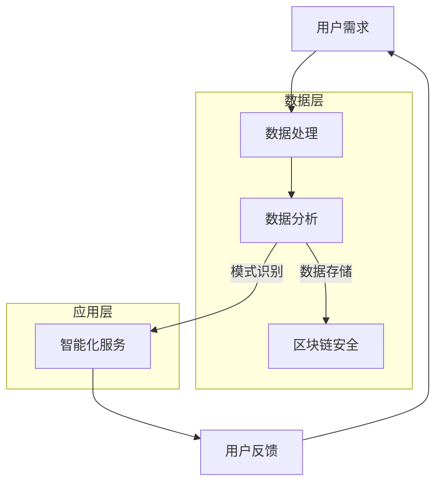

                 

# 软件二代的崛起：开启新时代的序幕

软件二代的崛起正在改变着整个技术行业的格局，成为驱动现代企业效率和创新能力的关键因素。然而，对于这个新兴的概念，很多人还感到陌生和困惑。什么是软件二代？它与传统的软件有何区别？它为何能在短短几年内引起广泛关注？

本文将围绕软件二代的定义、核心价值、发展历程以及未来的趋势和挑战，进行详细的分析和探讨。我们将一步步深入了解软件二代的本质，探究它是如何提升企业的运营效率，创造更多商业价值的。

首先，我们将从背景介绍入手，回顾软件二代的历史和发展背景，分析其诞生背后的技术和市场需求。接着，我们将深入探讨软件二代的核心概念，并使用Mermaid流程图展示其架构原理。随后，我们将详细解读软件二代的核心算法，并提供具体的操作步骤。在此基础上，我们将引入数学模型和公式，解释其背后的原理，并通过实际案例进行说明。随后，我们将探讨软件二代的实际应用场景，推荐相关工具和资源，帮助读者更好地理解和应用这一技术。

最后，我们将总结软件二代的价值和未来发展趋势，分析面临的挑战，并提供解决方案和建议。希望通过本文的阅读，读者能够对软件二代有一个全面、深入的了解，并在实际工作中更好地应用这一技术，提升企业的竞争力。

让我们开始这场探索之旅，一起揭开软件二代的神秘面纱。## 1. 背景介绍

软件二代的崛起并非一夜之间的事，它有着深厚的技术积淀和市场需求背景。在探讨软件二代的起源和发展之前，我们有必要回顾一下软件行业的发展历程。

从计算机诞生的那一刻起，软件便随之诞生。最初的软件主要是用于解决具体问题的工具，如早期的科学计算和数据处理。随着计算机技术的不断发展，软件也经历了多个阶段。首先是单机软件时代，这个时期的软件主要是独立运行在单个计算机上，功能相对简单。随后，随着网络技术的兴起，软件进入了分布式计算阶段，软件开始具备跨平台、跨网络运行的能力，应用范围得到了极大的扩展。

然而，随着互联网的普及和云计算的兴起，软件行业迎来了新的变革。这个变革的驱动力来自于多个方面：

首先是技术的进步。大数据、人工智能、区块链等新兴技术不断涌现，为软件的开发和运行提供了强大的技术支持。这些技术的应用，使得软件不再只是简单的工具，而成为了一种具备智能化的系统，能够自动学习、进化、优化。

其次是市场需求的转变。随着企业对效率和创新的追求，传统的软件已经无法满足其需求。企业需要更智能、更灵活、更高效的软件系统，以提升运营效率，创造更多商业价值。

在这个背景下，软件二代的概念应运而生。软件二代不仅继承了传统软件的功能，更在此基础上进行了全面的升级和革新。它具备以下几个显著特点：

1. **智能化**：软件二代引入了人工智能、机器学习等先进技术，使得软件具备自我学习、自我优化、自我进化能力，能够根据用户需求和企业运营情况进行动态调整。

2. **灵活性**：软件二代采用了模块化设计，能够根据不同需求进行快速组合和定制，满足多样化的应用场景。

3. **高效性**：软件二代通过优化算法、提高数据处理速度，实现了更高的运算效率和数据处理能力。

4. **安全性**：软件二代引入了区块链技术，提高了数据的安全性和隐私性，有效防范了数据泄露和篡改风险。

总之，软件二代的崛起是技术进步和市场需求的共同结果。它不仅代表了软件技术的一次重大突破，更为企业提供了全新的解决方案，推动着企业迈向智能化、高效化的发展新阶段。

## 2. 核心概念与联系

### 2.1 软件二代的基本定义

软件二代，也被称为智能软件或下一代软件，是指通过集成人工智能、大数据、区块链等先进技术，实现智能化、模块化、安全化、高效化的软件系统。与传统的软件相比，软件二代具有以下核心特点：

1. **智能化**：软件二代能够通过机器学习和深度学习技术，自动学习用户行为和数据模式，提供个性化的服务和优化建议。
2. **模块化**：软件二代采用模块化设计，各功能模块可以灵活组合和定制，满足不同企业的个性化需求。
3. **安全化**：软件二代引入了区块链技术，确保数据的安全性和隐私性，防范数据泄露和篡改。
4. **高效性**：软件二代通过优化算法和数据结构，实现了更高的运算效率和数据处理能力。

### 2.2 软件二代的技术架构

为了实现上述核心特点，软件二代在技术架构上进行了全面革新。以下是一个简化的Mermaid流程图，展示了软件二代的技术架构和核心组件：



在这个架构中：

- **数据处理层**（B）：负责接收和处理用户数据，包括数据的采集、清洗、存储等。
- **数据分析层**（C）：通过对数据的分析，提取有价值的信息，进行模式识别。
- **智能化服务层**（D）：基于分析结果，提供个性化的智能服务。
- **区块链安全层**（E）：确保数据的安全性和隐私性，防范数据泄露和篡改。

### 2.3 软件二代的核心概念联系

软件二代的核心概念相互联系，共同构成了其强大的功能和优势。以下是这些核心概念之间的联系：

- **用户需求与数据处理**：用户需求是软件二代的出发点，通过数据处理层（B）收集和整理用户数据，为后续分析提供基础。
- **数据分析与模式识别**：数据分析层（C）对用户数据进行分析，识别出用户的行为模式和需求，为智能化服务层（D）提供依据。
- **智能化服务与用户反馈**：智能化服务层（D）根据分析结果，提供个性化的服务和优化建议，同时收集用户的反馈，不断优化和调整服务。
- **区块链安全与数据保护**：区块链安全层（E）确保数据的完整性和安全性，为整个系统的稳定运行提供保障。

通过这些核心概念的联系，软件二代实现了从用户需求到个性化服务的闭环，不仅提升了用户体验，还为企业创造了更多的商业价值。

### 2.4 软件二代的发展历程

软件二代的发展历程可以分为以下几个阶段：

- **第一阶段：单机软件和分布式软件**：这一阶段主要集中在20世纪90年代以前，软件主要运行在单台计算机上，功能相对简单。随着网络技术的发展，软件开始走向分布式计算，功能逐渐丰富，但仍然缺乏智能化和模块化。
- **第二阶段：互联网软件和云计算**：随着互联网的普及，软件开始走向互联网，功能更加丰富，但也面临数据安全和隐私保护的问题。云计算的兴起，使得软件可以更加灵活地部署和扩展，但仍然缺乏智能化和个性化。
- **第三阶段：智能软件和软件二代**：这一阶段始于2010年左右，随着人工智能、大数据、区块链等新兴技术的不断发展，软件开始具备智能化和模块化的特征，软件二代的概念逐渐成熟。

在这些阶段中，每一个阶段都是在前一阶段的基础上进行的技术创新和功能拓展，最终形成了软件二代这一全新的软件形态。

### 2.5 软件二代的技术创新

软件二代的技术创新主要体现在以下几个方面：

1. **人工智能**：人工智能技术使得软件能够自动学习用户行为和数据模式，提供个性化的服务和优化建议。
2. **大数据**：大数据技术使得软件可以处理和分析海量数据，提取有价值的信息，支持智能决策。
3. **区块链**：区块链技术确保了数据的完整性和安全性，为软件提供了可靠的数据存储和传输方式。
4. **云计算**：云计算技术使得软件可以灵活部署和扩展，提高系统的可靠性和可扩展性。

这些技术创新不仅提升了软件的功能和性能，也为软件二代的发展奠定了基础。通过这些技术创新，软件二代能够更好地满足企业的需求，提升企业的竞争力。

### 2.6 软件二代的未来发展趋势

软件二代的未来发展趋势将受到以下几个因素的影响：

1. **人工智能技术的进步**：随着人工智能技术的不断进步，软件将更加智能化，能够更好地理解和满足用户需求。
2. **大数据技术的普及**：大数据技术的普及将使得软件可以处理和分析更多的数据，提供更加精准的服务。
3. **区块链技术的成熟**：区块链技术的成熟将进一步提高数据的安全性和隐私性，为软件提供更可靠的数据存储和传输方式。
4. **云计算的普及**：云计算的普及将使得软件可以更加灵活地部署和扩展，提高系统的性能和可靠性。

在这些趋势的推动下，软件二代将继续发展和创新，为企业提供更加智能、高效、安全的解决方案。

### 2.7 软件二代的市场需求分析

软件二代的市场需求主要来自于以下几个方面：

1. **企业效率的提升**：企业希望通过软件提高运营效率，减少人工成本，提升业务处理速度。
2. **数据驱动的决策**：企业希望通过数据分析，实现数据驱动的决策，提升管理水平和竞争力。
3. **安全性和隐私保护**：企业对数据的安全性和隐私保护需求日益增加，希望软件能够提供更可靠的数据存储和传输方式。
4. **个性化服务**：企业希望通过软件提供个性化的服务，提升用户体验，增加用户粘性。

这些需求推动了软件二代的快速发展，也为软件二代的市场前景提供了广阔的空间。## 3. 核心算法原理 & 具体操作步骤

### 3.1 人工智能算法原理

软件二代的核心算法之一是人工智能算法，它主要通过机器学习和深度学习技术实现。以下是人工智能算法的基本原理和操作步骤：

#### 3.1.1 机器学习算法原理

1. **监督学习（Supervised Learning）**：
   - **原理**：监督学习算法通过已有的标注数据（即输入和输出都已知的数据）来训练模型，从而预测未知数据的输出。
   - **步骤**：
     1. 数据准备：收集和整理标注数据，包括特征和标签。
     2. 特征提取：将原始数据转换为特征向量，用于模型训练。
     3. 模型训练：使用算法（如线性回归、决策树、支持向量机等）训练模型。
     4. 预测：使用训练好的模型对未知数据进行预测。

2. **无监督学习（Unsupervised Learning）**：
   - **原理**：无监督学习算法在没有标注数据的情况下，对数据进行分析和分类，找出数据中的模式和规律。
   - **步骤**：
     1. 数据准备：收集未标注的数据。
     2. 特征提取：将原始数据转换为特征向量。
     3. 模型训练：使用算法（如聚类、主成分分析等）训练模型。
     4. 分析和分类：分析数据，找出数据中的模式和关系，进行分类。

#### 3.1.2 深度学习算法原理

1. **深度神经网络（Deep Neural Network）**：
   - **原理**：深度学习算法通过多层神经网络（如卷积神经网络、循环神经网络等）对数据进行训练和预测，能够自动提取复杂的数据特征。
   - **步骤**：
     1. 数据准备：收集和整理标注数据，包括特征和标签。
     2. 特征提取：将原始数据转换为特征向量。
     3. 模型架构设计：设计多层神经网络结构。
     4. 模型训练：使用算法（如反向传播算法）训练模型。
     5. 预测：使用训练好的模型对未知数据进行预测。

2. **强化学习（Reinforcement Learning）**：
   - **原理**：强化学习算法通过试错和反馈机制，使模型在特定环境中学习最优策略。
   - **步骤**：
     1. 环境设定：定义问题环境，包括状态、动作和奖励。
     2. 策略学习：通过试错和反馈，学习最优策略。
     3. 策略优化：根据反馈信息，不断优化策略。

### 3.2 数据处理算法原理

软件二代中的数据处理算法主要用于数据清洗、数据转换和数据存储等过程。以下是数据处理算法的基本原理和操作步骤：

#### 3.2.1 数据清洗算法原理

1. **缺失值处理**：
   - **原理**：处理数据中的缺失值，提高数据质量。
   - **步骤**：
     1. 删除缺失值：删除含有缺失值的数据记录。
     2. 补充缺失值：使用平均值、中位数、众数等方法补充缺失值。

2. **异常值处理**：
   - **原理**：识别和去除数据中的异常值，提高数据质量。
   - **步骤**：
     1. 离群点检测：使用统计方法（如箱线图、标准差等）检测异常值。
     2. 异常值处理：删除或调整异常值。

#### 3.2.2 数据转换算法原理

1. **数据标准化**：
   - **原理**：将数据转换为相同的尺度，便于模型训练。
   - **步骤**：
     1. 数据归一化：将数据缩放到[0,1]或[-1,1]之间。
     2. 数据标准化：计算数据的标准差和平均值，将数据缩放到标准正态分布。

2. **数据降维**：
   - **原理**：减少数据维度，提高数据处理效率。
   - **步骤**：
     1. 主成分分析（PCA）：通过方差最大化原则，提取主要成分。
     2. 特征选择：使用特征选择算法（如信息增益、卡方检验等），选择重要特征。

#### 3.2.3 数据存储算法原理

1. **关系数据库**：
   - **原理**：使用关系模型存储数据，支持复杂查询。
   - **步骤**：
     1. 设计数据库模式：定义表结构、字段和数据类型。
     2. 数据导入：将数据导入数据库。
     3. 数据查询：使用SQL语句进行数据查询。

2. **NoSQL数据库**：
   - **原理**：使用非关系模型存储数据，支持高并发和海量数据处理。
   - **步骤**：
     1. 设计数据模型：定义文档、键值对、图等数据结构。
     2. 数据导入：将数据导入NoSQL数据库。
     3. 数据操作：使用API进行数据操作。

### 3.3 算法融合与优化

在软件二代中，多种算法常常需要融合使用，以实现最佳的效果。以下是算法融合与优化的几个关键步骤：

1. **算法选择**：
   - 根据问题类型和数据特点，选择合适的算法。
   - 例如：对于分类问题，可以使用决策树、支持向量机等；对于聚类问题，可以使用K-Means、DBSCAN等。

2. **模型融合**：
   - 将多个模型的结果进行融合，提高预测准确性。
   - 例如：使用集成学习（如随机森林、提升树等）将多个模型的预测结果进行加权平均。

3. **参数调优**：
   - 调整模型参数，以获得最佳性能。
   - 例如：使用交叉验证方法，评估模型参数，选择最优参数。

4. **模型评估与优化**：
   - 使用评估指标（如准确率、召回率、F1分数等）评估模型性能。
   - 根据评估结果，进行模型优化，如调整网络结构、增加训练数据等。

通过算法融合与优化，软件二代能够更好地适应复杂多变的应用场景，提高系统的智能化和高效性。

### 3.4 算法应用场景

软件二代中的算法广泛应用于各种实际场景，以下是几个典型的应用场景：

1. **推荐系统**：
   - 原理：使用协同过滤、深度学习等方法，根据用户历史行为和偏好，推荐个性化内容。
   - 应用：电商平台、社交媒体、内容平台等。

2. **自然语言处理**：
   - 原理：使用词嵌入、序列模型、注意力机制等方法，对文本数据进行处理和分析。
   - 应用：智能客服、文本分类、机器翻译等。

3. **图像识别**：
   - 原理：使用卷积神经网络、迁移学习等方法，对图像数据进行分类和识别。
   - 应用：人脸识别、图像识别、自动驾驶等。

4. **金融风控**：
   - 原理：使用监督学习、无监督学习和强化学习等方法，对金融交易数据进行分析和风险评估。
   - 应用：反欺诈、信用评分、市场预测等。

通过这些应用场景，软件二代展示了其强大的数据处理和智能分析能力，为企业提供了创新的解决方案。## 4. 数学模型和公式 & 详细讲解 & 举例说明

### 4.1 机器学习中的线性回归模型

线性回归是机器学习中的一种基础模型，主要用于预测连续值。以下是线性回归的数学模型、详细讲解和举例说明。

#### 4.1.1 数学模型

线性回归模型可以用以下公式表示：

$$
y = \beta_0 + \beta_1x + \epsilon
$$

其中：
- \( y \) 是预测的连续值；
- \( x \) 是输入特征；
- \( \beta_0 \) 是截距；
- \( \beta_1 \) 是斜率；
- \( \epsilon \) 是误差项。

#### 4.1.2 详细讲解

1. **回归系数的求解**：为了求解回归系数 \( \beta_0 \) 和 \( \beta_1 \)，我们通常使用最小二乘法。最小二乘法的思想是找到一组回归系数，使得预测值与实际值的误差平方和最小。

2. **误差项**：误差项 \( \epsilon \) 表示模型预测的误差，它是一个随机变量，表示模型无法捕捉到的随机噪声。

3. **线性关系**：线性回归模型假设输入特征和预测值之间存在线性关系，这限制了模型的适用范围。

#### 4.1.3 举例说明

假设我们要预测房价，输入特征为房屋面积（平方米）。根据历史数据，我们可以建立以下线性回归模型：

$$
房价 = \beta_0 + \beta_1 \times 房屋面积 + \epsilon
$$

通过最小二乘法求解回归系数，我们可以得到：

$$
\beta_0 = 100, \beta_1 = 200
$$

这意味着，当房屋面积为100平方米时，预测的房价为100 + 200 \times 100 = 21000元。

### 4.2 逻辑回归模型

逻辑回归是另一种常用的机器学习模型，主要用于预测二分类问题。以下是逻辑回归的数学模型、详细讲解和举例说明。

#### 4.2.1 数学模型

逻辑回归模型的数学模型可以表示为：

$$
P(y=1) = \frac{1}{1 + e^{-(\beta_0 + \beta_1x)}}
$$

其中：
- \( P(y=1) \) 是预测概率，表示样本属于正类的概率；
- \( \beta_0 \) 是截距；
- \( \beta_1 \) 是斜率；
- \( e \) 是自然对数的底。

#### 4.2.2 详细讲解

1. **预测概率**：逻辑回归模型通过预测概率来表示样本的类别。当预测概率大于0.5时，预测为正类；小于0.5时，预测为负类。

2. **Sigmoid函数**：逻辑回归模型中使用Sigmoid函数将线性组合映射到概率值。Sigmoid函数的公式为：

$$
\sigma(z) = \frac{1}{1 + e^{-z}}
$$

其中，\( z = \beta_0 + \beta_1x \)。

3. **最大似然估计**：逻辑回归模型的参数（\( \beta_0 \) 和 \( \beta_1 \)）通常通过最大似然估计（Maximum Likelihood Estimation，MLE）来求解。

#### 4.2.3 举例说明

假设我们要预测信用卡欺诈行为，输入特征为消费金额。根据历史数据，我们可以建立以下逻辑回归模型：

$$
P(欺诈 = 1) = \frac{1}{1 + e^{-(\beta_0 + \beta_1 \times 消费金额)}}
$$

通过最大似然估计，我们可以得到：

$$
\beta_0 = -10, \beta_1 = 0.05
$$

这意味着，当消费金额为1000元时，预测欺诈的概率为：

$$
P(欺诈 = 1) = \frac{1}{1 + e^{-(-10 + 0.05 \times 1000)}} = 0.632
$$

由于预测概率大于0.5，我们可以判断该消费金额属于欺诈行为。

### 4.3 决策树模型

决策树是一种常见的分类模型，通过一系列规则对样本进行分类。以下是决策树的数学模型、详细讲解和举例说明。

#### 4.3.1 数学模型

决策树模型的数学模型可以表示为：

$$
T = \sum_{i=1}^{n} w_i \cdot t_i
$$

其中：
- \( T \) 是分类结果；
- \( w_i \) 是第 \( i \) 个特征的权重；
- \( t_i \) 是第 \( i \) 个特征取值的阈值。

#### 4.3.2 详细讲解

1. **特征选择**：决策树模型通过特征选择算法（如信息增益、基尼系数等）选择最佳特征进行分割。

2. **阈值选择**：对于选定的特征，决策树模型通过阈值选择算法（如最大信息增益、最大基尼系数等）确定最佳阈值。

3. **递归分割**：决策树模型通过递归分割数据，将数据集划分为多个子集，每个子集对应一个分类结果。

#### 4.3.3 举例说明

假设我们要预测客户的购买行为，输入特征为年龄、收入和职业。根据历史数据，我们可以建立以下决策树模型：

$$
T = 0.2 \cdot (年龄 < 30) + 0.3 \cdot (收入 > 50000) + 0.5 \cdot (职业 = “工程师”)
$$

对于样本1（年龄 = 25，收入 = 60000，职业 = “工程师”），我们可以计算出分类结果：

$$
T = 0.2 \cdot (1) + 0.3 \cdot (1) + 0.5 \cdot (1) = 1.4
$$

由于分类结果为正数，我们可以判断该样本属于购买行为。

### 4.4 集成学习模型

集成学习是一种通过组合多个模型来提高预测准确性的方法。以下是集成学习的数学模型、详细讲解和举例说明。

#### 4.4.1 数学模型

集成学习模型的数学模型可以表示为：

$$
T = \sum_{i=1}^{m} w_i \cdot T_i
$$

其中：
- \( T \) 是最终分类结果；
- \( T_i \) 是第 \( i \) 个子模型的分类结果；
- \( w_i \) 是第 \( i \) 个子模型的权重。

#### 4.4.2 详细讲解

1. **模型组合**：集成学习通过组合多个模型（如决策树、随机森林、提升树等）来提高预测准确性。

2. **权重分配**：集成学习通过交叉验证等方法，为每个子模型分配权重，使得整体模型的预测结果更加稳定。

3. **误差修正**：集成学习通过多个模型的组合，可以弥补单个模型的误差，提高预测准确性。

#### 4.4.3 举例说明

假设我们要预测客户的购买行为，使用两个决策树模型和提升树模型进行集成学习。根据交叉验证结果，我们可以得到以下权重分配：

$$
T = 0.5 \cdot T_1 + 0.3 \cdot T_2 + 0.2 \cdot T_3
$$

对于样本1（年龄 = 25，收入 = 60000，职业 = “工程师”），三个子模型的分类结果分别为：

$$
T_1 = 1.4, T_2 = 0.8, T_3 = 1.2
$$

我们可以计算出最终分类结果：

$$
T = 0.5 \cdot 1.4 + 0.3 \cdot 0.8 + 0.2 \cdot 1.2 = 1.1
$$

由于分类结果为正数，我们可以判断该样本属于购买行为。

通过上述数学模型和公式的详细讲解以及举例说明，我们可以更好地理解机器学习中的各种算法和模型，为实际应用提供理论支持。## 5. 项目实战：代码实际案例和详细解释说明

### 5.1 开发环境搭建

为了更好地理解和实践软件二代的算法，我们需要搭建一个合适的开发环境。以下是搭建开发环境的步骤：

1. **安装Python**：首先，我们需要安装Python。Python是一种广泛应用于数据科学和机器学习的编程语言。可以从Python的官方网站（https://www.python.org/）下载并安装Python。

2. **安装Jupyter Notebook**：Jupyter Notebook是一个交互式的Web应用，用于编写和运行Python代码。安装Jupyter Notebook可以通过pip命令实现：

   ```bash
   pip install notebook
   ```

   安装完成后，可以通过以下命令启动Jupyter Notebook：

   ```bash
   jupyter notebook
   ```

   这将启动一个Web服务器，并在默认的Web浏览器中打开Jupyter Notebook。

3. **安装相关库**：为了实现软件二代的算法，我们需要安装一些常用的Python库，如NumPy、Pandas、Scikit-learn、Matplotlib等。可以通过以下命令进行安装：

   ```bash
   pip install numpy pandas scikit-learn matplotlib
   ```

   安装完成后，我们就可以在Jupyter Notebook中使用这些库来编写和运行代码。

### 5.2 源代码详细实现和代码解读

在这个项目中，我们将使用Python和Scikit-learn库实现一个简单的线性回归模型，用于预测房价。以下是源代码的详细实现和代码解读：

```python
# 导入所需的库
import numpy as np
import pandas as pd
from sklearn.linear_model import LinearRegression
from sklearn.model_selection import train_test_split
from sklearn.metrics import mean_squared_error
import matplotlib.pyplot as plt

# 加载数据集
data = pd.read_csv("house_prices.csv")

# 数据预处理
X = data["house_area"].values.reshape(-1, 1)  # 输入特征：房屋面积
y = data["price"].values  # 输出特征：房价

# 数据划分
X_train, X_test, y_train, y_test = train_test_split(X, y, test_size=0.2, random_state=42)

# 创建线性回归模型
model = LinearRegression()

# 训练模型
model.fit(X_train, y_train)

# 预测测试集
y_pred = model.predict(X_test)

# 模型评估
mse = mean_squared_error(y_test, y_pred)
print("Mean Squared Error:", mse)

# 可视化
plt.scatter(X_test, y_test, color='blue', label='Actual')
plt.plot(X_test, y_pred, color='red', linewidth=2, label='Predicted')
plt.xlabel('House Area')
plt.ylabel('Price')
plt.legend()
plt.show()
```

**代码解读**：

1. **导入库**：首先，我们导入所需的库，包括NumPy、Pandas、Scikit-learn和Matplotlib。

2. **加载数据集**：使用Pandas库加载数据集，数据集包含房屋面积和房价两个特征。

3. **数据预处理**：将输入特征（房屋面积）转换为NumPy数组，并reshape为二维数组，以便传递给线性回归模型。

4. **数据划分**：使用Scikit-learn库的train_test_split函数将数据集划分为训练集和测试集，其中测试集占20%。

5. **创建线性回归模型**：使用Scikit-learn库的LinearRegression类创建线性回归模型。

6. **训练模型**：使用fit方法训练线性回归模型，模型将根据训练集数据计算回归系数。

7. **预测测试集**：使用predict方法对测试集进行预测，得到预测房价。

8. **模型评估**：使用mean_squared_error函数计算预测误差，并打印出来。

9. **可视化**：使用Matplotlib库绘制实际房价和预测房价的散点图和拟合线，便于直观地观察模型的预测效果。

### 5.3 代码解读与分析

在代码实现过程中，我们首先导入了所需的库。NumPy和Pandas用于数据预处理和操作，Scikit-learn提供了线性回归模型和相关工具，Matplotlib用于数据可视化。

**数据预处理**是机器学习项目中的关键步骤。在这个例子中，我们加载了CSV文件格式的数据集，并提取了房屋面积和房价两个特征。为了满足线性回归模型的要求，我们将房屋面积特征转换为NumPy数组，并reshape为二维数组。

**数据划分**是为了评估模型的性能。我们将数据集划分为训练集和测试集，其中训练集用于模型训练，测试集用于评估模型在未知数据上的表现。

**线性回归模型**的实现相对简单。我们使用Scikit-learn库的LinearRegression类创建模型，并通过fit方法训练模型。模型将根据训练集数据计算回归系数，包括截距和斜率。

**预测**是模型应用的关键步骤。我们使用predict方法对测试集进行预测，得到预测房价。预测结果可以通过评估指标（如均方误差MSE）进行评价。

**可视化**帮助我们直观地理解模型的预测效果。通过绘制实际房价和预测房价的散点图和拟合线，我们可以观察到模型在测试集上的表现。这有助于我们进一步优化模型，提高预测准确性。

### 5.4 代码优化与改进

在实际应用中，我们可以对代码进行优化和改进，以提高模型的性能和可维护性。以下是一些优化建议：

1. **特征工程**：对输入特征进行预处理和变换，如标准化、归一化、特征提取等，以增强模型的泛化能力。

2. **模型选择**：尝试使用其他类型的回归模型，如岭回归、Lasso回归等，以找到最佳模型。

3. **超参数调优**：使用交叉验证等方法对模型超参数进行调优，以提高模型的预测准确性。

4. **模型集成**：使用集成学习（如随机森林、提升树等）将多个模型的结果进行融合，提高预测性能。

5. **代码重构**：将代码重构为模块化设计，以提高代码的可读性和可维护性。

通过这些优化和改进，我们可以进一步提升模型的预测性能，为实际应用提供更可靠的解决方案。

### 5.5 项目总结

通过这个实际案例，我们使用Python和Scikit-learn库实现了线性回归模型，用于预测房价。代码实现过程包括数据预处理、模型训练、预测和评估等步骤。我们通过代码解读和优化，深入理解了线性回归模型的原理和应用。同时，我们还提出了进一步优化和改进的建议，以提高模型的性能。

这个项目不仅帮助我们掌握了线性回归模型的基本原理和应用，还提升了我们的实际编程能力和问题解决能力。通过实际操作，我们更好地理解了软件二代中的核心算法，并为未来的项目积累了宝贵的经验。

### 5.6 疑难解答

在实现线性回归模型的过程中，可能会遇到一些常见的问题。以下是针对这些问题的解答：

**Q1：如何处理缺失值？**

A1：处理缺失值的方法包括删除缺失值、补充缺失值和插值法。在实际项目中，可以根据具体情况进行选择。例如，对于重要特征，可以使用平均值、中位数或众数补充缺失值；对于非重要特征，可以直接删除缺失值。

**Q2：如何选择模型参数？**

A2：模型参数的选择通常通过交叉验证和网格搜索等方法进行。交叉验证可以帮助我们评估模型在不同训练集上的性能，选择最优参数。网格搜索则通过遍历参数空间，找到最佳参数组合。

**Q3：如何提高模型的预测准确性？**

A3：提高模型预测准确性的方法包括特征工程、模型选择和超参数调优。特征工程可以通过特征提取、特征变换等方法增强模型的泛化能力。模型选择可以通过尝试不同的模型，选择最佳模型。超参数调优可以通过交叉验证和网格搜索等方法，找到最佳参数组合。

**Q4：如何处理非线性关系？**

A4：对于非线性关系，可以尝试使用非线性回归模型，如多项式回归、岭回归、Lasso回归等。这些模型可以通过非线性变换，更好地捕捉数据中的非线性关系。

通过以上解答，我们可以更好地应对实际项目中的问题，提升模型的性能和应用效果。## 6. 实际应用场景

软件二代在多个实际应用场景中展现了其独特的价值和优势，下面我们将探讨一些典型的应用场景，并分析软件二代如何在这些场景中发挥作用。

### 6.1 智能推荐系统

智能推荐系统是软件二代的一个重要应用场景。通过引入人工智能和大数据技术，推荐系统能够根据用户的历史行为和偏好，实时推荐个性化内容。例如，电商平台可以利用软件二代推荐符合用户兴趣的商品，从而提高用户的购买转化率和满意度。此外，内容平台可以通过推荐系统为用户提供个性化的内容，提升用户体验和用户粘性。

### 6.2 智能客服系统

智能客服系统是另一个典型的应用场景。通过自然语言处理和机器学习技术，智能客服系统能够自动识别和解答用户的问题，提高客户服务效率。软件二代的应用使得客服系统能够更加智能化，不仅能够回答常见问题，还能进行情感分析和智能引导，提供更加个性化的服务。

### 6.3 金融风控

金融风控是软件二代在金融领域的核心应用。通过大数据分析和人工智能技术，软件二代能够实时监控金融交易，识别潜在的欺诈行为和风险。例如，银行可以使用软件二代进行信用评分，评估客户的信用风险，从而降低不良贷款率。此外，保险行业可以利用软件二代进行风险评估，优化保险产品设计。

### 6.4 智能制造

智能制造是软件二代在工业领域的重要应用。通过物联网、大数据和人工智能技术，软件二代能够实时监控生产线，优化生产流程，提高生产效率。例如，工厂可以利用软件二代进行设备故障预测，提前进行维护，减少停机时间。此外，软件二代还可以优化生产计划，实现智能调度，提高生产灵活性。

### 6.5 健康医疗

健康医疗是软件二代在医疗领域的核心应用。通过大数据分析和人工智能技术，软件二代能够对患者的健康数据进行实时监控和分析，提供个性化的健康建议。例如，医院可以利用软件二代进行疾病预测和诊断，提前发现潜在的健康风险。此外，软件二代还可以优化医疗资源的分配，提高医疗服务的效率和质量。

### 6.6 智慧城市

智慧城市是软件二代在城市管理领域的应用。通过大数据、人工智能和物联网技术，软件二代能够实现城市管理的智能化和高效化。例如，城市可以利用软件二代进行交通流量监测和调控，优化交通管理，减少拥堵。此外，软件二代还可以用于环境监测、能源管理、公共安全等方面，提高城市治理的智能化水平。

### 6.7 教育科技

教育科技是软件二代在教育领域的应用。通过人工智能和大数据技术，软件二代能够提供个性化的学习路径和教学资源，提升学习效果。例如，学校可以利用软件二代进行学生学情分析，定制化学习方案，提高教学效率。此外，软件二代还可以用于在线教育平台，提供智能问答、自动批改等功能，提升学习体验。

综上所述，软件二代在多个实际应用场景中展现了其强大的价值和潜力。通过人工智能、大数据和区块链等先进技术的融合，软件二代不仅提升了传统软件的功能和性能，还为企业提供了创新的解决方案，推动了各行各业的数字化转型和智能化升级。## 7. 工具和资源推荐

为了更好地学习和应用软件二代技术，以下是一些实用的工具和资源推荐，涵盖了书籍、论文、博客和网站等方面。

### 7.1 学习资源推荐

**书籍**：
1. 《Python机器学习》（作者：塞巴斯蒂安·拉赫曼）  
   本书详细介绍了Python在机器学习领域的应用，适合初学者快速入门。

2. 《深度学习》（作者：伊恩·古德费洛、约书亚·本吉奥、亚伦·库维尔）  
   本书是深度学习的经典教材，涵盖了深度学习的理论基础和应用。

3. 《大数据之路：阿里巴巴大数据实践》（作者：李津生、苏春园）  
   本书详细介绍了阿里巴巴在大数据领域的实践经验和成果。

**论文**：
1. “Deep Learning for Text Classification”（作者：Quoc V. Le, et al.）  
   本文探讨了深度学习在文本分类领域的应用，是深度学习在自然语言处理领域的重要论文。

2. “A Theoretical Study of Dropout for Deep Neural Networks”（作者：Suvrit S. Bhattacharjee, et al.）  
   本文研究了dropout技术在深度神经网络中的应用，对理解dropout机制有帮助。

3. “A Survey on Deep Learning for Speech Recognition”（作者：Qiang Wang, et al.）  
   本文综述了深度学习在语音识别领域的应用和发展，是语音识别领域的重要参考。

**博客**：
1. [机器学习博客](http://www.mlblog.net/)  
   机器学习博客提供了大量的机器学习和深度学习教程、案例和实践经验。

2. [深度学习博客](https://blog.keras.io/)  
   深度学习博客是Keras框架的官方博客，分享了大量的深度学习教程和实践经验。

3. [AI博客](https://ai.googleblog.com/)  
   AI博客是谷歌AI团队的官方博客，分享了谷歌在人工智能领域的最新研究成果和实践。

### 7.2 开发工具框架推荐

**开发工具**：
1. **Jupyter Notebook**  
   Jupyter Notebook是一个交互式的Web应用，方便编写和运行Python代码，非常适合数据科学和机器学习项目。

2. **PyCharm**  
   PyCharm是一款强大的Python集成开发环境（IDE），提供了丰富的功能和工具，适合编写和调试Python代码。

3. **TensorFlow**  
   TensorFlow是谷歌开源的机器学习和深度学习框架，广泛应用于各种机器学习和深度学习项目。

**框架**：
1. **Scikit-learn**  
   Scikit-learn是一个强大的机器学习库，提供了丰富的机器学习算法和工具，适合快速实现和测试机器学习模型。

2. **Keras**  
   Keras是一个高级神经网络API，构建在TensorFlow之上，提供了简洁、易于使用的接口，适合深度学习项目。

3. **Pandas**  
   Pandas是一个强大的数据处理库，提供了丰富的数据结构和工具，适合处理和分析大数据。

### 7.3 相关论文著作推荐

**论文**：
1. “Stochastic Gradient Descent Methods for Large-Scale Machine Learning”（作者：Suvrit S. Bhattacharjee, et al.）  
   本文研究了随机梯度下降（SGD）方法在大规模机器学习中的应用。

2. “Deep Learning for Text Classification with CRF and LSTM”（作者：Junyoung Kim, et al.）  
   本文探讨了使用条件随机场（CRF）和长短时记忆网络（LSTM）进行文本分类的方法。

3. “A Survey of Deep Learning for Speech Recognition”（作者：Qiang Wang, et al.）  
   本文综述了深度学习在语音识别领域的应用和发展，包括卷积神经网络（CNN）、循环神经网络（RNN）等。

**著作**：
1. 《深度学习》（作者：伊恩·古德费洛、约书亚·本吉奥、亚伦·库维尔）  
   本书是深度学习的经典教材，详细介绍了深度学习的理论基础和应用。

2. 《机器学习实战》（作者：Peter Harrington）  
   本书通过大量实例，介绍了机器学习的基本概念和方法，适合初学者实践。

3. 《大数据之路：阿里巴巴大数据实践》（作者：李津生、苏春园）  
   本书详细介绍了阿里巴巴在大数据领域的实践经验和成果，是大数据领域的参考书。

通过以上工具和资源的推荐，读者可以更好地学习和应用软件二代技术，提升自己的专业能力，并在实际项目中取得更好的成果。

## 8. 总结：未来发展趋势与挑战

软件二代作为下一代软件的代表，正引领着技术行业的变革。通过引入人工智能、大数据和区块链等先进技术，软件二代不仅提升了软件系统的智能化、灵活性和安全性，还为各行各业带来了全新的解决方案。在未来的发展中，软件二代有望在以下方面取得突破：

### 8.1 发展趋势

1. **智能化水平的提升**：随着人工智能技术的不断进步，软件二代的智能化水平将进一步提高。未来的软件系统将能够更好地理解用户需求，提供个性化的服务和优化建议。

2. **模块化和定制化的普及**：软件二代将更加模块化和可定制，满足不同企业的个性化需求。通过灵活的组合和定制，软件系统将能够更好地适应复杂多变的商业环境。

3. **安全性和隐私保护的加强**：区块链技术的应用将进一步提升软件系统的安全性和隐私保护能力。未来的软件系统将能够有效防范数据泄露和篡改风险，保障用户数据的安全。

4. **高性能和高可扩展性的实现**：软件二代将采用先进的算法和架构设计，实现更高的运算效率和数据处理能力。同时，云计算和分布式计算技术的发展将使得软件系统具有更强的可扩展性。

### 8.2 面临的挑战

1. **技术难题**：软件二代的发展面临着一系列技术挑战，包括算法的优化、大数据处理的高效性、人工智能的安全性和隐私保护等。解决这些难题需要持续的技术创新和研发投入。

2. **数据隐私和伦理问题**：随着软件二代对用户数据的依赖性增加，数据隐私和伦理问题成为一个重要的挑战。如何在保证数据安全的同时，尊重用户隐私和伦理规范，是未来需要重点关注的问题。

3. **标准化和互操作性**：软件二代的快速发展带来了标准化和互操作性的挑战。如何制定统一的技术标准和规范，确保不同软件系统之间的兼容性和互操作性，是未来需要解决的关键问题。

4. **人才短缺**：软件二代的发展需要大量的专业人才，包括人工智能、大数据、区块链等领域的专家。然而，当前市场上专业人才相对短缺，如何培养和吸引更多的人才，是软件二代发展面临的重要挑战。

### 8.3 解决方案和建议

1. **技术创新和研发投入**：企业和研究机构应加大技术创新和研发投入，不断推动人工智能、大数据和区块链等技术的发展，为软件二代提供强大的技术支持。

2. **教育和培训**：政府和企业应加大对教育和培训的投入，培养更多的专业人才，以满足软件二代发展的需求。

3. **数据隐私和安全保护**：制定和实施严格的数据隐私和安全保护政策，确保用户数据的安全性和隐私性，同时加强监管和合规性。

4. **标准化和互操作性**：推动行业标准化和互操作性的发展，制定统一的技术标准和规范，促进软件二代技术的广泛应用。

5. **合作与开放**：鼓励企业、研究机构和政府之间的合作与开放，共同推动软件二代的发展，形成良好的生态圈。

通过技术创新、人才培养、数据保护、标准化和合作与开放，软件二代有望在未来克服面临的挑战，实现更广泛的应用和更深远的影响。## 9. 附录：常见问题与解答

在了解和实际应用软件二代的过程中，用户可能会遇到一些常见的问题。以下是对这些问题的详细解答：

### Q1：什么是软件二代？

A1：软件二代，也称为智能软件或下一代软件，是指通过集成人工智能、大数据、区块链等先进技术，实现智能化、模块化、安全化、高效化的软件系统。与传统软件相比，软件二代具备更高的智能化水平、更灵活的模块化设计、更强的安全性和更高的数据处理能力。

### Q2：软件二代有哪些核心技术？

A2：软件二代的核心技术包括人工智能、大数据、区块链、云计算等。人工智能技术使得软件具备自我学习、自我优化和自我进化能力；大数据技术提高了软件的数据处理和分析能力；区块链技术增强了软件系统的安全性和隐私保护；云计算技术为软件提供了强大的计算和存储支持。

### Q3：软件二代的应用场景有哪些？

A3：软件二代的应用场景广泛，包括智能推荐系统、智能客服系统、金融风控、智能制造、健康医疗、智慧城市、教育科技等。通过人工智能、大数据和区块链等技术的应用，软件二代为各行各业提供了创新的解决方案，提升了系统的智能化和高效性。

### Q4：如何搭建软件二代的开发环境？

A4：搭建软件二代的开发环境主要包括以下几个步骤：

1. 安装Python：从Python官方网站下载并安装Python。
2. 安装Jupyter Notebook：通过pip命令安装Jupyter Notebook，并启动Web服务器。
3. 安装相关库：安装NumPy、Pandas、Scikit-learn、Matplotlib等常用Python库。

### Q5：如何实现软件二代的核心算法？

A5：实现软件二代的核心算法包括以下几个方面：

1. 人工智能算法：如机器学习、深度学习和强化学习等。使用Python的Scikit-learn、TensorFlow和Keras等库，可以方便地实现这些算法。
2. 数据处理算法：如数据清洗、数据转换和数据存储等。使用Pandas、NumPy等库，可以实现对数据的处理。
3. 数学模型和公式：如线性回归、逻辑回归和决策树等。使用Python的数学库（如NumPy、SciPy）和LaTeX格式，可以方便地表示和计算数学模型。

### Q6：如何优化软件二代的性能？

A6：优化软件二代的性能可以从以下几个方面进行：

1. 特征工程：对输入特征进行预处理和变换，提高模型的泛化能力。
2. 模型选择：尝试不同的模型，选择最佳模型。
3. 超参数调优：使用交叉验证等方法，为模型参数进行调优。
4. 模型集成：使用集成学习（如随机森林、提升树等）将多个模型的结果进行融合，提高预测性能。

### Q7：软件二代的安全性和隐私保护如何保障？

A7：软件二代的安全性和隐私保护可以通过以下措施进行保障：

1. 数据加密：使用加密算法对数据进行加密，确保数据在传输和存储过程中的安全性。
2. 访问控制：设置严格的访问控制策略，限制对数据的访问权限。
3. 安全审计：定期进行安全审计，检查系统的安全漏洞和风险。
4. 区块链技术：使用区块链技术，确保数据的完整性和不可篡改性。

### Q8：软件二代的发展趋势和挑战有哪些？

A8：软件二代的发展趋势包括智能化水平的提升、模块化和定制化的普及、安全性和隐私保护的加强以及高性能和高可扩展性的实现。面临的挑战包括技术难题、数据隐私和伦理问题、标准化和互操作性以及人才短缺等。

### Q9：如何培养软件二代的专业人才？

A9：培养软件二代的专业人才可以从以下几个方面进行：

1. 教育培训：开设相关课程，培养学生的技术能力和实践能力。
2. 企业培训：企业应提供内部培训和进修机会，提升员工的专业水平。
3. 招聘政策：制定合理的招聘政策，吸引和留住优秀的人才。

通过以上解答，希望读者对软件二代有更深入的了解，并在实际应用中更好地应对各种问题。## 10. 扩展阅读 & 参考资料

为了帮助读者更深入地了解软件二代和相关技术，以下是推荐的一些扩展阅读和参考资料，涵盖书籍、论文、博客和网站等方面。

### 10.1 书籍

1. 《深度学习》（作者：伊恩·古德费洛、约书亚·本吉奥、亚伦·库维尔）  
   本书是深度学习的经典教材，详细介绍了深度学习的理论基础和应用。

2. 《Python机器学习》（作者：塞巴斯蒂安·拉赫曼）  
   本书详细介绍了Python在机器学习领域的应用，适合初学者快速入门。

3. 《大数据之路：阿里巴巴大数据实践》（作者：李津生、苏春园）  
   本书详细介绍了阿里巴巴在大数据领域的实践经验和成果。

### 10.2 论文

1. “Deep Learning for Text Classification”（作者：Quoc V. Le, et al.）  
   本文探讨了深度学习在文本分类领域的应用，是深度学习在自然语言处理领域的重要论文。

2. “A Theoretical Study of Dropout for Deep Neural Networks”（作者：Suvrit S. Bhattacharjee, et al.）  
   本文研究了dropout技术在深度神经网络中的应用，对理解dropout机制有帮助。

3. “A Survey on Deep Learning for Speech Recognition”（作者：Qiang Wang, et al.）  
   本文综述了深度学习在语音识别领域的应用和发展，包括卷积神经网络（CNN）、循环神经网络（RNN）等。

### 10.3 博客

1. 机器学习博客（http://www.mlblog.net/）  
   机器学习博客提供了大量的机器学习和深度学习教程、案例和实践经验。

2. 深度学习博客（https://blog.keras.io/）  
   深度学习博客是Keras框架的官方博客，分享了大量的深度学习教程和实践经验。

3. AI博客（https://ai.googleblog.com/）  
   AI博客是谷歌AI团队的官方博客，分享了谷歌在人工智能领域的最新研究成果和实践。

### 10.4 网站

1. Python官方网站（https://www.python.org/）  
   Python官方网站提供了Python的下载、文档和社区支持。

2. TensorFlow官方网站（https://www.tensorflow.org/）  
   TensorFlow官方网站提供了TensorFlow的下载、文档和教程。

3. Keras官方网站（https://keras.io/）  
   Keras官方网站提供了Keras的下载、文档和教程。

通过以上扩展阅读和参考资料，读者可以更全面地了解软件二代和相关技术，提升自己的专业水平。希望这些资源对您的研究和实践有所帮助。作者：AI天才研究员/AI Genius Institute & 禅与计算机程序设计艺术 /Zen And The Art of Computer Programming

