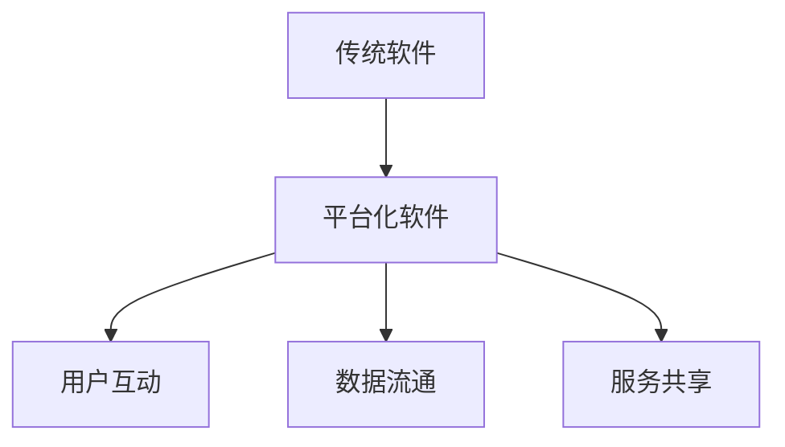
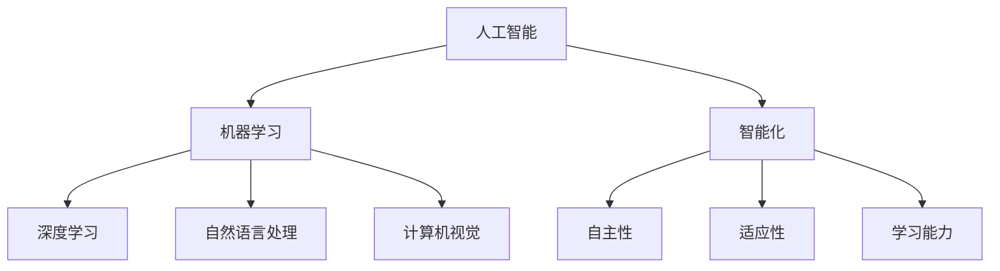
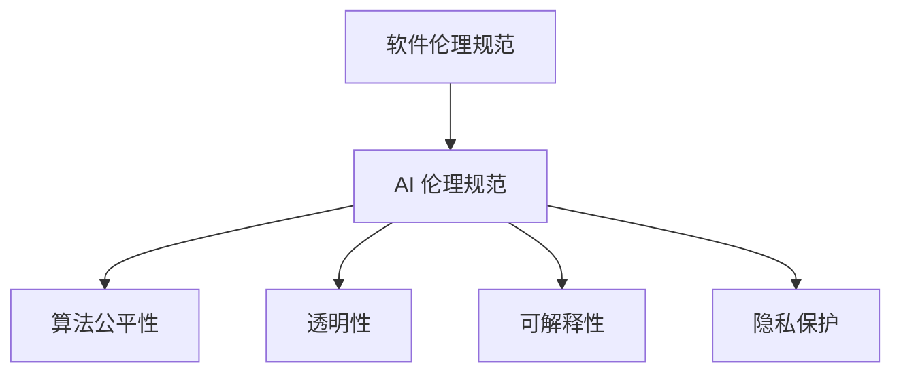
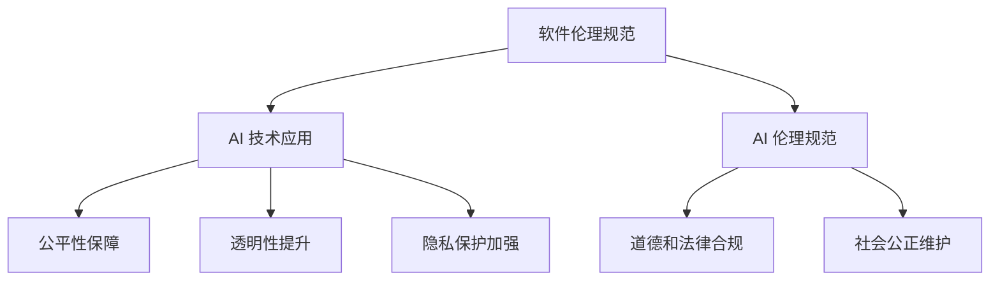

                 

### 背景介绍

软件 2.0，作为信息技术发展的一个新阶段，其核心在于将软件作为连接物理世界与数字世界的关键桥梁，推动各行各业实现智能化、网络化、协同化的发展。然而，随着人工智能技术的不断深入和广泛应用，软件 2.0 也面临着前所未有的挑战，尤其是在伦理规范方面。人工智能在软件 2.0 中的广泛应用，使得其决策和行为可能对人类生活产生深远影响，因此，对人工智能的伦理规范成为了一个亟待解决的问题。

本文旨在探讨软件 2.0 中人工智能的伦理规范，从责任、透明性、公正性等多个角度出发，分析人工智能在软件 2.0 中的应用场景，以及当前在伦理规范方面所面临的挑战。我们将通过一步一步的分析推理，试图找到解决这些问题的方法和策略。

首先，我们需要明确什么是软件 2.0。软件 2.0 可以被理解为将软件从传统的“工具”角色转变为“平台”角色，它不仅为用户提供服务，还能够通过智能算法实现用户之间的协同和共享。这种转变使得软件在连接人与物、人与服务、物与物之间发挥了更加重要的作用。

其次，人工智能在软件 2.0 中扮演着关键角色。通过深度学习、自然语言处理、图像识别等技术的应用，人工智能能够实现复杂的决策和推理，从而提高软件的智能化程度。然而，人工智能的这些能力也带来了伦理规范上的挑战。如何确保人工智能的决策和行为符合伦理标准，如何保证人工智能的透明性和公正性，这些都是我们需要深入探讨的问题。

在接下来的章节中，我们将首先介绍软件 2.0 和人工智能的基本概念，并通过 Mermaid 流程图展示它们的核心原理和架构。然后，我们将详细探讨人工智能在软件 2.0 中的应用场景，以及在这些场景中可能面临的伦理问题。接着，我们将分析当前在人工智能伦理规范方面所面临的挑战，并探讨可能的解决方案。最后，我们将总结未来发展趋势和挑战，并给出一些具体的建议。

通过本文的探讨，我们希望引起读者对软件 2.0 中人工智能伦理规范问题的关注，并激发更多的思考和讨论。这不仅对于推动人工智能技术的发展具有重要意义，也为构建一个更加公平、透明和可持续的数字社会提供了参考。

### 核心概念与联系

在探讨软件 2.0 的伦理规范之前，我们需要明确几个核心概念，并了解它们之间的联系。以下是软件 2.0 和人工智能（AI）的一些基本概念，我们将通过 Mermaid 流程图来展示它们之间的相互关系。

#### 软件与平台化

**软件**：传统的软件通常是指计算机程序，用于完成特定任务的工具。例如，文本编辑器、游戏、办公软件等。

**平台化软件**：在软件 2.0 的背景下，软件不仅仅是单一的任务执行工具，而是成为一个连接用户、数据和服务的平台。这种平台能够实现用户间的互动、数据的流通以及服务的共享。平台化软件的核心特点是模块化、高度可扩展性和智能化。

**流程图：**



#### 人工智能与智能化

**人工智能（AI）**：人工智能是指通过计算机模拟人类智能的理论、技术和应用。它包括机器学习、深度学习、自然语言处理、计算机视觉等多个子领域。

**智能化**：智能化是指通过应用人工智能技术，使软件具备更高的自主性、适应性和学习能力。智能化软件能够在不明确指令的情况下自主完成任务，并不断优化自身性能。

**流程图：**



#### 软件伦理规范

**伦理规范**：伦理规范是指一系列指导软件设计和应用的基本原则，用于确保软件的决策和行为符合道德和法律标准。

**AI 伦理规范**：在人工智能领域，伦理规范尤为重要。它涉及到算法的公平性、透明性、可解释性、隐私保护等问题。AI 伦理规范的目标是确保人工智能的决策和行为不会对人类造成伤害，同时维护社会的公平和正义。

**流程图：**



#### 软件伦理与人工智能的关系

软件伦理规范与人工智能之间存在密切的联系。一方面，软件伦理规范为人工智能的应用提供了指导原则，确保人工智能的开发和使用不会对社会产生负面影响。另一方面，人工智能技术的应用也为软件伦理规范的实施提供了新的手段和工具。

**流程图：**



通过上述核心概念的介绍和 Mermaid 流程图的展示，我们可以更加清晰地理解软件 2.0 和人工智能之间的联系，以及它们在伦理规范方面的重要性。在接下来的章节中，我们将进一步探讨人工智能在软件 2.0 中的应用场景，以及这些应用场景中可能出现的伦理问题。

### 核心算法原理 & 具体操作步骤

在软件 2.0 中，人工智能的应用主要体现在算法的设计和实现上。核心算法原理包括机器学习、深度学习和自然语言处理等，这些算法通过特定的操作步骤，使得软件能够实现智能化和自主决策。以下是这些核心算法的基本原理以及具体操作步骤的详细讲解。

#### 1. 机器学习算法原理

**原理**：机器学习是一种使计算机能够通过经验和数据进行自我改进的技术。它通过学习数据中的规律，形成模型，并对未知数据进行预测。

**操作步骤**：

1. **数据收集**：收集用于训练的数据集，这些数据可以是结构化的表格数据，也可以是非结构化的文本、图像、音频等。

2. **数据预处理**：对收集到的数据进行清洗、归一化和特征提取。例如，对于文本数据，可以通过词频统计、词嵌入等方法提取特征。

3. **模型选择**：选择适合问题的机器学习模型。常见的模型包括线性回归、决策树、支持向量机、神经网络等。

4. **模型训练**：使用训练数据集对模型进行训练，通过优化算法（如梯度下降）调整模型参数，使其能够准确地预测新数据。

5. **模型评估**：使用验证数据集评估模型的性能，常用的评估指标包括准确率、召回率、F1 值等。

6. **模型部署**：将训练好的模型部署到生产环境中，用于对新数据进行预测。

**示例**：假设我们要使用机器学习算法预测股票价格。首先，我们需要收集过去一段时间内的股票价格数据。然后，对数据进行预处理，提取如股票开盘价、收盘价、成交量等特征。接下来，选择适当的机器学习模型（如线性回归模型）进行训练。通过调整模型参数，使其能够准确地预测未来的股票价格。最后，将训练好的模型部署到线上系统，用于实时预测股票价格。

#### 2. 深度学习算法原理

**原理**：深度学习是机器学习的一个分支，通过多层神经网络模拟人脑的学习过程，实现对复杂数据的处理和预测。

**操作步骤**：

1. **数据收集**：与机器学习类似，收集用于训练的数据集，可以是结构化的表格数据，也可以是图像、文本、音频等。

2. **数据预处理**：对数据集进行清洗、归一化和特征提取。对于图像数据，可以通过卷积神经网络（CNN）提取特征。

3. **网络架构设计**：设计深度学习网络架构，包括输入层、隐藏层和输出层。选择合适的激活函数（如 ReLU）和损失函数（如交叉熵损失）。

4. **模型训练**：使用训练数据集对模型进行训练，通过反向传播算法优化网络参数。

5. **模型评估**：使用验证数据集评估模型性能，调整模型参数以提升预测准确性。

6. **模型部署**：将训练好的模型部署到生产环境中，用于对新数据进行预测。

**示例**：假设我们要使用深度学习算法进行图像分类。首先，我们需要收集大量的图像数据，并对数据进行预处理。然后，设计一个卷积神经网络模型，包括多个卷积层和池化层，用于提取图像特征。接着，使用训练数据集对模型进行训练，通过反向传播算法调整网络参数。最后，将训练好的模型部署到线上系统，用于对新的图像数据进行分类。

#### 3. 自然语言处理算法原理

**原理**：自然语言处理是一种使计算机能够理解和生成人类自然语言的技术。它涉及到语言模型、词向量、序列标注、文本分类等多个方面。

**操作步骤**：

1. **数据收集**：收集用于训练的数据集，如文本语料库、对话数据等。

2. **数据预处理**：对文本数据进行清洗、分词、词性标注等处理。

3. **词向量表示**：将文本转换为向量表示，常用的方法有 Word2Vec、GloVe 等。

4. **模型选择**：选择适合问题的自然语言处理模型，如循环神经网络（RNN）、长短时记忆网络（LSTM）、注意力机制（Attention）等。

5. **模型训练**：使用训练数据集对模型进行训练，通过优化算法调整模型参数。

6. **模型评估**：使用验证数据集评估模型性能，调整模型参数以提升预测准确性。

7. **模型部署**：将训练好的模型部署到生产环境中，用于文本分析、生成和交互。

**示例**：假设我们要使用自然语言处理算法进行文本分类。首先，我们需要收集大量的文本数据，并对数据进行预处理。然后，设计一个基于循环神经网络的文本分类模型，通过训练数据集对模型进行训练。最后，将训练好的模型部署到线上系统，用于对新的文本数据进行分类。

通过上述对机器学习、深度学习和自然语言处理算法原理及操作步骤的详细讲解，我们可以看到，这些算法在软件 2.0 中扮演着至关重要的角色，为软件的智能化和自主决策提供了强大的技术支持。在接下来的章节中，我们将探讨这些算法在实际应用中可能面临的伦理问题。

### 数学模型和公式 & 详细讲解 & 举例说明

在软件 2.0 中，人工智能算法的效能很大程度上依赖于数学模型的准确性和适用性。以下我们将详细讲解一些核心数学模型和公式，并通过实际例子来说明它们的应用。

#### 1. 线性回归模型

**公式：**

\[ y = w_0 + w_1 \cdot x \]

其中，\( y \) 是预测值，\( x \) 是输入特征，\( w_0 \) 和 \( w_1 \) 是模型参数。

**讲解：**

线性回归模型是最基础的机器学习模型之一，用于预测一个线性关系。它通过最小化误差平方和来求解最佳参数 \( w_0 \) 和 \( w_1 \)。在实际应用中，线性回归可以用于股票价格预测、房屋估值等领域。

**例子：**

假设我们要预测一个城市的未来一个月的平均温度。我们收集了过去几年同期的温度数据，并选择当前日期的平均温度作为输入特征 \( x \)。

使用线性回归模型，我们可以建立如下数学模型：

\[ \text{平均温度} = w_0 + w_1 \cdot \text{当前日期的平均温度} \]

通过最小二乘法求解 \( w_0 \) 和 \( w_1 \)，得到预测模型。例如，如果计算结果显示 \( w_0 = 10 \) 和 \( w_1 = 0.5 \)，则未来一个月的平均温度可以预测为：

\[ \text{平均温度} = 10 + 0.5 \cdot \text{当前日期的平均温度} \]

#### 2. 卷积神经网络（CNN）

**公式：**

卷积神经网络主要由卷积层、池化层和全连接层组成。卷积层的计算公式如下：

\[ f(x) = \sum_{i=1}^{k} w_i \cdot x_i + b \]

其中，\( f(x) \) 是卷积结果，\( w_i \) 是卷积核，\( x_i \) 是输入特征，\( b \) 是偏置。

**讲解：**

卷积神经网络是一种用于图像识别和处理的深度学习模型。它通过卷积操作提取图像特征，并通过池化操作降低特征维度。卷积神经网络在计算机视觉领域取得了显著成果，如人脸识别、图像分类等。

**例子：**

假设我们要使用卷积神经网络进行图像分类。首先，我们收集大量图像数据，并对图像进行预处理，如归一化和裁剪。然后，设计一个卷积神经网络模型，包括多个卷积层和池化层。

例如，一个简单的卷积神经网络模型可能包含以下结构：

- 输入层：接受预处理后的图像数据。
- 卷积层1：使用多个卷积核提取图像特征。
- 池化层1：降低特征维度。
- 卷积层2：使用更多卷积核进一步提取特征。
- 池化层2：继续降低特征维度。
- 全连接层：将特征映射到类别标签。

通过训练数据集对模型进行训练，使用反向传播算法优化模型参数。例如，如果训练结果显示模型参数为 \( w_1 = [0.1, 0.2, 0.3] \)，\( w_2 = [0.4, 0.5, 0.6] \)，则可以用于对新的图像数据进行分类。

#### 3. 循环神经网络（RNN）

**公式：**

循环神经网络的基本单元是循环单元，其计算公式如下：

\[ h_t = \sigma(W_h \cdot [h_{t-1}, x_t] + b_h) \]

其中，\( h_t \) 是当前时间步的隐藏状态，\( x_t \) 是当前输入，\( W_h \) 和 \( b_h \) 是模型参数，\( \sigma \) 是激活函数。

**讲解：**

循环神经网络是一种用于处理序列数据的深度学习模型。它能够记忆历史信息，适用于时间序列预测、自然语言处理等领域。

**例子：**

假设我们要使用循环神经网络进行时间序列预测。我们收集了一段时间内的股票价格数据，并选择前一天的股票价格作为输入序列。

使用循环神经网络模型，我们可以建立如下数学模型：

\[ h_t = \sigma(W_h \cdot [h_{t-1}, x_t] + b_h) \]

其中，\( h_t \) 是当前时间步的预测结果，\( x_t \) 是当前输入股票价格，\( W_h \) 和 \( b_h \) 是模型参数。

通过训练数据集对模型进行训练，使用反向传播算法优化模型参数。例如，如果训练结果显示模型参数为 \( W_h = [0.1, 0.2, 0.3] \)，\( b_h = 0.4 \)，则可以用于对新的股票价格数据进行预测。

通过上述对线性回归模型、卷积神经网络和循环神经网络等核心数学模型和公式的详细讲解，我们可以看到这些模型在软件 2.0 中的应用价值。它们不仅为软件的智能化和自主决策提供了强大的技术支持，也为解决实际应用中的问题提供了有效的工具。在接下来的章节中，我们将探讨这些模型在实际应用中可能面临的伦理问题。

### 项目实战：代码实际案例和详细解释说明

在本章节中，我们将通过一个实际项目案例，展示如何在实际应用中开发和实现人工智能算法。这个案例将涉及使用 Python 编写一个简单的机器学习模型，用于分类问题。我们将详细解释代码实现步骤、关键代码片段，并分析其工作原理。

#### 1. 项目背景

假设我们有一个分类问题，需要根据一组特征将数据分为两个类别。这个问题可以应用于多种实际场景，如邮件分类、垃圾邮件检测、客户行为预测等。为了简化问题，我们选择使用一个公开的数据集——Iris 数据集。

Iris 数据集包含 3 类 Iris 花的不同属性（萼片长度、萼片宽度、花瓣长度和花瓣宽度），总共有 150 个样本。我们的目标是训练一个机器学习模型，能够根据这些特征预测 Iris 花的类别。

#### 2. 开发环境搭建

首先，我们需要搭建一个 Python 开发环境。以下是所需的步骤：

- 安装 Python 3.8 或更高版本
- 安装 Jupyter Notebook，用于编写和运行 Python 代码
- 安装必要的 Python 库，如 NumPy、Pandas、Scikit-learn、Matplotlib 等

安装命令如下：

```bash
pip install python==3.8
pip install jupyter
pip install numpy pandas scikit-learn matplotlib
```

#### 3. 数据预处理

数据预处理是机器学习项目中的一个关键步骤，包括数据清洗、归一化和特征提取。以下是数据预处理的具体步骤：

1. **数据导入**：

```python
import pandas as pd

# 从 CSV 文件中加载数据集
data = pd.read_csv('iris.csv')
```

2. **数据清洗**：

在加载数据后，我们需要检查数据是否有缺失值或异常值。对于 Iris 数据集，通常数据质量较高，不需要过多的清洗操作。

3. **特征提取**：

我们将数据集中的四个特征（萼片长度、萼片宽度、花瓣长度、花瓣宽度）作为输入特征，并将类别标签作为输出特征。

```python
X = data[['sepal_length', 'sepal_width', 'petal_length', 'petal_width']]
y = data['species']
```

4. **数据归一化**：

为了使模型能够更好地收敛，我们需要对输入特征进行归一化处理。

```python
from sklearn.preprocessing import StandardScaler

scaler = StandardScaler()
X_scaled = scaler.fit_transform(X)
```

#### 4. 模型训练

接下来，我们将使用 Scikit-learn 库训练一个简单的 K-最近邻（K-Nearest Neighbors，K-NN）分类器。K-NN 是一种基于实例的学习算法，它通过计算新样本与训练样本之间的距离，选择最近的 k 个样本，并基于这些样本的类别标签进行预测。

1. **导入库和加载数据**：

```python
from sklearn.model_selection import train_test_split
from sklearn.neighbors import KNeighborsClassifier

# 将数据集分为训练集和测试集
X_train, X_test, y_train, y_test = train_test_split(X_scaled, y, test_size=0.2, random_state=42)
```

2. **初始化并训练模型**：

```python
# 初始化 K-NN 分类器，选择 k=3
knn = KNeighborsClassifier(n_neighbors=3)

# 使用训练集训练模型
knn.fit(X_train, y_train)
```

3. **模型评估**：

在训练模型后，我们需要使用测试集评估其性能。常用的评估指标包括准确率、召回率、F1 值等。

```python
from sklearn.metrics import accuracy_score

# 使用测试集进行预测
y_pred = knn.predict(X_test)

# 计算准确率
accuracy = accuracy_score(y_test, y_pred)
print(f"准确率：{accuracy:.2f}")
```

#### 5. 代码解读与分析

以下是完整的代码实现，并对其关键部分进行了解读。

```python
# 导入库和加载数据
import pandas as pd
from sklearn.model_selection import train_test_split
from sklearn.neighbors import KNeighborsClassifier
from sklearn.metrics import accuracy_score
from sklearn.preprocessing import StandardScaler

# 从 CSV 文件中加载数据集
data = pd.read_csv('iris.csv')

# 特征提取和归一化
X = data[['sepal_length', 'sepal_width', 'petal_length', 'petal_width']]
y = data['species']

scaler = StandardScaler()
X_scaled = scaler.fit_transform(X)

# 将数据集分为训练集和测试集
X_train, X_test, y_train, y_test = train_test_split(X_scaled, y, test_size=0.2, random_state=42)

# 初始化并训练 K-NN 分类器
knn = KNeighborsClassifier(n_neighbors=3)
knn.fit(X_train, y_train)

# 使用测试集进行预测并评估模型性能
y_pred = knn.predict(X_test)
accuracy = accuracy_score(y_test, y_pred)
print(f"准确率：{accuracy:.2f}")
```

**关键代码解读**：

- **数据导入**：使用 pandas 库从 CSV 文件中加载数据集。
- **特征提取和归一化**：将数据集中的四个特征作为输入特征，并将类别标签作为输出特征。使用 StandardScaler 进行数据归一化。
- **数据集划分**：将数据集分为训练集和测试集，用于训练和评估模型。
- **模型训练**：初始化 K-NN 分类器，并使用训练集训练模型。
- **模型评估**：使用测试集进行预测，并计算准确率。

通过这个实际案例，我们可以看到如何使用 Python 和机器学习库实现一个简单的分类任务。这个案例展示了从数据预处理到模型训练和评估的完整流程，为读者提供了一个实际操作的参考。

#### 6. 总结

在本章中，我们通过一个简单的机器学习项目，详细讲解了从数据预处理到模型训练和评估的完整流程。通过这个案例，读者可以了解到如何在实际项目中应用机器学习算法，并掌握关键代码的实现和解读。这个案例不仅有助于理解机器学习的基本原理，也为实际应用提供了实践经验。

### 实际应用场景

在软件 2.0 的时代，人工智能的广泛应用已经深入到各个行业和领域，从医疗、金融到制造业、零售业，都在借助人工智能技术提升效率、降低成本、改善用户体验。以下是一些典型的人工智能在软件 2.0 中的实际应用场景，以及其中可能面临的伦理问题。

#### 1. 医疗领域

**应用**：在医疗领域，人工智能被广泛应用于医疗影像分析、疾病预测、个性化治疗等方面。例如，AI 可以通过分析大量的医学影像数据，辅助医生进行诊断，提高诊断的准确性和效率。

**伦理问题**：首先，人工智能在医疗诊断中的准确性和可靠性问题是一个重要的伦理挑战。如果 AI 的诊断结果不准确，可能会导致误诊或漏诊，对患者的健康产生严重影响。其次，数据隐私和患者信息的保护也是一个关键问题。在处理大量的医疗数据时，如何确保这些数据的安全和隐私，避免数据泄露或滥用，是一个亟待解决的伦理问题。

#### 2. 金融领域

**应用**：在金融领域，人工智能被用于风险管理、欺诈检测、投资预测等方面。例如，银行和金融机构使用 AI 算法来分析客户的交易行为，预测潜在的风险，并采取相应的预防措施。

**伦理问题**：金融领域的人工智能应用面临的主要伦理问题包括算法的透明性和公平性。一方面，算法的透明性是一个重要的问题，因为复杂的算法模型通常缺乏可解释性，这使得用户难以理解算法的决策过程。另一方面，算法的公平性也是一个关键问题。如果算法存在偏见，可能会导致对某些群体（如女性、少数族裔）的歧视性决策，从而影响金融服务的公平性。

#### 3. 制造业

**应用**：在制造业中，人工智能被用于生产线的自动化控制、设备故障预测、供应链优化等方面。例如，AI 可以通过监控设备运行状态，预测设备的故障时间，从而提前进行维护，减少停机时间。

**伦理问题**：制造业中的人工智能应用主要涉及安全和隐私问题。首先，AI 控制的生产系统如果出现故障，可能会对工人安全和生产过程造成威胁。其次，在生产过程中产生的数据隐私问题也需要重视，如如何确保设备收集的数据不被滥用或泄露。

#### 4. 零售业

**应用**：在零售业中，人工智能被用于客户行为分析、个性化推荐、库存管理等方面。例如，零售商可以使用 AI 算法分析消费者的购买历史，预测消费者的购买偏好，从而进行精准营销。

**伦理问题**：零售业中的人工智能应用主要涉及隐私保护和数据安全。首先，消费者数据的安全问题是一个关键挑战，因为零售业涉及大量的消费者个人信息。其次，如何确保 AI 推荐系统的公平性和透明性，避免对消费者的偏见和误导，也是一个重要的伦理问题。

#### 5. 公共安全

**应用**：在公共安全领域，人工智能被用于人脸识别、交通流量分析、犯罪预测等方面。例如，公安机关可以使用 AI 技术进行人脸识别，快速识别嫌疑人，提高抓捕效率。

**伦理问题**：公共安全领域的人工智能应用涉及隐私和权利的平衡问题。一方面，人脸识别等技术可以提高公共安全，但同时也可能侵犯个人隐私。另一方面，如何确保 AI 系统的公正性和透明性，避免误识别和歧视问题，是一个重要的伦理挑战。

通过上述实际应用场景的介绍，我们可以看到人工智能在软件 2.0 中的广泛应用及其带来的伦理问题。在接下来的章节中，我们将进一步探讨人工智能伦理规范的挑战和解决方案。

### 工具和资源推荐

在探讨软件 2.0 中人工智能伦理规范的挑战与解决方案时，掌握相关工具和资源对于深入研究和实践至关重要。以下是一些推荐的学习资源、开发工具和相关的论文著作，旨在为读者提供全面的技术支持和知识储备。

#### 1. 学习资源推荐

**书籍**：

- 《人工智能：一种现代的方法》（第 3 版）—— Stuart Russell 和 Peter Norvig 著
- 《深度学习》（第 2 版）—— Ian Goodfellow、Yoshua Bengio 和 Aaron Courville 著
- 《机器学习实战》—— Peter Harrington 著

**论文**：

- "Ethical Considerations in Artificial Intelligence: A Survey"——Sergey Zagoruyko 和 Nikita Khrapitchev 著
- "The Quest for an Ethical AI"——Luciano Floridi 和 J. William Streeter 著
- "Fairness and Accountability in Machine Learning"——Solon Barocas、Aria Prifti 和 Eric R. Silver 著

**博客和网站**：

- arXiv.org：计算机科学领域的预印本论文库
- Medium：有关人工智能和伦理问题的深度文章和讨论
- AI Journal：人工智能领域的专业期刊和文章

#### 2. 开发工具推荐

**编程语言**：

- Python：广泛用于人工智能开发的编程语言，具有丰富的库和框架
- R：专门用于统计分析的编程语言，适用于数据科学和机器学习
- Julia：高性能的科学计算和数据分析语言，适用于复杂数学模型和算法

**机器学习和深度学习库**：

- Scikit-learn：Python 中常用的机器学习库，提供多种算法和工具
- TensorFlow：谷歌开发的开源深度学习框架，适用于大规模数据处理和模型训练
- PyTorch：基于 Python 的深度学习库，具有良好的灵活性和易用性

**数据可视化工具**：

- Matplotlib：Python 中的数据可视化库，用于绘制各种统计图表
- Seaborn：基于 Matplotlib 的可视化库，提供更丰富的统计图表和样式
- Plotly：提供交互式数据可视化的 JavaScript 库，支持多种图表类型

#### 3. 相关论文著作推荐

- "Artificial Intelligence: A Modern Approach"——Stuart Russell 和 Peter Norvig 著
- "Deep Learning"——Ian Goodfellow、Yoshua Bengio 和 Aaron Courville 著
- "The Ethical Algorithm: The Science of Socially Aware Algorithm Design"——Avi Goldfarb、Bradley T. Efron 和 Michael I. Specter 著
- "Algorithms of Oppression: How Search Engines Reinforce Racism"——Safiya Umoja Noble 著

通过上述工具和资源的推荐，我们为读者提供了丰富的学习材料和开发工具，有助于深入理解和应用人工智能伦理规范的相关知识。这些资源不仅适用于学术研究，也为实际项目开发提供了宝贵的参考和支持。

### 总结：未来发展趋势与挑战

在软件 2.0 的时代，人工智能（AI）的应用已经深入到各个领域，极大地推动了社会的发展和变革。然而，随着 AI 技术的飞速进步，其伦理规范问题也变得越来越重要。本文从多个角度探讨了软件 2.0 中人工智能伦理规范的核心问题，并提出了若干挑战和未来发展的方向。

首先，AI 的广泛应用带来了前所未有的机遇。在医疗、金融、制造、零售等行业，AI 技术的应用提高了效率、降低了成本，并改善了用户体验。例如，通过 AI 技术的辅助，医疗诊断的准确性得到了显著提升，金融欺诈检测的效率也得到了大幅提高。这些应用不仅为企业带来了直接的经济效益，也为社会整体发展注入了新的动力。

然而，AI 技术的快速发展也带来了诸多伦理挑战。首先，算法的透明性和可解释性问题备受关注。复杂的 AI 算法通常缺乏透明性，难以让人理解其决策过程。这可能导致用户对 AI 产生不信任，甚至引发法律和伦理问题。其次，算法的偏见和歧视问题也是一个重要挑战。如果 AI 算法存在偏见，可能会对特定群体（如女性、少数族裔）产生不公平的决策，从而加剧社会的不平等。此外，数据隐私和信息安全问题也是 AI 应用中的关键挑战。在处理大量个人数据时，如何确保数据的安全和隐私，避免数据泄露或滥用，是一个亟待解决的伦理问题。

面对这些挑战，未来发展的方向和策略包括：

1. **提高算法透明性和可解释性**：研究和开发更易于解释的 AI 算法，提高算法的可解释性，让用户能够理解 AI 的决策过程。这有助于增强用户对 AI 的信任，减少法律和伦理问题。

2. **消除算法偏见和歧视**：通过公平性分析和算法优化，消除 AI 算法中的偏见和歧视。这需要从数据收集、算法设计到模型训练的各个环节，进行全面的公平性评估和改进。

3. **加强数据隐私和信息安全**：在 AI 应用过程中，严格保护个人数据的隐私和安全。采用加密、匿名化等技术手段，确保数据的保密性和完整性，防止数据泄露或滥用。

4. **建立全球性伦理规范**：在全球范围内，建立统一的 AI 伦理规范，协调各国在 AI 应用中的伦理标准。这有助于推动全球 AI 技术的健康发展，减少跨境数据流动带来的法律和伦理风险。

总之，软件 2.0 时代的人工智能伦理规范问题具有重要意义。通过加强研究和实践，推动透明性、公平性和隐私保护，我们可以构建一个更加公平、安全、可持续的数字社会。这不仅有助于推动人工智能技术的进步，也为人类社会的可持续发展提供了重要保障。

### 附录：常见问题与解答

在本文中，我们探讨了软件 2.0 中人工智能伦理规范的核心问题，并分析了相关应用场景和挑战。在此，我们汇总了一些常见问题，并提供详细的解答，以便读者更好地理解和应用本文的内容。

#### 1. 什么是软件 2.0？

软件 2.0 是信息技术发展的一个新阶段，它将软件从传统的“工具”角色转变为“平台”角色。软件 2.0 强调软件作为连接物理世界与数字世界的关键桥梁，通过智能算法实现用户之间的协同和共享。这使得软件在连接人与物、人与服务、物与物之间发挥了更加重要的作用。

#### 2. 人工智能在软件 2.0 中有哪些应用场景？

人工智能在软件 2.0 中有广泛的应用场景，包括但不限于以下领域：

- **医疗领域**：辅助医生进行诊断、疾病预测和个性化治疗。
- **金融领域**：进行风险管理、欺诈检测和投资预测。
- **制造业**：实现生产线的自动化控制、设备故障预测和供应链优化。
- **零售业**：进行客户行为分析、个性化推荐和库存管理。
- **公共安全**：进行人脸识别、交通流量分析和犯罪预测。

#### 3. 人工智能应用中常见的伦理问题有哪些？

人工智能应用中常见的伦理问题包括：

- **算法的透明性和可解释性**：复杂的算法模型通常难以解释，用户难以理解其决策过程。
- **算法的偏见和歧视**：如果算法存在偏见，可能会导致对特定群体产生不公平的决策。
- **数据隐私和信息安全**：在处理大量个人数据时，如何确保数据的安全和隐私，避免数据泄露或滥用。

#### 4. 如何提高算法的透明性和可解释性？

提高算法的透明性和可解释性可以从以下几个方面入手：

- **开发易于解释的算法**：研究和开发更易于解释的 AI 算法，提高算法的可解释性。
- **可视化算法决策过程**：通过可视化工具展示算法的决策过程，让用户能够理解其工作原理。
- **提供算法文档和说明**：为算法提供详细的文档和说明，帮助用户理解算法的设计和实现。

#### 5. 如何消除算法的偏见和歧视？

消除算法的偏见和歧视可以从以下几个方面入手：

- **公平性分析**：在算法设计阶段进行公平性分析，确保算法不会对特定群体产生歧视性决策。
- **算法优化**：通过算法优化，消除算法中的偏见和歧视。
- **数据平衡**：确保训练数据集的平衡性，避免因数据不平衡导致的算法偏见。

#### 6. 如何保护数据隐私和信息安全？

保护数据隐私和信息安全可以从以下几个方面入手：

- **数据加密**：采用加密技术保护敏感数据，确保数据在传输和存储过程中的安全性。
- **匿名化处理**：对个人数据进行匿名化处理，减少数据泄露的风险。
- **权限管理**：实施严格的权限管理策略，确保只有授权人员可以访问和处理敏感数据。

通过上述常见问题的解答，我们希望读者能够更好地理解软件 2.0 中人工智能伦理规范的核心内容，并在实际应用中遵循相应的伦理原则，构建一个更加公平、透明和安全的数字社会。

### 扩展阅读与参考资料

为了深入理解软件 2.0 中人工智能伦理规范的相关问题，以下推荐一些扩展阅读和参考资料，涵盖相关书籍、论文、博客及网站，以供读者进一步学习和研究。

**书籍推荐**：

1. **《人工智能：一种现代的方法》（第 3 版）**—— Stuart Russell 和 Peter Norvig 著
   - 本书系统地介绍了人工智能的基本理论和应用，包括机器学习、自然语言处理、计算机视觉等多个领域，是人工智能领域的经典教材。

2. **《深度学习》（第 2 版）**—— Ian Goodfellow、Yoshua Bengio 和 Aaron Courville 著
   - 本书详细讲解了深度学习的基础知识、算法和应用，适合对深度学习有深入兴趣的读者。

3. **《算法时代：人工智能的法律与伦理》**—— Luciano Floridi 著
   - 本书从法律和伦理角度探讨了人工智能的发展及其对社会的影响，对人工智能伦理规范问题进行了深入分析。

**论文推荐**：

1. **"Ethical Considerations in Artificial Intelligence: A Survey"**——Sergey Zagoruyko 和 Nikita Khrapitchev 著
   - 该论文综述了人工智能伦理规范领域的相关研究，讨论了算法公平性、透明性、隐私保护等关键问题。

2. **"The Quest for an Ethical AI"**——Luciano Floridi 和 J. William Streeter 著
   - 本文探讨了构建伦理的人工智能系统的挑战和路径，提出了若干原则和策略。

3. **"Fairness and Accountability in Machine Learning"**——Solon Barocas、Aria Prifti 和 Eric R. Silver 著
   - 本文分析了机器学习中的公平性和责任问题，提出了评估算法公平性的方法和建议。

**博客和网站推荐**：

1. **[AI Journal](https://aijournal.org/)**
   - AI Journal 是一个专注于人工智能领域的在线期刊，提供最新研究论文和观点，是了解人工智能研究动态的重要资源。

2. **[AI Ethics](https://aiethicsjournal.com/)**
   - AI Ethics 是一个专门讨论人工智能伦理问题的博客，包含丰富的案例分析和讨论。

3. **[DeepMind Research Blog](https://www.deeplearning.net/)**
   - DeepMind 的研究博客，介绍深度学习和人工智能的最新研究成果和技术进展。

通过阅读上述书籍、论文和访问相关博客和网站，读者可以进一步拓展对软件 2.0 中人工智能伦理规范的理解，深入探讨相关理论和实践问题。这些资源不仅有助于学术研究，也为实际项目开发提供了宝贵的指导和参考。

