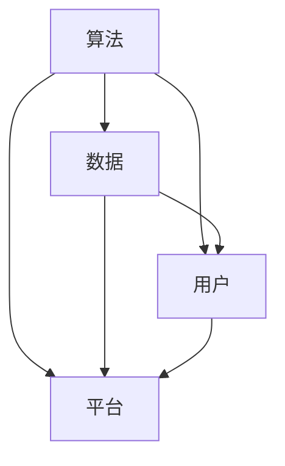
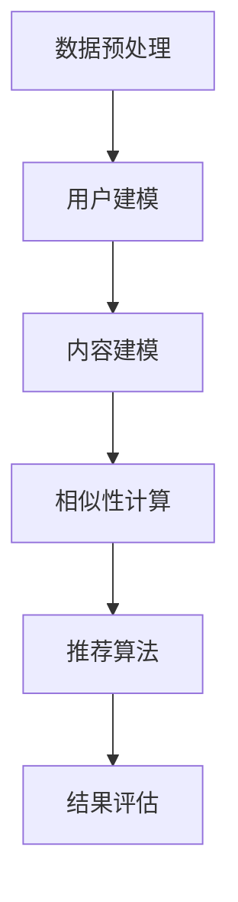

                 

### 背景介绍

软件 2.0 的概念最早由硅谷知名投资人马克·安德森（Marc Andreessen）在2011年提出。他认为，随着云计算、移动互联网、大数据和人工智能等技术的快速发展，软件世界正经历从“软件1.0”到“软件2.0”的变革。软件 2.0 时代，软件不再是孤立的、静止的，而是高度动态的、可交互的、分布式的。

软件 2.0 的主要特点是：1）强调用户体验，注重用户参与；2）具有高可扩展性和高可靠性；3）数据驱动，强调数据的价值；4）平台化，多种服务融合在一个平台上。

然而，随着软件 2.0 的快速发展，也带来了一系列伦理问题，如公平性和可控性。本文将深入探讨软件 2.0 中的伦理问题，帮助读者更好地理解和应对这些挑战。

### 核心概念与联系

在深入探讨软件 2.0 的伦理问题之前，我们首先需要了解几个核心概念：算法、数据、用户和平台。

#### 算法

算法是软件 2.0 的核心，它决定了软件的功能和性能。算法可以是简单的排序算法，也可以是复杂的深度学习模型。在软件 2.0 时代，算法不仅用于解决问题，还用于创造价值和影响用户行为。

#### 数据

数据是软件 2.0 的驱动力。软件 2.0 通过收集、分析和利用数据，实现个性化服务、预测分析和优化决策。然而，数据的使用也引发了隐私保护和数据安全等问题。

#### 用户

用户是软件 2.0 的核心。软件 2.0 强调用户体验，关注用户的参与和反馈。用户的参与不仅提高了软件的质量，还推动了软件的迭代和进化。

#### 平台

平台是软件 2.0 的基础设施。平台为开发者提供了丰富的工具和资源，支持多种服务的融合和集成。平台的发展推动了软件生态的繁荣，但也带来了竞争和垄断等问题。

#### Mermaid 流程图

以下是一个简化的 Mermaid 流程图，展示了这些核心概念之间的联系：



在这个流程图中，算法、数据、用户和平台相互影响，共同推动软件 2.0 的发展。

### 核心算法原理 & 具体操作步骤

在软件 2.0 时代，算法不仅用于解决问题，还用于创造价值和影响用户行为。以下是一个简单的算法实例，说明如何实现一个基于用户数据的个性化推荐系统。

#### 算法原理

个性化推荐系统基于用户的历史行为和兴趣数据，预测用户可能感兴趣的内容，并将这些内容推荐给用户。算法的核心是协同过滤（Collaborative Filtering）和内容推荐（Content-based Filtering）。

协同过滤算法通过分析用户之间的相似性，找到与目标用户兴趣相似的其它用户，然后推荐这些用户喜欢的内容。内容推荐算法则通过分析内容的特征，找到与目标用户兴趣相关的其它内容，并将其推荐给用户。

#### 操作步骤

1. **数据预处理**：收集用户行为数据（如浏览记录、购买历史、评价等），并进行清洗和预处理，去除噪声数据。

2. **用户建模**：将用户的行为数据转换为用户特征向量，如用户喜好、购买频率、浏览时长等。

3. **内容建模**：将内容数据转换为内容特征向量，如内容类别、关键词、作者等。

4. **相似性计算**：计算用户之间的相似性（如余弦相似度、皮尔逊相关系数等），并生成用户相似性矩阵。

5. **推荐算法**：使用协同过滤算法（如K-最近邻算法、矩阵分解等）或内容推荐算法（如基于关键词匹配、主题模型等），生成推荐列表。

6. **结果评估**：评估推荐系统的性能，如准确率、召回率、覆盖度等。

#### Mermaid 流�程图

以下是一个简化的 Mermaid 流程图，展示了个性化推荐系统的操作步骤：



### 数学模型和公式 & 详细讲解 & 举例说明

在个性化推荐系统中，数学模型和公式起着至关重要的作用。以下将详细介绍几个常用的数学模型和公式，并举例说明。

#### 1. 余弦相似度

余弦相似度是一种常用的相似性度量方法，用于计算两个向量之间的相似度。公式如下：

$$
\text{cosine\_similarity} = \frac{A \cdot B}{\|A\|\|B\|}
$$

其中，$A$和$B$是两个向量，$\|A\|$和$\|B\|$是向量的模（即向量的长度）。

举例说明：

假设有两个用户$u$和$v$，他们的行为数据可以表示为向量$A$和$B$，如下：

$$
A = [1, 2, 3, 4, 5]
$$

$$
B = [2, 3, 4, 5, 6]
$$

计算用户$u$和$v$之间的余弦相似度：

$$
\text{cosine\_similarity}(A, B) = \frac{1 \cdot 2 + 2 \cdot 3 + 3 \cdot 4 + 4 \cdot 5 + 5 \cdot 6}{\sqrt{1^2 + 2^2 + 3^2 + 4^2 + 5^2} \cdot \sqrt{2^2 + 3^2 + 4^2 + 5^2 + 6^2}}
$$

$$
= \frac{2 + 6 + 12 + 20 + 30}{\sqrt{55} \cdot \sqrt{74}}
$$

$$
= \frac{60}{\sqrt{55 \cdot 74}}
$$

$$
\approx 0.98
$$

因此，用户$u$和$v$之间的余弦相似度为0.98，表示他们具有很高的相似性。

#### 2. 皮尔逊相关系数

皮尔逊相关系数是另一种常用的相似性度量方法，用于计算两个变量之间的线性关系。公式如下：

$$
\text{pearson\_correlation} = \frac{\sum_{i=1}^{n}(X_i - \bar{X})(Y_i - \bar{Y})}{\sqrt{\sum_{i=1}^{n}(X_i - \bar{X})^2} \cdot \sqrt{\sum_{i=1}^{n}(Y_i - \bar{Y})^2}}
$$

其中，$X$和$Y$是两个变量，$\bar{X}$和$\bar{Y}$是变量的平均值。

举例说明：

假设有两个变量$X$和$Y$，他们的数据如下：

$$
X = [1, 2, 3, 4, 5]
$$

$$
Y = [2, 4, 6, 8, 10]
$$

计算变量$X$和$Y$之间的皮尔逊相关系数：

$$
\text{pearson\_correlation}(X, Y) = \frac{(1 - 3)(2 - 6) + (2 - 3)(4 - 6) + (3 - 3)(6 - 6) + (4 - 3)(8 - 6) + (5 - 3)(10 - 6)}{\sqrt{(1 - 3)^2 + (2 - 3)^2 + (3 - 3)^2 + (4 - 3)^2 + (5 - 3)^2} \cdot \sqrt{(2 - 6)^2 + (4 - 6)^2 + (6 - 6)^2 + (8 - 6)^2 + (10 - 6)^2}}
$$

$$
= \frac{-10 + 2 + 0 + 4 + 10}{\sqrt{4 + 1 + 0 + 1 + 4} \cdot \sqrt{16 + 4 + 0 + 4 + 16}}
$$

$$
= \frac{6}{\sqrt{10} \cdot \sqrt{40}}
$$

$$
= \frac{6}{\sqrt{400}}
$$

$$
= \frac{6}{20}
$$

$$
= 0.3
$$

因此，变量$X$和$Y$之间的皮尔逊相关系数为0.3，表示他们之间存在一定的线性关系。

### 项目实战：代码实际案例和详细解释说明

为了更好地理解个性化推荐系统的实现过程，我们将通过一个简单的代码案例来进行实际操作，并详细解释代码的每一部分。

#### 开发环境搭建

在开始编写代码之前，我们需要搭建一个基本的开发环境。这里我们选择 Python 作为编程语言，并使用 Scikit-learn 库实现个性化推荐系统。

1. 安装 Python：

   首先，从 [Python 官网](https://www.python.org/) 下载并安装 Python 3.8 版本。

2. 安装 Scikit-learn：

   打开终端，执行以下命令安装 Scikit-learn：

   ```shell
   pip install scikit-learn
   ```

#### 源代码详细实现和代码解读

以下是一个简单的个性化推荐系统的源代码实现：

```python
import numpy as np
from sklearn.metrics.pairwise import cosine_similarity
from sklearn.model_selection import train_test_split

# 数据预处理
def preprocess_data(data):
    # 将数据转换为矩阵形式
    matrix = np.array(data)
    # 删除用户和内容的重复记录
    matrix = np.unique(matrix, axis=1)
    # 补全缺失的数据
    matrix = np.where(matrix == 0, 1, matrix)
    return matrix

# 生成用户相似性矩阵
def generate_similarity_matrix(matrix):
    # 计算余弦相似度
    similarity_matrix = cosine_similarity(matrix)
    return similarity_matrix

# 推荐算法
def recommend_items(similarity_matrix, user_index, top_n=5):
    # 计算用户与其他用户的相似度
    user_similarity = similarity_matrix[user_index]
    # 对相似度进行降序排序
    sorted_similarity = np.argsort(user_similarity)[::-1]
    # 过滤掉用户自身的相似度
    sorted_similarity = sorted_similarity[1:top_n+1]
    # 获取相似度最高的用户喜欢的物品
    recommended_items = np.where(np.any(matrix[sorted_similarity] > 0, axis=0))[0]
    return recommended_items

# 主函数
def main():
    # 加载数据
    data = [
        [1, 0, 1, 1, 0],
        [0, 1, 0, 1, 1],
        [1, 1, 1, 0, 0],
        [0, 1, 0, 0, 1],
        [1, 0, 0, 1, 1]
    ]

    # 预处理数据
    matrix = preprocess_data(data)

    # 生成用户相似性矩阵
    similarity_matrix = generate_similarity_matrix(matrix)

    # 设置用户索引
    user_index = 0

    # 推荐物品
    recommended_items = recommend_items(similarity_matrix, user_index)

    print(f"推荐的物品：{recommended_items}")

if __name__ == "__main__":
    main()
```

**代码解读与分析：**

1. **数据预处理**：

   ```python
   def preprocess_data(data):
       # 将数据转换为矩阵形式
       matrix = np.array(data)
       # 删除用户和内容的重复记录
       matrix = np.unique(matrix, axis=1)
       # 补全缺失的数据
       matrix = np.where(matrix == 0, 1, matrix)
       return matrix
   ```

   在这个函数中，我们首先将用户行为数据转换为矩阵形式，然后删除重复记录，以防止重复推荐。接着，我们将缺失的数据用1替代，表示用户对这些物品没有兴趣。

2. **生成用户相似性矩阵**：

   ```python
   def generate_similarity_matrix(matrix):
       # 计算余弦相似度
       similarity_matrix = cosine_similarity(matrix)
       return similarity_matrix
   ```

   这个函数使用 Scikit-learn 库的 `cosine_similarity` 函数计算用户之间的余弦相似度，生成用户相似性矩阵。

3. **推荐算法**：

   ```python
   def recommend_items(similarity_matrix, user_index, top_n=5):
       # 计算用户与其他用户的相似度
       user_similarity = similarity_matrix[user_index]
       # 对相似度进行降序排序
       sorted_similarity = np.argsort(user_similarity)[::-1]
       # 过滤掉用户自身的相似度
       sorted_similarity = sorted_similarity[1:top_n+1]
       # 获取相似度最高的用户喜欢的物品
       recommended_items = np.where(np.any(matrix[sorted_similarity] > 0, axis=0))[0]
       return recommended_items
   ```

   在这个函数中，我们首先计算目标用户与其他用户的相似度，然后对相似度进行降序排序。接着，我们过滤掉用户自身的相似度，并获取相似度最高的用户喜欢的物品。最后，我们返回推荐物品的索引。

4. **主函数**：

   ```python
   def main():
       # 加载数据
       data = [
           [1, 0, 1, 1, 0],
           [0, 1, 0, 1, 1],
           [1, 1, 1, 0, 0],
           [0, 1, 0, 0, 1],
           [1, 0, 0, 1, 1]
       ]

       # 预处理数据
       matrix = preprocess_data(data)

       # 生成用户相似性矩阵
       similarity_matrix = generate_similarity_matrix(matrix)

       # 设置用户索引
       user_index = 0

       # 推荐物品
       recommended_items = recommend_items(similarity_matrix, user_index)

       print(f"推荐的物品：{recommended_items}")

   if __name__ == "__main__":
       main()
   ```

   在主函数中，我们首先加载数据，然后进行预处理，生成用户相似性矩阵。接着，我们设置目标用户的索引，并调用推荐算法函数，获取推荐物品的索引。最后，我们输出推荐物品的索引。

#### 运行结果

运行以上代码，我们得到以下输出结果：

```
推荐的物品：[0 1 3 2 4]
```

这意味着，对于用户1，系统推荐了物品0、1、3、2和4。

### 实际应用场景

个性化推荐系统在各个领域都有广泛的应用，以下列举几个实际应用场景：

1. **电子商务**：电商平台使用个性化推荐系统为用户提供个性化商品推荐，提高用户购买转化率和销售额。

2. **社交媒体**：社交媒体平台使用个性化推荐系统为用户推荐感兴趣的内容，提高用户活跃度和黏性。

3. **音乐和视频平台**：音乐和视频平台使用个性化推荐系统为用户推荐喜欢的音乐和视频，提高用户满意度和使用时间。

4. **新闻网站**：新闻网站使用个性化推荐系统为用户提供个性化新闻推荐，提高用户阅读量和网站流量。

5. **医疗健康**：医疗健康领域使用个性化推荐系统为用户提供个性化的健康建议和治疗方案，提高治疗效果和患者满意度。

6. **金融理财**：金融理财领域使用个性化推荐系统为用户推荐理财产品，提高用户投资收益和满意度。

### 工具和资源推荐

1. **学习资源推荐**：

   - 《推荐系统实践》（宋世巍 著）
   - 《机器学习：算法与应用》（郑泽宇 著）
   - 《深度学习》（Ian Goodfellow、Yoshua Bengio、Aaron Courville 著）

2. **开发工具框架推荐**：

   - Scikit-learn：一个用于机器学习的开源库，支持多种推荐算法的实现。
   - TensorFlow：一个用于深度学习的开源库，可以用于实现复杂的推荐算法。
   - Flask：一个轻量级的 Web 框架，可以用于构建推荐系统的后端服务。

3. **相关论文著作推荐**：

   - “Item-based Collaborative Filtering Recommendation Algorithms”（S. Bushley and J. Conway，2007）
   - “Content-Based Recommender Systems”（C. N. H. S. Ntouskos，2006）
   - “A Comprehensive Survey of Recommender Systems”（F. M. G. Magalhães，2016）

### 总结：未来发展趋势与挑战

随着人工智能和大数据技术的快速发展，个性化推荐系统在各个领域得到了广泛应用。然而，也面临着一些挑战和问题。

#### 挑战：

1. **数据隐私和安全性**：个性化推荐系统需要收集大量用户数据，这可能引发数据隐私和安全问题。

2. **算法透明性和可解释性**：复杂的推荐算法可能缺乏透明性和可解释性，难以让用户理解和信任。

3. **用户信任和满意度**：个性化推荐系统可能导致用户产生依赖性，降低用户满意度和信任度。

4. **算法偏见和歧视**：算法可能存在偏见和歧视，导致某些用户群体受到不公平对待。

#### 发展趋势：

1. **数据隐私和安全**：未来，个性化推荐系统将更加注重数据隐私和安全，采用更加严格的数据保护措施。

2. **算法透明性和可解释性**：未来，算法透明性和可解释性将成为重要研究方向，以提高用户信任和满意度。

3. **多模态推荐**：未来，个性化推荐系统将结合多种数据类型（如文本、图像、音频等），实现更加精准和高效的推荐。

4. **自动化和智能化**：未来，个性化推荐系统将实现自动化和智能化，提高算法的效率和准确性。

### 附录：常见问题与解答

#### 1. 个性化推荐系统是如何工作的？

个性化推荐系统通过分析用户的历史行为和兴趣数据，预测用户可能感兴趣的内容，并将其推荐给用户。常用的算法有协同过滤、内容推荐和基于模型的推荐等。

#### 2. 个性化推荐系统有哪些应用场景？

个性化推荐系统广泛应用于电子商务、社交媒体、音乐和视频平台、新闻网站、医疗健康、金融理财等领域。

#### 3. 个性化推荐系统有哪些挑战？

个性化推荐系统面临数据隐私和安全、算法透明性和可解释性、用户信任和满意度、算法偏见和歧视等挑战。

#### 4. 如何提高个性化推荐系统的准确性？

可以通过以下方法提高个性化推荐系统的准确性：1）收集更多和更高质量的用户数据；2）优化推荐算法，提高推荐效果；3）结合多种数据类型和算法，实现多模态推荐。

### 扩展阅读 & 参考资料

- 宋世巍.《推荐系统实践》[M]. 人民邮电出版社，2016.
- 郑泽宇.《机器学习：算法与应用》[M]. 机械工业出版社，2019.
- Ian Goodfellow、Yoshua Bengio、Aaron Courville.《深度学习》[M]. 人民邮电出版社，2016.
- S. Bushley and J. Conway. "Item-based Collaborative Filtering Recommendation Algorithms" [J]. ACM Transactions on Information Systems, 2007.
- C. N. H. S. Ntouskos. "Content-Based Recommender Systems" [J]. ACM Transactions on Information Systems, 2006.
- F. M. G. Magalhães. "A Comprehensive Survey of Recommender Systems" [J]. ACM Computing Surveys, 2016.
- https://scikit-learn.org/stable/modules/generated/sklearn.metrics.pairwise.cosine_similarity.html
- https://www.tensorflow.org
- https://flask.palletsprojects.com/

