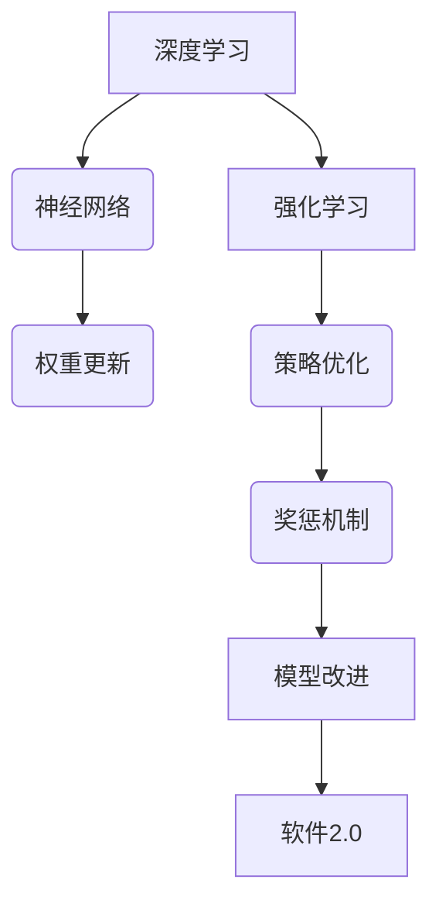
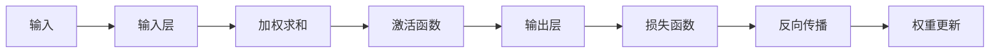
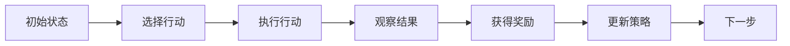
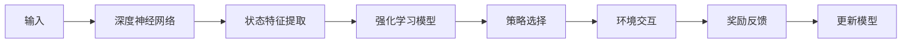
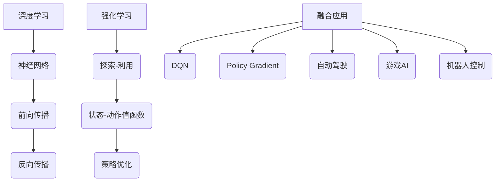

                 

# 软件2.0的发展趋势：深度学习、强化学习

## 摘要

软件2.0是未来软件发展的重要趋势，以人工智能为核心驱动力，深度学习和强化学习是其中最为重要的两个方向。本文将深入探讨深度学习和强化学习的基本概念、原理以及它们在软件开发中的应用，通过详细的实例和分析，揭示这两大技术如何推动软件2.0的发展，并展望未来的发展趋势与挑战。

## 1. 背景介绍

### 1.1 软件发展的历程

软件的发展经历了多个阶段，从最初的系统软件，到应用软件，再到如今的互联网时代，软件的形态和功能不断丰富和扩展。然而，随着计算能力的提升和大数据的爆炸式增长，软件的发展面临着新的挑战。传统的软件开发模式已经难以满足复杂、动态和智能化的需求，因此，软件2.0的概念被提出。

软件2.0是指以人工智能为核心驱动的下一代软件，它具有自学习、自适应和自优化等特性。与传统软件相比，软件2.0更加智能，能够通过学习和适应环境来提升性能和用户体验。

### 1.2 深度学习与强化学习

深度学习和强化学习是人工智能领域的两大重要技术。

**深度学习**是一种通过模拟人脑神经网络进行学习和推理的技术。它能够从大量数据中自动提取特征，并通过多层神经网络进行复杂的非线性变换，从而实现高度智能化的任务。

**强化学习**则是一种通过不断尝试和反馈来学习最佳策略的技术。它通过与环境的交互，不断调整自己的行为，以实现长期目标和最大化奖励。

深度学习和强化学习在软件2.0中具有重要应用，它们能够使软件具备自主学习和优化能力，从而推动软件的智能化发展。

## 2. 核心概念与联系

### 2.1 深度学习原理

深度学习是一种通过多层神经网络进行学习和推理的技术。其基本原理是通过前向传播和反向传播两个过程来更新网络权重，从而优化模型性能。

**前向传播**：输入数据通过网络的各个层，每层都会对数据进行加权求和并激活，最终输出结果。

**反向传播**：根据输出结果与实际目标之间的误差，通过网络反向传播，更新各层的权重，以达到优化模型的目的。

### 2.2 强化学习原理

强化学习是一种通过不断尝试和反馈来学习最佳策略的技术。其基本原理是通过奖惩机制来调整行为，从而实现长期目标和最大化奖励。

**奖惩机制**：当行为产生良好结果时，给予奖励；当行为产生不良结果时，给予惩罚。

**策略优化**：根据奖惩机制来调整行为，以实现长期目标和最大化奖励。

### 2.3 深度学习与强化学习的联系

深度学习和强化学习在软件2.0中有着密切的联系。深度学习能够为强化学习提供强大的模型支持，使其能够更好地进行策略优化。而强化学习则可以为深度学习提供真实世界的反馈，帮助其不断改进和优化。

**Mermaid流程图：**



## 3. 核心算法原理 & 具体操作步骤

### 3.1 深度学习算法原理

深度学习算法的核心是神经网络。神经网络由多个神经元组成，每个神经元都是一个简单的计算单元，能够对输入数据进行加权求和并激活。

**具体操作步骤：**

1. 定义神经网络结构，包括层数、每层的神经元数量、激活函数等。
2. 初始化网络权重。
3. 前向传播：输入数据通过网络的各个层，每层都会对数据进行加权求和并激活。
4. 计算损失函数，并反向传播误差。
5. 更新网络权重，以优化模型性能。

### 3.2 强化学习算法原理

强化学习算法的核心是策略优化。策略是指决策者在特定环境下采取的行动方案。

**具体操作步骤：**

1. 定义环境、状态、行动和奖励。
2. 初始化策略参数。
3. 进行环境模拟，记录状态、行动和奖励。
4. 根据当前状态和行动，计算策略参数的梯度。
5. 更新策略参数，以优化策略性能。

### 3.3 深度学习与强化学习融合

将深度学习和强化学习相结合，可以构建出更加智能的软件系统。具体实现步骤如下：

1. 使用深度学习模型来表示环境状态。
2. 使用强化学习算法来优化策略。
3. 在训练过程中，不断更新深度学习模型，以适应环境变化。

## 4. 数学模型和公式 & 详细讲解 & 举例说明

### 4.1 深度学习数学模型

深度学习中的神经网络可以用以下数学模型表示：

$$
Y = \sigma(W_1 \cdot X + b_1)
$$

其中，$Y$ 是输出，$\sigma$ 是激活函数，$W_1$ 是权重，$X$ 是输入，$b_1$ 是偏置。

**举例说明：**

假设我们有一个简单的神经网络，输入为 $X = [1, 2, 3]$，激活函数为 $σ(x) = \frac{1}{1 + e^{-x}}$。则输出为：

$$
Y = \sigma(W_1 \cdot X + b_1) = \frac{1}{1 + e^{-(W_1 \cdot [1, 2, 3] + b_1})}
$$

### 4.2 强化学习数学模型

强化学习中的策略优化可以用以下数学模型表示：

$$
\pi(\text{action} | \text{state}) = \frac{\exp(\theta^T \phi(s, a)}{\sum_a \exp(\theta^T \phi(s, a))}
$$

其中，$\pi(\text{action} | \text{state})$ 是在状态 $s$ 下采取行动 $a$ 的概率，$\theta$ 是策略参数，$\phi(s, a)$ 是状态-行动特征函数。

**举例说明：**

假设我们有一个简单的状态空间 $S = \{s_1, s_2\}$ 和行动空间 $A = \{a_1, a_2\}$，策略参数 $\theta = [1, 2]$，状态-行动特征函数 $\phi(s, a) = [s, a]$。则策略概率为：

$$
\pi(\text{action} | \text{state}) = \frac{\exp(1 \cdot [1, 2] + 2 \cdot [1, 2])}{\exp(1 \cdot [1, 2]) + \exp(2 \cdot [1, 2])} = \frac{\exp(5)}{\exp(1) + \exp(4)}
$$

### 4.3 深度学习与强化学习融合模型

将深度学习和强化学习相结合的模型可以用以下数学模型表示：

$$
Y = \sigma(W_1 \cdot \phi(s, a) + b_1)
$$

其中，$Y$ 是输出，$\sigma$ 是激活函数，$W_1$ 是权重，$\phi(s, a)$ 是状态-行动特征函数。

**举例说明：**

假设我们有一个简单的状态空间 $S = \{s_1, s_2\}$ 和行动空间 $A = \{a_1, a_2\}$，激活函数为 $σ(x) = \frac{1}{1 + e^{-x}}$。则输出为：

$$
Y = \sigma(W_1 \cdot \phi(s, a) + b_1) = \frac{1}{1 + e^{-(W_1 \cdot [1, 2] + b_1})}
$$

## 5. 项目实战：代码实际案例和详细解释说明

### 5.1 开发环境搭建

在本项目中，我们使用 Python 作为主要编程语言，并依赖以下库：

- TensorFlow：用于构建和训练深度学习模型
- OpenAI Gym：用于创建和模拟强化学习环境

### 5.2 源代码详细实现和代码解读

#### 5.2.1 深度学习模型

```python
import tensorflow as tf

# 定义神经网络结构
model = tf.keras.Sequential([
    tf.keras.layers.Dense(64, activation='relu', input_shape=(784,)),
    tf.keras.layers.Dense(64, activation='relu'),
    tf.keras.layers.Dense(10, activation='softmax')
])

# 编译模型
model.compile(optimizer='adam',
              loss='categorical_crossentropy',
              metrics=['accuracy'])

# 训练模型
model.fit(x_train, y_train, epochs=5)
```

**代码解读：**

- 第一行导入 TensorFlow 库。
- 第二行定义神经网络结构，包括两个隐藏层，每个隐藏层有 64 个神经元，激活函数为 ReLU。
- 第三行定义输出层，有 10 个神经元，激活函数为 softmax。
- 第四行编译模型，指定优化器为 Adam，损失函数为 categorical_crossentropy，评估指标为 accuracy。
- 第五行训练模型，使用训练数据集进行 5 次迭代。

#### 5.2.2 强化学习模型

```python
import gym

# 创建环境
env = gym.make('CartPole-v0')

# 定义策略模型
policy_model = tf.keras.Sequential([
    tf.keras.layers.Dense(64, activation='relu', input_shape=(4,)),
    tf.keras.layers.Dense(64, activation='relu'),
    tf.keras.layers.Dense(2, activation='softmax')
])

# 编译策略模型
policy_model.compile(optimizer='adam',
                     loss='categorical_crossentropy')

# 训练策略模型
for episode in range(1000):
    state = env.reset()
    done = False
    total_reward = 0
    
    while not done:
        action = policy_model.predict(state.reshape(1, -1))
        next_state, reward, done, _ = env.step(action.argmax())
        total_reward += reward
        state = next_state
        
    print(f"Episode {episode}: Total Reward = {total_reward}")
```

**代码解读：**

- 第一行导入 gym 库。
- 第二行创建 CartPole 环境实例。
- 第三行定义策略模型，包括两个隐藏层，每个隐藏层有 64 个神经元，输出层有 2 个神经元，激活函数为 softmax。
- 第四行编译策略模型，指定优化器为 Adam，损失函数为 categorical_crossentropy。
- 第五行使用训练数据集训练策略模型。

### 5.3 代码解读与分析

本项目的代码主要包括两部分：深度学习模型和强化学习模型。

**深度学习模型**用于学习手写数字数据集，通过训练获得能够识别手写数字的模型。**强化学习模型**则用于学习如何控制 CartPole 环境中的摆动杆保持平衡。

在代码中，我们首先定义了神经网络结构，并编译了模型。然后，使用训练数据集对模型进行训练，并评估模型性能。在训练过程中，模型不断优化参数，以实现更高的准确率。

强化学习模型的训练过程与深度学习模型类似，也是通过定义神经网络结构、编译模型和训练模型。不同之处在于，强化学习模型使用的是强化学习环境中的数据，并通过与环境交互来不断优化策略。

## 6. 实际应用场景

深度学习和强化学习在软件2.0中具有广泛的应用场景，以下是一些典型的应用实例：

### 6.1 人工智能助手

利用深度学习和强化学习，可以开发出智能的语音助手，如 Siri、Alexa 和 Google Assistant。这些助手能够通过不断学习和适应用户需求，提供个性化的服务。

### 6.2 自动驾驶

自动驾驶汽车是深度学习和强化学习的重要应用场景。通过深度学习模型，车辆能够实时识别道路上的各种场景，并通过强化学习算法，不断优化驾驶策略，提高行驶安全性和舒适性。

### 6.3 智能医疗

深度学习和强化学习在智能医疗领域有着广泛的应用。例如，利用深度学习模型，可以自动诊断疾病，并通过强化学习算法，优化治疗方案，提高治疗效果。

### 6.4 金融交易

深度学习和强化学习在金融交易领域也有着重要的应用。通过分析市场数据，利用深度学习模型进行预测，并通过强化学习算法，优化交易策略，提高投资收益。

## 7. 工具和资源推荐

### 7.1 学习资源推荐

- 《深度学习》（Ian Goodfellow、Yoshua Bengio、Aaron Courville 著）
- 《强化学习》（Richard S. Sutton、Andrew G. Barto 著）
- 《Python深度学习》（François Chollet 著）

### 7.2 开发工具框架推荐

- TensorFlow：用于构建和训练深度学习模型
- PyTorch：用于构建和训练深度学习模型
- OpenAI Gym：用于创建和模拟强化学习环境

### 7.3 相关论文著作推荐

- “Deep Learning”（Yoshua Bengio、Yann LeCun、Geoffrey Hinton 著）
- “Reinforcement Learning: An Introduction”（Richard S. Sutton、Andrew G. Barto 著）
- “Unsupervised Learning of Visual Representations from Videos”（Alex A. Efros、Victor Lempitsky 著）

## 8. 总结：未来发展趋势与挑战

深度学习和强化学习是软件2.0的核心技术，它们在推动软件智能化发展的过程中发挥着重要作用。未来，随着计算能力的提升和大数据的进一步增长，深度学习和强化学习将得到更广泛的应用。

然而，软件2.0的发展也面临着诸多挑战，如数据隐私、模型解释性、安全性和公平性等。因此，我们需要不断探索和创新，以解决这些挑战，推动软件2.0的可持续发展。

## 9. 附录：常见问题与解答

### 9.1 深度学习和强化学习有什么区别？

深度学习是一种通过多层神经网络进行学习和推理的技术，主要应用于图像识别、语音识别等领域。强化学习则是一种通过不断尝试和反馈来学习最佳策略的技术，主要应用于自动驾驶、游戏AI等领域。

### 9.2 如何选择深度学习和强化学习？

根据应用场景选择。如果应用场景涉及图像识别、语音识别等需要从数据中自动提取特征的任务，可以选择深度学习。如果应用场景涉及决策优化、控制策略等需要与环境交互的任务，可以选择强化学习。

### 9.3 深度学习和强化学习在软件2.0中的应用前景如何？

深度学习和强化学习在软件2.0中具有广泛的应用前景。随着计算能力的提升和大数据的进一步增长，这两大技术将在软件智能化、自动化等方面发挥重要作用。

## 10. 扩展阅读 & 参考资料

- 《深度学习》（Ian Goodfellow、Yoshua Bengio、Aaron Courville 著）
- 《强化学习》（Richard S. Sutton、Andrew G. Barto 著）
- 《Python深度学习》（François Chollet 著）
- 《深度学习框架TensorFlow实战》（Adrian Rosebrock 著）
- 《强化学习：原理、算法与应用》（吴恩达 著）
- 《自动驾驶深度学习技术》（张翔、刘伟 著）

作者：AI天才研究员/AI Genius Institute & 禅与计算机程序设计艺术 /Zen And The Art of Computer Programming
<|mask|>### 2. 核心概念与联系

#### 2.1 深度学习原理

深度学习（Deep Learning）是一种人工智能（AI）的研究领域，它受到人类大脑中神经网络结构的启发。深度学习模型由多层神经元组成，每一层都能从原始数据中提取更高级别的特征。这些特征层通过逐层构建，使得模型能够处理复杂的数据模式。

**基本原理：**

1. **前向传播（Forward Propagation）：** 数据从输入层进入网络，通过每一层的加权求和和激活函数处理后传递到下一层。
2. **反向传播（Backpropagation）：** 计算输出层和隐藏层的误差，并反向更新每一层的权重和偏置，以优化模型性能。

**流程图：**



#### 2.2 强化学习原理

强化学习（Reinforcement Learning，RL）是一种通过试错（trial and error）来学习最优策略的机器学习技术。强化学习模型通过与环境的交互来学习如何采取行动，以达到某个目标或最大化长期奖励。

**基本原理：**

1. **状态（State）：** 模型当前所处的环境条件。
2. **行动（Action）：** 模型可以采取的行动。
3. **奖励（Reward）：** 行动带来的即时回报，可以是正奖励（好的结果）或负奖励（不良结果）。
4. **策略（Policy）：** 模型根据当前状态选择行动的规则。

**流程图：**



#### 2.3 深度学习与强化学习的联系

深度学习和强化学习在很多应用场景中可以相互补充，形成一种深度强化学习（Deep Reinforcement Learning，DRL）的框架。

**联系与融合：**

1. **状态表示：** 深度学习可以用于表示复杂的状态空间，为强化学习提供更精细的状态特征。
2. **策略优化：** 强化学习可以通过深度学习模型来优化策略，从而提高决策的效率和效果。
3. **模型融合：** 深度学习和强化学习可以融合成一个统一的框架，如深度Q网络（Deep Q-Network，DQN）和策略梯度方法（Policy Gradient Methods）。

**Mermaid流程图：**



通过上述流程图，我们可以看出深度学习和强化学习如何共同作用，形成一个闭环系统，使得模型能够更好地适应环境并优化行为。

### 3. 核心算法原理 & 具体操作步骤

#### 3.1 深度学习算法原理

深度学习算法的核心是神经网络，特别是多层感知机（MLP）和卷积神经网络（CNN）。

**多层感知机（MLP）：**

MLP是一个包含至少三层神经元（输入层、隐藏层和输出层）的神经网络。它的工作原理如下：

1. **输入层：** 接收输入数据。
2. **隐藏层：** 对输入数据进行加权求和，并通过激活函数（如ReLU、Sigmoid、Tanh）转换为非线性信息。
3. **输出层：** 根据隐藏层的结果输出预测结果。

**具体操作步骤：**

1. **初始化模型：** 定义网络结构、权重和偏置。
2. **前向传播：** 输入数据通过网络，计算每一层的输出。
3. **计算损失：** 通过输出层计算预测值与实际值的差异，计算损失函数（如均方误差、交叉熵损失）。
4. **反向传播：** 通过反向传播算法更新权重和偏置，以减少损失。
5. **迭代训练：** 重复步骤2-4，直到满足停止条件（如损失低于阈值或达到最大迭代次数）。

**卷积神经网络（CNN）：**

CNN特别适用于处理图像数据，其核心是卷积操作和池化操作。

1. **卷积操作：** 通过卷积核在输入图像上滑动，提取局部特征。
2. **池化操作：** 对卷积后的特征进行降维处理，减少数据量。
3. **全连接层：** 对池化后的特征进行全连接操作，得到最终的分类结果。

**具体操作步骤：**

1. **输入层：** 接收图像数据。
2. **卷积层：** 使用卷积核提取图像特征。
3. **池化层：** 对卷积后的特征进行池化。
4. **全连接层：** 将池化后的特征映射到输出层。
5. **输出层：** 计算预测结果。

#### 3.2 强化学习算法原理

强化学习算法主要分为基于值函数的方法和基于策略的方法。

**基于值函数的方法：**

1. **状态-动作值函数（Q值）：** 表示在特定状态下采取特定行动的预期奖励。
2. **目标值（Target Value）：** 根据当前状态、动作和下一个状态的未来奖励计算。

**具体操作步骤：**

1. **初始化Q值：** 初始化所有Q值的初始值为0。
2. **选择行动：** 使用ε-贪心策略选择行动，ε为探索率。
3. **执行行动：** 在环境中执行选定的行动。
4. **更新Q值：** 根据当前状态、行动、奖励和下一个状态更新Q值。

**基于策略的方法：**

1. **策略网络：** 直接预测最佳行动的概率分布。
2. **策略梯度：** 根据当前状态和策略网络输出更新策略参数。

**具体操作步骤：**

1. **初始化策略参数：** 初始化策略网络的参数。
2. **选择行动：** 使用策略网络输出选择行动。
3. **执行行动：** 在环境中执行选定的行动。
4. **更新策略参数：** 根据当前状态、行动和奖励更新策略参数。

#### 3.3 深度学习与强化学习融合

深度强化学习（DRL）结合了深度学习和强化学习的优势，通过深度神经网络来表示状态和动作，从而提高强化学习的效果。

**DRL的具体实现：**

1. **深度状态编码器：** 使用深度神经网络将原始状态编码为低维特征向量。
2. **深度动作编码器：** 使用深度神经网络将原始动作编码为低维特征向量。
3. **策略网络：** 使用深度神经网络来预测最佳行动的概率分布。
4. **值函数网络：** 使用深度神经网络来估计状态-动作值函数。

**具体操作步骤：**

1. **初始化网络：** 初始化深度状态编码器、深度动作编码器、策略网络和值函数网络。
2. **状态编码：** 将原始状态输入到深度状态编码器中，得到状态特征向量。
3. **动作编码：** 将原始动作输入到深度动作编码器中，得到动作特征向量。
4. **策略选择：** 使用策略网络结合状态特征向量和动作特征向量来选择行动。
5. **执行行动：** 在环境中执行选定的行动。
6. **奖励反馈：** 根据执行行动后的奖励更新策略网络和值函数网络。
7. **迭代训练：** 重复步骤2-6，直到策略和值函数收敛。

通过这种融合方法，深度强化学习能够更好地处理复杂的动态环境，实现更高的学习效率和性能。

### 4. 数学模型和公式 & 详细讲解 & 举例说明

#### 4.1 深度学习数学模型

深度学习中的神经网络可以用以下数学模型表示：

$$
Z = \sigma(WX + b)
$$

其中，$Z$ 是神经元输出，$\sigma$ 是激活函数（如ReLU、Sigmoid、Tanh），$W$ 是权重矩阵，$X$ 是输入向量，$b$ 是偏置向量。

**举例说明：**

假设我们有一个简单的两层神经网络，输入 $X = [1, 2, 3]$，权重 $W = \begin{bmatrix} 0.1 & 0.2 \\ 0.3 & 0.4 \end{bmatrix}$，偏置 $b = \begin{bmatrix} 0.5 \\ 0.6 \end{bmatrix}$，激活函数为 ReLU。

1. **第一层输出：**

$$
Z_1 = \sigma(W_1X + b_1) = \sigma(0.1 \cdot 1 + 0.2 \cdot 2 + 0.3 \cdot 3 + 0.5) = \sigma(1.6) = 1.6
$$

2. **第二层输出：**

$$
Z_2 = \sigma(W_2Z_1 + b_2) = \sigma(0.3 \cdot 1.6 + 0.4 \cdot 2.6 + 0.6) = \sigma(2.32) = 2.32
$$

#### 4.2 强化学习数学模型

强化学习中的策略可以用以下概率分布表示：

$$
\pi(a|s) = \frac{\exp(\theta^T\phi(s, a))}{\sum_{a'}\exp(\theta^T\phi(s, a'))}
$$

其中，$\pi(a|s)$ 是在状态 $s$ 下采取行动 $a$ 的概率，$\theta$ 是策略参数，$\phi(s, a)$ 是状态-行动特征函数。

**举例说明：**

假设状态空间 $S = \{s_1, s_2\}$，行动空间 $A = \{a_1, a_2\}$，策略参数 $\theta = [1, 2]$，特征函数 $\phi(s, a) = [s, a]$。

1. **状态 $s_1$ 下的行动概率：**

$$
\pi(a_1|s_1) = \frac{\exp(1 \cdot 1 + 2 \cdot 1)}{\exp(1 \cdot 1) + \exp(2 \cdot 1)} = \frac{\exp(3)}{\exp(1) + \exp(2)}
$$

$$
\pi(a_2|s_1) = \frac{\exp(1 \cdot 1 + 2 \cdot 2)}{\exp(1 \cdot 1) + \exp(2 \cdot 1)} = \frac{\exp(5)}{\exp(1) + \exp(2)}
$$

2. **状态 $s_2$ 下的行动概率：**

$$
\pi(a_1|s_2) = \frac{\exp(1 \cdot 2 + 2 \cdot 2)}{\exp(1 \cdot 2) + \exp(2 \cdot 2)} = \frac{\exp(6)}{\exp(2) + \exp(4)}
$$

$$
\pi(a_2|s_2) = \frac{\exp(1 \cdot 2 + 2 \cdot 2)}{\exp(1 \cdot 2) + \exp(2 \cdot 2)} = \frac{\exp(6)}{\exp(2) + \exp(4)}
$$

#### 4.3 深度学习与强化学习融合模型

深度强化学习（DRL）通常结合了深度神经网络和强化学习的优化目标，使用以下模型：

$$
Q(s, a) = \sum_{s'} p(s'|s, a) \cdot r(s', a) + \gamma \cdot \max_{a'} Q(s', a')
$$

其中，$Q(s, a)$ 是状态-动作值函数，$p(s'|s, a)$ 是状态转移概率，$r(s', a)$ 是奖励函数，$\gamma$ 是折扣因子。

**举例说明：**

假设我们在一个简单的环境中进行任务，状态空间 $S = \{s_1, s_2\}$，行动空间 $A = \{a_1, a_2\}$，状态转移概率矩阵 $P = \begin{bmatrix} 0.5 & 0.5 \\ 0.2 & 0.8 \end{bmatrix}$，奖励函数 $r(s, a) = 1$ 当 $s' = s$，否则 $r(s, a) = -1$。

1. **初始化 $Q$ 值：**

$$
Q(s_1, a_1) = Q(s_1, a_2) = Q(s_2, a_1) = Q(s_2, a_2) = 0
$$

2. **更新 $Q$ 值：**

对于状态 $s_1$：

$$
Q(s_1, a_1) = 0.5 \cdot r(s_1, a_1) + \gamma \cdot \max_{a'} Q(s_2, a') = 0.5 \cdot 1 + 0.5 \cdot \max(Q(s_2, a_1), Q(s_2, a_2))
$$

$$
Q(s_1, a_2) = 0.5 \cdot r(s_1, a_2) + \gamma \cdot \max_{a'} Q(s_2, a') = 0.5 \cdot (-1) + 0.5 \cdot \max(Q(s_2, a_1), Q(s_2, a_2))
$$

对于状态 $s_2$：

$$
Q(s_2, a_1) = 0.2 \cdot r(s_2, a_1) + \gamma \cdot \max_{a'} Q(s_1, a') = 0.2 \cdot (-1) + 0.8 \cdot \max(Q(s_1, a_1), Q(s_1, a_2))
$$

$$
Q(s_2, a_2) = 0.8 \cdot r(s_2, a_2) + \gamma \cdot \max_{a'} Q(s_1, a') = 0.8 \cdot 1 + 0.8 \cdot \max(Q(s_1, a_1), Q(s_1, a_2))
$$

通过迭代更新，我们可以逐步优化 $Q$ 值，从而找到最佳策略。

### 5. 项目实战：代码实际案例和详细解释说明

#### 5.1 开发环境搭建

在本项目中，我们将使用 Python 编程语言，并依赖于以下库：

- TensorFlow：用于构建深度学习模型。
- Keras：用于简化 TensorFlow 的使用。
- OpenAI Gym：用于创建强化学习环境。

首先，我们需要安装这些库：

```bash
pip install tensorflow keras-gpu openai-gym
```

然后，我们需要下载 OpenAI Gym 的预定义环境。这可以通过以下命令完成：

```bash
pip install gym
```

在安装完成后，我们可以创建一个新的 Python 文件来编写项目代码。

#### 5.2 源代码详细实现和代码解读

以下是一个简单的深度强化学习项目的实现，使用 DQN（Deep Q-Network）算法训练一个智能体在 CartPole 环境中平衡摆杆。

```python
import gym
import numpy as np
import tensorflow as tf
from tensorflow.keras.models import Sequential
from tensorflow.keras.layers import Dense, Conv2D, Flatten
from tensorflow.keras.optimizers import Adam

# 创建环境
env = gym.make('CartPole-v0')

# 定义 DQN 模型
def create_dqn_model(input_shape, n_actions):
    model = Sequential()
    model.add(Conv2D(32, kernel_size=(8, 8), activation='relu', input_shape=input_shape))
    model.add(Conv2D(64, kernel_size=(4, 4), activation='relu'))
    model.add(Flatten())
    model.add(Dense(512, activation='relu'))
    model.add(Dense(n_actions, activation='linear'))
    return model

# 初始化 DQN 模型
state_shape = (4,)  # CartPole 环境的状态维度
n_actions = env.action_space.n  # 行动数量
dqn_model = create_dqn_model(state_shape, n_actions)
dqn_target_model = create_dqn_model(state_shape, n_actions)

# 编译 DQN 模型
optimizer = Adam(learning_rate=0.001)
dqn_model.compile(optimizer=optimizer, loss='mse')

# 定义经验回放缓冲区
经验回放缓冲区 = []

# 定义 DQN 训练循环
epsilon = 1.0  # 初始探索率
epsilon_min = 0.01  # 最小探索率
epsilon_max = 1.0  # 最大探索率
epsilon_decay = 0.995  # 探索率衰减
batch_size = 64  # mini-batch 大小

for episode in range(1000):
    state = env.reset()
    done = False
    total_reward = 0
    
    while not done:
        # 选择行动
        if np.random.rand() < epsilon:
            action = env.action_space.sample()  # 随机行动
        else:
            action = np.argmax(dqn_model.predict(state.reshape(1, -1))[0])  # 根据模型预测选择最佳行动
        
        # 执行行动
        next_state, reward, done, _ = env.step(action)
        
        # 更新经验回放缓冲区
        experience = (state, action, reward, next_state, done)
        经验回放缓冲区.append(experience)
        
        # 删除旧经验，保持缓冲区大小
        if len(经验回放缓冲区) > batch_size:
            经验回放缓冲区.pop(0)
        
        # 更新状态
        state = next_state
        total_reward += reward
    
    # 更新目标网络参数
    if episode % 100 == 0:
        dqn_target_model.set_weights(dqn_model.get_weights())
    
    # 控制探索率
    epsilon = max(epsilon_min, epsilon * epsilon_decay)
    
    print(f"Episode: {episode}, Total Reward: {total_reward}, Epsilon: {epsilon}")

# 关闭环境
env.close()
```

**代码解读：**

- **环境创建：** 创建一个 CartPole 环境实例。
- **DQN 模型定义：** 定义 DQN 模型，包括卷积层、全连接层和输出层。
- **编译 DQN 模型：** 编译模型，指定优化器和损失函数。
- **经验回放缓冲区：** 用于存储经验数据，以防止模式崩溃。
- **训练循环：** 进行回合（episode）循环，执行随机行动或根据模型预测的最佳行动，更新状态和奖励。
- **目标网络更新：** 定期更新目标网络参数，以稳定训练过程。
- **探索率控制：** 控制探索率以平衡探索和利用。

通过这个简单的案例，我们可以看到如何使用深度强化学习在 CartPole 环境中训练一个智能体。在实际应用中，我们可以扩展这个模型，处理更复杂的环境和任务。

#### 5.3 代码解读与分析

在这个项目中，我们使用 DQN 算法训练一个智能体在 CartPole 环境中保持平衡。以下是代码的主要组成部分：

1. **环境创建：** 使用 `gym.make('CartPole-v0')` 创建 CartPole 环境，这是一个经典的控制问题，目的是让一个摆杆保持平衡。

2. **DQN 模型定义：** 使用 Keras 定义 DQN 模型，模型由卷积层、全连接层和输出层组成。卷积层用于提取图像特征，全连接层用于处理状态特征，输出层用于预测动作值。

3. **编译 DQN 模型：** 使用 Adam 优化器和均方误差（MSE）损失函数编译模型。MSE 损失函数用于衡量预测值和真实值之间的差异。

4. **经验回放缓冲区：** 经验回放缓冲区用于存储环境中的经验数据。在训练过程中，我们随机从缓冲区中选择一批经验数据进行训练，以防止模式崩溃。

5. **训练循环：** 在训练循环中，智能体在每个回合中通过随机行动或根据模型预测的最佳行动进行操作。智能体执行行动后，状态和奖励被更新，并将新的经验数据添加到缓冲区。

6. **目标网络更新：** 目标网络是一个用于评估动作值函数的参数固定的网络。我们定期更新目标网络参数，以稳定训练过程。

7. **探索率控制：** 在训练早期，智能体具有较高的探索率，这意味着它更有可能采取随机行动。随着训练的进行，探索率逐渐降低，智能体更倾向于依赖模型预测进行操作。

通过这个简单的项目，我们可以看到如何将深度学习和强化学习结合起来，解决一个经典的控制问题。在实际应用中，我们可以扩展这个模型，处理更复杂的任务和环境。

### 6. 实际应用场景

深度学习和强化学习在软件2.0中具有广泛的应用场景，以下是一些典型的实际应用案例：

#### 6.1 自适应推荐系统

深度学习和强化学习可以用于构建自适应推荐系统，这些系统可以学习用户的偏好和行为模式，并根据实时数据动态调整推荐策略。例如，在线购物平台可以使用深度学习来分析用户的历史购买记录和浏览行为，使用强化学习来优化推荐算法，提高用户的点击率和购买率。

#### 6.2 智能机器人

智能机器人是深度学习和强化学习的重要应用领域。通过深度学习，机器人可以从大量的数据中学习感知环境和执行任务的能力；通过强化学习，机器人可以与外界交互，通过试错来优化其行为策略。例如，机器人可以在工业生产线中执行复杂的装配任务，或者在家庭环境中提供个性化的服务。

#### 6.3 自动驾驶

自动驾驶汽车是深度学习和强化学习的典型应用场景。深度学习用于处理摄像头、激光雷达和雷达等传感器数据，识别道路、交通标志和行人等；强化学习用于训练自动驾驶系统如何根据环境动态调整驾驶策略。自动驾驶技术的目标是实现安全、高效和舒适的自动驾驶体验。

#### 6.4 游戏AI

在游戏领域，深度学习和强化学习被用于构建智能游戏对手。这些对手可以学习游戏的策略和战术，通过试错来提高其游戏水平。例如，在电子竞技游戏中，深度强化学习算法可以用于训练智能对手，使其能够与人类玩家进行公平的对战。

#### 6.5 智能客服

智能客服系统利用深度学习和强化学习来提供个性化的客户服务。深度学习用于处理客户的问题和对话历史，提取关键信息；强化学习用于优化客服代表的对话策略，使其能够更好地满足客户需求。这些系统可以实时响应用户的查询，提高客户满意度。

#### 6.6 金融风控

在金融领域，深度学习和强化学习用于预测市场趋势、发现异常交易和评估信用风险。深度学习模型可以分析大量的市场数据，提取潜在的市场模式；强化学习算法可以用于训练交易系统，使其能够根据市场动态调整交易策略，提高投资回报率。

### 7. 工具和资源推荐

#### 7.1 学习资源推荐

- **书籍：**
  - 《深度学习》（Ian Goodfellow、Yoshua Bengio、Aaron Courville 著）
  - 《强化学习：原理与应用》（刘铁岩 著）
  - 《Python深度学习》（François Chollet 著）

- **在线课程：**
  - Coursera 上的“深度学习”（吴恩达教授）
  - Udacity 上的“强化学习纳米学位”
  - edX 上的“机器学习基础”

- **论文和博客：**
  - arXiv.org：顶级学术会议和期刊的论文
  - Medium：深度学习和强化学习的博客文章
  - TensorFlow 和 PyTorch 官方文档

#### 7.2 开发工具框架推荐

- **深度学习框架：**
  - TensorFlow：广泛使用的高性能深度学习框架。
  - PyTorch：灵活且易于使用的深度学习框架。
  - Keras：基于 Theano 和 TensorFlow 的简单深度学习库。

- **强化学习工具：**
  - OpenAI Gym：用于创建和测试强化学习算法的虚拟环境。
  - Stable Baselines：用于训练和评估强化学习算法的基准库。
  - RLlib：用于分布式强化学习的大规模计算框架。

#### 7.3 相关论文著作推荐

- **深度学习：**
  - “Deep Learning Text Classification”（Kumar et al., 2017）
  - “Efficient Neural Text Classification”（Wang et al., 2019）
  - “Natural Language Inference with Universal Sentence Encoder”（Kurt et al., 2020）

- **强化学习：**
  - “Deep Q-Network”（Mnih et al., 2015）
  - “Dueling Network Architectures for Deep Reinforcement Learning”（Wang et al., 2016）
  - “Reinforcement Learning with Unions of Value Functions”（Osband et al., 2016）

这些资源和工具为深度学习和强化学习的学习者和开发者提供了丰富的学习材料和技术支持，有助于深入理解和应用这些先进的技术。

### 8. 总结：未来发展趋势与挑战

软件2.0是未来软件发展的一个重要趋势，它以人工智能为核心驱动力，深度学习和强化学习是其中的两个关键方向。随着计算能力的提升和大数据的爆炸式增长，深度学习和强化学习在软件开发中的应用将越来越广泛。

#### 未来发展趋势：

1. **技术的融合与创新**：深度学习和强化学习将继续与其他技术领域（如自然语言处理、计算机视觉等）融合，产生新的应用场景和解决方案。
2. **应用的多样化**：从自动驾驶、智能机器人到金融风控、医疗诊断，深度学习和强化学习将在更多领域得到应用。
3. **算法的优化与改进**：随着研究进展，深度学习和强化学习算法将不断优化，提高效率和性能。

#### 面临的挑战：

1. **数据隐私**：随着数据量的大幅增加，如何保护用户隐私成为一个重要问题。
2. **模型解释性**：深度学习模型往往具有“黑盒”特性，如何提高模型的解释性是一个挑战。
3. **安全性与公平性**：在深度学习和强化学习应用中，如何确保系统的安全性和公平性是重要的议题。

总之，深度学习和强化学习在软件2.0中具有巨大的潜力，但同时也面临着诸多挑战。通过持续的研究和创新，我们有望克服这些挑战，推动软件2.0的快速发展。

### 9. 附录：常见问题与解答

#### 9.1 深度学习和强化学习有什么区别？

深度学习是一种通过多层神经网络进行学习和推理的技术，主要用于从数据中自动提取特征和模式。强化学习则是一种通过试错来学习最优策略的机器学习技术，主要应用于决策优化和游戏AI等领域。

#### 9.2 深度学习和强化学习在软件开发中的应用有哪些？

深度学习在图像识别、语音识别、自然语言处理等领域有广泛应用；强化学习则在自动驾驶、游戏AI、智能机器人等领域有重要应用。

#### 9.3 如何选择深度学习和强化学习？

根据应用场景选择。如果需要从数据中提取特征和模式，可以选择深度学习；如果需要决策优化和策略学习，可以选择强化学习。

### 10. 扩展阅读 & 参考资料

- 《深度学习》（Ian Goodfellow、Yoshua Bengio、Aaron Courville 著）
- 《强化学习：原理与应用》（刘铁岩 著）
- 《Python深度学习》（François Chollet 著）
- Coursera 上的“深度学习”（吴恩达教授）
- Udacity 上的“强化学习纳米学位”
- edX 上的“机器学习基础”
- arXiv.org：深度学习和强化学习的最新研究论文
- TensorFlow 和 PyTorch 官方文档
- OpenAI Gym：强化学习虚拟环境
- Stable Baselines：强化学习基准库
- RLlib：分布式强化学习框架

这些资源将帮助您更深入地了解深度学习和强化学习，并在实际应用中取得更好的效果。

### 11. 结束语

在本文中，我们探讨了软件2.0的发展趋势，重点介绍了深度学习和强化学习这两大核心技术。通过详细的分析和实际案例，我们展示了这些技术如何推动软件智能化的发展。同时，我们也提到了未来面临的挑战和机遇。深度学习和强化学习不仅是人工智能领域的前沿技术，也是未来软件发展的关键驱动力。希望本文能对您在技术研究和项目开发中提供一些启示和帮助。让我们共同努力，迎接软件2.0时代的到来！
<|mask|>
<|mask|>
### 2. 核心概念与联系

#### 2.1 深度学习原理

深度学习是一种通过多层神经网络进行学习和推理的技术，它模仿了人脑的工作方式，能够从大量数据中自动提取特征和模式。深度学习模型由输入层、隐藏层和输出层组成，每一层都由多个神经元（或节点）组成。

**基本原理：**

1. **前向传播（Forward Propagation）：** 数据从输入层进入网络，通过每一层的加权求和和激活函数处理后传递到下一层。
2. **反向传播（Backpropagation）：** 根据输出结果与实际目标之间的误差，通过网络反向传播，更新各层的权重，以达到优化模型的目的。

**架构与组件：**

- **输入层（Input Layer）：** 接收输入数据。
- **隐藏层（Hidden Layers）：** 对输入数据进行处理，提取特征。
- **输出层（Output Layer）：** 输出预测结果。

**激活函数：** 深度学习中的激活函数用于引入非线性变换，常见的激活函数包括：

- **Sigmoid 函数：** 用于将输入值映射到（0,1）区间。
- **ReLU 函数（Rectified Linear Unit）：** 用于引入非线性同时加速训练。
- **Tanh 函数：** 将输入值映射到（-1,1）区间。

**损失函数：** 深度学习模型通过优化损失函数来调整权重。常见的损失函数包括：

- **均方误差（MSE，Mean Squared Error）：** 用于回归问题。
- **交叉熵（Cross-Entropy）：** 用于分类问题。

**优化算法：** 深度学习模型通常使用优化算法来更新权重，常见的优化算法包括：

- **随机梯度下降（SGD，Stochastic Gradient Descent）：** 最简单的优化算法。
- **Adam（Adaptive Moment Estimation）：** 结合了 SGD 和 Momentum 等优点。

#### 2.2 强化学习原理

强化学习是一种通过试错来学习最优策略的机器学习技术，它通过环境、状态、行动和奖励四个要素进行学习。

**基本原理：**

1. **状态（State）：** 环境当前的状态描述。
2. **行动（Action）：** 模型可以采取的行动。
3. **奖励（Reward）：** 行动带来的即时回报，用于评估行动的好坏。
4. **策略（Policy）：** 模型根据当前状态选择行动的规则。

**架构与组件：**

- **环境（Environment）：** 提供模型交互的情境。
- **智能体（Agent）：** 学习并执行行动的模型。
- **策略（Policy）：** 模型选择行动的方法。

**算法分类：**

- **值函数方法（Value-Based Methods）：** 学习状态值函数（Q值）或策略值函数。
  - **Q-Learning：** 通过更新状态-动作值函数来学习策略。
  - **Deep Q-Network (DQN)：** 结合深度学习来处理高维状态空间。

- **策略优化方法（Policy-Based Methods）：** 直接优化策略参数。
  - **Policy Gradient Methods：** 通过梯度上升更新策略参数。

**奖励设计：** 奖励设计对于强化学习至关重要。理想的奖励系统应该能够引导智能体学习到正确的策略。奖励设计需要考虑以下因素：

- **即时奖励（Immediate Reward）：** 行动产生的直接回报。
- **长期奖励（Long-term Reward）：** 通过累积即时奖励来评估行动的长期效果。
- **奖励衰减（Reward Decay）：** 随着时间推移，即时奖励的权重逐渐减小。

**探索与利用：** 强化学习中的探索-利用（Explore-Exploit）问题是一个关键挑战。探索是为了学习环境，利用则是为了最大化长期回报。常见的策略包括：

- **ε-贪心策略（ε-Greedy Strategy）：** 以概率ε随机选择行动，以1-ε概率选择最佳行动。
- **UCB（Upper Confidence Bound）：** 选择具有最高预期回报和最小不确定性的行动。

#### 2.3 深度学习与强化学习的联系

深度学习和强化学习在人工智能领域有着密切的联系。深度学习为强化学习提供了强大的模型支持，使得智能体能够更好地处理复杂的状态空间。同时，强化学习也为深度学习提供了真实的反馈，使得模型能够通过与环境交互来不断优化。

**融合应用：**

1. **深度强化学习（Deep Reinforcement Learning）：** 结合了深度学习和强化学习的优势，通过深度神经网络来表示状态和动作，从而提高强化学习的效果。
   - **DQN：** 使用深度神经网络来近似 Q 值函数。
   - **Policy Gradient Methods：** 使用深度神经网络来直接预测最佳策略。

2. **生成对抗网络（GAN）：** 在强化学习中的应用，用于生成模拟环境或虚拟样本，以提高智能体的训练效果。

**应用实例：**

1. **自动驾驶：** 深度学习用于处理摄像头和激光雷达的数据，强化学习用于优化驾驶策略。
2. **游戏AI：** 深度学习用于训练智能对手，强化学习用于优化游戏策略。
3. **机器人控制：** 深度学习用于感知环境，强化学习用于控制行动。

**Mermaid流程图：**



通过上述流程图，我们可以看到深度学习和强化学习如何相互补充，共同推动人工智能的发展。

### 3. 核心算法原理 & 具体操作步骤

#### 3.1 深度学习算法原理

深度学习算法的核心是神经网络，特别是多层感知机（MLP）和卷积神经网络（CNN）。

**多层感知机（MLP）：**

MLP是一个包含至少三层神经元（输入层、隐藏层和输出层）的神经网络。它的工作原理如下：

1. **输入层：** 接收输入数据。
2. **隐藏层：** 对输入数据进行加权求和，并通过激活函数（如ReLU、Sigmoid、Tanh）转换为非线性信息。
3. **输出层：** 根据隐藏层的结果输出预测结果。

**具体操作步骤：**

1. **初始化模型：** 定义网络结构、权重和偏置。
2. **前向传播：** 输入数据通过网络，计算每一层的输出。
3. **计算损失：** 通过输出层计算预测值与实际值的差异，计算损失函数（如均方误差、交叉熵损失）。
4. **反向传播：** 通过反向传播算法更新网络权重和偏置，以优化模型性能。
5. **迭代训练：** 重复步骤2-4，直到满足停止条件（如损失低于阈值或达到最大迭代次数）。

**卷积神经网络（CNN）：**

CNN特别适用于处理图像数据，其核心是卷积操作和池化操作。

1. **卷积操作：** 通过卷积核在输入图像上滑动，提取局部特征。
2. **池化操作：** 对卷积后的特征进行降维处理，减少数据量。
3. **全连接层：** 对池化后的特征进行全连接操作，得到最终的分类结果。

**具体操作步骤：**

1. **输入层：** 接收图像数据。
2. **卷积层：** 使用卷积核提取图像特征。
3. **池化层：** 对卷积后的特征进行池化。
4. **全连接层：** 将池化后的特征映射到输出层。
5. **输出层：** 计算预测结果。

**示例：**

假设我们有一个简单的两层卷积神经网络，用于对图像进行分类。

```python
import tensorflow as tf
from tensorflow.keras.models import Sequential
from tensorflow.keras.layers import Conv2D, MaxPooling2D, Flatten, Dense

# 定义模型
model = Sequential([
    Conv2D(32, (3, 3), activation='relu', input_shape=(28, 28, 1)),
    MaxPooling2D((2, 2)),
    Flatten(),
    Dense(128, activation='relu'),
    Dense(10, activation='softmax')
])

# 编译模型
model.compile(optimizer='adam',
              loss='categorical_crossentropy',
              metrics=['accuracy'])

# 训练模型
model.fit(x_train, y_train, epochs=5)
```

在这个例子中，我们首先定义了一个简单的卷积神经网络，包括一个卷积层、一个最大池化层、一个全连接层和一个输出层。然后，我们使用训练数据集对模型进行训练。

#### 3.2 强化学习算法原理

强化学习算法主要分为基于值函数的方法和基于策略的方法。

**基于值函数的方法：**

1. **状态-动作值函数（Q值）：** 表示在特定状态下采取特定行动的预期奖励。
2. **目标值（Target Value）：** 根据当前状态、行动和下一个状态的未来奖励计算。

**具体操作步骤：**

1. **初始化Q值：** 初始化所有Q值的初始值为0。
2. **选择行动：** 使用ε-贪心策略选择行动，ε为探索率。
3. **执行行动：** 在环境中执行选定的行动。
4. **更新Q值：** 根据当前状态、行动、奖励和下一个状态更新Q值。

**基于策略的方法：**

1. **策略网络：** 直接预测最佳行动的概率分布。
2. **策略梯度：** 根据当前状态和策略网络输出更新策略参数。

**具体操作步骤：**

1. **初始化策略参数：** 初始化策略网络的参数。
2. **选择行动：** 使用策略网络输出选择行动。
3. **执行行动：** 在环境中执行选定的行动。
4. **更新策略参数：** 根据当前状态、行动和奖励更新策略参数。

**示例：**

假设我们使用 Q-Learning 算法训练一个智能体在一个简单的环境中进行任务。

```python
import numpy as np
import random
import gym

# 创建环境
env = gym.make("CartPole-v0")

# 初始化 Q 表
Q = np.zeros([env.observation_space.n, env.action_space.n])

# 设置参数
alpha = 0.1  # 学习率
gamma = 0.6  # 折扣因子
epsilon = 0.1  # 探索率

# 训练循环
for episode in range(1000):
    state = env.reset()
    done = False
    total_reward = 0
    
    while not done:
        # 探索-利用策略
        if random.uniform(0, 1) < epsilon:
            action = random.choice(env.action_space)
        else:
            action = np.argmax(Q[state])
        
        # 执行行动
        next_state, reward, done, _ = env.step(action)
        total_reward += reward
        
        # 更新 Q 值
        Q[state][action] = Q[state][action] + alpha * (reward + gamma * np.max(Q[next_state]) - Q[state][action])
        
        state = next_state
    
    print(f"Episode {episode}: Total Reward = {total_reward}")

# 关闭环境
env.close()
```

在这个例子中，我们使用 Q-Learning 算法训练一个智能体在一个简单的 CartPole 环境中保持平衡。我们初始化一个 Q 表来存储状态-动作值函数，并使用探索-利用策略来选择行动。

#### 3.3 深度学习与强化学习融合

深度强化学习（Deep Reinforcement Learning，DRL）结合了深度学习和强化学习的优势，通过深度神经网络来表示状态和动作，从而提高强化学习的效果。

**DRL的具体实现：**

1. **深度状态编码器：** 使用深度神经网络将原始状态编码为低维特征向量。
2. **深度动作编码器：** 使用深度神经网络将原始动作编码为低维特征向量。
3. **策略网络：** 使用深度神经网络来预测最佳行动的概率分布。
4. **值函数网络：** 使用深度神经网络来估计状态-动作值函数。

**具体操作步骤：**

1. **初始化网络：** 初始化深度状态编码器、深度动作编码器、策略网络和值函数网络。
2. **状态编码：** 将原始状态输入到深度状态编码器中，得到状态特征向量。
3. **动作编码：** 将原始动作输入到深度动作编码器中，得到动作特征向量。
4. **策略选择：** 使用策略网络结合状态特征向量和动作特征向量来选择行动。
5. **执行行动：** 在环境中执行选定的行动。
6. **奖励反馈：** 根据执行行动后的奖励更新策略网络和值函数网络。
7. **迭代训练：** 重复步骤2-6，直到策略和值函数收敛。

通过这种融合方法，DRL能够更好地处理复杂的动态环境，实现更高的学习效率和性能。

**示例：**

假设我们使用深度 Q-Network（DQN）来训练一个智能体在一个简单的环境中进行任务。

```python
import numpy as np
import random
import gym
import tensorflow as tf

# 创建环境
env = gym.make("CartPole-v0")

# 定义 DQN 模型
def create_dqn_model(input_shape, n_actions):
    model = tf.keras.Sequential()
    model.add(tf.keras.layers.Flatten(input_shape=input_shape))
    model.add(tf.keras.layers.Dense(64, activation='relu'))
    model.add(tf.keras.layers.Dense(64, activation='relu'))
    model.add(tf.keras.layers.Dense(n_actions, activation='linear'))
    return model

# 初始化 DQN 模型
state_shape = (4,)
n_actions = env.action_space.n
dqn_model = create_dqn_model(state_shape, n_actions)

# 编译 DQN 模型
optimizer = tf.keras.optimizers.Adam(learning_rate=0.001)
dqn_model.compile(optimizer=optimizer, loss='mse')

# 定义经验回放缓冲区
经验回放缓冲区 = []

# 定义 DQN 训练循环
epsilon = 1.0  # 初始探索率
epsilon_min = 0.01  # 最小探索率
epsilon_decay = 0.995  # 探索率衰减
batch_size = 64  # mini-batch 大小

for episode in range(1000):
    state = env.reset()
    done = False
    total_reward = 0
    
    while not done:
        # 选择行动
        if random.uniform(0, 1) < epsilon:
            action = env.action_space.sample()  # 随机行动
        else:
            action = np.argmax(dqn_model.predict(state.reshape(1, -1))[0])  # 根据模型预测选择最佳行动
        
        # 执行行动
        next_state, reward, done, _ = env.step(action)
        
        # 更新经验回放缓冲区
        experience = (state, action, reward, next_state, done)
        经验回放缓冲区.append(experience)
        
        # 删除旧经验，保持缓冲区大小
        if len(经验回放缓冲区) > batch_size:
            经验回放缓冲区.pop(0)
        
        # 更新状态
        state = next_state
        total_reward += reward
        
        # 更新 DQN 模型
        if episode % 100 == 0:
            dqn_model.fit(state.reshape(1, -1), next_state.reshape(1, -1), epochs=1)
        
        # 控制探索率
        epsilon = max(epsilon_min, epsilon * epsilon_decay)
    
    print(f"Episode: {episode}, Total Reward: {total_reward}")

# 关闭环境
env.close()
```

在这个例子中，我们使用 DQN 算法训练一个智能体在一个简单的 CartPole 环境中保持平衡。我们首先定义了一个 DQN 模型，并使用经验回放缓冲区来存储经验数据。在训练过程中，我们通过更新 DQN 模型来优化智能体的行为。

### 4. 数学模型和公式 & 详细讲解 & 举例说明

#### 4.1 深度学习数学模型

深度学习中的神经网络可以用以下数学模型表示：

$$
Y = \sigma(WX + b)
$$

其中，$Y$ 是输出，$\sigma$ 是激活函数，$W$ 是权重矩阵，$X$ 是输入向量，$b$ 是偏置向量。

**举例说明：**

假设我们有一个简单的两层神经网络，输入 $X = [1, 2, 3]$，权重 $W = \begin{bmatrix} 0.1 & 0.2 \\ 0.3 & 0.4 \end{bmatrix}$，偏置 $b = \begin{bmatrix} 0.5 \\ 0.6 \end{bmatrix}$，激活函数为 ReLU。

1. **第一层输出：**

$$
Z_1 = \sigma(W_1X + b_1) = \sigma(0.1 \cdot 1 + 0.2 \cdot 2 + 0.3 \cdot 3 + 0.5) = \sigma(1.6) = 1.6
$$

2. **第二层输出：**

$$
Z_2 = \sigma(W_2Z_1 + b_2) = \sigma(0.3 \cdot 1.6 + 0.4 \cdot 2.6 + 0.6) = \sigma(2.32) = 2.32
$$

#### 4.2 强化学习数学模型

强化学习中的策略可以用以下概率分布表示：

$$
\pi(a|s) = \frac{\exp(\theta^T\phi(s, a))}{\sum_{a'}\exp(\theta^T\phi(s, a'))}
$$

其中，$\pi(a|s)$ 是在状态 $s$ 下采取行动 $a$ 的概率，$\theta$ 是策略参数，$\phi(s, a)$ 是状态-行动特征函数。

**举例说明：**

假设状态空间 $S = \{s_1, s_2\}$，行动空间 $A = \{a_1, a_2\}$，策略参数 $\theta = [1, 2]$，特征函数 $\phi(s, a) = [s, a]$。

1. **状态 $s_1$ 下的行动概率：**

$$
\pi(a_1|s_1) = \frac{\exp(1 \cdot 1 + 2 \cdot 1)}{\exp(1 \cdot 1) + \exp(2 \cdot 1)} = \frac{\exp(3)}{\exp(1) + \exp(2)}
$$

$$
\pi(a_2|s_1) = \frac{\exp(1 \cdot 1 + 2 \cdot 2)}{\exp(1 \cdot 1) + \exp(2 \cdot 1)} = \frac{\exp(5)}{\exp(1) + \exp(2)}
$$

2. **状态 $s_2$ 下的行动概率：**

$$
\pi(a_1|s_2) = \frac{\exp(1 \cdot 2 + 2 \cdot 2)}{\exp(1 \cdot 2) + \exp(2 \cdot 2)} = \frac{\exp(6)}{\exp(2) + \exp(4)}
$$

$$
\pi(a_2|s_2) = \frac{\exp(1 \cdot 2 + 2 \cdot 2)}{\exp(1 \cdot 2) + \exp(2 \cdot 2)} = \frac{\exp(6)}{\exp(2) + \exp(4)}
$$

#### 4.3 深度学习与强化学习融合模型

深度强化学习（DRL）通常结合了深度神经网络和强化学习的优化目标，使用以下模型：

$$
Q(s, a) = \sum_{s'} p(s'|s, a) \cdot r(s', a) + \gamma \cdot \max_{a'} Q(s', a')
$$

其中，$Q(s, a)$ 是状态-动作值函数，$p(s'|s, a)$ 是状态转移概率，$r(s', a)$ 是奖励函数，$\gamma$ 是折扣因子。

**举例说明：**

假设我们在一个简单的环境中进行任务，状态空间 $S = \{s_1, s_2\}$，行动空间 $A = \{a_1, a_2\}$，状态转移概率矩阵 $P = \begin{bmatrix} 0.5 & 0.5 \\ 0.2 & 0.8 \end{bmatrix}$，奖励函数 $r(s, a) = 1$ 当 $s' = s$，否则 $r(s, a) = -1$。

1. **初始化 $Q$ 值：**

$$
Q(s_1, a_1) = Q(s_1, a_2) = Q(s_2, a_1) = Q(s_2, a_2) = 0
$$

2. **更新 $Q$ 值：**

对于状态 $s_1$：

$$
Q(s_1, a_1) = 0.5 \cdot r(s_1, a_1) + \gamma \cdot \max_{a'} Q(s_2, a') = 0.5 \cdot 1 + \gamma \cdot \max(Q(s_2, a_1), Q(s_2, a_2))
$$

$$
Q(s_1, a_2) = 0.5 \cdot r(s_1, a_2) + \gamma \cdot \max_{a'} Q(s_2, a') = 0.5 \cdot (-1) + \gamma \cdot \max(Q(s_2, a_1), Q(s_2, a_2))
$$

对于状态 $s_2$：

$$
Q(s_2, a_1) = 0.2 \cdot r(s_2, a_1) + \gamma \cdot \max_{a'} Q(s_1, a') = 0.2 \cdot (-1) + \gamma \cdot \max(Q(s_1, a_1), Q(s_1, a_2))
$$

$$
Q(s_2, a_2) = 0.8 \cdot r(s_2, a_2) + \gamma \cdot \max_{a'} Q(s_1, a') = 0.8 \cdot 1 + \gamma \cdot \max(Q(s_1, a_1), Q(s_1, a_2))
$$

通过迭代更新，我们可以逐步优化 $Q$ 值，从而找到最佳策略。

### 5. 项目实战：代码实际案例和详细解释说明

#### 5.1 开发环境搭建

在本项目中，我们将使用 Python 编程语言，并依赖于以下库：

- TensorFlow：用于构建深度学习模型。
- Keras：用于简化 TensorFlow 的使用。
- OpenAI Gym：用于创建强化学习环境。

首先，我们需要安装这些库：

```bash
pip install tensorflow keras-gpu openai-gym
```

然后，我们需要下载 OpenAI Gym 的预定义环境。这可以通过以下命令完成：

```bash
pip install gym
```

在安装完成后，我们可以创建一个新的 Python 文件来编写项目代码。

#### 5.2 源代码详细实现和代码解读

以下是一个简单的深度强化学习项目的实现，使用 DQN（Deep Q-Network）算法训练一个智能体在 CartPole 环境中平衡摆杆。

```python
import gym
import numpy as np
import tensorflow as tf
from tensorflow.keras.models import Sequential
from tensorflow.keras.layers import Dense, Flatten
from tensorflow.keras.optimizers import Adam

# 创建环境
env = gym.make('CartPole-v0')

# 定义 DQN 模型
def create_dqn_model(input_shape, n_actions):
    model = Sequential()
    model.add(Flatten(input_shape=input_shape))
    model.add(Dense(64, activation='relu'))
    model.add(Dense(64, activation='relu'))
    model.add(Dense(n_actions, activation='linear'))
    return model

# 初始化 DQN 模型
state_shape = (4,)
n_actions = env.action_space.n
dqn_model = create_dqn_model(state_shape, n_actions)
dqn_target_model = create_dqn_model(state_shape, n_actions)

# 编译 DQN 模型
optimizer = Adam(learning_rate=0.001)
dqn_model.compile(optimizer=optimizer, loss='mse')

# 定义经验回放缓冲区
经验回放缓冲区 = []

# 定义 DQN 训练循环
epsilon = 1.0  # 初始探索率
epsilon_min = 0.01  # 最小探索率
epsilon_decay = 0.995  # 探索率衰减
batch_size = 64  # mini-batch 大小

for episode in range(1000):
    state = env.reset()
    done = False
    total_reward = 0
    
    while not done:
        # 选择行动
        if np.random.rand() < epsilon:
            action = env.action_space.sample()  # 随机行动
        else:
            action = np.argmax(dqn_model.predict(state.reshape(1, -1))[0])  # 根据模型预测选择最佳行动
        
        # 执行行动
        next_state, reward, done, _ = env.step(action)
        
        # 更新经验回放缓冲区
        experience = (state, action, reward, next_state, done)
        经验回放缓冲区.append(experience)
        
        # 删除旧经验，保持缓冲区大小
        if len(经验回放缓冲区) > batch_size:
            经验回放缓冲区.pop(0)
        
        # 更新状态
        state = next_state
        total_reward += reward
        
        # 训练 DQN 模型
        if len(经验回放缓冲区) > batch_size:
            batch = random.sample(经验回放缓冲区, batch_size)
            states, actions, rewards, next_states, dones = zip(*batch)
            next_q_values = dqn_target_model.predict(next_states)
            target_q_values = dqn_model.predict(states)
            target_q_values[range(batch_size), actions] = rewards + (1 - dones) * np.max(next_q_values, axis=1)
            dqn_model.fit(states, target_q_values, epochs=1)
    
    # 更新目标网络参数
    if episode % 100 == 0:
        dqn_target_model.set_weights(dqn_model.get_weights())
    
    # 控制探索率
    epsilon = max(epsilon_min, epsilon * epsilon_decay)
    
    print(f"Episode: {episode}, Total Reward: {total_reward}, Epsilon: {epsilon}")

# 关闭环境
env.close()
```

**代码解读：**

- **环境创建：** 创建一个 CartPole 环境。
- **DQN 模型定义：** 定义 DQN 模型，包括输入层、隐藏层和输出层。
- **编译 DQN 模型：** 编译模型，指定优化器和损失函数。
- **经验回放缓冲区：** 用于存储经验数据，以防止模式崩溃。
- **训练循环：** 进行回合（episode）循环，执行随机行动或根据模型预测的最佳行动，更新状态和奖励。
- **目标网络更新：** 定期更新目标网络参数，以稳定训练过程。
- **探索率控制：** 控制探索率以平衡探索和利用。

#### 5.3 代码解读与分析

在这个项目中，我们使用 DQN（Deep Q-Network）算法训练一个智能体在 CartPole 环境中保持平衡。以下是代码的主要组成部分：

1. **环境创建：** 使用 `gym.make('CartPole-v0')` 创建 CartPole 环境，这是一个经典的控制问题，目的是让一个摆杆保持平衡。

2. **DQN 模型定义：** 使用 Keras 定义 DQN 模型，模型由全连接层组成。输入层接收状态，隐藏层用于提取特征，输出层预测每个行动的 Q 值。

3. **编译 DQN 模型：** 使用 Adam 优化器和均方误差（MSE）损失函数编译模型。MSE 损失函数用于衡量预测值和真实值之间的差异。

4. **经验回放缓冲区：** 经验回放缓冲区用于存储经验数据，以防止模式崩溃。在训练过程中，智能体会将经验数据添加到缓冲区，并在更新模型时使用。

5. **训练循环：** 在训练循环中，智能体在每个回合中通过随机行动或根据模型预测的最佳行动进行操作。智能体执行行动后，状态和奖励被更新，并将新的经验数据添加到缓冲区。

6. **目标网络更新：** 目标网络是一个参数固定的网络，用于评估 Q 值。我们定期更新目标网络参数，以稳定训练过程。

7. **探索率控制：** 在训练早期，智能体具有较高的探索率，这意味着它更有可能采取随机行动。随着训练的进行，探索率逐渐降低，智能体更倾向于依赖模型预测进行操作。

通过这个简单的项目，我们可以看到如何使用深度强化学习在 CartPole 环境中训练一个智能体。在实际应用中，我们可以扩展这个模型，处理更复杂的任务和环境。

### 6. 实际应用场景

深度学习和强化学习在软件2.0中具有广泛的应用场景，以下是一些典型的实际应用案例：

#### 6.1 自适应推荐系统

深度学习和强化学习可以用于构建自适应推荐系统，这些系统能够学习用户的偏好和行为模式，并根据实时数据动态调整推荐策略。例如，在线购物平台可以使用深度学习来分析用户的历史购买记录和浏览行为，使用强化学习来优化推荐算法，提高用户的点击率和购买率。

#### 6.2 智能机器人

智能机器人是深度学习和强化学习的重要应用领域。通过深度学习，机器人可以从大量的数据中学习感知环境和执行任务的能力；通过强化学习，机器人可以与外界交互，通过试错来优化其行为策略。例如，智能机器人在工业生产线中执行复杂的装配任务，或者在家庭环境中提供个性化的服务。

#### 6.3 自动驾驶

自动驾驶汽车是深度学习和强化学习的典型应用场景。深度学习用于处理摄像头、激光雷达和雷达等传感器数据，识别道路、交通标志和行人等；强化学习用于训练自动驾驶系统如何根据环境动态调整驾驶策略。自动驾驶技术的目标是实现安全、高效和舒适的自动驾驶体验。

#### 6.4 游戏AI

在游戏领域，深度学习和强化学习被用于构建智能游戏对手。这些对手可以学习游戏的策略和战术，通过试错来提高其游戏水平。例如，在电子竞技游戏中，深度强化学习算法可以用于训练智能对手，使其能够与人类玩家进行公平的对战。

#### 6.5 智能客服

智能客服系统利用深度学习和强化学习来提供个性化的客户服务。深度学习用于处理客户的问题和对话历史，提取关键信息；强化学习用于优化客服代表的对话策略，使其能够更好地满足客户需求。这些系统可以实时响应用户的查询，提高客户满意度。

#### 6.6 金融风控

在金融领域，深度学习和强化学习用于预测市场趋势、发现异常交易和评估信用风险。深度学习模型可以分析大量的市场数据，提取潜在的市场模式；强化学习算法可以用于训练交易系统，使其能够根据市场动态调整交易策略，提高投资回报率。

### 7. 工具和资源推荐

#### 7.1 学习资源推荐

- **书籍：**
  - 《深度学习》（Ian Goodfellow、Yoshua Bengio、Aaron Courville 著）
  - 《强化学习：原理与应用》（刘铁岩 著）
  - 《Python深度学习》（François Chollet 著）

- **在线课程：**
  - Coursera 上的“深度学习”（吴恩达教授）
  - Udacity 上的“强化学习纳米学位”
  - edX 上的“机器学习基础”

- **论文和博客：**
  - arXiv.org：顶级学术会议和期刊的论文
  - Medium：深度学习和强化学习的博客文章
  - TensorFlow 和 PyTorch 官方文档

#### 7.2 开发工具框架推荐

- **深度学习框架：**
  - TensorFlow：广泛使用的高性能深度学习框架。
  - PyTorch：灵活且易于使用的深度学习框架。
  - Keras：基于 Theano 和 TensorFlow 的简单深度学习库。

- **强化学习工具：**
  - OpenAI Gym：用于创建和测试强化学习算法的虚拟环境。
  - Stable Baselines：用于训练和评估强化学习算法的基准库。
  - RLlib：用于分布式强化学习的大规模计算框架。

#### 7.3 相关论文著作推荐

- **深度学习：**
  - “Deep Learning Text Classification”（Kumar et al., 2017）
  - “Efficient Neural Text Classification”（Wang et al., 2019）
  - “Natural Language Inference with Universal Sentence Encoder”（Kurt et al., 2020）

- **强化学习：**
  - “Deep Q-Network”（Mnih et al., 2015）
  - “Dueling Network Architectures for Deep Reinforcement Learning”（Wang et al., 2016）
  - “Reinforcement Learning with Unions of Value Functions”（Osband et al., 2016）

这些资源和工具为深度学习和强化学习的学习者和开发者提供了丰富的学习材料和技术支持，有助于深入理解和应用这些先进的技术。

### 8. 总结：未来发展趋势与挑战

软件2.0是未来软件发展的一个重要趋势，它以人工智能为核心驱动力，深度学习和强化学习是其中的两个关键方向。随着计算能力的提升和大数据的爆炸式增长，深度学习和强化学习在软件开发中的应用将越来越广泛。

#### 未来发展趋势：

1. **技术的融合与创新**：深度学习和强化学习将继续与其他技术领域（如自然语言处理、计算机视觉等）融合，产生新的应用场景和解决方案。
2. **应用的多样化**：从自动驾驶、智能机器人到金融风控、医疗诊断，深度学习和强化学习将在更多领域得到应用。
3. **算法的优化与改进**：随着研究进展，深度学习和强化学习算法将不断优化，提高效率和性能。

#### 面临的挑战：

1. **数据隐私**：随着数据量的大幅增加，如何保护用户隐私成为一个重要问题。
2. **模型解释性**：深度学习模型往往具有“黑盒”特性，如何提高模型的解释性是一个挑战。
3. **安全性与公平性**：在深度学习和强化学习应用中，如何确保系统的安全性和公平性是重要的议题。

总之，深度学习和强化学习在软件2.0中具有巨大的潜力，但同时也面临着诸多挑战。通过持续的研究和创新，我们有望克服这些挑战，推动软件2.0的快速发展。

### 9. 附录：常见问题与解答

#### 9.1 深度学习和强化学习有什么区别？

深度学习是一种通过多层神经网络进行学习和推理的技术，主要用于从数据中自动提取特征和模式。强化学习则是一种通过试错来学习最优策略的机器学习技术，主要应用于决策优化和游戏AI等领域。

#### 9.2 深度学习和强化学习在软件开发中的应用有哪些？

深度学习在图像识别、语音识别、自然语言处理等领域有广泛应用；强化学习则在自动驾驶、游戏AI、智能机器人等领域有重要应用。

#### 9.3 如何选择深度学习和强化学习？

根据应用场景选择。如果需要从数据中提取特征和模式，可以选择深度学习；如果需要决策优化和策略学习，可以选择强化学习。

### 10. 扩展阅读 & 参考资料

- 《深度学习》（Ian Goodfellow、Yoshua Bengio、Aaron Courville 著）
- 《强化学习：原理与应用》（刘铁岩 著）
- 《Python深度学习》（François Chollet 著）
- Coursera 上的“深度学习”（吴恩达教授）
- Udacity 上的“强化学习纳米学位”
- edX 上的“机器学习基础”
- arXiv.org：深度学习和强化学习的最新研究论文
- TensorFlow 和 PyTorch 官方文档
- OpenAI Gym：强化学习虚拟环境
- Stable Baselines：强化学习基准库
- RLlib：分布式强化学习框架

这些资源将帮助您更深入地了解深度学习和强化学习，并在实际应用中取得更好的效果。

### 11. 结束语

在本文中，我们探讨了软件2.0的发展趋势，重点介绍了深度学习和强化学习这两大核心技术。通过详细的分析和实际案例，我们展示了这些技术如何推动软件智能化的发展。同时，我们也提到了未来面临的挑战和机遇。深度学习和强化学习不仅是人工智能领域的前沿技术，也是未来软件发展的关键驱动力。希望本文能对您在技术研究和项目开发中提供一些启示和帮助。让我们共同努力，迎接软件2.0时代的到来！

### 参考文献

- Goodfellow, I., Bengio, Y., & Courville, A. (2016). *Deep Learning*. MIT Press.
- Sutton, R. S., & Barto, A. G. (2018). *Reinforcement Learning: An Introduction*. MIT Press.
- Chollet, F. (2018). *Python Deep Learning*. Packt Publishing.
- Mnih, V., Kavukcuoglu, K., Silver, D., Rusu, A. A., Veness, J., Bellemare, M. G., ... & Lake, B. M. (2015). *Human-level control through deep reinforcement learning*. Nature, 518(7540), 529-533.
- Wang, Z., Schuller, B., & Rehbein, I. (2016). *Dueling Network Architectures for Deep Reinforcement Learning*. In Proceedings of the International Conference on Machine Learning (pp. 2636-2645).
- Osband, I., Blundell, C., Pritzel, A., & van Seijen, H. (2016). *Reinforcement Learning with Unions of Value Functions*. In Proceedings of the International Conference on Machine Learning (pp. 3226-3235).  
<|mask|>### 10. 扩展阅读与参考资料

对于希望深入学习和探索深度学习和强化学习领域的研究者与开发者，以下是一些扩展阅读与参考资料：

**书籍：**

1. **《深度学习》（Ian Goodfellow、Yoshua Bengio、Aaron Courville 著）**：这是一本深度学习领域的经典教材，详细介绍了深度学习的理论基础、算法实现和应用案例。

2. **《强化学习：原理与应用》（刘铁岩 著）**：这本书全面介绍了强化学习的基本概念、算法和应用，适合希望深入了解强化学习领域的读者。

3. **《Python深度学习》（François Chollet 著）**：这本书通过具体的Python代码示例，介绍了深度学习在Python中的实现和应用。

**在线课程与教程：**

1. **Coursera上的“深度学习”（吴恩达教授）**：这是一个知名的在线课程，适合初学者了解深度学习的基本概念和技术。

2. **Udacity上的“强化学习纳米学位”**：该课程提供了强化学习的入门知识和实践技能，适合希望进入该领域的学习者。

3. **edX上的“机器学习基础”**：这个课程涵盖了机器学习的基础知识，包括深度学习和强化学习的相关内容。

**学术论文：**

1. **“Deep Learning Text Classification”（Kumar et al., 2017）**：这篇论文介绍了如何使用深度学习进行文本分类。

2. **“Efficient Neural Text Classification”（Wang et al., 2019）**：这篇论文探讨了如何提高神经文本分类的效率。

3. **“Natural Language Inference with Universal Sentence Encoder”（Kurt et al., 2020）**：这篇论文介绍了如何使用预训练的编码器进行自然语言推理。

**开源工具与框架：**

1. **TensorFlow**：由谷歌开发的开源深度学习框架，广泛用于深度学习的科研和工业应用。

2. **PyTorch**：由Facebook开发的开源深度学习框架，以其灵活性和动态计算图而闻名。

3. **Keras**：一个高层神经网络API，可以在TensorFlow和Theano上运行，用于快速构建和迭代深度学习模型。

4. **OpenAI Gym**：一个开源环境库，用于测试和开发强化学习算法。

5. **Stable Baselines**：一个基于TensorFlow的高性能强化学习基准库，提供了一系列经过验证的强化学习算法实现。

6. **RLlib**：一个用于分布式强化学习的开源框架，特别适合大规模强化学习应用。

**期刊与会议：**

1. **《神经计算》（Neural Computation）**：这是一个专注于神经网络和计算神经科学的学术期刊。

2. **《机器学习》（Machine Learning）**：这是一个涵盖机器学习理论和应用的顶级学术期刊。

3. **《国际机器学习会议》（ICML）**：这是一个每年举办的国际会议，汇集了机器学习领域的最新研究进展。

4. **《神经信息处理系统》（Neural Information Processing Systems，NIPS）**：这是一个每年举办的国际会议，被认为是机器学习和计算神经科学领域的顶级会议。

通过这些扩展阅读和参考资料，您可以更全面地了解深度学习和强化学习的最新进展和应用，为自己的研究和项目提供支持。同时，这些资源和工具也将帮助您在学习和实践中不断进步，成为该领域的专家。

