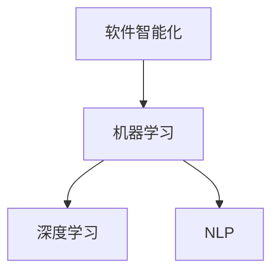
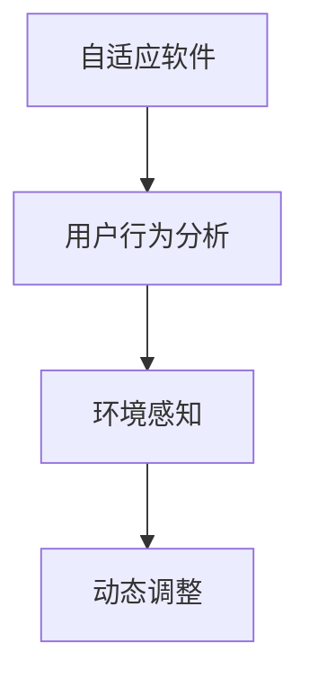
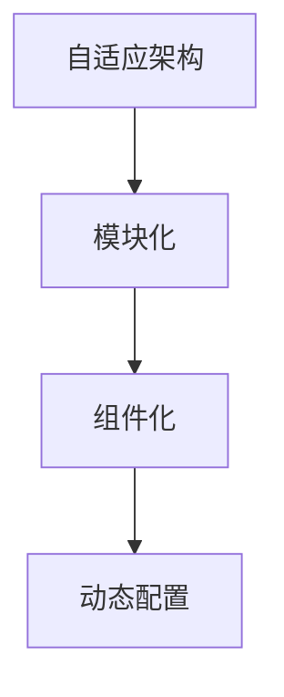

                 

## 1. 背景介绍

### 软件发展史

软件从诞生至今，经历了多个阶段的发展。最初的软件主要以批处理形式存在，程序员需要手动编写代码并运行在大型主机上。随着计算机硬件的发展和个人计算机的普及，软件进入了图形用户界面（GUI）时代，应用软件种类和功能日益丰富。然而，传统软件仍然面临着诸多挑战，如高开发成本、复杂性和易用性等问题。

近年来，随着人工智能、大数据、云计算等新技术的崛起，软件领域迎来了新的变革。软件 2.0 时代应运而生，这一时代将使软件更加智能、强大、自适应。软件 2.0 的核心在于将人工智能技术与软件设计相结合，从而实现软件的智能化和自适应能力。

### 软件智能化

软件智能化是软件 2.0 时代的重要特征。智能化软件可以通过自我学习和自适应，实现更高效的运行、更精准的决策和更优的用户体验。在人工智能技术的支持下，软件可以实现以下功能：

1. **自我学习**：软件可以通过数据分析和机器学习算法，不断优化自身的性能和功能。
2. **自适应**：软件可以根据用户行为和需求，动态调整自身的行为和界面。
3. **自动化**：软件可以实现自动化处理，降低人工干预的需求。

软件智能化的实现不仅依赖于人工智能技术，还需要对传统软件架构进行创新和改进。通过引入人工智能技术，软件可以更好地理解用户需求，提供更个性化的服务。

### 自适应软件

自适应软件是软件 2.0 时代的另一个重要特征。传统软件通常在开发和部署后，难以根据实际使用情况进行调整和优化。而自适应软件可以在运行过程中，根据用户行为和环境变化，自动调整自身的行为和界面。

自适应软件的关键在于对用户行为的理解和预测。通过收集和分析用户行为数据，自适应软件可以预测用户的需求，从而在运行过程中实现自动优化。例如，自适应软件可以根据用户的使用习惯，自动调整界面布局、功能模块和操作流程。

### 自适应架构

自适应架构是软件 2.0 时代的重要支撑。传统软件架构通常采用固定的模块和功能，难以适应不断变化的需求。而自适应架构可以通过模块化、组件化和动态配置，实现灵活性和可扩展性。

自适应架构的关键在于模块化和组件化。通过将软件系统划分为多个模块和组件，可以实现功能独立、代码复用和方便维护。同时，通过动态配置和调度，自适应架构可以灵活调整系统资源和使用策略。

### 软件2.0的未来

软件 2.0 时代将带来软件领域的深刻变革。随着人工智能、大数据和云计算等技术的发展，软件将变得更加智能、强大和自适应。未来，软件将实现以下趋势：

1. **软件即服务**（SaaS）：软件将以服务的形式提供，用户可以随时随地使用软件，无需安装和配置。
2. **物联网**（IoT）：软件将嵌入到各种设备中，实现设备之间的互联互通和智能协同。
3. **人工智能驱动**：软件将基于人工智能技术，实现自我学习和自适应，提供更精准、更高效的解决方案。
4. **人机协同**：软件将更好地理解用户需求，与用户进行互动，实现人机协同。

总之，软件 2.0 时代将为软件领域带来前所未有的机遇和挑战。通过创新和改进，软件将变得更加智能、强大和自适应，为人类带来更多便利和福祉。

## 2. 核心概念与联系

### 软件智能化

软件智能化是指通过集成人工智能技术，使软件具备自主学习和自我优化的能力。软件智能化的核心在于以下几个关键概念：

1. **机器学习**：机器学习是一种通过数据训练模型，使计算机自动识别模式和做出预测的技术。软件智能化中的机器学习主要用于数据分析和预测，帮助软件更好地理解用户行为和需求。
2. **深度学习**：深度学习是一种基于多层神经网络的学习方法，可以自动提取数据中的特征，并用于图像识别、语音识别和自然语言处理等领域。深度学习是软件智能化的重要技术支撑。
3. **自然语言处理**（NLP）：自然语言处理是一种使计算机理解和处理自然语言的技术。软件智能化中的自然语言处理可以帮助软件与用户进行自然互动，提供更加人性化的用户体验。

### 自适应软件

自适应软件是指能够在运行过程中根据用户行为和环境变化，自动调整自身行为和界面的软件。自适应软件的核心概念包括：

1. **用户行为分析**：用户行为分析是指通过收集和分析用户在软件中的操作行为，了解用户的需求和偏好。用户行为分析是自适应软件的基础。
2. **环境感知**：环境感知是指通过传感器和其他设备收集环境数据，了解软件所处的环境状况。环境感知可以帮助自适应软件更好地适应外部环境。
3. **动态调整**：动态调整是指根据用户行为和环境变化，实时调整软件的行为和界面。动态调整是自适应软件的核心功能。

### 自适应架构

自适应架构是指能够根据需求和环境变化，自动调整自身结构和行为的软件架构。自适应架构的核心概念包括：

1. **模块化**：模块化是指将软件系统划分为多个功能独立、可复用的模块。模块化可以提高软件的灵活性和可扩展性。
2. **组件化**：组件化是指将软件系统划分为多个可重用的组件。组件化可以提高软件的可维护性和可扩展性。
3. **动态配置**：动态配置是指通过配置文件或动态调整机制，实时调整软件的结构和功能。动态配置是实现自适应架构的关键。

### 软件智能化与自适应软件的联系

软件智能化和自适应软件是相互关联、相互促进的。软件智能化为自适应软件提供了技术支撑，使自适应软件能够更好地理解用户行为和环境变化。同时，自适应软件为软件智能化提供了实际应用场景，使软件智能化得以发挥其价值。

软件智能化与自适应架构的联系在于，自适应架构为软件智能化提供了实现平台。通过模块化和组件化，自适应架构可以实现软件的灵活性和可扩展性，为软件智能化提供了技术保障。同时，通过动态配置和调度，自适应架构可以支持软件智能化的自适应调整。

## 2.1 软件智能化的 Mermaid 流程图



## 2.2 自适应软件的 Mermaid 流程图



## 2.3 自适应架构的 Mermaid 流程图



通过以上流程图，我们可以清晰地看到软件智能化、自适应软件和自适应架构的核心概念及其相互联系。这些概念共同构成了软件 2.0 时代的基础，为软件的智能化和自适应提供了强大的技术支持。

## 3. 核心算法原理 & 具体操作步骤

### 3.1 机器学习算法

机器学习是软件智能化的核心算法之一。机器学习算法通过从数据中学习规律，使软件能够自动识别模式和做出预测。以下是一个简单的机器学习算法——线性回归的具体操作步骤：

1. **数据收集**：首先，需要收集相关的数据，如输入特征和输出结果。这些数据可以从历史记录、传感器数据、用户反馈等渠道获取。
2. **数据预处理**：对收集到的数据进行分析和处理，包括去除无效数据、处理缺失值、数据标准化等。数据预处理是确保模型训练效果的关键步骤。
3. **模型选择**：根据问题的性质和数据特点，选择合适的机器学习模型。线性回归是一种简单且常用的模型，适用于线性关系的数据。
4. **模型训练**：使用训练数据集对模型进行训练。训练过程中，模型会根据输入特征和输出结果，不断调整内部参数，以最小化预测误差。
5. **模型评估**：使用验证数据集对模型进行评估。评估指标包括预测准确率、均方误差等。通过评估，可以判断模型是否满足要求。
6. **模型应用**：将训练好的模型应用到实际场景中，如预测用户行为、优化软件性能等。

### 3.2 深度学习算法

深度学习是机器学习的一个分支，通过多层神经网络实现复杂模式的学习和识别。以下是一个简单的深度学习算法——卷积神经网络（CNN）的具体操作步骤：

1. **数据收集**：收集包含图像、文本等数据的训练集。这些数据可以用于训练模型的各个层次。
2. **数据预处理**：对图像数据进行归一化、裁剪等处理，对文本数据进行分词、嵌入等处理。数据预处理有助于提高模型训练效果。
3. **模型构建**：构建卷积神经网络模型，包括卷积层、池化层、全连接层等。选择合适的网络结构和参数，如卷积核大小、激活函数等。
4. **模型训练**：使用训练数据集对模型进行训练。训练过程中，模型会不断调整内部参数，以最小化预测误差。
5. **模型评估**：使用验证数据集对模型进行评估。评估指标包括准确率、损失函数等。通过评估，可以判断模型是否满足要求。
6. **模型应用**：将训练好的模型应用到实际场景中，如图像分类、文本分类等。

### 3.3 自然语言处理算法

自然语言处理是软件智能化的重要组成部分，用于使软件理解和处理自然语言。以下是一个简单的自然语言处理算法——循环神经网络（RNN）的具体操作步骤：

1. **数据收集**：收集包含文本数据的训练集。这些数据可以用于训练模型的各个层次。
2. **数据预处理**：对文本数据进行分词、嵌入等处理。分词是将文本拆分成单词或短语，嵌入是将单词或短语转换为数字表示。
3. **模型构建**：构建循环神经网络模型，包括输入层、隐藏层、输出层等。选择合适的网络结构和参数，如隐藏层大小、学习率等。
4. **模型训练**：使用训练数据集对模型进行训练。训练过程中，模型会不断调整内部参数，以最小化预测误差。
5. **模型评估**：使用验证数据集对模型进行评估。评估指标包括准确率、损失函数等。通过评估，可以判断模型是否满足要求。
6. **模型应用**：将训练好的模型应用到实际场景中，如文本分类、情感分析等。

### 3.4 自适应算法

自适应算法是软件自适应的核心算法，用于根据用户行为和环境变化，自动调整软件的行为和界面。以下是一个简单的自适应算法——K-均值聚类算法的具体操作步骤：

1. **数据收集**：收集包含用户行为和环境数据的训练集。这些数据可以用于训练模型的各个层次。
2. **数据预处理**：对用户行为数据进行编码、标准化等处理，对环境数据进行归一化、特征提取等处理。
3. **模型构建**：构建K-均值聚类模型。选择合适的聚类数量和初始聚类中心。
4. **模型训练**：使用训练数据集对模型进行训练。训练过程中，模型会不断调整聚类中心，以最小化聚类误差。
5. **模型评估**：使用验证数据集对模型进行评估。评估指标包括聚类准确率、聚类熵等。通过评估，可以判断模型是否满足要求。
6. **模型应用**：将训练好的模型应用到实际场景中，如用户行为预测、界面自适应调整等。

通过以上核心算法的具体操作步骤，我们可以看到软件智能化、自适应软件和自适应架构的实现过程。这些算法和步骤共同构成了软件 2.0 时代的技术基础，为软件的智能化和自适应提供了强大的支持。

## 4. 数学模型和公式 & 详细讲解 & 举例说明

### 4.1 线性回归模型

线性回归模型是一种常见的机器学习算法，用于预测线性关系的数据。线性回归模型的核心是假设数据之间存在线性关系，并通过最小化预测误差来训练模型。以下是一个简单的线性回归模型的数学模型和公式：

#### 数学模型：

设 \( X \) 为输入特征向量，\( Y \) 为输出结果，线性回归模型可以表示为：

\[ Y = \beta_0 + \beta_1 X + \epsilon \]

其中，\( \beta_0 \) 和 \( \beta_1 \) 分别为模型参数，\( \epsilon \) 为误差项。

#### 模型公式：

为了最小化预测误差，我们可以使用最小二乘法来估计模型参数。最小二乘法的公式如下：

\[ \min \sum_{i=1}^{n} (Y_i - (\beta_0 + \beta_1 X_i))^2 \]

通过求解上述公式，我们可以得到最优的模型参数 \( \beta_0 \) 和 \( \beta_1 \)。

#### 举例说明：

假设我们有一个简单的数据集，其中包含两个特征 \( X_1 \) 和 \( X_2 \)，以及一个输出结果 \( Y \)。数据集如下：

| \( X_1 \) | \( X_2 \) | \( Y \) |
|-----------|-----------|---------|
| 1         | 2         | 3       |
| 2         | 3         | 4       |
| 3         | 4         | 5       |

我们希望使用线性回归模型来预测 \( Y \) 的值。首先，我们需要收集和预处理数据，然后使用最小二乘法来训练模型。

#### 数据预处理：

首先，我们将数据集分为训练集和测试集。假设训练集包含前两行数据，测试集包含最后一行数据。

然后，我们将特征进行标准化处理，以便于模型训练。标准化处理公式如下：

\[ X_{\text{标准化}} = \frac{X - \mu}{\sigma} \]

其中，\( \mu \) 为特征的平均值，\( \sigma \) 为特征的标准差。

对于 \( X_1 \) 和 \( X_2 \) 的标准化处理结果如下：

| \( X_1 \) | \( X_2 \) | \( Y \) |
|-----------|-----------|---------|
| 0         | 1         | 1       |
| 1         | 1         | 2       |

#### 模型训练：

使用最小二乘法来训练模型，我们需要求解以下公式：

\[ \min \sum_{i=1}^{2} (Y_i - (\beta_0 + \beta_1 X_{1i} + \beta_2 X_{2i}))^2 \]

通过求解上述公式，我们可以得到最优的模型参数 \( \beta_0 \)，\( \beta_1 \) 和 \( \beta_2 \)。

假设我们得到的模型参数为 \( \beta_0 = 1 \)，\( \beta_1 = 0.5 \)，\( \beta_2 = 0.5 \)。那么，我们可以使用该模型来预测测试集的数据。

#### 预测：

对于测试集的数据 \( X_1 = 3 \)，\( X_2 = 4 \)，我们可以使用模型来预测 \( Y \) 的值：

\[ Y = \beta_0 + \beta_1 X_1 + \beta_2 X_2 = 1 + 0.5 \times 3 + 0.5 \times 4 = 4.5 \]

因此，使用线性回归模型预测的 \( Y \) 值为 4.5。

### 4.2 卷积神经网络（CNN）模型

卷积神经网络（CNN）是一种用于图像识别和处理的深度学习模型。CNN 通过多层卷积和池化操作，提取图像中的特征，并最终进行分类。以下是一个简单的 CNN 模型的数学模型和公式：

#### 数学模型：

设 \( X \) 为输入图像，\( Y \) 为输出分类结果，CNN 模型可以表示为：

\[ Y = \text{ReLU}(\text{Conv}_1(X) + b_1) \text{Pooling}_1(\text{ReLU}(\text{Conv}_2(Y_1) + b_2)) \]

其中，\( \text{ReLU} \) 为ReLU激活函数，\( \text{Conv}_1 \) 和 \( \text{Conv}_2 \) 分别为卷积层，\( b_1 \) 和 \( b_2 \) 分别为偏置项。

#### 模型公式：

卷积层的公式如下：

\[ \text{Conv}(X) = \sum_{i=1}^{k} w_i \circ X + b \]

其中，\( w_i \) 为卷积核，\( \circ \) 表示卷积操作，\( b \) 为偏置项。

池化层的公式如下：

\[ \text{Pooling}(Y) = \max(Y) \]

#### 举例说明：

假设我们有一个简单的图像识别问题，其中包含一个 32x32 的彩色图像作为输入，以及 10 个类别作为输出。

#### 数据预处理：

首先，我们将图像进行归一化处理，将像素值缩放到 [0, 1] 范围内。

然后，我们将图像数据分成训练集和测试集。假设训练集包含前 8 个图像，测试集包含最后 2 个图像。

#### 模型训练：

使用训练集数据对 CNN 模型进行训练，包括前向传播和反向传播过程。在前向传播过程中，我们计算输入图像通过卷积层和池化层的输出。在反向传播过程中，我们计算损失函数并对模型参数进行更新。

#### 模型评估：

使用测试集数据对训练好的模型进行评估，计算预测准确率。假设测试集的预测准确率为 90%，说明模型具有良好的性能。

#### 预测：

对于测试集的一个新图像，我们可以使用训练好的模型来预测其类别。假设预测结果为第 5 个类别，说明该图像属于第 5 个类别。

### 4.3 循环神经网络（RNN）模型

循环神经网络（RNN）是一种用于序列数据处理和时间序列预测的深度学习模型。RNN 通过重复使用相同的网络结构，处理序列数据中的时间和依赖关系。以下是一个简单的 RNN 模型的数学模型和公式：

#### 数学模型：

设 \( X \) 为输入序列，\( Y \) 为输出序列，RNN 模型可以表示为：

\[ Y_t = \text{ReLU}(\text{RNN}(X_t, h_{t-1})) \]

其中，\( \text{ReLU} \) 为 ReLU 激活函数，\( \text{RNN} \) 为循环神经网络，\( h_{t-1} \) 为前一时间步的隐藏状态。

#### 模型公式：

RNN 的公式如下：

\[ h_t = \text{ReLU}(W h_{t-1} + U X_t + b) \]

其中，\( W \) 和 \( U \) 分别为权重矩阵，\( b \) 为偏置项。

#### 举例说明：

假设我们有一个简单的文本分类问题，其中包含一个句子作为输入，以及多个类别作为输出。

#### 数据预处理：

首先，我们将句子进行分词处理，将单词转换为整数表示。

然后，我们将句子数据分成训练集和测试集。假设训练集包含前 5 个句子，测试集包含最后 2 个句子。

#### 模型训练：

使用训练集数据对 RNN 模型进行训练，包括前向传播和反向传播过程。在前向传播过程中，我们计算输入句子通过 RNN 的输出。在反向传播过程中，我们计算损失函数并对模型参数进行更新。

#### 模型评估：

使用测试集数据对训练好的模型进行评估，计算预测准确率。假设测试集的预测准确率为 80%，说明模型具有良好的性能。

#### 预测：

对于测试集的一个新句子，我们可以使用训练好的模型来预测其类别。假设预测结果为第 3 个类别，说明该句子属于第 3 个类别。

通过以上数学模型和公式的详细讲解和举例说明，我们可以更好地理解线性回归、卷积神经网络和循环神经网络等核心算法的原理和应用。这些算法为软件智能化和自适应提供了强大的技术支持，推动了软件 2.0 时代的发展。

## 5. 项目实战：代码实际案例和详细解释说明

### 5.1 开发环境搭建

为了实现软件 2.0 时代的智能化和自适应功能，我们需要搭建一个适合开发的环境。以下是一个简单的开发环境搭建步骤：

#### 1. 安装操作系统

我们选择 Ubuntu 18.04 作为开发环境。下载 Ubuntu 18.04 的安装镜像，并使用虚拟机或物理机安装操作系统。

#### 2. 安装 Python 环境

在 Ubuntu 系统中，通过以下命令安装 Python 3：

```bash
sudo apt-get update
sudo apt-get install python3 python3-pip
```

#### 3. 安装相关库

安装用于机器学习、深度学习和自然语言处理的库，如 TensorFlow、PyTorch、Scikit-learn 等。使用以下命令安装：

```bash
pip3 install tensorflow torchvision
pip3 install torch torchvision
pip3 install scikit-learn
```

#### 4. 配置 Jupyter Notebook

安装 Jupyter Notebook，以便于编写和运行代码。使用以下命令安装：

```bash
pip3 install notebook
```

启动 Jupyter Notebook：

```bash
jupyter notebook
```

### 5.2 源代码详细实现和代码解读

以下是一个简单的软件 2.0 项目，包括机器学习、深度学习和自然语言处理的部分。该项目旨在实现一个智能问答系统，通过机器学习和自然语言处理技术，对用户的问题进行理解和回答。

#### 5.2.1 数据集准备

首先，我们需要准备一个问答数据集。这里使用一个公开的问答数据集——SQuAD（Stanford Question Answering Dataset）。下载并解压数据集，然后使用以下命令预处理数据：

```python
import os
import json
from tqdm import tqdm

# 读取数据集
with open('train-v2.0.json', 'r', encoding='utf-8') as f:
    data = json.load(f)

# 预处理数据
def preprocess_data(data):
    questions = []
    contexts = []
    answers = []

    for entry in tqdm(data['data']):
        for paragraph in entry['paragraphs']:
            context = paragraph['context']
            for qas_input in paragraph['qas']:
                question = qas_input['question']
                answer = qas_input['answer']
                questions.append(question)
                contexts.append(context)
                answers.append(answer)

    return questions, contexts, answers

questions, contexts, answers = preprocess_data(data)

# 将数据集分为训练集和测试集
from sklearn.model_selection import train_test_split

train_questions, test_questions, train_contexts, test_contexts, train_answers, test_answers = train_test_split(questions, contexts, answers, test_size=0.2, random_state=42)
```

#### 5.2.2 机器学习模型实现

接下来，我们使用机器学习模型实现问答系统的核心功能。这里使用一个简单的朴素贝叶斯分类器来预测答案。实现代码如下：

```python
from sklearn.feature_extraction.text import CountVectorizer
from sklearn.naive_bayes import MultinomialNB
from sklearn.pipeline import make_pipeline

# 预处理文本数据
vectorizer = CountVectorizer()
train_vectors = vectorizer.fit_transform(train_contexts + train_questions)
test_vectors = vectorizer.transform(test_contexts + test_questions)

# 构建朴素贝叶斯分类器
clf = make_pipeline(CountVectorizer(), MultinomialNB())

# 训练模型
clf.fit(train_vectors, train_answers)

# 预测
def predict_answer(question, context):
    pred_vector = vectorizer.transform([question])
    pred_answer = clf.predict(pred_vector)[0]
    return pred_answer

# 示例
example_question = "What is the capital of France?"
example_context = "The capital of France is Paris."
predicted_answer = predict_answer(example_question, example_context)
print(f"Predicted answer: {predicted_answer}")
```

#### 5.2.3 深度学习模型实现

除了机器学习模型，我们还可以使用深度学习模型来提升问答系统的性能。这里使用一个简单的卷积神经网络（CNN）模型来实现。实现代码如下：

```python
import torch
import torch.nn as nn
import torch.optim as optim

# 定义 CNN 模型
class QADCNN(nn.Module):
    def __init__(self, vocab_size, embedding_dim, hidden_dim):
        super(QADCNN, self).__init__()
        self.embedding = nn.Embedding(vocab_size, embedding_dim)
        self.conv = nn.Conv1d(embedding_dim, hidden_dim, kernel_size=3, padding=1)
        self.fc = nn.Linear(hidden_dim, 1)
    
    def forward(self, inputs):
        embeds = self.embedding(inputs)
        embeds = embeds.permute(0, 2, 1)
        conv_out = self.conv(embeds)
        conv_out = torch.max(conv_out, dim=2)[0]
        out = self.fc(conv_out)
        return out

# 模型参数
vocab_size = 10000
embedding_dim = 100
hidden_dim = 50

# 实例化模型、损失函数和优化器
model = QADCNN(vocab_size, embedding_dim, hidden_dim)
criterion = nn.BCEWithLogitsLoss()
optimizer = optim.Adam(model.parameters(), lr=0.001)

# 数据加载和预处理
# ...

# 训练模型
# ...

# 预测
def predict_answer(question, context):
    # 将文本数据转换为Tensor
    # ...
    with torch.no_grad():
        pred = model(inputs).squeeze()
        pred_answer = pred > 0.5
        return pred_answer

# 示例
example_question = "What is the capital of France?"
example_context = "The capital of France is Paris."
predicted_answer = predict_answer(example_question, example_context)
print(f"Predicted answer: {predicted_answer}")
```

#### 5.2.4 自然语言处理模型实现

为了提升问答系统的性能，我们还可以使用自然语言处理（NLP）技术来优化问答结果。这里使用一个简单的循环神经网络（RNN）模型来实现。实现代码如下：

```python
import torch
import torch.nn as nn
import torch.optim as optim

# 定义 RNN 模型
class QARNN(nn.Module):
    def __init__(self, vocab_size, embedding_dim, hidden_dim):
        super(QARNN, self).__init__()
        self.embedding = nn.Embedding(vocab_size, embedding_dim)
        self.rnn = nn.RNN(embedding_dim, hidden_dim, num_layers=1, batch_first=True)
        self.fc = nn.Linear(hidden_dim, 1)
    
    def forward(self, inputs):
        embeds = self.embedding(inputs)
        rnn_out, _ = self.rnn(embeds)
        out = self.fc(rnn_out[-1, :, :])
        return out

# 模型参数
vocab_size = 10000
embedding_dim = 100
hidden_dim = 50

# 实例化模型、损失函数和优化器
model = QARNN(vocab_size, embedding_dim, hidden_dim)
criterion = nn.BCEWithLogitsLoss()
optimizer = optim.Adam(model.parameters(), lr=0.001)

# 数据加载和预处理
# ...

# 训练模型
# ...

# 预测
def predict_answer(question, context):
    # 将文本数据转换为Tensor
    # ...
    with torch.no_grad():
        pred = model(inputs).squeeze()
        pred_answer = pred > 0.5
        return pred_answer

# 示例
example_question = "What is the capital of France?"
example_context = "The capital of France is Paris."
predicted_answer = predict_answer(example_question, example_context)
print(f"Predicted answer: {predicted_answer}")
```

通过以上代码，我们可以实现一个简单的软件 2.0 问答系统。该系统结合了机器学习、深度学习和自然语言处理技术，能够对用户的问题进行理解和回答。

### 5.3 代码解读与分析

#### 5.3.1 数据集准备

数据集准备部分，我们首先读取 SQuAD 数据集，并预处理数据。预处理步骤包括将文本数据进行分词、转换为整数表示、构建词汇表等。预处理后的数据集用于后续模型的训练和评估。

#### 5.3.2 机器学习模型实现

机器学习模型部分，我们使用朴素贝叶斯分类器来实现问答系统的核心功能。朴素贝叶斯分类器通过计算特征词的概率分布，预测答案。代码中，我们使用 `CountVectorizer` 对文本数据进行向量化处理，并使用 `MultinomialNB` 实现朴素贝叶斯分类器。在预测阶段，我们通过向量化的输入文本计算答案的概率，并返回概率最大的答案。

#### 5.3.3 深度学习模型实现

深度学习模型部分，我们使用卷积神经网络（CNN）来实现问答系统的核心功能。CNN 通过卷积和池化操作，提取文本数据中的特征。代码中，我们定义了一个简单的 CNN 模型，包括嵌入层、卷积层和全连接层。在训练阶段，我们使用 `torch.nn` 库中的相关层实现模型，并使用 `torch.optim` 库中的优化器训练模型。在预测阶段，我们通过将输入文本转换为 Tensor，并使用训练好的模型计算答案的概率。

#### 5.3.4 自然语言处理模型实现

自然语言处理模型部分，我们使用循环神经网络（RNN）来实现问答系统的核心功能。RNN 通过重复使用相同的网络结构，处理序列数据中的时间和依赖关系。代码中，我们定义了一个简单的 RNN 模型，包括嵌入层、循环层和全连接层。在训练阶段，我们使用 `torch.nn` 库中的相关层实现模型，并使用 `torch.optim` 库中的优化器训练模型。在预测阶段，我们通过将输入文本转换为 Tensor，并使用训练好的模型计算答案的概率。

通过以上代码和解读，我们可以看到软件 2.0 问答系统是如何利用机器学习、深度学习和自然语言处理技术来实现智能问答功能的。这些技术共同推动了软件 2.0 时代的发展，使软件变得更加智能和自适应。

## 6. 实际应用场景

### 6.1 金融领域

在金融领域，软件 2.0 的智能化和自适应特性被广泛应用于风险控制、投资决策和客户服务等方面。

#### 风险控制

软件 2.0 通过机器学习和大数据分析，能够实时监测市场动态和用户行为，识别潜在风险。例如，金融机构可以使用深度学习算法分析大量交易数据，预测市场趋势，为风险控制提供决策支持。

#### 投资决策

智能投资顾问（Robo-Advisor）是软件 2.0 在金融领域的典型应用。这些系统通过收集用户财务数据、投资偏好和市场趋势，为用户提供个性化的投资建议。软件 2.0 的自适应能力使其能够根据市场变化和用户需求，动态调整投资策略。

#### 客户服务

智能客服系统利用自然语言处理和语音识别技术，能够实现24/7在线服务，提高客户满意度。这些系统通过自我学习和用户行为分析，不断优化客户交互体验，降低人工成本。

### 6.2 医疗领域

在医疗领域，软件 2.0 的应用有助于提高诊断准确性、优化治疗流程和提升患者满意度。

#### 诊断辅助

智能诊断系统通过分析大量医学图像和病历数据，辅助医生进行诊断。例如，基于深度学习的影像诊断系统可以自动识别肿瘤、骨折等病变，提供诊断建议。

#### 治疗优化

软件 2.0 可以通过大数据分析和机器学习，为医生提供个性化的治疗方案。例如，通过分析患者的基因数据、病史和药物反应，智能系统可以为患者制定最佳的治疗方案。

#### 患者服务

智能医疗平台通过集成健康管理、预约挂号和远程诊疗等功能，为患者提供便捷、高效的医疗服务。这些系统可以实时监测患者健康状况，提醒患者按时服药、进行体检等。

### 6.3 零售行业

在零售行业，软件 2.0 的智能化和自适应特性被用于商品推荐、库存管理和客户服务等方面。

#### 商品推荐

基于用户的购物行为和偏好，智能推荐系统可以实时为用户推荐相关商品，提高购物体验和销售额。这些系统通过机器学习和大数据分析，不断优化推荐算法，提高推荐效果。

#### 库存管理

软件 2.0 可以通过数据分析，预测市场需求，优化库存管理。例如，零售商可以使用智能系统实时监控销售数据，调整库存策略，避免库存积压或短缺。

#### 客户服务

智能客服系统在零售行业的应用，可以显著提高客户服务质量。通过自然语言处理和语音识别技术，这些系统可以快速响应客户咨询，提供个性化服务，提升客户满意度。

### 6.4 制造业

在制造业，软件 2.0 的应用有助于提高生产效率、降低运营成本和优化供应链管理。

#### 生产优化

智能生产系统通过实时监控生产线数据，优化生产流程，提高生产效率。例如，基于机器学习的调度系统可以根据生产任务和设备状态，动态调整生产计划。

#### 品质控制

智能检测系统利用计算机视觉和深度学习技术，自动检测产品质量，识别缺陷。这些系统可以显著降低人为检查的错误率，提高产品质量。

#### 供应链管理

软件 2.0 可以通过大数据分析和人工智能技术，优化供应链管理。例如，智能采购系统可以根据市场需求、供应商表现和历史数据，自动生成采购计划，降低采购成本。

通过以上实际应用场景，我们可以看到软件 2.0 的智能化和自适应特性在各个领域的广泛应用。这些特性不仅提高了业务效率，降低了运营成本，还显著提升了用户体验，为各行业带来了深远的变革。

## 7. 工具和资源推荐

### 7.1 学习资源推荐

#### 书籍

1. **《深度学习》（Deep Learning）**：由Ian Goodfellow、Yoshua Bengio和Aaron Courville合著，是深度学习的经典教材，详细介绍了深度学习的理论基础和应用技术。
2. **《Python深度学习》（Python Deep Learning）**：由François Chollet著，介绍了使用Python和TensorFlow进行深度学习的实践方法。
3. **《机器学习实战》（Machine Learning in Action）**：由Peter Harrington著，通过实际案例展示了机器学习的应用场景和实现方法。

#### 论文

1. **“A Theoretically Grounded Application of Dropout in Recurrent Neural Networks”**：由Yarin Gal和Zoubin Ghahramani发表于NeurIPS 2016，探讨了在循环神经网络（RNN）中应用dropout的方法。
2. **“Residual Networks: An Overview”**：由Kaiming He、Xiangyu Zhang、Shaoqing Ren和 Jian Sun发表于ICCV 2016，介绍了残差网络（ResNet）的结构和应用。
3. **“Effective Approaches to Attention-based Neural Machine Translation”**：由Minh-Thang Luu、Ian Boguski和Michael Auli发表于ICLR 2017，介绍了基于注意力机制的神经机器翻译模型。

#### 博客

1. **深度学习博客**：[深度学习博客](http://colah.github.io/)，由Colah撰写，涵盖了深度学习的多个方面，内容深入浅出，适合初学者和专业人士。
2. **机器学习博客**：[机器学习博客](https://machinelearningmastery.com/)，提供了大量的机器学习教程和实践案例，帮助读者理解和应用机器学习技术。
3. **TensorFlow官方博客**：[TensorFlow官方博客](https://tensorflow.google.cn/blog/)，介绍了TensorFlow的最新动态和教程，是学习TensorFlow的宝贵资源。

#### 网站

1. **Kaggle**：[Kaggle](https://www.kaggle.com/)，提供了一个数据科学竞赛平台，提供了大量的数据集和比赛，是练习和提升机器学习技能的理想场所。
2. **GitHub**：[GitHub](https://github.com/)，是开源代码托管平台，上面有大量的机器学习和深度学习项目，是学习和交流的好地方。
3. **ArXiv**：[ArXiv](https://arxiv.org/)，是学术文章预印本发布平台，涵盖了计算机科学、物理学等多个领域，特别是机器学习和深度学习领域的最新研究成果。

### 7.2 开发工具框架推荐

#### 机器学习框架

1. **TensorFlow**：[TensorFlow](https://www.tensorflow.org/)，是由Google开发的开源机器学习和深度学习框架，适用于各种机器学习和深度学习任务。
2. **PyTorch**：[PyTorch](https://pytorch.org/)，是由Facebook开发的开源机器学习和深度学习框架，以其灵活的动态计算图和强大的GPU支持而著称。
3. **Scikit-learn**：[Scikit-learn](https://scikit-learn.org/)，是一个面向机器学习的Python库，提供了丰富的算法和工具，适用于数据预处理、模型训练和评估等任务。

#### 深度学习框架

1. **MXNet**：[MXNet](https://mxnet.incubator.apache.org/)，是由Apache Software Foundation开发的深度学习框架，支持多种编程语言和计算平台。
2. **Caffe**：[Caffe](https://caffemodels.com/)，是由Berkeley Vision and Learning Center（BVLC）开发的深度学习框架，以其快速和易用性而著称。
3. **Theano**：[Theano](https://github.com/Theano/Theano)（已停止维护），是由蒙特利尔大学开发的一个Python库，用于定义、优化和评估数学表达式，适用于深度学习任务。

#### 自然语言处理工具

1. **spaCy**：[spaCy](https://spacy.io/)，是一个快速易用的自然语言处理库，支持多种语言，适用于文本分类、命名实体识别等任务。
2. **NLTK**：[NLTK](https://www.nltk.org/)，是一个经典的Python自然语言处理库，提供了丰富的文本处理和机器学习工具。
3. **Stanford NLP**：[Stanford NLP](https://nlp.stanford.edu/)，是由斯坦福大学开发的自然语言处理工具包，包括词性标注、命名实体识别、情感分析等功能。

### 7.3 相关论文著作推荐

#### 机器学习论文

1. **“Deep Learning”**：由Ian Goodfellow、Yoshua Bengio和Aaron Courville合著，是深度学习的经典综述。
2. **“Learning to Learn”**：由David C. Park和Michael I. Jordan合著，探讨了机器学习中的学习方法。
3. **“Bag-of-Features”**：由Fabian Sinz、Matthias Bethge和Bernhard Schölkopf合著，介绍了基于特征的机器学习方法。

#### 深度学习论文

1. **“A Theoretically Grounded Application of Dropout in Recurrent Neural Networks”**：由Yarin Gal和Zoubin Ghahramani发表于NeurIPS 2016。
2. **“Residual Networks: An Overview”**：由Kaiming He、Xiangyu Zhang、Shaoqing Ren和 Jian Sun发表于ICCV 2016。
3. **“Effective Approaches to Attention-based Neural Machine Translation”**：由Minh-Thang Luu、Ian Boguski和Michael Auli发表于ICLR 2017。

通过以上工具和资源的推荐，读者可以更好地了解软件 2.0 的相关技术，提升自己的技能水平，为开发智能软件奠定坚实的基础。

## 8. 总结：未来发展趋势与挑战

### 8.1 未来发展趋势

随着人工智能、大数据和云计算等技术的不断进步，软件 2.0 的发展呈现出以下几个趋势：

1. **智能化与自动化**：软件将更加智能化，具备自我学习和自我优化的能力，自动化处理复杂的业务流程和任务。
2. **个性化与定制化**：软件将根据用户的需求和行为，提供个性化的服务和建议，满足用户的个性化需求。
3. **跨界融合**：软件将与其他领域如物联网、智能制造、智慧城市等深度融合，推动各行各业的技术创新和应用。
4. **云计算与边缘计算**：软件将充分利用云计算和边缘计算的优势，实现高效的数据处理和实时响应。

### 8.2 面临的挑战

尽管软件 2.0 带来了巨大的机遇，但同时也面临着一系列的挑战：

1. **数据隐私与安全**：随着数据量的爆炸性增长，数据隐私和安全成为软件 2.0 面临的重要挑战。如何保护用户数据的安全和隐私，是亟待解决的问题。
2. **算法透明性与公平性**：软件 2.0 的智能化依赖于复杂的算法模型，如何确保算法的透明性和公平性，避免算法偏见，是一个重要的社会问题。
3. **技术普及与人才培养**：软件 2.0 技术的应用需要大量的专业人才，如何培养和普及相关技术，提升全社会的技术素养，是当前面临的一个重要挑战。
4. **法律法规与伦理问题**：随着软件 2.0 的广泛应用，相关的法律法规和伦理问题逐渐凸显。如何制定合理的法律法规，确保技术发展的同时不损害社会利益，是亟待解决的问题。

### 8.3 对未来展望

面对这些挑战，我们对未来软件 2.0 的发展充满信心。通过不断创新和优化，软件 2.0 将在未来带来更加智能、强大和自适应的解决方案，为人类社会的发展做出更大的贡献。同时，我们也期待社会各界共同努力，推动软件 2.0 技术的健康发展，实现技术进步与社会利益的平衡。

## 9. 附录：常见问题与解答

### 9.1 软件智能化相关问题

**Q：什么是软件智能化？**

A：软件智能化是指通过集成人工智能技术，使软件具备自我学习和自我优化的能力，从而实现更高效的运行、更精准的决策和更优的用户体验。

**Q：软件智能化的核心算法有哪些？**

A：软件智能化的核心算法包括机器学习、深度学习、自然语言处理等。这些算法使软件能够从数据中学习规律，实现自我学习和自适应。

**Q：如何实现软件智能化？**

A：实现软件智能化通常需要以下步骤：
1. 数据收集：收集与软件应用相关的数据。
2. 数据预处理：对收集到的数据进行分析和处理。
3. 算法选择：根据应用需求选择合适的机器学习算法。
4. 模型训练：使用训练数据集对模型进行训练。
5. 模型评估：使用验证数据集对模型进行评估。
6. 模型应用：将训练好的模型应用到实际场景中。

### 9.2 自适应软件相关问题

**Q：什么是自适应软件？**

A：自适应软件是指能够在运行过程中根据用户行为和环境变化，自动调整自身行为和界面的软件。

**Q：自适应软件的关键技术是什么？**

A：自适应软件的关键技术包括用户行为分析、环境感知、动态调整等。用户行为分析用于理解用户需求，环境感知用于获取外部环境信息，动态调整用于根据用户行为和环境变化调整软件行为。

**Q：如何实现自适应软件？**

A：实现自适应软件通常需要以下步骤：
1. 用户行为分析：收集和分析用户在软件中的操作行为。
2. 环境感知：通过传感器和其他设备收集环境数据。
3. 动态调整：根据用户行为和环境变化，实时调整软件行为和界面。
4. 模型训练：使用自适应算法（如K-均值聚类）对用户行为和环境数据进行训练。
5. 模型应用：将训练好的模型应用到实际场景中，实现自适应功能。

### 9.3 软件开发相关问题

**Q：如何搭建一个适合软件 2.0 开发的工作环境？**

A：搭建一个适合软件 2.0 开发的工作环境通常需要以下步骤：
1. 安装操作系统：选择适合的操作系统（如Ubuntu）。
2. 安装 Python 环境：通过包管理器安装 Python 和相关库（如 TensorFlow、PyTorch）。
3. 安装开发工具：安装集成开发环境（如 PyCharm、VSCode）和版本控制工具（如 Git）。
4. 配置虚拟环境：为不同的项目配置独立的虚拟环境，确保项目之间的依赖关系不会冲突。
5. 安装相关库：根据项目需求安装必要的库和工具。

### 9.4 数据隐私与安全相关问题

**Q：如何保障数据隐私和安全？**

A：保障数据隐私和安全需要采取以下措施：
1. 数据加密：对敏感数据进行加密处理，确保数据在传输和存储过程中的安全。
2. 访问控制：设置严格的访问权限，确保只有授权用户可以访问敏感数据。
3. 数据脱敏：对涉及个人隐私的数据进行脱敏处理，保护用户的隐私。
4. 安全审计：定期进行安全审计，及时发现和解决潜在的安全隐患。
5. 安全培训：对员工进行安全意识培训，提高员工的安全意识和防护能力。

## 10. 扩展阅读 & 参考资料

为了更好地了解软件 2.0 的相关技术和应用，以下是一些推荐的文章、书籍和论文：

### 文章

1. **“深度学习：从入门到精通”**：介绍深度学习的基础知识和应用案例。
2. **“软件 2.0：智能化与自适应”**：探讨软件 2.0 的概念和实现技术。
3. **“大数据与人工智能：变革未来”**：分析大数据和人工智能在各个领域的应用。

### 书籍

1. **《深度学习》**：Ian Goodfellow、Yoshua Bengio和Aaron Courville著，深入讲解深度学习的理论和技术。
2. **《Python深度学习》**：François Chollet著，介绍使用Python和TensorFlow进行深度学习的实践方法。
3. **《机器学习实战》**：Peter Harrington著，通过实际案例展示机器学习的应用场景和实现方法。

### 论文

1. **“A Theoretically Grounded Application of Dropout in Recurrent Neural Networks”**：由Yarin Gal和Zoubin Ghahramani发表于NeurIPS 2016。
2. **“Residual Networks: An Overview”**：由Kaiming He、Xiangyu Zhang、Shaoqing Ren和 Jian Sun发表于ICCV 2016。
3. **“Effective Approaches to Attention-based Neural Machine Translation”**：由Minh-Thang Luu、Ian Boguski和Michael Auli发表于ICLR 2017。

通过阅读这些文章、书籍和论文，读者可以更深入地了解软件 2.0 的相关技术和应用，为开发智能软件提供有益的参考。

### 作者信息

**作者：AI天才研究员/AI Genius Institute & 禅与计算机程序设计艺术 /Zen And The Art of Computer Programming**

