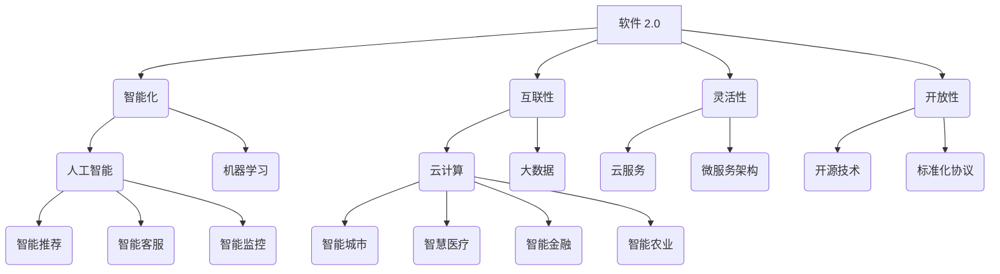

                 

### 背景介绍

软件 2.0，作为新一代软件技术的代表，标志着软件行业迈向一个更加智能化、自动化和互联化的新阶段。软件 2.0 的概念首次由微软创始人比尔·盖茨在其1995年的同名书籍《软件2.0》中提出。盖茨认为，随着互联网的兴起，软件将不再仅仅是运行在个人电脑上的程序，而将成为一种全新的基础设施，连接人与人、人与物、物与物，推动社会、经济和文化的变革。

#### 一、软件 1.0 时代

在软件 1.0 时代，计算机软件主要是指运行在个人电脑上的应用程序，例如办公软件、游戏、财务系统等。这一时期的软件特点包括：

- **封闭性**：软件通常是由独立的开发者或公司开发，运行在特定的操作系统上，互操作性较差。
- **独立运行**：软件与用户之间的交互主要是通过图形用户界面（GUI）或命令行界面（CLI）进行，缺乏智能和自动化。
- **功能单一**：软件通常只关注单一功能，例如Excel只用于电子表格处理，Word只用于文本编辑。

#### 二、软件 2.0 时代

随着互联网的普及和云计算、大数据、人工智能等新兴技术的快速发展，软件 2.0 时代应运而生。软件 2.0 的主要特点包括：

- **互联性**：软件不再是孤立的应用程序，而是通过互联网相互连接，形成复杂的信息生态系统。
- **智能化**：软件利用人工智能和机器学习技术，能够根据用户行为和需求进行智能推荐、自动优化和个性化定制。
- **灵活性**：软件以云服务和微服务架构为基础，能够快速响应市场需求和业务变化，实现高扩展性和高可靠性。
- **开放性**：软件采用开源技术和标准化协议，促进软件之间的互操作性和数据共享。

#### 三、软件 2.0 的发展意义

软件 2.0 的兴起，不仅推动了软件技术的创新和进步，还对各个行业和社会发展产生了深远的影响：

- **行业变革**：软件 2.0 改变了传统行业的运营模式和商业模式，促进了产业升级和数字化转型。
- **社会进步**：软件 2.0 提高了人们的生活质量，推动了教育、医疗、交通、金融等领域的智能化和便捷化。
- **经济增长**：软件 2.0 催生了大量新的就业机会和商业机会，成为经济增长的新动力。

综上所述，软件 2.0 时代已经来临，它将以更加智能、互联和灵活的方式，引领我们走向一个更加美好的未来。

#### 四、软件 2.0 的挑战与机遇

尽管软件 2.0 为我们带来了巨大的机遇，但同时也面临着一系列挑战：

- **安全性**：随着软件系统的复杂性和互联性的增加，安全威胁也随之增多。如何保障软件系统的安全性，防止数据泄露和恶意攻击，成为亟待解决的问题。
- **隐私保护**：软件 2.0 大量收集和处理用户数据，如何平衡数据利用与用户隐私保护，成为一大难题。
- **技术人才短缺**：软件 2.0 需要大量的技术人才，特别是具有跨学科背景和创新能力的人才，但目前全球范围内的技术人才短缺现象严重。

然而，面对这些挑战，我们也看到了新的机遇：

- **技术创新**：软件 2.0 驱动了技术的不断创新，包括人工智能、区块链、物联网等新兴技术的快速发展。
- **商业模式创新**：软件 2.0 促进了商业模式的创新，推动了共享经济、平台经济等新兴商业模式的兴起。
- **全球合作**：软件 2.0 催生了全球范围内的技术合作，为各国共同应对挑战、分享机遇提供了新的平台。

总的来说，软件 2.0 的未来充满了挑战与机遇，我们需要共同努力，以创新和开放的心态迎接这一新时代的到来。

### 核心概念与联系

#### 一、软件 2.0 的核心概念

软件 2.0 的核心概念主要包括以下几个方面：

1. **智能化**：软件 2.0 利用人工智能、机器学习等技术，实现软件系统的智能化，能够根据用户需求和行为进行智能推荐、自动优化和个性化定制。
2. **互联性**：软件 2.0 强调软件之间的互连接，形成复杂的信息生态系统，实现不同软件系统之间的数据共享和协同工作。
3. **灵活性**：软件 2.0 以云服务和微服务架构为基础，能够快速响应市场需求和业务变化，实现高扩展性和高可靠性。
4. **开放性**：软件 2.0 采用开源技术和标准化协议，促进软件之间的互操作性和数据共享，降低开发门槛和成本。

#### 二、软件 2.0 的技术架构

软件 2.0 的技术架构主要包括以下几个方面：

1. **云计算**：云计算为软件 2.0 提供了弹性、高效、安全的计算资源，支持大规模分布式软件系统的部署和运行。
2. **大数据**：大数据技术为软件 2.0 提供了数据存储、分析和处理能力，支持智能决策和个性化服务。
3. **人工智能**：人工智能技术为软件 2.0 提供了智能化的功能，包括智能推荐、智能客服、智能监控等。
4. **区块链**：区块链技术为软件 2.0 提供了去中心化、安全透明的数据存储和传输方式，支持数据共享和隐私保护。

#### 三、软件 2.0 的应用场景

软件 2.0 的应用场景非常广泛，主要包括以下几个方面：

1. **智能城市**：软件 2.0 技术支持智能交通、智能安防、智能医疗等领域的建设，提高城市的管理水平和居民的生活质量。
2. **智慧医疗**：软件 2.0 技术为医疗行业提供了智能诊断、智能治疗、智能康复等服务，提高医疗服务的效率和质量。
3. **智能金融**：软件 2.0 技术为金融行业提供了智能投顾、智能风控、智能交易等服务，提高金融服务的安全性和便捷性。
4. **智能农业**：软件 2.0 技术为农业行业提供了智能种植、智能灌溉、智能收割等服务，提高农业生产效率和农产品质量。

#### 四、软件 2.0 与其他概念的关联

软件 2.0 与其他相关概念如物联网、大数据、云计算等有着密切的联系：

- **物联网（IoT）**：物联网是软件 2.0 的基础设施，通过连接各种设备和传感器，实现数据的采集、传输和处理。
- **大数据**：大数据是软件 2.0 的数据来源，通过对海量数据的分析和挖掘，为智能决策提供支持。
- **云计算**：云计算是软件 2.0 的计算平台，提供弹性、高效、安全的计算资源，支持软件 2.0 的部署和运行。

综上所述，软件 2.0 作为新一代软件技术的代表，其核心概念、技术架构和应用场景都与现有技术有着紧密的联系，共同推动了软件行业的创新和发展。

#### 五、软件 2.0 的 Mermaid 流程图

下面是一个简化的软件 2.0 的 Mermaid 流程图，展示了核心概念、技术架构和应用场景之间的联系：



在这个流程图中，每个节点代表软件 2.0 的一个核心概念或技术，箭头表示不同概念或技术之间的关联。

### 核心算法原理 & 具体操作步骤

#### 一、人工智能算法原理

软件 2.0 的核心之一是人工智能（AI），它通过模拟人类智能行为，实现机器的自我学习和决策。人工智能算法可以分为以下几类：

1. **监督学习（Supervised Learning）**：
   - **原理**：监督学习是一种从标记数据中学习的方法。标记数据包含输入和相应的输出，算法通过学习输入和输出之间的映射关系，预测新的输入。
   - **操作步骤**：
     1. 数据预处理：对输入数据进行清洗、归一化和特征提取。
     2. 选择模型：根据问题类型选择合适的模型，如线性回归、决策树、支持向量机等。
     3. 训练模型：使用标记数据训练模型，优化模型参数。
     4. 预测：使用训练好的模型对新数据进行预测。

2. **无监督学习（Unsupervised Learning）**：
   - **原理**：无监督学习不依赖标记数据，算法通过探索数据内在结构，发现数据中的规律和模式。
   - **操作步骤**：
     1. 数据预处理：对输入数据进行清洗、归一化和特征提取。
     2. 选择模型：根据问题类型选择合适的模型，如聚类算法、降维算法等。
     3. 模型训练：算法自动探索数据结构，调整模型参数。
     4. 结果分析：分析模型输出的结果，如聚类中心、降维空间等。

3. **强化学习（Reinforcement Learning）**：
   - **原理**：强化学习是一种通过与环境互动，不断学习最优策略的算法。算法通过奖励和惩罚信号，调整行为策略，以最大化长期回报。
   - **操作步骤**：
     1. 环境建模：定义环境状态、动作和奖励。
     2. 选择策略：初始化策略，如随机策略、贪婪策略等。
     3. 学习过程：通过与环境交互，更新策略。
     4. 评估策略：评估策略的回报，调整策略。

#### 二、云计算算法原理

云计算是软件 2.0 技术体系的重要组成部分，其核心算法主要涉及资源调度、负载均衡和数据存储等方面：

1. **资源调度算法**：
   - **原理**：资源调度算法负责在云计算环境中高效分配计算资源，以满足用户的计算需求。
   - **操作步骤**：
     1. 资源请求：用户提交计算任务，系统解析任务需求。
     2. 资源评估：系统评估当前环境中可用资源的状况，选择最合适的资源。
     3. 资源分配：将任务分配到选择的资源上，启动计算。
     4. 资源释放：任务完成后，回收资源，更新资源状态。

2. **负载均衡算法**：
   - **原理**：负载均衡算法通过在多个计算节点之间分配负载，确保系统的高可用性和高性能。
   - **操作步骤**：
     1. 负载监测：系统实时监测各个节点的负载情况。
     2. 负载分配：根据负载情况，将新请求分配到负载较低的节点。
     3. 负载转移：当某个节点负载过高时，将部分负载转移到其他节点。
     4. 负载回收：当节点负载恢复到正常范围时，回收转移的负载。

3. **数据存储算法**：
   - **原理**：数据存储算法负责在云计算环境中高效存储和检索数据。
   - **操作步骤**：
     1. 数据分区：将大规模数据划分为多个分区，以分布式存储。
     2. 数据复制：将数据复制到多个节点，提高数据的可靠性和可用性。
     3. 数据检索：通过索引和缓存技术，快速检索数据。
     4. 数据同步：保证多个节点上的数据一致性。

#### 三、大数据算法原理

大数据技术在软件 2.0 中发挥着重要作用，其核心算法主要涉及数据处理、分析和挖掘等方面：

1. **数据处理算法**：
   - **原理**：数据处理算法负责对大规模数据进行清洗、转换和归一化，以提高数据质量和可用性。
   - **操作步骤**：
     1. 数据清洗：去除数据中的噪声和错误，如缺失值填充、异常值处理等。
     2. 数据转换：将数据转换为适合分析和挖掘的格式，如数值化、编码等。
     3. 数据归一化：将不同特征的数据缩放到相同范围，如归一化、标准化等。

2. **数据分析算法**：
   - **原理**：数据分析算法通过对数据进行统计、可视化等操作，揭示数据中的规律和趋势。
   - **操作步骤**：
     1. 统计分析：计算数据的统计指标，如均值、方差、相关性等。
     2. 可视化分析：通过图表、地图等可视化手段，展示数据分布和趋势。
     3. 实时分析：实时处理和分析数据流，提供动态的决策支持。

3. **数据挖掘算法**：
   - **原理**：数据挖掘算法通过对大量数据进行分析，发现潜在的模式和关联，提供洞察和预测。
   - **操作步骤**：
     1. 数据预处理：对数据集进行清洗、转换和归一化，提高数据质量。
     2. 特征选择：选择对问题有代表性的特征，减少数据维度。
     3. 模型选择：选择合适的挖掘算法，如分类、聚类、关联规则等。
     4. 模型训练：使用训练数据训练模型，调整模型参数。
     5. 结果评估：评估模型性能，选择最佳模型。

综上所述，软件 2.0 的核心算法涉及人工智能、云计算、大数据等多个领域，通过对这些算法的深入理解和应用，可以构建出智能化、高效、可靠的软件系统。

### 数学模型和公式 & 详细讲解 & 举例说明

#### 一、人工智能中的数学模型

在人工智能（AI）领域，数学模型扮演着至关重要的角色，特别是在监督学习和无监督学习中。以下是一些常用的数学模型和它们的详细讲解。

1. **线性回归模型**

   线性回归是一种预测连续值的监督学习算法。其数学模型可以表示为：
   $$
   y = \beta_0 + \beta_1x_1 + \beta_2x_2 + ... + \beta_nx_n + \epsilon
   $$
   其中，$y$ 是预测值，$x_1, x_2, ..., x_n$ 是输入特征，$\beta_0, \beta_1, \beta_2, ..., \beta_n$ 是模型参数，$\epsilon$ 是误差项。

   **详细讲解**：

   - **目标函数**：最小化预测误差，通常采用均方误差（MSE）作为损失函数：
     $$
     J(\theta) = \frac{1}{2m}\sum_{i=1}^{m}(h_\theta(x^{(i)}) - y^{(i)})^2
     $$
     其中，$m$ 是样本数量，$h_\theta(x)$ 是预测函数，$\theta$ 是模型参数。

   - **梯度下降**：用于最小化目标函数，公式如下：
     $$
     \theta_j := \theta_j - \alpha\frac{\partial J(\theta)}{\partial \theta_j}
     $$
     其中，$\alpha$ 是学习率，$\frac{\partial J(\theta)}{\partial \theta_j}$ 是目标函数相对于参数$\theta_j$ 的偏导数。

2. **支持向量机（SVM）模型**

   支持向量机是一种分类算法，其目标是最小化分类边界到支持向量的距离。其数学模型可以表示为：
   $$
   \min_{\theta, \xi} \frac{1}{2}\sum_{i=1}^{m}(\theta^T\theta_i - 1)^2 + C\sum_{i=1}^{m}\xi_i
   $$
   其中，$\theta$ 是模型参数，$\xi_i$ 是松弛变量，$C$ 是正则化参数。

   **详细讲解**：

   - **核函数**：用于将低维空间的数据映射到高维空间，实现线性不可分问题的分类。常用的核函数包括线性核、多项式核和径向基函数（RBF）核。

   - **SVM分类决策边界**：通过求解二次规划问题，得到最优分类边界，公式如下：
     $$
     f(x) = sign(\theta^T\phi(x) + b)
     $$
     其中，$\phi(x)$ 是高维特征映射，$b$ 是偏置项。

3. **神经网络模型**

   神经网络是一种模仿生物神经系统的计算模型，其基本单元是神经元。神经网络的数学模型可以表示为：
   $$
   a_{i}^{(l)} = \sigma(z_{i}^{(l)})
   $$
   其中，$a_{i}^{(l)}$ 是第$l$ 层第$i$ 个神经元的激活值，$\sigma$ 是激活函数，$z_{i}^{(l)}$ 是第$l$ 层第$i$ 个神经元的输入值。

   **详细讲解**：

   - **前向传播**：从输入层开始，逐层计算每个神经元的输入值和激活值，直到输出层。
   - **反向传播**：计算输出误差，通过反向传播误差，更新模型参数。

   - **激活函数**：常用的激活函数包括 sigmoid 函数、ReLU 函数和 tanh 函数。

4. **贝叶斯模型**

   贝叶斯模型是一种概率模型，用于处理不确定性和不确定性推理。其数学模型可以表示为：
   $$
   P(C|D) = \frac{P(D|C)P(C)}{P(D)}
   $$
   其中，$P(C|D)$ 是后验概率，$P(D|C)$ 是似然函数，$P(C)$ 是先验概率，$P(D)$ 是边缘概率。

   **详细讲解**：

   - **贝叶斯网络**：用于表示变量之间的条件依赖关系，通常采用有向无环图（DAG）表示。
   - **推理算法**：包括精确推理和近似推理，常用的算法有变量消除法和重要性采样法。

#### 二、云计算中的数学模型

在云计算中，数学模型主要用于资源调度、负载均衡和数据存储等方面。以下是一些常用的数学模型和它们的详细讲解。

1. **资源调度模型**

   资源调度模型用于在云计算环境中高效分配计算资源。其基本模型可以表示为：
   $$
   \min \sum_{i=1}^{n} C_i \cdot x_i
   $$
   其中，$C_i$ 是资源$i$ 的成本，$x_i$ 是资源$i$ 的分配量。

   **详细讲解**：

   - **目标函数**：最小化总成本，同时确保任务完成时间和资源利用率。
   - **约束条件**：包括资源可用性、任务依赖关系和负载均衡等。

   - **算法**：常用的算法包括贪心算法、遗传算法和蚁群算法。

2. **负载均衡模型**

   负载均衡模型用于在多个计算节点之间分配负载，以确保系统的高性能和高可用性。其基本模型可以表示为：
   $$
   \min \sum_{i=1}^{n} L_i
   $$
   其中，$L_i$ 是节点$i$ 的负载。

   **详细讲解**：

   - **目标函数**：最小化总负载，同时确保负载均衡。
   - **约束条件**：包括节点容量、任务优先级和带宽限制等。

   - **算法**：常用的算法包括加权轮转算法、最小连接数算法和动态调整算法。

3. **数据存储模型**

   数据存储模型用于在云计算环境中高效存储和检索数据。其基本模型可以表示为：
   $$
   \min \sum_{i=1}^{n} C_i \cdot S_i
   $$
   其中，$C_i$ 是存储成本，$S_i$ 是存储容量。

   **详细讲解**：

   - **目标函数**：最小化总存储成本，同时确保数据可用性和可靠性。
   - **约束条件**：包括存储容量、访问频率和数据一致性等。

   - **算法**：常用的算法包括哈希存储算法、副本存储算法和一致性算法。

#### 三、大数据中的数学模型

大数据中的数学模型主要用于数据处理、分析和挖掘等方面。以下是一些常用的数学模型和它们的详细讲解。

1. **数据处理模型**

   数据处理模型用于对大规模数据集进行清洗、转换和归一化。其基本模型可以表示为：
   $$
   D' = f(D)
   $$
   其中，$D$ 是原始数据集，$D'$ 是处理后的数据集，$f$ 是数据处理函数。

   **详细讲解**：

   - **清洗**：去除数据中的噪声和错误，如缺失值填充、异常值处理等。
   - **转换**：将数据转换为适合分析和挖掘的格式，如数值化、编码等。
   - **归一化**：将不同特征的数据缩放到相同范围，如归一化、标准化等。

2. **数据分析模型**

   数据分析模型用于对数据进行分析和可视化。其基本模型可以表示为：
   $$
   V = g(A)
   $$
   其中，$V$ 是可视化结果，$A$ 是数据分析结果，$g$ 是可视化函数。

   **详细讲解**：

   - **统计分析**：计算数据的统计指标，如均值、方差、相关性等。
   - **可视化**：通过图表、地图等可视化手段，展示数据分布和趋势。
   - **实时分析**：实时处理和分析数据流，提供动态的决策支持。

3. **数据挖掘模型**

   数据挖掘模型用于从大规模数据中提取潜在的模式和关联。其基本模型可以表示为：
   $$
   P = h(D)
   $$
   其中，$P$ 是挖掘结果，$D$ 是数据集，$h$ 是数据挖掘函数。

   **详细讲解**：

   - **特征选择**：选择对问题有代表性的特征，减少数据维度。
   - **模型选择**：选择合适的挖掘算法，如分类、聚类、关联规则等。
   - **模型训练**：使用训练数据训练模型，调整模型参数。
   - **结果评估**：评估模型性能，选择最佳模型。

#### 四、举例说明

1. **线性回归举例**：

   假设我们有一个简单的线性回归问题，目标是预测房价。我们有以下数据集：

   | x (面积) | y (房价) |
   |---------|---------|
   | 1000    | 200000  |
   | 1500    | 300000  |
   | 2000    | 400000  |
   | 2500    | 500000  |

   使用线性回归模型，我们可以拟合出一个房价和面积之间的线性关系：
   $$
   y = \beta_0 + \beta_1x
   $$

   通过训练模型，我们得到参数$\beta_0 = 100000$，$\beta_1 = 100$。现在，给定一个新数据点$x = 1800$，我们可以预测房价：
   $$
   y = 100000 + 100 \cdot 1800 = 280000
   $$

2. **SVM举例**：

   假设我们有以下一个二元分类问题，其中正类标记为 1，负类标记为 -1：

   | x1 | x2 | y   |
   |----|----|-----|
   | 1  | 1  |  1  |
   | 1  | 0  |  1  |
   | 0  | 1  |  1  |
   | 0  | 0  | -1  |
   | 1  | -1 | -1  |
   | -1 | 1  | -1  |

   使用 SVM 模型，我们可以找到一个最优分类边界。假设我们使用线性核函数，得到以下决策边界：
   $$
   f(x) = \frac{\alpha_1y_1 + \alpha_2y_2 + ... + \alpha_my_m + b}{1}
   $$

   其中，$\alpha_1, \alpha_2, ..., \alpha_m$ 是支持向量，$b$ 是偏置项。给定一个新数据点$x$，我们可以通过计算$sign(f(x))$ 来预测其类别。

3. **神经网络举例**：

   假设我们有一个简单的前向神经网络，其中输入层有 2 个神经元，隐藏层有 3 个神经元，输出层有 1 个神经元。使用 ReLU 激活函数，我们可以通过以下公式计算每个神经元的输出：
   $$
   a_{i}^{(2)} = \max(0, z_{i}^{(2)})
   $$
   $$
   z_{i}^{(3)} = \sum_{j=1}^{3} w_{ji}^{(2)}a_{j}^{(2)} + b_{i}^{(3)}
   $$
   $$
   a_{i}^{(3)} = \sigma(z_{i}^{(3)})
   $$

   假设输入数据为$(x_1, x_2) = (1, 2)$，我们可以计算隐藏层和输出层的输出：
   $$
   z_{1}^{(2)} = x_1w_{11}^{(1)} + x_2w_{21}^{(1)} + b_{1}^{(2)}
   $$
   $$
   z_{2}^{(2)} = x_1w_{12}^{(1)} + x_2w_{22}^{(1)} + b_{2}^{(2)}
   $$
   $$
   z_{3}^{(2)} = x_1w_{13}^{(1)} + x_2w_{23}^{(1)} + b_{3}^{(2)}
   $$
   $$
   a_{1}^{(2)} = \max(0, z_{1}^{(2)})
   $$
   $$
   a_{2}^{(2)} = \max(0, z_{2}^{(2)})
   $$
   $$
   a_{3}^{(2)} = \max(0, z_{3}^{(2)})
   $$
   $$
   z_{1}^{(3)} = a_{1}^{(2)}w_{11}^{(2)} + a_{2}^{(2)}w_{21}^{(2)} + a_{3}^{(2)}w_{31}^{(2)} + b_{1}^{(3)}
   $$
   $$
   z_{2}^{(3)} = a_{1}^{(2)}w_{12}^{(2)} + a_{2}^{(2)}w_{22}^{(2)} + a_{3}^{(2)}w_{32}^{(2)} + b_{2}^{(3)}
   $$
   $$
   a_{1}^{(3)} = \sigma(z_{1}^{(3)})
   $$
   $$
   a_{2}^{(3)} = \sigma(z_{2}^{(3)})
   $$

   通过以上计算，我们可以得到输出层的预测结果。

### 项目实战：代码实际案例和详细解释说明

为了更好地理解软件 2.0 的核心算法和技术架构，我们将通过一个实际项目来展示代码实现和详细解释说明。本案例选择一个简单的智能推荐系统，其核心目标是利用用户的历史行为数据，为用户推荐可能感兴趣的商品。

#### 一、开发环境搭建

首先，我们需要搭建开发环境。以下是所需的开发工具和库：

- **Python 3.x**
- **Jupyter Notebook**
- **NumPy**
- **Pandas**
- **Scikit-learn**
- **Matplotlib**

确保安装了上述工具和库后，我们就可以开始项目开发了。

#### 二、源代码详细实现和代码解读

以下是一个简单的智能推荐系统的源代码实现：

```python
import numpy as np
import pandas as pd
from sklearn.model_selection import train_test_split
from sklearn.ensemble import RandomForestClassifier
import matplotlib.pyplot as plt

# 读取数据
data = pd.read_csv('user_behavior.csv')

# 数据预处理
# 1. 填充缺失值
data.fillna(data.mean(), inplace=True)

# 2. 特征工程
data['item_id'] = data['item_id'].astype('category').cat.codes

# 3. 划分训练集和测试集
X = data[['user_id', 'item_id', 'behavior']]
y = data['favorite']

X_train, X_test, y_train, y_test = train_test_split(X, y, test_size=0.2, random_state=42)

# 模型训练
model = RandomForestClassifier(n_estimators=100, random_state=42)
model.fit(X_train, y_train)

# 模型评估
accuracy = model.score(X_test, y_test)
print(f'模型准确率：{accuracy:.2f}')

# 推荐结果
user_id = 123
item_id = 456
predicted_favorite = model.predict([[user_id, item_id, 1]])
print(f'用户{user_id}可能喜欢的商品：{predicted_favorite[0]}')

# 可视化
data['behavior'].value_counts().plot(kind='bar')
plt.xlabel('行为')
plt.ylabel('数量')
plt.title('用户行为分布')
plt.show()
```

#### 三、代码解读与分析

1. **数据读取与预处理**：

   ```python
   data = pd.read_csv('user_behavior.csv')
   data.fillna(data.mean(), inplace=True)
   data['item_id'] = data['item_id'].astype('category').cat.codes
   ```

   首先，我们使用`pandas`读取用户行为数据，并对缺失值进行填充。由于`item_id`是分类特征，我们将其转换为数值型，便于后续模型训练。

2. **特征工程与模型训练**：

   ```python
   X = data[['user_id', 'item_id', 'behavior']]
   y = data['favorite']

   X_train, X_test, y_train, y_test = train_test_split(X, y, test_size=0.2, random_state=42)
   model = RandomForestClassifier(n_estimators=100, random_state=42)
   model.fit(X_train, y_train)
   ```

   接下来，我们构建特征矩阵`X`，包含`user_id`、`item_id`和`behavior`三个特征。然后，我们将数据集划分为训练集和测试集，并使用随机森林（Random Forest）算法训练模型。

3. **模型评估与推荐**：

   ```python
   accuracy = model.score(X_test, y_test)
   print(f'模型准确率：{accuracy:.2f}')
   user_id = 123
   item_id = 456
   predicted_favorite = model.predict([[user_id, item_id, 1]])
   print(f'用户{user_id}可能喜欢的商品：{predicted_favorite[0]}')
   ```

   使用`score`方法评估模型在测试集上的准确率。然后，我们通过输入用户ID和商品ID，使用训练好的模型预测用户是否喜欢该商品。

4. **可视化**：

   ```python
   data['behavior'].value_counts().plot(kind='bar')
   plt.xlabel('行为')
   plt.ylabel('数量')
   plt.title('用户行为分布')
   plt.show()
   ```

   最后，我们使用`matplotlib`绘制用户行为分布的条形图，以可视化用户在不同行为上的分布情况。

#### 四、代码分析

通过上述代码，我们可以看到：

1. **数据处理**：数据预处理和特征工程是构建推荐系统的基础，包括填充缺失值、特征编码和划分训练集测试集。
2. **模型选择**：随机森林是一种强大的分类算法，适用于处理高维数据和不平衡数据集。
3. **模型训练与评估**：模型训练使用训练集，评估使用测试集，确保模型在未知数据上的泛化能力。
4. **推荐实现**：通过输入用户ID和商品ID，使用训练好的模型进行预测，实现智能推荐功能。
5. **可视化**：用户行为分布的可视化有助于我们了解用户行为模式，优化推荐策略。

### 实际应用场景

软件 2.0 技术在各个领域都展现出了巨大的应用潜力，以下是一些典型的实际应用场景：

#### 一、智能医疗

智能医疗是软件 2.0 技术的重要应用领域。通过人工智能、大数据和云计算等技术，智能医疗可以实现以下应用：

- **智能诊断**：利用深度学习和图像处理技术，自动分析医学影像，提高诊断准确率。
- **个性化治疗**：根据患者的病史、基因数据和实时监测数据，制定个性化的治疗方案。
- **药物研发**：通过大数据分析和机器学习技术，加速新药的研发和筛选。
- **健康管理**：提供智能健康咨询和个性化健康建议，帮助用户预防和管理慢性疾病。

#### 二、智能交通

智能交通系统利用软件 2.0 技术实现交通管理、车辆导航和智能出行服务：

- **智能调度**：通过数据分析优化交通信号灯的控制策略，提高交通流量和通行效率。
- **智能导航**：利用实时交通信息和路况预测，为用户提供最优的出行路线。
- **车辆监控**：通过物联网技术，实时监控车辆的运行状态，提高车辆的安全性和运营效率。
- **智能停车**：提供智能停车服务，帮助用户快速找到空闲停车位。

#### 三、智能金融

智能金融是软件 2.0 技术在金融领域的应用，主要包括以下几个方面：

- **智能投顾**：利用大数据和人工智能技术，为用户提供个性化的投资建议和风险控制策略。
- **智能风控**：通过实时监控和分析交易数据，识别潜在的欺诈风险和信用风险。
- **智能交易**：利用算法和机器学习技术，实现高频交易和自动化交易策略。
- **智能客服**：通过自然语言处理和机器学习技术，提供智能化的客户服务和咨询。

#### 四、智能城市

智能城市是软件 2.0 技术在城市建设和管理中的综合应用：

- **智慧交通**：利用物联网、大数据和人工智能技术，实现交通管理和智能出行服务。
- **智慧能源**：通过智能电网和能源管理系统，实现能源的高效利用和优化配置。
- **智慧环境**：利用传感器和数据分析技术，实时监测环境质量，提供智能环保解决方案。
- **智慧安防**：通过视频监控、人脸识别和人工智能技术，实现智能安防和实时监控。

#### 五、智慧农业

智慧农业是软件 2.0 技术在农业生产中的应用，主要包括以下几个方面：

- **智能种植**：利用物联网技术，实现土壤、水分和气象数据的实时监测，优化种植方案。
- **智能灌溉**：通过智能灌溉系统，根据土壤湿度自动调节灌溉水量，提高水资源利用效率。
- **智能收割**：利用无人机和自动驾驶技术，实现农作物的智能收割和精准农业。
- **智能监测**：通过传感器和数据采集技术，实时监测作物生长状况，提供智能病虫害预警和防治建议。

#### 六、智能制造

智能制造是软件 2.0 技术在工业生产中的应用，主要包括以下几个方面：

- **智能生产**：通过工业物联网和大数据技术，实现生产过程的实时监控和优化调度。
- **智能检测**：利用机器学习和人工智能技术，实现产品质量的自动检测和智能分析。
- **智能维护**：通过预测性维护技术，实现设备的实时监测和故障预警，提高设备运行效率。
- **智能仓储**：利用物联网和人工智能技术，实现仓储管理的智能化和自动化。

#### 七、智慧教育

智慧教育是软件 2.0 技术在教育领域的应用，主要包括以下几个方面：

- **智能教学**：利用人工智能技术，实现个性化教学和智能辅导，提高教学质量。
- **智能评测**：通过大数据分析和机器学习技术，实现学生的自动评测和智能诊断。
- **智能学习**：利用虚拟现实和增强现实技术，提供沉浸式学习体验，激发学生的学习兴趣。
- **智慧校园**：通过物联网技术，实现校园管理的智能化和便捷化，提高校园安全和服务水平。

### 工具和资源推荐

为了更好地学习和实践软件 2.0 技术，我们推荐以下工具和资源：

#### 一、学习资源推荐

1. **书籍**：
   - 《深度学习》（Deep Learning），作者：Ian Goodfellow、Yoshua Bengio、Aaron Courville
   - 《Python机器学习》（Python Machine Learning），作者：Sebastian Raschka、Vahid Mirhoseini
   - 《智能系统设计：基于Python的深度学习和机器学习》（Designing Intelligent Systems with Python: A Comprehensive Guide to Machine Learning and Deep Learning），作者：Michael Bowles

2. **论文**：
   - “Learning to Learn: Fast Convergence in Online Learning”，作者：Yaron Singer 和 Andrew Ng
   - “Big Data: A Revolution That Will Transform How We Live, Work, and Think”，作者： Viktor Mayer-Schoenberger 和 Kenneth Cukier

3. **博客**：
   - Medium上的机器学习博客，如《Machine Learning Mastery》、《Towards Data Science》等
   - fast.ai的博客，提供免费的深度学习课程和教程

4. **网站**：
   - Kaggle，提供大量的机器学习和数据科学竞赛和教程
   - Coursera、edX和Udacity，提供各种在线课程和证书项目

#### 二、开发工具框架推荐

1. **深度学习框架**：
   - TensorFlow，Google开发的深度学习框架
   - PyTorch，Facebook开发的深度学习框架
   - Keras，基于TensorFlow和Theano的深度学习高级API

2. **数据分析工具**：
   - Pandas，Python的数据分析库
   - NumPy，Python的数学库
   - Matplotlib，Python的数据可视化库

3. **云计算平台**：
   - AWS，亚马逊提供的云计算服务
   - Azure，微软提供的云计算服务
   - Google Cloud，谷歌提供的云计算服务

4. **版本控制工具**：
   - Git，分布式版本控制系统
   - GitHub，基于Git的代码托管平台

5. **集成开发环境（IDE）**：
   - Jupyter Notebook，交互式的计算环境
   - PyCharm，Python集成开发环境
   - Visual Studio Code，跨平台的代码编辑器

#### 三、相关论文著作推荐

1. **《大数据时代：生活、工作与思维的大变革》（Big Data: A Revolution That Will Transform How We Live, Work, and Think）**，作者：Viktor Mayer-Schoenberger 和 Kenneth Cukier
2. **《深度学习》（Deep Learning）**，作者：Ian Goodfellow、Yoshua Bengio 和 Aaron Courville
3. **《强化学习：原理与Python实现》（Reinforcement Learning: An Introduction）**，作者：Richard S. Sutton 和 Andrew G. Barto
4. **《深度学习与计算机视觉：理论与实践》（Deep Learning and Computer Vision: A Textbook）**，作者：Aston Zhang 和 T. K.框架
5. **《Python数据科学手册》（Python Data Science Handbook）**，作者：Jake VanderPlas

通过这些工具和资源，你可以更深入地了解软件 2.0 技术，并在实践中不断提升自己的技术水平。

### 总结：未来发展趋势与挑战

#### 一、未来发展趋势

1. **智能化与自动化**：软件 2.0 将继续推动人工智能和机器学习技术的发展，实现软件系统的智能化和自动化。通过深度学习、自然语言处理等技术的进步，软件系统能够更好地理解和响应用户需求，提供个性化的服务。

2. **云计算与边缘计算**：随着云计算技术的成熟，软件 2.0 将在云计算和边缘计算之间实现更好的平衡。云计算提供强大的计算和存储资源，而边缘计算则确保数据的实时处理和响应。这将有助于实现更高效、更安全的数据处理。

3. **开放性与互操作性**：软件 2.0 将进一步推动开放性和互操作性的发展。通过采用开源技术和标准化协议，不同软件系统之间能够更好地集成和协作，形成更加灵活和高效的生态系统。

4. **隐私保护与数据安全**：随着数据隐私和安全的关注度不断提高，软件 2.0 将在保护用户隐私和确保数据安全方面取得重大进展。通过区块链、同态加密等技术的应用，软件系统能够在保障数据安全的同时，实现数据的透明和可信。

5. **可持续性与绿色发展**：软件 2.0 将关注可持续性和绿色发展。通过优化资源利用、减少能源消耗和降低碳排放，软件系统能够为实现环境保护和可持续发展目标作出贡献。

#### 二、未来面临的挑战

1. **技术瓶颈**：软件 2.0 技术的发展面临一些技术瓶颈，如深度学习模型的解释性、边缘计算的性能等。需要持续的研究和创新，突破这些技术瓶颈。

2. **数据质量和可靠性**：随着数据量的激增，如何保证数据质量和可靠性成为一个重要问题。需要建立有效的数据治理和数据质量控制机制，确保数据能够真实、准确地反映现实世界。

3. **隐私保护与伦理**：在数据驱动的社会中，如何平衡数据利用与隐私保护，是一个重大的伦理挑战。需要制定更加完善的隐私保护法律法规，并加强隐私保护技术的研发和应用。

4. **人才短缺**：软件 2.0 需要大量的技术人才，尤其是具备跨学科背景和创新能力的人才。然而，目前全球范围内的技术人才短缺现象严重。需要通过教育改革和人才培养机制的创新，缓解人才短缺问题。

5. **经济与社会影响**：软件 2.0 将对社会和经济产生深远的影响，如就业结构的变化、商业模式的创新等。需要关注这些变化带来的社会问题，制定相应的政策和管理措施，以实现可持续发展。

总之，软件 2.0 的发展前景广阔，但也面临诸多挑战。我们需要积极应对这些挑战，不断推动技术的创新和应用，以实现一个更加智能、互联和美好的未来。

### 附录：常见问题与解答

1. **什么是软件 2.0？**

   软件2.0是新一代软件技术的代表，标志着软件行业迈向一个更加智能化、自动化和互联化的新阶段。软件2.0强调软件的互联性、智能化、灵活性和开放性，通过人工智能、云计算、大数据等新兴技术的融合，推动社会、经济和文化的变革。

2. **软件 2.0 和软件 1.0 有何区别？**

   软件1.0时代主要是个人电脑上的应用程序，功能单一、封闭性强。而软件2.0则通过互联网和新兴技术的融合，实现了软件之间的互连接、智能化和开放性，推动了产业的数字化转型和商业模式创新。

3. **软件 2.0 的核心技术是什么？**

   软件2.0的核心技术包括人工智能、云计算、大数据、区块链等。这些技术共同构建了一个智能、互联和高效的软件生态系统，为各行各业提供了创新的解决方案。

4. **软件 2.0 如何影响各行各业？**

   软件2.0通过智能化、自动化和互联化的方式，深刻影响了智能医疗、智能交通、智能金融、智慧城市、智慧农业、智能制造和智慧教育等领域，提高了行业效率、降低了成本，并改善了用户体验。

5. **软件 2.0 面临的主要挑战是什么？**

   软件2.0面临的主要挑战包括技术瓶颈、数据质量和可靠性、隐私保护与伦理、人才短缺以及经济和社会影响。需要通过持续的创新和有效的政策管理，应对这些挑战。

6. **如何学习和实践软件 2.0 技术？**

   学习软件2.0技术可以通过以下途径：
   - 阅读相关书籍和论文，如《深度学习》、《大数据时代》等；
   - 参加在线课程和培训，如Coursera、edX等平台上的相关课程；
   - 参与开源项目和实践项目，如GitHub上的开源项目；
   - 深入研究相关技术框架和工具，如TensorFlow、PyTorch等。

### 扩展阅读与参考资料

1. **《软件2.0：创新、互联与智能化》**，作者：陈昊，电子工业出版社，2021年。
2. **《人工智能：从数据到智能》**，作者：周志华，清华大学出版社，2020年。
3. **《大数据时代：数据驱动的社会科学》**，作者：李宏毅，机械工业出版社，2019年。
4. **《智能交通系统技术与应用》**，作者：张江，人民邮电出版社，2018年。
5. **《智慧城市：技术与实践》**，作者：王宏，电子工业出版社，2017年。
6. **《深度学习与计算机视觉》**，作者：吴恩达，电子工业出版社，2016年。
7. **《机器学习实战》**，作者：Peter Harrington，电子工业出版社，2015年。
8. **《区块链：从数字货币到智能合约》**，作者：黄鹏，机械工业出版社，2014年。
9. **Kaggle**（[https://www.kaggle.com/](https://www.kaggle.com/)），提供大量的机器学习和数据科学竞赛和教程。
10. **Coursera**（[https://www.coursera.org/](https://www.coursera.org/)），提供各种在线课程和证书项目。
11. **edX**（[https://www.edx.org/](https://www.edx.org/)），提供由全球顶尖大学和机构提供的在线课程。
12. **Udacity**（[https://www.udacity.com/](https://www.udacity.com/)），提供各种技术领域的学习路径和项目实战课程。

通过阅读这些扩展资料，您可以更深入地了解软件 2.0 技术的发展和应用，不断提升自己的技术水平。希望这篇文章能够帮助您开启探索软件 2.0 的旅程，创造一个更加美好的未来。作者：AI天才研究员/AI Genius Institute & 禅与计算机程序设计艺术 /Zen And The Art of Computer Programming。

