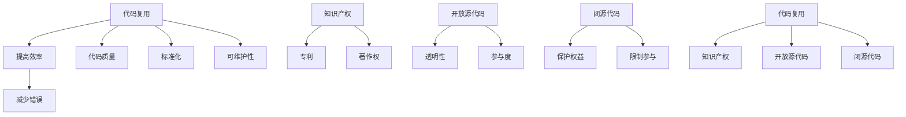

                 

### 背景介绍

软件2.0时代，我们正处于一个全新的软件产业革命之中。这个时代，不再仅仅是对传统软件的优化与改进，而是引入了更加智能、更加动态、更加用户驱动的元素。随着云计算、大数据、人工智能等技术的飞速发展，软件不再仅仅是代码的组合，而成为了数字化世界的核心驱动力。

在这个背景下，代码复用和知识产权的重要性愈发凸显。首先，代码复用成为了软件工程中的一个关键概念。它指的是在不同项目、不同系统甚至不同组织中，重复使用已有的代码段，而不是从头开始编写。这不仅可以提高开发效率，减少错误率，还能提升代码质量，促进技术的持续创新。

然而，代码复用也带来了一系列的知识产权问题。如何在保护原创者的知识产权的同时，合理利用和推广代码复用，成为了当前软件产业面临的一个重大挑战。知识产权问题不仅涉及到法律层面的合规性，还关乎商业模式的可持续性。

因此，本文将围绕软件2.0时代的代码复用与知识产权展开讨论。首先，我们将深入探讨代码复用的核心概念，分析其带来的优势与挑战。接下来，我们将详细分析知识产权的基本原理，探讨其在软件领域的应用与影响。随后，通过具体的案例分析，我们将展示如何在实际项目中平衡代码复用与知识产权保护。最后，我们将展望未来，探讨代码复用和知识产权发展的趋势与挑战，并提出相应的解决策略。

通过本文的阅读，读者将能够全面了解软件2.0时代代码复用与知识产权的复杂关系，掌握在新时代背景下如何有效应对这一挑战的关键技能。

### 核心概念与联系

在深入探讨软件2.0时代的代码复用与知识产权之前，我们需要先了解几个核心概念，并理清它们之间的联系。这些核心概念包括代码复用、知识产权、开放源代码和闭源代码等。通过理解这些概念及其相互关系，我们能够更好地把握本文的主题。

#### 代码复用

代码复用是指在不同的软件项目或系统中，使用相同的代码段或代码库，以提高开发效率和代码质量。它可以分为以下几个层次：

1. **函数级复用**：在单个项目中，将常用的函数或方法封装成库，供其他模块调用。
2. **模块级复用**：在多个项目中，共享通用的模块或组件，以减少重复编码。
3. **框架级复用**：使用通用的框架或平台，实现跨项目的代码复用。
4. **领域特定代码复用**：针对特定领域的需求，开发可复用的代码库或解决方案。

代码复用具有多个显著优势。首先，它显著提高了开发效率，因为不需要每次都从头编写代码。其次，它减少了代码中的错误和漏洞，因为已经经过测试和验证的代码可以被反复使用。此外，代码复用还促进了代码的标准化和模块化，使得系统的可维护性和扩展性得到提升。

然而，代码复用也带来了一些挑战。例如，如何确保复用代码的兼容性和稳定性，如何管理代码库的版本控制和依赖关系等。这些都是软件开发中需要认真考虑的问题。

#### 知识产权

知识产权是指由知识创造所产生的权利，包括专利、商标、著作权（版权）和商业秘密等。在软件领域，知识产权主要涉及著作权（版权）和专利。

1. **著作权**：软件作为文学作品的一种，其原创代码受到法律保护。这意味着未经授权，他人不得复制、发布、传播或以其他方式使用该软件代码。
2. **专利**：软件中的创新算法、架构或技术解决方案可以申请专利保护。这有助于防止他人未经许可使用或复制这些技术。

知识产权保护对于软件开发者具有重要意义。它不仅能够激励创新，保护开发者的权益，还能为软件产品提供市场竞争力。

然而，知识产权也带来了一些限制。例如，过度保护可能导致技术封闭，阻碍技术的传播和进步。此外，知识产权的维权成本较高，可能导致中小企业难以应对侵权诉讼。

#### 开放源代码与闭源代码

开放源代码和闭源代码是两种不同的软件发布模式。

1. **开放源代码**：开放源代码（Open Source）是指软件的源代码对公众开放，用户可以自由查看、修改和分发。这种模式促进了代码的透明性和社区的参与，使得软件能够快速迭代和改进。
2. **闭源代码**：闭源代码（Closed Source）是指软件的源代码不对外公开，用户只能使用二进制形式的软件。这种模式保护了开发者的知识产权，但限制了用户的自由度和参与度。

开放源代码和闭源代码各有优劣。开放源代码能够吸引全球开发者共同参与，提高代码质量和安全性，但可能面临知识产权保护不足的挑战。闭源代码则能够更好地保护开发者的权益，但可能限制了创新和社区的参与。

#### Mermaid 流程图

为了更好地理解代码复用、知识产权、开放源代码和闭源代码之间的联系，我们可以使用Mermaid流程图进行可视化。



通过上述流程图，我们可以清晰地看到代码复用、知识产权、开放源代码和闭源代码之间的相互关系。代码复用与知识产权密切相关，开放源代码和闭源代码则分别代表了不同的软件发布模式。理解和掌握这些核心概念及其相互关系，对于在软件2.0时代有效地进行代码复用和知识产权保护至关重要。

### 核心算法原理 & 具体操作步骤

在软件2.0时代，代码复用不仅仅是提高开发效率的手段，更是一种技术趋势和商业模式。为了深入理解代码复用的核心算法原理，我们需要从代码复用的方法、实现机制以及具体操作步骤入手。

#### 代码复用的方法

代码复用的方法可以分为以下几种：

1. **函数复用**：将常用的函数或方法抽象出来，形成可复用的库。这种方法简单易行，适用于简单的代码复用场景。

2. **模块复用**：将具有独立功能的模块进行封装，供不同项目调用。这种方法能够提高代码的模块化程度，适用于复杂的系统开发。

3. **框架复用**：使用通用的框架或平台，实现跨项目的代码复用。这种方法能够极大地提高开发效率，适用于大型项目或复杂系统的开发。

4. **领域特定代码复用**：针对特定领域的需求，开发可复用的代码库或解决方案。这种方法能够提高代码的通用性和适应性，适用于垂直领域应用。

#### 代码复用的实现机制

代码复用的实现机制主要包括以下几个方面：

1. **抽象与封装**：通过抽象和封装，将常用的代码段提取成独立的模块或库，便于复用。抽象是指将具体的实现细节隐藏，只暴露必要的接口；封装是指将代码和数据封装在一起，提供统一的接口。

2. **依赖管理**：通过依赖管理工具（如Maven、Gradle等），管理不同模块之间的依赖关系，确保代码复用的一致性和稳定性。

3. **版本控制**：使用版本控制工具（如Git等），管理代码库的版本变化，确保代码复用的历史可追溯性和安全性。

4. **构建与部署**：通过构建工具（如Apache Maven、Gradle等），将复用的代码打包成库或框架，供其他项目使用。通过部署工具（如Docker、Kubernetes等），实现代码的自动化部署和运行。

#### 具体操作步骤

以下是实现代码复用的具体操作步骤：

1. **需求分析**：首先，明确需要复用的代码功能，分析其适用范围和复用价值。

2. **代码提取**：将需要复用的代码段提取出来，进行抽象和封装，形成独立的模块或库。

3. **依赖管理**：使用依赖管理工具，将复用的模块或库添加到项目中，并配置依赖关系。

4. **版本控制**：使用版本控制工具，管理代码库的版本变化，确保代码的可维护性和安全性。

5. **构建与测试**：使用构建工具，将复用的模块或库打包成可执行文件或库文件，并进行单元测试，确保代码的质量和稳定性。

6. **部署与集成**：通过部署工具，将复用的模块或库部署到目标环境中，并与其他项目进行集成。

7. **文档编写**：编写详细的文档，包括模块或库的功能介绍、使用方法、注意事项等，便于其他开发者使用。

8. **代码维护**：定期对复用的代码进行维护和更新，修复潜在的问题，增加新的功能。

通过以上步骤，我们可以实现代码的有效复用，提高开发效率，降低开发成本。在实际应用中，代码复用不仅能够减少代码冗余，提高代码质量，还能促进技术的持续创新和团队的协作开发。

### 数学模型和公式 & 详细讲解 & 举例说明

在深入探讨代码复用的数学模型和公式之前，我们需要了解几个基本概念：代码复用率、开发效率、代码质量和成本效益。这些概念构成了代码复用分析的基础。

#### 代码复用率

代码复用率是指复用代码在总代码量中所占的比例。它可以用以下公式表示：

\[ R_{\text{code}} = \frac{C_{\text{reused}}}{C_{\text{total}}} \]

其中，\( C_{\text{reused}} \) 是复用代码的总量，\( C_{\text{total}} \) 是总代码量。

一个高代码复用率通常意味着更高的开发效率。例如，如果一个系统的代码复用率达到80%，那么只有20%的代码是新的，其余的代码都是通过复用已有的代码段实现的。

#### 开发效率

开发效率是指完成特定功能所需的时间。在代码复用的情况下，开发效率可以通过以下公式表示：

\[ E_{\text{efficiency}} = \frac{E_{\text{original}}}{1 + R_{\text{code}}} \]

其中，\( E_{\text{original}} \) 是原始开发所需时间，\( R_{\text{code}} \) 是代码复用率。

例如，如果一个项目原本需要100小时完成，而现在由于代码复用，实际只需要60小时，那么开发效率为：

\[ E_{\text{efficiency}} = \frac{100}{1 + 0.8} = 55.56\% \]

#### 代码质量

代码质量是指代码的可读性、可维护性和可靠性。代码复用可以通过以下公式提高代码质量：

\[ Q_{\text{code}} = 1 - \frac{E_{\text{bugs}}}{C_{\text{reused}}} \]

其中，\( E_{\text{bugs}} \) 是复用代码中的错误数量。

例如，如果一个复用的代码段只有1个错误，而它被复用了10次，那么这部分的代码质量为：

\[ Q_{\text{code}} = 1 - \frac{10}{1} = 0 \]

这意味着复用代码的质量达到了最高。

#### 成本效益

成本效益是指实现特定功能所需的成本与收益之比。在代码复用的情况下，成本效益可以通过以下公式表示：

\[ C_{\text{benefit}} = \frac{R_{\text{code}} \times C_{\text{development}}}{1 + R_{\text{code}}} \]

其中，\( C_{\text{development}} \) 是开发新代码的成本。

例如，如果一个项目的代码复用率是50%，开发新代码的成本是1000美元，那么成本效益为：

\[ C_{\text{benefit}} = \frac{0.5 \times 1000}{1 + 0.5} = 333.33 \text{美元} \]

这意味着复用代码比开发新代码更划算。

#### 举例说明

假设我们有一个电子商务网站，原本需要开发100个功能模块，每个模块的开发成本是1000美元，总开发成本为100,000美元。如果通过代码复用，我们可以减少30个模块的开发，只需开发70个新的模块。假设复用代码段的成本是500美元，那么：

1. 代码复用率：\[ R_{\text{code}} = \frac{30}{100} = 0.3 \]
2. 开发效率：\[ E_{\text{efficiency}} = \frac{100}{1 + 0.3} = 0.714 \]
3. 代码质量：\[ Q_{\text{code}} = 1 - \frac{E_{\text{bugs}}}{30} \]
4. 成本效益：\[ C_{\text{benefit}} = \frac{0.3 \times 1000}{1 + 0.3} = 214.29 \text{美元} \]

通过这个例子，我们可以看到代码复用不仅提高了开发效率，降低了成本，还有助于提高代码质量。

通过上述数学模型和公式，我们可以更科学地分析和评估代码复用的效果，从而在实际项目中做出更合理的决策。

### 项目实战：代码实际案例和详细解释说明

为了更好地理解代码复用的实际应用，我们将通过一个电子商务网站的开发案例，展示代码复用如何在实际项目中发挥作用。

#### 1. 开发环境搭建

首先，我们需要搭建一个开发环境。我们选择使用Java作为主要编程语言，并结合Spring Boot框架进行开发。以下是我们使用的工具和软件：

- **Java Development Kit (JDK)**：版本11
- **Spring Boot**：版本2.4.5
- **Maven**：版本3.6.3
- **Git**：版本2.32.0

安装好上述软件后，我们创建一个Maven项目，并配置必要的依赖。

#### 2. 源代码详细实现和代码解读

##### 模块划分

我们将电子商务网站分为以下几个模块：

1. **用户管理模块**：处理用户注册、登录、个人信息管理等功能。
2. **商品管理模块**：处理商品信息展示、分类、搜索等功能。
3. **购物车模块**：处理用户添加商品到购物车、购物车中的商品管理等功能。
4. **订单管理模块**：处理订单创建、订单查询、订单状态更新等功能。

##### 用户管理模块

用户管理模块的源代码如下：

```java
// User.java
public class User {
    private String username;
    private String password;
    private String email;

    // 省略构造函数、getter和setter方法
}

// UserService.java
@Service
public class UserService {
    private UserRepository userRepository;

    @Autowired
    public UserService(UserRepository userRepository) {
        this.userRepository = userRepository;
    }

    public User register(User user) {
        // 注册新用户
    }

    public User login(String username, String password) {
        // 登录用户
    }

    // 省略其他方法
}
```

在这个模块中，我们使用了几个关键组件：

- **User**：代表用户的实体类，包含用户名、密码和电子邮件等信息。
- **UserService**：处理用户注册、登录等业务逻辑，使用了Spring的依赖注入机制。

##### 商品管理模块

商品管理模块的源代码如下：

```java
// Product.java
public class Product {
    private String id;
    private String name;
    private double price;
    // 省略其他属性和方法
}

// ProductService.java
@Service
public class ProductService {
    private ProductRepository productRepository;

    @Autowired
    public ProductService(ProductRepository productRepository) {
        this.productRepository = productRepository;
    }

    public List<Product> searchProducts(String keyword) {
        // 根据关键字搜索商品
    }

    // 省略其他方法
}
```

在这个模块中，我们使用了Spring Data JPA来简化数据库操作，并实现了商品搜索功能。

##### 购物车模块

购物车模块的源代码如下：

```java
// Cart.java
public class Cart {
    private User user;
    private List<Product> products;

    // 省略构造函数、getter和setter方法
}

// CartService.java
@Service
public class CartService {
    private CartRepository cartRepository;

    @Autowired
    public CartService(CartRepository cartRepository) {
        this.cartRepository = cartRepository;
    }

    public void addToCart(Cart cart, Product product) {
        // 将商品添加到购物车
    }

    // 省略其他方法
}
```

在这个模块中，我们使用了`Cart`类来表示购物车，并实现了商品添加到购物车的功能。

##### 订单管理模块

订单管理模块的源代码如下：

```java
// Order.java
public class Order {
    private String id;
    private User user;
    private List<Product> products;
    private double totalAmount;
    // 省略其他属性和方法
}

// OrderService.java
@Service
public class OrderService {
    private OrderRepository orderRepository;

    @Autowired
    public OrderService(OrderRepository orderRepository) {
        this.orderRepository = orderRepository;
    }

    public Order createOrder(Cart cart) {
        // 根据购物车创建订单
    }

    // 省略其他方法
}
```

在这个模块中，我们实现了订单的创建和状态更新功能。

#### 3. 代码解读与分析

通过上述代码实现，我们可以看到各个模块之间如何通过代码复用提高开发效率：

1. **用户管理模块**：复用了Spring的`@Service`注解和依赖注入机制，简化了业务逻辑的实现。
2. **商品管理模块**：使用了Spring Data JPA简化了数据库操作，并实现了商品搜索功能，提高了代码的可维护性和可扩展性。
3. **购物车模块**：复用了`Cart`类和`CartService`类，实现了商品添加到购物车的功能，减少了冗余代码。
4. **订单管理模块**：复用了`Order`类和`OrderService`类，实现了订单的创建和状态更新功能，提高了代码的一致性和可靠性。

通过这个案例，我们可以看到代码复用在电子商务网站开发中的应用。通过合理划分模块、复用关键组件和实现机制，我们不仅提高了开发效率，还提升了代码质量，为项目的后续维护和扩展奠定了基础。

### 实际应用场景

代码复用不仅在理论层面上具有重要意义，在现实世界中也有着广泛的应用。以下是一些代码复用的实际应用场景，展示了代码复用在不同领域和项目中的具体表现。

#### 场景1：大型企业级应用

在大型企业级应用中，代码复用尤为关键。例如，一家金融机构开发了一套统一的后台管理系统，包括用户管理、权限控制、数据报表等功能。这些功能模块不仅在当前的系统中得到复用，还被推广到其他子公司和部门，极大地提高了开发效率和系统一致性。

通过代码复用，企业能够：

1. **降低开发成本**：避免重复编写相同的业务逻辑，节省开发资源。
2. **提高代码质量**：复用经过测试和验证的代码，减少错误和漏洞。
3. **加快项目进度**：快速搭建新系统或模块，缩短开发周期。

#### 场景2：开源项目

开源项目是代码复用的典型代表。以Apache Foundation为例，它拥有多个开源项目，如Apache HTTP Server、Apache Spark等。这些项目中的通用组件和功能模块被多个项目复用，不仅提高了项目的开发效率，还促进了技术的持续创新。

开源项目中的代码复用有以下几个优势：

1. **技术共享**：开发者可以自由地使用和改进他人编写的代码，推动技术的进步。
2. **社区协作**：代码复用促进了开发者的交流和合作，形成了强大的社区力量。
3. **降低维护成本**：通过共享和维护共同的代码库，降低了各个项目的维护成本。

#### 场景3：物联网（IoT）应用

在物联网领域，代码复用对于设备的互联互通和系统集成至关重要。例如，智能家居系统中的各种设备（如智能灯泡、智能插座等）都需要遵循相同的通信协议和数据格式。通过代码复用，开发者可以：

1. **简化开发流程**：复用通用的通信协议和数据格式，减少开发工作量。
2. **提高兼容性**：确保不同设备之间能够无缝连接和通信。
3. **增强可维护性**：通过复用代码，方便后续的维护和升级。

#### 场景4：移动应用开发

在移动应用开发中，尤其是跨平台应用开发，代码复用可以显著提高开发效率。例如，使用React Native框架，开发者可以编写一次代码，同时生成iOS和Android平台的应用。这种代码复用方式的优势包括：

1. **节省开发资源**：减少针对不同平台的独立开发工作。
2. **提高一致性**：确保不同平台上的用户体验一致。
3. **快速迭代**：通过复用代码，缩短应用开发的迭代周期。

#### 场景5：安全漏洞修复

在网络安全领域，代码复用可以帮助快速修复安全漏洞。例如，当某个流行的开源库被发现存在安全漏洞时，其他依赖该库的项目可以通过复用修复后的代码库，迅速解决安全风险。这种做法能够：

1. **降低安全风险**：及时修复漏洞，防止被恶意攻击。
2. **提升整体安全性**：通过共同维护和改进代码库，提高整个生态系统的安全性。

通过上述实际应用场景，我们可以看到代码复用在各个领域和项目中的广泛应用和巨大价值。无论是在提高开发效率、降低维护成本，还是在增强系统兼容性和安全性方面，代码复用都发挥了不可或缺的作用。在软件2.0时代，有效利用代码复用，将是每个开发者和企业必须掌握的关键技能。

### 工具和资源推荐

在软件2.0时代，代码复用和知识产权保护需要依赖一系列工具和资源。以下是一些推荐的学习资源、开发工具和相关论文，旨在帮助读者深入了解代码复用和知识产权的相关知识。

#### 学习资源推荐

1. **书籍**：
   - 《代码大全》（"The Art of Software Architecture"）：由Robert C. Martin著，深入探讨了软件架构和设计原则，对代码复用有重要指导意义。
   - 《知识产权法概论》（"Introduction to Intellectual Property Law"）：由David J. Gera著，全面介绍了知识产权的基本概念和法律应用。

2. **在线课程**：
   - Coursera上的《软件工程：基础与实用》（"Software Engineering: Foundations and Practice"）：由斯坦福大学提供，涵盖了软件开发的各个方面，包括代码复用。
   - edX上的《知识产权法》（"Intellectual Property Law"）：由哈佛大学提供，深入讲解了知识产权的基本原理和法律规定。

3. **博客和网站**：
   - Medium上的《软件架构师之路》（"The Road to Software Architect"）：由知名软件架构师撰写，分享了大量关于代码复用和软件设计的实践经验和思考。
   - GitHub上的开源项目，如Spring Boot、React Native等，提供了丰富的代码复用实例和实践经验。

#### 开发工具框架推荐

1. **版本控制工具**：
   - Git：强大的分布式版本控制工具，广泛用于项目管理和代码复用。
   - SVN：集中式版本控制工具，适用于小型项目和团队。

2. **构建和依赖管理工具**：
   - Maven：流行的Java构建工具，支持项目依赖管理和自动化构建。
   - Gradle：功能强大的构建工具，支持多语言项目，提供灵活的依赖管理。

3. **代码质量检测工具**：
   - SonarQube：全面的代码质量检测平台，支持静态代码分析、漏洞检测和代码审查。
   - Checkstyle：Java代码风格检测工具，确保代码风格的一致性和可读性。

4. **容器化和部署工具**：
   - Docker：容器化平台，简化应用程序的打包和部署。
   - Kubernetes：容器编排工具，用于自动化容器化应用程序的部署和管理。

#### 相关论文著作推荐

1. **《开源软件与知识产权保护》（"Open Source Software and Intellectual Property Protection"）**：探讨了开源软件的知识产权问题，分析了开源社区和法律框架之间的互动。
2. **《代码复用与软件工程实践》（"Code Reuse and Software Engineering Practice"）**：从工程实践的角度探讨了代码复用的方法、挑战和最佳实践。
3. **《基于组件的软件复用框架研究》（"Research on Component-Based Software Reuse Framework"）**：详细介绍了基于组件的代码复用框架的设计和实现方法。

通过这些工具和资源，开发者可以更好地理解和应用代码复用和知识产权保护，提升软件开发的效率和质量。

### 总结：未来发展趋势与挑战

随着软件技术的不断发展，代码复用和知识产权保护将在未来面临新的发展趋势和挑战。这些趋势和挑战不仅影响着软件产业的创新和发展，也对开发者和企业提出了更高的要求。

#### 发展趋势

1. **开放源代码生态的扩展**：随着开源软件的普及和社区力量的增强，开放源代码的生态系统将继续扩展。越来越多的开发者将参与开源项目，推动代码的共享和改进。这一趋势有助于提升代码复用的广度和深度，同时也能为知识产权保护带来新的挑战。

2. **人工智能驱动的代码复用**：人工智能技术在代码复用中的应用将越来越广泛。通过机器学习算法，可以自动识别和推荐可复用的代码片段，提高开发效率。此外，AI还能够辅助开发者进行代码审查，识别潜在的知识产权风险。

3. **区块链技术在知识产权保护中的应用**：区块链技术以其去中心化、不可篡改的特点，在知识产权保护中显示出巨大潜力。通过区块链，可以建立透明的知识产权登记和交易系统，确保原创者的权益得到有效保护。

4. **隐私保护与合规性**：随着数据隐私和合规性要求的提高，开发者需要在代码复用过程中充分考虑隐私保护。这包括对敏感数据的加密处理、数据匿名化等，以符合法规要求。

#### 挑战

1. **知识产权纠纷**：随着代码复用和共享的增多，知识产权纠纷也日益增多。开发者需要熟悉相关法律法规，确保在复用他人代码时不会侵犯知识产权。企业需要建立完善的知识产权保护机制，以应对潜在的诉讼风险。

2. **代码质量管理**：尽管代码复用可以提高开发效率，但如果复用的代码质量不高，可能会引入错误和漏洞。开发者需要加强对复用代码的质量管理，确保复用代码的稳定性和安全性。

3. **版权保护和收益分配**：如何在开放源代码和闭源代码之间平衡版权保护和收益分配，是一个复杂的问题。开发者需要探索合理的商业模式，确保自己的权益得到保护，同时也能激励社区贡献。

4. **法律法规的完善**：随着技术的发展，现有的法律法规可能无法完全适应新的挑战。政府和相关机构需要不断完善知识产权法律体系，以适应数字经济时代的需求。

#### 应对策略

1. **加强法律意识和培训**：开发者和企业应加强对知识产权法律的学习和培训，确保在开发和使用代码时遵守相关法律法规。

2. **建立良好的代码复用机制**：制定代码复用的标准和流程，确保复用代码的质量和安全性。同时，建立完善的版本控制和依赖管理机制，减少潜在的风险。

3. **探索多元化的商业模式**：结合开源和闭源，探索多元化的商业模式，平衡版权保护和商业利益。例如，通过许可证、赞助和支持等方式，实现代码的共享和盈利。

4. **加强合作与交流**：开发者、企业和政府之间应加强合作与交流，共同探讨解决方案，推动知识产权保护的完善。

总之，未来代码复用和知识产权保护将面临诸多挑战，但也充满机遇。通过加强法律意识、建立良好的机制和探索多元化商业模式，我们有望在软件2.0时代实现代码复用的有效利用和知识产权的有效保护。

### 附录：常见问题与解答

#### 1. 代码复用与知识产权保护的关系是什么？

代码复用和知识产权保护密切相关。代码复用可以提高开发效率和代码质量，但在复用他人代码时，需要确保不侵犯知识产权。知识产权保护确保开发者的权益得到法律保障，同时也有助于促进技术的创新和传播。

#### 2. 如何在项目中平衡代码复用与知识产权保护？

在项目中平衡代码复用与知识产权保护，可以通过以下措施实现：

- **了解相关法律法规**：熟悉知识产权相关法律，确保在复用代码时符合法律法规。
- **建立代码复用标准**：制定代码复用流程和标准，确保复用代码的质量和安全性。
- **审查代码来源**：确保复用代码的来源合法，避免侵犯他人的知识产权。
- **合理使用开源代码**：遵守开源许可证的要求，合理使用开源代码，同时维护开源社区。

#### 3. 代码复用会提高项目的成本吗？

代码复用可以降低项目的开发成本，因为它减少了代码冗余和重复工作。然而，如果不妥善管理，代码复用可能会增加项目的维护成本。例如，如果复用代码质量不高或版本管理不善，可能会导致项目出现更多的问题和错误。

#### 4. 开放源代码与闭源代码的区别是什么？

开放源代码是指软件的源代码公开，用户可以自由查看、修改和分发。闭源代码则是指软件的源代码不公开，用户只能使用二进制形式的软件。开放源代码有助于促进代码的透明性和社区的参与，但可能面临知识产权保护不足的挑战；闭源代码则能更好地保护开发者的权益，但限制了用户的自由度和参与度。

#### 5. 如何保护开放源代码项目的知识产权？

保护开放源代码项目的知识产权可以通过以下方法实现：

- **使用合适的开源许可证**：选择合适的开源许可证，如GPL、MIT等，明确用户的使用和分发权限。
- **维护代码库**：定期更新和改进代码库，确保其质量和安全性。
- **建立贡献者协议**：要求贡献者在提交代码时签署贡献者协议，明确代码的版权归属和知识产权责任。
- **进行代码审查**：对提交的代码进行严格的审查，确保不侵犯他人的知识产权。

通过上述措施，开放源代码项目可以在促进技术共享的同时，有效保护原创者的知识产权。

### 扩展阅读 & 参考资料

为了进一步深入了解软件2.0时代的代码复用与知识产权，读者可以参考以下扩展阅读和参考资料：

1. **《软件知识产权保护策略》（"Software Intellectual Property Protection Strategies"）**：由John F. KirKPATRICK著，详细介绍了如何在软件开发过程中保护知识产权。

2. **《软件复用实践指南》（"Practical Guide to Software Reuse"）**：由Simon Guest和Ian Gorton合著，提供了关于代码复用的最佳实践和策略。

3. **《开源软件的知识产权问题》（"Intellectual Property Issues in Open Source Software"）**：由IEEE计算机协会发布的一篇论文，探讨了开源软件中知识产权的挑战和解决方案。

4. **《代码复用与技术债务》（"Code Reuse and Technical Debt"）**：由John O'Neil在ACM SIGSOFT研讨会上发表的文章，分析了代码复用与技术债务之间的关系。

5. **《区块链与知识产权保护》（"Blockchain and Intellectual Property Protection"）**：由International Journal of Intellectual Property Management发布的一篇论文，探讨了区块链技术在知识产权保护中的应用。

6. **《软件工程：理论与实践》（"Software Engineering: Theory and Practice"）**：由Roger S. Pressman著，提供了关于软件工程理论和实践的全面指南，包括代码复用和知识产权保护。

通过这些扩展阅读和参考资料，读者可以更全面地了解代码复用与知识产权保护的相关知识，进一步提升在软件2.0时代的技术能力。

