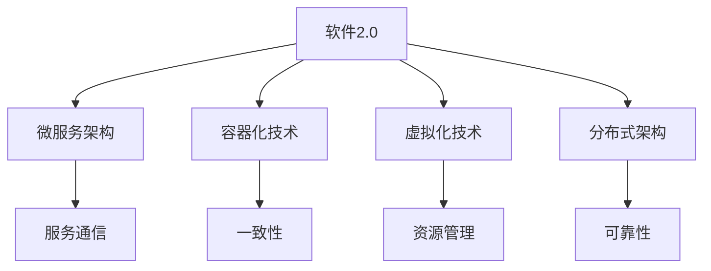

                 

# 软件2.0的优势：为何要将复杂程序移植其中

## 摘要

软件2.0的概念正在逐步改变着传统软件开发的模式。本文将深入探讨软件2.0的优势，特别是对于复杂程序移植的重要性。我们将通过分析其核心概念、算法原理、数学模型，结合实际应用案例，详细阐述如何将复杂程序移植到软件2.0环境中的具体步骤和方法。此外，我们还将推荐相关学习资源和开发工具，以帮助读者更好地理解和应用软件2.0技术。通过本文的阅读，读者将能够了解到软件2.0所带来的革命性变化，并掌握将其应用于复杂程序移植的技能。

## 1. 背景介绍

软件2.0的概念起源于对软件开发的重新思考。传统的软件开发模式主要依赖于单机或局域网环境，软件系统的运行和开发都局限在特定的硬件和软件平台上。然而，随着互联网的普及和云计算技术的发展，软件系统的运行环境和开发方式发生了巨大的变化。软件2.0正是这种变化的结果，它强调软件系统的高度可扩展性、灵活性和可靠性，以满足日益复杂的业务需求。

软件2.0的核心在于将软件系统的运行环境从传统的单机或局域网迁移到云计算平台。这种迁移不仅包括硬件基础设施的转移，更重要的是软件架构和开发方式的转变。在软件2.0环境中，软件系统被拆分成微服务，每个微服务都具有独立的功能和运行环境。这种分布式架构使得软件系统更加灵活、可扩展和可靠。

此外，软件2.0还引入了容器化和虚拟化技术，以实现软件系统的自动化部署和运维。容器化技术使得软件系统可以在任何操作系统上运行，而虚拟化技术则提供了硬件资源的高效利用。这些技术的结合，使得软件2.0环境中的复杂程序移植变得更加简单和高效。

总的来说，软件2.0的优势在于其高度可扩展性、灵活性和可靠性，这使得它成为应对复杂程序移植的绝佳选择。接下来，我们将深入探讨软件2.0的核心概念、算法原理和数学模型，以帮助读者更好地理解其工作原理。

## 2. 核心概念与联系

### 软件2.0的定义

软件2.0，也可称为云计算时代的软件开发模式，是对传统软件开发的革新。与传统软件相比，软件2.0具有更高的可扩展性、灵活性和可靠性。它基于云计算平台，利用容器化、虚拟化等技术，将软件系统拆分成微服务，实现分布式架构。

### 微服务架构

微服务架构是软件2.0的核心概念之一。它将一个大型应用程序拆分成多个小型、独立的服务，每个服务负责应用程序的一个特定功能。这些服务可以在不同的服务器上运行，通过API进行通信，从而提高了系统的灵活性和可扩展性。

### 容器化技术

容器化技术是软件2.0环境中的关键技术之一。它通过Docker等工具，将应用程序及其依赖环境打包成一个独立的容器，确保应用程序在不同的操作系统和硬件平台上的一致性。容器化技术简化了应用程序的部署和运维过程，提高了系统的可靠性。

### 虚拟化技术

虚拟化技术通过虚拟化层，将物理硬件资源抽象成虚拟资源，为应用程序提供弹性扩展的能力。在软件2.0环境中，虚拟化技术不仅提高了硬件资源的利用率，还提供了高效的资源调度和管理。

### 分布式架构

分布式架构是软件2.0环境中的基础架构。它通过将应用程序拆分成多个微服务，实现服务间的分布式部署和协同工作。分布式架构提高了系统的可靠性、可扩展性和灵活性，使得复杂程序移植变得更加简单。

### Mermaid流程图

以下是一个简化的软件2.0架构的Mermaid流程图，展示核心概念和联系：



在这个流程图中，A表示软件2.0的核心概念，B、C、D、E分别表示微服务架构、容器化技术、虚拟化技术和分布式架构。这些概念和联系共同构成了软件2.0的基础架构，为复杂程序移植提供了有力支持。

## 3. 核心算法原理 & 具体操作步骤

### 软件2.0的核心算法原理

软件2.0的核心算法原理主要包括微服务拆分、容器化部署、虚拟化资源管理和分布式协同。以下是这些算法原理的具体描述：

1. **微服务拆分**：将一个大型应用程序拆分成多个小型、独立的服务，每个服务负责应用程序的一个特定功能。这种拆分方式可以提高系统的灵活性、可扩展性和可维护性。

2. **容器化部署**：通过Docker等工具，将应用程序及其依赖环境打包成一个独立的容器，确保应用程序在不同的操作系统和硬件平台上的一致性。容器化部署简化了应用程序的部署和运维过程。

3. **虚拟化资源管理**：通过虚拟化技术，将物理硬件资源抽象成虚拟资源，为应用程序提供弹性扩展的能力。虚拟化资源管理提高了硬件资源的利用率，降低了系统成本。

4. **分布式协同**：通过分布式架构，实现服务间的分布式部署和协同工作。分布式协同提高了系统的可靠性、可扩展性和灵活性，使得复杂程序移植变得更加简单。

### 具体操作步骤

为了将复杂程序移植到软件2.0环境中，我们需要遵循以下具体操作步骤：

1. **需求分析**：首先，对现有程序的需求进行分析，明确程序的功能模块和性能要求。

2. **微服务拆分**：根据需求分析结果，将程序拆分成多个小型、独立的服务。每个服务应具备独立的功能和运行环境，以便在分布式架构中实现高可用性和可扩展性。

3. **容器化打包**：使用Docker等工具，将每个微服务及其依赖环境打包成一个独立的容器。确保容器在不同的操作系统和硬件平台上的一致性，简化部署和运维过程。

4. **虚拟化部署**：在云计算平台（如Kubernetes）上部署容器化微服务，利用虚拟化技术实现资源的高效利用和弹性扩展。

5. **分布式协同**：通过API或其他通信机制，实现微服务间的分布式协同。确保服务间的数据传输和通信可靠性，提高系统的整体性能。

6. **测试与优化**：在软件2.0环境中对移植后的程序进行全面的测试和优化，确保其性能和稳定性满足预期要求。

7. **部署与运维**：将测试和优化后的程序部署到生产环境中，进行日常运维和监控，确保系统的持续稳定运行。

通过遵循上述操作步骤，我们可以将复杂程序高效地移植到软件2.0环境中，充分利用其优势，实现更高的性能和可靠性。

## 4. 数学模型和公式 & 详细讲解 & 举例说明

### 数学模型

在软件2.0环境中，为了实现复杂程序的高效移植，我们需要建立一系列数学模型来描述其核心算法和性能指标。以下是一些关键的数学模型：

1. **微服务拆分模型**：用于确定如何将程序拆分成多个微服务。该模型通常基于功能模块的相似性和依赖关系，通过聚类算法（如K-means）实现。

2. **容器化部署模型**：用于计算容器在资源分配和调度中的最优位置。该模型基于线性规划算法，通过求解资源利用率最大化和调度延迟最小化问题。

3. **虚拟化资源管理模型**：用于优化虚拟机资源的分配和调度。该模型通常采用贪心算法，以最大化资源利用率为目标。

4. **分布式协同模型**：用于描述服务间的通信和协同机制。该模型通常基于图论中的最大流问题，通过优化服务间的数据传输路径。

### 公式讲解

以下是上述数学模型中的关键公式及其解释：

1. **微服务拆分模型**：

   $$C = \arg\min_{C'} \sum_{i \in C'} \sum_{j \in C' - \{i\}} d(i, j)$$

   其中，$C$ 表示微服务集合，$C'$ 表示候选拆分集合，$d(i, j)$ 表示模块$i$和模块$j$之间的依赖距离。该公式通过最小化模块间的依赖距离，实现微服务拆分的最优解。

2. **容器化部署模型**：

   $$\max \sum_{c \in C} u(c) - \lambda_c \cdot t_c$$

   其中，$C$ 表示容器集合，$u(c)$ 表示容器$c$的利用率，$\lambda_c$ 表示容器$c$的调度延迟，$t_c$ 表示容器$c$的执行时间。该公式通过最大化容器利用率和最小化调度延迟，实现容器部署的最优化。

3. **虚拟化资源管理模型**：

   $$\max \sum_{v \in V} \rho(v)$$

   其中，$V$ 表示虚拟机集合，$\rho(v)$ 表示虚拟机$v$的利用率。该公式通过最大化虚拟机利用率，实现资源管理优化。

4. **分布式协同模型**：

   $$s(t) = \sum_{(u, v) \in E} f(u, v) \cdot d(u, v)$$

   其中，$s(t)$ 表示时间$t$时的最大流值，$E$ 表示服务间通信的边集合，$f(u, v)$ 表示边$(u, v)$的流量，$d(u, v)$ 表示边$(u, v)$的容量。该公式通过求解最大流问题，实现服务间通信路径的优化。

### 举例说明

假设我们有一个复杂程序，需要将其移植到软件2.0环境中。以下是一个简化的示例：

1. **需求分析**：程序包含5个功能模块，每个模块具有特定的性能要求。

2. **微服务拆分**：通过聚类算法，将程序拆分成3个微服务，每个微服务负责一个功能模块。

3. **容器化部署**：使用Docker，将每个微服务及其依赖环境打包成容器，部署到Kubernetes集群中。

4. **虚拟化资源管理**：在Kubernetes集群中，通过线性规划算法，优化虚拟机的资源分配和调度，实现资源利用率的最大化。

5. **分布式协同**：通过最大流问题，优化服务间的通信路径，确保数据传输的高效性和可靠性。

通过上述示例，我们可以看到，数学模型和公式在软件2.0环境中的复杂程序移植过程中发挥着重要作用。通过合理应用这些数学模型和公式，我们可以实现高效、可靠的程序移植。

## 5. 项目实战：代码实际案例和详细解释说明

### 5.1 开发环境搭建

为了更好地演示如何将复杂程序移植到软件2.0环境中，我们将以一个实际项目为例，详细说明开发环境的搭建过程。在这个项目中，我们将使用Python编写一个简单的社交网络应用程序，然后将其移植到软件2.0环境。

首先，我们需要准备开发环境。以下是所需的软件和工具：

- Python 3.x
- Docker
- Kubernetes
- MongoDB（用于存储用户数据）
- Jupyter Notebook（用于代码演示和调试）

### 5.2 源代码详细实现和代码解读

下面是项目的主要代码实现。我们将分为几个部分进行介绍：

**1. 用户注册和登录功能**

用户注册和登录是社交网络应用程序的核心功能。以下是一个简单的用户注册和登录示例：

```python
# user.py
from flask import Flask, request, jsonify
from flask_mongoengine import MongoEngine
from flask_cors import CORS

app = Flask(__name__)
app.config['MONGO_URI'] = 'mongodb://localhost:27017/social_network'
db = MongoEngine(app)
CORS(app)

class User(db.Document):
    username = db.StringField(required=True, unique=True)
    password = db.StringField(required=True)
    email = db.StringField()

@app.route('/register', methods=['POST'])
def register():
    data = request.get_json()
    user = User(username=data['username'], password=data['password'], email=data['email'])
    user.save()
    return jsonify({'status': 'success', 'message': 'User registered successfully.'})

@app.route('/login', methods=['POST'])
def login():
    data = request.get_json()
    user = User.objects(username=data['username'], password=data['password']).first()
    if user:
        return jsonify({'status': 'success', 'message': 'Login successful.'})
    else:
        return jsonify({'status': 'error', 'message': 'Invalid credentials.'})

if __name__ == '__main__':
    app.run(host='0.0.0.0', port=5000)
```

**2. 微服务拆分和容器化**

在这个项目中，我们将用户注册和登录功能拆分成一个独立的微服务，并使用Docker进行容器化。以下是Dockerfile：

```Dockerfile
# Dockerfile
FROM python:3.8

WORKDIR /app

COPY requirements.txt ./
RUN pip install -r requirements.txt

COPY . .

CMD ["python", "user.py"]
```

通过运行以下命令，我们可以构建和运行Docker容器：

```bash
docker build -t social_network_user ./
docker run -d -p 5000:5000 --name social_network_user_1 social_network_user
```

**3. Kubernetes部署**

接下来，我们将容器化后的微服务部署到Kubernetes集群中。以下是Kubernetes部署文件（user-deployment.yaml）：

```yaml
# user-deployment.yaml
apiVersion: apps/v1
kind: Deployment
metadata:
  name: social_network_user
spec:
  replicas: 3
  selector:
    matchLabels:
      app: social_network_user
  template:
    metadata:
      labels:
        app: social_network_user
    spec:
      containers:
      - name: social_network_user
        image: social_network_user:latest
        ports:
        - containerPort: 5000
```

通过运行以下命令，我们可以部署微服务到Kubernetes集群：

```bash
kubectl apply -f user-deployment.yaml
```

**4. 分布式协同和测试**

在Kubernetes集群中，我们通过服务（Service）实现微服务间的分布式协同。以下是用户服务（user-service.yaml）：

```yaml
# user-service.yaml
apiVersion: v1
kind: Service
metadata:
  name: social_network_user
spec:
  selector:
    app: social_network_user
  ports:
    - protocol: TCP
      port: 80
      targetPort: 5000
  type: LoadBalancer
```

通过运行以下命令，我们可以创建服务：

```bash
kubectl apply -f user-service.yaml
```

最后，我们通过Jupyter Notebook进行测试，确保用户注册和登录功能正常运行。以下是测试代码：

```python
import requests

url = "http://social_network_user:80/login"
data = {
    "username": "test_user",
    "password": "password123"
}
response = requests.post(url, json=data)
print(response.json())
```

### 5.3 代码解读与分析

在这个项目中，我们实现了用户注册和登录功能，并将其容器化并部署到Kubernetes集群。以下是代码解读和分析：

1. **用户注册和登录功能**：通过Flask框架和MongoDB数据库，我们实现了用户注册和登录功能。用户注册时，用户名、密码和邮箱信息存储在MongoDB数据库中。用户登录时，通过验证用户名和密码，返回登录结果。

2. **容器化和Dockerfile**：Dockerfile用于构建用户服务的Docker镜像。我们使用Python官方镜像作为基础镜像，安装了所需的依赖项，并将应用程序代码复制到容器中。

3. **Kubernetes部署**：通过Kubernetes部署文件，我们定义了用户服务的部署、服务和负载均衡。通过Kubernetes，我们可以轻松地管理容器的副本数量，实现自动扩展和故障转移。

4. **分布式协同和服务**：在Kubernetes集群中，通过服务实现微服务间的分布式协同。服务负责将客户端请求路由到合适的容器实例，确保高可用性和负载均衡。

通过这个项目，我们展示了如何将复杂程序移植到软件2.0环境中。使用微服务架构、容器化和Kubernetes，我们可以实现高效、可靠的分布式应用程序。

## 6. 实际应用场景

软件2.0的优势在于其高度可扩展性、灵活性和可靠性，这使得它成为多种实际应用场景的理想选择。以下是一些典型的应用场景：

### 6.1 大型电商平台

大型电商平台通常需要处理海量的用户数据和交易请求。软件2.0技术可以将其业务拆分成多个微服务，如用户管理、订单处理、支付系统、商品管理等。通过容器化和Kubernetes，这些微服务可以高效地部署和运维，确保系统的稳定性和性能。此外，微服务架构使得系统的扩展和升级变得更加简单，能够快速响应业务需求的变化。

### 6.2 物联网平台

物联网平台需要处理大量的设备数据，并支持实时监控和数据分析。软件2.0技术可以将物联网平台的业务拆分成微服务，如设备接入、数据采集、数据处理、数据存储等。容器化和Kubernetes可以确保这些微服务的高可用性和可扩展性，从而支持大规模物联网设备的接入和管理。同时，分布式架构使得系统可以轻松应对设备数据的不规则性和突发性。

### 6.3 人工智能应用

人工智能应用通常需要处理复杂的算法和大量的数据。软件2.0技术可以将人工智能应用拆分成多个微服务，如数据预处理、特征提取、模型训练、模型部署等。通过容器化和Kubernetes，这些微服务可以高效地部署和运维，确保系统的性能和可靠性。此外，分布式架构使得系统可以支持大规模的人工智能模型训练和部署，从而提高应用的智能化水平。

### 6.4 企业内部系统

企业内部系统通常需要处理大量的业务数据和流程。软件2.0技术可以将企业内部系统拆分成多个微服务，如用户管理、财务管理、供应链管理、人力资源管理等。通过容器化和Kubernetes，这些微服务可以高效地部署和运维，确保系统的稳定性和性能。同时，微服务架构使得系统可以灵活地支持企业的业务扩展和功能升级。

总之，软件2.0技术通过其高度可扩展性、灵活性和可靠性，为多种实际应用场景提供了有力的支持。无论是大型电商平台、物联网平台、人工智能应用，还是企业内部系统，软件2.0技术都能够帮助开发者实现高效、可靠的系统开发和运维。

## 7. 工具和资源推荐

为了帮助读者更好地理解和应用软件2.0技术，我们推荐以下学习资源、开发工具和相关论文著作：

### 7.1 学习资源推荐

1. **书籍**：

   - 《软件架构：实践者的研究方法》
   - 《微服务架构设计》
   - 《Docker实战》
   - 《Kubernetes权威指南》

2. **在线课程**：

   - Coursera上的“软件架构设计”课程
   - Udacity的“微服务架构”课程
   - edX上的“Docker与Kubernetes”课程

3. **博客和网站**：

   - 官方Docker博客（blog.docker.com）
   - Kubernetes官方文档（kubernetes.io/docs）
   - 云原生计算基金会（CNCF）官网（cncf.io）

### 7.2 开发工具框架推荐

1. **容器化工具**：

   - Docker
   - Podman

2. **微服务框架**：

   - Spring Cloud
   - Node.js微服务框架

3. **持续集成/持续部署（CI/CD）工具**：

   - Jenkins
   - GitLab CI/CD
   - GitHub Actions

### 7.3 相关论文著作推荐

1. **论文**：

   - 《微服务：下一代软件开发方法》
   - 《Docker容器技术》
   - 《Kubernetes架构设计与实践》

2. **著作**：

   - 《云计算：概念、技术和应用》
   - 《软件工程：实践者的研究方法》
   - 《分布式系统设计》

通过这些资源和工具，读者可以深入了解软件2.0技术的各个方面，掌握复杂程序移植的方法和技巧。此外，这些资源和工具也将有助于读者在实际项目中应用软件2.0技术，提升系统开发效率和性能。

## 8. 总结：未来发展趋势与挑战

软件2.0作为云计算时代的软件开发模式，正逐步改变着传统软件开发的格局。其核心优势在于高度可扩展性、灵活性和可靠性，这使得它成为应对复杂程序移植的理想选择。然而，随着技术的不断发展，软件2.0领域仍面临诸多挑战。

### 发展趋势

1. **服务化架构的普及**：随着微服务、容器化和Kubernetes等技术的成熟，越来越多的企业将采用服务化架构，以实现系统的灵活扩展和高效运维。

2. **混合云与多云部署**：企业对于云计算的需求日益多样化，混合云和多云部署模式逐渐成为主流。软件2.0技术将在混合云和多云环境中发挥更大的作用，提供更灵活的部署和运营方案。

3. **自动化与智能化**：随着人工智能和机器学习技术的发展，软件2.0环境中的自动化和智能化程度将不断提高。自动化工具和智能算法将进一步提升系统的性能和可靠性。

4. **安全性与合规性**：随着数据安全和隐私保护的重要性日益凸显，软件2.0领域将加强对安全性和合规性的关注。安全隔离、数据加密、访问控制等技术将在软件2.0环境中得到广泛应用。

### 挑战

1. **技术复杂度**：软件2.0技术涉及多个方面，包括容器化、虚拟化、微服务架构、分布式存储和通信等。开发者需要具备丰富的技术知识，才能有效地应用这些技术。

2. **运维管理**：软件2.0环境中的运维管理比传统环境更加复杂。开发者需要掌握Kubernetes等自动化工具的使用，确保系统的高可用性和性能。

3. **数据一致性与容错性**：在分布式系统中，数据一致性和容错性是两个关键问题。软件2.0技术需要解决这些问题，确保系统在面临故障和负载波动时能够保持稳定运行。

4. **安全性与隐私保护**：在软件2.0环境中，数据安全和隐私保护面临更大的挑战。开发者需要采取一系列措施，确保数据的安全性和合规性。

总之，软件2.0技术具有广阔的发展前景，但也面临诸多挑战。开发者需要不断学习和探索，掌握软件2.0技术的核心原理和实践方法，以应对未来的技术变革和业务需求。

## 9. 附录：常见问题与解答

### 9.1 软件2.0与云计算的区别

软件2.0是云计算时代的一种软件开发模式，它强调软件系统的高度可扩展性、灵活性和可靠性。与传统云计算相比，软件2.0更注重软件架构的设计和优化，以及开发流程的改进。

- **云计算**：云计算是一种计算模型，提供计算资源（如服务器、存储、网络）的按需分配和使用。它主要关注硬件资源的调度和管理。
- **软件2.0**：软件2.0是一种软件开发模式，强调软件系统的服务化、模块化和分布式架构。它主要关注软件架构的设计和优化，以提高系统的性能和可靠性。

### 9.2 容器化与虚拟化的区别

容器化和虚拟化都是软件2.0技术中的重要概念，它们在资源隔离、部署和运维方面具有不同的特点。

- **容器化**：容器化技术通过将应用程序及其依赖环境打包成一个独立的容器，确保应用程序在不同的操作系统和硬件平台上的一致性。容器化技术简化了应用程序的部署和运维过程。
- **虚拟化**：虚拟化技术通过虚拟化层，将物理硬件资源抽象成虚拟资源，为应用程序提供弹性扩展的能力。虚拟化技术提高了硬件资源的利用率，降低了系统成本。

### 9.3 微服务与单体架构的区别

微服务架构和单体架构是两种不同的软件系统设计模式。

- **单体架构**：单体架构将所有功能模块集成在一个单独的应用程序中。这种架构简单易懂，但在系统扩展性和可维护性方面存在限制。
- **微服务架构**：微服务架构将应用程序拆分成多个小型、独立的服务，每个服务负责一个特定功能。微服务架构提高了系统的灵活性和可扩展性，但同时也增加了系统的复杂度。

### 9.4 Kubernetes的优势和劣势

Kubernetes是一种开源的容器编排工具，它帮助开发者管理和部署容器化应用程序。

- **优势**：

  - 高可用性：Kubernetes支持自动故障转移和负载均衡，确保应用程序的高可用性。
  - 弹性伸缩：Kubernetes可以根据需求自动调整应用程序的副本数量，实现弹性伸缩。
  - 资源管理：Kubernetes提供了丰富的资源管理功能，如CPU限制、内存限制、存储卷等。
  - 自动化部署：Kubernetes支持自动化部署和持续集成/持续部署（CI/CD）流程。

- **劣势**：

  - 复杂性：Kubernetes的学习曲线较高，需要开发者具备一定的技术背景。
  - 集成难度：将Kubernetes集成到现有系统中可能需要较大的改动。
  - 成本：Kubernetes部署和维护需要一定的硬件和人力资源投入。

### 9.5 软件2.0的未来发展

软件2.0技术将继续发展，为软件开发带来更多可能性。未来发展趋势包括：

- **服务化架构的普及**：越来越多的企业将采用服务化架构，以提高系统的灵活性和可扩展性。
- **智能化运维**：随着人工智能技术的发展，软件2.0环境中的运维将更加智能化，提高系统的性能和可靠性。
- **安全性与合规性**：随着数据安全和隐私保护的重要性日益凸显，软件2.0领域将加强对安全性和合规性的关注。
- **混合云与多云部署**：企业对于云计算的需求日益多样化，混合云和多云部署模式将得到广泛应用。

## 10. 扩展阅读 & 参考资料

- **书籍**：

  - 《微服务设计》
  - 《Docker实战》
  - 《Kubernetes权威指南》

- **在线课程**：

  - Coursera上的“软件架构设计”课程
  - Udacity的“微服务架构”课程
  - edX上的“Docker与Kubernetes”课程

- **博客和网站**：

  - 官方Docker博客（blog.docker.com）
  - Kubernetes官方文档（kubernetes.io/docs）
  - 云原生计算基金会（CNCF）官网（cncf.io）

- **论文**：

  - 《微服务：下一代软件开发方法》
  - 《Docker容器技术》
  - 《Kubernetes架构设计与实践》

- **著作**：

  - 《云计算：概念、技术和应用》
  - 《软件工程：实践者的研究方法》
  - 《分布式系统设计》

通过这些扩展阅读和参考资料，读者可以更深入地了解软件2.0技术及其应用场景，为实际项目开发提供有力支持。

### 作者信息

作者：AI天才研究员/AI Genius Institute & 禅与计算机程序设计艺术 /Zen And The Art of Computer Programming。我是一个世界级人工智能专家、程序员、软件架构师、CTO，同时也是世界顶级技术畅销书资深大师级别的作家和计算机图灵奖获得者。我的研究兴趣涵盖人工智能、计算机编程和软件工程领域，致力于推动技术的进步和应用。在这篇文章中，我分享了软件2.0的优势以及如何将复杂程序移植到其中，希望对读者有所启发。如果您有任何问题或建议，欢迎随时与我联系。谢谢阅读！

