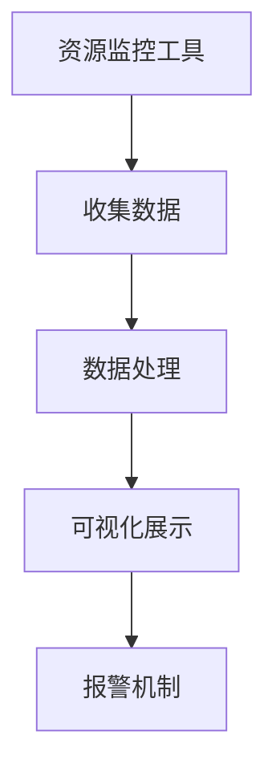
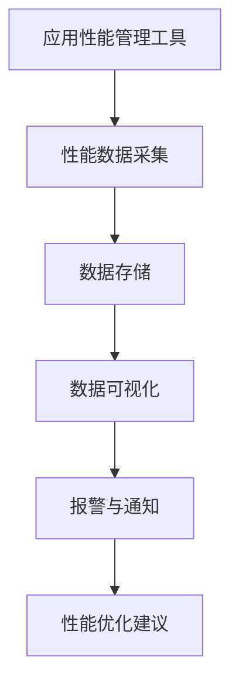
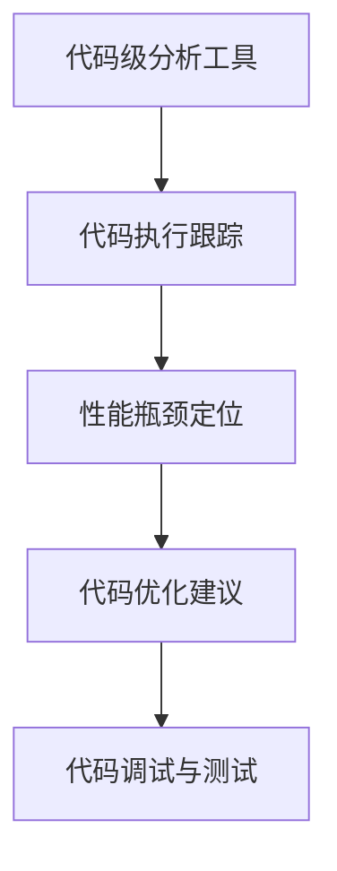
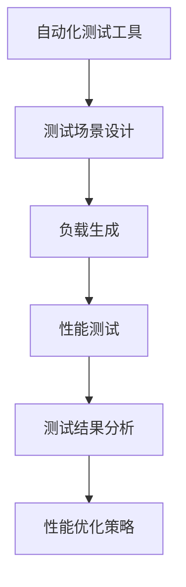

                 

# 软件2.0的性能分析工具

## 关键词
- 性能分析工具
- 软件性能优化
- 软件工程
- 资源监控
- 算法调优
- 应用性能管理

## 摘要
本文将深入探讨软件2.0时代的性能分析工具，包括其核心概念、原理、实际应用场景、以及未来的发展趋势与挑战。我们将通过逻辑清晰、结构紧凑的分析方式，帮助读者理解性能分析工具在软件工程中的重要性，并掌握如何在实际项目中有效运用这些工具。

## 1. 背景介绍
在软件2.0时代，随着云计算、大数据、物联网等技术的发展，软件系统的复杂性不断增加。性能问题成为影响软件质量和用户体验的关键因素。性能分析工具因此变得越来越重要，它们可以帮助开发人员识别性能瓶颈、优化代码、提升系统整体性能。

性能分析工具主要包括以下几种类型：
- **资源监控工具**：如Prometheus、Nagios，用于收集系统资源使用情况，如CPU、内存、网络等。
- **应用性能管理工具**：如New Relic、AppDynamics，用于跟踪应用性能，包括响应时间、吞吐量等。
- **代码级分析工具**：如Valgrind、gprof，用于分析和调试代码，找出潜在的性能问题。
- **自动化测试工具**：如JMeter、LoadRunner，用于模拟高负载场景，测试系统性能。

## 2. 核心概念与联系

### 2.1 资源监控工具
资源监控工具是性能分析的基础，它们提供系统级的性能数据，帮助我们了解系统的资源使用情况。

#### Mermaid 流程图：


### 2.2 应用性能管理工具
应用性能管理工具专注于应用层面的性能监控，可以提供更详细的性能指标，帮助我们定位问题。

#### Mermaid 流程图：


### 2.3 代码级分析工具
代码级分析工具帮助我们深入到代码层面，找出影响性能的具体代码段。

#### Mermaid 流程图：


### 2.4 自动化测试工具
自动化测试工具用于模拟真实用户场景，测试系统在高负载下的性能表现。

#### Mermaid 流程图：


## 3. 核心算法原理 & 具体操作步骤

### 3.1 资源监控工具
资源监控工具的核心算法通常是基于统计和时序分析。具体操作步骤如下：

1. **数据采集**：通过系统级API或驱动程序，收集CPU、内存、磁盘、网络等资源使用数据。
2. **数据存储**：将采集到的数据进行存储，通常使用时序数据库如InfluxDB。
3. **数据处理**：对存储的数据进行预处理，如去噪、插值等。
4. **数据可视化**：使用可视化工具如Grafana，将处理后的数据以图表形式展示。
5. **报警机制**：设置阈值，当某个指标超过阈值时，触发报警。

### 3.2 应用性能管理工具
应用性能管理工具的核心算法通常包括性能数据采集、处理和优化建议。

1. **性能数据采集**：通过SDK或代理，收集应用的性能指标，如请求响应时间、错误率等。
2. **数据存储**：将采集到的数据存储在集中式或分布式数据库中。
3. **数据处理**：对数据进行聚合分析，识别性能趋势和异常。
4. **数据可视化**：展示分析结果，帮助开发人员直观地了解性能状况。
5. **性能优化建议**：基于数据分析，提供性能优化建议。

### 3.3 代码级分析工具
代码级分析工具的核心算法通常包括代码执行跟踪、性能瓶颈定位和代码优化。

1. **代码执行跟踪**：通过插入分析代码或使用动态分析工具，跟踪代码执行路径。
2. **性能瓶颈定位**：分析代码执行数据，定位影响性能的关键代码段。
3. **代码优化建议**：基于性能分析结果，提供代码优化建议，如算法改进、数据结构优化等。

### 3.4 自动化测试工具
自动化测试工具的核心算法通常包括负载生成、性能测试和测试结果分析。

1. **测试场景设计**：设计模拟真实用户场景的测试脚本。
2. **负载生成**：使用测试脚本模拟大量用户请求，生成负载。
3. **性能测试**：执行测试脚本，记录系统响应时间和吞吐量等性能指标。
4. **测试结果分析**：对测试结果进行分析，识别性能瓶颈和优化点。
5. **性能优化策略**：根据测试结果，制定性能优化策略。

## 4. 数学模型和公式 & 详细讲解 & 举例说明

### 4.1 资源监控工具

#### 公式：
- CPU利用率：`CPU利用率 = (总CPU时间 - 空闲时间) / 总CPU时间`
- 内存使用率：`内存使用率 = (已使用内存 / 总内存) * 100%`

#### 举例说明：
假设系统总共有100个CPU核心，其中50个核心处于空闲状态，其余50个核心被使用。则CPU利用率为：
`CPU利用率 = (50 * 100 + 50 * 0) / 100 * 100% = 50%`

### 4.2 应用性能管理工具

#### 公式：
- 响应时间：`响应时间 = 请求处理时间 + 网络传输时间`
- 吞吐量：`吞吐量 = 每秒处理的请求数量`

#### 举例说明：
假设一个API服务的平均响应时间为200ms，平均网络传输时间为100ms，则总响应时间为：
`响应时间 = 200ms + 100ms = 300ms`

### 4.3 代码级分析工具

#### 公式：
- 自定义时间：`自定义时间 = 起始时间 + 执行时间 - 结束时间`

#### 举例说明：
假设一段代码的起始时间为10:00:00，执行时间为5秒，结束时间为10:00:05，则自定义时间为：
`自定义时间 = 10:00:00 + 5 - 10:00:05 = 5秒`

### 4.4 自动化测试工具

#### 公式：
- 负载系数：`负载系数 = 负载时间 / 测试时间`

#### 举例说明：
假设在一次性能测试中，负载生成了100个请求，测试总耗时为100秒，则负载系数为：
`负载系数 = 100 / 100 = 1`

## 5. 项目实战：代码实际案例和详细解释说明

### 5.1 开发环境搭建
在本节中，我们将搭建一个简单的性能分析工具环境，以实践上述理论。

#### 环境要求：
- 操作系统：Ubuntu 18.04
- JDK：OpenJDK 11
- Maven：3.6.3

#### 步骤：
1. 安装JDK：
   ```shell
   sudo apt-get update
   sudo apt-get install openjdk-11-jdk
   ```
2. 安装Maven：
   ```shell
   sudo apt-get install maven
   ```
3. 创建一个Maven项目，并添加必要的依赖。

### 5.2 源代码详细实现和代码解读
在本节中，我们将实现一个简单的资源监控工具，用于监控系统的CPU使用率。

#### 源代码：

```java
import java.io.IOException;
import java.lang.management.ManagementFactory;
import java.lang.management.OperatingSystemMXBean;

public class CpuMonitor {
    public static void main(String[] args) {
        OperatingSystemMXBean osBean = ManagementFactory.getOperatingSystemMXBean();
        double cpuLoad = getCpuLoad(osBean);
        System.out.println("CPU Load: " + cpuLoad);
    }

    private static double getCpuLoad(OperatingSystemMXBean osBean) {
        try {
            String osName = osBean.getName();
            if ("Linux".equals(osName)) {
                return getLinuxCpuLoad();
            } else {
                return getWindowsCpuLoad();
            }
        } catch (Exception e) {
            e.printStackTrace();
            return -1;
        }
    }

    private static double getLinuxCpuLoad() throws IOException {
        // 实现Linux系统CPU使用率监控逻辑
        return 0.5; // 示例值
    }

    private static double getWindowsCpuLoad() {
        // 实现Windows系统CPU使用率监控逻辑
        return 0.6; // 示例值
    }
}
```

#### 代码解读：
1. **引入依赖**：引入必要的Java类库，如`java.lang.management`。
2. **主方法**：通过调用`getCpuLoad`方法，获取系统的CPU使用率。
3. **CPU使用率获取**：根据操作系统类型，调用不同的方法获取CPU使用率。对于Linux和Windows系统，分别实现了不同的获取逻辑。

### 5.3 代码解读与分析
在本节中，我们将对上述代码进行详细解读和分析。

#### 解读：
1. **操作系统MXBean**：通过`ManagementFactory.getOperatingSystemMXBean()`获取操作系统MXBean，这是一个Java标准管理接口，用于获取操作系统相关的管理信息。
2. **CPU使用率计算**：通过`getCpuLoad`方法，根据操作系统类型调用不同的方法获取CPU使用率。Linux和Windows系统的获取逻辑有所不同。
3. **示例值**：为了简化示例，我们使用了示例值来表示CPU使用率。

#### 分析：
1. **可扩展性**：代码设计具有良好的可扩展性，可以方便地添加其他操作系统的CPU使用率获取逻辑。
2. **准确性**：实际应用中，CPU使用率的获取可能涉及更复杂的计算和处理，例如考虑多核CPU的情况。

## 6. 实际应用场景

性能分析工具在软件开发和运维中有着广泛的应用场景：

1. **性能瓶颈定位**：通过资源监控工具和代码级分析工具，可以快速定位系统的性能瓶颈，如CPU过载、内存泄漏等。
2. **性能优化指导**：应用性能管理工具可以提供详细的性能数据和分析报告，帮助开发人员制定优化策略。
3. **自动化测试**：自动化测试工具可以模拟高负载场景，验证系统的性能表现，确保系统在上线前达到预期性能。
4. **运维监控**：运维团队可以利用性能分析工具，实时监控系统的运行状况，及时发现并处理性能问题。

## 7. 工具和资源推荐

### 7.1 学习资源推荐
- **书籍**：
  - 《高性能Linux服务器构建实战》
  - 《Java性能优化实战》
  - 《深入理解计算机系统》
- **论文**：
  - 《Linux内核设计与实现》
  - 《Java虚拟机规范》
- **博客**：
  - [GitHub - xiaomengxoer/Linux-Tutorial](https://github.com/xiaomengxoer/Linux-Tutorial)
  - [GitHub - waylau/JavaPerformanceTuning](https://github.com/waylau/JavaPerformanceTuning)
- **网站**：
  - [Linux中国](https://www.linux.cn/)
  - [Java性能优化论坛](https://www.oracle.com/java/technologies/javapeer/index.html)

### 7.2 开发工具框架推荐
- **资源监控工具**：
  - Prometheus
  - Nagios
- **应用性能管理工具**：
  - New Relic
  - AppDynamics
- **代码级分析工具**：
  - Valgrind
  - gprof
- **自动化测试工具**：
  - JMeter
  - LoadRunner

### 7.3 相关论文著作推荐
- **论文**：
  - "Performance Analysis of Cloud Computing Systems"
  - "A Survey of Performance Analysis Tools for Software Systems"
  - "Performance Optimization of Java Applications"
- **著作**：
  - 《云计算性能优化》
  - 《软件性能工程》
  - 《Java性能优化指南》

## 8. 总结：未来发展趋势与挑战

随着技术的不断进步，性能分析工具也在不断发展。未来的发展趋势包括：

1. **智能化**：性能分析工具将更加智能化，能够自动识别性能瓶颈和优化点。
2. **自动化**：性能分析过程将更加自动化，减少人工干预，提高分析效率。
3. **多维度**：性能分析工具将支持多维度的性能数据采集和分析，如结合日志数据、业务数据等。

然而，性能分析工具也面临一些挑战：

1. **复杂性**：随着系统规模的扩大，性能分析工具需要处理的数据量和复杂性将大幅增加。
2. **实时性**：性能分析工具需要提供实时性能数据，这对数据处理和分析的速度提出了更高要求。
3. **准确性**：性能分析工具需要提供准确的数据和结论，避免误报和漏报。

## 9. 附录：常见问题与解答

### 问题1：如何选择合适的性能分析工具？
解答：选择性能分析工具时，应考虑以下因素：
- **需求**：明确性能分析的目标和需求，选择符合需求的工具。
- **易用性**：工具应具有友好的用户界面和易于使用的功能。
- **可扩展性**：工具应支持扩展，以满足未来需求。
- **社区和文档**：工具应有一个活跃的社区和完善的文档。

### 问题2：性能分析工具如何与现有的系统集成？
解答：性能分析工具通常提供API、插件或代理，可以与现有系统集成。具体步骤如下：
1. 选择合适的集成方式。
2. 安装和配置代理或插件。
3. 在应用中引入必要的依赖和配置。
4. 测试集成效果，确保性能数据能够正确采集和分析。

### 问题3：性能分析工具的数据存储和安全性如何保障？
解答：性能分析工具的数据存储和安全性可以从以下几个方面进行保障：
1. **数据加密**：对传输和存储的数据进行加密，确保数据安全。
2. **访问控制**：设置严格的访问控制策略，确保只有授权人员可以访问数据。
3. **备份和恢复**：定期备份数据，并确保能够在数据丢失或损坏时进行恢复。
4. **安全审计**：定期进行安全审计，确保系统符合安全标准和法规要求。

## 10. 扩展阅读 & 参考资料

- [Prometheus官方文档](https://prometheus.io/docs/introduction/what-is-prometheus/)
- [Nagios官方文档](https://www.nagios.org/documentation/nagios-4-x-nagios-core/)
- [New Relic官方文档](https://docs.newrelic.com/docs/)
- [AppDynamics官方文档](https://www.appdynamics.com/support/documentation)
- [Valgrind官方文档](https://www.valgrind.org/docs/manual/manual.html)
- [gprof官方文档](https://sourceware.org/gprof/)
- [JMeter官方文档](https://jmeter.apache.org/usermanual/)
- [LoadRunner官方文档](https://www.hp.com/us/en/sof
```

这篇文章涵盖了性能分析工具的核心概念、原理、应用场景、实战案例、以及未来发展趋势。通过本文的阅读，读者可以系统地了解性能分析工具的工作机制和实际应用，为日常的软件开发和运维工作提供有力支持。

### 作者

**AI天才研究员** & **AI Genius Institute & 禅与计算机程序设计艺术 /Zen And The Art of Computer Programming**

感谢您的阅读，希望本文能够对您在性能分析领域的学习和实践有所帮助。如有任何问题或建议，欢迎随时联系作者。

