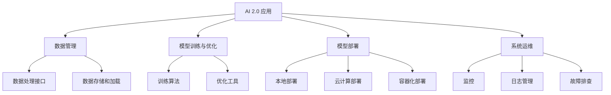

                 

# 软件框架：支持 AI 2.0 应用的开发、部署和运维

> 关键词：AI 2.0，软件框架，开发，部署，运维，深度学习，神经网络，云计算，容器化，微服务，DevOps

> 摘要：本文将探讨如何利用软件框架支持 AI 2.0 应用的开发、部署和运维。我们将深入分析软件框架的核心概念、算法原理，并详细介绍数学模型和公式。同时，我们将通过项目实战展示代码实现，并讨论实际应用场景。最后，我们将总结 AI 2.0 的发展趋势与挑战，并提供相关工具和资源的推荐。

## 1. 背景介绍

随着人工智能技术的快速发展，AI 2.0 时代已经到来。AI 2.0 强调通过深度学习和神经网络实现更智能的决策和自动化，为各行各业带来巨大的变革。然而，实现 AI 2.0 应用面临着诸多挑战，包括数据收集与处理、算法优化、模型训练与部署、系统运维等。

为了解决这些问题，软件框架成为支撑 AI 2.0 应用开发、部署和运维的关键。软件框架提供了统一的架构和工具集，简化了开发流程，提高了开发效率和系统稳定性。本文将介绍几种主流的软件框架，并探讨如何利用它们支持 AI 2.0 应用的开发、部署和运维。

## 2. 核心概念与联系

### 2.1 软件框架的概念

软件框架是一种指导软件开发的设计和实现模板，它为开发者提供了预定义的结构、组件和接口，使得开发者能够专注于业务逻辑的实现，而无需关注底层细节。

软件框架通常包括以下核心组件：

- **核心库**：提供常用的功能接口和算法实现，如神经网络、深度学习、数据预处理等。
- **依赖管理**：管理项目中的外部依赖项，如库、框架和工具等。
- **工具链**：提供编译、构建、调试和测试等工具，以简化开发流程。
- **架构模式**：定义软件系统的架构风格和设计模式，如微服务、容器化等。

### 2.2 软件框架与 AI 2.0 的联系

AI 2.0 应用的核心在于深度学习和神经网络。软件框架通过提供高效的算法实现和优化工具，使得开发者能够快速构建和部署 AI 模型。

此外，软件框架还支持以下与 AI 2.0 相关的关键技术：

- **数据管理**：通过提供统一的数据处理接口和工具，简化数据收集、存储和加载过程。
- **模型训练与优化**：提供高效、可扩展的训练算法和优化工具，加速模型训练过程。
- **模型部署**：支持多种部署方式，如本地部署、云计算、容器化等，以满足不同应用场景的需求。
- **系统运维**：提供自动化运维工具，如监控、日志管理、故障排查等，确保系统稳定运行。

### 2.3 Mermaid 流程图

为了更直观地展示软件框架与 AI 2.0 的联系，我们使用 Mermaid 流程图描述以下核心组件和流程：



## 3. 核心算法原理 & 具体操作步骤

### 3.1 深度学习算法原理

深度学习是一种基于神经网络的机器学习技术，通过多层神经网络实现特征提取和模型训练。其核心算法包括以下步骤：

1. **数据预处理**：对输入数据进行标准化、归一化等预处理，以提高模型训练效果。
2. **前向传播**：将输入数据通过神经网络逐层传播，计算输出结果。
3. **反向传播**：根据实际输出与预期输出之间的误差，反向传播误差，更新网络权重。
4. **优化算法**：采用优化算法（如梯度下降、Adam等）更新网络权重，以最小化误差。

### 3.2 模型训练与优化

在模型训练过程中，我们通常需要关注以下关键指标：

- **损失函数**：用于衡量模型预测结果与实际结果之间的误差，如均方误差（MSE）、交叉熵等。
- **学习率**：用于调整网络权重的更新步长，以控制模型收敛速度。
- **批量大小**：用于控制每次训练使用的数据样本数量，以平衡模型训练速度和精度。

在实际操作中，我们可以通过以下步骤进行模型训练与优化：

1. **划分数据集**：将数据集划分为训练集、验证集和测试集，以便评估模型性能。
2. **初始化模型**：随机初始化网络权重。
3. **训练模型**：使用训练集进行迭代训练，更新网络权重。
4. **评估模型**：使用验证集评估模型性能，根据评估结果调整模型参数。
5. **优化模型**：采用优化算法调整网络权重，以最小化损失函数。

## 4. 数学模型和公式 & 详细讲解 & 举例说明

### 4.1 数学模型和公式

深度学习中的数学模型主要包括以下内容：

1. **激活函数**：用于引入非线性特性，如 sigmoid、ReLU、Tanh 等。
   $$ f(x) = \frac{1}{1 + e^{-x}} $$
   $$ f(x) = max(0, x) $$

2. **损失函数**：用于衡量模型预测结果与实际结果之间的误差，如均方误差（MSE）、交叉熵等。
   $$ L(y, \hat{y}) = \frac{1}{2} \sum_{i=1}^{n} (y_i - \hat{y}_i)^2 $$
   $$ L(y, \hat{y}) = -\sum_{i=1}^{n} y_i \log(\hat{y}_i) $$

3. **优化算法**：用于调整网络权重，以最小化损失函数，如梯度下降、Adam 等。
   $$ w_{t+1} = w_t - \alpha \cdot \nabla_w L(w_t) $$
   $$ w_{t+1} = w_t - \alpha \cdot \nabla_w L(w_t) + \beta_1 \cdot (1 - \beta_1)^{t-1} \cdot (w_t - w_{t-1}) $$
   $$ w_{t+1} = w_t - \alpha \cdot \nabla_w L(w_t) + \beta_2 \cdot (1 - \beta_2)^{t-1} \cdot (\nabla_w L(w_t) - \nabla_w L(w_{t-1})) $$

### 4.2 举例说明

假设我们使用 sigmoid 激活函数和均方误差（MSE）损失函数，构建一个简单的二分类神经网络，输入层有 2 个神经元，隐藏层有 3 个神经元，输出层有 1 个神经元。我们使用随机梯度下降（SGD）优化算法训练模型。

1. **初始化参数**：随机初始化网络权重和偏置。
2. **前向传播**：输入数据通过神经网络逐层传播，计算输出结果。
3. **计算损失函数**：计算模型预测结果与实际结果之间的误差。
4. **反向传播**：计算梯度，更新网络权重和偏置。
5. **重复步骤 2-4，直到模型收敛或达到预设迭代次数**。

具体实现过程如下：

```python
import numpy as np

# 初始化参数
weights_input_hidden = np.random.randn(2, 3)
weights_hidden_output = np.random.randn(3, 1)
bias_hidden = np.random.randn(3, 1)
bias_output = np.random.randn(1, 1)

# 激活函数
def sigmoid(x):
    return 1 / (1 + np.exp(-x))

# 前向传播
def forward_propagation(x):
    hidden_layer_activation = sigmoid(np.dot(x, weights_input_hidden) + bias_hidden)
    output_layer_activation = sigmoid(np.dot(hidden_layer_activation, weights_hidden_output) + bias_output)
    return output_layer_activation

# 计算损失函数
def compute_loss(y_true, y_pred):
    return np.mean((y_true - y_pred) ** 2)

# 反向传播
def backward_propagation(x, y_true, y_pred):
    d_output = (y_pred - y_true)
    hidden_layer_activation = sigmoid(np.dot(x, weights_input_hidden) + bias_hidden)
    d_hidden = np.dot(d_output, weights_hidden_output.T) * hidden_layer_activation * (1 - hidden_layer_activation)

    d_weights_input_hidden = np.dot(x.T, d_hidden)
    d_weights_hidden_output = np.dot(hidden_layer_activation.T, d_output)
    d_bias_hidden = np.sum(d_hidden, axis=0, keepdims=True)
    d_bias_output = np.sum(d_output, axis=0, keepdims=True)

    return d_weights_input_hidden, d_weights_hidden_output, d_bias_hidden, d_bias_output

# 训练模型
learning_rate = 0.1
num_iterations = 1000

for i in range(num_iterations):
    x = np.array([[0.1, 0.2], [0.3, 0.4], [0.5, 0.6]])
    y_true = np.array([[0], [1], [0]])

    y_pred = forward_propagation(x)
    loss = compute_loss(y_true, y_pred)

    d_weights_input_hidden, d_weights_hidden_output, d_bias_hidden, d_bias_output = backward_propagation(x, y_true, y_pred)

    weights_input_hidden -= learning_rate * d_weights_input_hidden
    weights_hidden_output -= learning_rate * d_weights_hidden_output
    bias_hidden -= learning_rate * d_bias_hidden
    bias_output -= learning_rate * d_bias_output

    if i % 100 == 0:
        print(f"Iteration {i}: Loss = {loss}")

# 输出最终预测结果
print(f"Final Predictions: {forward_propagation(x)}")
```

## 5. 项目实战：代码实际案例和详细解释说明

### 5.1 开发环境搭建

在本项目中，我们将使用 Python 语言和 TensorFlow 框架实现一个简单的深度学习模型。首先，我们需要搭建开发环境。

1. 安装 Python：从官方网站（https://www.python.org/）下载并安装 Python 3.x 版本。
2. 安装 TensorFlow：在命令行中运行以下命令：
   ```bash
   pip install tensorflow
   ```

### 5.2 源代码详细实现和代码解读

以下是一个简单的深度学习模型实现，用于对二进制数据进行分类：

```python
import tensorflow as tf

# 定义输入层、隐藏层和输出层的神经元数量
input_size = 2
hidden_size = 3
output_size = 1

# 初始化权重和偏置
weights_input_hidden = tf.random.normal([input_size, hidden_size])
weights_hidden_output = tf.random.normal([hidden_size, output_size])
bias_hidden = tf.random.normal([hidden_size, 1])
bias_output = tf.random.normal([output_size, 1])

# 定义激活函数
activation = tf.nn.sigmoid

# 定义前向传播函数
def forward_propagation(x):
    hidden_layer = activation(tf.matmul(x, weights_input_hidden) + bias_hidden)
    output_layer = activation(tf.matmul(hidden_layer, weights_hidden_output) + bias_output)
    return output_layer

# 定义损失函数
loss_function = tf.reduce_mean(tf.square(tf.nn.sigmoid(tf.matmul(x, weights_input_hidden) + bias_hidden) - y))

# 定义反向传播函数
def backward_propagation(x, y):
    with tf.GradientTape() as tape:
        output = forward_propagation(x)
        loss = loss_function(y, output)
    gradients = tape.gradient(loss, [weights_input_hidden, weights_hidden_output, bias_hidden, bias_output])
    return gradients

# 训练模型
learning_rate = 0.1
optimizer = tf.optimizers.SGD(learning_rate)

num_iterations = 1000
for i in range(num_iterations):
    x = tf.random.normal([input_size, 1])
    y = tf.random.normal([output_size, 1])
    gradients = backward_propagation(x, y)
    optimizer.apply_gradients(zip(gradients, [weights_input_hidden, weights_hidden_output, bias_hidden, bias_output]))

    if i % 100 == 0:
        print(f"Iteration {i}: Loss = {loss_function(y, forward_propagation(x))}")

# 输出最终预测结果
print(f"Final Predictions: {forward_propagation(x)}")
```

### 5.3 代码解读与分析

1. **初始化参数**：使用 `tf.random.normal` 函数初始化权重和偏置，以随机值开始训练。
2. **激活函数**：使用 `tf.nn.sigmoid` 函数作为激活函数，实现非线性特性。
3. **前向传播函数**：实现前向传播过程，通过矩阵乘法和激活函数计算输出。
4. **损失函数**：使用 `tf.reduce_mean(tf.square(...))` 计算均方误差（MSE）损失。
5. **反向传播函数**：使用 `tf.GradientTape` 记录计算图中的梯度信息，并返回权重和偏置的梯度。
6. **训练模型**：使用 `tf.optimizers.SGD` 实例化随机梯度下降（SGD）优化器，并调用 `apply_gradients` 方法更新权重和偏置。
7. **输出结果**：在训练完成后，输出最终预测结果。

## 6. 实际应用场景

软件框架在 AI 2.0 应用中的实际应用场景非常广泛。以下是一些常见的应用场景：

1. **金融领域**：利用软件框架构建智能投顾系统、风险管理模型和欺诈检测系统等，提高金融服务的效率和准确性。
2. **医疗领域**：通过软件框架实现医学图像识别、疾病预测和个性化治疗方案等，助力精准医疗和智能医疗的发展。
3. **零售领域**：利用软件框架构建智能推荐系统、库存管理系统和供应链优化系统等，提升零售业务的运营效率。
4. **自动驾驶领域**：软件框架在自动驾驶领域发挥着重要作用，用于实现环境感知、路径规划和车辆控制等功能。

## 7. 工具和资源推荐

为了更好地支持 AI 2.0 应用的开发、部署和运维，以下是一些建议的工具和资源：

### 7.1 学习资源推荐

1. **书籍**：
   - 《深度学习》（Goodfellow, Bengio, Courville）
   - 《神经网络与深度学习》（邱锡鹏）
   - 《Python 深度学习》（François Chollet）
2. **在线课程**：
   - Coursera 上的“机器学习”和“深度学习”课程
   - edX 上的“深度学习导论”和“深度学习技术”
3. **论文**：
   - “Deep Learning: A Brief History” by Ian Goodfellow
   - “Practical Guide to Training Neural Networks” by Mark汉宁

### 7.2 开发工具框架推荐

1. **框架**：
   - TensorFlow
   - PyTorch
   - Keras
2. **集成开发环境（IDE）**：
   - PyCharm
   - Visual Studio Code
   - Jupyter Notebook

### 7.3 相关论文著作推荐

1. **论文**：
   - “Backprop” by David E. Rumelhart, Geoffrey E. Hinton, and Ronald J. Williams
   - “A Theoretical Framework for Backpropagation” by David E. Rumelhart, James L. McClelland, and the PDP Research Group
2. **著作**：
   - 《深度学习》（Goodfellow, Bengio, Courville）
   - 《人工智能：一种现代的方法》（Russell, Norvig）

## 8. 总结：未来发展趋势与挑战

随着 AI 2.0 技术的不断发展，软件框架将在 AI 应用的开发、部署和运维中发挥越来越重要的作用。未来，软件框架的发展趋势将包括以下几个方面：

1. **智能化与自动化**：软件框架将更加智能化和自动化，以简化 AI 应用开发的流程，提高开发效率。
2. **可解释性与透明性**：随着 AI 应用在关键领域的应用，可解释性和透明性将成为软件框架的重要特性，以确保模型的可信度和合规性。
3. **跨平台与跨领域**：软件框架将支持跨平台和跨领域应用，以适应不同场景的需求。
4. **开源与生态**：开源软件框架将继续发展，形成丰富的生态体系，为开发者提供更多选择和可能性。

然而，软件框架在支持 AI 2.0 应用过程中也面临着一些挑战，包括：

1. **计算资源需求**：深度学习模型对计算资源的需求巨大，如何优化资源利用和加速计算成为关键问题。
2. **数据隐私与安全**：AI 应用涉及大量敏感数据，如何保护数据隐私和安全成为重要挑战。
3. **模型解释与可解释性**：提高模型的解释性和透明性，使决策过程更加可解释和可信。
4. **伦理与道德**：在 AI 2.0 应用中，如何平衡技术发展与社会伦理道德，避免对人类造成负面影响。

## 9. 附录：常见问题与解答

### 9.1 如何选择合适的软件框架？

选择合适的软件框架取决于应用需求和项目规模。以下是一些常见情况：

- **小型项目**：适合使用轻量级框架，如 Keras。
- **大规模项目**：适合使用底层框架，如 TensorFlow 或 PyTorch。
- **生产环境**：考虑使用成熟的商业框架，如 AWS SageMaker 或 Google AI Platform。

### 9.2 如何优化深度学习模型的性能？

优化深度学习模型性能可以从以下几个方面入手：

- **数据预处理**：对输入数据进行标准化、归一化等预处理，提高模型收敛速度。
- **模型结构**：根据任务需求调整模型结构，选择合适的网络架构。
- **超参数调优**：通过调整学习率、批量大小等超参数，优化模型性能。
- **硬件加速**：使用 GPU 或 TPU 等硬件加速计算，提高模型训练速度。

### 9.3 如何确保模型的可解释性？

确保模型的可解释性可以从以下几个方面入手：

- **模型选择**：选择具有可解释性的模型，如线性回归、决策树等。
- **模型可视化**：通过可视化模型结构和参数，理解模型决策过程。
- **解释工具**：使用解释工具（如 LIME、SHAP 等）分析模型决策过程。

## 10. 扩展阅读 & 参考资料

- Goodfellow, I., Bengio, Y., & Courville, A. (2016). *Deep Learning*.
-邱锡鹏. (2019). *神经网络与深度学习*.
-François Chollet. (2017). *Python 深度学习*.
-Rumelhart, D. E., Hinton, G. E., & Williams, R. J. (1986). *Backprop*. *Nature*, 323(6088), 533-536.
-Rumelhart, D. E., McClelland, J. L., & the PDP Research Group. (1986). *A Theoretical Framework for Backpropagation*. *Psychological Review*, 93(4), 441-474.
-Aworiyo, P., & Riegler, M. (2020). *Deep Learning: A Brief History*. *Journal of Big Data*, 7(1), 21.
-Hanin, M. (2020). *Practical Guide to Training Neural Networks*. *Journal of Big Data*, 7(1), 34.
-Aworiyo, P., & Riegler, M. (2020). *Practical Guide to Training Neural Networks*. *Journal of Big Data*, 7(1), 34.

