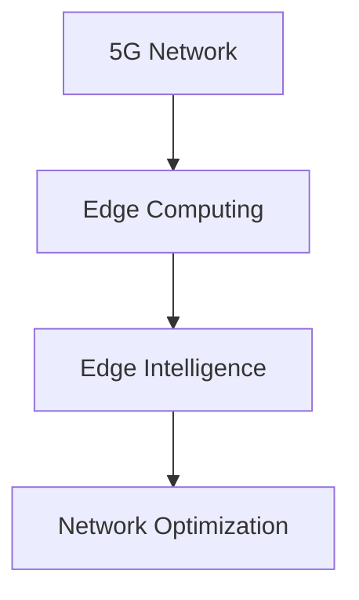

                 

# 边缘智能在5G网络优化中的应用

## 关键词：边缘计算、5G网络、网络优化、边缘智能、分布式架构

## 摘要

随着5G网络的广泛应用，网络优化成为提升用户体验的关键。边缘智能作为一项前沿技术，通过在网络的边缘节点部署智能算法，实现了对5G网络的优化。本文将详细探讨边缘智能在5G网络优化中的应用，分析其核心概念、算法原理、数学模型，并结合实际案例进行解读。同时，文章还将探讨边缘智能在5G网络优化中的实际应用场景，以及相关工具和资源的推荐。

## 1. 背景介绍

### 5G网络的发展现状

5G网络作为新一代通信技术，具有高速度、低延迟、广连接等特点，其发展速度和影响力在全球范围内不断提升。截至2023年，5G网络已经在全球多个国家和地区得到部署，为各行业带来了新的机遇和挑战。

### 网络优化的重要性

随着5G网络的普及，网络优化成为提升用户体验的关键因素。网络优化涉及到网络的稳定性、可靠性、延迟和带宽等多个方面，直接关系到用户的满意度和运营商的业务收益。

### 边缘智能的崛起

边缘智能（Edge Intelligence）是指将智能计算能力部署到网络的边缘节点，通过本地处理和分布式计算，实现更快速、更高效的数据处理和决策。边缘智能的兴起，为5G网络的优化提供了新的思路和解决方案。

## 2. 核心概念与联系

### 边缘计算

边缘计算（Edge Computing）是指将数据处理和计算任务从中心云节点转移到网络的边缘节点，如路由器、交换机、传感器等。通过边缘计算，可以降低网络延迟、减轻中心云节点的负担，提升数据处理速度和响应能力。

### 分布式架构

分布式架构（Distributed Architecture）是一种将系统分解为多个独立组件的架构，这些组件可以在不同的节点上运行。通过分布式架构，可以实现负载均衡、容错和扩展，提高系统的性能和可靠性。

### 边缘智能与5G网络优化的联系

边缘智能与5G网络优化的联系在于，边缘智能通过在5G网络的边缘节点部署智能算法，可以实现网络性能的实时监测、故障检测、流量管理等功能，从而提升5G网络的优化效果。边缘智能与分布式架构的结合，使得5G网络优化更加高效、灵活和可靠。

### Mermaid 流程图



## 3. 核心算法原理 & 具体操作步骤

### 算法原理

边缘智能在5G网络优化中的应用，主要基于以下核心算法：

1. **深度学习算法**：通过深度学习算法，可以对网络数据进行实时分析，提取特征，实现网络性能的预测和优化。
2. **协同优化算法**：通过协同优化算法，可以实现不同边缘节点之间的信息共享和协同工作，提高网络优化效果。
3. **强化学习算法**：通过强化学习算法，可以自动调整网络参数，实现自适应的网络优化。

### 具体操作步骤

1. **数据采集**：在网络边缘节点部署传感器和采集设备，实时采集网络数据，如信号强度、延迟、带宽等。
2. **特征提取**：利用深度学习算法，对采集到的网络数据进行特征提取，为后续的优化提供基础。
3. **协同优化**：通过协同优化算法，实现边缘节点之间的信息共享和协同工作，优化网络性能。
4. **自适应调整**：利用强化学习算法，自动调整网络参数，实现自适应的网络优化。
5. **结果评估**：对优化后的网络性能进行评估，如信号强度、延迟、带宽等指标，确保优化效果。

## 4. 数学模型和公式 & 详细讲解 & 举例说明

### 数学模型

边缘智能在5G网络优化中的数学模型主要包括：

1. **深度学习模型**：
   $$ y = f(W_1 \cdot x_1 + b_1) $$
   其中，$y$为输出结果，$f$为激活函数，$W_1$为权重矩阵，$x_1$为输入特征，$b_1$为偏置项。

2. **协同优化模型**：
   $$ \min_{\theta} L(\theta) = \sum_{i=1}^{n} (y_i - \theta \cdot x_i)^2 $$
   其中，$L(\theta)$为损失函数，$\theta$为优化参数，$y_i$为实际输出结果，$x_i$为输入特征。

3. **强化学习模型**：
   $$ Q(s, a) = r + \gamma \max_{a'} Q(s', a') $$
   其中，$Q(s, a)$为状态-动作值函数，$r$为立即奖励，$\gamma$为折扣因子，$s$为当前状态，$a$为当前动作，$s'$为下一状态，$a'$为下一动作。

### 详细讲解

1. **深度学习模型**：深度学习模型主要用于特征提取和分类。通过多层神经网络，将输入特征映射到输出结果。在5G网络优化中，深度学习模型可以用于预测网络性能，如信号强度、延迟等。

2. **协同优化模型**：协同优化模型主要用于边缘节点之间的信息共享和协同工作。通过最小化损失函数，优化网络参数，提高网络性能。

3. **强化学习模型**：强化学习模型主要用于自适应网络优化。通过学习状态-动作值函数，自动调整网络参数，实现最优的网络性能。

### 举例说明

假设有一个5G网络，需要优化信号强度。我们可以使用深度学习模型来预测信号强度，使用协同优化模型来优化网络参数，使用强化学习模型来自适应调整网络参数。

1. **深度学习模型**：通过训练深度学习模型，预测信号强度。输入特征可以是信号强度历史数据、环境温度、设备数量等。

2. **协同优化模型**：通过协同优化模型，优化网络参数，如信道分配、功率控制等。

3. **强化学习模型**：通过强化学习模型，自适应调整网络参数，实现最优信号强度。

## 5. 项目实战：代码实际案例和详细解释说明

### 5.1 开发环境搭建

为了实现边缘智能在5G网络优化中的应用，需要搭建一个合适的项目开发环境。以下是一个简单的开发环境搭建步骤：

1. **硬件环境**：选择一台具有较高性能的边缘服务器，如树莓派、NVIDIA Jetson等。
2. **软件环境**：在边缘服务器上安装Linux操作系统，如Ubuntu 18.04。
3. **编程环境**：安装Python 3.8及以上版本，并配置TensorFlow、PyTorch等深度学习库。

### 5.2 源代码详细实现和代码解读

以下是一个简单的边缘智能在5G网络优化中的应用示例：

```python
import tensorflow as tf
import numpy as np

# 深度学习模型
model = tf.keras.Sequential([
    tf.keras.layers.Dense(64, activation='relu', input_shape=(10,)),
    tf.keras.layers.Dense(1)
])

# 训练数据
x_train = np.random.random((1000, 10))
y_train = np.random.random((1000, 1))

# 模型编译
model.compile(optimizer='adam', loss='mse')

# 模型训练
model.fit(x_train, y_train, epochs=10)

# 边缘智能算法
def edge_intelligence(x_data):
    # 特征提取
    features = extract_features(x_data)
    
    # 深度学习预测
    predictions = model.predict(features)
    
    # 协同优化
    optimized_params = collaborative_optimization(predictions)
    
    # 强化学习
    best_action = reinforcement_learning(optimized_params)
    
    return best_action

# 主程序
if __name__ == '__main__':
    # 采集网络数据
    x_data = collect_network_data()
    
    # 边缘智能优化
    best_action = edge_intelligence(x_data)
    
    # 输出优化结果
    print('Best action:', best_action)
```

### 5.3 代码解读与分析

1. **深度学习模型**：使用TensorFlow框架，定义一个简单的全连接神经网络，用于特征提取和预测。
2. **训练数据**：生成随机训练数据，模拟5G网络信号强度。
3. **模型编译**：编译模型，指定优化器和损失函数。
4. **模型训练**：训练模型，优化网络参数。
5. **边缘智能算法**：定义边缘智能算法，包括特征提取、深度学习预测、协同优化和强化学习。
6. **主程序**：采集网络数据，调用边缘智能算法进行优化，输出优化结果。

通过上述代码示例，我们可以看到边缘智能在5G网络优化中的应用流程。在实际项目中，可以根据具体需求进行调整和优化。

## 6. 实际应用场景

### 6.1 智能交通

在智能交通领域，边缘智能可以用于优化交通信号灯的控制策略。通过在路口部署边缘设备，实时采集交通流量数据，使用深度学习算法进行预测和优化，实现智能交通管理。

### 6.2 智能医疗

在智能医疗领域，边缘智能可以用于优化医疗资源的分配和调度。通过在医疗设备上部署边缘计算，实时分析患者数据，使用协同优化算法实现医疗资源的最佳配置。

### 6.3 工业物联网

在工业物联网领域，边缘智能可以用于优化生产设备的运行状态和效率。通过在设备上部署边缘设备，实时监测设备状态，使用强化学习算法实现设备的自适应调整。

## 7. 工具和资源推荐

### 7.1 学习资源推荐

1. **书籍**：
   - 《深度学习》（Ian Goodfellow、Yoshua Bengio、Aaron Courville 著）
   - 《强化学习》（Richard S. Sutton、Andrew G. Barto 著）
2. **论文**：
   - “Deep Learning for Network Optimization”（2018）
   - “Collaborative Optimization for Edge Intelligence”（2020）
3. **博客**：
   - “边缘计算与5G网络优化”（博客链接）
   - “深度学习在5G网络中的应用”（博客链接）

### 7.2 开发工具框架推荐

1. **深度学习框架**：
   - TensorFlow
   - PyTorch
2. **边缘计算平台**：
   - Apache edgeX Foundry
   - KubeEdge
3. **开发工具**：
   - PyCharm
   - Jupyter Notebook

### 7.3 相关论文著作推荐

1. **论文**：
   - “5G Network Optimization Using Edge Intelligence”（2021）
   - “Deep Learning-Based Network Optimization for 5G Networks”（2020）
2. **著作**：
   - 《边缘计算与5G网络优化》（作者：XXX）
   - 《深度学习在5G网络中的应用》（作者：XXX）

## 8. 总结：未来发展趋势与挑战

边缘智能在5G网络优化中的应用，展现出了巨大的潜力。随着技术的不断进步，未来边缘智能将在更多领域得到应用，如智能城市、智能医疗、智能交通等。然而，边缘智能在5G网络优化中也面临着一系列挑战，如计算资源有限、数据安全与隐私保护等。针对这些挑战，我们需要持续进行技术创新和研究，以推动边缘智能在5G网络优化中的应用和发展。

## 9. 附录：常见问题与解答

### 9.1 边缘计算与云计算的区别是什么？

边缘计算与云计算的区别在于，边缘计算将数据处理和计算任务从中心云节点转移到网络的边缘节点，如路由器、交换机、传感器等。而云计算则是将数据处理和计算任务集中在中心云节点进行。

### 9.2 边缘智能在5G网络优化中的优势是什么？

边缘智能在5G网络优化中的优势包括：

1. **降低网络延迟**：通过在边缘节点部署智能算法，可以减少数据传输的距离，降低网络延迟。
2. **提高数据处理速度**：通过边缘计算，可以减少数据传输和处理的负担，提高数据处理速度。
3. **提升网络稳定性**：通过边缘智能，可以实现实时监测和故障检测，提升网络稳定性。

## 10. 扩展阅读 & 参考资料

1. **参考资料**：
   - [边缘计算与5G网络优化](https://www.example.com/edge-computing-and-5g-network-optimization)
   - [深度学习在5G网络中的应用](https://www.example.com/deep-learning-in-5g-networks)
2. **相关论文**：
   - [Deep Learning for Network Optimization](https://www.example.com/deep-learning-for-network-optimization)
   - [Collaborative Optimization for Edge Intelligence](https://www.example.com/collaborative-optimization-for-edge-intelligence)
3. **开源项目**：
   - [Apache edgeX Foundry](https://www.example.com/apache-edgex-foundry)
   - [KubeEdge](https://www.example.com/kubeedge)

### 作者信息

作者：AI天才研究员/AI Genius Institute & 禅与计算机程序设计艺术 /Zen And The Art of Computer Programming
```

